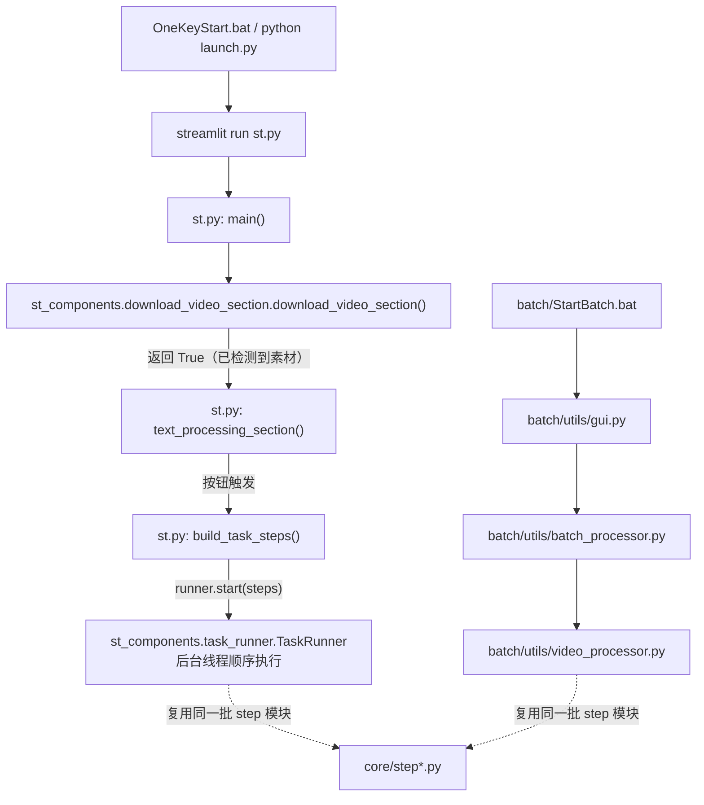
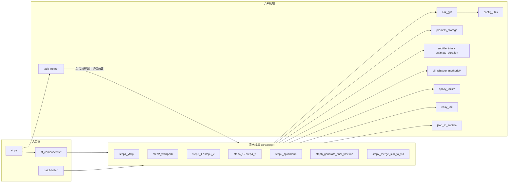

# 项目总览与架构

VideoLingo 是一个「视频翻译 + 字幕生成」工具：输入一个视频（或 YouTube 链接，或纯音频文件），输出带原语言/目标语言字幕的视频。核心卖点是 **词级时间轴对齐 + LLM 按句意重切分 + Netflix 标准单行字幕**。

> 📌 **配音（Dubbing）链路已在重构 Round 1 中整体删除**：`step8~step12`、`core/all_tts_functions/`、`delete_retry_dubbing.py` 均已移除。
> 现在只有**单阶段字幕链路**。变更明细见 [`../05-guides/04-已知问题与技术债.md`](../05-guides/04-已知问题与技术债.md)。

当前代码版本：`config.yaml: version: "2.1.2"`（本项目是上游 VideoLingo 的二次开发分支，见文末「与上游的差异」）。

---

## 一、技术栈

| 层次 | 技术 | 用途 | 代码位置 |
| --- | --- | --- | --- |
| 交互层 | Streamlit | 单页 Web UI | `st.py`、`st_components/` |
| 任务执行 | 后台线程（自研 `TaskRunner`） | 在 worker 线程里顺序跑步骤，支持暂停/继续/停止 | `st_components/task_runner.py`、`st.py: task_control_panel()` |
| 批处理 | Streamlit（第二套独立页面） | 无人值守批量跑视频 | `batch/utils/gui.py` |
| ASR | WhisperX（faster-whisper 后端）+ 火山引擎 ASR | 词级时间轴转写 | `core/step2_whisperX.py` |
| 人声分离 | Demucs | （可选）提取人声轨改善转写 | `core/all_whisper_methods/demucs_vl.py` |
| NLP | spaCy（`*_core_*_md` 模型） | 无标点/长句的初步切分 | `core/spacy_utils/` |
| LLM | OpenAI 兼容 API（DeepSeek / Qwen / SiliconFlow / Ollama） | 句子切分、术语总结、翻译、字幕压缩 | `core/ask_gpt.py` |
| 朗读时长估算 | syllables / pypinyin / g2p-en | 判断译文是否需要压缩 | `core/estimate_duration.py`、`core/subtitle_trim.py` |
| 音频/视频 | FFmpeg / ffprobe（根目录自带 `ffmpeg.exe`）、librosa | 转码、切分、压制、时长探测 | 各 `core/step*.py`、`core/all_whisper_methods/whisperX_utils.py` |
| 缓存 | 内容寻址 JSON 缓存 | 按「媒体内容 + ASR 设置」复用转写结果 | `core/all_whisper_methods/transcription_cache.py`（`.cache/asr/`） |
| 数据交换 | pandas + openpyxl（xlsx）、json、srt 文本 | 步骤间传参（**磁盘即数据总线**） | `output/log/`、`output/audio/` |
| 配置 | ruamel.yaml（保留注释与引号）+ 环境变量覆盖 | `config.yaml` 读写 | `core/config_utils.py` |
| 安装/启动 | 标准库 `argparse` + `subprocess` | 安装体检、启动预检与运行日志 | `installer.py`、`launch.py`、`install.py`（兼容包装） |

---

## 二、目录职责表

| 路径 | 职责 | 是否可删/可换 |
| --- | --- | --- |
| `st.py` | Web 主入口，组装步骤表并交给 `TaskRunner` | 核心 |
| `st_components/` | Streamlit 侧边栏设置、下载区块、通用工具、CSS 与 `task_runner.py` | 核心（替换 UI 时可整体替换） |
| `core/` | 全部流水线逻辑，`stepN_*.py` 的 N 即执行顺序 | 核心 |
| `core/all_whisper_methods/` | ASR 适配层（WhisperX / 火山）、Demucs、TOS 对象存储、转录缓存 | 可增删引擎 |
| `core/spacy_utils/` | spaCy 切分工具集 | 可替换（换成 LLM 切分） |
| `core/subtitle_trim.py` | 按朗读时长压缩译文（`step4_2` 复用） | 核心 |
| `core/estimate_duration.py` | 音节级朗读时长估算 | 核心 |
| `batch/` | 批量模式：GUI + 批处理器 + 批相关工具 | 独立子系统 |
| `AudioExtract/` | 独立的「批量提取音频」小工具（与主流程无关） | 完全独立 |
| `installer.py` | 安装 + 体检（`--check`），按 CPU/CUDA 真正选择 torch wheel | 环境相关 |
| `launch.py` | 启动前预检（缺包 / 缺 ffmpeg / 端口占用）+ 写 `logs/videolingo_<时间戳>.log` | 环境相关 |
| `install.py` | **兼容包装**：转调 `installer.py --launch`，保留旧启动器与文档里的调用方式 | 环境相关 |
| `tests/` | 标准库 `unittest` 回归测试（46 例，无需重依赖） | 测试 |
| `logs/` | `launch.py` 每次启动写下的一份运行日志 | 可删 |
| `.cache/asr/` | 内容寻址的转录缓存（**故意放在 `output/` 之外**，不随归档清空） | 可删（会重新识别） |
| `docs/` | Next.js（Nextra）官网文档站，面向用户，非工程文档 | 与主流程无关 |
| `devdocs/` | **本目录**：面向开发者的工程文档 | — |
| `参考文档/` | 火山引擎 ASR / TOS 的原始 API 文档（中文） | 参考资料 |
| `offline_packages/` | 离线依赖包缓存（安装用） | 依赖相关 |
| `_model_cache/` | HuggingFace 模型缓存（`config.yaml: model_dir`），含 faster-whisper 与 Belle 中文模型 | 可删（会重新下载） |
| `output/` | **运行时工作目录**：下载的视频/音频、输入清单、日志、字幕、成片 | 可删（下次重新跑） |
| `history/` | 归档目录，`core/onekeycleanup.py: cleanup()` 把 `output/` 整体搬进去 | 可删 |
| `custom_terms.xlsx` | 用户自定义术语表（三列：src/tgt/note） | 数据文件 |
| `config.yaml` | **本地**配置文件（含真实密钥，已被 `.gitignore` 忽略） | 核心，不入库 |
| `config.example.yaml` | 配置模板（密钥为占位符，入库）；首次运行自动复制为 `config.yaml` | 核心 |
| `ffmpeg.exe`、`torch-*.whl` | 本地二进制资源 | 见 `06-batch-and-tools/02-安装脚本与依赖.md` |

> 💡 关键认知：**这个项目用「文件系统」当步骤间的数据总线**。没有数据库、没有消息队列、没有服务化拆分；每一步读上游写下的文件、写下自己的文件。理解 `output/` 下的产物就理解了一半代码。

---

## 三、进程与执行模型

三条执行路径**共享同一份 `core/` 实现**，区别只在编排方式与目录约定：

| 路径 | 入口 | 并发 | 状态 | 典型用途 |
| --- | --- | --- | --- | --- |
| 交互式 | `st.py` | 单视频串行；流水线跑在 `TaskRunner` 的后台线程里（可暂停/继续/停止） | `st.session_state` 无持久化，靠文件存在性判断阶段完成 | 调试、单条视频 |
| 批处理 | `batch/`（**第二个 Streamlit 应用**） | 多视频串行，**无线程** | 任务表 `batch/tasks_setting.xlsx` | 无人值守、夜间跑量 |
| 单步脚本 | `python -m core.stepN_xxx` | 单步 | 无 | 定位问题、重跑某一步 |

> ⚠️ **两种模式共用同一个工作目录 `output/`，不能同时使用**。批量模式处理每个视频前会清空项目根的 `output/`（`batch/utils/video_processor.py:27` 调用 `prepare_output_folder()`，真正的 `shutil.rmtree` 在同文件 `:134-137`），会把单次模式的中间产物直接删掉。这也是转录缓存刻意放在 `output/` 之外（`.cache/asr/`）的原因之一。
> （批量模式对自己上一批的 `batch/output/` 现已改为**归档**而非删除，见 [`../05-guides/04-已知问题与技术债.md`](../05-guides/04-已知问题与技术债.md) P3-34。）

⚠️ **重要约束**：所有 `core/` 代码使用**相对路径**（`output/...`、`config.yaml`、`custom_terms.xlsx`），因此**当前工作目录必须是项目根目录**。`st.py` 开头把项目根加进 `sys.path` 与 `PATH`（后者为了让 `ffmpeg` 命令命中根目录的 `ffmpeg.exe`）。

---

## 四、模块依赖图（谁调用谁）

跨步骤的非线性依赖（**改动时容易踩的点**）：

| 被依赖者 | 依赖者 | 依赖内容 |
| --- | --- | --- |
| `core/subtitle_trim.check_len_then_trim` | `step4_2_translate_all` | 翻译后按朗读时长压缩译文（依赖 `speed_factor.max` 与 `min_trim_duration`） |
| `step6_generate_final_timeline.align_timestamp` | `step4_2_translate_all` | 翻译阶段就调用一次对齐来产出 `translation_results.xlsx` |
| `step3_2_splitbymeaning.split_sentence` | `step5_splitforsub` | 字幕超长时复用 LLM 切句 |
| `step7_merge_sub_to_vid.check_gpu_available` | 内部使用（判断是否用 `h264_nvenc`） | — |
| `core/config_utils.get_source_language`（`:143`） | `prompts_storage`（5 处）、`spacy_utils/load_nlp_model.py`、`spacy_utils/split_by_mark.py`、`spacy_utils/split_long_by_root.py`、`step3_2`、`step5` | 源语言的**唯一判定点**：以 `whisper.language` 为准，仅 `auto` 时回退 `whisper.detected_language`，都不可用则 `ValueError` |
| `core/step1_ytdlp.find_media_file`（`:240`） | `step2`、`step7`、`onekeycleanup`、`st_components/download_video_section.py` | 定位源媒体并区分音频/视频（先读 `output/input_manifest.json`，没有才回退扩展名扫描） |
| `st_components/task_runner.TaskRunner.check_cancel`（`:58`） | 经 `easy_util.check_cancel()`（`easy_util.py:231`）被 `step2` 分段循环等长循环调用 | 暂停时阻塞、停止时抛 `StopTask`；没有活跃 runner 时是空操作 |
| `step1_ytdlp.find_video_files` | `onekeycleanup`、`step2`、`step7` | 定位源视频（0 个报错、多个取最新并告警） |
| `easy_util` 全局统计 | `ask_gpt`、`step6`、`st.py`、`batch/` | token / 耗时 / 进度全局累加 |

---

## 五、核心设计原则

1. **磁盘即契约**：每个步骤的输出文件就是下一步的输入。文件名与列名是隐式接口，改文件名等于破坏 API。
2. **存在即跳过（幂等）**：每个 step 开头检查自己的产物是否存在，存在则直接返回。这带来"断点续跑"能力，也带来"改了参数但结果不更新"的坑。
3. **配置即开关**：`transcription_only`、`demucs`、`asr_engine`、`resolution`、`subtitle.align_on_mismatch` 等键直接改变流程走向，代码里到处是 `load_key(...)` 分支。
4. **失败重试在局部**：LLM 调用（`ask_gpt`）有内建重试并把失败原因回注给模型；流水线本身**没有**统一的异常恢复与事务。
5. **人工介入点**：`pause_before_translate` 允许在术语提取后暂停，由用户在页面上确认术语再继续。暂停由 `st_components/task_runner.py: TaskRunner.request_review_pause()`（`:81`）从 worker 线程发起，UI 按 `paused_for_review` 标记渲染确认界面（两段式，非 `input()`）。
6. **密钥不落库**：`config.yaml` 被 gitignore，模板是 `config.example.yaml`；密钥也可由 `VIDEOLINGO_*` 环境变量提供。
7. **缓存分两层，存活范围不同**：LLM 结果缓存在 `output/gpt_log/<log_title>.json`（随 `output/` 归档而失效）；ASR 结果缓存在 `.cache/asr/<key>/<part>.json`（**在 `output/` 之外**，只有换模型/换引擎/改识别语言/换源文件内容才失效）。清 `output/` 不能清掉后者。
8. **协作式取消**：长循环在检查点调用 `easy_util.check_cancel()`（`easy_util.py:231`）；它惰性导入 `TaskRunner`，因此 `core/` 不反向依赖 Streamlit，命令行单跑时是空操作。

---

## 六、主链路（一句话版）

**字幕链路**：下载视频（或上传视频/音频）→ 写 `output/input_manifest.json` → 抽音频 → （可选 Demucs）→ ASR 词级转写 `cleaned_chunks.xlsx` → spaCy+LLM 按句意重切 → LLM 总结术语 → LLM 三步翻译 → 按字幕长度限制再切 → 词级时间戳回填生成 SRT → 压制到视频 `output_sub.mp4`（**输入是音频时跳过压制**，只交字幕文件）

> 📌 输入类型由 `core/step1_ytdlp.find_media_file()`（`:240`）判定：优先读 `output/input_manifest.json`，没有清单才按扩展名回退。上传音频不再被包成 `black_screen.mp4`。

> 📌 原「配音链路」（step8~step12）已整体删除。若将来需要恢复，git 历史中重写前的 devdocs 文档保留了完整的链路说明与踩坑记录。

详细步骤见 [`02-pipeline/00-流水线总览.md`](../02-pipeline/00-流水线总览.md)。

---

## 七、与上游 VideoLingo 的差异（本分支的二次开发内容）

依据根目录 `README.md:51-67`（项目自述的改进清单）与 git log：

| 改进 | 相关代码 |
| --- | --- |
| 一键切换模型 API 配置 | `st_components/sidebar_setting.py`（多套 API 预设） |
| 统计并显示耗时与 token 消耗 | `easy_util.py`、`core/step6_generate_final_timeline.py: record_summary_info()` |
| 打包字幕名优化、附带转录文本 | `st_components/imports_and_utils.py: download_subtitle_zip_button()` |
| 支持 qwen 系列模型 | `config.yaml: llm_support_json`、`st_components/sidebar_setting.py` |
| 批量模式支持指定目录 / 跳过已翻译 / GUI | `batch/` 整个目录 |
| 新增韩语、葡萄牙语 | `config.yaml: spacy_model_map`、`language_split_*` |
| 火山引擎 ASR + TOS 对象存储 | `core/all_whisper_methods/volcano_asr.py`、`tos_service.py` |
| 仅转录模式（不翻译） | `config.yaml: transcription_only`、`core/step4_2_translate_all.py` |
| 独立批量音频提取工具 | `AudioExtract/` |
| **删除配音链路**（本分支重构 Round 1） | 见 [`../05-guides/04-已知问题与技术债.md`](../05-guides/04-已知问题与技术债.md) |
| **密钥模板化 + 环境变量覆盖** | `config.example.yaml`、`core/config_utils.py: load_key()` |
| **移植上游 3.0.4 的可移植改动**（源语言统一解析、转录缓存、任务暂停/停止、`installer.py`/`launch.py` 等） | 见 [`../05-guides/06-上游3.0.4合并记录.md`](../05-guides/06-上游3.0.4合并记录.md) |

> 💡 由于是二次开发分支，演进时请优先在本目录记录差异，避免与上游文档混淆。

---

## 八、扩展点（架构级）

- **换掉 Streamlit**：把 `st.py` 的编排层（`main()`、`text_processing_section()`、`build_task_steps()`）替换为 CLI/服务即可，`core/` 不依赖 streamlit（`core/` 内无 streamlit import；`easy_util.check_cancel()` 也是惰性导入）。
- **换掉任务执行器**：`TaskRunner` 只要求「`[(标签, 无参可调用对象)]` + 一个能响应 `check_cancel()` 的 core 侧钩子」，因此可以整体替换为别的调度实现而不动 `core/`。
- **服务化/分布式**：由于步骤间只靠文件通信，最自然的方式是把每个 step 包成一个"读上游产物 → 写下游产物"的任务单元；难点是 `easy_util` 的进程内全局状态。
- **加入新的输出 modality**（如配音后重新对齐字幕）：在 `step6` 之后新增分支步骤，参考 `05-guides/03-如何新增一个流水线步骤.md`。

---

## 十、相关文档

- [`02-数据流与中间产物.md`](02-数据流与中间产物.md) — 每个文件的字段与消费者
- [`03-快速上手与调试.md`](03-快速上手与调试.md) — 环境、启动、单步调试
- [`04-术语与概念表.md`](04-术语与概念表.md) — cleaned_chunks / chunk / segment 等术语
- [`../02-pipeline/00-流水线总览.md`](../02-pipeline/00-流水线总览.md) — step1~step12 明细
- [`../04-interfaces/01-配置文件与参数.md`](../04-interfaces/01-配置文件与参数.md) — 全部配置键
- [`../05-guides/06-上游3.0.4合并记录.md`](../05-guides/06-上游3.0.4合并记录.md) — 本次合并移植了什么、拒绝了什么
- [`../05-guides/07-合并后排错速查.md`](../05-guides/07-合并后排错速查.md) — 合并引入的行为变化对应的症状表
