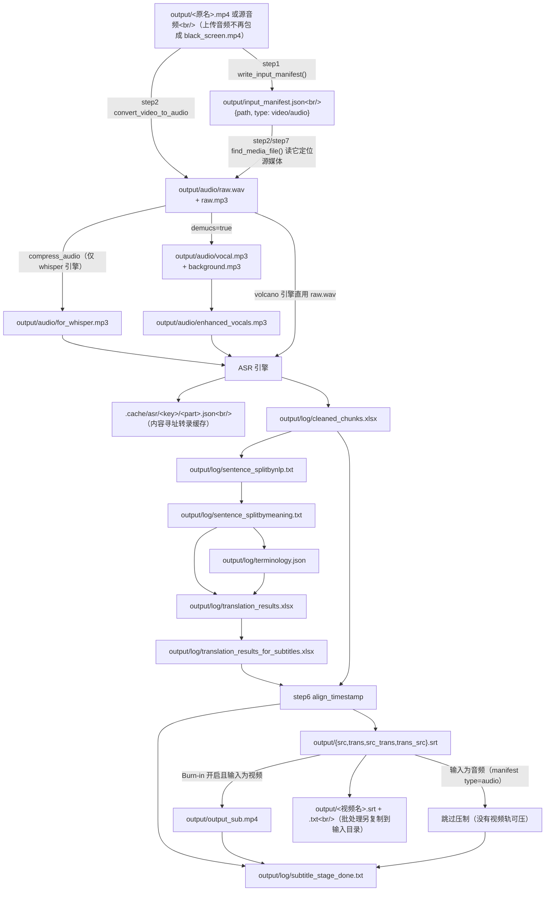
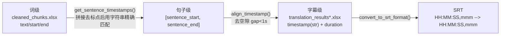

# 数据流与中间产物

本文是**接手项目最该先看的一页**：它把「谁写下哪个文件、谁读它、里面有哪些列」画成一张表。该项目没有数据库，**文件系统就是步骤间的 API**——记住产物路径与列名，就掌握了 80% 的调用契约。

---

## 一、职责与边界

本文只描述**落盘产物的契约与流转**，不解释算法细节。算法细节见 `02-pipeline/` 下各文档；产物被哪些 UI 按钮触发见 `04-interfaces/02-Streamlit界面组件.md`。

---

## 二、完整产物地图



---

## 三、产物清单（按生成顺序）

### 3.1 原始素材与音频

| 产物路径 | 生成者 | 消费者 | 格式规格 | 幂等跳过条件 |
| --- | --- | --- | --- | --- |
| `output/<title>.<ext>` | `core/step1_ytdlp.py: download_video_ytdlp()` 或用户上传 | `step2`、`step7` | 用户原始分辨率（视频）或原始音频 | 不跳过（`find_video_files()` 要求唯一；多个时取最新并告警） |
| `output/input_manifest.json` | `core/step1_ytdlp.py: write_input_manifest()`（下载后 / 上传落盘后各调一次） | `find_media_file()`、`is_audio_only_input()`、`step7` | `{"path": str, "type": "video" / "audio"}` | 由下载/上传覆盖写；指向的文件不存在即视为失效并回退到扩展名扫描 |
| `output/<title>.jpg` | yt-dlp 缩略图后处理 | 无（仅留存） | jpg | — |
| `output/audio/raw.wav` | `whisperX_utils.convert_video_to_audio()` | 火山 ASR（`demucs=false` 时直接送识别） | 16 kHz / 单声道 / `pcm_s16le`，带 `-af aresample=async=1:first_pts=0` | 文件存在 |
| `output/audio/raw.mp3` | 同上（**直接从源媒体编码**，不再由 `raw.wav` 转出） | Demucs、`compress_audio()` 的输入 | 32000 Hz / 128 kbps / 单声道；无 `libmp3lame` 时回退 32 kHz WAV(PCM) | 文件存在 |
| `output/audio/for_whisper.mp3` | `whisperX_utils.compress_audio()` | WhisperX 转写 | 16 kHz / 96 kbps / 单声道；无 `libmp3lame` 时回退 16 kHz WAV(PCM) | 文件存在。**仅 `asr_engine=whisper` 时生成**，批处理的预处理缓存清单据此区分 |
| `output/audio/vocal.mp3`、`output/audio/background.mp3` | `demucs_vl.demucs_main()` | `enhanced_vocals.mp3`（人声）；`background.mp3` 已无消费者（原配音混音用） | htdemucs 输出，mp3 / 128 kbps | `vocal.mp3` 与 `background.mp3` **同时**存在才跳过 |
| `output/audio/enhanced_vocals.mp3` / `.wav` | `core/step2_whisperX.py: enhance_vocals()`（`:345`） | ASR（人声按实测电平归一到 −20 dBFS 后送识别，增益由 `compute_normalization_gain()` 峰值受限） | mp3（whisper）/ 16 kHz WAV（volcano） | — |

> 📌 `output/black_screen.mp4` 是**历史产物**：早期「上传音频」会把音频用 ffmpeg 包成 640×360 黑底视频再走完整流程，现已改为写 `output/input_manifest.json`（`st_components/download_video_section.py:97-98`）。
> `core/step1_ytdlp.py: is_audio_placeholder()` 仍会把它识别成纯音频，`step7` 在 `resolution=0x0` 时原样保留为成片，因此旧目录不会被新代码弄坏。

### 3.2 文本处理链路（核心）

| 产物路径 | 生成者 | 消费者 | 关键结构 | 幂等跳过条件 |
| --- | --- | --- | --- | --- |
| `output/log/cleaned_chunks.xlsx` | `whisperX_utils.save_results()` | `step4_2`、`step6` | 3 列：`text` / `start` / `end`（**词级**，`text` 值带双引号） | **整个 step2 的跳过依据** |
| `output/log/sentence_splitbynlp.txt` | `step3_1_spacy_split.split_by_spacy()`（四步 NLP 链） | `step3_2` | 每行一句 | 存在即跳过整个 step3_1 |
| `output/log/sentence_splitbymeaning.txt` | `step3_2_splitbymeaning.split_sentences_by_meaning()` | `step4_1`、`step4_2` | 每行一句（已按 LLM 语义重切） | 无 |
| `output/log/terminology.json` | `step4_1_summarize.get_summary()` | `step4_2`（`search_things_to_note_in_prompt`、`topic`） | `{"topic": str, "terms": [{"src","tgt","note"}]}` | 无（直通模式下由 `st.py: ensure_terminology_file()` 建空壳） |
| `output/log/translation_results.xlsx` | `step4_2_translate_all.translate_all()` | `step5` | 正常模式：`Source`、`Translation`、`timestamp`、`duration`；直通模式只有前两列 | **存在即跳过整个 step4_2** |
| `output/log/translation_results_for_subtitles.xlsx` | `step5_splitforsub.split_for_sub_main()` | `step6` | 列：`Source`、`Translation` | 无 |

> ⚠️ `cleaned_chunks.xlsx` 的 `text` 列在写入时被包了一层双引号（`whisperX_utils.save_results()`），下游统一用 `.str.strip('"').str.strip()` 剥掉（`step6`、`step4_2`）。**新增消费者时必须做同样的剥离**，否则句子匹配会全部失败。

### 3.3 字幕与成片

| 产物路径 | 生成者 | 说明 | 幂等跳过条件 |
| --- | --- | --- | --- |
| `output/src.srt` | `step6 align_timestamp()` | 仅原语言（单行/条） | 无 |
| `output/trans.srt` | 同上 | 仅目标语言（单行/条） | 无 |
| `output/src_trans.srt` | 同上 | 原语言在上、译文在下（两行/条） | 无 |
| `output/trans_src.srt` | 同上 | 译文在上、原语言在下（两行/条） | 无 |
| `output/<视频名>.srt` | `pick_default_subtitle()` → 由 UI 下载流程 / `batch/utils/video_processor.save_subbtitles()` 调用 | **默认字幕**，与视频同名。内容来源按模式：翻译模式取 `trans_src.srt`（双语），仅转录模式取 `src.srt`（原语言）；缺失时有兜底退回 | 无 |
| `output/<视频名>.txt` | 同上 | `sentence_splitbymeaning.txt` 的副本，便于后续 AI 总结 | 无 |
| `output/output_sub.mp4` | `step7 merge_subtitles_to_video()`（`:56`） | 硬字幕成片（Burn-in 开启且输入为视频时）；**输入为音频时不产出** | 无 |
| `output/log/subtitle_stage_done.txt` | `step7 _mark_stage_done()`（`:49`） | **UI 判定「字幕阶段完成」的开关**（不再用 `output_sub.mp4` 是否存在，因为 Burn-in 关闭或音频输入时都不产出成片） | 无 |

> 📌 **输入类型决定 `step7` 的行为**（由 `core/step1_ytdlp.find_media_file()` 返回的 `media_type` 区分，清单优先、扩展名兜底）：
> - **音频输入**（`input_manifest.json` 里 `type: "audio"`）→ 在压制之前就返回（`core/step7_merge_sub_to_vid.py:65-68`），只写完成标记、只交字幕文件
> - **真实视频 + `resolution=0x0`** → 完全不生成成片（只出字幕），并顺手删掉上一次遗留的 `output_sub.mp4`，避免误以为这次也压制了
> - **旧路径遗留的 `black_screen.mp4`**（`is_audio_placeholder()` 命中）→ 在 `resolution=0x0` 时原样复制为 `output_sub.mp4`，让你能播放、校对字幕与音频的对齐

### 3.5 日志与统计

| 产物路径 | 生成者 | 结构 | 用途 |
| --- | --- | --- | --- |
| `output/gpt_log/<log_title>.json` | `core/ask_gpt.py: save_log()` | **JSON 数组**，元素 `{model, prompt, response, message}` | ① 审计 ② **LLM 结果缓存**（同 prompt 命中即复用） |
| `output/gpt_log/error.json` | `ask_gpt()` 校验/解析失败时 | 同上 | 排查 LLM 返回格式问题 |
| `output/log/asr_results/volcano_asr_<音频名>_*.json` | `VolcanoASR._save_asr_result_to_json()` | 火山原始结果 + 转换后的 whisper 格式 + `metadata`（含 `audio_file` / `start_offset`） | **火山引擎专属的第二级 ASR 缓存**：改了火山参数后除了删 `cleaned_chunks.xlsx` 还要删这个目录 |
| `.cache/asr/<key>/<part>.json` | `core/all_whisper_methods/transcription_cache.py: write_result()` | `{schema, key, language, result}`；`part` 为 `complete` 或 `f"{start:.2f}_{end:.2f}"` | **第一级、也是唯一跨 `output/` 清理存活**的转录缓存：完整命中时连 Demucs 都跳过（见 4.4） |
| `output/cost.txt` | `easy_util.record_messages()` | 文本：耗时 / prompt tokens / completion tokens / 预计花费 | 在 `step6` 结束时写入（批处理下每个视频一次，会被归档） |
| `history/<video_name>/**` | `core/onekeycleanup.py: cleanup(dir)` | 把 `output/*`、`output/log/*`、`output/gpt_log/*` 搬到指定目录下的 `<video_name>/`、`/log/`、`/gpt_log/` | 归档，为下一个视频腾空 `output/`。单次模式目标是 `history/`，批处理是 `batch/output/` |

> ⚠️ **缓存陷阱**：`output/gpt_log/<log_title>.json` 同时承担"缓存"角色。修改 `core/prompts_storage.py` 里的提示词后，**必须删除对应 log_title 的 json**（如 `summary.json`、`sentence_splitbymeaning.json`、`translation.json`、`align_subs.json`、`subtitle_trim.json`），否则会静默复用旧结果。见 [`../03-subsystems/01-LLM调用与提示词.md`](../03-subsystems/01-LLM调用与提示词.md)。

---

## 四、关键数据结构详解

### 4.1 `cleaned_chunks.xlsx`（词级时间轴，全链路的地基）

```
| text      | start  | end    |
|-----------|--------|--------|
| "Hello"   | 0.512  | 0.744  |
| "world"   | 0.744  | 1.020  |
```

- 由 `whisperX_utils.process_transcription()` 从 WhisperX 的 `result['segments'][*]['words']` 展平而成。
- **单位**：秒（float）。
- **清洗规则**：跳过纯空白词；跳过长度 > 20 字符的词；去掉法文 `»`/`«`；缺失时间戳的词用「前一个词的 end」或「后一个有时间戳的词的 start」补齐（`whisperX_utils.py:227-261`）。
- **落盘时的坑**：`save_results()` 把 `text` 写成 `f'"{x}"'`，即**值里带引号**。

### 4.2 三层时间映射（理解对齐的关键）



匹配算法要点（`core/step6_generate_final_timeline.py:70-112`）：把所有词 `remove_punctuation(word.lower())` 后**无缝拼接**成长串，并记录每个字符位置对应的词下标；对每个句子同样清洗后**去掉空格**，在长串上滑动精确匹配。匹配失败直接 `raise ValueError`（无回退）。

⚠️ 因此：**任何改变 `cleaned_chunks.xlsx` 文本内容或改变句子文本的改动，都可能导致对齐失败**。例如改 `whisperX_utils.process_transcription()` 的清洗规则、或在 `step3` 阶段改动了字符（如插入空格以外的东西）。

### 4.3 SRT 文件约定

由 `generate_subtitle_string()`（`step6_generate_final_timeline.py:142-149`）统一生成：

```
<index>
HH:MM:SS,mmm --> HH:MM:SS,mmm
<第一行>
<第二行（可为空）>

```

- 序号从 **1** 开始且连续。`step6` 自己按 DataFrame 行号生成，其他消费者（如按序号关联双语字幕）依赖这个连续性。
- 双语文件（`src_trans.srt` / `trans_src.srt`）永远是"两行"结构，即使某行内容为空也保留换行。
- 单列文件（`src.srt` / `trans.srt`）**不写空的第二行**——否则块之间会出现 `\n\n\n`，用 `split('\n\n')` 解析会得到首行为空的块（历史缺陷 G/P3-9，已修）。

### 4.4 `.cache/asr/<key>/<part>.json`（内容寻址的转录缓存）

由 `core/all_whisper_methods/transcription_cache.py` 维护，`core/step2_whisperX.py: transcribe()`（`:434`）读写：

- **目录**：仓库根的 `.cache/asr/<key>/`，**在 `output/` 之外**，故意不受 `cleanup()` 影响（避免"归档一下就重复付费识别"）。已被 `.gitignore` 忽略。
- **键 `key`**：`cache_key()`（`:45`）= `sha256(json)`，身份含 `schema`、源媒体**内容** md5、`whisperx`/`faster-whisper`/`demucs` 包版本，以及 `_asr_cache_settings()`（`core/step2_whisperX.py:408`）给出的 `asr_engine` / `model` / `language` / `demucs`；`asr_engine=volcano` 时再加 10 个 `volcano_asr.*` 参数。**不含**密钥、文件名与翻译设置。
- **条目 `part`**：`complete`（整条媒体的合并结果）或 `f"{start:.2f}_{end:.2f}"`（分段结果）。
- **命中行为**：`complete` 命中 → `transcribe()` 直接 `process_transcription()` + `save_results()` 返回，**连 Demucs 人声分离都不跑**；只有部分分段命中 → 在分段循环里逐段复用（`:509-515`），只补缺失的段。
- **失效/清理**：换模型、换引擎、改识别语言、换源文件内容会自动失效（`whisper.cache: false` 可整体关闭）；手工清理用页面上的「♻️ 转录缓存」按钮或 `transcription_cache.clear_cache()`（`:147`）。

> ⚠️ 与 `cleaned_chunks.xlsx` 的关系：删掉 `output/log/cleaned_chunks.xlsx` **不足以**重跑 ASR——只要缓存还在，`step2` 会从 `.cache/asr` 直接重建该 xlsx。要真正重跑必须同时清掉缓存。

---

## 五、目录生命周期

| 目录 | 谁创建 | 谁清空 |
| --- | --- | --- |
| `output/` | 首次下载/转码时 | 单次模式：`cleanup()` 归档到 `history/`；批处理：`video_processor` 每个视频前 `rmtree`，收尾 `cleanup('batch/output')` |
| `output/log/` | 各 step 的 `os.makedirs('output/log', exist_ok=True)` | 随 `output/` 一起被 `cleanup()` 归档 |
| `output/audio/` | `convert_video_to_audio()` | `cleanup()` 把它作为目录整体搬走（不会残留） |
| `history/`（单次） / `batch/output/`（批量） | `cleanup()` | 手动 |
| `.cache/asr/` | `transcription_cache.write_result()`（首次写入某个 key 时 `mkdir(parents=True)`） | **不随 `output/` 清理**：只由 `transcription_cache.clear_cache()`（UI「♻️ 转录缓存」按钮）或手删目录清空 |
| `logs/` | `launch.py: main()`（`:107` 处 `LOG_DIR.mkdir(exist_ok=True)`） | 手动；每次启动新写一个 `videolingo_<时间戳>.log`（文件名由 `log_path()`（`:34`）按时间戳生成），不会被覆盖 |
| `batch/output_archive_<时间戳>/` | 批处理 `archive_previous_batch_output()` | 手动（在 `batch/` 下，已被 .gitignore 覆盖） |

> 💡 `cleanup()` 的实现细节：遍历 `output/*`，跳过名字以 `log`/`gpt_log` 结尾的项，其余（含 `audio/` 目录、视频、srt）整体 `shutil.move`；然后单独搬 `log/`、`gpt_log/`；最后尝试 `os.rmdir` 删除空的 `output/log`、`output/gpt_log`、`output`。见 `core/onekeycleanup.py`。

---

## 六、产物与配置开关的对应关系

| 想只跑一半流程 | 设置 | 效果 |
| --- | --- | --- |
| 只要转录，不翻译 | `transcription_only: true` | `step4_2` 直通：`Translation = Source`；`step4_1` 仍会被 `st.py` 调用？**不会**——`st.py: build_task_steps()`（`:69-82`）在直通分支里只建一个空的 `terminology.json`，不把 `step4_1` 加进步骤表 |
| 只要字幕，不要配音 | 不点「开始处理音频」 | 配音链路完全不执行 |
| 不做视频压制（省时间） | `resolution: '0x0'`（等价于侧边栏 Burn-in 关闭） | `step7` 静默跳过压制：真实视频不产出成片；**音频输入则在更早处就返回**（不产出成片）；旧路径的 `black_screen.mp4` 仍被原样保留为成片 |
| 跳过人声分离 | `demucs: false` | 用 `raw.mp3` 直接转写（不再有人声增强） |
| 跳过重复的 ASR（省时间/费用） | `whisper.cache: true`（默认值，模板里暂无该键，需手工写在 `whisper:` 下） | 身份完全一致时直接复用 `.cache/asr` 结果，连 Demucs 一起跳过（见 4.4） |

---

## 十、相关文档

- [`01-项目总览与架构.md`](01-项目总览与架构.md) — 模块依赖与进程模型
- [`../02-pipeline/00-流水线总览.md`](../02-pipeline/00-流水线总览.md) — 每步的算法与参数
- [`../04-interfaces/01-配置文件与参数.md`](../04-interfaces/01-配置文件与参数.md) — 配置键详解
- [`../05-guides/04-已知问题与技术债.md`](../05-guides/04-已知问题与技术债.md) — 上述路径不一致缺陷的完整清单
- [`../05-guides/06-上游3.0.4合并记录.md`](../05-guides/06-上游3.0.4合并记录.md) — `input_manifest.json` 与 `.cache/asr/` 的来源
- [`../05-guides/07-合并后排错速查.md`](../05-guides/07-合并后排错速查.md) — 缓存三处位置（最容易混）
