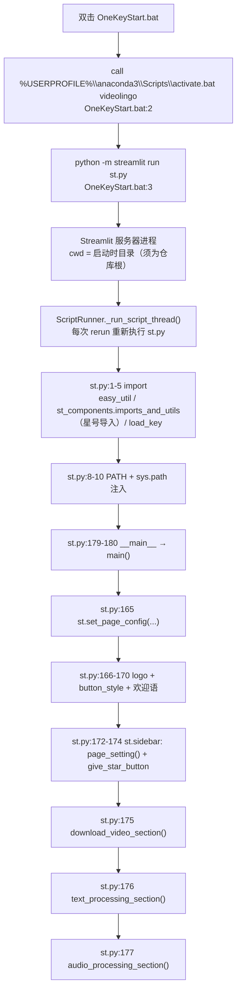
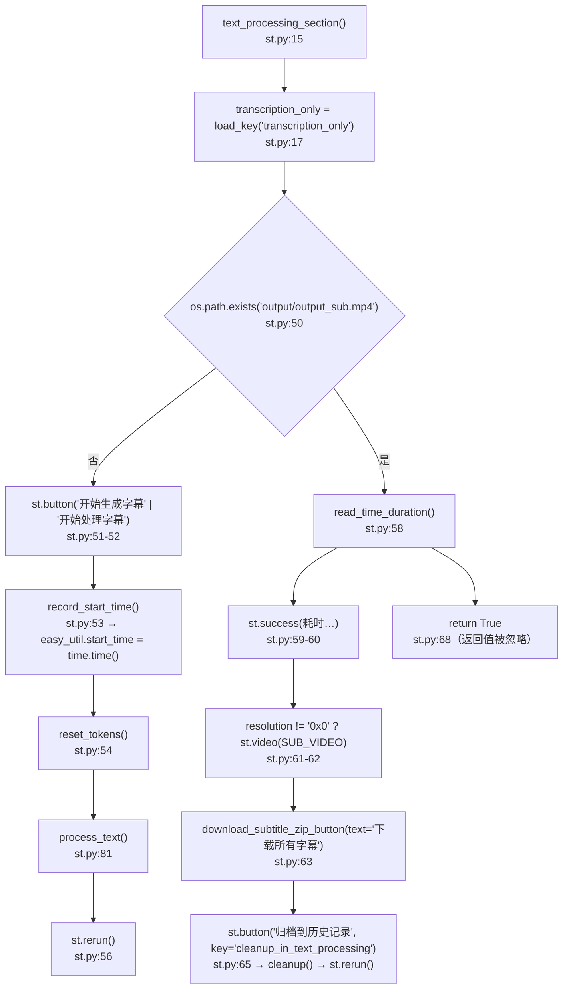
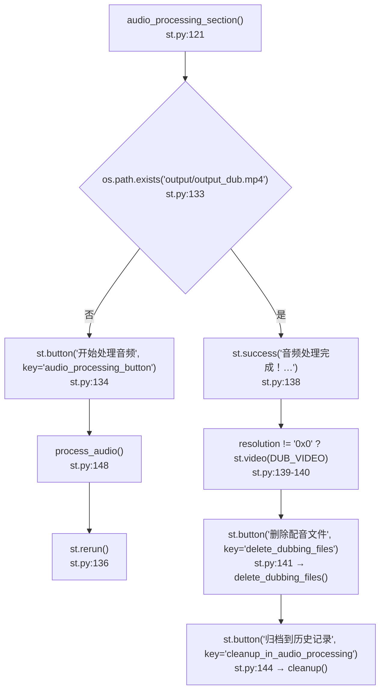
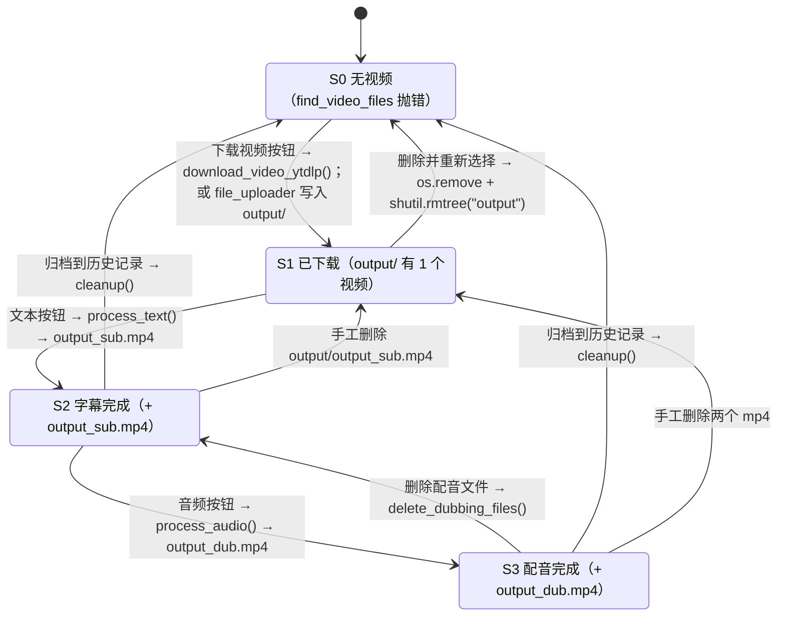

> ## ⚠️ 本文部分内容已在「重构 Round 1」后失效
>
> ⚠️ 本文的「配音区块（audio_processing_section / process_audio）」相关内容已失效——该区块与 step8~step12 一起被删除，`st.py` 现在只有字幕链路。`download_video_section` 与 `text_processing_section` 的描述仍然有效（其中 `pause_before_translate` 已改为 UI 两段式）。


# Streamlit 主应用入口（st.py）

## 一、职责与边界

`st.py` 是 VideoLingo 唯一的 Web 入口：它组装页面骨架（logo、按钮样式、侧边栏、三个内容区块），把 `core/step*.py` 的流水线步骤按阶段串成两个 HTML 按钮，并用「产物文件是否存在」判断阶段是否完成。

它**不**包含任何业务逻辑：转录、切分、翻译、TTS、压制全部在 `core/step*.py` 中实现，`st.py` 只做调用编排与结果展示（视频预览、字幕 zip 下载、归档、删除配音）。

它**不**负责任务调度、进度上报、并发控制、鉴权或异常提示：点击按钮后整个脚本线程被同步阻塞直至该阶段跑完，用户只能看到 `st.spinner` 的静态文案；所有底层报错都只出现在服务器终端。

它**不**保存会话状态：阶段状态完全由 `output/` 下的文件隐式表达（见 §3.5），唯一的进程内状态是 `easy_util` 的模块级全局变量（见 §4.1）。

## 二、文件清单

| 文件路径 | 行数 | 主要职责 |
| --- | --- | --- |
| `st.py` | 180 | 页面骨架、三个区块的渲染、`process_text()` / `process_audio()` 编排、阶段判据 |
| `easy_util.py` | 189 | 进程级全局状态：开始/结束时间、token 计数、费用估算、`original_name`、进度接口 |
| `st_components/imports_and_utils.py` | 201 | 聚合导入 core 全部 step 模块；`download_subtitle_zip_button()`；`copy_as_default_subbtitle()`；`button_style` / `give_star_button` 两段 HTML/CSS |
| `st_components/download_video_section.py` | 76 | 下载或上传视频区块（详见 [`../04-interfaces/02-Streamlit界面组件.md`](../04-interfaces/02-Streamlit界面组件.md)） |
| `st_components/sidebar_setting.py` | 368 | 侧边栏全部配置控件（详见同上文档） |
| `core/onekeycleanup.py` | 81 | `cleanup()`：把 `output/` 全量归档到 `history/<video_name>/` |
| `core/delete_retry_dubbing.py` | 32 | `delete_dubbing_files()`：删除配音产物以支持重试 |
| `core/config_utils.py` | 89 | `load_key / update_key / assign_key / get_joiner`，配置文件为根目录 `config.yaml` |
| `OneKeyStart.bat` | 5 | Windows 一键启动脚本 |
| `.streamlit/config.toml` | 2 | 仅设置 `server.maxUploadSize = 4096` |

## 三、调用链与数据流

### 3.1 启动链路



`install.py:231` 另有等价入口：`subprocess.Popen(["streamlit", "run", "st.py"])`（安装完成后自动拉起）。

### 3.2 为什么需要 `st.py:8-10` 的 PATH / sys.path 注入

| 代码 | 内容 | 原因 |
| --- | --- | --- |
| `st.py:8` | `current_dir = os.path.dirname(os.path.abspath(__file__))` | 仓库根绝对路径（`__file__` 指向 `st.py`） |
| `st.py:9` | `os.environ['PATH'] += os.pathsep + current_dir` | 仓库根目录放着 `ffmpeg.exe`（静态构建，实测 `ffmpeg version N-117740-g7f51cf75c6-20241110`）。全部 core 模块都用**裸命令** `ffmpeg` 调 `subprocess`，例如 `core/step7_merge_sub_to_vid.py:65-86`、`core/step12_merge_dub_to_vid.py:60-78`、`core/step11_merge_full_audio.py:43-51`、`st_components/download_video_section.py:71`。不注入 PATH 就会 `FileNotFoundError`（除非系统级装了 ffmpeg） |
| `st.py:10` | `sys.path.append(current_dir)` | 保证 `easy_util`、`core`、`st_components` 可导入，不依赖 Streamlit 注入的 `sys.path` |

`install.py:53-82` 的 `download_ffmpeg_windows()` 会把 ffmpeg 压缩包解到**当前工作目录**并只给「安装进程」加 `ffmpeg-master-latest-win64-gpl/bin`，该环境变量不会留给后续运行，因此 `st.py` 自己再注入一次。

> ⚠️ **坑**：`st.py:8-10` 是脚本顶层语句，Streamlit 每次 rerun 都会重新执行，于是 `PATH` 会在同一个进程里反复追加同一个 `current_dir`（rerun N 次就有 N 份重复项）。功能上无害，但会持续放大 `os.environ['PATH']`。另外注入发生在 `st.py:3-4` 的重量级 import **之后**，若将来有模块在 import 期就调用 ffmpeg 会失败。

### 3.3 页面组装顺序（`main()`）

| 顺序 | 行号 | 语句 | 作用域 |
| --- | --- | --- | --- |
| 1 | `st.py:165` | `st.set_page_config(page_title="VideoLingo", page_icon="docs/logo.svg")` | 全局（每 session 只能调一次） |
| 2 | `st.py:166-168` | `st.columns([1,1])` + `st.image("docs/logo.png", use_column_width=True)` | 主区第一列 |
| 3 | `st.py:169` | `st.markdown(button_style, unsafe_allow_html=True)` | 全局 `<style>` |
| 4 | `st.py:170` | 欢迎语 HTML（含 `videolingo.io` 外链） | 主区 |
| 5 | `st.py:172-174` | `with st.sidebar:` → `page_setting()` + `st.markdown(give_star_button, ...)` | 侧边栏 |
| 6 | `st.py:175` | `download_video_section()` | 主区区块 1 |
| 7 | `st.py:176` | `text_processing_section()` | 主区区块 2 |
| 8 | `st.py:177` | `audio_processing_section()` | 主区区块 3 |

`st.py` 里 `page_setting`、`download_video_section`、`cleanup`、`delete_dubbing_files`、`step2_whisperX` 等**全部名字都来自 `st.py:4` 的 `from st_components.imports_and_utils import *`**（该模块没有定义 `__all__`，因此其所有非下划线全局名都被导出）。改动 `st_components/imports_and_utils.py:3-36` 的导入清单会直接影响 `st.py` 能否运行。

### 3.4 `text_processing_section()` → `process_text()` 调用链



`process_text()` 内部（`st.py:81-119`）：

| 序 | 行号 | `st.spinner` 文案 | 调用 |
| --- | --- | --- | --- |
| 1 | `st.py:82-83` | `使用 Whisper 进行转录中...` | `step2_whisperX.transcribe()`（内部含音频抽取，产物 `output/audio/raw.wav`、`output/audio/raw.mp3`、`output/audio/for_whisper.mp3`，见 `core/step2_whisperX.py:332`） |
| 2 | `st.py:84-86` | `分割长句中...` | `step3_1_spacy_split.split_by_spacy()` + `step3_2_splitbymeaning.split_sentences_by_meaning()` |
| 3a | `st.py:91-104` | `生成原语言字幕中...` | 仅 `transcription_only=True`：确保 `output/log/terminology.json` 存在（写入 `{"theme": "", "terms": []}`）后直接 `translate_all()` |
| 3b | `st.py:105-110` | `总结和翻译中...` | 仅 `transcription_only=False`：`step4_1_summarize.get_summary()` → 可选 `input(...)` → `step4_2_translate_all.translate_all()` |
| 4 | `st.py:112-114` | `处理和对齐字幕中...` | `step5_splitforsub.split_for_sub_main()` + `step6_generate_final_timeline.align_timestamp_main()` |
| 5 | `st.py:115-116` | `将字幕合并到视频中...` | `step7_merge_sub_to_vid.merge_subtitles_to_video()` → 产出 `output/output_sub.mp4` |
| — | `st.py:118-119` | — | `st.success("字幕处理完成！🎉")` + `st.balloons()` |

注意 `output/output_sub.mp4` 是在第 5 步产生的，而 `st.rerun()`（`st.py:56`）在第 5 步之后才执行，因此 rerun 后 `st.py:50` 判定为「已完成」。

### 3.5 `audio_processing_section()` → `process_audio()` 调用链



| 序 | 行号 | `st.spinner` 文案 | 调用 |
| --- | --- | --- | --- |
| 1 | `st.py:149-151` | `生成音频任务中` | `step8_1_gen_audio_task.gen_audio_task_main()` + `step8_2_gen_dub_chunks.gen_dub_chunks()` |
| 2 | `st.py:152-153` | `提取参考音频中` | `step9_extract_refer_audio.extract_refer_audio_main()` |
| 3 | `st.py:154-155` | `生成所有音频中` | `step10_gen_audio.gen_audio()` |
| 4 | `st.py:156-157` | `合并完整音频中` | `step11_merge_full_audio.merge_full_audio()` → `output/dub.mp3`、`output/dub.srt` |
| 5 | `st.py:158-159` | `将配音合并到视频中` | `step12_merge_dub_to_vid.merge_video_audio()` → `output/output_dub.mp4` |
| — | `st.py:161-162` | — | `st.success("音频处理完成！🎇")` + `st.balloons()` |

### 3.6 隐式状态机（以产物文件存在性为判据）

判据常量仅两个（`st.py:12-13`）：

```python
SUB_VIDEO = "output/output_sub.mp4"
DUB_VIDEO = "output/output_dub.mp4"
```

「有视频」的判据在别处：`st_components/download_video_section.py:15` 调 `core/step1_ytdlp.py:81 find_video_files()`，它要求 `output/` 下**恰好 1 个**允许格式的视频（`len != 1` 直接 `raise ValueError`，且排除 `output/output*`，见 `core/step1_ytdlp.py:82-90`）。



| 状态 | `output/` 关键文件 | 区块 1 `download_video_section()` | 区块 2 `text_processing_section()` | 区块 3 `audio_processing_section()` |
| --- | --- | --- | --- | --- |
| S0 无视频 | 无合法视频 | URL + 分辨率 + 上传控件 | **仍显示**「开始处理字幕」按钮 | **仍显示**「开始处理音频」按钮 |
| S1 已下载 | `<video>` | `st.video` 预览 + 「删除并重新选择」 | 「开始处理字幕」按钮 | 「开始处理音频」按钮 |
| S2 字幕完成 | `<video>`、`output_sub.mp4`、`src.srt`/`trans.srt`/`src_trans.srt`/`trans_src.srt` | 同上 | `st.success` + `st.video` + 下载 zip + 归档 | 「开始处理音频」按钮 |
| S3 配音完成 | 上述 + `output_dub.mp4`、`dub.srt`、`dub.mp3` | 同上 | 同上 | `st.success` + `st.video` + 删除配音 + 归档 |

> ⚠️ 区块 2/3 的按钮**没有**任何前置校验：在 S0 直接点「开始处理字幕」会让 `step2_whisperX.transcribe()` 在找不到视频时抛错；点「开始处理音频」会在 `core/step8_1_gen_audio_task.py:59` 打开 `output/audio/trans_subs_for_audio.srt` 时抛 `FileNotFoundError`。UI 不会给出任何用户可见的错误提示。

## 四、关键数据结构

### 4.1 `easy_util` 模块级全局状态（进程级，非 session 级）

| 变量 | 定义位置 | 类型/单位 | 写入者 | 读者 |
| --- | --- | --- | --- | --- |
| `lock` | `easy_util.py:4` | `threading.Lock` | — | `core/ask_gpt.py:48,52`（token 自增加锁） |
| `start_time` | `easy_util.py:7` | epoch 秒 | `st.py:71 record_start_time()`（点击按钮时） | `core/step6_generate_final_timeline.py:192` |
| `end_time` | `easy_util.py:8` | epoch 秒 | `core/step6_generate_final_timeline.py:191` | 同上 |
| `time_duration` | `easy_util.py:9` | 秒 | `core/step6_generate_final_timeline.py:192`（`end_time - start_time`） | `st.py:74 read_time_duration()` |
| `total_time_duration` | `easy_util.py:10` | 秒 | `core/step6_generate_final_timeline.py:193` | `batch/utils/*` 汇总 |
| `prompt_tokens` | `easy_util.py:13` | 个 | `core/ask_gpt.py:47-49 increase_prompt_tokens()` | `easy_util.py:57`、`core/step6_generate_final_timeline.py:185` |
| `completion_tokens` | `easy_util.py:14` | 个 | `core/ask_gpt.py:51-53` | 同上 |
| `total_tokens` | `easy_util.py:15` | 个 | 仅被 `st.py:79` / `batch/utils/video_processor.py:196` 置 0 | **无人读取**（`get_total_tokens()` 现算 prompt+completion）→ 事实上的死变量 |
| `price_input_uncached` / `price_input_cached` / `price_output` | `easy_util.py:18-20` | 元/百万 token | 硬编码常量 | `easy_util.py:57-60` |
| `cached_token_rate` | `easy_util.py:23` | 0~1 | 硬编码 `0.3` | 同上 |
| `estimated_cost` | `easy_util.py:26` | 元 | **无写入者** | 死变量 |
| `estimated_total_cost` | `easy_util.py:27` | 元 | `core/step6_generate_final_timeline.py:194`；`batch/utils/batch_processor.py:46` 归零 | `easy_util.py:64` |
| `original_name` | `easy_util.py:30` | str（无扩展名） | `st_components/download_video_section.py:17`（`eu.record_file_name(video_file)`） | `st_components/imports_and_utils.py:49`（zip 内文件名前缀） |
| `current_progress` / `processing` | `easy_util.py:33-34` | float / bool | 仅 `batch/utils/*` 使用 | `st.py` 主流程**未使用**（`set_progress/get_progress/is_processing` 是预留接口） |
| `total_prompt_tokens` / `total_completion_tokens` | `easy_util.py:37-38` | 个 | `easy_util.py:101-105 add_to_total_tokens()`（仅 batch 调用） | batch 汇总 |

### 4.2 落盘产物（本入口直接相关）

| 路径 | 生产者 | 消费者 | 说明 |
| --- | --- | --- | --- |
| `output/output_sub.mp4` | `core/step7_merge_sub_to_vid.py:41 merge_subtitles_to_video()` | `st.py:50/62` | 文字阶段的完成判据 |
| `output/output_dub.mp4` | `core/step12_merge_dub_to_vid.py:30 merge_video_audio()` | `st.py:133/140` | 配音阶段的完成判据 |
| `output/src.srt` / `trans.srt` / `src_trans.srt` / `trans_src.srt` | `core/step6_generate_final_timeline.py:22-26` + `:153-156`（`align_timestamp_main()`） | zip 打包 | 4 个文件都在 `output/` 根 |
| `output/dub.srt` | `core/step11_merge_full_audio.py:92 create_srt_subtitle()` | `core/step12_merge_dub_to_vid.py:17` | zip 兜底分支（→ `dub.srt` 原名入包） |
| `output/dub.mp3` | `core/step11_merge_full_audio.py:12 DUB_VOCAL_FILE` | `core/step12_merge_dub_to_vid.py:18` | **`delete_dubbing_files()` 删的是 `output/dub.wav`，不是它**（见 §7.11） |
| `output/log/sentence_splitbymeaning.txt` | `core/step3_2_splitbymeaning.py` | zip 内 `<video_name>.txt` | 供后续 AI 总结用 |
| `output/log/terminology.json` | `core/step4_1_summarize.py`（正常路径）/ `st.py:95-100`（`transcription_only` 路径建空文件） | `core/step4_2_translate_all.py:97-98` | `pause_before_translate` 时由人工编辑 |
| `output/cost.txt` | `easy_util.py:72-79 record_messages()` ← `core/step6_generate_final_timeline.py:187` | 人工查看 | 时长 + token + 预估费用 |
| `output/<video_name>.srt` | `st_components/imports_and_utils.py:87-92 copy_as_default_subbtitle()`（**下载按钮的副作用**） | 用户 | 见 §7.7 |
| `history/<video_name>/{,log,gpt_log}` | `core/onekeycleanup.py:7 cleanup()` | 用户 | 归档后 `output/` 被清空 |
| `output/<video_name>_subtitles.zip` | 仅内存 `io.BytesIO`，通过 `st.download_button` 下发 | 用户 | 不落盘 |

## 五、逐函数/逐模块实现说明

### 5.1 `st.py`

| 函数 | 行号 | 作用 | 关键实现 / 副作用 |
| --- | --- | --- | --- |
| `text_processing_section()` | `st.py:15` | 渲染「翻译和生成字幕」/「音频转录和生成原语言字幕」区块 | 读 `transcription_only` 决定标题、步骤文案、按钮文案与成功文案（`st.py:19-44, 51, 59`）；以 `output_sub.mp4` 存在与否分叉；`return True` 的返回值在 `st.py:176` 被丢弃 |
| `record_start_time()` | `st.py:70-71` | `eu.start_time = time.time()` | 无校验、无返回 |
| `read_time_duration()` | `st.py:73-74` | `eu.convert_seconds(eu.time_duration)` | 读进程内全局值；新 session/重启后为 `0秒` |
| `reset_tokens()` | `st.py:76-79` | 把 `eu.prompt_tokens/completion_tokens/total_tokens` 置 0 | 只重置「本次视频」计数，不动 `total_*` |
| `process_text()` | `st.py:81-119` | 串行执行 step2→step7（详见 §3.4） | 写文件：全部流水线产物；`transcription_only` 时可能创建 `output/log/terminology.json`；`st.py:109` 的 `input()` 会阻塞（见 §7.1）；`st.py:104` 的注释「这个函数需要修改以支持直通模式」已过时——`core/step4_2_translate_all.py:69-92` 已实现直通 |
| `audio_processing_section()` | `st.py:121-146` | 渲染「配音」区块 | 以 `output_dub.mp4` 存在与否分叉 |
| `process_audio()` | `st.py:148-162` | 串行执行 step8→step12（详见 §3.5） | 不做 `record_start_time()/reset_tokens()`，因此配音阶段不重置 token 统计 |
| `main()` | `st.py:164-177` | 组装页面 | `st.set_page_config` 必须在最前；侧边栏调用 `page_setting()` |

### 5.2 `st_components/imports_and_utils.py`

| 函数 | 行号 | 作用 | 关键实现 / 副作用 |
| --- | --- | --- | --- |
| `download_subtitle_zip_button(text)` | `imports_and_utils.py:44-85` | 在内存中打包 `output/*.srt` + `output/log/sentence_splitbymeaning.txt` 并渲染 `st.download_button` | 每次 rerun 都会重新打包（即使不点下载）；命名规则与陷阱见 §7.6/§7.7；有写盘副作用（`copy_as_default_subbtitle`） |
| `copy_as_default_subbtitle(folder_path, file_name, file_new_name)` | `imports_and_utils.py:87-92` | `shutil.copy()` 复制出「默认字幕」`output/<video_name>.srt` | 目标文件不存在时只 `print` |
| `get_correct_video_file(output_dir)` | `imports_and_utils.py:94-105` | 罗列 `output/` 下非 `_sub`/`_dub` 的视频文件名 | **死代码**：唯一引用是 `imports_and_utils.py:48` 的注释；`imports_and_utils.py:49` 已改用 `eu.original_name` |
| `replace_underscore_with_space(input_string)` | `imports_and_utils.py:107-108` | 下划线换空格 | **死代码**（全仓库无调用） |
| `give_star_button` | `imports_and_utils.py:111-136` | GitHub Star 按钮 HTML + `.github-button` 样式 | 在 `st.py:174` 注入侧边栏 |
| `button_style` | `imports_and_utils.py:138-200` | 按钮/下载按钮 CSS | 在 `st.py:169` 注入，作用域为全文档（见 §7.12） |

### 5.3 `core/onekeycleanup.py`

| 函数 | 行号 | 说明 |
| --- | --- | --- |
| `cleanup(history_dir="history")` | `onekeycleanup.py:7-41` | `find_video_files()` 取视频名 → `sanitize_filename()` → 建 `history/<video_name>/{log,gpt_log}` → `glob("output/*")` 把**除 log/gpt_log 外的一切**（含源视频、两个 mp4、`audio/`）移入归档 → 再移 `output/log/*`、`output/gpt_log/*` → 最后 `os.rmdir` 尝试删空目录，失败静默 |
| `move_file(src, dst)` | `onekeycleanup.py:43-71` | 同名先删目标；`PermissionError` 时退化为「复制 + 删源」；其他异常只打印 |
| `sanitize_filename(filename)` | `onekeycleanup.py:73-78` | 替换 `< > : " / \ | ? *` 为 `_` |

副作用要点：`onekeycleanup.py:10` 用 `video_file.split("/")[1]` 取文件名，能工作是因为 `core/step1_ytdlp.py:84-85` 已把 Windows 的 `\` 换成 `/`。**`cleanup()` 会把源视频一起归档**，因此归档后状态机回到 S0（见 §3.6）。

### 5.4 `core/delete_retry_dubbing.py`

| 函数 | 行号 | 说明 |
| --- | --- | --- |
| `delete_dubbing_files()` | `delete_retry_dubbing.py:5-29` | 删除 `output/dub.wav`、`output/output_dub.mp4`，再 `shutil.rmtree("output/audio/segs")`；每个目标都用 `os.path.exists` 兜底并只 `print`，不抛异常 |

## 六、关键参数与配置

`st.py` 直接读取的 config 键（全部走 `core/config_utils.py:14 load_key`，每次 rerun 重新读盘）：

| 键路径 | 出现位置 | 影响 |
| --- | --- | --- |
| `transcription_only` | `st.py:17`、`st.py:89` | 决定区块标题/步骤文案/按钮文案/成功文案，以及 `process_text()` 走直通还是翻译分支 |
| `resolution` | `st.py:61`、`st.py:139` | `!= "0x0"` 才内嵌播放 `output_sub.mp4` / `output_dub.mp4`；`"0x0"` 时流水线只生成 1 帧黑屏占位（`core/step7_merge_sub_to_vid.py:48-59`） |
| `pause_before_translate` | `st.py:108` | 为 `True` 时在翻译前 `input()`（见 §7.1） |

其他被间接依赖的键：

| 键路径 | 消费方 | 说明 |
| --- | --- | --- |
| `allowed_video_formats` | `core/step1_ytdlp.py:82`（`find_video_files`）、`st_components/download_video_section.py:46` | 决定「什么算视频」与上传控件接受的后缀 |
| `allowed_audio_formats` | `st_components/download_video_section.py:46,61` | 上传音频时转黑屏视频 + 决定转换分支 |
| `ytb_resolution` | `st_components/download_video_section.py:35` | 下载区块的默认分辨率（`'360' / '1080' / 'best'`），UI 不回写该键 |
| `api.*` | 全流程 LLM 调用 | 见 [`../04-interfaces/02-Streamlit界面组件.md`](../04-interfaces/02-Streamlit界面组件.md) |
| `server.maxUploadSize = 4096` | `.streamlit/config.toml:2` | 上传上限 4096 MB；配置文件中没有设置端口/地址，端口取 Streamlit 默认 `8501` |

## 七、技术要点与坑

### 7.1 `input()` 在 Streamlit 下无效/阻塞（`st.py:108-109`）

```python
if load_key("pause_before_translate"):
    input("⚠️ 翻译前暂停。请前往 `output/log/terminology.json` 编辑术语。完成后按回车继续...")
```

- `input()` 读的是**服务器进程的 stdin**，浏览器端看不到任何提示，也没有可交互的输入框；提示文字只出现在启动 Streamlit 的那个终端里。
- 用 `OneKeyStart.bat`（`python -m streamlit run st.py`）启动时终端有 TTY，脚本线程会真的**挂住**：整个阶段阻塞、`st.spinner` 停在「总结和翻译中...」，直到有人在终端敲回车。
- 若以无 TTY 方式启动（服务、IDE 运行配置、`nohup`/计划任务），`input()` 会立即 `EOFError`（Python 3 在 stdin 为空时抛 `EOFError: EOF when reading a line`），该异常在 `process_text()` 内没有任何 `try`，会直接冒泡成页面报错。
- 结论：`pause_before_translate` 是**命令行时代的残留**，Web 下应视为不可用；改为「先落盘术语文件、UI 上再点一次「继续翻译」」或在浏览器里编辑术语再继续（建议见 §8）。

### 7.2 阶段状态是隐式的、可被外部操作绕过

`st.py` 不维护任何「已完成的步骤」记录，只判断两个 mp4 是否存在。因此：删除 `output/output_sub.mp4` 但保留 `output/log/*.xlsx` 时，页面会重新显示「开始处理字幕」，而 `core/step*.py` 的幂等约定（各自检查自己的产物）会让已完成的步骤秒过——这是设计上的断点续跑能力，但也意味着「回到上一阶段」只能靠删文件，且删错文件会让后续步骤读到过期产物。

### 7.3 `easy_util` 全局变量在 rerun 下存活，但**跨会话共享**

- `st.rerun()` 只重跑脚本，不重载模块：`easy_util` 一直在 `sys.modules` 里，所以 `read_time_duration()`（`st.py:58`，在 rerun 之后执行）仍能读到 `process_text()` 期间由 step6 写入的 `eu.time_duration`。
- 但这些变量是**进程级**的，不是 `st.session_state`：多个浏览器标签/多用户共享同一份 `eu.start_time/prompt_tokens/original_name`，会互相覆盖（`reset_tokens()` 会把别人的计数清零）。
- 硬刷新浏览器（新 session）或重启进程后 `eu.time_duration = 0`，于是「字幕翻译完成！耗时：0秒」（`st.py:58-59`）——耗时只在「本次进程内点过按钮」的前提下才准确。
- 另外 `record_start_time()` 在**点击时**记录，而 `time_duration` 由 step6 结算（`core/step6_generate_final_timeline.py:190-194`），**不含 step7 压制耗时**；`output/cost.txt` 也在 step6 就写好了（`core/step6_generate_final_timeline.py:187`），不含配音阶段。

### 7.4 token 统计口径的两个缺口

- `core/ask_gpt.py:84-90` 的 token 累加写在 `if response_json:` 分支里：`ask_gpt(..., response_json=False)` 的调用**不计 token**，会让 `output/cost.txt` 偏低。
- 命中 `output/gpt_log/<log_title>.json` 缓存时（`core/ask_gpt.py:59-61`）直接返回，不累加 token（这是正确的，因为没有真实请求），重跑同一视频时耗时/token 会显著变小。
- 费用是**估算**：单价硬编码在 `easy_util.py:18-23`（按 DeepSeek 量级假设），单位写死「元」，与 `config.yaml` 中的 `api.model` 无关。

### 7.5 `st.rerun()` 调用点与必要性

| 位置 | 触发场景 | 为什么必须 rerun |
| --- | --- | --- |
| `st.py:56` | `process_text()` 之后 | 让 `st.py:50` 重新判定 `output_sub.mp4` 已存在，切换到成功分支 |
| `st.py:67` | 文本区块「归档到'历史记录'」 | `cleanup()` 移走了 `output/*`，需重画为「未处理」 |
| `st.py:136` | `process_audio()` 之后 | 重新判定 `output_dub.mp4` |
| `st.py:143` | 删除配音文件之后 | `output_dub.mp4` 已删，需回到「开始处理音频」分支 |
| `st.py:146` | 音频区块「归档到'历史记录'」 | 同 `st.py:67` |
| `st_components/download_video_section.py:23` | 删除并重新选择 | 让 `find_video_files()` 的 `try` 失败，回到上传/下载 UI |
| `st_components/download_video_section.py:44` | 下载视频成功 | 让 `st.video` 分支显示新视频 |
| `st_components/download_video_section.py:63` | 上传/转换完成 | 同上 |
| `st_components/sidebar_setting.py:90` | 切换 ASR 引擎 | 让火山引擎专属 expander 立刻出现/消失 |

注意 `st.rerun()` 会**中断当前脚本执行**（抛 `RerunException`），因此写在其后的语句不会执行。

### 7.6 `download_subtitle_zip_button()` 的命名规则与匹配顺序（`imports_and_utils.py:51-69`）

分支是按 `if / elif` 顺序判定的子串匹配：

| 顺序 | 条件 | `new_name` | 额外动作 |
| --- | --- | --- | --- |
| 1 | `"src_trans" in file_name` | `<video_name>_src_trans.srt` | — |
| 2 | `"trans_src" in file_name` | `<video_name>_trans_src.srt`（**赋值后未使用**） | 调 `copy_as_default_subbtitle(..., <video_name>.srt)`，并 `zip_file.write(file_path, video_name + ".srt")` |
| 3 | `"src" in file_name` | `<video_name>_src.srt` | — |
| 4 | `"trans" in file_name` | `<video_name>_trans.srt` | — |
| 5 | 其他 | 原名 | 例如 `output/dub.srt` → 包内仍叫 `dub.srt`（不带视频名前缀） |

### 7.7 匹配顺序导致的潜在误判（按代码推导，实测于 `zipfile` 行为）

1. **顺序本身是对的**：`src_trans` / `trans_src` 排在 `src` / `trans` 之前，所以 `src_trans.srt` 与 `trans_src.srt` 不会被第 3/4 条抢走。
2. **`trans_src` 分支的 `new_name` 被丢弃**：第 2 分支里 `new_name = video_name + "_trans_src.srt"`（`imports_and_utils.py:58`）赋值后没有使用，实际写入 zip 的名字是 `<video_name>.srt`（`:61`）。也就是说 zip 里**没有** `<video>.trans_src.srt`，双语（译文在上）字幕被当作「默认字幕」。
3. **默认字幕副作用 → 下一次点击产生重名条目**：`:60` 会在 `output/` 里真实创建 `<video_name>.srt`。而 `os.listdir(output_dir)` 在 `:52` 只取一次快照，本次循环看不到这个新文件；**第二次点击下载**（或任何一次后续 rerun）时它已在列表中，不匹配任何关键字 → 落到第 5 条，以 `<video_name>.srt` 原名入包 → 与第 2 分支写入的名字**完全相同**。实测 `zipfile.ZipFile.write()` 遇到重名会打印 `UserWarning: Duplicate name: '...'` 并生成两条同名条目（`testzip()` 仍为 `None`，即归档结构本身不算损坏），解压结果取决于解压器的覆盖顺序。
4. **子串陷阱**：只要视频名或文件名里出现 `src` / `trans`，就会被强制改名。例如视频 `12_transformer_attention.mp4` → `<video_name>.srt` = `12_transformer_attention.srt` 含 `trans` → 被判成「译文字幕」并改名为 `12_transformer_attention_trans.srt`；同理任何形如 `*_src*.srt` 的新文件（例如将来把 `output/audio/src_subs_for_audio.srt` 挪到 `output/`）都会与真正的 `src.srt` 撞名成 `<video_name>_src.srt`，再次产生重名条目。
5. `video_name` 来自 `eu.original_name`（`imports_and_utils.py:49`）。若 `download_video_section()` 的 `try` 分支没走到赋值那一步（`st_components/download_video_section.py:17` 在 `st.video()` 之后），例如 `find_video_files()` 抛错或 `st.video()` 失败，`eu.original_name` 仍是 `""`，zip 内文件名退化为 `_src_trans.srt`、`.srt`，下载文件名退化为 `_subtitles.zip`。

### 7.8 zip 逻辑有两份实现，改一处会漏

`batch/utils/video_processor.py:198-251` 复制了同一套分支（差异：多一次把 txt 复制进 `output/`、结果写成 `batch/output/SavedSubbtitles/<video_name>_subtitles.zip` 文件而不是下载按钮）。修 §7.7 的 bug 必须同时改两处。

### 7.9 每次 rerun 都会重新打包 zip

`download_subtitle_zip_button()` 在「字幕已完成」分支里无条件执行（`st.py:63`），即：任何一次 rerun（改侧边栏任意控件、点任何按钮）都会 `os.listdir` + 读全部 srt/txt + 构造 zip 到内存 + 调 `copy_as_default_subbtitle()` 写盘。

### 7.10 `get_correct_video_file()` / `replace_underscore_with_space()` 是死代码

`get_correct_video_file`（`imports_and_utils.py:94-105`）全仓库仅出现在 `imports_and_utils.py:48` 的注释里；`replace_underscore_with_space`（`:107-108`）无任何调用。`st_components/download_video_section.py:11 download_video_section()` 的 `True/False` 返回值在 `st.py:175` 也被丢弃。

### 7.11 「删除配音文件」删不到真正的配音音频

`core/delete_retry_dubbing.py:7` 删的是 `output/dub.wav`，而 step11 实际产出的是 `output/dub.mp3`（`core/step11_merge_full_audio.py:12`）。因此点「删除配音文件」后：`output_dub.mp4` 与 `output/audio/segs/` 会被删（重试时 step8/9/10 会因产物存在而跳过，只重跑 step11/step12），但旧的 `dub.mp3`/`dub.srt` 仍在，直到 step11 覆盖它们。

### 7.12 CSS 注入冲突风险

- `st.py:169` 注入的 `button_style`（`imports_and_utils.py:138-200`）用 `div.stButton > button:first-child` 设定 `color: #144070`（非 `!important`）。
- `st_components/sidebar_setting.py:51-60` 在「一键切换配置」expander 内又注入 `div[data-testid="stButton"] button { color: white !important; }`。Streamlit 的 `<style>` 一律注入同一文档（expander 内容默认已渲染进 DOM，折叠只由 `<details>`/CSS 控制），`!important` 会压过上面的非 `!important` 声明，**可能让主区按钮的文字变白**。
- ⚠️ 需人工确认：本条为源码级推导（选择器特异性 `div.stButton > button:first-child` = (0,2,2) 高于 `div[data-testid="stButton"] button` = (0,1,2)，但 `!important` 无视特异性），需实际启动页面目视核对渲染结果。

### 7.13 依赖 cwd = 仓库根

Streamlit 1.38 只在运行期把**脚本所在目录**插入 `sys.path`（`streamlit/vendor/ipython/modified_sys_path.py:53-64`，由 `streamlit/runtime/scriptrunner/script_runner.py:547` 使用），**不会 chdir**。因此 `output/...`、`config.yaml`、`docs/logo.png`、`docs/logo.svg` 全部相对「启动命令所在目录」解析。`OneKeyStart.bat` 没有 `cd /d "%~dp0"`：双击时 cwd 是 bat 所在目录（正常），但在别的目录里执行 `E:\...\OneKeyStart.bat` 就会因找不到 `st.py`/`config.yaml` 而失败。

### 7.14 `st.set_page_config` 的相对路径图标与 streamlit 版本

`st.py:165` 用 `page_icon="docs/logo.svg"`、`st.py:168` 用 `use_column_width=True`。在 `requirements.txt:17` 固定的 `streamlit==1.38.0`（本机 conda 环境 `videolingo` 实测同一版本）下二者均可用，未见弃用告警；⚠️ 需人工确认：升级 Streamlit 后 `use_column_width` 属已弃用参数，需要改成 `use_container_width`。

### 7.15 音频阶段的完成判据可能永远无法满足

`output/output_dub.mp4` 由 `core/step12_merge_dub_to_vid.py:41` 生成；但当 `resolution == "0x0"` 时它写的是 1 帧黑屏占位（`core/step12_merge_dub_to_vid.py:35-46`），文件存在、状态机进入 S3，而 `st.py:139-140` 又因为 `resolution == "0x0"` 不内嵌播放——这是有意设计（省去压制时间），不是 bug。

## 八、扩展点

> 💡 以下均为建议，当前代码未实现。

### 8.1 新增一个主区区块

1. 在 `st.py` 里新增 `def xxx_section():`，内部用 `st.header(...)` + `with st.container(border=True):` 保持视觉一致（参考 `st.py:46-47`、`st.py:122-123`）。
2. 在 `main()` 的 `st.py:175-177` 之后按顺序调用；注意区块顺序决定了 `easy_util` 全局状态（如 `eu.original_name`）的初始化时机——`download_video_section()` 必须保持在最前（`st.py:175`）。
3. 区块需要新的全局名时，加到 `st_components/imports_and_utils.py` 的导入区，`st.py:4` 的星号导入会自动带进来；**不要把 `from core.ask_gpt import ask_gpt`（`imports_and_utils.py:31`）挪到 `imports_and_utils.py:36` 的 `sidebar_setting` 导入之后**——`st_components/sidebar_setting.py:4` 反向从 `imports_and_utils` 取 `ask_gpt`，靠的正是「第 31 行先于第 36 行执行」，调整顺序会变成 `ImportError`。

### 8.2 新增一个阶段的完成判据

1. 在 `st.py:12-13` 常量区加路径常量。
2. 在对应 `*_section()` 里用 `os.path.exists(...)` 分叉，并同步考虑：`st.rerun()` 调用点（§7.5）、归档按钮（`cleanup()` 会搬走产物）、删除按钮（`delete_dubbing_files()` 是否要一并删新产物）。
3. 判据要尽量落在「最后一步的产物」上，否则中途失败会留下「已完成」的假象。

### 8.3 把同步长任务改成后台任务（现状：完全同步阻塞）

现状：点击按钮后，Streamlit 的 session 线程从 `process_text()`/`process_audio()` 的第一行执行到最后一行，期间浏览器只有一个不会动的 spinner；用户无法取消、无法看进度、刷新页面会丢失前端连接，且 `easy_util` 全局变量会被并行会话互相覆盖。

改造要点（按投入从小到大）：

| 方案 | 要点 | 风险 |
| --- | --- | --- |
| A. 复用已有进度接口 | `easy_util.set_progress/get_progress/is_processing`（`easy_util.py:86-98`）与 `eu.current_progress` 已存在但主流程未使用；在各 step 里调 `set_progress()`，UI 用 `st.progress()` 轮询 | 仍占住 session 线程，无法取消 |
| B. 线程 + 轮询 | 按钮启动 `threading.Thread`，把状态写进 `st.session_state`，用 `st.fragment(run_every=...)` 或「刷新」按钮轮询 | `st.session_state` 不能被工作线程直接写；需 `queue`/`Lock`；⚠️ 需人工确认目标 Streamlit 版本对 `st.fragment(run_every)` 的支持 |
| C. 复用批处理调度 | `batch/utils/batch_processor.py` 已有任务表 + 进度 + 汇总的完整实现，可抽成公共服务 | 改动面最大，需先理清 `output/` 单目录被多任务共享的冲突（`find_video_files()` 要求恰好 1 个视频） |

无论哪种方案，都要先解决「`output/` 与 `config.yaml` 是全局单例」这一前提：多个任务并行时 `core/step*.py` 的相对路径会互相踩。

## 九、验证方式

环境：`streamlit` 只装在 conda 环境 `videolingo`（直接用系统 Python 执行 `import streamlit` 会 `ModuleNotFoundError`）。

```bat
:: 启动（cwd 必须是仓库根）
cd /d E:\VideoLingo\VideoLingoMove
call "%USERPROFILE%\anaconda3\Scripts\activate.bat" videolingo
python -m streamlit run st.py
:: 浏览器打开 http://localhost:8501
```

分点验证：

| 验证目标 | 命令 / 操作 | 期望 |
| --- | --- | --- |
| 阶段判据 | `python -c "import os;print(os.path.exists('output/output_sub.mp4'), os.path.exists('output/output_dub.mp4'))"` | 与页面显示的成功/按钮状态一致 |
| PATH 注入 | `python -c "import os;print(os.path.exists('ffmpeg.exe'))"` | `True`（仓库根有 ffmpeg.exe，故 `st.py:9` 的注入有效） |
| 全局状态跨 rerun | 点「开始处理字幕」跑完 → 观察成功文案耗时；再按 F5 硬刷新 | 第一次为真实耗时，刷新后变成 `0秒`（证明状态在进程内存而非 session） |
| `cost.txt` | 跑完文字阶段后 `Get-Content output\cost.txt` | 有「消耗时长 / prompt tokens / completion tokens / 共消耗tokens / 预计花费」五行 |
| 归档 | 点「归档到'历史记录'」后 `Get-ChildItem history` | `history/<video_name>/{,log,gpt_log}` 出现，`output/` 被清空（页面回到下载/上传 UI） |
| zip 命名分支 | 不启动 Streamlit，复刻分支表：<br/>`for f in os.listdir("output"):` 按 §7.6 的 5 条 if/elif 打印 `f -> new_name` | 可复现 §7.7 的重名与子串误判（该片段与 `imports_and_utils.py:52-69` 等价） |
| 死代码确认 | `rg -n "get_correct_video_file\|replace_underscore_with_space" -g "*.py"` | 只有定义处 + 一处注释 |

## 十、相关文档

- [`../00-overview/01-项目总览与架构.md`](../00-overview/01-项目总览与架构.md) —— 全局分层与进程模型
- [`../00-overview/02-数据流与中间产物.md`](../00-overview/02-数据流与中间产物.md) —— 每个 step 的产物文件清单
- [`../00-overview/03-快速上手与调试.md`](../00-overview/03-快速上手与调试.md) —— 环境搭建与单步调试
- [`../02-pipeline/00-流水线总览.md`](../02-pipeline/00-流水线总览.md) —— step1~step12 的依赖矩阵与跳过条件
- [`../04-interfaces/01-配置文件与参数.md`](../04-interfaces/01-配置文件与参数.md) —— `config.yaml` 全量键位
- [`../04-interfaces/02-Streamlit界面组件.md`](../04-interfaces/02-Streamlit界面组件.md) —— 侧边栏控件表与下载区块
- [`./02-批量模式入口.md`](./02-批量模式入口.md) —— 复用同一批 `core/step*.py` 的另一入口
- [`../05-guides/04-已知问题与技术债.md`](../05-guides/04-已知问题与技术债.md) —— §7 各项坑的技术债登记

> 注：截至 `last_verified`，`devdocs/` 下仅有 `README.md` 与 `_meta/写作模板.md`，上面除本文档外的链接指向尚未编写的文档。
