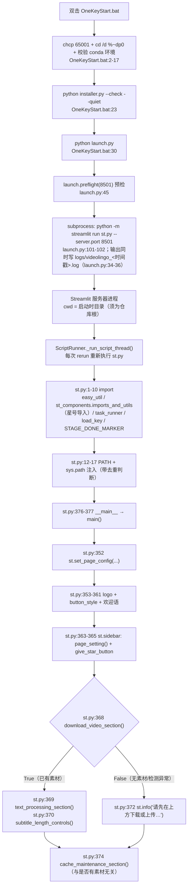
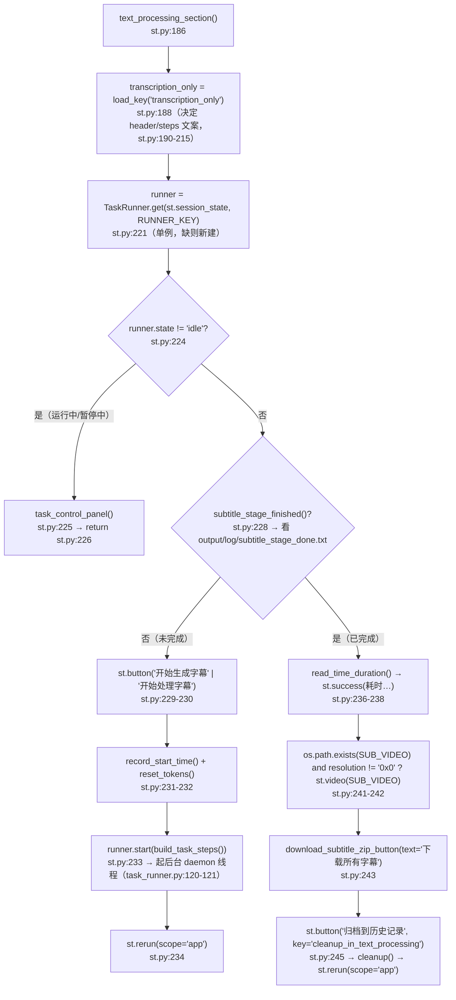
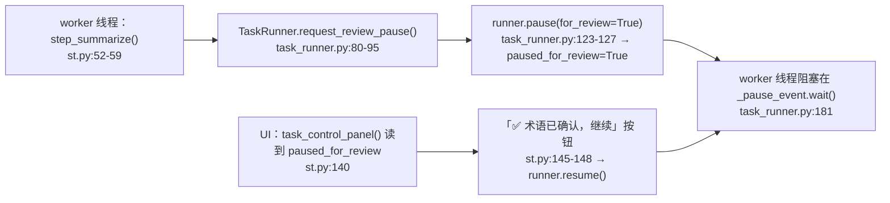
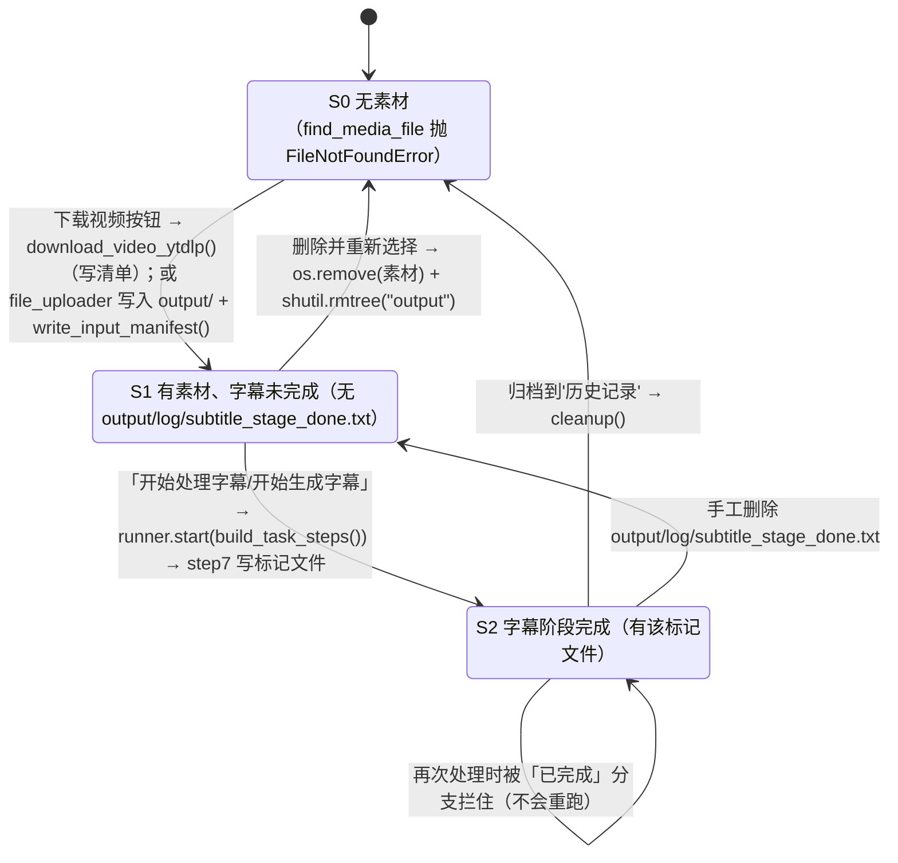

> ## ⚠️ 本文部分内容已在「重构 Round 1」后失效
>
> ⚠️ 本文的「配音区块（audio_processing_section / process_audio）」相关内容已失效——该区块与 step8~step12 一起被删除，`st.py` 现在只有字幕链路。
>
> ⚠️ **上游 3.0.4 合并后**（`merge/upstream-3.0.4`）：`st.py` 里的 `process_text()`、`process_audio()`、`audio_processing_section()` 已被删除，编排改为 `build_task_steps()`（`st.py:69`）+ `st_components/task_runner.py` 的 `TaskRunner`（后台线程、可暂停/继续/停止、每秒刷新进度）。本文 §3.4、§3.5、§3.6、§5.1~§5.4、§六、§八、§九 的条目已按合并后的代码更正，**§7 已整节逐条对当前代码复核**（§7.6~§7.15 标题里写明了每条是「保留 / 改写 / 已修 / 随删除消失」）。
>
> ⚠️ 本文中 `core/delete_retry_dubbing.py` / `delete_dubbing_files()`、`output/output_dub.mp4` 相关内容同样随配音链路失效（该源文件已不在仓库中）。


# Streamlit 主应用入口（st.py）

## 一、职责与边界

`st.py` 是 VideoLingo 唯一的 Web 入口：它组装页面骨架（logo、按钮样式、侧边栏、下载/上传区块与字幕处理区块），把 `core/step*.py` 的字幕步骤组装成任务列表（`st.py:69 build_task_steps()`）交给 `TaskRunner` 在后台线程顺序执行，并用「阶段完成标记文件是否存在」判断阶段是否完成（`st.py:25 subtitle_stage_finished()`）。

它**不**包含任何业务逻辑：转录、切分、翻译、压制全部在 `core/step*.py` 中实现，`st.py` 只做调用编排与结果展示（视频/音频预览、字幕 zip 下载、归档、缓存清理）。

它**不**自己实现任务调度：暂停/继续/停止、进度上报、异常捕获都在 `st_components/task_runner.py` 的 `TaskRunner`（状态机 idle/running/paused/stopped/completed/error）里；`st.py` 只把步骤列表交给它，并按 `runner.state` 渲染控制面板（`st.py:113 task_control_panel()`，`@st.fragment(run_every=1)`）。

它**不**保存流水线阶段状态：阶段状态由 `output/` 下的产物隐式表达（见 §3.6），进程内状态只有两处——`easy_util` 的模块级全局变量（§4.1）与 `st.session_state["_text_task_runner"]`（键名常量 `st.py:22 RUNNER_KEY`）。

## 二、文件清单

| 文件路径 | 行数 | 主要职责 |
| --- | --- | --- |
| `st.py` | 377 | 页面骨架、下载/上传区块、字幕区块、字幕长度面板、缓存清理入口、`build_task_steps()` 步骤组装、`task_control_panel()` 控制面板、阶段判据 |
| `st_components/task_runner.py` | 201 | `StopTask` + `TaskRunner`：后台线程顺序执行步骤，状态机 idle/running/paused/stopped/completed/error，类方法 `check_cancel()` / `request_review_pause()` |
| `easy_util.py` | 245 | 进程级全局状态：开始/结束时间、token 计数、费用估算、`original_name`、进度接口、`check_cancel()`（core 侧取消钩子） |
| `st_components/imports_and_utils.py` | 227 | 聚合导入 core 的字幕链路 step 模块；`subtitle_zip_name()`；`pick_default_subtitle()`；`download_subtitle_zip_button()`；`button_style` / `give_star_button` 两段 HTML/CSS |
| `st_components/download_video_section.py` | 104 | 下载或上传视频/音频区块（详见 [`../04-interfaces/02-Streamlit界面组件.md`](../04-interfaces/02-Streamlit界面组件.md)） |
| `st_components/sidebar_setting.py` | 447 | 侧边栏全部配置控件（详见同上文档） |
| `core/onekeycleanup.py` | 91 | `cleanup()`：把 `output/` 全量归档到 `history/<video_name>/` |
| `core/config_utils.py` | 242 | `load_key / load_key_or / update_key / assign_key / get_joiner / get_source_language`，配置文件为根目录 `config.yaml` |
| `OneKeyStart.bat` | 93 | Windows 一键启动脚本（**纯 ASCII**）：`cd /d "%~dp0"` + `chcp 65001` + **解释器探测**（`.venv` → conda `videolingo` → PATH，含 `:run` 处二次校验）+ `installer.py --check --quiet` + `launch.py` |
| `installer.py` | 1338+ | 安装与体检（`--check`）；`launch()` 调用 `launch.py`。环境大升级后改为 uv 原生安装（`uv pip compile/sync`）+ 大文件下载分离，详见 [`../06-batch-and-tools/02-安装脚本与依赖.md`](../06-batch-and-tools/02-安装脚本与依赖.md) |
| `launch.py` | 124 | 启动预检（缺包 / 缺 ffmpeg / 端口占用）+ 写 `logs/videolingo_<时间戳>.log` 后拉起 `streamlit run st.py` |
| `install.py` | 19 | 向后兼容包装：转发到 `installer.main()`，默认补 `--launch` |
| `.streamlit/config.toml` | 13 | `server.maxUploadSize = 4096` + `[client] toolbarMode = "viewer"`（隐藏 Deploy 菜单；**没有**设置 `fileWatcherType`） |

## 三、调用链与数据流

### 3.1 启动链路



`install.py:12` 另有等价入口：它转发给 `installer.main()`，最终由 `installer.py:442 launch()` 调 `launch.py`（`launch.py` 里才是 `streamlit run st.py`）。

### 3.2 为什么需要 `st.py:12-17` 的 PATH / sys.path 注入

| 代码 | 内容 | 原因 |
| --- | --- | --- |
| `st.py:13` | `current_dir = os.path.dirname(os.path.abspath(__file__))` | 仓库根绝对路径（`__file__` 指向 `st.py`） |
| `st.py:14-15` | `if current_dir not in os.environ['PATH'].split(os.pathsep): os.environ['PATH'] += os.pathsep + current_dir` | 仓库根目录放着 `ffmpeg.exe`（静态构建）。全部 core 模块都用**裸命令** `ffmpeg` 调 `subprocess`，例如 `core/step7_merge_sub_to_vid.py:97-122`、`core/step2_whisperX.py:184`、`batch/utils/batch_processor.py:81`。不注入 PATH 就会 `FileNotFoundError`（除非系统级装了 ffmpeg）。**去重判断是上游合并时加的**：此前每次 rerun 都会无条件追加一份 |
| `st.py:16-17` | `if current_dir not in sys.path: sys.path.append(current_dir)` | 保证 `easy_util`、`core`、`st_components` 可导入，不依赖 Streamlit 注入的 `sys.path` |

`installer.py:227 download_ffmpeg_windows()` 会把 ffmpeg 压缩包解到仓库根，该环境变量不会留给后续运行，因此 `st.py` 自己再注入一次。

> ⚠️ **坑**：`st.py:12-17` 是脚本顶层语句，Streamlit 每次 rerun 都会重新执行。由于去重判断的存在，`PATH`/`sys.path` 不会随 rerun 次数膨胀（旧实现在这里会反复追加）。但注入仍发生在 `st.py:7` 的 `from st_components.imports_and_utils import *` **之后**，若将来有模块在 import 期就调用 ffmpeg 会失败。

### 3.3 页面组装顺序（`main()`）

| 顺序 | 行号 | 语句 | 作用域 |
| --- | --- | --- | --- |
| 1 | `st.py:352` | `st.set_page_config(page_title="VideoLingo", page_icon="docs/logo.svg")` | 全局（每 session 只能调一次） |
| 2 | `st.py:353-359` | `st.columns([1,1])` + `st.image("docs/logo.png", use_column_width=True)` | 主区第一列 |
| 3 | `st.py:360` | `st.markdown(button_style, unsafe_allow_html=True)` | 全局 `<style>` |
| 4 | `st.py:361` | 欢迎语 HTML（含 `videolingo.io` 外链） | 主区 |
| 5 | `st.py:363-365` | `with st.sidebar:` → `page_setting()` + `st.markdown(give_star_button, ...)` | 侧边栏 |
| 6 | `st.py:368` | `if download_video_section():` —— **区块门控**：无素材时不渲染处理区块 | 主区区块 1 |
| 7 | `st.py:369` | `text_processing_section()`（仅第 6 步返回 `True` 时） | 主区区块 2 |
| 8 | `st.py:370` | `subtitle_length_controls()`（同上） | 主区区块 2 内 |
| 9 | `st.py:372` | `st.info("请先在上方下载或上传一个视频/音频文件，然后再开始处理。")`（第 6 步为 `False` 时） | 主区 |
| 10 | `st.py:374` | `cache_maintenance_section()`——**无条件渲染**，与是否有素材无关 | 主区区块 3 |

`st.py` 里 `page_setting`、`download_video_section`、`cleanup`、`download_subtitle_zip_button`、`step2_whisperX` 等**全部名字都来自 `st.py:7` 的 `from st_components.imports_and_utils import *`**（该模块没有定义 `__all__`，因此其所有非下划线全局名都被导出）。改动 `st_components/imports_and_utils.py:3-26` 的导入清单会直接影响 `st.py` 能否运行。

### 3.4 `text_processing_section()` → `build_task_steps()` → `TaskRunner` 调用链

⚠️ 旧实现（`process_text()` 同步串行 + `st.spinner`）已被上游 3.0.4 合并删除，现为「组装步骤表 → 交给后台线程执行」两段式。



`build_task_steps()`（`st.py:69-82`）按 `transcription_only` 组装 `[(标签, 无参可调用对象), ...]`：

| # | 标签（逐字） | 步骤函数 | 定义位置 | 内部调用 |
| --- | --- | --- | --- | --- |
| 1 | `转录（Whisper / 火山 ASR）` | `step_transcribe` | `st.py:42` | `step2_whisperX.transcribe()`（含音频抽取，产物 `output/audio/raw.wav`、`raw.mp3`、`for_whisper.mp3`） |
| 2 | `断句（spaCy + LLM）` | `step_split_sentences` | `st.py:46` | `step3_1_spacy_split.split_by_spacy()` + `step3_2_splitbymeaning.split_sentences_by_meaning()` |
| 3 | `术语提取`（**仅 `transcription_only=False`**，`st.py:80`） | `step_summarize` | `st.py:52` | `step4_1_summarize.get_summary()`；若 `load_key("pause_before_translate")` 为真则调 `TaskRunner.request_review_pause()`（`st.py:54-59`，见 §3.5） |
| 4 | `翻译并压制字幕` | `step_translate_and_burn` | `st.py:62` | `step4_2_translate_all.translate_all()` → `step5_splitforsub.split_for_sub_main()` → `step6_generate_final_timeline.align_timestamp_main()` → `step7_merge_sub_to_vid.merge_subtitles_to_video()` |

`transcription_only=True` 时 `build_task_steps()` 还会先调 `ensure_terminology_file()`（`st.py:78` → `st.py:85-92`）保证 `output/log/terminology.json` 存在（直通模式不需要术语表，但下游会读）。因此直通模式是 3 步（无「术语提取」），翻译模式是 4 步。

`TaskRunner`（`st_components/task_runner.py:31-201`）在后台 daemon 线程里顺序执行这些步骤：`start()` 前把 `state` 置 `running`（`:116`），`_run()` 逐步骤设置 `current_step`/`current_label` 后调用函数（`:176-190`），全部成功置 `completed`（`:192`），捕获 `StopTask` 置 `stopped`（`:193-194`），其它异常记 `error_msg` 并置 `error`（`:195-198`）。`easy_util.check_cancel()`（`easy_util.py:231`）让 core 里的长循环也能响应暂停/停止，接入点是 `core/step2_whisperX.py:500`（分段识别循环）、`core/step4_2_translate_all.py:125`（`as_completed` 循环）、`core/translate_once.py:30`（`translate_lines()` 入口）。

> 📌 与旧实现的两点差异：① 不再有 `st.spinner` 文案表——进度改由 `task_control_panel()` 的 `st.progress` 显示「第 n/m 步：标签」；② `output_sub.mp4` 只是「要不要嵌播放器」的条件（`st.py:241`），**完成判据是 `output/log/subtitle_stage_done.txt`**（`core/step7_merge_sub_to_vid.py:40` 的 `STAGE_DONE_MARKER`），因为 `resolution='0x0'` 且输入是真实视频时有意不产出成片。

### 3.5 `task_control_panel()`：运行状态与控制按钮

⚠️ 原「`audio_processing_section()` → `process_audio()`」调用链已随配音链路删除（`st.py` 中已无这两个函数）。取而代之的是任务控制面板：`task_control_panel()`（`st.py:113`，装饰器 `@st.fragment(run_every=1)` 在 `st.py:112`，即每秒自动重跑这一段而不重跑整页），由 `runner.state` 决定渲染什么。

| `runner.state` | 行号 | 渲染内容 | 按钮（key → 动作） |
| --- | --- | --- | --- |
| `idle` | `st.py:117-118` | 什么都不渲染（直接 `return`） | — |
| `running` / `paused` | `st.py:120-126` | `st.progress(runner.progress, text=f"第 {runner.current_step + 1}/{runner.total_steps} 步：{label}")` | — |
| `running` | `st.py:128-137` | 两列按钮 | `task_pause` → `runner.pause()`；`task_stop` → `runner.stop()`（两者随后都 `st.rerun(scope="app")`） |
| `paused` 且 `runner.paused_for_review` | `st.py:139-153` | `st.info("已提取术语，流程暂停中。请编辑 output/log/terminology.json 或 custom_terms.xlsx…")` | `task_resume_review` → `runner.resume()`；`task_stop_review` → `runner.stop()` |
| `paused`（用户手动暂停） | `st.py:154-165` | `st.warning(f"⏸️ 已暂停：{runner.current_label}")` | `task_resume` → `runner.resume()`；`task_stop2` → `runner.stop()` |
| `stopped` | `st.py:167-172` | `st.warning("⏹️ 任务已停止。已完成的步骤结果仍保留在 output/ 中…")` | `task_ack_stop` → `runner.reset()` |
| `error` | `st.py:174-178` | `st.error(f"❌ 任务出错：{runner.error_msg}")` | `task_ack_error` → `runner.reset()` |
| `completed` | `st.py:180-183` | 不渲染面板：`runner.reset()` + `st.rerun(scope="app")`，把界面交回主区域渲染「已完成」分支 | — |

术语确认暂停点的实现方式（`pause_before_translate=True` 时）：



> 📌 旧实现是在步骤函数体内写 `st.session_state["awaiting_terminology_review"]`；该键在合并后**已不存在**，改为 worker 线程调用 `TaskRunner.request_review_pause()`、UI 依据 `runner.paused_for_review` 渲染（这样避开「从非脚本线程写 session_state 不可靠」的问题，见 `task_runner.py:86-89`）。

### 3.6 隐式状态机（以产物文件存在性为判据）

判据常量只有一个（`st.py:19`）：

```python
SUB_VIDEO = "output/output_sub.mp4"
```

字幕阶段的**完成判据不是它**，而是 `subtitle_stage_finished()`（`st.py:25-33`）——判断 `STAGE_DONE_MARKER`（`core/step7_merge_sub_to_vid.py:40`，即 `output/log/subtitle_stage_done.txt`）是否存在；`SUB_VIDEO` 只用于决定要不要嵌播放器（`st.py:241`）。原因：`resolution='0x0'` 且输入是真实视频时有意不产出成片（`core/step7_merge_sub_to_vid.py:83-88` 会删掉上一次遗留的 `output_sub.mp4`），若仍以成片为判据，界面会永远停在「开始处理字幕」按钮上。

「有没有素材」的判据在下载区块：`st_components/download_video_section.py:22` 调 `core/step1_ytdlp.py:240 find_media_file()`，返回 `(路径, 'video'|'audio')`。它的判定顺序是：先读 `output/input_manifest.json`（`core/step1_ytdlp.py:203 read_input_manifest()`），没有再按扩展名回退——先 `find_video_files()`（`:152`）、找不到再 `find_audio_files()`（`:222`）。注意 `find_video_files()` 现在**不要求恰好 1 个**：0 个抛 `FileNotFoundError`，多个则告警并返回修改时间最新的一个（`core/step1_ytdlp.py:173-182`）。



| 状态 | `output/` 关键文件 | 区块 1 `download_video_section()` | 区块 2 `text_processing_section()` | 区块 3 `cache_maintenance_section()` |
| --- | --- | --- | --- | --- |
| S0 无素材 | 无合法素材 | URL + 分辨率 + 上传控件；`return False`（`:103-104`） | **不渲染**（`st.py:368` 门控），主区显示「请先在上方下载或上传…」（`st.py:372`） | 照常渲染 |
| S1 有素材 | `<video>` 或 `<audio>`；`input_manifest.json` | `st.video`/`st.audio` 预览 + 「删除并重新选择」（`:34-48`） | 「开始处理字幕」按钮（`st.py:229-234`） | 照常渲染 |
| S1 运行中/暂停中 | 同上 + 部分产物 | 同上 | `task_control_panel()` + `return`（`st.py:224-226`） | 照常渲染 |
| S2 字幕完成 | 上述 + `log/subtitle_stage_done.txt`（可能**没有** `output_sub.mp4`） | 同上 | `st.success` +（有 `output_sub.mp4` 且 `resolution != '0x0'` 时）`st.video` + 下载 zip + 归档（`st.py:236-248`） | 照常渲染 |

> ⚠️ 素材检测只剩两类结果：`FileNotFoundError` 视为「还没有素材」，**其它异常**会 `st.error(f"检测已有素材时出错：{type(e).__name__}: {e}")` 并给出「清空 output 并重新选择」按钮（`st_components/download_video_section.py:23-32`）——旧实现的裸 `except:` 会把「output 不可写」这类真实故障静默显示成「还没上传」，已修。
>
> ⚠️ 区块 2 的按钮**没有**前置处理校验，但它在 S0 根本不会渲染；`step2_whisperX.transcribe()` 找不到素材时抛的 `FileNotFoundError` 会被 `TaskRunner._run()` 捕获并显示在控制面板的 `error` 状态里（`st_components/task_runner.py:195-198`），不再是「只有终端能看到」。

## 四、关键数据结构

### 4.1 `easy_util` 模块级全局状态（进程级，非 session 级）

| 变量 | 定义位置 | 类型/单位 | 写入者 | 读者 |
| --- | --- | --- | --- | --- |
| `lock` | `easy_util.py:4` | `threading.Lock` | — | `core/ask_gpt.py:92,97`（token 自增加锁） |
| `start_time` | `easy_util.py:26` | epoch 秒 | `st.py:96 record_start_time()`（点「开始处理字幕」时，`st.py:231`） | `core/step6_generate_final_timeline.py:290` |
| `end_time` | `easy_util.py:27` | epoch 秒 | `core/step6_generate_final_timeline.py:285` | 同上 |
| `time_duration` | `easy_util.py:28` | 秒 | `core/step6_generate_final_timeline.py:293`（`end_time - start_time`，`start_time` 为 0 时归 0） | `st.py:99 read_time_duration()`（`st.py:236` 调用） |
| `total_time_duration` | `easy_util.py:29` | 秒 | `core/step6_generate_final_timeline.py:294` | `batch/utils/*` 汇总 |
| `prompt_tokens` | `easy_util.py:32` | 个 | `core/ask_gpt.py:91-93 increase_prompt_tokens()` | `easy_util.py:73`、`core/step6_generate_final_timeline.py:279` |
| `completion_tokens` | `easy_util.py:33` | 个 | `core/ask_gpt.py:96-98` | 同上 |
| `total_tokens` | `easy_util.py:34` | 个 | 仅被 `st.py:106` / `batch/utils/video_processor.py:184` 置 0 | **无人读取**（`get_total_tokens()` 现算 prompt+completion）→ 事实上的死变量 |
| `price_input_uncached` / `price_input_cached` / `price_output` | `easy_util.py:37-39` | 元/百万 token | 硬编码常量 | `easy_util.py:76-79` |
| `cached_token_rate` | `easy_util.py:42` | 0~1 | 硬编码 `0.3` | 同上 |
| `estimated_cost` | `easy_util.py:45` | 元 | **无写入者** | 死变量 |
| `estimated_total_cost` | `easy_util.py:46` | 元 | `core/step6_generate_final_timeline.py:295`；`batch/utils/batch_processor.py:54` 归零 | `easy_util.py:83` |
| `original_name` | `easy_util.py:49` | str（无扩展名） | `st_components/download_video_section.py:40`（`eu.record_file_name(media_file)`） | `st_components/imports_and_utils.py:91`（zip 内文件名前缀） |
| `current_progress` / `processing` | `easy_util.py:52-53` | float / bool | 仅 `batch/utils/*` 使用 | `st.py` 主流程**未使用**（`set_progress/get_progress/is_processing` 是预留接口） |
| `total_prompt_tokens` / `total_completion_tokens` | `easy_util.py:56-57` | 个 | `easy_util.py:120-124 add_to_total_tokens()`（仅 batch 调用） | batch 汇总 |

另外 `easy_util.check_cancel()`（`easy_util.py:231-245`）不是全局变量而是一个**协作式取消钩子**：它惰性导入 `st_components.task_runner.TaskRunner` 后转发到 `TaskRunner.check_cancel()`（`task_runner.py:57-70`）——暂停时阻塞、收到停止请求时抛 `StopTask`；没有活跃任务时（例如命令行直接跑 core 脚本）是空操作。合并后新增，接入点见 §3.4。

### 4.2 落盘产物（本入口直接相关）

| 路径 | 生产者 | 消费者 | 说明 |
| --- | --- | --- | --- |
| `output/output_sub.mp4` | `core/step7_merge_sub_to_vid.py:56 merge_subtitles_to_video()`（常量 `OUTPUT_VIDEO` 在 `:32`；ffmpeg 成功在 `:126-128`） | `st.py:241` | **不是**完成判据，只决定要不要嵌播放器。`resolution='0x0'` 且输入是真实视频时既不产出、还会删掉遗留文件（`:83-88`） |
| `output/log/subtitle_stage_done.txt` | `core/step7_merge_sub_to_vid.py:49-53 _mark_stage_done()`（三条返回路径都会写：纯音频 `:65-68`、`resolution='0x0'` `:87`、压制成功 `:128`） | `st.py:33 subtitle_stage_finished()` | **字幕阶段的完成判据**（`STAGE_DONE_MARKER`，`core/step7_merge_sub_to_vid.py:40`） |
| `output/input_manifest.json` | `core/step1_ytdlp.py:195-200 write_input_manifest()`（下载路径 `:114`、上传路径 `st_components/download_video_section.py:98`） | `core/step1_ytdlp.py:203-219 read_input_manifest()` → `:240 find_media_file()` | 内容为 `{"path": …, "type": "video"\|"audio"}`；音频输入据此跳过压制（`core/step7_merge_sub_to_vid.py:65-68`） |
| `output/src.srt` / `trans.srt` / `src_trans.srt` / `trans_src.srt` | `core/step6_generate_final_timeline.py:21-26`（`SUBTITLE_OUTPUT_CONFIGS`）+ `:274 align_timestamp()` | zip 打包 | 4 个文件都在 `output/` 根 |
| `output/log/sentence_splitbymeaning.txt` | `core/step3_2_splitbymeaning.py` | zip 内 `<video_name>.txt`（`st_components/imports_and_utils.py:102-105`） | 供后续 AI 总结用 |
| `output/log/terminology.json` | `core/step4_1_summarize.py`（正常路径）/ `st.py:85-92 ensure_terminology_file()`（直通模式与暂停点的兜底） | `core/step4_2_translate_all.py` | `pause_before_translate=True` 时由人工编辑后点「✅ 术语已确认，继续」（见 §3.5） |
| `output/cost.txt` | `easy_util.py:91-98 record_messages()` ← `core/step6_generate_final_timeline.py:281` | 人工查看 | 时长 + token + 预估费用 |
| `output/<video_name>.srt` | `st_components/imports_and_utils.py:96-97`（**下载按钮的副作用**，源文件由 `:59 pick_default_subtitle()` 选出） | 用户 | 见 §7.6 |
| `history/<video_name>/{,log,gpt_log}` | `core/onekeycleanup.py:7 cleanup()` | 用户 | 归档后 `output/` 被清空。取名改用 `find_media_file()`（`core/onekeycleanup.py:9`），因此音频输入也能归档 |
| `.cache/asr/<key>/<part>.json` | `core/all_whisper_methods/transcription_cache.py:116-144 write_result()`（目录常量 `CACHE_DIR = Path(".cache/asr")` 在 `:29`） | `:98-113 read_result()` ← `core/step2_whisperX.py:457/511` | 内容寻址的 ASR 缓存，**跨 `output/` 清理存活**；由 `st.py:290-293` 的按钮清空 |
| `logs/videolingo_<时间戳>.log` | `launch.py:107-119`（路径由 `:34-36 log_path()` 生成） | 人工查看 | 只在用 `python launch.py` 启动时产生 |
| `output/<video_name>_subtitles.zip` | 仅内存 `io.BytesIO`，通过 `st.download_button` 下发（`st_components/imports_and_utils.py:128-133`） | 用户 | 不落盘 |

### 4.3 `TaskRunner` 的状态字段（`st_components/task_runner.py`）

| 字段 | 类型 | 含义 |
| --- | --- | --- |
| `state` | str | `idle` / `running` / `paused` / `stopped` / `completed` / `error`（`task_runner.py:35`） |
| `current_step` | int | 0 起的步骤下标，`-1` 表示尚未开始（`:36`） |
| `total_steps` | int | 步骤总数，`start()` 时由步骤表长度写入（`:111`） |
| `current_label` | str | 当前步骤标签（`st.py:73/74/80/81` 传入的中文标签） |
| `error_msg` | str | `"<异常类型>: <消息>"`，仅在 `error` 状态有值（`:196`） |
| `paused_for_review` | bool | 是否由「等待人工确认」触发的暂停，UI 用它区分术语确认界面与普通暂停条（`:40`、`st.py:140`） |
| `_pause_event` / `_stop_event` | `threading.Event` | 暂停用 `Event.clear()/set()` 实现阻塞；停止用 `_stop_event`（`:43-44`） |
| `_thread` | `Thread` | `daemon=True`，`start()` 时创建（`:120-121`） |
| `progress`（属性） | float | `min((current_step + 1) / total_steps, 1.0)`（`:164-169`） |

单例的存放位置是 `st.session_state[RUNNER_KEY]`（`st.py:22` 定义键名，`st.py:221` 调用 `TaskRunner.get()`）——即**每个浏览器会话一个 runner**，不再是 `easy_util` 那种进程级共享。

## 五、逐函数/逐模块实现说明

### 5.1 `st.py`

| 函数 | 行号 | 作用 | 关键实现 / 副作用 |
| --- | --- | --- | --- |
| `subtitle_stage_finished()` | `st.py:25-33` | 字幕阶段是否已完成 | `os.path.exists(STAGE_DONE_MARKER)`；判据说明见 §3.6 |
| `step_transcribe()` | `st.py:42-43` | 步骤 1「转录」 | `step2_whisperX.transcribe()` |
| `step_split_sentences()` | `st.py:46-49` | 步骤 2「断句」 | `step3_1_spacy_split.split_by_spacy()` + `step3_2_splitbymeaning.split_sentences_by_meaning()` |
| `step_summarize()` | `st.py:52-59` | 步骤 3「术语提取」（仅翻译模式） | `step4_1_summarize.get_summary()`；`pause_before_translate` 为真时调 `TaskRunner.request_review_pause()`（**在 worker 线程内**，不写 session_state） |
| `step_translate_and_burn()` | `st.py:62-66` | 步骤 4「翻译并压制字幕」 | `step4_2_translate_all.translate_all()` → `step5_splitforsub.split_for_sub_main()` → `step6_generate_final_timeline.align_timestamp_main()` → `step7_merge_sub_to_vid.merge_subtitles_to_video()` |
| `build_task_steps()` | `st.py:69-82` | 按配置组装步骤表 | 读 `transcription_only`；直通模式先调 `ensure_terminology_file()`；返回 `[(标签, 无参可调用对象), ...]` |
| `ensure_terminology_file()` | `st.py:85-92` | 保证术语文件存在 | 写 `output/log/terminology.json` = `{"topic": "", "terms": []}`；已存在则不覆盖 |
| `record_start_time()` | `st.py:95-96` | `eu.start_time = time.time()` | 无校验、无返回；由按钮分支调用（`st.py:231`） |
| `read_time_duration()` | `st.py:99-100` | `eu.convert_seconds(eu.time_duration)` | 读进程内全局值；新 session/重启后为 `0秒` |
| `reset_tokens()` | `st.py:103-106` | 把 `eu.prompt_tokens/completion_tokens/total_tokens` 置 0 | 只重置「本次视频」计数，不动 `total_*` |
| `task_control_panel()` | `st.py:112-183` | 进度条 + 暂停/继续/停止 + 术语确认界面 | `@st.fragment(run_every=1)` 每秒重跑本片段；状态分支见 §3.5 |
| `text_processing_section()` | `st.py:186-248` | 渲染「翻译和生成字幕」/「音频转录和生成原语言字幕」区块 | 读 `transcription_only` 决定标题、步骤文案、按钮文案与成功文案（`:188-215`）；`runner.state != "idle"` 时只画控制面板并 `return`（`:224-226`）；**无返回值**（返回值在 `st.py:369` 被忽略） |
| `cache_maintenance_section()` | `st.py:251-293` | 缓存清理入口，**与是否有素材无关** | 两个 expander：火山二级缓存 `output/log/asr_results/*.json`（`:259-276`）、内容寻址转录缓存 `.cache/asr`（`:280-293`，调 `transcription_cache.clear_cache()`） |
| `subtitle_length_controls()` | `st.py:296-348` | 字幕长度面板 | 两个 `st.number_input` 写 `max_split_length`（`:308-313`）与 `subtitle.max_length`（`:316-321`），「保存」按需 `update_key`（`:330-340`）、「恢复默认 (20 / 75)」（`:342-348`）；注释明确 dev 固定的 streamlit 1.38 不支持 `number_input(width=)`，故用 `use_container_width` |
| `main()` | `st.py:351-374` | 组装页面 | `st.set_page_config` 必须在最前；`download_video_section()` 的返回值决定是否渲染处理区块（`:368-372`）；`cache_maintenance_section()` 无条件调用（`:374`） |

### 5.2 `st_components/imports_and_utils.py`

> ⚠️ **本节已按代码现状更正**：旧版本记录的是 `copy_as_default_subbtitle()` / `get_correct_video_file()` / `replace_underscore_with_space()`，这三个函数在当前代码中**都不存在**（在本轮重构中被 `pick_default_subtitle()` + dict 去重打包取代，早于上游合并）。

| 函数 / 常量 | 行号 | 作用 | 关键实现 / 副作用 |
| --- | --- | --- | --- |
| `subtitle_zip_name(file_name, video_name)` | `imports_and_utils.py:34-52` | 把 `output/*.srt` 映射为包内名 | 用**完整 stem 匹配**（`src_trans` / `trans_src` / `src` / `trans`），不再依赖子串判断顺序；被 `batch/utils/video_processor.py` 共用 |
| `pick_default_subtitle(output_dir)` | `imports_and_utils.py:59-84` | 选「默认字幕」的源文件 | `transcription_only` 时用 `src.srt`（缺失退回双语），否则用 `trans_src.srt`/`trans.srt`；返回 `(路径, 说明)` |
| `download_subtitle_zip_button(text)` | `imports_and_utils.py:87-133` | 生成默认字幕并渲染下载按钮 | 先 `shutil.copy` 出 `output/<video_name>.srt` 与 `<video_name>.txt`（`:96-105`），再用 `entries` dict 去重入包（`:108-124`），最后 `st.download_button`（`:128-133`）。每次 rerun 都会重新打包 |
| `give_star_button` | `imports_and_utils.py:137-162` | GitHub Star 按钮 HTML + `.github-button` 样式 | 在 `st.py:365` 注入侧边栏 |
| `button_style` | `imports_and_utils.py:164-227` | 按钮/下载按钮 CSS | 在 `st.py:360` 注入，作用域为全文档（见 §7.12） |

### 5.3 `core/onekeycleanup.py`

| 函数 | 行号 | 说明 |
| --- | --- | --- |
| `cleanup(history_dir="history")` | `onekeycleanup.py:7-43` | `find_media_file()` 取素材名（`:9`）→ `sanitize_filename()` → 建 `history/<video_name>/{log,gpt_log}` → `glob("output/*")` 把**除 log/gpt_log 外的一切**（含源素材、`output_sub.mp4`、`audio/`、`input_manifest.json`）移入归档 → 再移 `output/log/*`、`output/gpt_log/*` → 最后 `os.rmdir` 尝试删空目录，失败静默 |
| `move_file(src, dst)` | `onekeycleanup.py:45-73` | 同名先删目标；`PermissionError` 时退化为「复制 + 删源」；其他异常只打印 |
| `sanitize_filename(filename)` | `onekeycleanup.py:75-80` | 替换 `< > : " / \ | ? *` 为 `_` |

副作用要点：`onekeycleanup.py:12` 用 `os.path.basename(video_file.replace("\\", "/"))` 取文件名（**不再**是 `split("/")[1]`，旧写法在非 Windows 平台会 `IndexError`）。**`cleanup()` 会把源素材一起归档**，因此归档后状态机回到 S0（见 §3.6）。注意该文件由上游合并改过：它改用 `find_media_file()`（`core/onekeycleanup.py:9`），所以纯音频输入也能归档。

### 5.4 `core/delete_retry_dubbing.py`（已删除）

> ⚠️ 该源文件在当前仓库中**不存在**，`st.py` / `st_components/` 也不再引用 `delete_dubbing_files()`——它随配音链路（step8~step12）一起被删除。旧文档中「删除配音文件」按钮与 `output/dub.wav`/`output_dub.mp4` 的描述一并失效。

## 六、关键参数与配置

`st.py` 直接读取的 config 键（读侧走 `core/config_utils.py:75 load_key` / `:103 load_key_or`，每次 rerun 重新读盘）：

| 键路径 | 出现位置 | 影响 |
| --- | --- | --- |
| `transcription_only` | `st.py:71`、`st.py:188` | 决定区块标题/步骤文案/按钮文案/成功文案，以及 `build_task_steps()` 是否插入「术语提取」步骤（直通模式为 3 步、翻译模式为 4 步） |
| `resolution` | `st.py:241` | `!= "0x0"` 且 `output_sub.mp4` 存在时才内嵌播放；`"0x0"` 时 `step7` 静默跳过压制（真实视频不产出成片，纯音频只交字幕） |
| `pause_before_translate` | `st.py:54` | 为 `True` 时 `step_summarize()` 调 `TaskRunner.request_review_pause()`，页面进入术语确认态（见 §3.5） |
| `max_split_length` | `st.py:311`、`:329-330` | 字幕长度面板的「首次粗切词数上限」，用 `load_key_or(..., 20)` 读取（旧 `config.yaml` 缺该键也能跑） |
| `subtitle.max_length` | `st.py:316-321`、`:332-334` | 字幕长度面板的「单行最大字符数」，`load_key_or("subtitle", {})` 取默认 75 |

其他被间接依赖的键：

| 键路径 | 消费方 | 说明 |
| --- | --- | --- |
| `allowed_video_formats` | `core/step1_ytdlp.py:163`（`find_video_files`）、`st_components/download_video_section.py:70` | 决定「什么算视频」与上传控件接受的后缀 |
| `allowed_audio_formats` | `core/step1_ytdlp.py:227`（`find_audio_files`）、`st_components/download_video_section.py:70,97` | 决定「什么算音频」与上传后写进 `input_manifest.json` 的 `type`（**不再**转黑屏视频） |
| `ytb_resolution` | `st_components/download_video_section.py:59` | 下载区块的默认分辨率（`'360' / '1080' / 'best'`），UI 不回写该键 |
| `whisper.cache` | `core/step2_whisperX.py:447`（`load_key_or(..., True)`） | 是否启用内容寻址的转录缓存；键缺失时默认 `true` |
| `api.*` | 全流程 LLM 调用 | 见 [`../04-interfaces/02-Streamlit界面组件.md`](../04-interfaces/02-Streamlit界面组件.md) |
| `server.maxUploadSize = 4096` / `[client] toolbarMode` | `.streamlit/config.toml:2`、`:13` | 上传上限 4096 MB、隐藏 Deploy 菜单；配置文件中没有设置端口/地址，端口取 Streamlit 默认 `8501`（`launch.py:88` 的 `--port` 默认值） |

## 七、技术要点与坑

### 7.1 `pause_before_translate`：从 `input()` 阻塞改为 TaskRunner 两段式暂停

旧实现（`process_text()` 内，已删除）在术语提取后直接 `input("⚠️ 翻译前暂停…")`：读的是**服务器进程的 stdin**，浏览器端看不到提示；有 TTY 时整个阶段真的挂住，无 TTY 时立即 `EOFError` 冒泡成页面报错。现状改为：

| 步 | 位置 | 行为 |
| --- | --- | --- |
| 1 | `st.py:54-59` | `step_summarize()` 在 `get_summary()` 之后判断 `load_key("pause_before_translate")`，为真则调 `TaskRunner.request_review_pause()`（`task_runner.py:80-95`）。该函数只触碰 `threading.Event` 与普通属性，所以从 worker 线程调用是安全的（注释见 `task_runner.py:86-89`） |
| 2 | `task_runner.py:123-127`、`:181` | `runner.pause(for_review=True)` 置 `paused_for_review = True` 并清空 `_pause_event`，worker 线程阻塞在 `_pause_event.wait()` |
| 3 | `st.py:139-153` | 每秒重跑的 `task_control_panel()` 读到 `paused_for_review`，渲染 `st.info("已提取术语，流程暂停中。请编辑 output/log/terminology.json 或 custom_terms.xlsx，确认后点击下方按钮继续翻译。")` + 「✅ 术语已确认，继续」/「⏹️ 放弃本次任务」 |
| 4 | `st.py:145-148` → `task_runner.py:129-133` | 点「继续」→ `runner.resume()` → `_pause_event.set()` → worker 线程进入 `step_translate_and_burn()` |

注意 `output/log/terminology.json` 是 `step4_2` 真正读取的文件（`core/step4_2_translate_all.py:21,104`），而 `custom_terms.xlsx` 只在暂停点**之前**由 `core/step4_1_summarize.py:38` 读入——暂停后再改它不影响本次结果。页面提示把两者并列，实际生效的是前者。

### 7.2 阶段状态是隐式的、可被外部操作绕过

`st.py` 不维护任何「已完成的步骤」记录，只判断完成标记文件（`output/log/subtitle_stage_done.txt`，见 §3.6）。因此：手工删除该标记但保留 `output/log/*.xlsx` 时，页面会重新显示「开始处理字幕」，而 `core/step*.py` 的幂等约定（各自检查自己的产物）会让已完成的步骤秒过——这是设计上的断点续跑能力，但也意味着「回到上一阶段」只能靠删文件，且删错文件会让后续步骤读到过期产物。反过来，只删 `output/output_sub.mp4` **不会**让界面回到未完成态（`resolution='0x0'` 时本来就不产出它）。

### 7.3 `easy_util` 全局变量在 rerun 下存活，但**跨会话共享**

- `st.rerun()` 只重跑脚本，不重载模块：`easy_util` 一直在 `sys.modules` 里，所以 `read_time_duration()`（`st.py:99`，在 `st.py:236` 由 rerun 之后的脚本执行）仍能读到 `step_translate_and_burn()` 期间由 step6 写入的 `eu.time_duration`。
- 但这些变量是**进程级**的，不是 `st.session_state`：多个浏览器标签/多用户共享同一份 `eu.start_time/prompt_tokens/original_name`，会互相覆盖（`reset_tokens()` 会把别人的计数清零）。⚠️ 与 `TaskRunner` 恰好相反——runner 存在 `st.session_state[RUNNER_KEY]`（`st.py:22`），是每个会话一份。
- 硬刷新浏览器（新 session）或重启进程后 `eu.time_duration = 0`，于是出现「耗时：0秒」（`st.py:236-238`）——耗时只在「本次进程内点过按钮」的前提下才准确。
- 另外 `record_start_time()` 在**点击时**记录（`st.py:231`），而 `time_duration` 由 step6 结算（`core/step6_generate_final_timeline.py:284-295`），**不含 step7 压制耗时**；`output/cost.txt` 也在 step6 就写好了（`core/step6_generate_final_timeline.py:281`），同样不含压制耗时。

### 7.4 token 统计口径

- token 累加在**拿到真实响应之后立即执行**（`core/ask_gpt.py:173-178`），与 `response_json` 的取值无关，且重试不会重复累加（注释见 `:173`）。旧实现在 `if response_json:` 分支里累加，导致 `ask_gpt(..., response_json=False)` 的调用漏计、`output/cost.txt` 偏低——**已修**。
- 命中磁盘缓存时在 `core/ask_gpt.py:126-131` 直接返回，不累加 token（正确，因为没有真实请求），因此重跑同一视频时耗时/token 会显著变小。缓存键是 `(model, prompt)`，且 `log_title` 为 `None`/`'None'` 时既不读也不写缓存（`core/ask_gpt.py:40-41,73-74`）。
- 费用仍是**估算**：单价硬编码在 `easy_util.py:37-42`（`price_input_uncached = 1`、`price_input_cached = 0.02`、`price_output = 2`、`cached_token_rate = 0.3`），单位写死「元」，与 `config.yaml` 中的 `api.model` 无关。

### 7.5 `st.rerun()` 调用点与必要性

`st.py` 内的 15 处**全部**是 `st.rerun(scope="app")`（`scope="app"` 是合并时统一加的：默认的 `scope="fragment"` 只会重跑当前 fragment，控制面板里的按钮将无法让主区域刷新）：

| 位置 | 触发场景 | 为什么必须 rerun |
| --- | --- | --- |
| `st.py:133` / `:137` | 控制面板：⏸️ 暂停 / ⏹️ 停止 | 让主区域同步显示 `paused` / `stopped` 状态（fragment 自身每秒会重跑，主区域不会） |
| `st.py:148` / `:153` | 术语确认界面：✅ 继续 / ⏹️ 放弃 | 同上 |
| `st.py:161` / `:165` | 普通暂停界面：▶️ 继续 / ⏹️ 停止 | 同上 |
| `st.py:172` / `:178` | `stopped` / `error` 状态的「知道了」→ `runner.reset()` | 回到 `idle` 后才能重新显示「开始处理字幕」按钮 |
| `st.py:183` | `completed` → `runner.reset()` | 把界面交回主区域的「已完成」分支（`st.py:236-248`） |
| `st.py:234` | 点「开始处理字幕/开始生成字幕」→ `runner.start(...)` | 从按钮态切到控制面板态 |
| `st.py:247` | 字幕区块「归档到'历史记录'」 | `cleanup()` 移走了 `output/*`，需重画为「未处理」 |
| `st.py:276` / `:293` | 清空火山 ASR 结果缓存 / 清空转录缓存 | 刷新 expander 里的计数 |
| `st.py:338` / `:348` | 字幕长度面板「保存」/「恢复默认 (20 / 75)」 | 让 `st.number_input` 以新的 `config.yaml` 值重建 |
| `st_components/download_video_section.py:31` | 「清空 output 并重新选择」（素材检测异常时） | 让素材检测重新走一遍 `try` |
| `st_components/download_video_section.py:47` | 「删除并重新选择」 | 让 `find_media_file()` 抛 `FileNotFoundError`，回到上传/下载 UI |
| `st_components/download_video_section.py:68` / `:102` | 下载视频成功 / 上传写盘完成 | 让预览分支显示新素材 |
| `st_components/sidebar_setting.py:186` | 「🔄 获取模型列表」成功 | 让搜索框用上新拉到的列表 |
| `st_components/sidebar_setting.py:203` | 切换 ASR 引擎 | 让火山引擎专属 expander 立刻出现/消失。⚠️ 这处仍是裸 `st.rerun()`（`scope` 默认 `fragment`），与 `st.py` 的写法不一致 |

注意 `st.rerun()` 会**中断当前脚本执行**（抛 `RerunException`），因此写在其后的语句不会执行。

### 7.6 zip 命名规则（`st_components/imports_and_utils.py:34-52`）

现状是**完整 stem 精确匹配**（不是子串包含），映射表在 `:46-51`，兜底为原名（`:52`）：

| `output/` 下的文件 | 包内名 | 依据 |
| --- | --- | --- |
| `src.srt` | `<video_name>_src.srt` | `subtitle_zip_name()`（`:34-52`） |
| `trans.srt` | `<video_name>_trans.srt` | 同上 |
| `src_trans.srt` | `<video_name>_src_trans.srt` | 同上 |
| `trans_src.srt` | `<video_name>_trans_src.srt` | 同上 |
| `<video_name>.srt` | `<video_name>.srt`（循环里跳过，随后单独加入） | `:112-114`、`:117-118` |
| `log/sentence_splitbymeaning.txt` | `<video_name>.txt` | `:102-105`、`:119-120` |
| 其它 stem（如 `dub.srt`） | 原名 | `mapping.get(stem, file_name)`（`:52`） |

命名函数由单次模式与批量模式**共用**（`batch/utils/video_processor.py` 经星号导入使用），别名 `_subtitle_zip_name`（`:56`）只为显式 import 的旧调用保留。

### 7.7 重构前两个 zip 缺陷已消失（保留可追溯性）

旧版本文档记录的 `trans_src` 分支 `new_name` 被丢弃、以及「子串陷阱」（视频名含 `src`/`trans` 就被强制改名）都依赖旧实现的 `if/elif` 子串判断与 `copy_as_default_subbtitle()` 副作用。当前实现改为 `subtitle_zip_name()` 的完整 stem 匹配 + `entries` dict 去重（`:108-124`），**这两个函数与那套分支都已不存在，问题随之消失**。

现在仍然成立的相关事实：

1. 默认字幕的选择由 `pick_default_subtitle()`（`:59-84`）决定：`transcription_only` 为真时取 `src.srt`（缺失则退回 `src_trans.srt`/`trans_src.srt`），否则取 `trans_src.srt`/`trans.srt`；都没有时只 `print` 原因、不生成默认字幕（`:96-99`）。
2. 每次执行都有**写盘副作用**：`shutil.copy` 出 `output/<video_name>.srt` 与 `output/<video_name>.txt`（`:96-105`），这也是归档目录里会多出这两个文件的原因。
3. `video_name` 取 `eu.original_name or "video"`（`:91`），不再是空串导致的 `_src_trans.srt` / `_subtitles.zip` 退化名；`eu.original_name` 在下载区块返回 `True` 之前就已赋值（`st_components/download_video_section.py:40`），而字幕区块只在 `st.py:368` 门控通过后渲染，正常路径下必然有值。
4. zip 只收 `output/` **根下**的 `.srt` 与转录 txt，不含 `output/log/` 里的其它文件。

### 7.8 zip 逻辑仍是两份实现（命名已共用）

`batch/utils/video_processor.py:186-265 save_subbtitles()` 与 `st_components/imports_and_utils.py:87-133 download_subtitle_zip_button()` 是两条独立实现。差异：批量侧把 zip **落盘**到 `batch/output/SavedSubbtitles/<video_name>_subtitles.zip` 并回写 `<video_name>.srt/.txt` 到输入目录，单次侧走内存 `st.download_button`。

值得注意的是**命名与默认字幕选择已经共用同一对函数**（`subtitle_zip_name()` / `pick_default_subtitle()`，经 `from st_components.imports_and_utils import *` 引入），所以改名规则只需改一处；仍然重复的是「遍历目录 → 组装 entries → 写 zip」这段流程。

### 7.9 每次 rerun 都会重新打包 zip

`download_subtitle_zip_button()` 在「字幕阶段已完成」分支里无条件执行（`st.py:243`，位于 `st.py:235-248` 的 `else` 分支内）。因此任何一次 rerun（改侧边栏任意控件、点任何按钮）只要该分支成立，就会 `os.listdir` + 读全部 srt/txt + 构造 zip 到内存 + 调 `pick_default_subtitle()` 并 `shutil.copy` 出 `<video_name>.srt`/`.txt`（`imports_and_utils.py:94-105`）。

### 7.10 `get_correct_video_file()` / `replace_underscore_with_space()` 已不存在

这两个函数在当前 `st_components/imports_and_utils.py`（227 行）中**没有定义**，全仓库也搜不到引用——旧的「死代码」条目随之消失。

同时更正一条相反的旧结论：`st_components/download_video_section.py:15 download_video_section()` 的返回值**现在被使用**——`st.py:368` 用它做区块门控（`False` 时只显示「请先在上方下载或上传一个视频/音频文件」，`st.py:372`）。

### 7.11 「删除配音文件」相关缺陷已随配音链路删除

`core/delete_retry_dubbing.py`、`core/step11_merge_full_audio.py`、`core/step12_merge_dub_to_vid.py` 均已不在仓库中，页面上的「删除配音文件」按钮也不存在，因此「删的是 `dub.wav` 而非 `dub.mp3`」这一缺陷自动消失。

### 7.12 CSS 注入冲突（已修）

- `st.py:360` 注入的 `button_style`（`st_components/imports_and_utils.py:164-227`）用 `div.stButton > button:first-child` 设定 `color: #144070`（非 `!important`）。
- 侧边栏的白字样式在 `st_components/sidebar_setting.py:144-160`，选择器已**限定在侧边栏内**（`.stSidebar div[data-testid="stButton"] button, [data-testid="stSidebar"] div[data-testid="stButton"] button`），不再命中主区按钮；`sidebar_setting.py:134-143` 的注释记录了原委（旧写法是全局 `div[data-testid="stButton"] button { color: white !important; }`，会让主区按钮白字白底）。
- ⚠️ 需人工确认：结论来自源码与注释，本次未实际启动页面目视核对渲染结果。

### 7.13 依赖 cwd = 仓库根（启动脚本已兜底）

Streamlit 1.38 只在运行期把**脚本所在目录**插入 `sys.path`（`streamlit/vendor/ipython/modified_sys_path.py:53-64`，由 `streamlit/runtime/scriptrunner/script_runner.py:547` 使用），**不会 chdir**。因此 `output/...`、`config.yaml`、`docs/logo.png`、`docs/logo.svg` 全部相对「启动命令所在目录」解析（⚠️ 上面两处 streamlit 内部行号本次未复核——本机没有可用的 streamlit 安装，属引用既有结论）。

启动脚本现在会主动把 cwd 归位：`OneKeyStart.bat:6` 的 `cd /d "%~dp0"`（合并时新增，此前从别的目录调用会因找不到 `st.py`/`config.yaml` 而失败），随后 `OneKeyStart.bat:30` 调 `python launch.py`，由 `launch.py:101-102` 起 `python -m streamlit run st.py --server.port 8501`（`launch.py` 自己不改 cwd，直接继承）。

### 7.14 `st.set_page_config` 的相对路径图标与 streamlit 版本

`st.py:352` 用 `page_icon="docs/logo.svg"`，`st.py:359` 用 `use_column_width=True`（该行上方 `st.py:355-358` 的注释写明了理由：streamlit 1.38.0 只接受 `use_column_width`，传 `use_container_width` 会 `TypeError`）。在 `requirements.txt:14` 固定的 `streamlit==1.38.0` 下二者均可用；⚠️ 需人工确认：升级 Streamlit 后 `use_column_width` 属已弃用参数，需要改成 `use_container_width`（`core/all_whisper_methods`、`batch/utils/gui.py` 里的 `st.dataframe(..., use_container_width=True)` 不受影响）。

### 7.15 音频阶段的完成判据问题已随配音链路消失

旧的「`output_dub.mp4` 在 `resolution == "0x0"` 时只是 1 帧黑屏占位，状态机却进入 S3」随 `core/step12_merge_dub_to_vid.py` 删除而消失。当前与它同类的设计意图是**字幕阶段用显式标记文件**（`output/log/subtitle_stage_done.txt`）而不是成片存在性，原因见 §3.6。

## 八、扩展点

> 💡 以下均为建议，当前代码未实现。

### 8.1 新增一个主区区块

1. 在 `st.py` 里新增 `def xxx_section():`，内部用 `st.header(...)` + `with st.container(border=True):` 保持视觉一致（参考 `st.py:217-218` 的 `text_processing_section()`、`st_components/download_video_section.py:16-17`）。
2. 在 `main()`（`st.py:368-374`）里按顺序调用；注意区块顺序决定了 `easy_util` 全局状态（如 `eu.original_name`）的初始化时机——`download_video_section()` 必须保持在最前（`st.py:368`），且它的返回值现在是**门控条件**，新区块要么放进 `if` 分支内、要么放在 `cache_maintenance_section()` 那种无条件位置。
3. 区块需要新的全局名时，加到 `st_components/imports_and_utils.py` 的导入区，`st.py:7` 的星号导入会自动带进来；**不要把 `from core.ask_gpt import ask_gpt`（`imports_and_utils.py:20`）挪到 `imports_and_utils.py:26` 的 `sidebar_setting` 导入之后**——`st_components/sidebar_setting.py:4` 反向从 `imports_and_utils` 取 `ask_gpt`，靠的正是「第 20 行先于第 26 行执行」，调整顺序会变成 `ImportError`。

### 8.2 新增一个阶段的完成判据

1. 在 `st.py:19`（`SUB_VIDEO`）与 `st.py:22`（`RUNNER_KEY`）附近的常量区加路径常量；判据函数参考 `st.py:25-33` 的 `subtitle_stage_finished()`。
2. 在对应 `*_section()` 里用 `os.path.exists(...)` 分叉，并同步考虑：`st.rerun()` 调用点（§7.5）、归档按钮（`cleanup()` 会搬走产物）、`TaskRunner` 的状态渲染分支（§3.5：新判据要不要影响 `task_control_panel()` 的显示）。
3. 判据要尽量落在「最后一步的产物」上，否则中途失败会留下「已完成」的假象；若该阶段在 `resolution='0x0'` 等配置下**有意不产出成片**，就必须像 step7 那样写一个显式标记文件（`core/step7_merge_sub_to_vid.py:40,49-53`），不能拿成片当判据。

### 8.3 后台任务执行器（**已实现**，不再是建议）

合并后长任务已从「同步阻塞」改为后台线程执行，实现如下：

| 能力 | 实现位置 | 说明 |
| --- | --- | --- |
| 启动 | `task_runner.py:99-121` | `runner.start(steps)` 起 `daemon=True` 线程；`state in ("running","paused")` 时直接返回，**不会**并行启动第二个任务 |
| 暂停 / 继续 | `task_runner.py:123-133`、`:181` | 用 `threading.Event` 阻塞 worker；暂停对**正在执行的步骤**没有中断能力，只在下一个检查点（含 core 内的 `eu.check_cancel()`）生效 |
| 停止 | `task_runner.py:135-141`、`:177-186` | 置 `_stop_event` 并解除暂停阻塞；core 侧靠 `easy_util.check_cancel()`（`easy_util.py:231`）抛 `StopTask` 脱身，接入点：`core/step2_whisperX.py:500`、`core/step4_2_translate_all.py:125`、`core/translate_once.py:30`。step7 的 ffmpeg 压制**没有**检查点，停止要等它跑完 |
| 进度 | `st.py:120-126` + `@st.fragment(run_every=1)`（`st.py:112`） | 显示「第 n/m 步：标签」，不需要用户手动刷新 |
| 错误呈现 | `task_runner.py:195-198` + `st.py:174-178` | 异常写进 `error_msg` 并在页面上以 `st.error` 展示，不再是「只有终端能看到」 |
| 停止后的续跑 | `st.py:168-169` | 不清 `output/`，靠 core 的「产物存在即跳过」约定续跑 |

仍然存在的限制（现状，不是建议）：

- `output/` 与 `config.yaml` 仍是**全局单例**：`TaskRunner` 不解决「单次模式与批量模式并行」的互相踩踏（见 §7.3 与 [`../04-interfaces/03-批处理任务系统.md`](../04-interfaces/03-批处理任务系统.md)）。
- `easy_util` 的统计变量仍跨会话共享（§7.3），只是任务状态本身（`TaskRunner`）已经按会话隔离。
- 暂停/停止是**协作式**的：任何没调 `eu.check_cancel()` 的步骤（如 `step7_merge_sub_to_vid.merge_subtitles_to_video()`、`step5`/`step6` 内部）都必须跑完才会响应。
- ⚠️ 需人工确认：`@st.fragment(run_every=1)` 面板与暂停/停止按钮的**实际渲染效果**未验证（见 `devdocs/05-guides/06-上游3.0.4合并记录.md` §九的验证边界）。

## 九、验证方式

环境：项目目标是 conda 环境 `videolingo`（`OneKeyStart.bat:10-19` 会先校验 `%USERPROFILE%\anaconda3\envs\videolingo\python.exe`）。⚠️ **本次核对时该环境在本机不存在**，`python -c "import streamlit"` 命中的是 anaconda base（streamlit 1.37.1，且 `import json_repair` 失败），因此下面的命令**未实际执行**，只作为环境就绪后的复现步骤。

```bat
:: 启动（cwd 必须是仓库根）
cd /d E:\VideoLingo\VideoLingoMove
call "%USERPROFILE%\anaconda3\Scripts\activate.bat" videolingo
python installer.py --check          :: 体检：缺包/缺 ffmpeg/字体，退出码 1 表示有问题
python launch.py                     :: 预检 + 写 logs\videolingo_<时间戳>.log 后启动
:: 等价于 python -m streamlit run st.py；浏览器打开 http://localhost:8501
```

分点验证：

| 验证目标 | 命令 / 操作 | 期望 |
| --- | --- | --- |
| 阶段判据 | `python -c "import os;print(os.path.exists('output/log/subtitle_stage_done.txt'), os.path.exists('output/output_sub.mp4'))"` | 与页面「已完成/开始处理字幕」状态一致；两者可以分别是 `True False`（`resolution='0x0'` 时的正常组合） |
| PATH 注入 | `python -c "import shutil;print(shutil.which('ffmpeg'))"` | 有值即可（仓库根有 `ffmpeg.exe` 时由 `st.py:14-15` 注入）。⚠️ 本次核对时工作副本里**没有** `ffmpeg.exe`，但系统 PATH 上已有 `ffmpeg`/`ffprobe` |
| 旧编排已消失 | `rg -n "process_text\|awaiting_terminology_review\|audio_processing_section" -g "*.py"` | `st.py` / `st_components/` 下**无输出**（这些符号已被 `build_task_steps()` + `TaskRunner` 取代） |
| 任务状态机 | `python -c "import sys;sys.path.insert(0,'.');from st_components.task_runner import TaskRunner, StopTask;print(TaskRunner().state)"` | `idle`（`StopTask` 可正常导入；该命令不启动线程） |
| 全局状态跨 rerun | 点「开始处理字幕」跑完 → 观察成功文案耗时；再按 F5 硬刷新 | 第一次为真实耗时，刷新后变成 `0秒`（证明 `eu.time_duration` 在进程内存而非 session） |
| `cost.txt` | 跑完字幕阶段后 `Get-Content output\cost.txt` | 有「消耗时长 / prompt tokens / completion tokens / 共消耗tokens / 预计花费」五行 |
| 归档 | 点「归档到'历史记录'」后 `Get-ChildItem history` | `history/<video_name>/{,log,gpt_log}` 出现，`output/` 被清空（页面回到下载/上传 UI） |
| zip 命名 | `python -c "import sys;sys.path.insert(0,'.');from st_components.imports_and_utils import subtitle_zip_name as f;print([f(n,'v') for n in ('src.srt','trans.srt','src_trans.srt','trans_src.srt','dub.srt')])"` | `['v_src.srt', 'v_trans.srt', 'v_src_trans.srt', 'v_trans_src.srt', 'dub.srt']`（完整 stem 匹配，无子串误判） |
| 回归测试 | `python -m unittest discover -s tests -v` | 46 例通过（不依赖 torch/spacy；见 `devdocs/05-guides/06-上游3.0.4合并记录.md` §九） |

## 十、相关文档

- [`../00-overview/01-项目总览与架构.md`](../00-overview/01-项目总览与架构.md) —— 全局分层与进程模型
- [`../00-overview/02-数据流与中间产物.md`](../00-overview/02-数据流与中间产物.md) —— 每个 step 的产物文件清单
- [`../00-overview/03-快速上手与调试.md`](../00-overview/03-快速上手与调试.md) —— 环境搭建与单步调试
- [`../02-pipeline/00-流水线总览.md`](../02-pipeline/00-流水线总览.md) —— step1~step12 的依赖矩阵与跳过条件
- [`../04-interfaces/01-配置文件与参数.md`](../04-interfaces/01-配置文件与参数.md) —— `config.yaml` 全量键位
- [`../04-interfaces/02-Streamlit界面组件.md`](../04-interfaces/02-Streamlit界面组件.md) —— 侧边栏控件表与下载区块
- [`./02-批量模式入口.md`](./02-批量模式入口.md) —— 复用同一批 `core/step*.py` 的另一入口
- [`../05-guides/04-已知问题与技术债.md`](../05-guides/04-已知问题与技术债.md) —— §7 各项坑的技术债登记

> 注：本文的 `路径.py:行号` 引用在本次核对中已逐条对齐当前代码；仍未复核的只有两类——① §7.13 引用的 streamlit 内部行号（本机没有可用的 streamlit 项目环境）；② §九 的命令未实际执行（同上原因，已在正文标注）。
