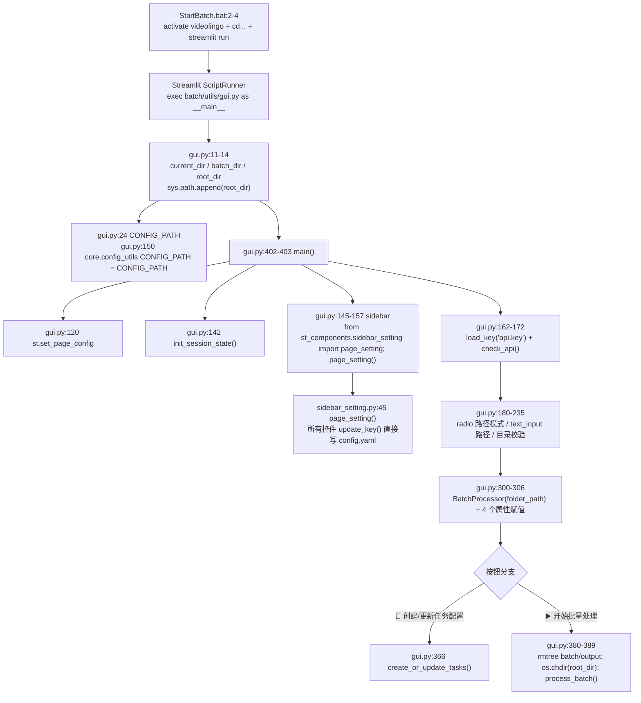
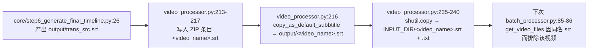

> ## ⚠️ 本文部分内容已在「重构 Round 1」后失效
>
> ⚠️ 本文中关于任务表 `Dubbing` 列、配音步骤、`prioritize_local` 的段落已失效：`Dubbing` 列已从模板与代码中移除，配音步骤已删除，字幕烧录不再受 `skip_preprocess` 影响。任务表列现为 `Video File / Source Language / Target Language / Status`。


# 批量模式入口（StartBatch.bat → gui.py → BatchProcessor）

批量模式是**第二个 Streamlit 应用**：入口不是 `st.py`，而是 `batch/utils/gui.py`，由 `batch/StartBatch.bat` 用 `python -m streamlit run` 拉起。它把「一组视频」串行地喂给与单次模式**同一套** `core/step*.py`，靠 `os.chdir(项目根)` + `output/` 目录复制/搬移来解决主流程硬编码相对路径的问题。

---

## 一、职责与边界

入口层只负责三件事：**决定视频从哪来**（目录扫描）、**决定任务表长什么样**（`batch/tasks_setting.xlsx` 的生成与状态回写）、**什么时候跑**（同步阻塞地在 Streamlit 脚本线程里调用 `BatchProcessor.process_batch()`）。它不实现任何下载/转录/翻译/配音算法——那些全部由 `core/step*.py` 完成，步骤清单硬编码在 `batch/utils/video_processor.py:51-93`。

本文只讲**进程怎么起来、一次批量运行的完整生命周期、目录与 config.yaml 被怎么改动**。GUI 控件清单、`batch/utils/` 四个模块的逐函数表格见 `../04-interfaces/03-批处理任务系统.md`。

---

## 二、文件清单

| 文件 | 行数 | 主要职责 |
| --- | --- | --- |
| `batch/StartBatch.bat` | 6 | 激活 conda 环境、`cd ..` 到项目根、用 Streamlit 启动 GUI |
| `batch/utils/gui.py` | 403 | 批量模式**唯一入口**：页面布局、设置侧边栏、文件夹选择、两个操作按钮、状态显示 |
| `batch/utils/batch_processor.py` | 493 | `BatchProcessor` 类：任务表生成与写回、目录扫描、视频预处理缓存、主处理循环 |
| `batch/utils/video_processor.py` | 326 | `process_video()`：把 16 个 core 步骤串成一条带重试的流水线；字幕打包与归档 |
| `batch/utils/tos_manager.py` | 217 | `BatchTOSManager`：TOS 上传跟踪（**当前未被调用**，见 `../04-interfaces/03-批处理任务系统.md`） |
| `batch/README.zh.md` | 60 | 面向用户的批量模式说明（任务表列含义、中断/错误处理） |
| `easy_util.py` | 189 | 全局统计（token / 耗时 / 进度 / `processing` 标志），被批量与单次模式共享 |
| `core/onekeycleanup.py` | 81 | `cleanup(dir)`：把 `output/*` 搬移到指定归档目录，批量模式的「每批归档」就靠它 |
| `core/step1_ytdlp.py` | 98 | `find_video_files()` / `download_video_ytdlp()`，批量模式复用（不绕过） |

---

## 三、调用链与数据流

### 3.1 启动链路（`StartBatch.bat` 真实内容）

```bat
@echo off
call "%USERPROFILE%\anaconda3\Scripts\activate.bat" videolingo
cd ..
python -m streamlit run "batch\utils\gui.py"

pause
```

`batch/StartBatch.bat:1-6` 逐行含义：

| 行 | 内容 | 作用与隐含假设 |
| --- | --- | --- |
| 2 | `call "...\anaconda3\Scripts\activate.bat" videolingo` | 激活名为 `videolingo` 的 conda 环境；**硬编码** `%USERPROFILE%\anaconda3` 与 env 名 |
| 3 | `cd ..` | 把 cwd 上跳一级。只有双击运行（cmd 把 cwd 设为 `batch/`）时才等于项目根 |
| 4 | `python -m streamlit run "batch\utils\gui.py"` | 用 Streamlit 跑 GUI（**不是 tkinter**）；脚本以 `__main__` 执行，因此 `batch/utils/gui.py:402` 的 `if __name__ == "__main__": main()` 生效 |
| 6 | `pause` | 进程退出/崩溃后保留控制台窗口，便于看 traceback |

启动与初始化调用链（真实函数名）：



要点：

- `sys.path` 三处补丁是整套 import 能工作的前提：`gui.py:11-14`（加项目根，供 `core.*` / `st_components.*` / `easy_util`）、`batch_processor.py:16-19`（同）、`video_processor.py:2`（`'..','..'`）。`batch/utils` 自身能进 `sys.path` 是因为 Streamlit 把被运行脚本所在目录加入路径——所以子模块之间用的是**扁平 import**（`gui.py:18 from batch_processor import BatchProcessor`、`batch_processor.py:23 import video_processor`、`video_processor.py:34 from tos_manager import get_batch_tos_manager`）。
- `CONFIG_PATH` 覆写（`gui.py:150`）是为了让 `core/config_utils.py` 用绝对路径找到 `config.yaml`，不依赖启动 cwd。覆写发生在调用 `load_key('api.key')`（`gui.py:162`）之前，顺序是必需的。
- GUI 初始化只建 6 个 `st.session_state` 键（`gui.py:35-47`）：`processing`、`current_progress`、`folder_path`、`process_complete_info`、`current_task_info`、`processor`。其中 `current_progress`（`gui.py:38-39`）与 `current_task_info`（`gui.py:44-45/52/59`）全仓库只写不读，是死状态。

### 3.2 一次批量运行的生命周期

`BatchProcessor.process_batch()`（`batch_processor.py:330-470`）的执行阶段：

| # | 阶段 | 代码位置 | 关键动作与副作用 |
| --- | --- | --- | --- |
| 1 | 重置统计 | `batch_processor.py:334` | `eu.reset_total_statistics()`：清零 `total_prompt_tokens` / `total_completion_tokens` / `total_time_duration`（**不清** `estimated_total_cost`） |
| 2 | 置运行标志 | `batch_processor.py:337` | `eu.set_processing(True)` → GUI 进度改为读 `eu.get_progress()`（`gui.py:68-69`） |
| 3 | API 自检 | `batch_processor.py:340-343` | `check_api()` 失败即 `return False`（`finally` 仍会执行） |
| 4 | 扫描目录 | `batch_processor.py:346` | `self.check_settings()`，**返回值被丢弃**；副作用：音频转 mp4 |
| 5 | 读任务表 | `batch_processor.py:349-351` | `pd.read_excel(tasks_setting_path)`，`total_tasks = len(df)` |
| 6 | 取 UI 占位符 | `batch_processor.py:354-360` | 从 `st.session_state` 取 `status_text` / `progress_placeholder` / `table_placeholder` / `display_task_status_func`，缺任一即 `return False` |
| 7 | 清预处理缓存 | `batch_processor.py:363` | `self.cleanup_temp_files()` → `shutil.rmtree('batch/temp_preprocess')` |
| 8 | 可选预处理阶段 | `batch_processor.py:366-386` | 仅当 `prioritize_local=True`：逐行只跑本地步骤（`process_video(..., preprocess_only=True)`），状态写 `Preprocessed` / `Preprocess Failed` |
| 9 | 主处理循环 | `batch_processor.py:389-449` | 逐行处理 / 跳过；每个状态变化都 `df.to_excel()` 落盘 + 调 `display_task_status_func` 刷新页面 |
| 10 | 总结 | `batch_processor.py:452-460` | 写 `st.session_state.process_complete_info`；`generate_batch_summary()` 写 `batch/output/batch_summary.txt` |
| 11 | 收尾 | `batch_processor.py:467-470` | `finally`：再清一次 `batch/temp_preprocess`，`eu.set_processing(False)` |


### 3.3 主流程硬编码 `output/` 相对路径的处理机制（本文最关键的一节）

**结论：不是改子进程 cwd（没有子进程），不是临时改名目录，而是「`os.chdir` 到项目根 + 把输入文件复制进 `output/` + 用 `cleanup()` 把 `output/*` 搬走后归档」三件套。**

| 机制 | 代码位置 | 做了什么 | 为什么必需 |
| --- | --- | --- | --- |
| ① 切换工作目录 | `gui.py:386` `os.chdir(root_dir)` | 点击「▶️ 开始批量处理」后把进程 cwd 设为项目根 | `core/*` 里全是 `output/log/cleaned_chunks.xlsx`、`output/audio/raw.mp3` 这类相对路径（如 `core/all_whisper_methods/whisperX_utils.py:8-11`），只有 cwd=项目根才成立 |
| ② 每视频清空工作区 | `video_processor.py:27` → `video_processor.py:143-146` `prepare_output_folder('output')` | 非重试视频开始时 `shutil.rmtree('output')`，再重建 `output/audio`、`output/log`（`video_processor.py:29-30`） | 主流程的幂等约定是「产物存在即跳过」，不清空则第二个视频会直接复用第一个视频的 `cleaned_chunks.xlsx` |
| ③ 输入文件复制进工作区 | `video_processor.py:148-159` `process_input_file()` / `video_processor.py:161-168` `copy_input_file()` | `shutil.copy(INPUT_DIR/file, 'output'/file)`，并设置 `eu.original_name` | `find_video_files()` 要求在 `output/` 下**恰好**找到 1 个视频（`core/step1_ytdlp.py:88-89`），且必须位于 `output/` 内 |
| ④ 成功后整目录搬到归档区 | `video_processor.py:139` `cleanup('batch/output')` → `core/onekeycleanup.py:7-41` | `shutil.move('output/*')` → `batch/output/<video_name>/`，`output/log/*`、`output/gpt_log/*` → 同名子目录；最后 `os.rmdir('output')` 腾空给下一个视频 | 这就是「批量交付物」的落地方式，也是下一个视频能从空工作区开始的保证 |
| ⑤ 失败时搬到 ERROR 区 | `video_processor.py:119` `cleanup('batch/output/ERROR')` | 同样的搬移，落到 `batch/output/ERROR/<video_name>/` | 保留现场供人工排查；`output/` 同样被搬空 |

三点必须知道的连带后果：

1. **`output/` 是批量模式与单次模式共用的同一个目录**。批量模式每个视频开始时会 `rmtree` 项目根的 `output/`（`video_processor.py:27`），未归档的单次模式结果会被直接删除。
2. **`batch/output/` 每次点击「开始批量处理」都会被整体删除重建**（`gui.py:380-383`：`shutil.rmtree(batch_output_dir)` + `os.makedirs`），上一次运行的归档、`ERROR/`、`SavedSubbtitles/`、`batch_summary.txt` 全部丢失。
3. `cleanup()` 自己也要用主流程的约定：它调 `find_video_files()` 并做 `video_file.split("/")[1]` 取视频名（`core/onekeycleanup.py:9-11`）。这依赖三件事——`output/` 下有且仅有一个视频、Windows 下已把 `\` 换成 `/`（`core/step1_ytdlp.py:84-85`）、且该视频不在 `output/output` 前缀下（`core/step1_ytdlp.py:86`，正是为了排除 `output/output_sub.mp4` 与 `output/output_dub.mp4`）。任一不成立，`cleanup()` 会抛 `ValueError`。

### 3.4 跳过已翻译视频的判据

判据分两级，**只有第一级真正实现「跳过已翻译」**：

| 级别 | 判据 | 代码位置 | 生效时机 |
| --- | --- | --- | --- |
| 建表级（题述判据） | 视频/音频**同目录**下存在 `<basename>.srt` 时，不再为该文件生成任务行 | `batch_processor.py:85-86`（视频）、`batch_processor.py:92-93`（音频）：`srt_file = os.path.splitext(os.path.basename(file))[0] + '.srt'`；`if srt_file not in os.listdir(directory)` | `create_or_update_tasks()` → `check_settings()` → `get_video_files()` |
| 行级 | `Status` 为空 / 含 `'Error'` / 等于 `'Preprocessed'` 才处理，否则跳过 | `batch_processor.py:393`，else 分支 `batch_processor.py:439-441` | `process_batch()` 主循环 |

这个 srt 标记文件的来源闭环（解释了为什么第二次建表就能跳过）：



⚠️ 注意：建表级判据只在**生成任务行**时生效；`tasks_setting.xlsx` 里已经存在的行不会被文件名判据清理，只能靠 `Status` 列（行级判据）跳过。另外 `save_subbtitles(save_to_video_storage_folder=True)` 只有在 `video_name + ".srt"` 真的存在于 `output/` 时才回写（`video_processor.py:237-240`），若 `output/trans_src.srt` 缺失（例如中途失败），标记文件不会生成。

### 3.5 「指定输入目录而非强制拷贝」的实现（README 改进项）

`batch/README.zh.md:18` 与根 `README.md:60` 都提到「批量模式支持指定目录，而非必需拷贝至 input 目录」。代码实现路径：

1. GUI 侧：`st.radio("选择路径模式", ["使用默认路径", "手动输入路径"])`（`gui.py:180-186`）；默认模式固定为 `os.path.join(root_dir, 'batch', 'input')`（`gui.py:198`），手动模式取 `st.text_input` 的值（`gui.py:207-214`）。
2. 处理器侧：`BatchProcessor(folder_path)` → `self.folder_path = os.path.abspath(folder_path)`（`batch_processor.py:30-32`）。
3. 每视频侧：`video_full_path = os.path.join(self.folder_path, video_file)`（`batch_processor.py:272`），拆成 `video_dir` / `video_filename`（`batch_processor.py:273-274`）后传给 `process_video(...)`（`batch_processor.py:283-287`）。
4. **真正生效的一行**：`video_processor.py:22-23`

   ```python
   global INPUT_DIR
   INPUT_DIR = video_storage_folder
   ```

   即 `process_video()` 的第一个参数就是「输入目录」，它把模块级 `INPUT_DIR`（默认值 `'batch/input'`，`video_processor.py:15`）动态改写成实际目录。此后所有读取走 `os.path.join(INPUT_DIR, file)`（`video_processor.py:154`、`video_processor.py:163`），所有回写走 `os.path.join(INPUT_DIR, ...)`（`video_processor.py:238`、`:240`）。

因此：**视频不需要放进 `batch/input`，也不会被复制到 `batch/input`**；但它一定会被 `shutil.copy` 到项目根的 `output/`（主流程要求 `output/` 下有唯一视频）。

`batch/temp_preprocess` 的参数化也依赖这一点：临时目录名用 `os.path.splitext(os.path.basename(video_file))[0]`（`batch_processor.py:193`、`video_processor.py:256`），只取 basename。

勾选「处理子目录」时（`gui.py:190-195` → `gui.py:302` 设置 `processor.process_subdirs`），`check_settings()` 用 `os.walk`（`batch_processor.py:112-115`），`get_video_files()` 返回的是**相对 `self.folder_path`** 的路径（`batch_processor.py:88`），例如 `sub/a.mp4`。此时每个视频的 `video_dir`（= `INPUT_DIR`）各不相同，srt/txt 也会回写到各自的子目录——这是刻意设计，但也意味着同名视频放在不同子目录时 `batch/temp_preprocess/<name>` 会撞名。

一个顺序上的注意点：GUI 在**创建 processor 之前**就校验目录存在（`gui.py:224-230` 的 `os.path.exists(folder_path)` → 不存在则 `st.error` 并 `return`），而 `os.makedirs(folder_path)` 只在 `BatchProcessor.__init__`（`batch_processor.py:49`）里执行。因此默认目录 `<root>/batch/input` 必须**先存在**（本仓库中 `batch/input`、`batch/output`、`batch/temp_preprocess` 均已存在但内容为空），否则连页面主体都渲染不出来；目录为空时则停在 `gui.py:334-335` 的「⚠️ 未在选择的文件夹中找到视频文件」。

### 3.6 全局统计的复用（`easy_util`）

| 调用 | 位置 | 作用 |
| --- | --- | --- |
| `eu.total_time_duration = 0`；`eu.estimated_total_cost = 0` | `batch_processor.py:45-46`（`BatchProcessor.__init__`） | 每次 GUI 重建 processor 时清零累计耗时/花费 |
| `eu.reset_total_statistics()` | `batch_processor.py:334`（`process_batch` 开头） | 重置 `total_prompt_tokens` / `total_completion_tokens` / `total_time_duration`（定义见 `easy_util.py:140-145`） |
| `record_start()` → `record_start_time()` + `reset_tokens()` | `video_processor.py:186-196`，作为每个视频的**第一个步骤**（`video_processor.py:52`、`:89`） | 记 `eu.start_time`，把 per-video `prompt_tokens` / `completion_tokens` / `total_tokens` 清零 |
| `eu.add_to_total_tokens()` / `eu.add_to_total_time()` / `eu.record_messages()` | `video_processor.py:130-135`（**仅在 `not preprocess_only` 时**） | 把当前视频 token/耗时累加进总数；`record_messages()` 另写 `output/cost.txt`（`easy_util.py:78`），随后被 `cleanup()` 搬进归档目录 |
| `eu.set_progress(completed/total)` | `batch_processor.py:391` | 主循环每轮刷新进度；`gui.py:68-69` 在 `eu.is_processing()` 时读它 |
| `eu.set_processing(True/False)` | `batch_processor.py:337` / `batch_processor.py:470` | 控制 GUI 进度数据源与两个按钮的 `disabled`（`gui.py:362`、`gui.py:375`） |
| `eu.get_total_tokens_summary()` | `video_processor.py:307`（`generate_batch_summary`） | 汇总 token，写 `batch/output/batch_summary.txt` |
| `eu.get_formated_total_estimated_cost()` | `batch_processor.py:454` | 写入 `process_complete_info['total_cost']`，由 `gui.py:110-114` 展示 |
| `eu.original_name` | `video_processor.py:152/158/167` 写，`video_processor.py:205` 读 | 字幕打包与回写文件的命名依据 |

三个与统计相关的坑（现状，不是建议）：

- **总耗时被算两次**：`core/step6_generate_final_timeline.py:190-193` 的 `record_summary_info()` 已经 `eu.total_time_duration += eu.time_duration`，批量的 `eu.add_to_total_time()`（`easy_util.py:107-110`）又加了一次 `time_duration`。因此 `batch_summary.txt` 与 GUI 的「总耗时」约为真实值的 2 倍。
- **`estimated_total_cost` 不会被 `reset_total_statistics()` 清零**（`easy_util.py:140-145` 只重置三个变量），多次点击「开始批量处理」会持续累加。
- **页面上的「总花费」与总结文件里的「总花费」不同源**：GUI 用 `eu.get_formated_total_estimated_cost()`（读 `estimated_total_cost`，来自 step6 累加），`batch_summary.txt` 用 `eu.get_formatted_total_cost()`（现算 `total_prompt_tokens`/`total_completion_tokens`，`video_processor.py:318`），两者会给出不同数字。

### 3.7 运行期间前台 GUI 与「后台」的关系

**没有后台线程。** 关键证据：

- `batch_processor.py:10` 有 `from threading import Lock`，`batch_processor.py:27` 有 `status_lock = Lock()`，但**全仓库再无 `status_lock` 引用**——这是唯一的线程原语，且是死代码。
- `batch/` 目录下没有任何 `import threading` / `Thread(` / `threading.` 的使用（`video_processor.py:6` 的 `import shutil, time` 与 `:11` 的 `import time` 只是重复导入）。
- 处理调用是同步的：`gui.py:389 st.session_state.processor.process_batch()` 位于按钮分支的 `try` 里，会把整个 Streamlit 脚本运行阻塞到批处理结束，然后 `gui.py:393-395` 的 `finally` 置 `processing=False` 并 `st.rerun()`。

进度是怎么刷新的：

| 机制 | 代码位置 | 说明 |
| --- | --- | --- |
| 三个占位符 | `gui.py:342-350` `status_placeholder = st.empty()` / `progress_placeholder = st.empty()` / `table_placeholder = st.empty()`，并把 `status_placeholder.empty()` 存成 `st.session_state.status_text` | 容器式增量更新；`process_batch` 从 `st.session_state` 取回这四个对象（`batch_processor.py:354-357`） |
| 状态文字 | `batch_processor.py:373/402/429/431/441` 调 `status_text.text/success/markdown/info/warning` | 每条消息都由 Streamlit 立即推给浏览器 |
| 进度条 | `display_task_status` → `progress_placeholder.columns([1,4])` + `st.text(f"总进度: …%")` + `st.progress(progress)`（`gui.py:76-80`） | 数据源：`eu.is_processing()` 时用 `eu.get_progress()`，否则按 `Status=='Done'` 计数（`gui.py:68-73`） |
| 任务表格 | `gui.py:103-105` `table_placeholder.dataframe(styled_df, use_container_width=True)` | 每次状态变更后重读 xlsx 并重绘 |
| 自动刷新块 | `gui.py:398-400` `if st.session_state.processing: time.sleep(0.5); st.rerun()` | 只在「`processing=True` 且本次运行**没有**进入按钮分支」时执行；处理期间脚本被阻塞，这一段不会跑到 |

由此推出两条必须知道的交互事实：

1. 运行期间页面上的设置控件**无法交互**（脚本线程被占用），此时用侧边栏改配置也不会生效；要改 `config.yaml` 请先停掉批处理。
2. 「停止」只能靠外部手段（关掉命令行窗口 / 杀进程）。中途被杀会留下被改写的 `config.yaml` 语言键——这正是 `batch/README.zh.md:49-51` 的「中断处理」警告（恢复逻辑在 `batch_processor.py:296-299` 的 `finally`，进程被强杀时不执行）。

---

## 四、关键数据结构

### 4.1 任务表 `batch/tasks_setting.xlsx`

| 列名 | 方向 | 类型/取值 | 读取位置 | 写入位置 |
| --- | --- | --- | --- | --- |
| `Video File` | 输入 | 相对 `folder_path` 的文件名（可含子目录，如 `sub/a.mp4`）或 YouTube URL | `batch_processor.py:370`、`:394` | `batch_processor.py:148` |
| `Source Language` | 输入 | `whisper.language` 的取值（`en` / `zh` / `ja` …）或空 | `batch_processor.py:415` | `batch_processor.py:145`、`:149` |
| `Target Language` | 输入 | 自然语言描述（如 `简体中文`），来自 `target_language` | `batch_processor.py:416` | `batch_processor.py:146`、`:150` |
| `Dubbing` | 输入 | `0`/空=不配音；`1`=配音。读取时 `0 if pd.isna(row['Dubbing']) else int(row['Dubbing'])` | `batch_processor.py:417` | `batch_processor.py:151`（默认 0） |
| `Status` | 输入 + 输出 | 见 4.2 | `batch_processor.py:369`、`:393`、`:418`；`gui.py:71`、`:100` | `batch_processor.py:377/379/405/424` |

**列顺序与列名的依据来源**（按要求说明，未解析二进制）：

1. `batch/utils/batch_processor.py:127`：模板不存在时的建表语句 `pd.DataFrame(columns=['Video File', 'Source Language', 'Target Language', 'Dubbing', 'Status'])` —— 给出**列名与顺序**。
2. `batch/utils/batch_processor.py:147-153`：逐视频 `pd.concat` 的新行同样用这 5 个键——给出**列名**。
3. `batch/README.zh.md:31-43`：面向用户的手工编辑说明，列出 `Video File` / `Source Language` / `Target Language` / `Dubbing` 四列及可选值（未提 `Status`）；`batch/README.zh.md:56` 提到错误信息写在 `Status` 列。
4. 全部取值都是**按列名**（`row['Status']`、`df.at[index, 'Status']`、`df['Status']`），代码中**没有** `iloc[n]` 形式的列索引访问。

> ⚠️ 需人工确认：仓库中已存在的 `batch/tasks_setting-template.xlsx` 的真实表头（未解析二进制文件，依据不足）。本文档中的列名/顺序是**从代码推断**的。若模板表头与该推断不一致，会出现两个具体故障：`create_or_update_tasks` 的 `pd.concat`（`batch_processor.py:154`）产生额外的 NaN 列；`process_batch` 的 `row['Status']`（`batch_processor.py:393`）抛 `KeyError`。人工打开模板核对一次即可消除该不确定性。

### 4.2 `Status` 列的取值枚举

| 值（逐字） | 写入位置 | 语义 | GUI 展示（`gui.py:85-98`） |
| --- | --- | --- | --- |
| `None` / NaN | `batch_processor.py:152`（建表） | 等待处理 | `🕐 等待处理` |
| `Processing...` | `batch_processor.py:405` | 正在处理（**持久化到 xlsx**） | `⏳ 处理中` |
| `Preprocessed` | `batch_processor.py:377` | 预处理阶段完成（仅 `prioritize_local`） | 原样显示（`gui.py:98` 兜底 `return x`） |
| `Preprocess Failed` | `batch_processor.py:379` | 预处理失败 | 原样显示 |
| `Done` | `batch_processor.py:293` → `:424` | 全流程成功 | `✅ 完成` |
| `Error: <error_step> - <error_message>` | `batch_processor.py:293` → `:424` | 第 4 次重试仍失败；`error_step` 是步骤中文名（如 `🎙️ Transcribing with Whisper`） | `❌ …`（把 `-` 替换为空格，`gui.py:88-91`） |
| `Error: Unhandled exception - <str(e)>` | `batch_processor.py:295` | `process_single_video` 自身抛异常 | `❌ …` |
| `Skipped` | **无任何写入方** | 计划中语义：已跳过 | `⏭️ 跳过`；同时也是 `gui.py:71` 的进度分子条件 |

> `Skipped` 是死分支：`process_batch` 的跳过分支（`batch_processor.py:439-441`）只打印 `⏭️ 已跳过`，不写状态，所以 `Status` 保持 `Done`，`gui.py` 也据此显示 `✅ 完成`。

### 4.3 批量模式的落盘产物

| 路径 | 生产者 | 性质 |
| --- | --- | --- |
| `batch/input/` | 用户 | **放文件目录**（GUI 默认路径，`gui.py:198`） |
| `batch/tasks_setting-template.xlsx` | 仓库自带 / `batch_processor.py:126-128` 兜底创建 | 模板（只读，被 `shutil.copy2` 到任务表，`batch_processor.py:135`） |
| `batch/tasks_setting.xlsx` | `create_or_update_tasks` + 主循环 | **状态写回载体**（每步都整体重写） |
| `batch/temp_preprocess/<video_name>/{raw.mp3,for_whisper.mp3,cleaned_chunks.xlsx}` | `save_preprocess_results`（`batch_processor.py:198-212`） | 中间产物缓存，仅 `prioritize_local` 使用；运行结束被整体删除（`batch_processor.py:469`） |
| `output/`（项目根） | 主流水线 | **主流程工作区**（全部 `core` 中间产物），每个视频开始前被清空、处理完被搬空 |
| `batch/output/<video_name>/` | `cleanup('batch/output')`（`video_processor.py:139`） | **交付归档**：`output/*` + `log/` + `gpt_log/` |
| `batch/output/ERROR/<video_name>/` | `cleanup('batch/output/ERROR')`（`video_processor.py:119`） | 失败现场归档 |
| `batch/output/SavedSubbtitles/<video_name>_subtitles.zip` | `save_subbtitles`（`video_processor.py:200-244`） | 字幕 ZIP：`<name>.srt`、`<name>_src.srt`、`<name>_trans.srt`、`<name>_src_trans.srt`、`<name>_trans_src.srt`、`<name>.txt` |
| `batch/output/batch_summary.txt` | `generate_batch_summary`（`video_processor.py:322-324`） | 批处理总结（耗时 + token + 花费） |
| `<INPUT_DIR>/<video_name>.srt`、`<INPUT_DIR>/<video_name>.txt` | `save_subbtitles`（`video_processor.py:235-240`） | 回写到视频所在目录；`.srt` 同时是下次建表的「已翻译」标记（见 3.4） |

---

## 五、逐函数/逐模块实现说明（入口层）

按模板要求，本节只列**入口与生命周期**相关函数；`batch/utils/` 四个模块的完整逐函数表格见 `../04-interfaces/03-批处理任务系统.md`。

| 函数签名 | 作用 | 关键实现细节 | 副作用 | 异常/回退 |
| --- | --- | --- | --- | --- |
| `gui.py:26 check_api()` | 用一次 LLM 往返判断 API 可用 | `ask_gpt("This is a test, …", response_json=True, log_title='None')`，判断 `resp.get('message') == 'success'` | 网络请求；`log_title='None'` 时**不写**成功日志（`core/ask_gpt.py:122-123`），失败路径仍可能写 `output/gpt_log/error.json` | `except Exception: return False` |
| `gui.py:35 init_session_state()` | 建 6 个 session 键 | 见 3.1 说明 | 改 `st.session_state` | 无 |
| `gui.py:49 start_processing()` | 按钮 `on_click` 回调 | 置 `processing=True`，清 `process_complete_info` / `current_task_info` | 改 `st.session_state` | 无 |
| `gui.py:54 reset_processor()` | 让 processor 失效重建 | `processor=None; processing=False` | 绑到多个控件的 `on_change`（`gui.py:185/194/213/248/257/271/281`） | 无 |
| `gui.py:61 display_task_status(tasks_setting_path, status_placeholder, progress_placeholder, table_placeholder)` | 重读 xlsx 并重绘进度与表格 | `pd.read_excel` → 计算 `progress` → `progress_placeholder.columns([1,4])` 显示文本+进度条 → `format_status` 中文化 → `table_placeholder.dataframe`；`process_complete_info` 存在且 `not processing` 时 `st.success` 总结 | 读 xlsx；写 3 个占位符 | 整体 `try/except` → `st.error(f"读取任务状态失败: {e}")` |
| `gui.py:119 main()` | 页面装配与按钮分发 | 见 3.1 流程图；「▶️」分支先 `shutil.rmtree('batch/output')` + `os.makedirs`（`gui.py:380-383`）、再 `os.chdir(root_dir)`（`gui.py:386`）、再 `process_batch()`（`gui.py:389`），`finally` 置 `processing=False` + `st.rerun()`（`gui.py:393-395`） | 删目录、改 cwd、改 `config.yaml`（经 `page_setting`）、跑整条流水线 | `except Exception` → `st.error(f"❌ 处理过程中出现错误: {e}")` |
| `batch_processor.py:330 BatchProcessor.process_batch()` | 批量主流程 | 见 3.2 生命周期表 | 见 3.2/3.3 | 外层 `except Exception` → `console.print` + `status_text.error(...)`（`batch_processor.py:463-466`；⚠️ 若异常发生在 `batch_processor.py:354` 之前，`status_text` 未定义会再抛 `NameError`）；`finally` 清临时目录 + 复位 `processing` |
| `batch_processor.py:487-493 __main__` | 命令行备用入口 | `python batch_processor.py <folder_path>` → `BatchProcessor(folder_path).process_batch()` | 同 process_batch | 无路径参数时打印「未提供视频存储文件夹路径」；⚠️ 该入口不会 `os.chdir(root_dir)`，相对路径会落在调用者 cwd |

---

## 六、关键参数与配置

批量模式**直接读写**的 `config.yaml` 键：

| 键路径 | 读/写 | 代码位置 | 说明 |
| --- | --- | --- | --- |
| `whisper.language` | 读 + 临时写 + 恢复 | `batch_processor.py:145`、`:261`、`:266-267`、`:298` | 每个视频按行覆盖，`finally` 恢复为原值 |
| `target_language` | 读 + 临时写 + 恢复 | `batch_processor.py:146`、`:262`、`:268-269`、`:299` | 同上 |
| `resolution` | 读 | `video_processor.py:68`（`load_key("resolution") != "0x0"`） | 决定是否追加 `step7_merge_sub_to_vid.merge_subtitles_to_video`；`0x0` 会生成 0 秒黑屏占位视频（`core/step7_merge_sub_to_vid.py:48-59`） |
| `ytb_resolution` | 读 | `video_processor.py:19`、`:150` | YouTube 下载清晰度 |
| `api.key` | 读 | `gui.py:162` | 为空则提示并 `return`；另经 `core/ask_gpt.py` 读 `api.base_url` / `api.model` |
| `allowed_video_formats` | 间接读 | `core/step1_ytdlp.py:82`（`find_video_files` 用） | ⚠️ `BatchProcessor.get_video_files` 用的是**硬编码**扩展名元组（`batch_processor.py:84`、`:90`），与 config 里的 `allowed_video_formats` / `allowed_audio_formats` 目前一致但需两处同步维护 |
| `transcription_only` | 间接读 | `core/step4_2_translate_all.py:69` | 批量模式**不做**任何短路（对比 `st.py:88-104`），`get_summary()` 仍会执行 |
| `asr_engine` | 间接读 | `core/step2_whisperX.py:346` | 决定预处理缓存是否包含 `for_whisper.mp3`（见 §七 第 8 条） |
| `max_workers` | 间接读 | `core/step4_2_translate_all.py:107`、`core/step5_splitforsub.py:97`、`core/step3_2_splitbymeaning.py:121`、`core/step10_gen_audio.py:102` | 每个视频内部的 LLM/TTS 并发度 |
| `demucs` | 间接读 | `core/step2_whisperX.py:342` | 人声分离 |
| `tos.*` | 间接读 | `batch/utils/tos_manager.py:40`、`core/all_whisper_methods/volcano_asr.py:87` | 批量层只用 `is_enabled()` 打日志（`video_processor.py:34-39`） |

侧边栏可改的全部键：`gui.py:154` 调用单次模式同一个 `st_components/sidebar_setting.py:45 page_setting()`，因此 `api.*`、`asr_engine`、`whisper.language`、`target_language`、`demucs`、`transcription_only`、`resolution`、`volcano_asr.*`、`tos.*`、`tts_method` 及各 TTS 子键都能在批量界面直接改，全部经 `update_key()` **立即写回 `config.yaml`**。

批量模式**忽略**的键：

| 键路径 | 现状 |
| --- | --- |
| `pause_before_translate` | 只在 `st.py:108-109` 被读取；批量流水线（`video_processor.py:174-176`）不检查，不会暂停等人工编辑 `terminology.json` |
| `subtitle.max_length` / `summary_length` / `max_split_length` / `speed_factor` / `min_subtitle_duration` 等 | 无批量专属分支，全部由被调用的 core 步骤内部读取 |

> ⚠️ 与 `batch/README.zh.md:16` 的差异：README 说「点击『重新检查API』」，代码里没有这个标签的按钮——侧边栏对应的是 key 为 `api` 的 `📡` 按钮（`st_components/sidebar_setting.py:73-75`，只弹 toast）；页面级检查 `check_api()`（`gui.py:168`）在**每次页面重跑**时都会执行，刷新页面即可重新检查。

---

## 七、技术要点与坑

1. **cwd 假设链**：`StartBatch.bat:3` 的 `cd ..` 依赖「cwd = `batch/`」；若从别的目录调用批处理脚本，启动阶段 cwd 会不对。真正兜底的是 `gui.py:386` 的 `os.chdir(root_dir)`，但它只在点击「开始批量处理」之后执行——启动阶段的 `gui.py:24 CONFIG_PATH` 已是绝对路径，所以配置读取是安全的。
2. **`output/` 被批量模式删除**：`video_processor.py:27` 对每个非重试视频执行 `prepare_output_folder('output')`，项目根 `output/` 连同单次模式未归档的结果一起被 `rmtree`。想保留请先归档（单次模式的「归档到历史记录」）。
3. **`batch/output/` 每次运行被清空**：`gui.py:380-383`。跨运行的归档不会被累加。
4. **扁平 import 的脆弱性**：`import video_processor`（`batch_processor.py:23`）、`from tos_manager import get_batch_tos_manager`（`video_processor.py:34`）只有在 `batch/utils` 位于 `sys.path` 时才成立（Streamlit 会加入被运行脚本的目录）。若从项目根用 `python -c "import batch.utils.batch_processor"` 之类的包式导入，会直接 `ModuleNotFoundError`。
5. **`config.yaml` 在运行期被反复改写**：`whisper.language` / `target_language` 每视频两次写入（`update_key` → ruamel 重写整个文件，`core/config_utils.py:28-47`）。进程被强杀则留下了该视频的语言值 → 下次运行前需人工核对（README 已警告）。
6. **`prioritize_local` 会静默禁用字幕烧录**：`video_processor.py:65` 的条件是 `not preprocess_only and not skip_preprocess`，而 `skip_preprocess=True` 正是「优先本地计算」路径（`batch_processor.py:419`）。因此勾选该选项后，即使 `resolution != '0x0'` 也不会执行 `step7`，归档里没有 `output_sub.mp4`。
7. **预处理缓存只在本进程内存里有效**：`batch/temp_preprocess` 在 `process_batch` 开头（`batch_processor.py:363`）与 `finally`（`batch_processor.py:469`）都会被整体删除，且 `self.preprocessed_files`（`batch_processor.py:64`）是内存 set，不落盘。跨运行没有缓存可用。
8. **火山引擎 ASR 下预处理优化必然失效**：`save_preprocess_results` 只保存 `raw.mp3` / `for_whisper.mp3` / `cleaned_chunks.xlsx`（`batch_processor.py:203-207`），而 `asr_engine == 'volcano'` 时 `core/step2_whisperX.py:348-357` 走 `output/audio/raw.wav`、**不会**生成 `for_whisper.mp3`。于是 `restore_preprocess_results` 因缺文件返回 `False`（`batch_processor.py:219-221`），上层打印「无法恢复预处理结果，将重新执行预处理步骤」（`batch_processor.py:279`）；`video_processor.restore_preprocessed_files` 则直接抛异常被捕获（`video_processor.py:42-48`）。净效果：`prioritize_local` 白白多跑一遍本地步骤。
9. **归档依赖 `output/` 下唯一视频**：`cleanup()` 走 `find_video_files()`（`core/onekeycleanup.py:9`），数量不为 1 会抛 `ValueError`（`core/step1_ytdlp.py:88-89`）。若该异常发生在失败处理器内部（`video_processor.py:119`），错误归档不会执行，异常继续冒泡到 `process_single_video`，最终记为 `Error: Unhandled exception - …`（`batch_processor.py:295`）。
10. **`step7` 可能直接终止整批**：`core/step7_merge_sub_to_vid.py:61-63` 在缺 srt 时调用 `exit(1)`（抛 `SystemExit`）。`video_processor.py:112` 只捕 `Exception`，`SystemExit` 不在其列，因此不会被 4 次重试兜住。
11. **音频输入是破坏性的**：`convert_audio_to_video`（`batch_processor.py:70-77`）生成同名 `.mp4` 后会 `os.remove(input_audio)` 删除源音频，且只在目标 mp4 不存在时才转换。
12. **GUI 完全阻塞、无进度回写通道给「取消」**：见 3.7。相关的 `status_lock` / `Lock` 是死代码。
13. **`gpt_sovits` TTS 在批量模式会挂住**：`core/all_tts_functions/gpt_sovits_tts.py:168` 用 `input("Have you started the server? (y/n): ")` 阻塞等待键盘输入，且被 `video_processor.py` 的 4 次重试包装——批量运行会在那里停住等控制台输入。

---

## 八、扩展点

### 8.1 新增任务表列

要动的位置：`batch_processor.py:127`（模板建表列名）、`batch_processor.py:147-153`（新行赋值）、主循环里读取该列的位置（`batch_processor.py:393-420`）、`gui.py` 的展示逻辑（若需要中文化，改 `display_task_status` 的 `format_status`）。

注意两点：① `create_or_update_tasks()` 会 `os.remove` 旧任务表并从模板重建（`batch_processor.py:131-135`），手工加的列/行会被清掉（`batch/README.zh.md:21` 已有警告）；② 新列必须同时存在于 `tasks_setting-template.xlsx`，否则 `pd.concat` 会产生 NaN 列。

### 8.2 并发处理多视频

当前是**严格串行**（`batch_processor.py:389` 的 `for index, row in df.iterrows()`）。要并发，先解决四个共享状态：

| 冲突点 | 位置 | 处理方向 |
| --- | --- | --- |
| 所有视频共用项目根 `output/` | `video_processor.py:16`、`:27`、`:143-146` | 需改为每视频独立工作目录（或让 `OUTPUT_DIR` 可注入），否则 `prepare_output_folder` 会互相删文件 |
| `config.yaml` 是全局可变状态 | `batch_processor.py:266-269`、`core/config_utils.py:9` 的 `config_lock` 只在单进程内有效 | 需把语言等按行参数改为参数传递，或串行化「改配置 + 跑该视频」这一段 |
| `cleanup()` 依赖 `output/` 唯一视频 | `core/onekeycleanup.py:9-11` | 需给 `cleanup()` 传明确的视频名（当前签名只接受 `history_dir`） |
| `easy_util` 是模块级全局量 | `easy_util.py:7-38`（`start_time`、`prompt_tokens`、`total_time_duration`…） | 需改为 per-video 上下文对象，否则统计互相覆盖 |
| GUI 占位符是单一对象 | `batch_processor.py:354-357` | 状态文本需带 video 前缀，或汇总展示 |

> 💡 建议：最小可行方案是「进程级并行」而不是线程并行——每个子进程拿到独立的 `output/`（例如用 `output_<video_name>/` 并在子进程内 `chdir` 到软链/临时目录），父进程只负责 xlsx 读写与 UI 刷新。

### 8.3 失败重试策略

现状：**页内重试** + **跨运行重试**两层。

- 页内：`video_processor.py:98-107` 对每个步骤最多 4 次尝试，`attempt > 0` 时先 `time.sleep(5 * 3 ** (attempt - 1))`（即 5s / 15s / 45s，累计 65s）；4 次全败则 `cleanup(ERROR_OUTPUT_DIR)` 并返回 `(False, current_step, str(e))`（`video_processor.py:113-120`）。
- 跨运行：`Status` 含 `Error` 的行下次运行会被重新处理（`batch_processor.py:393`），且此时 `is_retry=True`（`batch_processor.py:418`），使 `video_processor.py:26-30` **不清空** `output/`，从而复用已完成的中间产物实现断点续跑。

要注意的语义细节：`is_retry` 取值表达式是 `not pd.isna(row['Status']) and 'Error' in str(row['Status'])`（`batch_processor.py:418`），其中 `row` 是 `iterrows()` 产出的行对象，而 `Status` 已在 `batch_processor.py:405` 被改写为 `'Processing...'`；实测（pandas 2.2.3）`row` 不反映这次写回，因此 `is_retry` 表示的是「**上一次**状态含 Error」，符合设计意图，但这是一处对 pandas 语义的隐式依赖。

> 💡 建议：① 在 GUI 增加「仅重试 ERROR 任务」按钮，把 `batch/output/ERROR/<name>/` 按 README 的做法还原（`batch/README.zh.md:58-60` 描述的是人工操作）；② 把 `time.sleep` 的退避参数提到 config；③ 让失败归档改用「按视频名归档」而不是依赖 `find_video_files()`。

### 8.4 其他可扩展点

- **批量模式的耗时/花费统计修正**：见 §3.6 的三条，改动点分别是 `core/step6_generate_final_timeline.py:190-194`、`easy_util.py:140-145`、`batch_processor.py:454` 与 `video_processor.py:318`。
- **`batch/utils/tos_manager.py` 当前是死代码**（详见 `../04-interfaces/03-批处理任务系统.md`）：若要给火山引擎 ASR 做「批量上传/批后清理」，应在 `video_processor.py:33-39` 那个位置把 `upload_file_for_batch` / `cleanup_after_video_processed` 真正接上。

---

## 九、验证方式

以下命令都在项目根 `E:\VideoLingo\VideoLingoMove` 下、`videolingo` 环境中执行。

**① 只看目录约定，不跑批处理（零副作用）**

```powershell
Get-ChildItem -Recurse batch | Select-Object FullName      # 看 input/ output/ temp_preprocess/ tasks_setting*.xlsx
Get-ChildItem batch\input -File                            # 用户放了什么
```

**② 验证「跳过已翻译」判据（零副作用，复刻 `batch_processor.py:85-86` 的逻辑）**

```powershell
$d = "E:\VideoLingo\VideoLingoMove\batch\input"
Get-ChildItem $d -File | Where-Object { $_.Extension -in '.mp4','.mkv','.mov' } | ForEach-Object {
  $srt = [IO.Path]::GetFileNameWithoutExtension($_.Name) + '.srt'
  "{0} -> 跳过? {1}" -f $_.Name, (Test-Path (Join-Path $d $srt))
}
```

**③ 启动 GUI（会真正跑流水线，仅在确有必要时使用）**

```powershell
cd E:\VideoLingo\VideoLingoMove
python -m streamlit run batch\utils\gui.py
```

等价于 `batch/StartBatch.bat`（该 bat 只是先 `activate videolingo` 再 `cd ..`）。页面出现「✅ API状态: 正常」即入口链路正常。

**④ 单函数验证（只扫描目录）**

```python
import sys, os
sys.path.insert(0, r'E:\VideoLingo\VideoLingoMove\batch\utils')
sys.path.insert(0, r'E:\VideoLingo\VideoLingoMove')
os.chdir(r'E:\VideoLingo\VideoLingoMove')          # 主流程相对路径的前提
from batch_processor import BatchProcessor
p = BatchProcessor(r'E:\VideoLingo\VideoLingoMove\batch\input')
print(p.check_settings())     # ⚠️ 若目录里有 .wav/.mp3/.flac/.m4a，会触发 ffmpeg 转 mp4 并删除源音频
```

**⑤ 状态写回观察**：批处理运行中，用只读方式重新打开 `batch/tasks_setting.xlsx` 可看到当前行是 `Processing...`。⚠️ **不要用 Excel 打开并保持占用**——`df.to_excel` 会因文件锁失败并中断（`batch/README.zh.md:45`）。

**⑥ 归档结果核对**：一次成功运行后应存在 `batch/output/<video_name>/`（含 `log/`、`gpt_log/`）、`batch/output/SavedSubbtitles/<video_name>_subtitles.zip`、`batch/output/batch_summary.txt`，以及 `<输入目录>/<video_name>.srt`、`<video_name>.txt`。

---

## 十、相关文档

- [`../04-interfaces/03-批处理任务系统.md`](../04-interfaces/03-批处理任务系统.md) —— 四个模块的逐函数表、GUI 控件清单、时序图、代码边界与技术债
- [`../00-overview/01-项目总览与架构.md`](../00-overview/01-项目总览与架构.md) —— 进程模型与模块依赖
- [`../00-overview/02-数据流与中间产物.md`](../00-overview/02-数据流与中间产物.md) —— `output/` 下每个中间产物的契约（批量模式复用的正是这一套）
- [`../00-overview/03-快速上手与调试.md`](../00-overview/03-快速上手与调试.md) —— 环境与启动
- [`../01-entrypoints/01-Streamlit主应用入口.md`](01-Streamlit主应用入口.md) —— 单次模式入口（规划中）
- [`../README.md`](../README.md) —— devdocs 总入口
