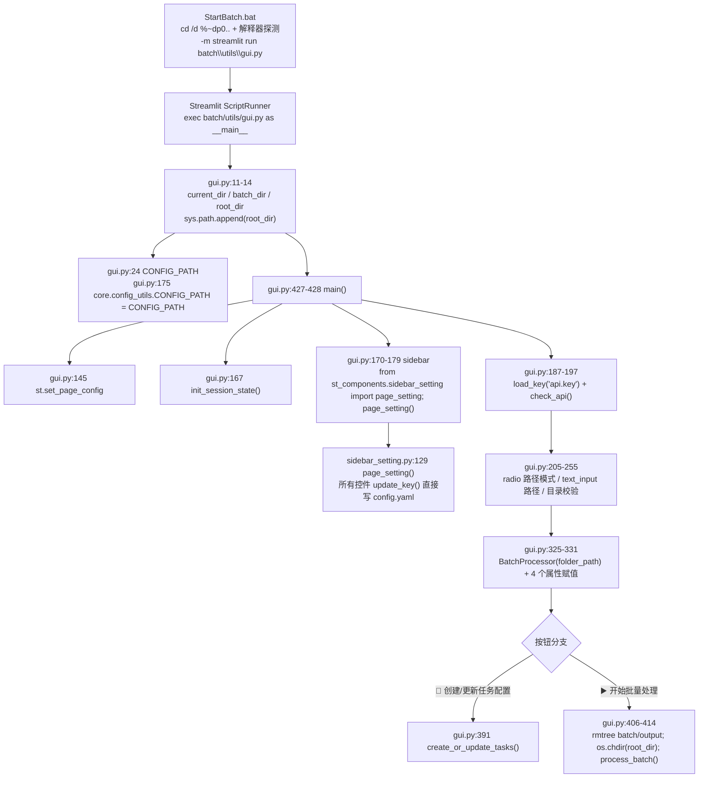
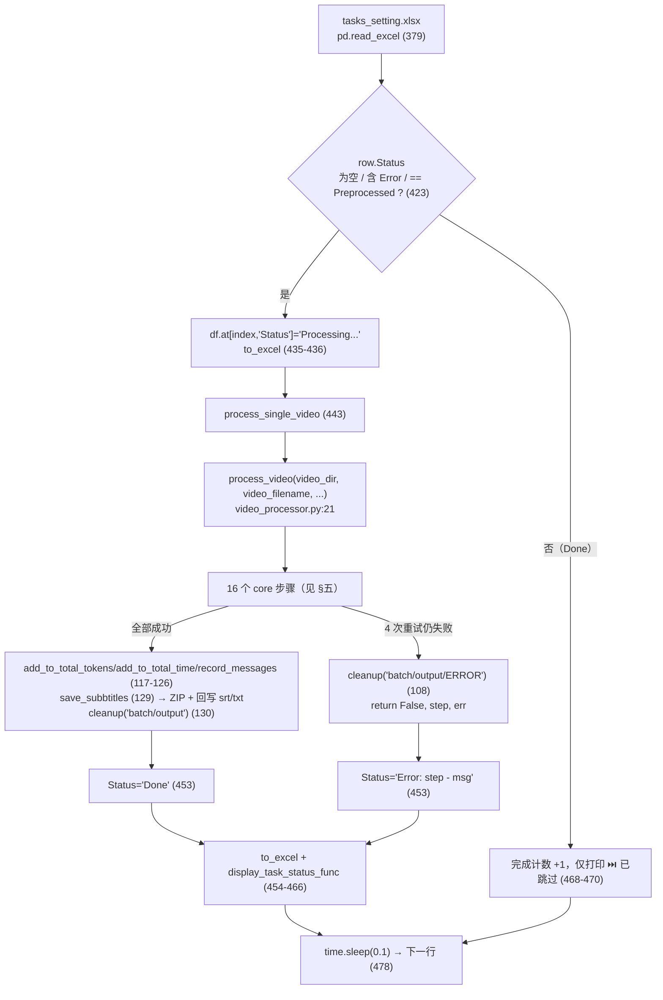
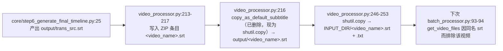

> ## ⚠️ 本文部分内容已在「重构 Round 1」后失效
>
> ⚠️ 本文中关于任务表 `Dubbing` 列、配音步骤、`prioritize_local` 的段落已失效：`Dubbing` 列已从模板与代码中移除，配音步骤已删除，字幕烧录不再受 `skip_preprocess` 影响。任务表列现为 `Video File / Source Language / Target Language / Status`。


# 批量模式入口（StartBatch.bat → gui.py → BatchProcessor）

批量模式是**第二个 Streamlit 应用**：入口不是 `st.py`，而是 `batch/utils/gui.py`，由 `batch/StartBatch.bat` 用 `python -m streamlit run` 拉起。它把「一组视频」串行地喂给与单次模式**同一套** `core/step*.py`，靠 `os.chdir(项目根)` + `output/` 目录复制/搬移来解决主流程硬编码相对路径的问题。

---

## 一、职责与边界

入口层只负责三件事：**决定视频从哪来**（目录扫描）、**决定任务表长什么样**（`batch/tasks_setting.xlsx` 的生成与状态回写）、**什么时候跑**（同步阻塞地在 Streamlit 脚本线程里调用 `BatchProcessor.process_batch()`）。它不实现任何下载/转录/翻译算法——那些全部由 `core/step*.py` 完成，步骤清单硬编码在 `batch/utils/video_processor.py:52-82`。

本文只讲**进程怎么起来、一次批量运行的完整生命周期、目录与 config.yaml 被怎么改动**。GUI 控件清单、`batch/utils/` 四个模块的逐函数表格见 `../04-interfaces/03-批处理任务系统.md`。

---

## 二、文件清单

| 文件 | 行数 | 主要职责 |
| --- | --- | --- |
| `batch/utils/batch_paths.py` | 47 | **零依赖**的路径辅助：`ROOT_DIR`、`default_input_dir()`、`ensure_dir()`、`ensure_default_input_dir()`。抽出来是为了能脱离 streamlit / torch 单测（`gui.py` 一导入就会拉起整条重依赖链） |
| `batch/StartBatch.bat` | 77 | **纯 ASCII**；`cd /d "%~dp0.."` 回项目根、**解释器探测**（`.venv` → conda `videolingo` → PATH）、体检后用 Streamlit 启动 GUI |
| `batch/utils/gui.py` | 476 | 批量模式**唯一入口**：页面布局、设置侧边栏、文件夹选择（默认目录自动创建）、两个操作按钮、状态显示 |
| `batch/utils/batch_processor.py` | 527 | `BatchProcessor` 类：任务表生成与写回、目录扫描（含音频转 mp4）、视频预处理缓存、主处理循环 |
| `batch/utils/video_processor.py` | 358 | `process_video()`：把 core 的字幕步骤串成一条带重试的流水线；字幕打包与归档 |
| `batch/README.zh.md` | 60 | 面向用户的批量模式说明（任务表列含义、中断/错误处理） |
| `easy_util.py` | 245 | 全局统计（token / 耗时 / 进度 / `processing` 标志），被批量与单次模式共享；另有 `check_cancel()` 取消钩子（`easy_util.py:231`，Streamlit 任务执行器用） |
| `core/onekeycleanup.py` | 91 | `cleanup(dir)`：把 `output/*` 搬移到指定归档目录，批量模式的「每批归档」就靠它；取名改用 `find_media_file()`（`core/onekeycleanup.py:9`），因此音频输入也能归档 |
| `core/step1_ytdlp.py` | 280 | `find_video_files()` / `download_video_ytdlp()` / `find_media_file()` / 输入清单（`output/input_manifest.json`），批量模式只复用前两个（见 §3.3） |

---

## 三、调用链与数据流

### 3.1 启动链路（`StartBatch.bat` 真实内容）

2026-09-19 重写。旧版只有 6 行、硬编码 conda，而且 `cd ..` 依赖「cwd 恰好是 `batch/`」；
现在与另外两个启动脚本统一成「纯 ASCII + 切目录 + 解释器探测」：

```bat
@echo off
setlocal EnableExtensions
cd /d "%~dp0.."          & rem 回项目根：不依赖调用方 cwd（旧版 cd .. 从项目根调用会退到父目录）
chcp 65001 >nul          & rem 放 ASCII 内容之后：cmd 会先解析完整个 .bat

set "VENV_PY=%~dp0..\.venv\Scripts\python.exe"
set "CONDA_ENV=%USERPROFILE%\anaconda3\envs\videolingo"
set "PY="

rem 依次探测，每个候选都真跑一次版本闸门（3.10 <= ver < 3.14）
if exist "%VENV_PY%" ( "%VENV_PY%" -c "..." >nul 2>&1 && set "PY=%VENV_PY%" && goto :run )
if exist "%CONDA_ENV%\python.exe" ( ... )        & rem 直接调用环境里的 python.exe，不再 activate
python -c "..." >nul 2>&1 && set "PY=python"       & rem PATH 兜底

:run
%PY% -c "import sys" >nul 2>&1                     & rem 第二道保险：绝不让裸 python 掉进 REPL
%PY% installer.py --check --quiet
%PY% -m streamlit run "batch\utils\gui.py"
```

逐项说明：

| 项 | 作用与隐含假设 |
| --- | --- |
| **纯 ASCII** | cmd.exe 在 `chcp 65001` 生效**之前**就解析整个 `.bat`；含中文时那些字节按控制台代码页（GBK）解释，乱码会被当命令执行（实测症状：`'-----------------' 不是内部或外部命令`，随后掉进 python REPL）。中文输出交给 Python |
| `cd /d "%~dp0.."` | 回到项目根。`%~dp0` 是本脚本所在目录（`batch\`），所以**从任何 cwd 调用都正确**（旧版 `cd ..` 从项目根调用会退到项目根的父目录） |
| 解释器探测 | 候选顺序 `.venv` → `%USERPROFILE%\anaconda3\envs\videolingo` → PATH。判据是**实际执行** `-c "import sys; raise SystemExit(0 if (3,10)<=sys.version_info[:2]<(3,14) else 1)"`，而不是 `if exist`。命中 conda 时**直接调用该环境的 `python.exe`**，不再 `call activate.bat`（少一层 shell 状态依赖） |
| `:run` 二次校验 | 再跑一次 `%PY% -c "import sys"`，失败就打印错误并 `exit /b 1`，避免裸 `python` 进入交互式 REPL 让窗口看起来"卡住" |
| 体检 | `"%PY%" installer.py --check --quiet`，失败只提示不阻止启动 |
| 启动 GUI | `"%PY%" -m streamlit run "batch\utils\gui.py"`；脚本以 `__main__` 执行，因此 `batch/utils/gui.py` 末尾的 `if __name__ == "__main__": main()` 生效 |
| `pause` | 进程退出/崩溃后保留控制台窗口，便于看 traceback |

#### 默认输入目录 `batch/input` 会被自动创建（2026-09-19 修）

`batch/input/` 在 `.gitignore` 里（`batch/input/`），所以**刚克隆或刚搬迁的仓库里
根本没有这个目录**。旧实现的路径是：

1. `gui.py` 的「使用默认路径」分支算出 `folder_path = <项目根>/batch/input`；
2. 紧接着 `if not os.path.exists(folder_path)` → `st.error("❌ 目录不存在: …")` → `return`；
3. 而真正会创建它的 `os.makedirs(INPUT_DIR)` 在下游 `video_processor.py` —— **永远走不到**。

于是默认路径必然报「目录不存在」，用户得手工去建文件夹。现在：

| 位置 | 行为 |
| --- | --- |
| `batch_paths.ensure_default_input_dir()` | 默认目录不存在就创建，返回 `(路径, 是否新建, 错误)`；**不抛异常**（界面上要显示失败原因，而不是让整页崩掉） |
| `gui.py` 的默认路径分支 | 调用上面的函数；新建成功时提示「📁 已自动创建默认目录：… 把视频放进这个文件夹即可」；创建失败（如无写权限）才 `st.error` 并 `return` |
| `gui.py` 的手动路径分支 | **不擅自创建**（用户可能只是打错了路径），仍然报 `目录不存在`，但多给一个「📁 创建这个目录」按钮 |
| 存在性判断 | 从 `os.path.exists` 收紧为 `os.path.isdir`（同名文件不会让后续 `os.listdir` 崩掉） |
| 空目录提示 | 「⚠️ 未在选择的文件夹中找到视频文件」现在会带上具体路径、支持的扩展名、以及「已有同名 `.srt` 会被跳过」的说明 |

启动与初始化调用链（真实函数名）：



要点：

- `sys.path` 三处补丁是整套 import 能工作的前提：`batch/utils/gui.py:11-14`（加项目根，供 `core.*` / `st_components.*` / `easy_util`）、`batch_processor.py:16-19`（同）、`video_processor.py:2`（`'..','..'`）。`batch/utils` 自身能进 `sys.path` 是因为 Streamlit 把被运行脚本所在目录加入路径——所以子模块之间用的是**扁平 import**（`batch/utils/gui.py:18 from batch_processor import BatchProcessor`、`batch_processor.py:27-31 import video_processor`、`video_processor.py:34 from tos_manager import get_batch_tos_manager`（已删除：`batch/utils/tos_manager.py` 已不存在））。
- `CONFIG_PATH` 覆写（`batch/utils/gui.py:175`）是为了让 `core/config_utils.py` 用绝对路径找到 `config.yaml`，不依赖启动 cwd。覆写发生在调用 `load_key('api.key')`（`batch/utils/gui.py:187`）之前，顺序是必需的。
- GUI 初始化只建 6 个 `st.session_state` 键（`batch/utils/gui.py:60-72`）：`processing`、`current_progress`、`folder_path`、`process_complete_info`、`current_task_info`、`processor`。其中 `current_progress`（`batch/utils/gui.py:63-64`）与 `current_task_info`（`batch/utils/gui.py:69-70/77/84`）全仓库只写不读，是死状态。

### 3.2 一次批量运行的生命周期

`BatchProcessor.process_batch()`（`batch_processor.py:357-504`）的执行阶段：

| # | 阶段 | 代码位置 | 关键动作与副作用 |
| --- | --- | --- | --- |
| 1 | 重置统计 | `batch_processor.py:364` | `eu.reset_total_statistics()`：清零 `total_prompt_tokens` / `total_completion_tokens` / `total_time_duration`（**不清** `estimated_total_cost`） |
| 2 | 置运行标志 | `batch_processor.py:367` | `eu.set_processing(True)` → GUI 进度改为读 `eu.get_progress()`（`batch/utils/gui.py:93-94`） |
| 3 | API 自检 | `batch_processor.py:370-373` | `check_api()` 失败即 `return False`（`finally` 仍会执行） |
| 4 | 扫描目录 | `batch_processor.py:376` | `self.check_settings()`，**返回值被丢弃**；副作用：音频转 mp4 |
| 5 | 读任务表 | `batch_processor.py:379-381` | `pd.read_excel(tasks_setting_path)`，`total_tasks = len(df)` |
| 6 | 取 UI 占位符 | `batch_processor.py:383-390` | 从 `st.session_state` 取 `status_text` / `progress_placeholder` / `table_placeholder` / `display_task_status_func`，缺任一即 `return False` |
| 7 | 清预处理缓存 | `batch_processor.py:393` | `self.cleanup_temp_files()` → `shutil.rmtree('batch/temp_preprocess')` |
| 8 | 可选预处理阶段 | `batch_processor.py:395-416` | 仅当 `prioritize_local=True`：逐行只跑本地步骤（`process_video(..., preprocess_only=True)`），状态写 `Preprocessed` / `Preprocess Failed` |
| 9 | 主处理循环 | `batch_processor.py:419-478` | 逐行处理 / 跳过；每个状态变化都 `df.to_excel()` 落盘 + 调 `display_task_status_func` 刷新页面 |
| 10 | 总结 | `batch_processor.py:481-489` | 写 `st.session_state.process_complete_info`；`generate_batch_summary()` 写 `batch/output/batch_summary.txt` |
| 11 | 收尾 | `batch_processor.py:501-504` | `finally`：再清一次 `batch/temp_preprocess`，`eu.set_processing(False)` |



### 3.3 主流程硬编码 `output/` 相对路径的处理机制（本文最关键的一节）

**结论：不是改子进程 cwd（没有子进程），不是临时改名目录，而是「`os.chdir` 到项目根 + 把输入文件复制进 `output/` + 用 `cleanup()` 把 `output/*` 搬走后归档」三件套。**

| 机制 | 代码位置 | 做了什么 | 为什么必需 |
| --- | --- | --- | --- |
| ① 切换工作目录 | `batch/utils/gui.py:411` `os.chdir(root_dir)` | 点击「▶️ 开始批量处理」后把进程 cwd 设为项目根 | `core/*` 里全是 `output/log/cleaned_chunks.xlsx`、`output/audio/raw.mp3` 这类相对路径（如 `core/all_whisper_methods/whisperX_utils.py:8-11`），只有 cwd=项目根才成立 |
| ② 每视频清空工作区 | `video_processor.py:27` → `video_processor.py:134-137` `prepare_output_folder('output')` | 非重试视频开始时 `shutil.rmtree('output')`，再重建 `output/audio`、`output/log`（`video_processor.py:29-30`） | 主流程的幂等约定是「产物存在即跳过」，不清空则第二个视频会直接复用第一个视频的 `cleaned_chunks.xlsx` |
| ③ 输入文件复制进工作区 | `video_processor.py:139-150` `process_input_file()` / `video_processor.py:152-159` `copy_input_file()` | `shutil.copy(INPUT_DIR/file, 'output'/file)`，并设置 `eu.original_name`；URL 输入则走 `step1_ytdlp.download_video_ytdlp()` + `step1_ytdlp.find_video_files()`（`video_processor.py:141-142`） | `output/` 下必须有可识别的素材：批量模式**直接调用** `find_video_files()`（不写 `input_manifest.json`），因此 `output/` 里至少要有一个符合 `allowed_video_formats` 的文件——0 个会抛 `FileNotFoundError`（`core/step1_ytdlp.py:173-177`），多个则告警取最新（`:178-181`） |
| ④ 成功后整目录搬到归档区 | `video_processor.py:130` `cleanup('batch/output')` → `core/onekeycleanup.py:7-43` | `shutil.move('output/*')` → `batch/output/<video_name>/`，`output/log/*`、`output/gpt_log/*` → 同名子目录；最后 `os.rmdir('output')` 腾空给下一个视频 | 这就是「批量交付物」的落地方式，也是下一个视频能从空工作区开始的保证。`cleanup()` 用 `find_media_file()` 取素材名（`core/onekeycleanup.py:9`），所以音频输入同样能归档 |
| ⑤ 失败时搬到 ERROR 区 | `video_processor.py:108` `cleanup('batch/output/ERROR')` | 同样的搬移，落到 `batch/output/ERROR/<video_name>/` | 保留现场供人工排查；`output/` 同样被搬空 |

⚠️ **批量模式不走 `input_manifest.json`**（上游 3.0.4 合并只改了单次模式的输入路径）：它自己的音频处理仍是「`BatchProcessor.convert_audio_to_video()`（`batch/utils/batch_processor.py:78-85`）生成同目录同名 `.mp4` 后 `os.remove()` 删掉源音频」，因此音频进到 `output/` 时已经是视频，`core/step7_merge_sub_to_vid.py:65-68` 的「纯音频跳过压制」分支在批量模式下不会被触发（除非目录里存在旧的 `black_screen.mp4` 占位视频，走 `:76-82` 的兼容分支）。

三点必须知道的连带后果：

1. **`output/` 是批量模式与单次模式共用的同一个目录**。批量模式每个视频开始时会 `rmtree` 项目根的 `output/`（`video_processor.py:27`），未归档的单次模式结果会被直接删除。
2. **`batch/output/` 每次点击「开始批量处理」都会被归档或清空**（`batch/utils/gui.py:406-408`：先 `archive_previous_batch_output()` 把非空目录改名为 `batch/output_archive_<时间戳>`，失败才退回 `rmtree`，然后 `os.makedirs` 重建）。上一次运行的 `ERROR/`、`SavedSubbtitles/`、`batch_summary.txt` 因此会随整目录一起被挪进归档目录名。
3. `cleanup()` 要用主流程的约定来取素材名：它调 `find_media_file()`（`core/onekeycleanup.py:9`）并用 `os.path.basename(video_file.replace("\\", "/"))` 取文件名（`:12`，旧写法 `split("/")[1]` 在非 Windows 平台会 `IndexError`）。`find_video_files()` 现在**不要求恰好 1 个**视频：0 个抛 `FileNotFoundError`、多个取最新并告警（`core/step1_ytdlp.py:173-182`），并排除自己生成的 `output_sub.mp4`/`output_dub.mp4`（`core/step1_ytdlp.py:150,168-171`）。

### 3.4 跳过已翻译视频的判据

判据分两级，**只有第一级真正实现「跳过已翻译」**：

| 级别 | 判据 | 代码位置 | 生效时机 |
| --- | --- | --- | --- |
| 建表级（题述判据） | 视频/音频**同目录**下存在 `<basename>.srt` 时，不再为该文件生成任务行 | `batch_processor.py:93-94`（视频）、`batch_processor.py:100-101`（音频）：`srt_file = os.path.splitext(os.path.basename(file))[0] + '.srt'`；`if srt_file not in os.listdir(directory)` | `create_or_update_tasks()` → `check_settings()` → `get_video_files()` |
| 行级 | `Status` 为空 / 含 `'Error'` / 等于 `'Preprocessed'` 才处理，否则跳过 | `batch_processor.py:423`，else 分支 `batch_processor.py:468-470` | `process_batch()` 主循环 |

这个 srt 标记文件的来源闭环（解释了为什么第二次建表就能跳过）：



⚠️ 注意：建表级判据只在**生成任务行**时生效；`tasks_setting.xlsx` 里已经存在的行不会被文件名判据清理，只能靠 `Status` 列（行级判据）跳过。另外 `save_subbtitles(save_to_video_storage_folder=True)` 只有在 `video_name + ".srt"` 真的存在于 `output/` 时才回写（`video_processor.py:236-239`），若 `output/trans_src.srt` 缺失（例如中途失败），标记文件不会生成。

### 3.5 「指定输入目录而非强制拷贝」的实现（README 改进项）

`batch/README.zh.md:18` 与根 `README.md:60` 都提到「批量模式支持指定目录，而非必需拷贝至 input 目录」。代码实现路径：

1. GUI 侧：`st.radio("选择路径模式", ["使用默认路径", "手动输入路径"])`（`batch/utils/gui.py:205-211`）；默认模式固定为 `os.path.join(root_dir, 'batch', 'input')`（`batch/utils/gui.py:223`），手动模式取 `st.text_input` 的值（`batch/utils/gui.py:232-239`）。
2. 处理器侧：`BatchProcessor(folder_path)` → `self.folder_path = os.path.abspath(folder_path)`（`batch_processor.py:40`）。
3. 每视频侧：`video_full_path = os.path.join(self.folder_path, video_file)`（`batch_processor.py:300`），拆成 `video_dir` / `video_filename`（`batch_processor.py:301-302`）后传给 `process_video(...)`（`batch_processor.py:311-315`）。
4. **真正生效的一行**：`video_processor.py:22-23`

   ```python
   global INPUT_DIR
   INPUT_DIR = video_storage_folder
   ```

   即 `process_video()` 的第一个参数就是「输入目录」，它把模块级 `INPUT_DIR`（默认值 `'batch/input'`，`video_processor.py:15`）动态改写成实际目录。此后所有读取走 `os.path.join(INPUT_DIR, file)`（`video_processor.py:145`、`video_processor.py:154`），所有回写走 `os.path.join(INPUT_DIR, ...)`（`video_processor.py:251-252`）。

因此：**视频不需要放进 `batch/input`，也不会被复制到 `batch/input`**；但它一定会被 `shutil.copy` 到项目根的 `output/`（主流程要求 `output/` 下有唯一视频）。

`batch/temp_preprocess` 的参数化也依赖这一点：临时目录名用 `os.path.splitext(os.path.basename(video_file))[0]`（`batch_processor.py:200`、`video_processor.py:293`），只取 basename。

勾选「处理子目录」时（`batch/utils/gui.py:215-220` → `batch/utils/gui.py:327` 设置 `processor.process_subdirs`），`check_settings()` 用 `os.walk`（`batch_processor.py:120-123`），`get_video_files()` 返回的是**相对 `self.folder_path`** 的路径（`batch_processor.py:96`），例如 `sub/a.mp4`。此时每个视频的 `video_dir`（= `INPUT_DIR`）各不相同，srt/txt 也会回写到各自的子目录——这是刻意设计，但也意味着同名视频放在不同子目录时 `batch/temp_preprocess/<name>` 会撞名。

一个顺序上的注意点：GUI 在**创建 processor 之前**就校验目录存在（`batch/utils/gui.py:253-255` 的 `os.path.exists(folder_path)` → 不存在则 `st.error` 并 `return`），而 `os.makedirs(folder_path)` 只在 `BatchProcessor.__init__`（`batch_processor.py:38`）里执行。因此默认目录 `<root>/batch/input` 必须**先存在**（本仓库中 `batch/input`、`batch/output`、`batch/temp_preprocess` 均已存在但内容为空），否则连页面主体都渲染不出来；目录为空时则停在 `batch/utils/gui.py:359` 的「⚠️ 未在选择的文件夹中找到视频文件」。

### 3.6 全局统计的复用（`easy_util`）

| 调用 | 位置 | 作用 |
| --- | --- | --- |
| `eu.total_time_duration = 0`；`eu.estimated_total_cost = 0` | `batch_processor.py:53-54`（`BatchProcessor.__init__`） | 每次 GUI 重建 processor 时清零累计耗时/花费 |
| `eu.reset_total_statistics()` | `batch_processor.py:364`（`process_batch` 开头） | 重置 `total_prompt_tokens` / `total_completion_tokens` / `total_time_duration`（定义见 `easy_util.py:140-145`） |
| `record_start()` → `record_start_time()` + `reset_tokens()` | `video_processor.py:174-184`，作为每个视频的**第一个步骤**（`video_processor.py:53`、`:78`） | 记 `eu.start_time`，把 per-video `prompt_tokens` / `completion_tokens` / `total_tokens` 清零 |
| `eu.add_to_total_tokens()` / `eu.add_to_total_time()` / `eu.record_messages()` | `video_processor.py:117-126`（**仅在 `not preprocess_only` 时**） | 把当前视频 token/耗时累加进总数；`record_messages()` 另写 `output/cost.txt`（`easy_util.py:78`），随后被 `cleanup()` 搬进归档目录 |
| `eu.set_progress(completed/total)` | `batch_processor.py:421` | 主循环每轮刷新进度；`batch/utils/gui.py:93-94` 在 `eu.is_processing()` 时读它 |
| `eu.set_processing(True/False)` | `batch_processor.py:367` / `batch_processor.py:504` | 控制 GUI 进度数据源与两个按钮的 `disabled`（`batch/utils/gui.py:387`、`batch/utils/gui.py:400`） |
| `eu.get_total_tokens_summary()` | `video_processor.py:337`（`generate_batch_summary`） | 汇总 token，写 `batch/output/batch_summary.txt` |
| `eu.get_formated_total_estimated_cost()` | `batch_processor.py:483` | 写入 `process_complete_info['total_cost']`，由 `batch/utils/gui.py:133-139` 展示 |
| `eu.original_name` | `video_processor.py:143/149/158` 写，`video_processor.py:208` 读 | 字幕打包与回写文件的命名依据 |

三个与统计相关的事实（现状，不是建议）：

- **总耗时不再被算两次**：`core/step6_generate_final_timeline.py:284-295` 的 `record_summary_info()` 已经 `eu.total_time_duration += eu.time_duration`，因此批量侧**刻意不调** `eu.add_to_total_time()`，改为 `eu.add_to_total_cost()`（`video_processor.py:117-123` 的注释明确写了原因）。
- **`estimated_total_cost` 现在会被清零**：`easy_util.py:174-184 reset_total_statistics()` 已把 `estimated_total_cost` 与另外三个变量一起重置。
- **页面上的「总花费」与总结文件里的「总花费」仍然不同源**：GUI/`process_complete_info` 用 `eu.get_formated_total_estimated_cost()`（读 `estimated_total_cost`，来自 step6 累加，`batch_processor.py:481-484`），`batch_summary.txt` 用 `eu.get_formatted_total_cost()`（现算 `total_prompt_tokens`/`total_completion_tokens`，`video_processor.py:350`），两者会给出不同数字。

### 3.7 运行期间前台 GUI 与「后台」的关系

**没有后台线程。** 关键证据：

- `batch_processor.py:10` 有 `from threading import Lock`，`batch_processor.py:35` 有 `status_lock = Lock()`，但**全仓库再无 `status_lock` 引用**——这是唯一的线程原语，且是死代码。
- `batch/` 目录下没有任何 `import threading` / `Thread(` / `threading.` 的使用（`video_processor.py:6` 的 `import shutil, time` 与 `:11` 的 `import time` 只是重复导入）。
- 处理调用是同步的：`batch/utils/gui.py:414 st.session_state.processor.process_batch()` 位于按钮分支的 `try` 里，会把整个 Streamlit 脚本运行阻塞到批处理结束，然后 `batch/utils/gui.py:418-420` 的 `finally` 置 `processing=False` 并 `st.rerun()`。

进度是怎么刷新的：

| 机制 | 代码位置 | 说明 |
| --- | --- | --- |
| 三个占位符 | `batch/utils/gui.py:367-372` `status_placeholder = st.empty()` / `progress_placeholder = st.empty()` / `table_placeholder = st.empty()`，并把 `status_placeholder.empty()` 存成 `st.session_state.status_text` | 容器式增量更新；`process_batch` 从 `st.session_state` 取回这四个对象（`batch_processor.py:384-387`） |
| 状态文字 | `batch_processor.py:403/428/432/458/470` 调 `status_text.text/success/markdown/info/warning` | 每条消息都由 Streamlit 立即推给浏览器 |
| 进度条 | `display_task_status` → `progress_placeholder.columns([1,4])` + `st.text(f"总进度: …%")` + `st.progress(progress)`（`batch/utils/gui.py:101-105`） | 数据源：`eu.is_processing()` 时用 `eu.get_progress()`，否则按 `Status=='Done'` 计数（`batch/utils/gui.py:93-98`） |
| 任务表格 | `batch/utils/gui.py:130` `table_placeholder.dataframe(styled_df, use_container_width=True)` | 每次状态变更后重读 xlsx 并重绘 |
| 自动刷新块 | `batch/utils/gui.py:423-425` `if st.session_state.processing: time.sleep(0.5); st.rerun()` | 只在「`processing=True` 且本次运行**没有**进入按钮分支」时执行；处理期间脚本被阻塞，这一段不会跑到 |

由此推出两条必须知道的交互事实：

1. 运行期间页面上的设置控件**无法交互**（脚本线程被占用），此时用侧边栏改配置也不会生效；要改 `config.yaml` 请先停掉批处理。
2. 「停止」只能靠外部手段（关掉命令行窗口 / 杀进程）。中途被杀会留下被改写的 `config.yaml` 语言键——这正是 `batch/README.zh.md:49-51` 的「中断处理」警告（恢复逻辑在 `batch_processor.py:324-327` 的 `finally`，进程被强杀时不执行）。

---

## 四、关键数据结构

### 4.1 任务表 `batch/tasks_setting.xlsx`

| 列名 | 方向 | 类型/取值 | 读取位置 | 写入位置 |
| --- | --- | --- | --- | --- |
| `Video File` | 输入 | 相对 `folder_path` 的文件名（可含子目录，如 `sub/a.mp4`）或 YouTube URL | `batch_processor.py:400`、`:424` | `batch_processor.py:156` |
| `Source Language` | 输入 | `whisper.language` 的取值（`en` / `zh` / `ja` …）或空 | `batch_processor.py:445` | `batch_processor.py:153`、`:157` |
| `Target Language` | 输入 | 自然语言描述（如 `简体中文`），来自 `target_language` | `batch_processor.py:446` | `batch_processor.py:154`、`:158` |
| `Dubbing` | 输入 | **已删除**：该列已从模板与代码中移除，不再有读写位置 | 已删除 | 已删除 |
| `Status` | 输入 + 输出 | 见 4.2 | `batch_processor.py:399`、`:423`、`:447`；`batch/utils/gui.py:96`、`:125` | `batch_processor.py:407/409/435/453` |

**列顺序与列名的依据来源**（按要求说明，未解析二进制）：

1. `batch/utils/batch_processor.py:135`：模板不存在时的建表语句 `pd.DataFrame(columns=['Video File', 'Source Language', 'Target Language', 'Dubbing', 'Status'])` —— 给出**列名与顺序**。
2. `batch/utils/batch_processor.py:155-161`：逐视频 `pd.concat` 的新行同样用这 5 个键——给出**列名**。
3. `batch/README.zh.md:31-43`：面向用户的手工编辑说明，列出 `Video File` / `Source Language` / `Target Language` / `Dubbing` 四列及可选值（未提 `Status`）；`batch/README.zh.md:56` 提到错误信息写在 `Status` 列。
4. 全部取值都是**按列名**（`row['Status']`、`df.at[index, 'Status']`、`df['Status']`），代码中**没有** `iloc[n]` 形式的列索引访问。

> ⚠️ 需人工确认：仓库中已存在的 `batch/tasks_setting-template.xlsx` 的真实表头（未解析二进制文件，依据不足）。本文档中的列名/顺序是**从代码推断**的。若模板表头与该推断不一致，会出现两个具体故障：`create_or_update_tasks` 的 `pd.concat`（`batch_processor.py:161`）产生额外的 NaN 列；`process_batch` 的 `row['Status']`（`batch_processor.py:423`）抛 `KeyError`。人工打开模板核对一次即可消除该不确定性。

### 4.2 `Status` 列的取值枚举

| 值（逐字） | 写入位置 | 语义 | GUI 展示（`batch/utils/gui.py:110-123`） |
| --- | --- | --- | --- |
| `None` / NaN | `batch_processor.py:159`（建表） | 等待处理 | `🕐 等待处理` |
| `Processing...` | `batch_processor.py:435` | 正在处理（**持久化到 xlsx**） | `⏳ 处理中` |
| `Preprocessed` | `batch_processor.py:407` | 预处理阶段完成（仅 `prioritize_local`） | 原样显示（`batch/utils/gui.py:123` 兜底 `return x`） |
| `Preprocess Failed` | `batch_processor.py:409` | 预处理失败 | 原样显示 |
| `Done` | `batch_processor.py:321` → `:453` | 全流程成功 | `✅ 完成` |
| `Error: <error_step> - <error_message>` | `batch_processor.py:321` → `:453` | 第 4 次重试仍失败；`error_step` 是步骤中文名（如 `🎙️ Transcribing with Whisper`） | `❌ …`（把 `-` 替换为空格，`batch/utils/gui.py:113-116`） |
| `Error: Unhandled exception - <str(e)>` | `batch_processor.py:323` | `process_single_video` 自身抛异常 | `❌ …` |
| `Skipped` | **无任何写入方** | 计划中语义：已跳过 | `⏭️ 跳过`；同时也是 `batch/utils/gui.py:96` 的进度分子条件 |

> `Skipped` 是死分支：`process_batch` 的跳过分支（`batch_processor.py:468-470`）只打印 `⏭️ 已跳过`，不写状态，所以 `Status` 保持 `Done`，`gui.py` 也据此显示 `✅ 完成`。

### 4.3 批量模式的落盘产物

| 路径 | 生产者 | 性质 |
| --- | --- | --- |
| `batch/input/` | 用户 | **放文件目录**（GUI 默认路径，`batch/utils/gui.py:223`） |
| `batch/tasks_setting-template.xlsx` | 仓库自带 / `batch_processor.py:134-136` 兜底创建 | 模板（只读，被 `shutil.copy2` 到任务表，`batch_processor.py:143`） |
| `batch/tasks_setting.xlsx` | `create_or_update_tasks` + 主循环 | **状态写回载体**（每步都整体重写） |
| `batch/temp_preprocess/<video_name>/{raw.mp3,for_whisper.mp3,cleaned_chunks.xlsx}` | `save_preprocess_results`（`batch_processor.py:223-237`） | 中间产物缓存，仅 `prioritize_local` 使用；运行结束被整体删除（`batch_processor.py:503`） |
| `output/`（项目根） | 主流水线 | **主流程工作区**（全部 `core` 中间产物），每个视频开始前被清空、处理完被搬空 |
| `batch/output/<video_name>/` | `cleanup('batch/output')`（`video_processor.py:130`） | **交付归档**：`output/*` + `log/` + `gpt_log/` |
| `batch/output/ERROR/<video_name>/` | `cleanup('batch/output/ERROR')`（`video_processor.py:108`） | 失败现场归档 |
| `batch/output/SavedSubbtitles/<video_name>_subtitles.zip` | `save_subbtitles`（`video_processor.py:186-265`） | 字幕 ZIP：`<name>.srt`、`<name>_src.srt`、`<name>_trans.srt`、`<name>_src_trans.srt`、`<name>_trans_src.srt`、`<name>.txt` |
| `batch/output/batch_summary.txt` | `generate_batch_summary`（`video_processor.py:337-358`） | 批处理总结（耗时 + token + 花费） |
| `<INPUT_DIR>/<video_name>.srt`、`<INPUT_DIR>/<video_name>.txt` | `save_subbtitles`（`video_processor.py:246-253`） | 回写到视频所在目录；`.srt` 同时是下次建表的「已翻译」标记（见 3.4） |

---

## 五、逐函数/逐模块实现说明（入口层）

按模板要求，本节只列**入口与生命周期**相关函数；`batch/utils/` 四个模块的完整逐函数表格见 `../04-interfaces/03-批处理任务系统.md`。

| 函数签名 | 作用 | 关键实现细节 | 副作用 | 异常/回退 |
| --- | --- | --- | --- | --- |
| `batch/utils/gui.py:30 check_api()` | 用一次 LLM 往返判断 API 可用 | `ask_gpt("This is a test, …", response_json=True, log_title='None')`，判断 `resp.get('message') == 'success'` | 网络请求；`log_title='None'` 时**不写**成功日志（判定见 `core/ask_gpt.py:41 _is_no_log()`，哨兵定义在 `:20 NO_LOG_TITLES`），失败路径仍可能写 `output/gpt_log/error.json` | `except Exception: return False` |
| `batch/utils/gui.py:60 init_session_state()` | 建 6 个 session 键 | 见 3.1 说明 | 改 `st.session_state` | 无 |
| `batch/utils/gui.py:74 start_processing()` | 按钮 `on_click` 回调 | 置 `processing=True`，清 `process_complete_info` / `current_task_info` | 改 `st.session_state` | 无 |
| `batch/utils/gui.py:79 reset_processor()` | 让 processor 失效重建 | `processor=None; processing=False` | 绑到多个控件的 `on_change`（`batch/utils/gui.py:210/219/238/273/282/296/306`） | 无 |
| `batch/utils/gui.py:86 display_task_status(tasks_setting_path, status_placeholder, progress_placeholder, table_placeholder)` | 重读 xlsx 并重绘进度与表格 | `pd.read_excel` → 计算 `progress` → `progress_placeholder.columns([1,4])` 显示文本+进度条 → `format_status` 中文化 → `table_placeholder.dataframe`；`process_complete_info` 存在且 `not processing` 时 `st.success` 总结 | 读 xlsx；写 3 个占位符 | 整体 `try/except` → `st.error(f"读取任务状态失败: {e}")` |
| `batch/utils/gui.py:144 main()` | 页面装配与按钮分发 | 见 3.1 流程图；「▶️」分支先 `shutil.rmtree('batch/output')` + `os.makedirs`（`batch/utils/gui.py:406-408`）、再 `os.chdir(root_dir)`（`batch/utils/gui.py:411`）、再 `process_batch()`（`batch/utils/gui.py:414`），`finally` 置 `processing=False` + `st.rerun()`（`batch/utils/gui.py:418-420`） | 删目录、改 cwd、改 `config.yaml`（经 `page_setting`）、跑整条流水线 | `except Exception` → `st.error(f"❌ 处理过程中出现错误: {e}")` |
| `batch_processor.py:357 BatchProcessor.process_batch()` | 批量主流程 | 见 3.2 生命周期表 | 见 3.2/3.3 | 外层 `except Exception` → `console.print` + `status_text.error(...)`（`batch_processor.py:492-499`；⚠️ 若异常发生在 `batch_processor.py:384` 之前，`status_text` 未定义会再抛 `NameError`）；`finally` 清临时目录 + 复位 `processing` |
| `batch_processor.py:521-527 __main__` | 命令行备用入口 | `python batch_processor.py <folder_path>` → `BatchProcessor(folder_path).process_batch()` | 同 process_batch | 无路径参数时打印「未提供视频存储文件夹路径」；⚠️ 该入口不会 `os.chdir(root_dir)`，相对路径会落在调用者 cwd |

---

## 六、关键参数与配置

批量模式**直接读写**的 `config.yaml` 键：

| 键路径 | 读/写 | 代码位置 | 说明 |
| --- | --- | --- | --- |
| `whisper.language` | 读 + 临时写 + 恢复 | `batch_processor.py:153`、`:289`、`:295`、`:326` | 每个视频按行覆盖，`finally` 恢复为原值 |
| `target_language` | 读 + 临时写 + 恢复 | `batch_processor.py:154`、`:290`、`:297`、`:327` | 同上 |
| `resolution` | 读 | `video_processor.py:69`（`load_key("resolution") != "0x0"`） | 决定是否追加 `step7_merge_sub_to_vid.merge_subtitles_to_video`；`0x0` = 跳过压制、只出字幕（`core/step7_merge_sub_to_vid.py:75-88`） |
| `ytb_resolution` | 读 | `video_processor.py:19`、`:141` | YouTube 下载清晰度 |
| `api.key` | 读 | `batch/utils/gui.py:187` | 为空则提示并 `return`；另经 `core/ask_gpt.py` 读 `api.base_url` / `api.model` |
| `allowed_video_formats` | 间接读 | `core/step1_ytdlp.py:163`（`find_video_files` 用） | ⚠️ `BatchProcessor.get_video_files` 用的是**硬编码**扩展名元组（`batch_processor.py:92`、`:98`），与 config 里的 `allowed_video_formats` / `allowed_audio_formats` 目前一致但需两处同步维护 |
| `transcription_only` | 间接读 | `core/step4_2_translate_all.py:74` | 批量模式**不做**任何短路（对比单次模式的 `st.py:71 build_task_steps()`），`get_summary()` 仍会执行 |
| `asr_engine` | 间接读 | `core/step2_whisperX.py:472`；`batch/utils/video_processor.py:267-280` | 决定预处理缓存是否要求 `for_whisper.mp3`（见 §七 第 8 条） |
| `max_workers` | 间接读 | `core/step4_2_translate_all.py:114`、`core/step5_splitforsub.py:153`、`core/step3_2_splitbymeaning.py:214` | 每个视频内部的 LLM 并发度 |
| `demucs` | 间接读 | `core/step2_whisperX.py:468` | 人声分离 |
| `tos.*` | 间接读 | `core/all_whisper_methods/tos_service.py`、`core/all_whisper_methods/volcano_asr.py:87` | 批量层只用 `is_enabled()` 打日志（`video_processor.py:37-38`）；`batch/utils/tos_manager.py` 已删除 |

侧边栏可改的全部键：`batch/utils/gui.py:179` 调用单次模式同一个 `st_components/sidebar_setting.py:129 page_setting()`，因此 `api.*`、`asr_engine`、`whisper.language`、`target_language`、`demucs`、`transcription_only`、`resolution`、`volcano_asr.*`、`tos.*` 都能在批量界面直接改，全部经 `update_key()` **立即写回 `config.yaml`**（TTS 相关键已随配音链路删除）。

批量模式**忽略**的键：

| 键路径 | 现状 |
| --- | --- |
| `pause_before_translate` | 只在 `st.py:54` 被读取（单次模式据此暂停等人工确认术语）；批量流水线（`video_processor.py:166-168`）不检查，不会暂停 |
| `subtitle.max_length` / `summary_length` / `max_split_length` / `max_workers` 等 | 无批量专属分支，全部由被调用的 core 步骤内部读取 |

> ⚠️ 与 `batch/README.zh.md:16` 的差异：README 说「点击『重新检查API』」，代码里没有这个标签的按钮——侧边栏对应的是 key 为 `api` 的 `📡` 按钮（`st_components/sidebar_setting.py:173-177`，只弹 toast）；页面级检查 `check_api()`（`batch/utils/gui.py:193`）在**每次页面重跑**时都会执行，刷新页面即可重新检查。

---

## 七、技术要点与坑

1. **cwd 假设链（已修）**：旧版 `StartBatch.bat` 的 `cd ..` 依赖「cwd = `batch/`」；现在改成 `cd /d "%~dp0.."`，从任何目录调用都正确。真正兜底的是 `batch/utils/gui.py:411` 的 `os.chdir(root_dir)`，但它只在点击「开始批量处理」之后执行——启动阶段的 `batch/utils/gui.py:24 CONFIG_PATH` 已是绝对路径，所以配置读取是安全的。
2. **`output/` 被批量模式删除**：`video_processor.py:27` 对每个非重试视频执行 `prepare_output_folder('output')`，项目根 `output/` 连同单次模式未归档的结果一起被 `rmtree`。想保留请先归档（单次模式的「归档到历史记录」）。
3. **`batch/output/` 每次运行会被归档而不是直接删除**：`batch/utils/gui.py:406-408` 先调 `archive_previous_batch_output()`（`batch/utils/gui.py:40-58`）把非空的 `batch/output` 改名为 `batch/output_archive_<时间戳>`（归档失败才退回 `rmtree`），再 `os.makedirs` 重建。因此「上一次的产物」在 `batch/output_archive_*` 里，但**路径每次不同**，脚本化的下游消费需要自己找最新目录。
4. **扁平 import 的脆弱性**：`batch_processor.py:27-31` 用 `try: from batch.utils.video_processor import ... except ImportError: from video_processor import ...` 兼容两种加载方式，而 `video_processor.py:35` 的 `from core.all_whisper_methods.tos_service import get_tos_service` 需要项目根在 `sys.path` 上（`video_processor.py:2` 与 `batch_processor.py:19,23` 各自补了路径）。若从项目根用 `python -c "import batch.utils.batch_processor"` 之类的包式导入，仍可能 `ModuleNotFoundError`（历史问题，见 `batch_processor.py:20-23` 的注释）。
5. **`config.yaml` 在运行期被反复改写**：`whisper.language` / `target_language` 每视频两次写入（`update_key` → ruamel 重写整个文件，`core/config_utils.py:116-140`）。进程被强杀则留下了该视频的语言值 → 下次运行前需人工核对（README 已警告）。
6. **字幕烧录只受 `resolution` 与预处理阶段影响**：`video_processor.py:65-70` 的条件是 `not preprocess_only and load_key("resolution") != "0x0"`——**不再**包含 `skip_preprocess`，所以勾选「优先进行本地计算」（`skip_preprocess=True`，`batch_processor.py:448`）时仍会执行 `step7`（旧版本会静默跳过，已修）。
7. **预处理缓存只在本进程内存里有效**：`batch/temp_preprocess` 在 `process_batch` 开头（`batch_processor.py:393`）与 `finally`（`batch_processor.py:503`）都会被整体删除，且 `self.preprocessed_files`（`batch_processor.py:72`）是内存 set，不落盘。跨运行没有缓存可用。
8. **火山引擎 ASR 下预处理优化必然失效**：`save_preprocess_results` 只保存 `raw.mp3` / `for_whisper.mp3` / `cleaned_chunks.xlsx`（`batch_processor.py:228-232`），而 `asr_engine == 'volcano'` 时 `core/step2_whisperX.py:348-357` 走 `output/audio/raw.wav`、**不会**生成 `for_whisper.mp3`。于是 `restore_preprocess_results` 因缺文件返回 `False`（`batch_processor.py:245-248`），上层打印「无法恢复预处理结果，将重新执行预处理步骤」（`batch_processor.py:307`）；`video_processor.restore_preprocessed_files` 则直接抛异常被捕获（`video_processor.py:43-49`）。净效果：`prioritize_local` 白白多跑一遍本地步骤。
9. **归档依赖 `output/` 下能识别出素材**：`cleanup()` 走 `find_media_file()`（`core/onekeycleanup.py:9`），它先读 `output/input_manifest.json`、再回退 `find_video_files()`/`find_audio_files()`（`core/step1_ytdlp.py:240-252`）。`find_video_files()` 现在只在**一个都没有**时抛 `FileNotFoundError`（`core/step1_ytdlp.py:173-177`），多个则取最新并告警（`:178-181`），不再要求「恰好 1 个」。若该异常发生在失败处理器内部（`video_processor.py:108`），错误归档不会执行，异常继续冒泡到 `process_single_video`，最终记为 `Error: Unhandled exception - …`（`batch_processor.py:322-323`）。
10. **`step7` 的失败现在是可重试的普通异常**：`core/step7_merge_sub_to_vid.py:90-95` 在缺 src/trans 字幕时抛 `FileNotFoundError`（旧实现是 `exit(1)`，抛 `SystemExit` 会穿透 `video_processor.py:101` 的 `except Exception`，不被 4 次重试兜住）；`resolution='0x0'` 或纯音频输入则直接写完成标记并 `return`（`:65-68`、`:75-88`）。
11. **音频输入在批量模式下仍是破坏性的**：`BatchProcessor.convert_audio_to_video()`（`batch_processor.py:78-85`）生成同目录同名 `.mp4` 后会 `os.remove(input_audio)` 删除源音频，且只在目标 mp4 不存在时才转换；`get_video_files()` 在扫描目录时就调用它（`batch_processor.py:98-108`）。⚠️ 这与单次模式已改为 `input_manifest.json` + 直接按音频处理（`st_components/download_video_section.py:93-98`）**不一致**：批量模式没有迁移到清单机制，进到 `output/` 的音频已被包成黑底视频。
12. **GUI 完全阻塞、无进度回写通道给「取消」**：见 3.7。相关的 `status_lock` / `Lock` 是死代码。
13. ~~`gpt_sovits` TTS 在批量模式会挂住~~：`core/all_tts_functions/gpt_sovits_tts.py` 已随配音链路整体删除（`core/` 下只剩 `all_whisper_methods/` 与 `spacy_utils/` 两个子包），该条随之消失。

---

## 八、扩展点

### 8.1 新增任务表列

要动的位置：`batch_processor.py:135`（模板建表列名）、`batch_processor.py:155-161`（新行赋值）、主循环里读取该列的位置（`batch_processor.py:419-449`）、`gui.py` 的展示逻辑（若需要中文化，改 `display_task_status` 的 `format_status`）。

注意两点：① `create_or_update_tasks()` 会 `os.remove` 旧任务表并从模板重建（`batch_processor.py:139-143`），手工加的列/行会被清掉（`batch/README.zh.md:21` 已有警告）；② 新列必须同时存在于 `tasks_setting-template.xlsx`，否则 `pd.concat` 会产生 NaN 列。

### 8.2 并发处理多视频

当前是**严格串行**（`batch_processor.py:419` 的 `for index, row in df.iterrows()`）。要并发，先解决四个共享状态：

| 冲突点 | 位置 | 处理方向 |
| --- | --- | --- |
| 所有视频共用项目根 `output/` | `video_processor.py:16`、`:27`、`:145-148` | 需改为每视频独立工作目录（或让 `OUTPUT_DIR` 可注入），否则 `prepare_output_folder` 会互相删文件 |
| `config.yaml` 是全局可变状态 | `batch_processor.py:294-297`、`core/config_utils.py:9` 的 `config_lock` 只在单进程内有效 | 需把语言等按行参数改为参数传递，或串行化「改配置 + 跑该视频」这一段 |
| `cleanup()` 依赖 `output/` 唯一视频 | `core/onekeycleanup.py:9-11` | 需给 `cleanup()` 传明确的视频名（当前签名只接受 `history_dir`） |
| `easy_util` 是模块级全局量 | `easy_util.py:7-38`（`start_time`、`prompt_tokens`、`total_time_duration`…） | 需改为 per-video 上下文对象，否则统计互相覆盖 |
| GUI 占位符是单一对象 | `batch_processor.py:384-387` | 状态文本需带 video 前缀，或汇总展示 |

> 💡 建议：最小可行方案是「进程级并行」而不是线程并行——每个子进程拿到独立的 `output/`（例如用 `output_<video_name>/` 并在子进程内 `chdir` 到软链/临时目录），父进程只负责 xlsx 读写与 UI 刷新。

### 8.3 失败重试策略

现状：**页内重试** + **跨运行重试**两层。

- 页内：`video_processor.py:87-96` 对每个步骤最多 4 次尝试，`attempt > 0` 时先 `time.sleep(5 * 3 ** (attempt - 1))`（即 5s / 15s / 45s，累计 65s）；4 次全败则 `cleanup(ERROR_OUTPUT_DIR)` 并返回 `(False, current_step, str(e))`（`video_processor.py:102-109`）。
- 跨运行：`Status` 含 `Error` 的行下次运行会被重新处理（`batch_processor.py:423`），且此时 `is_retry=True`（`batch_processor.py:447`），使 `video_processor.py:26-30` **不清空** `output/`，从而复用已完成的中间产物实现断点续跑。

要注意的语义细节：`is_retry` 取值表达式是 `not pd.isna(row['Status']) and 'Error' in str(row['Status'])`（`batch_processor.py:447`），其中 `row` 是 `iterrows()` 产出的行对象，而 `Status` 已在 `batch_processor.py:435` 被改写为 `'Processing...'`；实测（pandas 2.2.3）`row` 不反映这次写回，因此 `is_retry` 表示的是「**上一次**状态含 Error」，符合设计意图，但这是一处对 pandas 语义的隐式依赖。

> 💡 建议：① 在 GUI 增加「仅重试 ERROR 任务」按钮，把 `batch/output/ERROR/<name>/` 按 README 的做法还原（`batch/README.zh.md:58-60` 描述的是人工操作）；② 把 `time.sleep` 的退避参数提到 config；③ 让失败归档改用「按视频名归档」而不是依赖 `find_video_files()`。

### 8.4 其他可扩展点

- **批量模式的耗时/花费统计修正**：见 §3.6 的三条，改动点分别是 `core/step6_generate_final_timeline.py:284-295`、`easy_util.py:174-184`、`batch_processor.py:483` 与 `video_processor.py:350`。
- **`batch/utils/tos_manager.py` 当前是死代码**（详见 `../04-interfaces/03-批处理任务系统.md`）：若要给火山引擎 ASR 做「批量上传/批后清理」，应在 `video_processor.py:34-40` 那个位置把 `upload_file_for_batch` / `cleanup_after_video_processed` 真正接上。

---

## 九、验证方式

以下命令都在项目根 `E:\VideoLingo\VideoLingoMove` 下、`videolingo` 环境中执行。

**① 只看目录约定，不跑批处理（零副作用）**

```powershell
Get-ChildItem -Recurse batch | Select-Object FullName      # 看 input/ output/ temp_preprocess/ tasks_setting*.xlsx
Get-ChildItem batch\input -File                            # 用户放了什么
```

**② 验证「跳过已翻译」判据（零副作用，复刻 `batch_processor.py:93-94` 的逻辑）**

```powershell
$d = "E:\VideoLingo\VideoLingoMove\batch\input"
Get-ChildItem $d -File | Where-Object { $_.Extension -in '.mp4','.mkv','.mov' } | ForEach-Object {
  $srt = [IO.Path]::GetFileNameWithoutExtension($_.Name) + '.srt'
  "{0} -> 跳过? {1}" -f $_.Name, (Test-Path (Join-Path $d $srt))
}
```

**③ 启动 GUI（会真正跑流水线，仅在确有必要时使用）**

```powershell
cd E:\VideoLingo\VideoLingoMove
python -m streamlit run batch\utils\gui.py
```

等价于 `batch/StartBatch.bat`（该 bat 先切到项目根并探测解释器，再用 `python -m streamlit run` 起同一个 GUI）。页面出现「✅ API状态: 正常」即入口链路正常。

**④ 单函数验证（只扫描目录）**

```python
import sys, os
sys.path.insert(0, r'E:\VideoLingo\VideoLingoMove\batch\utils')
sys.path.insert(0, r'E:\VideoLingo\VideoLingoMove')
os.chdir(r'E:\VideoLingo\VideoLingoMove')          # 主流程相对路径的前提
from batch_processor import BatchProcessor
p = BatchProcessor(r'E:\VideoLingo\VideoLingoMove\batch\input')
print(p.check_settings())     # ⚠️ 若目录里有 .wav/.mp3/.flac/.m4a，会触发 ffmpeg 转 mp4 并删除源音频
```

**⑤ 状态写回观察**：批处理运行中，用只读方式重新打开 `batch/tasks_setting.xlsx` 可看到当前行是 `Processing...`。⚠️ **不要用 Excel 打开并保持占用**——`df.to_excel` 会因文件锁失败并中断（`batch/README.zh.md:45`）。

**⑥ 归档结果核对**：一次成功运行后应存在 `batch/output/<video_name>/`（含 `log/`、`gpt_log/`）、`batch/output/SavedSubbtitles/<video_name>_subtitles.zip`、`batch/output/batch_summary.txt`，以及 `<输入目录>/<video_name>.srt`、`<video_name>.txt`。

---

## 十、相关文档

- [`../04-interfaces/03-批处理任务系统.md`](../04-interfaces/03-批处理任务系统.md) —— 四个模块的逐函数表、GUI 控件清单、时序图、代码边界与技术债
- [`../00-overview/01-项目总览与架构.md`](../00-overview/01-项目总览与架构.md) —— 进程模型与模块依赖
- [`../00-overview/02-数据流与中间产物.md`](../00-overview/02-数据流与中间产物.md) —— `output/` 下每个中间产物的契约（批量模式复用的正是这一套）
- [`../00-overview/03-快速上手与调试.md`](../00-overview/03-快速上手与调试.md) —— 环境与启动
- [`01-Streamlit主应用入口.md`](01-Streamlit主应用入口.md) —— 单次模式入口（`build_task_steps()` + `TaskRunner`）
- [`../05-guides/06-上游3.0.4合并记录.md`](../05-guides/06-上游3.0.4合并记录.md) —— 本次合并改了什么（批量模式**未**迁移到 `input_manifest`）
- [`../README.md`](../README.md) —— devdocs 总入口

> 注：本文与批量模式合并相关的事实已按当前代码更正；`batch/` 与 `batch/utils/gui.py` 的内部行号（含 §3.2 生命周期表、§3.6 统计表、§3.7 刷新机制）已按「重构 Round 1」后的源码逐条重排。
