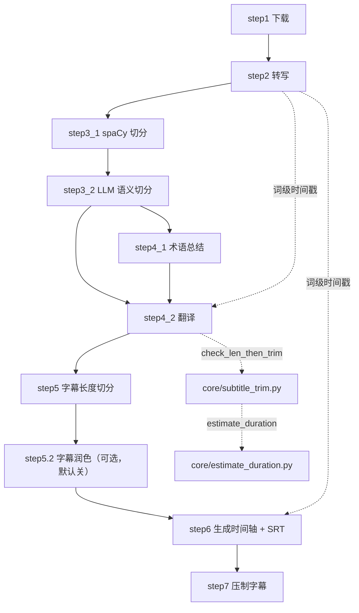

# 流水线总览（step1 ~ step7）

`core/` 下的文件名编号即**设计上的执行顺序**。本文是这张流程图的权威说明：每一步的入口函数、输入产物、输出产物、幂等条件、以及它在整个链路中的角色。

---

## 一、职责与边界

本文只做**索引与依赖关系**，每步的算法实现细节放在同目录下的专题文档里（见各行的「详细文档」列）。

---

## 二、阶段划分

流水线是**单阶段的字幕链路**（配音链路已在重构 Round 1 中删除）：

```
┌─────────────── 字幕流水线（st.py: text_processing_section）───────────────┐
│ step1 下载/上传 → step2 转写 → step3 切句 → step4 术语+翻译    │
│ → step5 字幕长度切分 → step5.2 字幕润色（可选，默认关）        │
│ → step6 时间轴对齐 + 生成 SRT → step7 压制字幕到视频           │
└────────────────────────────────────────────────────────────────────────────┘
 ↓ 产出 output/output_sub.mp4 与 output/log/subtitle_stage_done.txt（UI 以标记文件判断阶段完成）
```

---

## 三、总表（每步一行的速查）

| # | 模块 | 主入口函数 | 读 | 写 | 幂等跳过条件 | 详细文档 |
| --- | --- | --- | --- | --- | --- | --- |
| 1 | `core/step1_ytdlp.py` | `download_video_ytdlp` | 用户 URL / 上传文件 | `output/<title>.<ext>`、缩略图、`output/input_manifest.json` | 无（由 UI 判断是否已有素材） | [`01-下载与音频提取.md`](01-下载与音频提取.md) |
| 2 | `core/step2_whisperX.py` | `transcribe` | `find_media_file` 定位的源媒体（视频或音频） | `output/log/cleaned_chunks.xlsx`、`output/audio/*`、`.cache/asr/<key>/*.json` | `cleaned_chunks.xlsx` 存在；命中 `"complete"` 缓存条目时连抽音频与 Demucs 一起跳过 | [`02-语音识别ASR.md`](02-语音识别ASR.md) |
| 3.1 | `core/step3_1_spacy_split.py` | `split_by_spacy` | `cleaned_chunks.xlsx` | `output/log/sentence_splitbynlp.txt` | `sentence_splitbynlp.txt` 存在 | [`03-句子切分NLP.md`](03-句子切分NLP.md) |
| 3.2 | `core/step3_2_splitbymeaning.py` | `split_sentences_by_meaning` | `sentence_splitbynlp.txt` | `output/log/sentence_splitbymeaning.txt` | 无（`llm_sentence_split=false` 时直接复制 spaCy 结果，零 LLM 调用） | [`03-句子切分NLP.md`](03-句子切分NLP.md) |
| 4.1 | `core/step4_1_summarize.py` | `get_summary` | `sentence_splitbymeaning.txt`、`custom_terms.xlsx` | `output/log/terminology.json` | 无（仅 `transcription_only=false` 时执行） | [`04-术语总结与翻译.md`](04-术语总结与翻译.md) |
| 4.2 | `core/step4_2_translate_all.py` | `translate_all` | `sentence_splitbymeaning.txt`、`terminology.json`、`cleaned_chunks.xlsx` | `output/log/translation_results.xlsx` | `translation_results.xlsx` 存在 | [`04-术语总结与翻译.md`](04-术语总结与翻译.md) |
| 5 | `core/step5_splitforsub.py` | `split_for_sub_main` | `translation_results.xlsx` | `output/log/translation_results_for_subtitles.xlsx` | 无 | [`05-字幕切分与时间轴.md`](05-字幕切分与时间轴.md) |
| 5.2 | `core/step5_2_polish_subs.py` | `polish_subs_main` | `translation_results_for_subtitles.xlsx` | `output/log/translation_results_polished.xlsx` | **默认关**：`subtitle.polish_translation` 为假时只打印一行并返回（零 LLM 调用）；仅转录模式也跳过。开着时另有两个取舍开关 —— `subtitle.polish_thinking`（默认 `true`；关掉省 ≈91% token、覆盖率门槛自动收紧到 0.85）与 `subtitle.polish_long_lines_only`（默认 `false`；打开则只润色有分句的长行，其余行原样保留） | [`05-字幕切分与时间轴.md`](05-字幕切分与时间轴.md) |
| 6 | `core/step6_generate_final_timeline.py` | `align_timestamp_main` | `cleaned_chunks.xlsx`、`translation_results_for_subtitles.xlsx`（step5.2 打开且行数一致时改用 `translation_results_polished.xlsx`） | `output/{src,trans,src_trans,trans_src}.srt`、`output/cost.txt` | 无 | [`05-字幕切分与时间轴.md`](05-字幕切分与时间轴.md) |
| 7 | `core/step7_merge_sub_to_vid.py` | `merge_subtitles_to_video` | `find_media_file` 定位的源视频、`output/src.srt`、`output/trans.srt` | `output/output_sub.mp4`、`output/log/subtitle_stage_done.txt` | 无（UI 用 `subtitle_stage_done.txt` 判断阶段完成；输入为音频时只写标记、不压制） | [`06-字幕压制与成片.md`](06-字幕压制与成片.md) |

**被复用但不是独立步骤的模块**：

| 模块 | 主入口 | 被谁调用 | 作用 |
| --- | --- | --- | --- |
| `core/subtitle_trim.py` | `check_len_then_trim(text, duration)` | `step4_2`（`duration > min_trim_duration` 时） | 按朗读时长压缩译文，超时则调 LLM 精简 |
| `core/estimate_duration.py` | `init_estimator` / `estimate_duration` | `subtitle_trim` | 音节级朗读时长估算 |
| `core/translate_once.py` | `translate_lines(...)` | `step4_2` | 单块两阶段翻译（faithful → expressive） |

> 📌 原第 8.1~12 步（配音链路：TTS 任务表 → 参考音频 → 语音合成 → 整轨拼接 → 配音成片）已在重构 Round 1 中**整体删除**，
> 相关产物（`output/audio/tts_tasks.xlsx`、`output/audio/segs/`、`output/dub.mp3`、`output/output_dub.mp4` 等）不再生成。
> 变更明细见 [`../05-guides/04-已知问题与技术债.md`](../05-guides/04-已知问题与技术债.md)。

---

## 四、依赖矩阵（谁能重跑，谁依赖谁）



实线 = 强数据依赖（上游文件是下游输入）；虚线 = 弱依赖（只用到上游的某个函数或某份数据）。

### 跨步骤函数复用（改函数签名会牵连到别的步骤）

| 被复用函数 | 定义处 | 复用者 |
| --- | --- | --- |
| `align_timestamp` | `step6_generate_final_timeline.py` | `step4_2_translate_all.py`（产出 `translation_results.xlsx` 时就做一次对齐） |
| `check_len_then_trim` | `core/subtitle_trim.py` | `step4_2_translate_all.py`（原定义在 step8_1，配音删除后独立成模块） |
| `split_sentence` | `step3_2_splitbymeaning.py` | `step5_splitforsub.py`（每次固定切 2 份） |
| `get_audio_duration` | `all_whisper_methods/whisperX_utils.py` | `step2`（分段时长校验） |
| `check_gpu_available` | `step7_merge_sub_to_vid.py` | 仅本模块（判断是否用 `h264_nvenc`） |
| `demucs_main` | `all_whisper_methods/demucs_vl.py` | `step2`（`config.yaml: demucs` 为 true 时） |
| `find_media_file` | `step1_ytdlp.py` | `step2`、`step7`、`onekeycleanup`（优先读 `output/input_manifest.json`，无清单时先找视频再找音频） |
| `find_video_files` | `step1_ytdlp.py` | `step2`（火山分支取对象键前缀）、批处理 `video_processor`；是 `find_media_file` 的视频分支 |

---

## 五、扩展点（新增/删除/替换步骤）

1. **中间插入一步**：命名 `core/stepN_M_xxx.py`，读上游产物、写新产物，然后在 `st.py: build_task_steps`（`st.py`）里插入调用，并在 `st_components/imports_and_utils.py` 的 import 列表里加上模块。完整清单见 [`../05-guides/03-如何新增一个流水线步骤.md`](../05-guides/03-如何新增一个流水线步骤.md)。
2. **替换某一步**：例如把 `step2` 换成别的 ASR，只需保证它仍写出 `output/log/cleaned_chunks.xlsx`（列 `text`/`start`/`end`，`text` 带引号）；其余步骤无需改动。这就是"磁盘即契约"的好处。
3. **重新加回配音链路**：需要重建 `step8~step12` 与 TTS 适配层，并重新启用 `st.py` 的配音区块、`sidebar_setting.py` 的 Dubbing Settings、`config.yaml` 的对应段。git 历史中重写前的 devdocs 保留了完整链路说明与踩坑记录，是本项工作的最佳起点。
4. **调整人工确认点**：`config.yaml: pause_before_translate`。当前实现是 UI 两段式（术语提取后显示「继续翻译」按钮），已不再是 `input` 阻塞。


---

## 六、验证方式（逐步冒烟测试）

> 必须用项目实际环境（conda `videolingo`）。系统 PATH 上的 `python` 没装 pandas。
> `core/step*.py` 的 `__main__` 入口现在都会先调 `easy_util.ensure_utf8_console`，GBK 控制台不再因 emoji 崩溃；
> 自己写脚本调用这些模块时仍建议先设 `$env:PYTHONIOENCODING='utf-8'`。

```powershell
cd E:\VideoLingo\VideoLingoMove
$py = "$env:USERPROFILE\anaconda3\envs\videolingo\python.exe"
$env:PYTHONIOENCODING='utf-8'

# 逐级验证（每步产物见第三节总表）
# 想真正重跑 step2：先删产物，并清掉转录缓存（否则直接复用 .cache/asr 里的结果）
Remove-Item output\log\cleaned_chunks.xlsx -ErrorAction SilentlyContinue
Remove-Item -Recurse -Force .cache\asr -ErrorAction SilentlyContinue
& $py -m core.step2_whisperX
& $py -c "import pandas as pd; d=pd.read_excel('output/log/cleaned_chunks.xlsx'); print(len(d), d.head)"

& $py -m core.step3_1_spacy_split
& $py -m core.step3_2_splitbymeaning
& $py -c "print(sum(1 for _ in open('output/log/sentence_splitbymeaning.txt', encoding='utf-8')))"

& $py -m core.step4_1_summarize
& $py -m core.step4_2_translate_all
& $py -m core.step5_splitforsub
# step5.2 润色是可选步（默认关，开关见 config.yaml: subtitle.polish_translation；
# 成本/范围另由 subtitle.polish_thinking / subtitle.polish_long_lines_only 决定）
& $py -m core.step5_2_polish_subs
& $py -m core.step6_generate_final_timeline
& $py -c "print(open('output/trans.srt', encoding='utf-8').read[:400])"

# 最终压制（需要 output/src.srt 与 output/trans.srt 已存在）
& $py -m core.step7_merge_sub_to_vid
```

### 校验 SRT 结构是否正确

```powershell
& $py -c @"
raw = open('output/trans.srt', encoding='utf-8').read
blocks = [b for b in raw.strip.split('\n\n') if b.strip]
nums = [int(b.split('\n')[0]) for b in blocks]
print('条数=', len(blocks), '序号连续=', nums == list(range(1, len(blocks)+1)))
"@
```

> 若条数与预期不符，或首行为空，说明 SRT 分隔符又变成了 `\n\n\n`（历史缺陷 P3-9，已修）。

---

## 十、相关文档

- [`../00-overview/02-数据流与中间产物.md`](../00-overview/02-数据流与中间产物.md) — 产物字段的权威定义
- [`../00-overview/04-术语与概念表.md`](../00-overview/04-术语与概念表.md) — segment / chunk / sentence 的粒度口径
- [`../03-subsystems/01-LLM调用与提示词.md`](../03-subsystems/01-LLM调用与提示词.md)
- [`../05-guides/03-如何新增一个流水线步骤.md`](../05-guides/03-如何新增一个流水线步骤.md)
