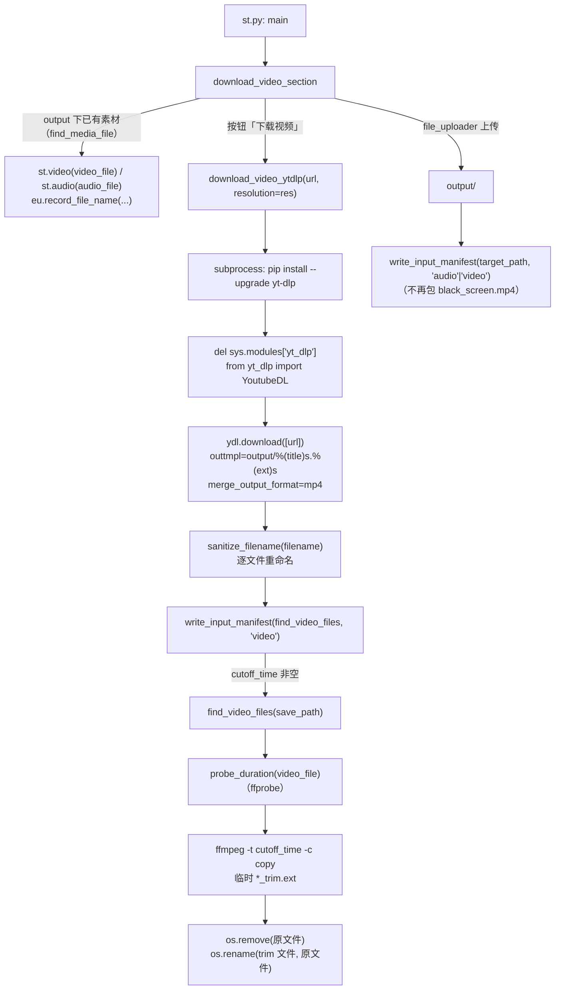
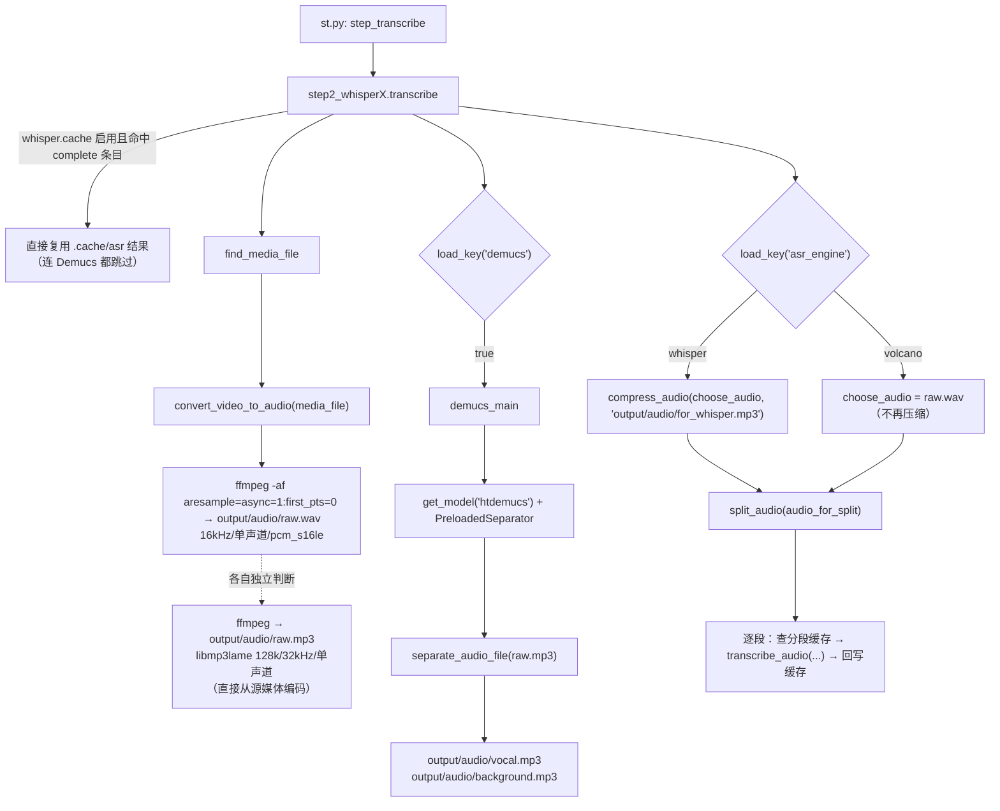

# 下载与音频提取（step1）

这一层把「一个 URL 或一个本地文件」变成 `output/` 下**唯一一个源媒体文件**（视频或音频，并写进 `input_manifest.json`），再把源媒体抽成 `raw.wav`（火山引擎规格）与 `raw.mp3`（Whisper 兼容），可选地用 Demucs 分离人声，最后把送进 ASR 的音频压成低码率单声道文件。

---

## 一、职责与边界

**负责**：下载/接收视频**或音频** → 文件名清洗 → 写输入清单 `output/input_manifest.json` → （可选）按 `cutoff_time` 截断 → 抽音频（WAV/MP3 双轨，都直接从源媒体编码）→ （可选）Demucs 人声分离 → 压缩出 ASR 用音频。

**不负责**：不决定用哪个 ASR 引擎、不做音频分段（`split_audio` 虽定义在同目录 `whisperX_utils.py`，但由 step2 调用）、不写 `config.yaml`（本层只 `load_key` 读配置，唯一写配置的是 step2 的 `save_language`）。

**隐含契约**：源媒体由 `find_media_file`（`core/step1_ytdlp.py`）定位——优先读输入清单，没有清单时按扩展名回退（先找视频、再找音频）；`find_video_files`（`core/step1_ytdlp.py`）仍是"视频文件"这条契约的执行者，但**多个视频时不再抛错**，而是告警并取修改时间最新的一个。被 step2（火山对象键前缀）/step7/`onekeycleanup` 共同依赖。

---

## 二、文件清单

| 文件 | 规模 | 主要职责 |
| --- | --- | --- |
| `core/step1_ytdlp.py` | ~11K | yt-dlp 下载、文件名清洗、`cutoff_time` 截断、输入清单（`write_input_manifest` / `read_input_manifest`）、定位源媒体（`find_media_file` / `find_video_files` / `find_audio_files`） |
| `core/all_whisper_methods/whisperX_utils.py` | ~15K | 抽音频（`convert_video_to_audio`）、压缩（`compress_audio`）、编码器探测（`_ffmpeg_has_encoder`）、人声电平归一化增益（`compute_normalization_gain`）、静音切分（`split_audio`） |
| `core/all_whisper_methods/demucs_vl.py` | ~3K | Demucs `htdemucs` 人声/伴奏分离 |
| `st_components/download_video_section.py` | ~4K | Streamlit 下载/上传区块；上传音频按音频处理并写输入清单 |
| `core/step2_whisperX.py` | ~22K | **调用方**：`transcribe` 里编排抽音频 → Demucs → 压缩 → 分段转写 |

---

## 三、调用链与数据流

### 3.1 下载阶段（UI 触发）



要点：UI 的 `res` 来自 `download_video_section.py` 的三选一（`360p→'360'`、`1080p→'1080'`、`最佳→'best'`），默认项由 `config.yaml: ytb_resolution` 决定；`download_video_section.py` 调用时**没有传 `cutoff_time`**，所以 GUI 路径永远不截断视频（只有批处理/手工调用才会传）。

### 3.2 抽音频阶段（step2 触发）



注意 `raw.mp3` 现在是**直接从源媒体编码**的（`whisperX_utils.py`），不再以 `raw.wav` 为输入：修复前它由 16 kHz 的 `raw.wav` 转码而来，虽然写着 `-ar 32000`，实际带宽被卡在 8 kHz 以内。两个产物**各自独立判断幂等**，删掉其中一个只会重建它自己；因此"删掉 `raw.wav` 保留 `raw.mp3`"不再影响 MP3，反之亦然。`raw.wav` 的 16 kHz/单声道/16-bit 是火山 ASR 用 ffprobe 校验的硬契约，不可改。

---

## 四、关键数据结构

### 4.1 函数间传递的数据

| 名称 | 类型 | 含义 | 产生位置 |
| --- | --- | --- | --- |
| `video_files` | `List[str]` | `output/` 下匹配 `allowed_video_formats`、且不属于 `GENERATED_VIDEO_NAMES` 的文件列表；0 个抛 `FileNotFoundError`，多个则排序取最新 | `core/step1_ytdlp.py` |
| `media_file` / `media_type` | `str` / `'video'\|'audio'` | 源媒体路径与类型；来自 `input_manifest.json`，无清单时按扩展名推断 | `core/step1_ytdlp.py` |
| `manifest` | `{"path": str, "type": str}` | 输入清单内容；`type` 只能是 `video`/`audio`，路径失效或类型非法时整条记录作废 | `core/step1_ytdlp.py` |
| `segments` | `List[Tuple[float, float]]` | 音频分段的时间区间 `(start, end)`，单位**秒**（浮点） | `core/all_whisper_methods/whisperX_utils.py` |
| `resolution` | `str` | 取值只能是 `'360'`、`'1080'`、`'best'` 三者之一，其他值静默退化为 `'360'` | `core/step1_ytdlp.py` |
| `gain` | `float` | 人声归一化增益（dB），由 `compute_normalization_gain` 按实测 dBFS 算出、峰值受限 | `core/all_whisper_methods/whisperX_utils.py` |

### 4.2 落盘产物清单（本层）

| 路径 | 生成者 | 用途 | 格式规格 |
| --- | --- | --- | --- |
| `output/<title>.<ext>` | `download_video_ytdlp` `core/step1_ytdlp.py` | 源视频，全流程输入 | yt-dlp 合并产物（`bestvideo+bestaudio`）；已设 `merge_output_format: 'mp4'`，需要合并音视频轨时固定输出 `mp4`（命中 `best` 单文件直下时仍是源的容器） |
| `output/<title>.jpg` | yt-dlp `FFmpegThumbnailsConvertor` `core/step1_ytdlp.py` | 封面残留（**不被下游消费**） | JPEG |
| `output/<title>_trim.<ext>` | `download_video_ytdlp` `core/step1_ytdlp.py` | 临时截断文件，成功后立刻改名回原名 | 与源同容器（`-c copy` 不重编码） |
| `output/input_manifest.json` | `write_input_manifest` `core/step1_ytdlp.py` | **输入清单**：记录哪个文件是本次输入、它是 `video` 还是 `audio`；下载完成与上传（`st_components/download_video_section.py`）各写一次 | JSON `{"path": "output/xxx", "type": "video"\|"audio"}`，UTF-8、`indent=2`；Windows 下 `path` 用正斜杠 |
| `output/audio/raw.wav` | `convert_video_to_audio` `core/all_whisper_methods/whisperX_utils.py` | 火山引擎 ASR 的输入 | 16 kHz / 单声道 / `pcm_s16le` / WAV / `-af aresample=async=1:first_pts=0` / `-metadata encoding=UTF-8` |
| `output/audio/raw.mp3` | `convert_video_to_audio` `core/all_whisper_methods/whisperX_utils.py` | Whisper 引擎的原始音频；Demucs 的输入 | `libmp3lame` 128 kbps / 32 kHz / 单声道；**直接从源媒体编码**（缺 `libmp3lame` 时回退 32 kHz WAV） |
| `output/audio/vocal.mp3` | `demucs_main` `core/all_whisper_methods/demucs_vl.py` | 人声轨 | MP3 128 kbps / 44.1 kHz / **立体声**（`htdemucs` 签名的 `samplerate=44100`、`audio_channels=2`） |
| `output/audio/background.mp3` | `demucs_main` `core/all_whisper_methods/demucs_vl.py` | 伴奏轨（配音链路已删除，当前无消费者） | 同上 |
| `output/audio/for_whisper.mp3` | `compress_audio` `core/all_whisper_methods/whisperX_utils.py` | Whisper 引擎实际送进 ASR 的文件 | MP3 96 kbps / 16 kHz / 单声道（缺 `libmp3lame` 时回退 16 kHz WAV） |

> ⚠️ `output/black_screen.mp4` **不再由本项目生成**：上传音频的包装函数 `convert_audio_to_video` 已被删除，改为写输入清单。`core/step1_ytdlp.py` 的 `is_audio_placeholder` 与 `core/step7_merge_sub_to_vid.py` 的兼容分支只为识别**旧版本留下的**占位视频而保留。

> ⚠️ `output/audio/for_volcano.wav` 与其转换函数 `convert_to_volcano_wav`、常量 `VOLCANO_FILE` **都已不在代码中**（火山分支直接复用 `raw.wav` / `enhanced_vocals.wav`）。详见 [`02-语音识别ASR.md`](02-语音识别ASR.md)。

---

## 五、逐函数实现说明

### 5.1 `sanitize_filename(filename)` — `core/step1_ytdlp.py`

| 步骤 | 代码 | 说明 |
| --- | --- | --- |
| 去非法字符 | `re.sub(r'[<>:"/\\\|?*]', '', filename)` | 直接**删除**而非替换；正则会命中 Windows 非法字符集 `<>:"/\|?*` |
| 去首尾点与空格 | `filename.strip('. ')` | Windows 不允许文件名以 `.`/空格结尾 |
| 空值兜底 | `return filename if filename else 'video'` | 清空后回退为 `video` |

副作用：**重命名磁盘文件**（在 `download_video_ytdlp` 的循环里执行），不写 config。

### 5.2 `download_video_ytdlp(url, save_path='output', resolution='1080', cutoff_time=None)` — `core/step1_ytdlp.py`

| 阶段 | 行号 | 实现 |
| --- | --- | --- |
| 分辨率白名单 | | `allowed_resolutions = ['360', '1080', 'best']`；**不在白名单则强制 `'360'`**（不是用默认参数 `'1080'`） |
| 建目录 | | `os.makedirs(save_path, exist_ok=True)` |
| format 选择 | | `best` → `'bestvideo+bestaudio/best'`；否则 `f'bestvideo[height<={resolution}]+bestaudio/best[height<={resolution}]'` |
| 输出模板 | | `f'{save_path}/%(title)s.%(ext)s'` → 落到 `output/<原始标题>.<ext>` |
| 单视频约束 | | `'noplaylist': True`（播放列表 URL 只取首个视频） |
| 缩略图 | | `'writethumbnail': True` + postprocessor `FFmpegThumbnailsConvertor` + `format: 'jpg'` |
| 合并容器 | | `'merge_output_format': 'mp4'`——否则 `bestvideo+bestaudio` 可能被合并成 mkv/webm，而下游 `-c copy` 截断与字幕烧录都按 mp4 假设 |
| cookies | | `load_key_or("youtube")`；`youtube.cookies_path` 非空且文件存在 → `ydl_opts["cookiefile"]`，文件不存在只打印警告 |
| 代理 | | `youtube.proxy`：缺省/`None` 不设键（交给 yt-dlp 自动发现）；空串 = 显式禁用；URL = 强制；非字符串抛 `ValueError` |
| 自升级 yt-dlp | | `subprocess.check_call([sys.executable, "-m", "pip", "install", "--upgrade", "yt-dlp"])`，失败只 `print` 警告 |
| 热重载 yt-dlp | | `del sys.modules['yt_dlp']` 后 `from yt_dlp import YoutubeDL`，保证本次下载用刚装上的版本 |
| 下载 | | `with YoutubeDL(ydl_opts) as ydl: ydl.download([url])` |
| 重命名循环 | | 遍历 `os.listdir(save_path)`，对**每个普通文件**用 `sanitize_filename` 计算新名，不同则 `os.rename`（视频与缩略图同名不同扩展名，会被一致地改名） |
| 写输入清单 | | `write_input_manifest(find_video_files(save_path), "video", save_path)`——下载产物一律登记为视频 |
| 截断 | | 见下 |

**`cutoff_time` 截断逻辑**

1. `find_video_files(save_path)` 找到源视频；
2. `probe_duration(video_file)` 用 **ffprobe** 取时长（秒，）——取代已不可用的 `librosa.get_duration(filename=...)`；
3. 仅当 `duration > cutoff_time` 才截断；
4. 目标名 `f"{file_name}_trim{file_extension}"`，命令 `ffmpeg -i <video> -t <cutoff_time> -c copy <trim 文件>`；
5. 用 `subprocess.Popen` 把 ffmpeg 输出实时 print 出来；
6. `os.remove(video_file)` 删原文件，`os.rename(trimmed_file, video_file)`——**最终路径不变**，下游无感；
7. `duration <= cutoff_time` 时只打印一行，不产生新文件。

副作用：网络下载、`pip` 安装、磁盘改名/删文件、启动 ffmpeg 子进程。

### 5.3 `probe_duration(media_file)` — `core/step1_ytdlp.py`

`ffprobe -v error -show_entries format=duration -of default=nw=1:nk=1 <file>`，用 `float(stdout.strip)` 还原秒数；解析失败抛 `RuntimeError`（含 stderr 前 200 字符，）。不依赖 librosa：`librosa.get_duration(filename=...)` 在 librosa 1.x 已被移除，而 ffmpeg/ffprobe 本来就是本项目的硬依赖。注意它依赖**系统 PATH 上的 `ffprobe`**，仓库根目录只自带 `ffmpeg.exe`。

### 5.4 `find_video_files(save_path='output')` — `core/step1_ytdlp.py`

| 约束 | 行号 | 细节 |
| --- | --- | --- |
| 扩展名过滤 | | `glob.glob(save_path + "/*")`，用 `os.path.splitext(file)[1][1:].lower` 与 `load_key("allowed_video_formats")` 比对（config 里是**不带点、小写**的扩展名），并新增 `os.path.isfile` 判断 |
| Windows 反斜杠 | | `sys.platform.startswith('win')` 时把所有 `\` 换成 `/`（注释原文：`# change \\ to /, this happen on windows`） |
| 排除自家产物 | | 丢弃 basename 小写后命中 `GENERATED_VIDEO_NAMES = {"output_sub.mp4", "output_dub.mp4"}`的文件。旧实现用 `not file.startswith("output/output")`，两个方向都错：误排 `output tutorial.mp4`、误收 `OUTPUT_SUB.MP4`。注意 `black_screen.mp4`（旧版上传音频的占位视频）**是合法源**，不在排除名单里 |
| 0 个 | | `raise FileNotFoundError`（提示先用页面下载/上传） |
| 多个 | | 按 `os.path.getmtime` 倒序排序，打印告警后返回**最新**的一个（旧行为是直接抛错） |
| 返回 | | `video_files[0]` |

### 5.5 输入清单与源媒体定位 — `core/step1_ytdlp.py`

| 成员 | 行号 | 作用 |
| --- | --- | --- |
| `INPUT_MANIFEST` / `GENERATED_AUDIO_NAMES` | / | 清单文件名 `input_manifest.json`；音频侧要排除的自家产物 `{"dub.mp3", "normalized_dub.wav"}`（配音链路遗留，当前不生成） |
| `write_input_manifest(media_file, media_type, save_path='output')` | | 写 `{"path": ..., "type": ...}`；Windows 下路径转正斜杠 |
| `read_input_manifest(save_path='output')` | | 返回 `(路径, 类型)`；文件缺失/JSON 坏/`type` 不是 `video`\|`audio`/**路径已不存在**时返回 `None`（清单失效自愈） |
| `find_audio_files(save_path='output')` | | 与 `find_video_files` 同规则，但用 `allowed_audio_formats` 并排除 `GENERATED_AUDIO_NAMES`；多个同样取最新 |
| `find_media_file(save_path='output')` | | **推荐入口**：清单优先 → 否则 `find_video_files` → 再否则 `find_audio_files`；返回 `(路径, 'video'\|'audio')` |
| `is_audio_only_input(save_path='output')` | | `find_media_file` 的类型是否为 `audio`；任何异常一律返回 `False` |

订阅者：`core/step2_whisperX.py`、`core/step7_merge_sub_to_vid.py`、`core/onekeycleanup.py`、`st_components/download_video_section.py`。

### 5.6 上传音频不再包装成视频 — `st_components/download_video_section.py`

上传分支把文件写到 `output/<clean_name>`后，按扩展名判定 `media_type`（，命中 `allowed_audio_formats` 即 `audio`）并 `write_input_manifest(target_path, media_type)`。旧的 `convert_audio_to_video`（ffmpeg 造 `black_screen.mp4`）已删除。展示侧按类型分流：`video` → `st.video`，`audio` → `st.audio` + 一行说明。上传还会先 `shutil.rmtree("output")` 清空工作目录，并用 `_processed_upload_id` 做幂等。

### 5.7 `convert_video_to_audio(video_file)` — `core/all_whisper_methods/whisperX_utils.py`

| 产物 | 行号 | 命令要点 | 幂等条件 |
| --- | --- | --- | --- |
| `output/audio/raw.wav` | | `ffmpeg -y -i <media> -vn -af aresample=async=1:first_pts=0 -ar 16000 -ac 1 -acodec pcm_s16le -metadata encoding=UTF-8 -f wav` | `not os.path.exists(RAW_AUDIO_WAV_FILE)` |
| `output/audio/raw.mp3` | | `ffmpeg -y -i <media> -vn -af aresample=async=1:first_pts=0 -c:a libmp3lame -b:a 128k -ar 32000 -ac 1 -metadata encoding=UTF-8`（源是**源媒体本身**） | `not os.path.exists(RAW_AUDIO_FILE)` |

先 `os.makedirs(AUDIO_DIR, exist_ok=True)`。两个产物**各自独立判断**，可以只有其中一个存在。

两条命令都带 `-af aresample=async=1:first_pts=0`：压缩帧可能解码出比容器时长更多的采样点，逐点拼接会把识别时钟越推越后，导致**字幕整体逐渐偏移**，且下游无法补救（成片用的是同一条时钟）。缺 `libmp3lame` 时 `raw.mp3` 那条命令回退为 32 kHz WAV(PCM)。

### 5.8 `_ffmpeg_has_encoder(encoder_name)` — `core/all_whisper_methods/whisperX_utils.py`

`ffmpeg -hide_banner -encoders` 后做子串匹配；`OSError` 返回 `False`。conda-forge / 精简构建的 ffmpeg 常常没有 `libmp3lame`，此前会直接抛 `CalledProcessError` 让整条流程失败；现在 `compress_audio`与 `convert_video_to_audio`都先探测，缺失时回退 PCM/WAV 并打印黄字警告。

### 5.9 `compress_audio(input_file, output_file)` — `core/all_whisper_methods/whisperX_utils.py`

有 `libmp3lame` 时 `ffmpeg -y -i <input> -vn -b:a 96k -ar 16000 -ac 1 -metadata encoding=UTF-8 -f mp3 <output>`；否则输出 16 kHz 单声道 `pcm_s16le` WAV。幂等条件是 `not os.path.exists(output_file)`，返回 `output_file` 字符串。注释说明取舍：16000 Hz、单声道（Whisper 默认）、96 kbps「keep more details as well as smaller file size」。实际调用点为 `core/step2_whisperX.py`，输出 `output/audio/for_whisper.mp3`。

### 5.10 `save_language(language)` — `core/all_whisper_methods/whisperX_utils.py`

`update_key("whisper.detected_language", language)`；但入口先过滤 `None`/非字符串/空串/`'auto'`——伪造一个语言比不写更糟，`core.config_utils.get_source_language` 会把它当成真实源语言。这是本层唯一会改动 `config.yaml` 的函数。

### 5.11 `demucs_main` 与 `PreloadedSeparator` — `core/all_whisper_methods/demucs_vl.py`

| 项 | 值 / 行号 |
| --- | --- |
| 幂等 | `vocal.mp3` **和** `background.mp3` 同时存在才跳过 |
| 模型 | `get_model('htdemucs')`，`BagOfModels`；本机实际加载的是签名 `955717e8`：`samplerate=44100`、`segment=39/5`（= 7.8 s）、`sources=[drums, bass, other, vocals]`、`audio_channels=2`、约 42.0M 参数 |
| 分离器 | `PreloadedSeparator(model=model, shifts=1, overlap=0.25)`：`shifts=1` 不做 shift 增强、`overlap=0.25` 段间重叠 25%，`split=True`、`progress=True`、`segment=None`（用模型自带的 7.8 s） |
| 设备优先级 | `cuda` → `mps`（仅 Apple）→ `cpu`，**没有显存预算/降级逻辑** |
| 输入 | `separator.separate_audio_file(RAW_AUDIO_FILE)`，即 `output/audio/raw.mp3`；文件不存在会直接抛错。demucs 内部用 `AudioFile.read(streams=0, samplerate=44100, channels=2)` 读取（回退 torchaudio），因此 32 kHz 单声道的 `raw.mp3` 会在读入时被重采样成 **44.1 kHz 立体声** |
| 写盘参数 | `samplerate=model.samplerate, bitrate=128, preset=2, clip="rescale", as_float=False, bits_per_sample=16`；`.mp3` 走 demucs 的 lameenc 编码器（`set_bit_rate(128)`、`set_channels(2)`、quality=2），编码前先按 `rescale` 策略防削波。**bitrate 由 64 提到 128**：`vocal.mp3` 既是强制对齐的参考，在 `demucs=true` 时还是识别输入，64 kbps 会抹掉对齐依赖的瞬态细节 |
| 产物 | `outputs['vocals']` → `vocal.mp3`；其余所有源相加 → `background.mp3` |
| 释放 | `del outputs, background, model, separator` + `gc.collect` |

**耗时与显存**：本项目代码里**没有任何**时间/显存预算控制，能确证的只有「设备选择」与「分离参数」。把已实测与估计分开列：

| 项 | 数值 | 依据 |
| --- | --- | --- |
| 权重规模 | 约 42.0M 参数；checkpoint `955717e8-8726e21a.th` 84.1 MB；按 fp32 载入约 160 MB | 已实测（读取本机 torch hub 缓存里的 checkpoint 元数据） |
| 单次推理分段 | 7.8 s / 段，段间 `overlap=0.25`，`shifts=1` | 签名 + `core/all_whisper_methods/demucs_vl.py` |
| GPU 显存（估计） | 2 GB 量级（权重 160 MB + 7.8 s × 44.1 kHz 立体声的激活值） | **估计值，未实测** |
| 耗时（估计） | GPU 上通常快于实时（`shifts=1` 是最省的一档）；CPU/MPS 上可能慢于实时 | **估计值，未实测** |
| 本层额外开销 | 多一次 44.1 kHz 立体声解码 + 两次 MP3 编码（`vocal.mp3` / `background.mp3`） | 代码事实 |

调用方：`core/step2_whisperX.py`（受 `load_key("demucs")` 控制）。原配音链路的 `core/step9_extract_refer_audio.py` 已随重构删除，此处不再有第二个调用方。

---

## 六、关键参数与配置

| config 键 | 读取位置 | 影响 |
| --- | --- | --- |
| `allowed_video_formats` | `core/step1_ytdlp.py`、`st_components/download_video_section.py` | 决定哪些文件算「视频」；当前值 `mp4/mov/avi/mkv/flv/wmv/webm`（`config.yaml`） |
| `allowed_audio_formats` | `core/step1_ytdlp.py`、`st_components/download_video_section.py` | 决定哪些文件算「音频」：上传白名单 + `find_audio_files` 的过滤条件 |
| `ytb_resolution` | `st_components/download_video_section.py` | 下载框默认分辨率，必须是 `'360'/'1080'/'best'` 之一（`config.yaml`） |
| `youtube.cookies_path` | `core/step1_ytdlp.py` | 需要登录/年龄限制/会员视频时填 Netscape 格式 `cookies.txt` 路径；路径不存在只警告 |
| `youtube.proxy` | `core/step1_ytdlp.py` | `null`/缺省=交给 yt-dlp 自动发现；空串=显式禁用；URL=强制 |
| `demucs` | `core/step2_whisperX.py` | 是否做人声分离；同时决定 ASR 输入是 `vocal.mp3` 系还是 `raw.mp3` 系 |
| `model_dir` | `core/step2_whisperX.py` | Whisper 模型目录（`./_model_cache`），本层不直接用，但 `demucs` 与它无关、不要混淆 |
| `resolution` | 与 step7 相关（`config.yaml`） | 成片分辨率，**不是**下载分辨率 |

硬编码（无 config 键）：`save_path='output'`、`resolution='1080'`、`cutoff_time=None`、缩略图转 `jpg`、`merge_output_format='mp4'`、`raw.wav` = 16 kHz/单声道/`pcm_s16le`、`raw.mp3` = 128 kbps/32 kHz/单声道、`for_whisper.mp3` = 96 kbps/16 kHz/单声道、Demucs = `htdemucs`/`shifts=1`/`overlap=0.25`/`bitrate=128`、归一化目标 `target_db=-20.0` 与峰值上限 `peak_ceiling_db=-1.0`（`whisperX_utils.py`）。

---

## 七、技术要点与坑

1. **`python -m core.step1_ytdlp` 的默认分辨率会掉到 360p。** 把输入转成 `int`（`1080`），而 的白名单是字符串 `['360', '1080', 'best']`，`1080 not in [...]` 成立 → 静默改成 `'360'`。UI 路径传字符串，不受影响。
2. **每次下载都会尝试 `pip install --upgrade yt-dlp`**。网络慢/离线环境会明显卡顿；失败只警告不中断。升级后靠 `del sys.modules['yt_dlp']`热重载。
3. **重命名循环作用于目录内所有普通文件**，包括缩略图与用户手动放进 `output/` 的其他文件；如果两个不同原名的文件清洗后同名，后一个 `os.rename` 会覆盖前一个。
4. **`find_video_files` 现在是宽容的**：0 个视频抛 `FileNotFoundError`，多个则告警并取最新；真正需要"唯一视频"的只有那些直接调它的地方（批处理、火山对象键前缀）。GUI 的「删除并重新选择」按钮会 `shutil.rmtree("output")`（`st_components/download_video_section.py`）。
5. **纯音频 URL 不再需要人工包一层视频**：下载后由 `write_input_manifest(..., "video")` 登记，若 yt-dlp 只拿到音频（`m4a`/`mp3`），`find_video_files` 会抛 `FileNotFoundError`；此时把该文件放进 `output/` 并用 `write_input_manifest(path, 'audio')` 登记即可走音频路径。
6. **`-c copy` 截断不重编码**：速度快、无损，但切点受关键帧限制；且截断是「从 0 秒切到 `cutoff_time` 秒」，不是按区间截取。
7. **`raw.wav` 与 `raw.mp3` 现在是两条独立支路**：都从源媒体编码，各自判断幂等。改其中一条不会影响另一条；`raw.mp3` 不再受 16 kHz 的 `raw.wav` 限制带宽。
8. **`demucs_main` 依赖 `raw.mp3`**（`demucs_vl.py`）：单独跑 `python -m core.all_whisper_methods.demucs_vl` 前必须先有 `output/audio/raw.mp3`，否则 `separate_audio_file` 报文件不存在。
9. **同一文件有两种路径写法**：`whisperX_utils.py` 用字面量 `"output/audio/raw.mp3"`，`demucs_vl.py` 用 `os.path.join` → Windows 上是 `output\audio\raw.mp3`。两者指向同一文件，**不要在代码里做字符串相等比较**。
10. **Demucs 的幂等只认两个文件同时存在**：只有 `vocal.mp3`（比如跑挂了）时会重跑整个分离。
11. **缩略图会一直留在 `output/`**（只下载不删除），不影响 `find_video_files`（扩展名不在白名单），但会进入「删除并重新选择」的清空范围，也可能被误当成成片素材。
12. **批量模式把 `raw.mp3` / `for_whisper.mp3` 当接口**：`batch/utils/batch_processor.py` 与、`batch/utils/video_processor.py-280` 都以这两个文件名搬运预处理产物——**改文件名或改码率规格等于破坏批量模式与缓存复用**。
13. **改 `demucs` 开关会影响 ASR 输入链**：`demucs=true` 时 Whisper 分支的输入是 `enhanced_vocals.mp3`（按实测电平归一到 -20 dBFS 后压缩 96 kbps/16 kHz），火山分支是 `enhanced_vocals.wav`；此时 `output/audio/` 会多出 `vocal.mp3`/`background.mp3`。
14. **`cutoff_time` 只在代码层存在**：`config.yaml` 没有对应键，GUI 也不传，只有批处理显式传 `cutoff_time=None`（`batch/utils/video_processor.py`）。
15. **转录缓存会让"改了音频却不重新识别"**：`core/step2_whisperX.py` 起的内容寻址缓存以**源媒体内容**为身份之一（`core/all_whisper_methods/transcription_cache.py`），换文件名/换密钥不失效，换模型/换引擎/改语言/换源文件内容才失效。想强制重跑要清 `.cache/asr/` 或设 `whisper.cache: false`。
16. **两条 ffmpeg 抽取命令的 `-af aresample=async=1:first_pts=0` 不要删**：它是字幕时间轴不随时间漂移的前提（缺失时下游无法补救），`tests/test_audio_extraction.py` 有对应回归断言。
17. **火山对 `raw.wav` 有 ffprobe 硬校验**：16 kHz / 单声道 / 16 bit，改动 `convert_video_to_audio` 里那三个参数会让火山分支直接失败（`volcano_asr._convert_audio_for_volcano`）。

---

## 八、扩展点

### 8.1 支持新的下载源（如 Bilibili、本地目录、S3）

- 落点一：在 `st_components/download_video_section.py` 的下载按钮旁加分源选择，把 URL 交给新函数；
- 落点二：新函数必须满足两条契约——**产物只落到 `save_path`（默认 `output/`）**、**调用 `write_input_manifest` 登记类型**（否则下游只能按扩展名猜，视频/音频判定会不可靠）；
- 语言/剧集类 URL 记得保持 `noplaylist` 语义（`core/step1_ytdlp.py`），避免一次下载多集；
- 若下载器自带文件名清洗，仍建议过一遍 `sanitize_filename`（`core/step1_ytdlp.py`），保证 Windows 可写。

> 💡 建议：把「下载源」抽象成一个返回 (media_path, media_type) 的适配函数，并在 `download_video_section.py` 里统一调用；这样输入清单只需在一处写。

### 8.2 改分辨率策略

三处必须同步，否则 UI 与代码不一致：

| 位置 | 内容 |
| --- | --- |
| `core/step1_ytdlp.py` | `allowed_resolutions` 白名单（字符串） |
| `core/step1_ytdlp.py` | `format` 表达式（当前用 `height<=` 上限约束） |
| `st_components/download_video_section.py` | UI 的 `res_dict` 显示名 → 值 |
| `config.yaml` | `ytb_resolution` 默认值 |

> 💡 建议：把白名单改成从 config（如 `ytb_resolution_options`）读取，避免「加了 720p 但白名单没加 → 静默变 360p」。

### 8.3 去掉 yt-dlp 自动升级

删掉 `core/step1_ytdlp.py` 的 `subprocess.check_call(...)` 即可； 的重载逻辑可保留（无害），也可以一并删除后把 `from yt_dlp import YoutubeDL` 提到模块顶层。

> 💡 建议：改为「只在下载抛 `DownloadError` 时再尝试升级一次」，兼顾离线可用与「API 变了自动修」的初衷。

### 8.4 新增/调整音频产物

| 想做的事 | 动哪里 | 注意 |
| --- | --- | --- |
| 改 `raw.wav` 规格 | `core/all_whisper_methods/whisperX_utils.py` | 火山引擎要求 16 kHz/单声道/16-bit PCM，改错会触发 `VolcanoASR._convert_audio_for_volcano` 的 ffprobe 检查并打印「不符合要求」 |
| 改 `raw.mp3` 规格 | `core/all_whisper_methods/whisperX_utils.py` | Demucs 读它；改采样率/码率会同时影响人声分离质量与转录缓存身份（身份里只有源媒体 md5，不含抽取参数——改抽取参数请同步递增 `transcription_cache.SCHEMA`） |
| 改 `for_whisper.mp3` 规格 | `core/all_whisper_methods/whisperX_utils.py` | 96k 是为了「30 分钟 < 25 MB」的分段前提，见 [`02-语音识别ASR.md`](02-语音识别ASR.md) 第七节 |
| 换人声分离模型 | `core/all_whisper_methods/demucs_vl.py` | 改 `htdemucs` 会连带改变 `vocal.mp3` 的采样率与写盘参数 |
| 想让 Demucs 结果可复用/可清理 | `core/all_whisper_methods/demucs_vl.py` | 幂等条件写死两个文件，若只想复用 `vocal.mp3` 需要改判断 |

> 💡 建议：所有 ffmpeg 调用都应统一加 `-nostdin`（当前 `convert_video_to_audio`/`compress_audio` 都没有），避免在批量循环里 ffmpeg 抢占 stdin 造成卡死。

---

## 九、验证方式

**环境准备**（与 [`02-语音识别ASR.md`](02-语音识别ASR.md) 第九节一致）：必须用 conda 环境 `videolingo` 的 python（系统默认 `python` 连 `pandas` 都没有）。本层的 `__main__` 入口已调用 `easy_util.ensure_utf8_console`，用 `-c` 自己拼脚本时仍建议先设 `$env:PYTHONIOENCODING='utf-8'`，避免 rich 的 emoji 在 GBK 控制台抛 `UnicodeEncodeError`。

```powershell
cd E:\VideoLingo\VideoLingoMove
$env:PYTHONIOENCODING='utf-8'
$py = "$env:USERPROFILE\anaconda3\envs\videolingo\python.exe"
```

**1）只验证下载 + 定位（不要用 `__main__` 的交互式分辨率输入，会掉到 360p）**

```powershell
& $py -c "import sys; sys.path.insert(0,'.'); from core.step1_ytdlp import download_video_ytdlp, find_media_file, find_video_files; download_video_ytdlp('https://www.youtube.com/watch?v=xxxx', resolution='1080'); print(find_video_files); print(find_media_file)"
Get-Content output\input_manifest.json
```

`find_media_file` 应返回 `('output/xxx.mp4', 'video')`，清单内容为 `{"path": "...", "type": "video"}`。

**2）验证"多个视频"是告警取最新、而不是报错**

```powershell
& $py -c "import sys; sys.path.insert(0,'.'); from core.step1_ytdlp import find_video_files; print(find_video_files)" # output/ 下有两个视频时应打印告警并返回最新那个
```

**3）验证抽音频产物规格（三个产物都应出现）**

```powershell
& $py -c "import sys; sys.path.insert(0,'.'); from core.step1_ytdlp import find_media_file; from core.all_whisper_methods.whisperX_utils import convert_video_to_audio, compress_audio, RAW_AUDIO_FILE; v,_=find_media_file; convert_video_to_audio(v); print(compress_audio(RAW_AUDIO_FILE, 'output/audio/for_whisper.mp3'))"
ffprobe -v error -show_entries stream=sample_rate,channels,codec_name -of csv=p=0 output/audio/raw.wav
ffprobe -v error -show_entries stream=sample_rate,channels,bit_rate -of csv=p=0 output/audio/raw.mp3
ffprobe -v error -show_entries stream=sample_rate,channels,bit_rate -of csv=p=0 output/audio/for_whisper.mp3
```

期望：`raw.wav` → `pcm_s16le,16000,1`；`raw.mp3` → 32000 Hz、1 声道、128 kbps；`for_whisper.mp3` → 16000 Hz、1 声道、96 kbps。（`ffprobe` 来自系统 PATH，仓库根目录只有 `ffmpeg.exe`。）

**4）验证 `raw.mp3` 的带宽没有被 16 kHz 的 `raw.wav` 限制**（旧缺陷的直接回归项）

```powershell
& $py -c "import sys; sys.path.insert(0,'.'); from core.step1_ytdlp import probe_duration; print(probe_duration('output/audio/raw.mp3'))"
ffmpeg -v error -i output/audio/raw.mp3 -af "highpass=f=10000,volumedetect" -f null - 2>&1 | Select-String mean_volume
```

期望 `mean_volume` 明显高于 −87 dB（实测约 −22 dB；旧实现从 16 kHz 的 `raw.wav` 转码时会低到 −87 dB）。

**5）验证 Demucs 分离**

```powershell
& $py -c "import sys; sys.path.insert(0,'.'); from core.all_whisper_methods.demucs_vl import demucs_main; demucs_main" # 需要已有 output/audio/raw.mp3
```

期望产物：`output/audio/vocal.mp3`、`output/audio/background.mp3`；再次执行会打印 `already exist, skip Demucs processing`。

**6）验证幂等（存在即跳过）**

删掉某个产物再跑对应函数：`remove output/audio/raw.mp3` 后重跑 `convert_video_to_audio(<源媒体>)` 只会重建 MP3（`raw.wav` 已存在；两条命令各自独立判断，都会从源媒体重新编码，不再互相依赖）。

**7）验证音频输入路径（不压制）**

```powershell
& $py -c "import sys; sys.path.insert(0,'.'); from core.step1_ytdlp import write_input_manifest, find_media_file, is_audio_only_input; write_input_manifest('output/t.mp3', 'audio'); print(find_media_file, is_audio_only_input)"
```

---

## 十、相关文档

- [`00-流水线总览.md`](00-流水线总览.md) — step1~step7 的依赖矩阵与跳过条件
- [`02-语音识别ASR.md`](02-语音识别ASR.md) — 下游步骤：`split_audio`、Whisper/火山引擎转写、`cleaned_chunks.xlsx`
- [`../00-overview/02-数据流与中间产物.md`](../00-overview/02-数据流与中间产物.md) — 全流程产物字段与消费者
- [`../03-subsystems/03-ASR引擎适配层.md`](../03-subsystems/03-ASR引擎适配层.md) — ASR 适配层总览
- [`../04-interfaces/02-Streamlit界面组件.md`](../04-interfaces/02-Streamlit界面组件.md) — `download_video_section` 的 UI 交互
- [`../04-interfaces/01-配置文件与参数.md`](../04-interfaces/01-配置文件与参数.md) — `allowed_video_formats` 等键的完整说明
- [`../06-batch-and-tools/01-批量音频提取工具.md`](../06-batch-and-tools/01-批量音频提取工具.md) — 批量模式对 `raw.mp3`/`for_whisper.mp3` 的复用
