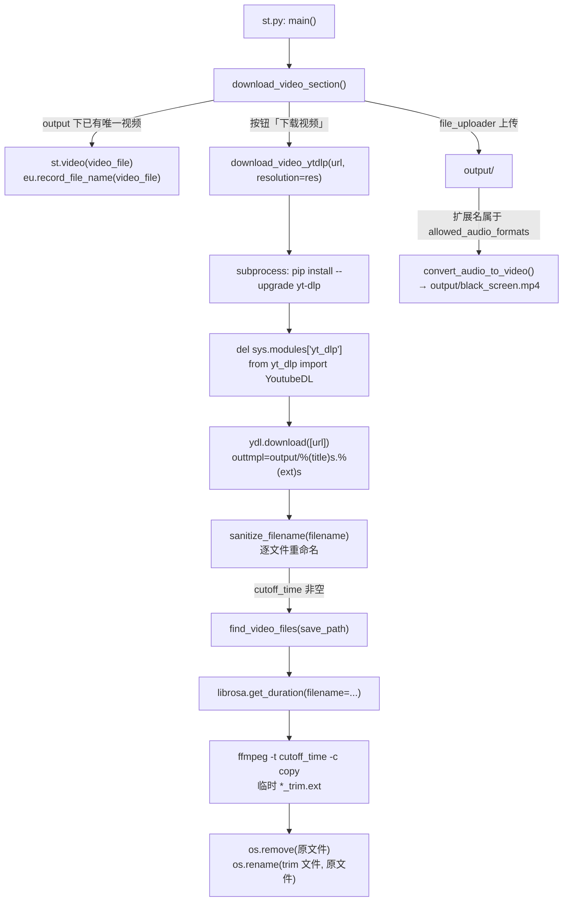
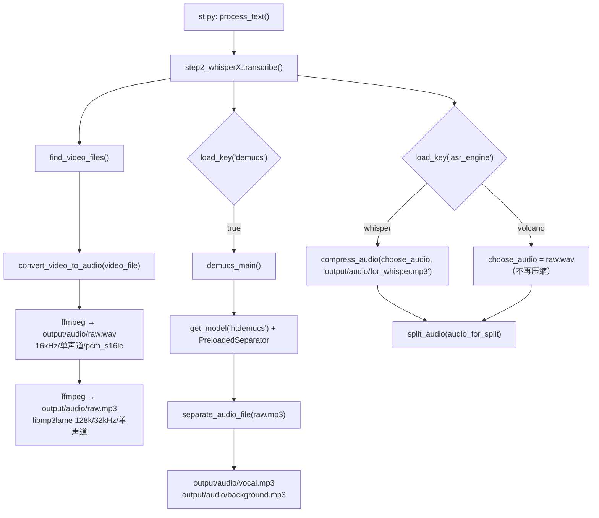

# 下载与音频提取（step1）

这一层把「一个 URL 或一个本地文件」变成 `output/` 下**唯一一个视频文件**，再把视频抽成 `raw.wav`（火山引擎规格）与 `raw.mp3`（Whisper 兼容），可选地用 Demucs 分离人声，最后把送进 ASR 的音频压成低码率单声道文件。

---

## 一、职责与边界

**负责**：下载/接收视频 → 文件名清洗 → （可选）按 `cutoff_time` 截断 → 抽音频（WAV/MP3 双轨）→ （可选）Demucs 人声分离 → 压缩出 ASR 用音频。

**不负责**：不决定用哪个 ASR 引擎、不做音频分段（`split_audio()` 虽定义在同目录 `whisperX_utils.py`，但由 step2 调用）、不写 `config.yaml`（本层只 `load_key` 读配置，唯一写配置的是 step2 的 `save_language()`）。

**隐含契约**：`output/` 下**有且仅有一个**扩展名属于 `allowed_video_formats` 的文件；`find_video_files()` 是这个契约的唯一执行者，被 step2/step7/step12/`onekeycleanup`/`siliconflow_fish_tts` 共同依赖。

---

## 二、文件清单

| 文件 | 行数 | 主要职责 |
| --- | --- | --- |
| `core/step1_ytdlp.py` | 98 | yt-dlp 下载、文件名清洗、`cutoff_time` 截断、定位唯一视频文件 |
| `core/all_whisper_methods/whisperX_utils.py` | 281 | 抽音频（`convert_video_to_audio`）、压缩（`compress_audio`）、火山 WAV 转换（`convert_to_volcano_wav`）、静音切分（`split_audio`） |
| `core/all_whisper_methods/demucs_vl.py` | 59 | Demucs `htdemucs` 人声/伴奏分离 |
| `st_components/download_video_section.py` | 76 | Streamlit 下载/上传区块，音频上传转黑屏视频 |
| `core/step2_whisperX.py` | 391 | **调用方**：`transcribe()` 里编排抽音频 → Demucs → 压缩 |

---

## 三、调用链与数据流

### 3.1 下载阶段（UI 触发）



要点：UI 的 `res` 来自 `download_video_section.py:30-39` 的三选一（`360p→'360'`、`1080p→'1080'`、`最佳→'best'`），默认项由 `config.yaml: ytb_resolution` 决定；`download_video_section.py:43` 调用时**没有传 `cutoff_time`**，所以 GUI 路径永远不截断视频（只有批处理/手工调用才会传）。

### 3.2 抽音频阶段（step2 触发）



注意 `raw.mp3` 是从 `raw.wav` 转出来的（`whisperX_utils.py:74`），不是直接从视频转的；因此**删掉 `raw.wav` 而保留 `raw.mp3` 不会再生成 WAV**，反之删掉 `raw.mp3` 会从 WAV 重建。

---

## 四、关键数据结构

### 4.1 函数间传递的数据

| 名称 | 类型 | 含义 | 产生位置 |
| --- | --- | --- | --- |
| `video_files` | `List[str]` | `output/` 下匹配 `allowed_video_formats` 的文件列表，长度必须为 1 | `core/step1_ytdlp.py:82-89` |
| `video_file` | `str` | 唯一源视频路径，如 `output/你的视频.mp4` | `core/step1_ytdlp.py:90` |
| `segments` | `List[Tuple[float, float]]` | 音频分段的时间区间 `(start, end)`，单位**秒**（浮点） | `core/all_whisper_methods/whisperX_utils.py:131` |
| `resolution` | `str` | 取值只能是 `'360'`、`'1080'`、`'best'` 三者之一，其他值静默退化为 `'360'` | `core/step1_ytdlp.py:17-19` |

### 4.2 落盘产物清单（本层）

| 路径 | 生成者 | 用途 | 格式规格 |
| --- | --- | --- | --- |
| `output/<title>.<ext>` | `download_video_ytdlp()` `core/step1_ytdlp.py:42-43` | 唯一源视频，全流程输入 | yt-dlp 合并产物（`bestvideo+bestaudio`），扩展名通常 `mp4`/`mkv`/`webm` |
| `output/<title>.jpg` | yt-dlp `FFmpegThumbnailsConvertor` `core/step1_ytdlp.py:26-30` | 封面残留（**不被下游消费**） | JPEG |
| `output/<title>_trim.<ext>` | `download_video_ytdlp()` `core/step1_ytdlp.py:65-66` | 临时截断文件，成功后立刻改名回原名 | 与源同容器（`-c copy` 不重编码） |
| `output/black_screen.mp4` | `convert_audio_to_video()` `st_components/download_video_section.py:67-76` | 上传纯音频时伪装成视频 | `libx264` + `aac`，`640x360`，`yuv420p`，`-shortest` |
| `output/audio/raw.wav` | `convert_video_to_audio()` `core/all_whisper_methods/whisperX_utils.py:58-66` | 火山引擎 ASR 的输入；也是 `raw.mp3` 的源 | 16 kHz / 单声道 / `pcm_s16le` / WAV / `-metadata encoding=UTF-8` |
| `output/audio/raw.mp3` | `convert_video_to_audio()` `core/all_whisper_methods/whisperX_utils.py:73-79` | Whisper 引擎的原始音频；Demucs 的输入；step8 配音链路也读它 | `libmp3lame` 128 kbps / 32 kHz / 单声道 |
| `output/audio/vocal.mp3` | `demucs_main()` `core/all_whisper_methods/demucs_vl.py:46` | 人声轨（ASR 与 step9 参考音频） | MP3 64 kbps / 44.1 kHz / **立体声**（`htdemucs` 签名的 `samplerate=44100`、`audio_channels=2`） |
| `output/audio/background.mp3` | `demucs_main()` `core/all_whisper_methods/demucs_vl.py:49-50` | 伴奏轨（step12 混音用，`core/step12_merge_dub_to_vid.py:11,33`） | 同上 |
| `output/audio/for_whisper.mp3` | `compress_audio()` `core/all_whisper_methods/whisperX_utils.py:18-22` | Whisper 引擎实际送进 ASR 的文件 | MP3 96 kbps / 16 kHz / 单声道 |

> ⚠️ `output/audio/for_volcano.wav` **在当前代码里并不会被生成**：常量 `VOLCANO_FILE` 定义于 `core/step2_whisperX.py:33`，`convert_to_volcano_wav()` 定义于 `core/all_whisper_methods/whisperX_utils.py:27` 并在 `core/step2_whisperX.py:20` 被 import，但两者在 `transcribe()` 中都没有被调用（火山分支直接复用 `raw.wav` / `enhanced_vocals.wav`）。详见 [`02-语音识别ASR.md`](02-语音识别ASR.md)。

---

## 五、逐函数实现说明

### 5.1 `sanitize_filename(filename)` — `core/step1_ytdlp.py:8-14`

| 步骤 | 代码 | 说明 |
| --- | --- | --- |
| 去非法字符 | `re.sub(r'[<>:"/\\\|?*]', '', filename)` `:10` | 直接**删除**而非替换；正则会命中 Windows 非法字符集 `<>:"/\|?*` |
| 去首尾点与空格 | `filename.strip('. ')` `:12` | Windows 不允许文件名以 `.`/空格结尾 |
| 空值兜底 | `return filename if filename else 'video'` `:14` | 清空后回退为 `video` |

副作用：**重命名磁盘文件**（在 `download_video_ytdlp()` 的循环里执行），不写 config。

### 5.2 `download_video_ytdlp(url, save_path='output', resolution='1080', cutoff_time=None)` — `core/step1_ytdlp.py:16-79`

| 阶段 | 行号 | 实现 |
| --- | --- | --- |
| 分辨率白名单 | `:17-19` | `allowed_resolutions = ['360', '1080', 'best']`；**不在白名单则强制 `'360'`**（不是用默认参数 `'1080'`） |
| 建目录 | `:21` | `os.makedirs(save_path, exist_ok=True)` |
| format 选择 | `:23` | `best` → `'bestvideo+bestaudio/best'`；否则 `f'bestvideo[height<={resolution}]+bestaudio/best[height<={resolution}]'` |
| 输出模板 | `:24` | `f'{save_path}/%(title)s.%(ext)s'` → 落到 `output/<原始标题>.<ext>` |
| 单视频约束 | `:25` | `'noplaylist': True`（播放列表 URL 只取首个视频） |
| 缩略图 | `:26-30` | `'writethumbnail': True` + postprocessor `FFmpegThumbnailsConvertor` + `format: 'jpg'` |
| 自升级 yt-dlp | `:34-37` | `subprocess.check_call([sys.executable, "-m", "pip", "install", "--upgrade", "yt-dlp"])`，失败只 `print` 警告 |
| 热重载 yt-dlp | `:39-41` | `del sys.modules['yt_dlp']` 后 `from yt_dlp import YoutubeDL`，保证本次下载用刚装上的版本 |
| 下载 | `:42-43` | `with YoutubeDL(ydl_opts) as ydl: ydl.download([url])` |
| 重命名循环 | `:46-51` | 遍历 `os.listdir(save_path)`，对**每个文件**用 `sanitize_filename()` 计算新名，不同则 `os.rename()`（视频与缩略图同名不同扩展名，会被一致地改名） |
| 截断 | `:54-79` | 见下 |

**`cutoff_time` 截断逻辑（`:54-79`）**

1. `find_video_files(save_path)` 找到唯一视频（`:56`）；
2. `librosa.get_duration(filename=video_file)` 取时长（秒，`:60`）——注意这里 `librosa` 是在函数内 `import` 的（`:59`）；
3. 仅当 `duration > cutoff_time` 才截断（`:62`）；
4. 目标名 `f"{file_name}_trim{file_extension}"`（`:65`），命令 `ffmpeg -i <video> -t <cutoff_time> -c copy <trim 文件>`（`:66`）；
5. 用 `subprocess.Popen` 把 ffmpeg 输出实时 print 出来（`:68-71`）；
6. `os.remove(video_file)` 删原文件，`os.rename(trimmed_file, video_file)`（`:75-76`）——**最终路径不变**，下游无感；
7. `duration <= cutoff_time` 时只打印一行（`:79`），不产生新文件。

副作用：网络下载、`pip` 安装、磁盘改名/删文件、启动 ffmpeg 子进程。

### 5.3 `find_video_files(save_path='output')` — `core/step1_ytdlp.py:81-90`

| 约束 | 行号 | 细节 |
| --- | --- | --- |
| 扩展名过滤 | `:82` | `glob.glob(save_path + "/*")`，用 `os.path.splitext(file)[1][1:].lower()` 与 `load_key("allowed_video_formats")` 比对（config 里是**不带点、小写**的扩展名） |
| Windows 反斜杠 | `:84-85` | `sys.platform.startswith('win')` 时把所有 `\` 换成 `/`（注释原文：`# change \\ to /, this happen on windows`） |
| 排除嵌套目录 | `:86` | 丢弃以 `output/output` 开头的路径。**这一步依赖上面已经换成 `/`**：已实测 Windows 下 `glob.glob('output/*')` 返回的是 `output\<name>`（反斜杠，即使模式里写的是 `/`），不替换则该保护永远不命中 |
| 唯一性硬约束 | `:88-89` | `len(video_files) != 1` 直接 `raise ValueError(f"Number of videos found is not unique. Please check. Number of videos found: {len(video_files)}")` |
| 返回 | `:90` | `video_files[0]` |

### 5.4 `convert_audio_to_video(audio_file)` — `st_components/download_video_section.py:67-76`

上传 `.wav/.mp3/.flac/.m4a` 时把音频包成 `output/black_screen.mp4`（`ffmpeg -f lavfi -i color=c=black:s=640x360 -i <audio> -shortest -c:v libx264 -c:a aac -pix_fmt yuv420p`），随后 `os.remove(audio_file)`（`:75`）删掉上传的音频。幂等：`output/black_screen.mp4` 已存在则不重建（`:69`）。上传分支还会先 `shutil.rmtree("output")` 清空整个工作目录（`:49-51`）。

### 5.5 `convert_video_to_audio(video_file)` — `core/all_whisper_methods/whisperX_utils.py:51-80`

| 产物 | 行号 | 命令要点 | 幂等条件 |
| --- | --- | --- | --- |
| `output/audio/raw.wav` | `:58-66` | `ffmpeg -y -i <video> -vn -ar 16000 -ac 1 -acodec pcm_s16le -metadata encoding=UTF-8 -f wav` | `not os.path.exists(RAW_AUDIO_WAV_FILE)`（`:55`） |
| `output/audio/raw.mp3` | `:73-79` | `ffmpeg -y -i raw.wav -c:a libmp3lame -b:a 128k -ar 32000 -ac 1 -metadata encoding=UTF-8`（源是 **raw.wav**） | `not os.path.exists(RAW_AUDIO_FILE)`（`:71`） |

先 `os.makedirs(AUDIO_DIR, exist_ok=True)`（`:52`）。两个产物**各自独立判断**，可以只有其中一个存在。

### 5.6 `compress_audio(input_file, output_file)` — `core/all_whisper_methods/whisperX_utils.py:13-24`

`ffmpeg -y -i <input> -vn -b:a 96k -ar 16000 -ac 1 -metadata encoding=UTF-8 -f mp3 <output>`（`:18-22`）。幂等条件是 `not os.path.exists(output_file)`（`:15`），返回 `output_file` 字符串。注释说明取舍（`:17`）：16000 Hz、单声道（Whisper 默认）、96 kbps「keep more details as well as smaller file size」。实际调用点为 `core/step2_whisperX.py:362`，输出 `output/audio/for_whisper.mp3`。

### 5.7 `convert_to_volcano_wav(input_file, output_file)` — `core/all_whisper_methods/whisperX_utils.py:27-49`

把任意音频转成 16 kHz / 单声道 / `pcm_s16le` WAV（`:39-47`），幂等同 `compress_audio`。**当前主流程没有调用它**（仅被 `core/step2_whisperX.py:20` import 而未使用），因为 `raw.wav` 与 `enhanced_vocals.wav` 已经天然满足火山引擎要求。

### 5.8 `demucs_main()` 与 `PreloadedSeparator` — `core/all_whisper_methods/demucs_vl.py:27-56`、`:19-25`

| 项 | 值 / 行号 |
| --- | --- |
| 幂等 | `vocal.mp3` **和** `background.mp3` 同时存在才跳过（`:28-30`） |
| 模型 | `get_model('htdemucs')`（`:36`），`BagOfModels`；本机实际加载的是签名 `955717e8`：`samplerate=44100`、`segment=39/5`（= 7.8 s）、`sources=[drums, bass, other, vocals]`、`audio_channels=2`、约 42.0M 参数 |
| 分离器 | `PreloadedSeparator(model=model, shifts=1, overlap=0.25)`（`:37`）：`shifts=1` 不做 shift 增强、`overlap=0.25` 段间重叠 25%，`split=True`、`progress=True`、`segment=None`（用模型自带的 7.8 s）（`:24-25`） |
| 设备优先级 | `cuda` → `mps`（仅 Apple）→ `cpu`（`:23`），**没有显存预算/降级逻辑** |
| 输入 | `separator.separate_audio_file(RAW_AUDIO_FILE)`（`:40`），即 `output/audio/raw.mp3`；文件不存在会直接抛错。demucs 内部用 `AudioFile.read(streams=0, samplerate=44100, channels=2)` 读取（回退 torchaudio），因此 32 kHz 单声道的 `raw.mp3` 会在读入时被重采样成 **44.1 kHz 立体声** |
| 写盘参数 | `samplerate=model.samplerate, bitrate=64, preset=2, clip="rescale", as_float=False, bits_per_sample=16`（`:42-43`）；`.mp3` 走 demucs 的 lameenc 编码器（`set_bit_rate(64)`、`set_channels(2)`、quality=2），编码前先按 `rescale` 策略防削波 |
| 产物 | `outputs['vocals']` → `vocal.mp3`（`:46`）；其余所有源相加 → `background.mp3`（`:49-50`） |
| 释放 | `del outputs, background, model, separator` + `gc.collect()`（`:53-54`） |

**耗时与显存**：本项目代码里**没有任何**时间/显存预算控制，能确证的只有「设备选择」与「分离参数」。把已实测与估计分开列：

| 项 | 数值 | 依据 |
| --- | --- | --- |
| 权重规模 | 约 42.0M 参数；checkpoint `955717e8-8726e21a.th` 84.1 MB；按 fp32 载入约 160 MB | 已实测（读取本机 torch hub 缓存里的 checkpoint 元数据） |
| 单次推理分段 | 7.8 s / 段，段间 `overlap=0.25`，`shifts=1` | 签名 + `core/all_whisper_methods/demucs_vl.py:37` |
| GPU 显存（估计） | 2 GB 量级（权重 160 MB + 7.8 s × 44.1 kHz 立体声的激活值） | **估计值，未实测** |
| 耗时（估计） | GPU 上通常快于实时（`shifts=1` 是最省的一档）；CPU/MPS 上可能慢于实时 | **估计值，未实测** |
| 本层额外开销 | 多一次 44.1 kHz 立体声解码 + 两次 MP3 编码（`vocal.mp3` / `background.mp3`） | 代码事实 |

调用方：`core/step2_whisperX.py:343`（受 `load_key("demucs")` 控制）、`core/step9_extract_refer_audio.py:31`（**无条件调用**，注释写着 `#!!! in case demucs is not run`）。

---

## 六、关键参数与配置

| config 键 | 读取位置 | 影响 |
| --- | --- | --- |
| `allowed_video_formats` | `core/step1_ytdlp.py:82`、`st_components/download_video_section.py:46` | 决定哪些文件算「视频」；当前值 `mp4/mov/avi/mkv/flv/wmv/webm`（`config.yaml:185-192`） |
| `allowed_audio_formats` | `st_components/download_video_section.py:46,61` | 上传时可接受的音频类型，会被转成 `black_screen.mp4`；当前值 `wav/mp3/flac/m4a`（`config.yaml:194-198`） |
| `ytb_resolution` | `st_components/download_video_section.py:35` | 下载框默认分辨率，必须是 `'360'/'1080'/'best'` 之一（`config.yaml:101`） |
| `demucs` | `core/step2_whisperX.py:281,342,350,360` | 是否做人声分离；同时决定 ASR 输入是 `vocal.mp3` 系还是 `raw.mp3` 系 |
| `model_dir` | `core/step2_whisperX.py:31` | Whisper 模型目录（`./_model_cache`），本层不直接用，但 `demucs` 与它无关、不要混淆 |
| `resolution` | 与 step7/step12 相关（`config.yaml:97`） | 成片分辨率，**不是**下载分辨率 |

硬编码（无 config 键）：`save_path='output'`、`resolution='1080'`、`cutoff_time=None`、缩略图转 `jpg`、`raw.wav` = 16 kHz/单声道/`pcm_s16le`、`raw.mp3` = 128 kbps/32 kHz/单声道、`for_whisper.mp3` = 96 kbps/16 kHz/单声道、Demucs = `htdemucs`/`shifts=1`/`overlap=0.25`/`bitrate=64`。

---

## 七、技术要点与坑

1. **`python -m core.step1_ytdlp` 的默认分辨率会掉到 360p。** `:95-96` 把输入转成 `int`（`1080`），而 `:17` 的白名单是字符串 `['360', '1080', 'best']`，`1080 not in [...]` 成立 → 静默改成 `'360'`。UI 路径传字符串，不受影响。
2. **每次下载都会尝试 `pip install --upgrade yt-dlp`**（`:35`）。网络慢/离线环境会明显卡顿；失败只警告不中断。升级后靠 `del sys.modules['yt_dlp']`（`:40`）热重载。
3. **重命名循环作用于目录内所有文件**（`:46-51`），包括缩略图与用户手动放进 `output/` 的其他文件；如果两个不同原名的文件清洗后同名，后一个 `os.rename` 会覆盖前一个。
4. **`find_video_files()` 的「恰好一个」是硬约束**：`output/` 里出现第二个视频（例如上一次任务残留、或上传了第二个文件）会直接抛 `ValueError`，而 step2/step7/step12 都调用它，整条流水线都会失败。GUI 的「删除并重新选择」按钮会 `shutil.rmtree("output")`（`st_components/download_video_section.py:18-23`）。
5. **纯音频 URL 会失败**：`format` 选择器可能只拿到音频（`m4a`/`mp3`），这些不在 `allowed_video_formats` 里，`find_video_files()` 抛错。需要先经 `convert_audio_to_video()` 造出视频容器。
6. **`-c copy` 截断不重编码**（`:66`）：速度快、无损，但切点受关键帧限制；且截断是「从 0 秒切到 `cutoff_time` 秒」，不是按区间截取。
7. **`raw.wav` 是 `raw.mp3` 的上游**：删掉 `raw.wav` 只保留 `raw.mp3`，后续不会再生成 WAV；火山引擎引擎会因此重新生成（因为 `RAW_AUDIO_WAV_FILE` 不存在）。
8. **`demucs_main()` 依赖 `raw.mp3`**（`demucs_vl.py:40`）：单独跑 `python -m core.all_whisper_methods.demucs_vl` 前必须先有 `output/audio/raw.mp3`，否则 `separate_audio_file` 报文件不存在。
9. **同一文件有两种路径写法**：`whisperX_utils.py:9-10` 用字面量 `"output/audio/raw.mp3"`，`demucs_vl.py:15` 用 `os.path.join` → Windows 上是 `output\audio\raw.mp3`。两者指向同一文件，**不要在代码里做字符串相等比较**。
10. **Demucs 的幂等只认两个文件同时存在**（`:28`）：只有 `vocal.mp3`（比如跑挂了）时会重跑整个分离。
11. **缩略图会一直留在 `output/`**（`:26-30` 只下载不删除），不影响 `find_video_files()`（扩展名不在白名单），但会进入「删除并重新选择」的清空范围，也可能被误当成成片素材。
12. **批量模式把 `raw.mp3` / `for_whisper.mp3` 当接口**：`batch/utils/batch_processor.py:204-206` 与 `:219`、`batch/utils/video_processor.py:266,278-280` 都以这两个文件名搬运预处理产物——**改文件名或改码率规格等于破坏批量模式与缓存复用**。
13. **改 `demucs` 开关会影响 ASR 输入链**：`demucs=true` 时 Whisper 分支的输入是 `enhanced_vocals.mp3`（音量 ×2.5 后压缩 96 kbps/16 kHz），火山分支是 `enhanced_vocals.wav`；此时 `output/audio/` 会多出 `vocal.mp3`/`background.mp3`。
14. **`cutoff_time` 只在代码层存在**：`config.yaml` 没有对应键，GUI 也不传，只有批处理显式传 `cutoff_time=None`（`batch/utils/video_processor.py:150`）。

---

## 八、扩展点

### 8.1 支持新的下载源（如 Bilibili、本地目录、S3）

- 落点一：在 `st_components/download_video_section.py:40-44` 的下载按钮旁加分源选择，把 URL 交给新函数；
- 落点二：新函数必须满足两条契约——**产物只落到 `save_path`（默认 `output/`）**、**最终 `output/` 下只有一个视频文件**，否则 `find_video_files()` 会抛错；
- 语言/剧集类 URL 记得保持 `noplaylist` 语义（`core/step1_ytdlp.py:25`），避免一次下载多集；
- 若下载器自带文件名清洗，仍建议过一遍 `sanitize_filename()`（`core/step1_ytdlp.py:8`），保证 Windows 可写。

> 💡 建议：把「下载源」抽象成一个返回 (video_path, thumbnail_path) 的适配函数，并在 `download_video_section.py` 里统一调用；这样 `find_video_files()` 的唯一性契约只需在一处保证。

### 8.2 改分辨率策略

三处必须同步，否则 UI 与代码不一致：

| 位置 | 内容 |
| --- | --- |
| `core/step1_ytdlp.py:17` | `allowed_resolutions` 白名单（字符串） |
| `core/step1_ytdlp.py:23` | `format` 表达式（当前用 `height<=` 上限约束） |
| `st_components/download_video_section.py:30-34` | UI 的 `res_dict` 显示名 → 值 |
| `config.yaml:101` | `ytb_resolution` 默认值 |

> 💡 建议：把白名单改成从 config（如 `ytb_resolution_options`）读取，避免「加了 720p 但白名单没加 → 静默变 360p」。

### 8.3 去掉 yt-dlp 自动升级

删掉 `core/step1_ytdlp.py:34-37` 的 `subprocess.check_call(...)` 即可；`:39-41` 的重载逻辑可保留（无害），也可以一并删除后把 `from yt_dlp import YoutubeDL` 提到模块顶层。

> 💡 建议：改为「只在下载抛 `DownloadError` 时再尝试升级一次」，兼顾离线可用与「API 变了自动修」的初衷。

### 8.4 新增/调整音频产物

| 想做的事 | 动哪里 | 注意 |
| --- | --- | --- |
| 改 `raw.wav` 规格 | `core/all_whisper_methods/whisperX_utils.py:58-66` | 火山引擎要求 16 kHz/单声道/16-bit PCM，改错会触发 `VolcanoASR._convert_audio_for_volcano()` 的 ffprobe 检查并打印「不符合要求」 |
| 改 `raw.mp3` 规格 | `core/all_whisper_methods/whisperX_utils.py:73-79` | Demucs 与 step8 配音链路都读它 |
| 改 `for_whisper.mp3` 规格 | `core/all_whisper_methods/whisperX_utils.py:18-22` | 96k 是为了「30 分钟 < 25 MB」的分段前提，见 [`02-语音识别ASR.md`](02-语音识别ASR.md) 第七节 |
| 换人声分离模型 | `core/all_whisper_methods/demucs_vl.py:36` | 改 `htdemucs` 会影响 `vocal.mp3` 的采样率与音质，进而影响 step9 参考音频 |
| 想让 Demucs 结果可复用/可清理 | `core/all_whisper_methods/demucs_vl.py:28-30` | 幂等条件写死两个文件，若只想复用 `vocal.mp3` 需要改判断 |

> 💡 建议：所有 ffmpeg 调用都应统一加 `-nostdin`（当前 `convert_video_to_audio`/`compress_audio` 都没有），避免在批量循环里 ffmpeg 抢占 stdin 造成卡死。

---

## 九、验证方式

**环境准备**（与 [`02-语音识别ASR.md`](02-语音识别ASR.md) 第九节一致）：必须用 conda 环境 `videolingo` 的 python（系统默认 `python` 连 `pandas` 都没有），并且在 PowerShell 里直跑前设 `$env:PYTHONIOENCODING='utf-8'`，否则 rich 的 emoji 会在 GBK 控制台抛 `UnicodeEncodeError`。

```powershell
cd E:\VideoLingo\VideoLingoMove
$env:PYTHONIOENCODING='utf-8'
$py = "$env:USERPROFILE\anaconda3\envs\videolingo\python.exe"
```

**1）只验证下载 + 定位（不要用 `__main__` 的交互式分辨率输入，会掉到 360p）**

```powershell
& $py -c "import sys; sys.path.insert(0,'.'); from core.step1_ytdlp import download_video_ytdlp, find_video_files; download_video_ytdlp('https://www.youtube.com/watch?v=xxxx', resolution='1080'); print(find_video_files())"
```

**2）验证唯一性约束会按预期报错**

```powershell
& $py -c "import sys; sys.path.insert(0,'.'); from core.step1_ytdlp import find_video_files; print(find_video_files())"   # output/ 下有两个视频时应抛 ValueError
```

**3）验证抽音频产物规格（三个产物都应出现）**

```powershell
& $py -c "import sys; sys.path.insert(0,'.'); from core.step1_ytdlp import find_video_files; from core.all_whisper_methods.whisperX_utils import convert_video_to_audio, compress_audio, RAW_AUDIO_FILE; v=find_video_files(); convert_video_to_audio(v); print(compress_audio(RAW_AUDIO_FILE, 'output/audio/for_whisper.mp3'))"
ffprobe -v error -show_entries stream=sample_rate,channels,codec_name -of csv=p=0 output/audio/raw.wav
ffprobe -v error -show_entries stream=sample_rate,channels,bit_rate -of csv=p=0 output/audio/raw.mp3
ffprobe -v error -show_entries stream=sample_rate,channels,bit_rate -of csv=p=0 output/audio/for_whisper.mp3
```

期望：`raw.wav` → `pcm_s16le,16000,1`；`raw.mp3` → 32000 Hz、1 声道、128 kbps；`for_whisper.mp3` → 16000 Hz、1 声道、96 kbps。（`ffprobe` 来自系统 PATH，仓库根目录只有 `ffmpeg.exe`。）

**4）验证 Demucs 分离**

```powershell
& $py -c "import sys; sys.path.insert(0,'.'); from core.all_whisper_methods.demucs_vl import demucs_main; demucs_main()"   # 需要已有 output/audio/raw.mp3
```

期望产物：`output/audio/vocal.mp3`、`output/audio/background.mp3`；再次执行会打印 `already exist, skip Demucs processing`。

**5）验证幂等（存在即跳过）**

删掉某个产物再跑对应函数：`remove output/audio/raw.mp3` 后重跑 `convert_video_to_audio()` 只会重建 MP3（WAV 已存在，不会重转视频）。

---

## 十、相关文档

- [`00-流水线总览.md`](00-流水线总览.md) — step1~step12 的依赖矩阵与跳过条件
- [`02-语音识别ASR.md`](02-语音识别ASR.md) — 下游步骤：`split_audio()`、Whisper/火山引擎转写、`cleaned_chunks.xlsx`
- [`../00-overview/02-数据流与中间产物.md`](../00-overview/02-数据流与中间产物.md) — 全流程产物字段与消费者
- [`../03-subsystems/03-ASR引擎适配层.md`](../03-subsystems/03-ASR引擎适配层.md) — ASR 适配层总览
- [`../04-interfaces/02-Streamlit界面组件.md`](../04-interfaces/02-Streamlit界面组件.md) — `download_video_section()` 的 UI 交互
- [`../04-interfaces/01-配置文件与参数.md`](../04-interfaces/01-配置文件与参数.md) — `allowed_video_formats` 等键的完整说明
- [`../06-batch-and-tools/01-批量音频提取工具.md`](../06-batch-and-tools/01-批量音频提取工具.md) — 批量模式对 `raw.mp3`/`for_whisper.mp3` 的复用
