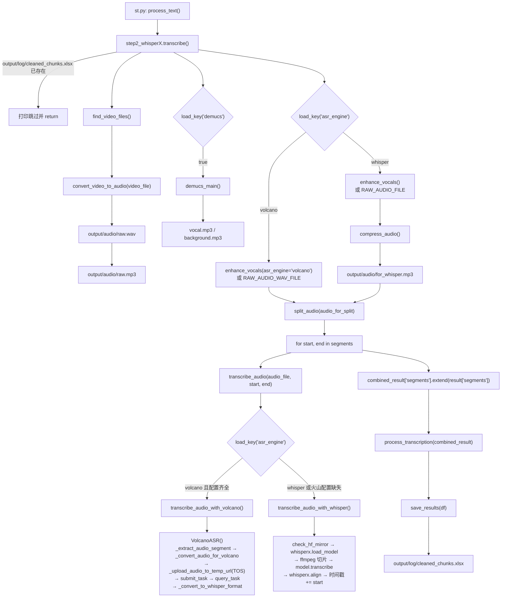

# 语音识别 ASR（step2）

step2 的产物只有一个：`output/log/cleaned_chunks.xlsx`（**词级**时间戳表）。它同时支持两个引擎——本地 WhisperX（faster-whisper 后端）与火山引擎大模型录音文件识别（异步 submit/query + TOS 对象存储），两者的返回值在 `_convert_to_whisper_format()` 处被统一成 WhisperX 风格。

---

## 一、职责与边界

**负责**：抽音频 → （可选）人声分离 → 把音频切成 ≤30 分钟的段 → 逐段转写 → 合并所有段的 `segments` → 词级清洗 → 写 `output/log/cleaned_chunks.xlsx`；同时把检测到的语言回写到 `config.yaml: whisper.detected_language`。

**不负责**：不做句子切分与翻译（step3/step4）、不做字幕时间轴对齐（step6）、不决定配音；音频抽取与人声分离的具体实现属于 [`01-下载与音频提取.md`](01-下载与音频提取.md)。

**核心契约**：返回的每段结果必须是 `{"segments": [{"start": float, "end": float, "text": str, "words": [{"word": str, "start": float, "end": float}]}]}`，时间单位是**秒**、且必须是**整条音频的全局时间**（含段偏移）。`process_transcription()` 强依赖 `segments[].words` 存在，缺了会 `KeyError`。

---

## 二、文件清单

| 文件 | 行数 | 主要职责 |
| --- | --- | --- |
| `core/step2_whisperX.py` | 391 | 编排：`transcribe()`、引擎分发 `transcribe_audio()`、WhisperX 实现、火山实现、`enhance_vocals()`、`check_hf_mirror()` |
| `core/all_whisper_methods/whisperX_utils.py` | 281 | 音频抽取/压缩、静音切分 `split_audio()`、`process_transcription()`、`save_results()`、`save_language()` |
| `core/all_whisper_methods/volcano_asr.py` | 766 | 火山引擎 ASR 客户端（配置、TOS 上传、submit/query 轮询、结果转换、JSON 缓存） |
| `core/all_whisper_methods/tos_service.py` | 362 | 火山对象存储 TOS 客户端封装（上传、删除、URL 生成、文件缓存） |
| `core/all_whisper_methods/demucs_vl.py` | 59 | 人声分离（ASR 前处理，见 step1 文档） |

---

## 三、调用链与数据流



ASCII 版顺序（便于对照行号）：

```
transcribe()                                  core/step2_whisperX.py:332
├─ 幂等检查 cleaned_chunks.xlsx                :333
├─ find_video_files()                          :338
├─ convert_video_to_audio(video_file)          :339  → raw.wav / raw.mp3
├─ if load_key('demucs'): demucs_main()        :342  → vocal.mp3 / background.mp3
├─ asr_engine = load_key('asr_engine')         :346
│   ├─ volcano: enhance_vocals() 或 raw.wav     :348-357
│   └─ whisper: enhance_vocals() 或 raw.mp3 → compress_audio()  :358-364
├─ segments = split_audio(audio_for_split)     :367
├─ for start, end in segments: transcribe_audio(...)  :371-379
├─ combined_result['segments'] += 每段 segments :382-384
├─ df = process_transcription(combined_result)  :387
└─ save_results(df)                             :388
```

调用方：`st.py:83`（`process_text()` 内，spinner 文案写死「使用 Whisper 进行转录中...」）、批量模式 `batch/utils/video_processor.py` 复用同一 `core/` 步骤；单步入口 `python -m core.step2_whisperX`（`core/step2_whisperX.py:390-391`）。

---

## 四、关键数据结构

### 4.1 统一后的转写结果（WhisperX 风格）

| 字段 | 类型 | 单位 | 说明 |
| --- | --- | --- | --- |
| `segments` | `List[dict]` | — | 每段音频的转写结果；多段会 `extend` 合并成一个列表 |
| `segments[].start` / `.end` | `float` | 秒 | Whisper 分支由 `core/step2_whisperX.py:196-197` 加上段起始偏移；火山分支见第七节第 9 条 |
| `segments[].text` | `str` | — | 段文本（`process_transcription()` **不使用**它，只使用 `words`） |
| `segments[].words[]` | `List[dict]` | — | 词级列表，必须存在（可为空列表） |
| `words[].word` | `str` | — | 词文本；法语 guillemets 会被删掉 |
| `words[].start` / `.end` | `float` | 秒 | 词级时间戳；缺失时按第五节 5.7 的规则补齐 |

火山引擎额外返回 `language` 字段（`_convert_to_whisper_format()` 产出），但 `transcribe()` 合并时只取 `segments`（`core/step2_whisperX.py:382-384`），**该字段被丢弃**。

### 4.2 `cleaned_chunks.xlsx` 的列

| 列名 | 类型 | 说明 |
| --- | --- | --- |
| `text` | `str` | 词文本，**带双引号**（`f'"{x}"'`，`core/all_whisper_methods/whisperX_utils.py:276`）；下游统一用 `.str.strip('"')` 还原（`core/step4_2_translate_all.py:84,143`、`core/spacy_utils/split_by_mark.py:16`、`core/step6_generate_final_timeline.py:169`） |
| `start` | `float` | 词起始时间（秒） |
| `end` | `float` | 词结束时间（秒） |

无索引列（`index=False`）。消费方：`core/spacy_utils/split_by_mark.py:15`（由 `core/step3_1_spacy_split.py:7,17` 调用）、`core/step4_2_translate_all.py:83,142`、`core/step6_generate_final_timeline.py:168`；批量模式把它当预处理产物搬运（`batch/utils/batch_processor.py:206`、`batch/utils/video_processor.py:280`）。另一个会**直接改写**它的工具是 `core/json_to_subtitle.py`（`:167-168` 默认输出路径就是该文件）。

### 4.3 火山引擎原始返回 → 统一结构（逐字读代码确认）

`transcribe_audio()` 的轮询把「HTTP 响应 JSON」交给 `_convert_to_whisper_format()`（`core/all_whisper_methods/volcano_asr.py:458-515`），映射关系如下：

| 火山字段（原始） | 统一字段 | 换算 | 代码位置 |
| --- | --- | --- | --- |
| `result.utterances[]` | `segments[]` | 每条 utterance → 一个 segment | `:481-504` |
| `utterance.start_time` / `end_time`（毫秒） | `segments[].start` / `.end` | `/1000.0` **再加** `start_offset` | `:484-485` |
| `utterance.text` | `segments[].text` | `.strip()` | `:486` |
| `utterance.words[]` | `segments[].words[]` | — | `:491-502` |
| `word.text` | `words[].word` | 空白词（`text.strip()==""`）跳过 | `:493-496` |
| `word.start_time` / `end_time`（毫秒） | `words[].start` / `.end` | `/1000.0` 再加 `start_offset` | `:499-500` |
| `result.text`（无 utterances 时） | 单个 `segment` | `end = start_offset + audio_info.duration/1000`，`words: []` | `:505-513` |
| `audio_info.duration` | 仅用于上面的兜底 segment | 毫秒 → 秒 | `:509` |
| `language` | `language` | 由 `_detect_language_from_result()` 按 `volcano_asr.language` 映射，见 5.10 | `:477, 678-707` |

`_detect_language_from_result()` **不看**接口返回的语言，只用配置里的 `volcano_asr.language` 查表（`en-US→en, zh-CN→zh, ja-JP→ja, ko-KR→ko, fr-FR→fr, de-DE→de, es-MX→es, pt-BR→pt, id-ID→id, th-TH→th, ar-SA→ar`），配置为空则返回 `"en"`（`:692-707`）。

### 4.4 落盘产物清单（本层）

| 路径 | 生成者 | 用途 | 格式规格 |
| --- | --- | --- | --- |
| `output/audio/raw.wav` | `convert_video_to_audio()` `whisperX_utils.py:58-66` | 火山引擎的默认输入 | 16 kHz / 单声道 / `pcm_s16le` |
| `output/audio/raw.mp3` | `convert_video_to_audio()` `whisperX_utils.py:73-79` | Whisper 的原始音频、Demucs 输入、step8 配音 | 128 kbps / 32 kHz / 单声道 |
| `output/audio/for_whisper.mp3` | `compress_audio()` `whisperX_utils.py:18-22`（调用点 `step2_whisperX.py:362`） | Whisper 引擎**实际**送进 ASR 的文件 | 96 kbps / 16 kHz / 单声道 |
| `output/audio/vocal.mp3` | `demucs_main()` `demucs_vl.py:46` | `demucs=true` 时 ASR 的输入源；step9 参考音频 | 64 kbps MP3 / `htdemucs` 采样率 |
| `output/audio/enhanced_vocals.mp3` | `enhance_vocals()` `step2_whisperX.py:303-308` | `demucs=true` + `asr_engine=whisper` 时压缩前的输入 | `volume=2.50`，采样率/声道沿用 `vocal.mp3`（未显式指定） |
| `output/audio/enhanced_vocals.wav` | `enhance_vocals()` `step2_whisperX.py:293-299` | `demucs=true` + `asr_engine=volcano` 时的输入 | `volume=2.50` / 16 kHz / 单声道 / `pcm_s16le` |
| `output/audio/vocal.wav` | `enhance_vocals()` 失败回退分支 `step2_whisperX.py:319-326` | 音量增强失败时的火山输入 | 16 kHz / 单声道 / `pcm_s16le` |
| `output/log/cleaned_chunks.xlsx` | `save_results()` `whisperX_utils.py:260-278` | **step2 的最终产物**，step3/4/6 的输入 | 列 `text`（带双引号）/`start`/`end` |
| `output/log/asr_results/volcano_asr_<audio>_<ts>_task_<taskid8>.json` | `_save_asr_result_to_json()` `volcano_asr.py:593-657` | 火山原始结果留档 + 断点续跑缓存 | `metadata` + `original_result` + `converted_result` |
| `output/log/asr_results/volcano_asr_<audio>_<ts>_simplified.json` | 同上 `:643-650` | 简化版（只有 `segments`） | `metadata` + `segments` |

> ⚠️ `output/audio/for_volcano.wav` **在当前代码里不会被生成**：`VOLCANO_FILE` 只定义在 `core/step2_whisperX.py:33`（全仓库无其他引用），`convert_to_volcano_wav()`（`whisperX_utils.py:27-49`）也只被 `core/step2_whisperX.py:20` import 而未调用。火山分支真正使用的是 `raw.wav` / `enhanced_vocals.wav`。

---

## 五、逐函数实现说明

### 5.1 `transcribe()` — `core/step2_whisperX.py:332-388`

| 步骤 | 行号 | 实现与说明 |
| --- | --- | --- |
| 幂等检查 | `:333-335` | `if os.path.exists(CLEANED_CHUNKS_EXCEL_PATH)` → 打印「Transcription results already exist, skipping transcription step.」并 `return`。**只认这一个文件**：删视频/删音频都不会触发重跑，必须删 `output/log/cleaned_chunks.xlsx` |
| 抽音频 | `:338-339` | `find_video_files()` + `convert_video_to_audio(video_file)`（内部各自幂等） |
| 人声分离 | `:342-343` | `if load_key("demucs"): demucs_main()` |
| 引擎分支 | `:346-364` | `volcano`：`choose_audio = enhance_vocals(asr_engine='volcano') if load_key("demucs") else RAW_AUDIO_WAV_FILE`；`whisper`：`choose_audio = enhance_vocals(...) if load_key("demucs") else RAW_AUDIO_FILE`，随后 `whisper_audio = compress_audio(choose_audio, WHISPER_FILE)` |
| 分段 | `:367` | `segments = split_audio(audio_for_split)`；火山分支传 WAV、Whisper 分支传 `for_whisper.mp3` |
| 逐段转写 | `:370-379` | 每段调用 `transcribe_audio(audio_file_for_transcription, start, end)`，结果 append 到 `all_results` |
| 合并 | `:382-384` | `combined_result = {'segments': []}` 后逐段 `extend(result['segments'])`；**不排序、不去重** |
| 清洗与落盘 | `:387-388` | `df = process_transcription(combined_result)`；`save_results(df)` |

模块级常量（import 时求值）：`MODEL_DIR = load_key("model_dir")`（`:31`）、`WHISPER_FILE`（`:32`）、`VOLCANO_FILE`（`:33`，未使用）、`ENHANCED_VOCAL_PATH`（`:34`）。模块导入时还全局执行 `warnings.filterwarnings("ignore")`（`:4-5`）。

### 5.2 `transcribe_audio(audio_file, start, end)` — 引擎分发 `core/step2_whisperX.py:241-271`

| 行号 | 行为 |
| --- | --- |
| `:254` | 每次调用都重新 `load_key("asr_engine")`（不缓存） |
| `:258-266` | `asr_engine == "volcano"` 时校验 `volcano_asr.app_id` 与 `volcano_asr.access_token`；任一为空 → 打印回退提示并把**局部变量** `asr_engine = "whisper"`（不做持久化） |
| `:268-269` | 仍为 volcano → `transcribe_audio_with_volcano(audio_file, start, end)` |
| `:270-271` | 否则 → `transcribe_audio_with_whisper(audio_file, start, end)` |

注意校验**不包含** `volcano_asr.resource_id`：若该键为空，会走到 `VolcanoASR()` 的 `_validate_config()`（`volcano_asr.py:54-61`）抛 `ValueError`，**不会**回退到 Whisper。

### 5.3 `transcribe_audio_with_whisper(audio_file, start, end)` — `core/step2_whisperX.py:66-206`

| 环节 | 行号 | 细节 |
| --- | --- | --- |
| HF 镜像测速 | `:78` | `os.environ['HF_ENDPOINT'] = check_hf_mirror()`——**每段都测一次** |
| 语言 | `:79` | `WHISPER_LANGUAGE = load_key("whisper.language")` |
| 设备 | `:80` | `"cuda" if torch.cuda.is_available() else "cpu"` |
| 显存自适应 | `:83-87` | `gpu_mem = torch.cuda.get_device_properties(0).total_memory / (1024**3)`；`batch_size = 16 if gpu_mem > 8 else 2`；`compute_type = "float16" if torch.cuda.is_bf16_supported() else "int8"` |
| CPU 参数 | `:88-91` | `batch_size = 1`，`compute_type = "int8"` |
| 中文强制 Belle | `:95-97` | `if WHISPER_LANGUAGE == 'zh'` → `model_name = "Huan69/Belle-whisper-large-v3-zh-punct-fasterwhisper"`，`local_model = os.path.join(MODEL_DIR, "Belle-whisper-large-v3-zh-punct-fasterwhisper")` |
| 其他语言 | `:98-100` | `model_name = load_key("whisper.model")`（默认 `large-v3`），`local_model = os.path.join(MODEL_DIR, model_name)` |
| 本地优先 | `:102-106` | `os.path.exists(local_model)` 为真才用本地目录，否则用 HF 仓库名 |
| VAD / ASR 选项 | `:108-109` | `vad_options = {"vad_onset": 0.500, "vad_offset": 0.363}`；`asr_options = {"temperatures": [0], "initial_prompt": ""}` |
| auto 语言 | `:110` | `whisper_language = None if 'auto' in WHISPER_LANGUAGE else WHISPER_LANGUAGE`（`in` 是子串判断） |
| 加载模型 | `:112` | `whisperx.load_model(model_name, device, compute_type=compute_type, language=whisper_language, vad_options=vad_options, asr_options=asr_options, download_root=MODEL_DIR)` |
| 临时 wav | `:115-116` | `tempfile.NamedTemporaryFile(suffix='.wav', delete=False)` |
| 最短时长 | `:120-124` | `MIN_DURATION = 0.5`；`end - start < 0.5` 时把 `end` 延长到 `start + 0.5` |
| ffmpeg 切片 | `:126-136` | `ffmpeg -y -i "<audio>" -ss <start> -t <end-start> -vn -ar 16000 -ac 1 "<temp.wav>"`；失败或空文件抛 `RuntimeError` |
| 读音频 | `:138-149` | 先 `whisperx.load_audio(temp_audio_path)`；返回 `size == 0` 或 `len < 100`（16 kHz 下 6.25 ms）则回退 `librosa.load(temp_audio_path, sr=16000)`；再不足 100 采样抛 `ValueError("Audio segment too short for processing")` |
| 转 tensor | `:152-155` | `torch.from_numpy(...).unsqueeze(0).float()`，供 `whisperx.align()` 使用 |
| 临时文件清理 | `:167-170` | `finally` 中 `os.unlink(temp_audio_path)` |
| 转写 | `:173` | `model.transcribe(audio_numpy, batch_size=batch_size, print_progress=True)` |
| 释放显存 ① | `:176-178` | `gc.collect()` + `torch.cuda.empty_cache()` + `del model` |
| 写回语言 | `:181` | `save_language(result['language'])` → `update_key("whisper.detected_language", language)` |
| 中文一致性检查 | `:182-183` | `if result['language'] == 'zh' and WHISPER_LANGUAGE != 'zh': raise ValueError("Please specify the transcription language as zh and try again!")`（**先写配置再抛错**） |
| 对齐 | `:186-187` | `whisperx.load_align_model(language_code=result["language"], device=device)`，然后 `whisperx.align(result["segments"], model_a, metadata, audio_tensor, device, return_char_alignments=False)`。注意这里**没有传 `model_dir`**：英文等语言走 torchaudio 的 `WAV2VEC2_ASR_BASE_960H`（本机缓存 `~/.cache/torch/hub/checkpoints/wav2vec2_fairseq_base_ls960_asr_ls960.pth`，377 MB，已实测存在），中文走 HF 仓库 `jonatasgrosman/wav2vec2-large-xlsr-53-chinese-zh-cn`（本机缓存 `~/.cache/huggingface/hub/models--jonatasgrosman--wav2vec2-large-xlsr-53-chinese-zh-cn`，已实测存在）——即**对齐模型不进 `_model_cache`**；whisperx 对没有默认对齐模型的语言会抛 `ValueError(f"No default align-model for language: {language_code}")` |
| 释放显存 ② | `:190-192` | 再次 `gc.collect()` + `empty_cache()` + `del model_a` |
| 时间戳回加偏移 | `:195-203` | 对每个 `segment` 的 `start`/`end` 以及每个 `word` 的 `start`/`end` 统一 `+= start`（段内相对时间 → 全音频绝对时间） |
| 异常 | `:204-206` | 打印后原样 `raise`（无重试、无降级） |

`check_hf_mirror()`（`:36-64`）：候选 `{'Official': 'huggingface.co', 'Mirror': 'hf-mirror.com'}`，用 `ping -n 1 -w 3000`（Windows）/ `ping -c 1 -W 3`（其他）测 RTT，取最快者返回 `https://<domain>`；全部失败返回官方地址（`best_time == inf` 时仍返回初始值 `https://huggingface.co`），并打印一次耗时。

### 5.4 `transcribe_audio_with_volcano(audio_file, start, end)` — `core/step2_whisperX.py:209-238`

| 行号 | 行为 |
| --- | --- |
| `:221-222` | `VOLCANO_ASR_AVAILABLE` 为假（import 失败）时抛 `ImportError("火山引擎ASR模块不可用，请确保volcano_asr.py文件存在")` |
| `:228` | `asr = VolcanoASR()`——**每段都重新构造**（重新读配置、重新初始化 TOS 客户端） |
| `:231` | `result = asr.transcribe_audio(audio_file, start, end)` |
| `:236-238` | 异常打印中文提示后 `raise` |

模块顶部用 `try/except ImportError` 引入 `VolcanoASR`（`:24-29`），失败时 `VOLCANO_ASR_AVAILABLE = False` 并打印黄色警告。

### 5.5 `enhance_vocals(vocals_ratio=2.50, asr_engine="whisper")` — `core/step2_whisperX.py:274-330`

| 分支 | 行号 | 行为 |
| --- | --- | --- |
| `demucs` 关闭 | `:281-286` | 直接返回 `RAW_AUDIO_WAV_FILE`（volcano）或 `RAW_AUDIO_FILE`（whisper）；**不做音量增强**（注意 `transcribe()` 只在 `demucs=true` 时才调用本函数，所以该分支目前不会被主流程走到） |
| volcano 增强 | `:291-300` | `ffmpeg -y -i vocal.mp3 -filter:a "volume=2.50" -ar 16000 -ac 1 -acodec pcm_s16le -f wav output/audio/enhanced_vocals.wav` |
| whisper 增强 | `:303-308` | `ffmpeg -y -i vocal.mp3 -filter:a "volume=2.50" output/audio/enhanced_vocals.mp3`（不指定采样率/声道） |
| 增强失败回退 | `:313-330` | volcano：先把 `vocal.mp3` 转成 `output/audio/vocal.wav`（16 kHz/单声道/`pcm_s16le`），再失败则回退 `RAW_AUDIO_WAV_FILE`；whisper：回退 `VOCAL_AUDIO_FILE` |

### 5.6 `split_audio()` + 两个辅助函数 — `core/all_whisper_methods/whisperX_utils.py:82-207`

**`get_audio_duration(audio_file)`（`:96-129`）**：`subprocess.Popen(['ffmpeg', '-i', audio_file])`（没有输出文件，ffmpeg 会以非 0 退出，**代码不检查返回码**），从 stderr 解析 `Duration: HH:MM:SS.ss` 得到秒数；找不到 `Duration` 或时长 `<= 0` 抛 `ValueError`；文件不存在抛 `FileNotFoundError`。

**`_detect_silence(audio_file, start, end)`（`:82-94`）**：`ffmpeg -y -i <file> -ss <start> -to <end> -af silencedetect=n=-30dB:d=0.5 -f null -`，从 stderr 里抓取 `silence_end: <t>`，返回 `List[float]`（秒）。

> 已实测（本机 90 分钟 `output/audio/raw.wav`）：`_ss/-to` 写在 `-i` **之后**（输出侧 seek），`silencedetect` 仍然会看到从 0 秒起的音频，因此返回的是**从文件头累计的绝对时间戳**——窗口 `100–220s` 的返回值里包含 `55.412s`、`105.143s` 等小于 100 的点，且末尾会略微超出窗口右界（`220.096s`）。这既解释了 `split_audio()` 里 `t - win_start` 为什么成立，也意味着**每个窗口都要从 0 秒重新解码**（见第七节第 20 条）。

**`split_audio(audio_file, target_len=30*60, win=60, min_segment_len=0.5)`（`:131-207`）**

| 步骤 | 行号 | 说明 |
| --- | --- | --- |
| 设计前提 | `:132` | 注释：`# 30 min 16000 Hz 96kbps ~ 22MB < 25MB required by whisper` |
| 取时长 | `:135-140` | 时长为 0 抛 `ValueError("Invalid audio duration")` |
| 收敛目标 | `:143` | `target_len = min(target_len, duration)`（音频比 30 分钟短就整段处理） |
| 尾段太短 | `:152-158` | `remaining < 0.5s`：把上一段的 `end` 改成 `duration`（合并尾巴）；没有上一段则直接 break |
| 尾段不足一段 | `:159-162` | `remaining < target_len` → 追加 `(pos, duration)` 并 break |
| 静音窗口 | `:164-165` | `win_start = pos + target_len - win`；`win_end = min(win_start + 2*win, duration)`（即 `target_len±60s` 的 2 分钟窗口） |
| 找切点 | `:168-180` | `silences = _detect_silence(...)`；`target_pos = target_len - (win_start - pos)`（化简后等于 `win`）；`valid_splits = [t for t in silences if t - win_start > target_pos and t - pos >= min_segment_len]`；取**第一个**满足者作为切点（列表按时间升序） |
| 兜底切法 | `:184-194` | 窗口里没有可用静音 → 硬切 `pos + target_len`；若剩余会 <0.5s 则把当前段直接延伸到 `duration` |
| 校验 | `:204-205` | 各段总时长与音频时长差 >1.0s 时打印警告（不抛错） |

**实测样例**（90.07 分钟 `raw.wav`，`target_len=1800`）：输出 `[(0, 1805.927938), (1805.927938, 3610.44225), (3610.44225, 5404.18)]` 共 3 段，每段 ~30 分钟且切点落在静音处，函数本身耗时 0.6s（WAV 解码便宜）。

**为什么是 25MB**：`whisper` 的**云 API**（OpenAI `audio/transcriptions`）有 25MB 上传上限，而 30 分钟 @16 kHz 单声道 96 kbps ≈ 21.6 MB，正好卡在上限内；这也是 `compress_audio()` 选 96 kbps 而不是更高码率的原因。本地 faster-whisper 推理本身没有这个限制，`split_audio()` 的分段在这里更多是「控制单次显存占用 + 保持与云 API 兼容」。

### 5.7 `process_transcription(result)` — `core/all_whisper_methods/whisperX_utils.py:209-258`

对 `result['segments']` 的每个 `segment`，遍历 `segment['words']`（`:211-212`，**`words` 键必须存在**），逐词生成 `{'text', 'start', 'end'}`：

| 规则 | 行号 | 行为 |
| --- | --- | --- |
| 跳过空白词 | `:214-216` | `word_text and word_text.strip() == ""` → `continue`（非空但全空格的词被丢弃；**空字符串 `""` 不会被这里丢掉**，由 `save_results()` 再过滤） |
| 跳过超长词 | `:219-221` | `len(word_text) > 20` → 打印警告并 `continue` |
| 法文 guillemets | `:223-225` | `word_text.replace('»','').replace('«','')` 后写回 `word["word"]`（**原地修改入参**） |
| 缺时间戳（否一路） | `:227-247` | `'start' not in word and 'end' not in word`：<br>① 已有前词 → `start = end = all_words[-1]['end']`（与前一词同点）；<br>② 是段内第一个词 → 在本段里找**下一个**同时有 `start`/`end` 的词，把它的 `start`/`end` 赋给当前词；<br>③ 找不到 → `raise Exception(f"No next word with timestamp found for the current word : {word}")` |
| 有时间戳（是） | `:248-256` | `text = word["word"]`；`start = word.get('start', 前词 end 或 0)`；`end = word['end']`（**只有 `end` 没有 `start` 能过，只有 `start` 没有 `end` 会 `KeyError`**） |
| 返回 | `:258` | `pd.DataFrame(all_words)`，列顺序 `text, start, end`；**全被过滤时得到 shape `(0, 0)` 的空 DataFrame** |

### 5.8 `save_results(df)` — `core/all_whisper_methods/whisperX_utils.py:260-278`

| 步骤 | 行号 | 行为 |
| --- | --- | --- |
| 建目录 | `:261` | `os.makedirs('output/log', exist_ok=True)` |
| 去空文本 | `:264-268` | `df = df[df['text'].str.len() > 0]`（注意：空 DataFrame 会在此处 `KeyError: 'text'`，见第七节第 8 条） |
| 去超长词 | `:271-274` | `df = df[df['text'].str.len() <= 20]`（与 `process_transcription()` 重复的一道保险） |
| **加双引号** | `:276` | `df['text'] = df['text'].apply(lambda x: f'"{x}"')`——**下游全部依赖这个约定**（`.str.strip('"')`） |
| 落盘 | `:277-278` | `df.to_excel(CLEANED_CHUNKS_EXCEL_PATH, index=False)`，路径 `output/log/cleaned_chunks.xlsx` |

引号是在长度过滤**之后**才加的，所以 20 字符限制不包含引号。

### 5.9 `save_language(language)` — `core/all_whisper_methods/whisperX_utils.py:280-281`

`update_key("whisper.detected_language", language)` → 走 `core/config_utils.py:28-47`，用 ruamel.yaml **重写整个 `config.yaml`**（保留引号与注释）。

**与 `whisper.language` 的关系**：`whisper.language` 是「用户指定的识别语言」（可为 `'auto'`，代码里用 `'auto' in WHISPER_LANGUAGE` 判断，`core/step2_whisperX.py:110`），`whisper.detected_language` 是「Whisper 实际检测到的语言」。下游的取值模式基本统一为「`whisper.language == 'auto'` 时用 `detected_language`，否则用 `whisper.language`」（`core/step3_2_splitbymeaning.py:24-25`、`core/step5_splitforsub.py:57-58`、`core/spacy_utils/split_by_mark.py:11-12`、`core/spacy_utils/split_long_by_root.py:33-34,52-53`、`core/all_tts_functions/gpt_sovits_tts.py:62,68`），例外是 `core/spacy_utils/load_nlp_model.py:19-21` 与 `core/prompts_storage.py:8,41,141,184,228` 会**直接**读 `detected_language`。

**中文检测不一致会硬报错**：`save_language()` 先执行（`core/step2_whisperX.py:181`），紧接着 `result['language'] == 'zh' and WHISPER_LANGUAGE != 'zh'` 就抛 `ValueError("Please specify the transcription language as zh and try again!")`（`:182-183`）。也就是说报错时 `config.yaml` 已经被改写。UI 的「Recog Lang」下拉框只有 10 种具体语言、**没有 `auto` 选项**（`st_components/sidebar_setting.py:94-105`），要开 `auto` 只能手改 `config.yaml: whisper.language: 'auto'`。

### 5.10 `volcano_asr.py` 类结构与请求流程

`class VolcanoASR`（`core/all_whisper_methods/volcano_asr.py:22`）

| 成员 | 行号 | 作用 |
| --- | --- | --- |
| `__init__` | `:25-52` | 读 12 个 `volcano_asr.*` 配置、写死两个 endpoint、`TOSService()` 初始化并置 `self.use_tos = tos_service.is_enabled()`、`last_uploaded_file_info = None`，最后 `_validate_config()` |
| `_validate_config` | `:54-61` | `app_id` / `access_token` / `resource_id` 任一为空 → `ValueError(f"火山引擎ASR配置错误: xxx为空")` |
| `_upload_audio_to_temp_url` | `:63-110` | 文件不存在抛 `FileNotFoundError`；`use_tos` 为真则 `tos_service.upload_file()`，成功记录 `{object_key, public_url, local_path}` 并返回公网 URL；失败/未启用则回退 `f"file://{abs_path}"`（并警告「可能不被火山引擎ASR接受」） |
| `_convert_audio_for_volcano` | `:112-171` | 扩展名在 `['.mp3','.wav','.ogg','.flac','.m4a']` 内直接返回；`.wav` 会先 `ffprobe -show_entries stream=sample_rate,channels,bits_per_sample` 校验是否 16 kHz/单声道/16 bit（只打印提示，**不符合也不会转**）；其他扩展名用 ffmpeg 转成临时 MP3（`libmp3lame 128k / 16000 Hz / 单声道`）。`ffprobe` 依赖系统 PATH——仓库根目录只自带 `ffmpeg.exe`，没有 `ffprobe.exe`，缺失时该分支会被 `except` 吞掉并打印「无法检查WAV文件参数」 |
| `submit_task` | `:173-270` | 见下表 |
| `query_task` | `:272-324` | 见下表 |
| `_extract_audio_segment` | `:326-365` | `ffmpeg -y -i <audio> -ss <start> -to <end> -vn -ar 16000 -ac 1 -acodec pcm_s16le <temp.wav>`，失败时删临时文件并 `raise` |
| `transcribe_audio` | `:367-456` | 主流程：查缓存 → 切片 → 转格式 → 上传取 URL → submit → 轮询 query → 转 whisper 格式 → 存 JSON → 清理 TOS；`finally` 里删临时片段与临时转换文件 |
| `_convert_to_whisper_format` | `:458-515` | 火山结果 → WhisperX 风格（映射表见 4.3）；`result` 缺失抛 `ValueError("火山引擎结果中缺少result字段")` |
| `_find_cached_result` | `:517-591` | 扫 `output/log/asr_results/volcano_asr_<audio_name>_*.json`，按 mtime 倒序，比对 `metadata.audio_file` 的 basename、`start_offset`（容差 0.1s）、`audio_info.duration` 与 `end-start`（容差 0.1s），命中返回 `converted_result`（或简化版的 `segments`） |
| `_save_asr_result_to_json` | `:593-657` | 写 `volcano_asr_<audio>_<YYYYmmdd_HHMMSS>_task_<task_id[:8]>.json`（`metadata` + `original_result` + `converted_result`）与 `..._simplified.json`（`metadata` + `segments`）；内部整体 try/except，失败只打印 |
| `_cleanup_tos_file_after_result` | `:659-676` | `use_tos` 且 `last_uploaded_file_info` 存在时调 `tos_service.cleanup_uploaded_file(object_key)`，随后把 `last_uploaded_file_info` 置 `None` |
| `_detect_language_from_result` | `:678-707` | 按 `volcano_asr.language` 查表转 Whisper 语言码，配置为空返回 `"en"`（**忽略入参 `result_data`**） |
| `cleanup` | `:709-721` | 调 `tos_service.cleanup_old_files()`；**主流程没有任何地方调用它** |
| `test_volcano_asr` | `:724-766` | `__main__` 自测入口（生成 1 秒 440 Hz 正弦波，实际不做网络调用） |

**鉴权与请求（逐字段）**

| 项 | submit_task（`:173-270`） | query_task（`:272-324`） |
| --- | --- | --- |
| URL | `https://openspeech-direct.zijieapi.com/api/v3/auc/bigmodel/submit`（`:41`） | `https://openspeech-direct.zijieapi.com/api/v3/auc/bigmodel/query`（`:42`） |
| Header | `X-Api-App-Key` / `X-Api-Access-Key` / `X-Api-Resource-Id` / `X-Api-Request-Id`(=task_id=UUID4) / `X-Api-Sequence: "-1"`（`:186-192`） | 同上但最后一项换成 `X-Tt-Logid: log_id`（`:283-289`） |
| Body | `{"user": {"uid": "videolingo_user"}, "audio": {"url", "format", "language"?}, "request": {"model_name": "bigmodel", "enable_itn", "enable_punc", "enable_ddc", "enable_speaker_info", "show_utterances", "enable_channel_split", "vad_segment", "model_version"?}}`（`:208-234`） | 空 JSON `{}`（`:294`） |
| `format` | 由扩展名推断：`.wav→wav`、`.ogg→ogg`、`.flac→flac`、`.m4a→m4a`，默认 `mp3`（`:195-206`） | — |
| 可选字段注入 | `language` 仅当配置非空才写；`model_version` 仅当配置非空且 `!= "310"` 才写（`:229-234`） | — |
| 成功判定 | 响应头 `X-Api-Status-Code == "20000000"` → 返回 `(task_id, X-Tt-Logid)`；否则抛 `RuntimeError`（`:247-266`） | `20000000` → 返回响应 JSON；`20000001`/`20000002` → `{"status": "processing"}`；`20000003` → `{"status": "silent"}`；其他 → `{"status": "failed", ...}`（`:299-317`） |
| 超时/重试 | `requests.post(..., timeout=30)`，异常直接 `raise`（`:240-270`） | 同上，但异常被吞成 `{"status": "error", "message": ...}`（`:322-324`） |

**轮询参数（`transcribe_audio`，`:412-439`）**：`max_attempts = 8640`（`:414`），每次 `query_task` 后 `processing` → `time.sleep(10)`（`:423-425`）；按常数推算最长等待约 24 小时（8640 × 10s，未计请求耗时）；超出后 `raise TimeoutError("火山引擎ASR处理超时")`（`:439`）。`silent`/`failed`/`error` → `raise RuntimeError(f"火山引擎ASR处理失败: {result.get('message', '未知错误')}")`（`:436-437`）。

### 5.11 `tos_service.py` 的角色

火山引擎的 `audio.url` 需要**公网可访问的 URL**，`TOSService` 就是为此存在的一层薄封装：把本地音频 put 到火山对象存储，再拼出公网 URL。

| 成员 | 行号 | 作用 |
| --- | --- | --- |
| `__init__` | `:20-49` | 读 `tos.access_key/secret_key/endpoint/region/bucket_name/enabled/public_url_prefix/auto_cleanup`；AK/SK 为空时回退环境变量 `TOS_ACCESS_KEY` / `TOS_SECRET_KEY`（`:27-30`）；维护 `uploaded_files` 列表与按**绝对路径**索引的 `file_cache` |
| `_init_tos_client` | `:51-93` | `enabled` 为假直接返回；AK/SK 仍为空 → `enabled = False`；否则 `tos.TosClientV2(ak, sk, endpoint, region, connection_time=30, socket_timeout=60, max_retry_count=3)`；`public_url_prefix` 为空时默认 `https://{bucket_name}.{endpoint}`（`:86`）；`tos` 包缺失 → 打印 `pip install tos` 并把 `enabled` 置假 |
| `upload_file` | `:95-172` | 未启用 → `(False, local_path, "file://<abs>")`；命中 `file_cache` 直接返回旧 URL；否则 `object_key = f"asr-audio/{timestamp}_{uuid4().hex}{ext}"`，`client.put_object(bucket, key, content=file)`，`public_url = f"{public_url_prefix}/{object_key}"`；异常回退 `(False, local, "file://...")` |
| `delete_file` / `cleanup_uploaded_file` | `:174-197` / `:228-270` | 前者 `delete_object`；后者额外从 `uploaded_files` 与 `file_cache` 里移除记录 |
| `cleanup_old_files` | `:199-205` | **只打印一行提示**（受 `auto_cleanup` 控制），不删任何文件 |
| `cleanup_all_files` / `clear_file_cache` / `get_public_url` | `:207-226` / `:288-304` / `:272-282` | 批量清理与 URL 拼接；**主流程没有调用**，批量模式由 `batch/utils/tos_manager.py: BatchTOSManager` 使用 |
| `is_enabled` | `:284-286` | `self.enabled and self.client is not None`——`VolcanoASR` 用它决定走 TOS 还是 `file://` |

> ⚠️ 当前 `config.yaml:80-81` 的 `tos.access_key` / `tos.secret_key` 都是空字符串且未设置环境变量，因此实测 `VolcanoASR().use_tos` 为 `False`，火山引擎会拿到 `file://` URL——参考文档明确指出火山引擎通常**不接受**该协议（`参考文档/火山引擎ASR使用说明.md:141`）。

---

## 六、关键参数与配置

| config 键 | 读取位置 | 说明 |
| --- | --- | --- |
| `asr_engine` | `core/step2_whisperX.py:254, 346`；UI `st_components/sidebar_setting.py:79-90` | `'whisper'`（默认，`config.yaml:37`）或 `'volcano'`；UI 下拉项为「Whisper / 火山引擎ASR」 |
| `demucs` | `core/step2_whisperX.py:281, 342, 350, 360` | `true` 时先跑 `demucs_main()`，ASR 输入改用 `vocal.mp3` 派生文件 |
| `whisper.model` | `core/step2_whisperX.py:99` | 默认 `'large-v3'`；**仅非中文生效**（中文强制 Belle，`:95-97`） |
| `whisper.language` | `core/step2_whisperX.py:79, 95, 110, 182` | 指定识别语言；含 `'auto'` 时向 WhisperX 传 `language=None` |
| `whisper.detected_language` | 写：`core/all_whisper_methods/whisperX_utils.py:281`；读：`core/prompts_storage.py:8,41,141,184,228`、`core/spacy_utils/load_nlp_model.py:19` 等 | 由 `save_language()` 回写；**火山引擎分支不会写这个键** |
| `model_dir` | `core/step2_whisperX.py:31, 97, 100, 112` | 默认 `'./_model_cache'`（`config.yaml:182`），同时作为 `download_root` 与本地模型目录前缀 |
| `volcano_asr.app_id` | `volcano_asr.py:27`；校验 `step2_whisperX.py:260` | 缺失 → 回退 Whisper |
| `volcano_asr.access_token` | `volcano_asr.py:28`；校验 `step2_whisperX.py:261` | 缺失 → 回退 Whisper |
| `volcano_asr.resource_id` | `volcano_asr.py:29, 60` | 默认 `'volc.bigasr.auc'`；缺失 → `ValueError`（**不回退**） |
| `volcano_asr.language` | `volcano_asr.py:30, 229-230, 690-705` | 传进请求体并决定统一结果里的 `language` |
| `volcano_asr.enable_punc` / `enable_itn` / `enable_ddc` | `volcano_asr.py:31-33, 218-220` | 标点 / 文本规整 / 语义顺滑 |
| `volcano_asr.enable_speaker_info` | `volcano_asr.py:34, 221` | 说话人分离 |
| `volcano_asr.show_utterances` | `volcano_asr.py:35, 222` | **必须为 true 才有 utterance/words 级时间戳**，否则走 `result.text` 兜底分支（见第七节第 8 条） |
| `volcano_asr.enable_channel_split` / `vad_segment` | `volcano_asr.py:36-37, 223-224` | 双声道识别 / VAD 分句 |
| `volcano_asr.model_version` | `volcano_asr.py:38, 233-234` | `'310'` 不写入请求体（服务端默认），`'400'` 才写入；当前配置为 `'400'` |
| `tos.enabled` | `tos_service.py:35` | 关闭则一律 `file://` |
| `tos.access_key` / `secret_key` | `tos_service.py:23-24, 27-30` | 空则尝试环境变量，仍空则 `enabled=False` |
| `tos.endpoint` / `region` / `bucket_name` | `tos_service.py:32-34, 70-78` | `TosClientV2` 参数 |
| `tos.public_url_prefix` | `tos_service.py:36, 85-86` | 空则 `https://{bucket}.{endpoint}` |
| `tos.auto_cleanup` | `tos_service.py:37, 201` | 只影响 `cleanup_old_files()` 的一行提示，**不控制 ASR 完成后的删除** |

硬编码值一览：分段 30 分钟 / 窗口 60s / 最小段 0.5s（`whisperX_utils.py:131`）、静音门限 `-30dB/0.5s`（`:86`）、词长上限 20 字符（`:219,271`）、`MIN_DURATION=0.5`（`step2_whisperX.py:120`）、VAD `0.500/0.363`（`:108`）、`temperatures=[0]`（`:109`）、`batch_size 16/2/1` 与 `compute_type float16/int8`（`:85-90`）、`volcano` 轮询 8640 次 × 10s（`volcano_asr.py:414,424`）、`requests` 超时 30s（`:244,296`）、TOS 对象键前缀 `asr-audio/`（`tos_service.py:134`）。

---

## 七、技术要点与坑

1. **幂等只认 `cleaned_chunks.xlsx`**（`core/step2_whisperX.py:333`）：换引擎、换模型、改语言都不会重跑；想重跑必须删这个文件（同时建议清 `output/log/asr_results/`，否则火山分支会命中 JSON 缓存）。
2. **每段都会重新加载模型**：`whisperx.load_model()`（`:112`）与 `whisperx.load_align_model()`（`:186`）都在 `transcribe_audio_with_whisper()` 内部，而该函数是**按段调用**的。90 分钟视频 = 3 段 = 3 次模型加载 + 3 次对齐模型加载。
3. **每段都会 ping 一次 HF 镜像**（`:78` 调 `check_hf_mirror()`），并且每段都会 `update_key("whisper.detected_language", ...)`（`:181`）→ **每段重写一次 `config.yaml`**。
4. **`whisper.language: 'auto'` 的连锁反应**（`:95, 99, 110, 182`）：模型改走 `whisper.model`（不再是 Belle）；`whisperx.load_model(language=None)` 自动检测；一旦检测结果是 `zh` 而配置不是 `zh`，直接抛 `ValueError`。而 UI 没有 `auto` 选项（`st_components/sidebar_setting.py:94-105`），只能手改 `config.yaml`。
5. **本地模型目录判断在本仓库当前状态下不成立**（`:97-106`）：代码找的是 `./_model_cache/Belle-whisper-large-v3-zh-punct-fasterwhisper` 与 `./_model_cache/large-v3`（「平铺目录」），而 `download_root=MODEL_DIR` 交给 faster-whisper + `huggingface_hub` 的下载结果是 HuggingFace 快照布局 `models--Huan69--Belle-whisper-large-v3-zh-punct-fasterwhisper`、`models--Systran--faster-whisper-large-v3`——`_model_cache/` 现在就是这两项（已实测 `Test-Path ./_model_cache/Belle-whisper-large-v3-zh-punct-fasterwhisper` 为 False）。因此代码**总是**走 HuggingFace 下载/缓存路径（受 `HF_ENDPOINT` 镜像影响），「本地模型优先」这条分支目前是死分支。
6. **`whisper.model` 被中文旁路**：`whisper.language: 'zh'` 时无论 `whisper.model` 配什么，都用 `Huan69/Belle-whisper-large-v3-zh-punct-fasterwhisper`（`:95-97`）。
7. **显存/批参数是「按总显存」而不是「按可用显存」**（`:84-86`）：`>8GB → batch_size 16`，只要显存被别的进程占用就可能 OOM；`compute_type` 用 `torch.cuda.is_bf16_supported()` 判定（支持 bf16 反而选 `float16`）。
8. **火山分支必须开 `show_utterances`，否则整条链路会崩**：`show_utterances: false` 时接口不返回 `utterances`，`_convert_to_whisper_format()` 走 `result.text` 兜底分支并给出 `words: []`（`volcano_asr.py:505-513`）；`process_transcription()` 对空 `words` 不产出任何行 → `pd.DataFrame([])` 是 shape `(0, 0)` → `save_results()` 在 `df['text'].str.len()` 处抛 `KeyError: 'text'`（**已实测复现空 DataFrame 的报错**）。同理，任何「所有词都被过滤掉」的极端情况（全空白词/全 >20 字符词）也会踩这个坑。
9. **火山引擎的时间轴偏移疑似丢失（未实测，仅读代码）**：`transcribe_audio()` 在 `end is not None` 时设 `result_start_offset = 0`（`volcano_asr.py:389-393`），随后 `_convert_to_whisper_format(result, 0)`（`:428`）只加这个 0，而 step2 合并结果时也**不再补** `start`（`core/step2_whisperX.py:382-384`）。分段调用时切片从 0 开始计时（`:391`），因此第 2 段及以后的时间戳很可能与第 1 段重叠。**已实测**：`_convert_to_whisper_format(fake, 1805.927938)` 会把 `1000ms` 变成 `1806.927938s`，说明偏移机制本身是好的，问题只在传参为 0。用火山引擎跑长视频前请用两段音频验证时间轴。
10. **火山分支不回写 `detected_language`**：`save_language()` 只在 `transcribe_audio_with_whisper()` 内被调用（`core/step2_whisperX.py:181`），`transcribe_audio_with_volcano()` 完全没有调用它。若 `whisper.language == 'auto'` 且用火山引擎，下游（`load_nlp_model`、`prompts_storage`）会读到**上一次运行**的语言。
11. **火山配置校验不查 `resource_id`**（`core/step2_whisperX.py:260-261` vs `volcano_asr.py:60-61`）：`resource_id` 为空时不会回退 Whisper，而是抛 `ValueError`。
12. **`file://` 回退是隐形的坏结局**：TOS 未启用/上传失败时 `_upload_audio_to_temp_url()` 返回 `file://...`（`volcano_asr.py:104-110`），任务提交可能成功但识别结果为空/报错；排查时先看有没有打印「使用file:// URL」。
13. **`tos.auto_cleanup` 不控制删除**：ASR 成功后的删除由 `_cleanup_tos_file_after_result()`（`volcano_asr.py:659-676`）执行，它只看 `use_tos`；`cleanup_old_files()`（`tos_service.py:199-205`）只打印提示。参考文档里提到的 `tos.retention_time` **代码里根本没有读取**。
14. **`for_volcano.wav` / `VOLCANO_FILE` / `convert_to_volcano_wav` 是死代码**（`core/step2_whisperX.py:33, 20`）：不要照着它们找文件。
15. **分段边界的静音检测会从 0 秒重解码**（`:82-94` 把 `-ss/-to` 放在 `-i` 之后）：已实测返回绝对时间戳，因此切点逻辑正确，但总解码量约为音频时长的「段数/2」倍；对长音频建议改成输入侧 seek（`-ss` 放在 `-i` 前）或一次性检测全文件静音。
16. **短片段会被「加长」到 0.5 秒**（`core/step2_whisperX.py:120-124`）：末段若本身不足 0.5s，`end` 会被推到音频末尾之外，ffmpeg 会自行截断，返回值不再校验实际长度。
17. **`process_transcription()` 会原地改写入参**（`whisperX_utils.py:225` 把去掉 guillemets 的文本写回 `word["word"]`），且要求 `words` 键存在（`:212`）——自研引擎的返回值必须包含 `words`（可以是空列表，但空列表会导致第 8 条的崩溃链）。
18. **双引号是隐式接口**：`save_results()` 给每行 `text` 加 `"`（`:276`），下游 step4/step5/step6 与 `core/spacy_utils/*` 统一 `.str.strip('"')` 还原；`core/json_to_subtitle.py:155` 也照抄了这个约定。手写或改写 `cleaned_chunks.xlsx` 时**必须保留引号**。
19. **`st.py` 的进度文案与实现解耦**：`st.py:82` 的 spinner 固定写「使用 Whisper 进行转录中...」，即使 `asr_engine: volcano` 也不会变。
20. **Windows 控制台直跑脚本会因 emoji 崩**（已实测）：`python -m core.step2_whisperX` 或直接调用 `split_audio()` 时，rich 打印 🔪/🗜️ 等字符在 GBK 控制台抛 `UnicodeEncodeError: 'gbk' codec can't encode character '\U0001f52a'`；先设 `$env:PYTHONIOENCODING='utf-8'`（PowerShell）或 `chcp 65001`。
21. **改这些会影响谁**：`save_results()` 的列名/引号 → step3/4/6 与批量模式；`split_audio()` 的分段粒度 → Whisper 每段耗时与显存、火山每段的 TOS 上传次数；`enhance_vocals()` 的返回值 → `compress_audio()` 的输入（`vocal.mp3` → `enhanced_vocals.mp3` → `for_whisper.mp3`）；`whisper.detected_language` → 术语/翻译提示词与 spaCy 模型选择。

---

## 八、扩展点

### 8.1 新增一个 ASR 引擎（操作清单）

| # | 要动的地方 | 具体要求 |
| --- | --- | --- |
| 1 | 新建 `core/all_whisper_methods/<engine>.py` | 提供 `transcribe_audio(audio_file, start, end) -> Dict`，返回 §4.1 的结构；`words` 键必须存在；时间戳单位**秒**且必须是**全音频绝对时间**（自己加 `start`） |
| 2 | `core/step2_whisperX.py:24-29` | 仿照火山的 `try/except ImportError` 做可选导入，避免缺依赖时整个模块挂掉 |
| 3 | `core/step2_whisperX.py:241-271` `transcribe_audio()` | 加引擎分支 + 配置缺失回退（同时把 `resource_id` 这类「不回退」的坑补齐） |
| 4 | `core/step2_whisperX.py:346-364` `transcribe()` | 决定该引擎吃什么音频（WAV/MP3/增强人声），必要时新增压缩/转码函数 |
| 5 | `core/step2_whisperX.py:274-330` `enhance_vocals()` | 若引擎需要特定格式的增强人声，加 `asr_engine` 分支与失败回退 |
| 6 | `st_components/sidebar_setting.py:79-90` | 在 `asr_engines` 字典里加入显示名 → 值；引擎专属配置面板参考 `:186` 起的「火山引擎ASR配置」写法 |
| 7 | `config.yaml`（与 `asr_engine`、`whisper`、`volcano_asr` 同级） | 新增引擎配置段。注意 `load_key()` 对不存在的键会抛 `KeyError`（`core/config_utils.py:25`），**必须同步加键**；同时更新 `config.yaml:36` 那行「合法取值」注释 |
| 8 | 语言一致性 | 若引擎能返回语言，请在成功后 `update_key("whisper.detected_language", lang)`（现状：火山引擎漏了这一步，见第七节第 10 条） |
| 9 | 批量模式 | 若产物路径/名称不同于 `raw.mp3`/`for_whisper.mp3`/`cleaned_chunks.xlsx`，需要同步 `batch/utils/batch_processor.py:204-206,219` 与 `batch/utils/video_processor.py:266,278-280` |

完整的分步向导（含返回结构契约、代码骨架、自测清单与「整段处理」引擎的注意事项）见 [`../05-guides/02-如何新增一个ASR引擎.md`](../05-guides/02-如何新增一个ASR引擎.md)。

### 8.2 其它常见改动

| 想做的事 | 动哪里 | 注意 |
| --- | --- | --- |
| 换默认引擎 | `config.yaml:37` + `st_components/sidebar_setting.py:79-90` | UI 的 index 计算依赖 `asr_engine` 值必须在字典 values 里，否则回落第 0 项 |
| 改分段长度/静音门限 | `core/all_whisper_methods/whisperX_utils.py:131, 86` | 30 分钟是「96 kbps < 25 MB」的前提；改大必须同步改 `compress_audio()` 的码率 |
| 让火山引擎少传几次 TOS | `core/step2_whisperX.py:367` 附近 | 目前每个 30 分钟段都独立上传一次；也可以把 `split_audio()` 的 `target_len` 调大（受 512MB/5 小时限制约束） |
| 加速 Whisper 分支 | `core/step2_whisperX.py:112, 186` | 把 `load_model`/`load_align_model` 提到段循环外（缓存到模块级变量）是本项目**收益最大**的优化点 |
| 去掉 `auto` 的中文硬报错 | `core/step2_whisperX.py:182-183` | 若去掉，请确保 `save_language()` 的写回时机正确（现在是先写后抛） |
| 让火山结果可断点续跑 | `core/all_whisper_methods/volcano_asr.py:517-591` | 缓存键是「音频 basename + start + duration」，同目录换视频可能误命中 |
| 修时间轴偏移 | `core/all_whisper_methods/volcano_asr.py:389-397` | 把 `result_start_offset` 改成 `start`（同时保持 `end=None` 分支语义） |

> 💡 建议：任何新引擎都应先过一个「单元级」验收——两段音频（例如 0–30min、30–60min）分别转写后合并，检查时间戳是否单调递增且落在正确的绝对位置；这一条能同时抓住第七节第 8/9 条两类问题。

---

## 九、验证方式

**环境**：项目用 conda 环境 `videolingo`（`OneKeyStart.bat` 里 `activate.bat videolingo`）；直接用系统默认 `python` 会立刻 `ModuleNotFoundError: No module named 'pandas'`（已实测）。实测该环境内的版本：`whisperx 3.2.0`、`faster-whisper 1.0.0`、`torch 2.1.2+cu118`、`demucs 4.1.0a3`、`pandas 2.2.3`、`tos 2.8.7`。在 PowerShell 里直跑前先设 `$env:PYTHONIOENCODING='utf-8'`，否则 rich 的 emoji 会在 GBK 控制台抛 `UnicodeEncodeError`（第七节第 20 条）。下面示例统一用：

```powershell
$py = "$env:USERPROFILE\anaconda3\envs\videolingo\python.exe"
```

**1）只验证分段（不写任何产物）**

```powershell
cd E:\VideoLingo\VideoLingoMove
& $py -c "import sys; sys.path.insert(0,'.'); from core.all_whisper_methods.whisperX_utils import split_audio; print(split_audio('output/audio/raw.wav'))"
```

90 分钟样本的实测输出：`[(0, 1805.927938), (1805.927938, 3610.44225), (3610.44225, 5404.18)]`。

**2）验证静音检测的时间戳基准**

```powershell
& $py -c "import sys; sys.path.insert(0,'.'); from core.all_whisper_methods.whisperX_utils import _detect_silence; print(_detect_silence('output/audio/raw.wav',100,220))"
```

返回里会同时出现 `<100s` 的点（如 `55.412`）与 `>220s` 的点（如 `220.096`），可证明它返回的是**从 0 秒累计的绝对时间戳**、且窗口右界不严格。

**3）验证火山结果 → 统一结构（不联网）**

```powershell
& $py -c "import sys, json; sys.path.insert(0,'.'); from core.all_whisper_methods.volcano_asr import VolcanoASR; a=VolcanoASR(); f={'result':{'utterances':[{'start_time':1000,'end_time':2000,'text':'你好','words':[{'text':'你','start_time':1000,'end_time':1500},{'text':' ','start_time':-1,'end_time':-1},{'text':'好','start_time':1500,'end_time':2000}]}]}}; print(json.dumps(a._convert_to_whisper_format(f,0), ensure_ascii=False))"
```

实测输出：`{"segments":[{"start":1.0,"end":2.0,"text":"你好","words":[{"word":"你","start":1.0,"end":1.5},{"word":"好","start":1.5,"end":2.0}]}],"language":"zh"}`（空白词被跳过；改第二个参数即可看到偏移被加到所有时间戳上）。同时会打印 TOS 的启用状态。

**4）验证词级清洗与落盘（注意：会覆盖 `output/log/cleaned_chunks.xlsx`）**

```powershell
Copy-Item output\log\cleaned_chunks.xlsx output\log\cleaned_chunks.bak.xlsx   # 先备份
& $py -c "import sys; sys.path.insert(0,'.'); from core.all_whisper_methods.whisperX_utils import process_transcription, save_results; save_results(process_transcription({'segments':[{'start':0,'end':1.0,'text':'x','words':[{'word':'你好','start':0.0,'end':0.5},{'word':'','start':0.5,'end':0.6},{'word':'x'*21,'start':0.6,'end':0.7}]}]}))"
```

期望：只写入 1 行，`text` 为 `"你好"`（带双引号）；`''` 与 21 字符的词都被丢掉。

**5）端到端重跑 step2**

```powershell
Remove-Item output\log\cleaned_chunks.xlsx            # 解除幂等跳过
Remove-Item -Recurse -Force output\log\asr_results    # 可选：清火山缓存
& $py -c "import sys; sys.path.insert(0,'.'); from core.step2_whisperX import transcribe; transcribe()"
```

**6）检查产物规格**

```powershell
ffprobe -v error -show_entries stream=sample_rate,channels,bit_rate -of csv=p=0 output/audio/for_whisper.mp3
Get-ChildItem output\log\asr_results -ErrorAction SilentlyContinue   # 火山引擎跑过才会有
```

---

## 十、相关文档

- [`01-下载与音频提取.md`](01-下载与音频提取.md) — 上游：`raw.wav` / `raw.mp3` / `for_whisper.mp3` / `vocal.mp3` 的产生方式
- [`00-流水线总览.md`](00-流水线总览.md) — step1~step12 的依赖矩阵与跳过条件
- [`../00-overview/02-数据流与中间产物.md`](../00-overview/02-数据流与中间产物.md) — `cleaned_chunks.xlsx` 的字段与全部消费者
- [`../03-subsystems/03-ASR引擎适配层.md`](../03-subsystems/03-ASR引擎适配层.md) — ASR 适配层的横向对比
- [`../05-guides/02-如何新增一个ASR引擎.md`](../05-guides/02-如何新增一个ASR引擎.md) — 新增引擎的完整操作手册
- [`../04-interfaces/01-配置文件与参数.md`](../04-interfaces/01-配置文件与参数.md) — `whisper` / `volcano_asr` / `tos` 全部键位
- [`../04-interfaces/02-Streamlit界面组件.md`](../04-interfaces/02-Streamlit界面组件.md) — ASR Engine 下拉框与引擎配置面板
- [`../04-interfaces/03-批处理任务系统.md`](../04-interfaces/03-批处理任务系统.md) — 批量模式对预处理产物的复用
- [`../../参考文档/火山引擎ASR使用说明.md`](../../参考文档/火山引擎ASR使用说明.md) — 火山引擎 ASR + TOS 的原始接入说明
- [`../../参考文档/大模型录音文件识别标准版API.md`](../../参考文档/大模型录音文件识别标准版API.md) — 状态码、字段与错误码权威定义
- [`../../参考文档/tos.md`](../../参考文档/tos.md) — TOS Python SDK（`TosClientV2`）参考
