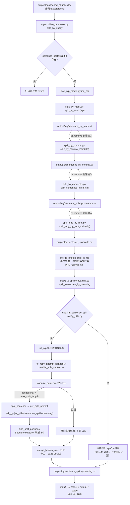

# step3 句子切分（spaCy 规则切分 + LLM 语义切分）

## 一、职责与边界

step3 把 step2 产出的**逐词**转写表 `output/log/cleaned_chunks.xlsx` 转换成**每行一句、句长受控**的纯文本 `output/log/sentence_splitbymeaning.txt`，供 step4（翻译）、step5（字幕再切分）、step6（时间轴）逐行消费。

它由两个阶段组成：`split_by_spacy`（`core/step3_1_spacy_split.py`）用 spaCy 做**无网络**的四级规则切分；`split_sentences_by_meaning`（`core/step3_2_splitbymeaning.py`）只把**仍然超长**的句子交给 LLM 按语义再切——**是否调 LLM 由 `core.config_utils.use_llm_sentence_split` 统一判定**（正常翻译模式强制开启；仅转录模式下可用 `llm_sentence_split: false` 关掉，此时直接复制 spaCy 结果，零 LLM 调用）。

不负责：时间戳对齐（step6 用文本相似度把句子重新映射回 `cleaned_chunks.xlsx` 的词级时间）、翻译、字幕行长度约束（`subtitle.max_length` 由 step5 处理）。

边界副作用：本阶段产出的 txt **不含任何时间信息**，词级时间戳在本阶段被"打散"，只能在 step6 重新匹配。

## 二、文件清单

| 文件路径 | 规模 | 主要职责 |
| --- | --- | --- |
| `core/step3_1_spacy_split.py` | ~2K | 阶段一入口 `split_by_spacy`：幂等检查 + 串联 4 个 spaCy 切分函数 + **出口守卫 `merge_broken_cuts_in_file`**（不许把词切开，2026-09-20 新增） |
| `core/step3_2_splitbymeaning.py` | ~11K | 阶段二入口 `split_sentences_by_meaning`：LLM 开关判定 + 三轮 retry + 线程池 + 语义切分 + **出口守卫**（同一个 `merge_broken_cuts`）；另含不调 LLM 的 `split_by_punctuation` 与 `split_sentences_mechanically`（**step5 已不再调用它们**，只在本阶段与仅转录模式使用） |
| `core/subtitle_split.py` | ~24K | 出口守卫的实现处：`merge_broken_cuts` / `spaCy_boundaries` / `_starts_with_particle`；另有 step5 用的 `split_at_boundaries`、`merge_short_cues`、`check_align_parts`、`strip_terminal_punctuation` |
| `core/subtitle_limits.py` | ~18K | 按语言的字幕长度档位（`resolve_limits`）——阶段二的 `max_split_length` 由它给出，不再是 `config.yaml` 里的裸值 |
| `core/spacy_utils/load_nlp_model.py` | ~1K | `init_nlp`/ `get_spacy_model`：语言 → spaCy 模型名 → 加载（缺失则下载） |
| `core/spacy_utils/split_by_mark.py` | ~2K | 第 1 步：按句末标点切分（`doc.sents`） |
| `core/spacy_utils/split_by_comma.py` | ~3K | 第 2 步：按逗号 / 冒号切分（带主谓检查） |
| `core/spacy_utils/split_by_connector.py` | ~6K | 第 3 步：按连接词切分（按语言分支的词表 + 依存规则） |
| `core/spacy_utils/split_long_by_root.py` | ~5K | 第 4 步：依存句法 root/动词切分（DP）+ 兜底等分 |
| `core/prompts_storage.py` | ~13K | `get_split_prompt`（第 7-44 行）生成 LLM 切分提示词 |
| `core/config_utils.py` | ~8K | `get_source_language`（第 143-161 行，源语言唯一判定点）、`get_joiner`（第 165-171 行）、`use_llm_sentence_split`（第 184-200 行） |

## 三、调用链与数据流

上游只有两个入口，二者调用同一对函数：

| 入口 | 调用点 |
| --- | --- |
| Streamlit 主流程 | `st.py` `step3_1_spacy_split.split_by_spacy`；`st.py` `step3_2_splitbymeaning.split_sentences_by_meaning`（同在 `step_split_sentences` 里） |
| 批处理模式 | `batch/utils/video_processor.py`-（同一对调用，包在 `split_sentences` 中） |



### 3.1 四步顺序为什么不能换

顺序在 `core/step3_1_spacy_split.py`- 被写死为 `split_by_mark` → `split_by_comma_main` → `split_sentences_main` → `split_long_by_root_main`，三条理由叠加：

| # | 理由 | 证据 |
| --- | --- | --- |
| 1 | **文件契约是线性的**：每一步只读上一步的 txt、只写自己的 txt | `split_by_comma.py` 读 `sentence_by_mark.txt`；`split_by_connector.py` 读 `sentence_by_comma.txt`；`split_long_by_root.py` 读 `sentence_splitbyconnector.txt` |
| 2 | **每一步都删除自己的输入**，顺序调换会直接 `FileNotFoundError` | `split_by_comma.py`、`split_by_connector.py`、`split_long_by_root.py` |
| 3 | **粒度是"从粗到细"的递进**，每一步的触发阈值都假设输入已被上一步粗切 | 逗号切分只看逗号左右各 ≤9 个 token 的窗口（`split_by_comma.py`-）；连接词切分要求连接词左右各 ≥5 个非标点词（`split_by_connector.py`）；root 切分只在"整句 > 60 token"时启动（`split_long_by_root.py`） |

第 3 条的直观含义：若先按逗号切，句末标点会散落在短片段里，逗号的 ±9 token 窗口会跨句（把下一句的主语误当成右侧短语的主语）；若先按 root 切，短句就再也凑不满连接词切分要求的左右各 5 个词。

## 四、关键数据结构

### 4.1 输入：`output/log/cleaned_chunks.xlsx`

| 字段 | 类型 | 单位 | 说明 |
| --- | --- | --- | --- |
| `text` | str | — | **逐词**（不是逐句）文本，写入时被包了一层双引号：`f'"{x}"'`（`core/all_whisper_methods/whisperX_utils.py`） |
| `start` | float | 秒 | 该词的起始时间（本阶段不使用） |
| `end` | float | 秒 | 该词的结束时间（本阶段不使用） |

实测本仓库当前样本 `output/log/cleaned_chunks.xlsx` 的 `dimension` 为 `A1:C23001`（1 行表头 + 23000 个词行），表头为 `text / start / end`，首个数据行是文本 `"那"`（带引号）、`start = 0.008999999999999999`、`end = 0.749`。`split_by_mark` 用 `x.strip('"')` 去引号（`core/spacy_utils/split_by_mark.py`），随后把**整段视频的所有词**拼成一个字符串（`joiner.join(chunks.text.to_list)`），一次交给 spaCy。

### 4.2 中间产物（txt 均为 UTF-8、每行一句）

| 文件路径 | 写入点 | 读取点 | 生命周期 |
| --- | --- | --- | --- |
| `output/log/sentence_by_mark.txt` | `split_by_mark.py`（循环内 写行） | `split_by_comma.py` | 读完后被 `split_by_comma.py` 删除 |
| `output/log/sentence_by_comma.txt` | `split_by_comma.py` | `split_by_connector.py` | 读完后被 `split_by_connector.py` 删除 |
| `output/log/sentence_splitbyconnector.txt` | `split_by_connector.py` | `split_long_by_root.py` | 读完后被 `split_long_by_root.py` 删除 |
| `output/log/sentence_splitbynlp.txt` | `split_long_by_root.py` | `step3_2_splitbymeaning.py` | **保留**，同时是阶段一的幂等标记 |
| `output/log/sentence_splitbymeaning.txt` | `step3_2_splitbymeaning.py`（关 LLM 的直通分支在） | 见 4.3 | **保留**，是 step3 的最终产物 |
| `output/gpt_log/sentence_splitbymeaning.json` | `core/ask_gpt.py`（`save_log`） | `core/ask_gpt.py` | 保留；LLM 缓存 |
| `output/gpt_log/error.json` | `core/ask_gpt.py` | 人工排查 | 保留；解析失败 / 校验失败的原始应答 |

三个中间文件被"消费即删除"，因此 step3_1 中途断点**无法续跑**：重跑一定从 `split_by_mark` 重新开始（要求 `cleaned_chunks.xlsx` 还在）。

### 4.3 输出：`output/log/sentence_splitbymeaning.txt`

| 属性 | 值 | 证据 |
| --- | --- | --- |
| 编码 | UTF-8 | `step3_2_splitbymeaning.py` |
| 结构 | 每行**一句**，行内可能含标点与空格，但**不再含换行** | `parallel_split_sentences` 的返回值 + `'\n'.join(sentences)` |
| 行尾 | **无**结尾换行符（最后一行后不写 `\n`） | 用 `join` 而非逐行 `write` |
| 内容 | 原语言文本，不翻译、不含 `[br]`、不含时间戳 | LLM 仅用于定位切点，`[br]` 在 `find_split_positions` 中被消费掉 |
| 顺序 | 与 `sentence_splitbynlp.txt` 同序 | `new_sentences[index]` 按索引回填（、、） |

下游消费者（改动本文件格式等于改动这些地方）：

| 消费者 | 用法 |
| --- | --- |
| `core/step4_1_summarize.py` | `SENTENCE_TXT_PATH`，`combine_chunks` 用 `readlines` 后 `' '.join(...)`，再截取前 `summary_length` 个字符 |
| `core/step4_2_translate_all.py` | `SENTENCE_SPLIT_FILE`，`file.read.strip.split('\n')`，再按 `chunk_size=600`、`max_i=10` 分块送 LLM |
| `core/step5_splitforsub.py` | 复用 `split_sentence` 做字幕级再切分 |
| `core/step6_generate_final_timeline.py` | 用文本相似度把行重新对齐到 `cleaned_chunks.xlsx` 的词级时间 |
| `st_components/imports_and_utils.py`、`batch/utils/video_processor.py` | 打包下载时作为 `<视频名>.txt` 导出（"AI 总结"用） |

## 五、逐函数/逐模块实现说明

### 5.1 `split_by_spacy` —— 阶段一入口与幂等（`core/step3_1_spacy_split.py`）

| 项 | 内容 |
| --- | --- |
| 签名 | `split_by_spacy` → `None` |
| 幂等 | `if os.path.exists('output/log/sentence_splitbynlp.txt')` 成立就打印 `File 'sentence_splitbynlp.txt' already exists. Skipping split_by_spacy.` 并 `return`（**出口守卫也因此不会跑**，见七.15） |
| 模型加载 | `nlp = init_nlp` **只调用一次**，随后 4 步与出口守卫共用同一个 `nlp` 对象 |
| 执行体 | `split_by_mark(nlp)` → `split_by_comma_main(nlp)` → `split_sentences_main(nlp)` → `split_long_by_root_main(nlp)` → `merge_broken_cuts_in_file(nlp)`（**2026-09-20 新增的最后一步**） |
| 出口守卫 | `merge_broken_cuts_in_file(nlp)`：读回 `sentence_splitbynlp.txt`，用 `subtitle_split.merge_broken_cuts(lines, lambda text: spaCy_boundaries(nlp, text))` 把"切点落在词中间"的相邻行并回去；只有行数真的变了才**就地重写**该文件并打印 `🧩 合并被切在词中的行：before → after`。开关 `subtitle.merge_broken_lines`（`load_key_or` 读，默认 `true`）；文件不存在直接返回 |
| 副作用 | 读写 `output/log/` 下 5 个文件；删除 3 个中间文件；首次运行可能触发 spaCy 模型下载 |
| 无返回值 | 函数把结果留在硬盘上，不返回句子列表 |

幂等标记的选择决定了重跑方式：删 `sentence_splitbynlp.txt`（或对 `output/log` 执行整体清理）即可让阶段一完整重跑。

### 5.2 `split_sentences_by_meaning` —— LLM 开关与三轮 retry（`core/step3_2_splitbymeaning.py`）

| 项 | 内容 |
| --- | --- |
| 签名 | `split_sentences_by_meaning` → `None` |
| 输入 | `output/log/sentence_splitbynlp.txt` 的每一行（-，`line.strip` 后丢弃空行） |
| LLM 开关 | `core.config_utils.use_llm_sentence_split`（`core/config_utils.py`）：翻译模式强制 `True`；仅转录模式读 `llm_sentence_split`。为假时把 spaCy 结果原样写出并 `return`（，**零 LLM 调用**） |
| 模型 | `nlp = init_nlp`——**本阶段第二次加载 spaCy 模型**（阶段一已加载过一次） |
| 主循环 | `limits = resolve_limits()`（`core/subtitle_limits.py`）→ 打印 `📐 字幕长度档位：…` → `for retry_attempt in range(3):`→ `parallel_split_sentences(sentences, max_length=limits.max_split_length, max_workers=load_key("max_workers"), nlp=nlp, retry_attempt=retry_attempt)`。**2026-09-20 起**：粗切上限不再直接读 `max_split_length`，而是按语言档位解析（关闭"按语言自动设置"时才是 config 里的手填值） |
| 出口守卫 | **仅 LLM 分支**（关掉 LLM 断句的那条会提前 `return`，不走守卫）：`subtitle.merge_broken_lines` 为真时 `merge_broken_cuts(sentences, lambda text: spaCy_boundaries(nlp, text))`，行数变了就打印 `🧩 合并被切在词中的行：before → after`。这里用 `load_key` 读键、**只吞 `KeyError`**（旧 `config.yaml` 缺这个键时不炸，只是不合并） |
| 输出 | `'\n'.join(sentences)` 写入 `output/log/sentence_splitbymeaning.txt`（守卫的合并结果就是被写出的内容） |
| 幂等 | **没有**文件存在检查：本函数每次调用都重跑（见七.1） |

三轮循环不是"网络重试"，而是**收敛循环**：第 1 轮只切超长句；若 LLM 没有按要求给出足够的 `[br]`（例如 `num_parts=3` 却只切了 1 刀，或答案被 `valid_split` 判为不合格），切片后仍可能超长，于是在第 2、3 轮被再次送入。3 轮是硬上限，循环结束后无论是否还超长都直接落盘。

`retry_attempt` 的唯一用途是**让重试真正重新请求**：`ask_gpt(..., bypass_cache=retry_attempt > 0)`。`bypass_cache=True` 只跳过**读取** `output/gpt_log/sentence_splitbymeaning.json`、仍然写入结果（`core/ask_gpt.py`）；历史上是靠 `prompt + ' ' * retry_attempt` 加空格改变 prompt 字符串来绕过缓存键，语义晦涩且污染日志，现已不用。

注意区分两层重试：`ask_gpt` 内部还有一层 `max_retries = 3`（`core/ask_gpt.py`），那层对**同一个** prompt 重试 3 次（校验由 `valid_def` 完成，，失败时把上一次的真实失败原因回注给模型，并把原始应答写 `output/gpt_log/error.json`）；外层三轮则由 `bypass_cache` 强制发起新请求。

### 5.3 `parallel_split_sentences` —— 线程池与提交策略

| 项 | 内容 |
| --- | --- |
| 签名 | `parallel_split_sentences(sentences, max_length, max_workers, nlp, retry_attempt=0)` → `list[str]` |
| 结果容器 | `new_sentences = [None] * len(sentences)`，按原索引回填，保证输出顺序与输入一致 |
| 取消响应 | 提交前逐句 `eu.check_cancel`；收集结果时再查一次；一旦抛出 `BaseException`（`StopTask`）就把所有未开始的 future `cancel` 后重抛，否则 `with` 退出时的 `shutdown(wait=True)` 会等排队任务跑完 |
| 线程池 | `concurrent.futures.ThreadPoolExecutor(max_workers=max_workers)`，`max_workers` 来自 `config.yaml`，当前值 **1000** |
| 计数 | `tokens = tokenize_sentence(sentence, nlp)`→ `num_parts = math.ceil(len(tokens) / max_length)` |
| 提交条件 | **只有** `len(tokens) > max_length` 才 `executor.submit(split_sentence, sentence, num_parts, max_length, index=index, retry_attempt=retry_attempt)` |
| 短路路径 | 否则 `new_sentences[index] = [sentence]`，原句原样保留，**不产生任何 LLM 调用与 token 消耗** |
| 收集 | 按提交顺序 `future.result`，成功则 `split_result.strip.split('\n')` 并逐行 `strip`，空则回退为原句 |
| 返回 | 展平：`[sentence for sublist in new_sentences for sentence in sublist]` |

`len(tokens)` 是 **spaCy 的 token 数（≈词数）**，不是字符数：`tokenize_sentence` 返回 `[token.text for token in doc]`。因此上限对中文是"约 N 个词"，对英文就是 N 个词。**2026-09-20 起**这个 N 由 `core/subtitle_limits.py` 按语言给出：中日 30 / 韩 28 / 拉丁 26 / 泰 20（兜底 26）；只有关闭「按语言自动设置」时才用 `config.yaml` 里的 `max_split_length`（历史默认 20）。

`max_workers: 1000` 意味着一个视频里所有超长句会在同一瞬间被并发提交给 LLM API（的 `for` 循环不阻塞地连续 submit）。用本地 LLM 时必须把它设为 1，`config.yaml` 的注释即为此意。

### 5.4 `split_sentence` —— 提示词、校验与字符级插入

| 项 | 内容 |
| --- | --- |
| 签名 | `split_sentence(sentence, num_parts, word_limit=18, index=-1, retry_attempt=0)` → `str`（**含 `\n` 的多行字符串**） |
| 取消响应 | 入口先 `eu.check_cancel`——单句切分内含一次 LLM 请求，放在最前面才能让"停止"及时生效 |
| 提示词 | `get_split_prompt(sentence, num_parts, word_limit)` |
| 校验 `valid_split` | 提示词要求模型给出**两个候选并自评选定**，因此校验三项：`choice` 经 `str.strip` 归一化后必须 ∈ `{"1","2"}`；必须存在键 `split{choice}`；`split{choice}` 里必须出现 `"[br]"`。任一不满足就返回 `{"status": "error", ...}` 触发 `ask_gpt` 内部重试 |
| 取值 | `response_data[f"split{str(response_data.get('choice', '')).strip}"]`——兼容模型把 `choice` 返回成数字 `1` 或带空格的 `" 2 "` |
| LLM 调用 | `ask_gpt(split_prompt, response_json=True, valid_def=valid_split, log_title='sentence_splitbymeaning', bypass_cache=retry_attempt > 0)`；缓存文件 `output/gpt_log/sentence_splitbymeaning.json` |
| 位置映射 | `split_points = find_split_positions(sentence, best_split)` |
| 插入 `\n` | 第 1 个切点：`sentence[:p] + '\n' + sentence[p:]`；第 i>0 个切点：取 `best_split` 的**最后一行**，在 `split_point - split_points[i-1]` 偏移处插入——即把"相对原句的绝对偏移"换算成"当前最后一行的行内偏移" |
| 打印 | rich `Table` 输出 `Original` / `Split` 两行，`\n` 显示为 ` \|\|`；仅日志用途 |
| `index` | 不等于 -1 时打印 `✅ Sentence {index} has been successfully split`，仅日志用途 |
| 默认值 `word_limit=18` | 阶段二总是显式传 `max_length`（= `max_split_length`），18 只对 `__main__` 里的示例调用有效——而该示例当前**已被注释** |

`get_split_prompt`（`core/prompts_storage.py`）生成的提示词要点：角色是 `professional Netflix subtitle splitter`（，语言取 `get_source_language`，），要求切成 `{num_parts}` 段、每段少于 `{word_limit}` 个词，每段最少 3 个词，"在标点或连词等自然位置切分"，并新增 `### Steps`：分析结构 → 生成两个候选 → 对比优劣 → 选择更优者。输出 JSON 是**双候选 CoT**：

```json
{
 "analysis": "Brief description of sentence structure, complexity, and key splitting challenges",
 "split1": "First splitting approach with [br] tags at split positions",
 "split2": "Alternative splitting approach with [br] tags at split positions",
 "assess": "Comparison of both approaches, highlighting their strengths and weaknesses",
 "choice": "1 or 2"
}
```

注意提示词里没有原句的行号、上下文或术语表。**提示词与 `valid_split` 必须成对修改**：只改一边会让每个长句都校验失败并重试 3 次（`tests/test_prompt_contract.py` 就是这条契约的回归防线）。

### 5.5 `find_split_positions` —— `[br]` 回映射与 0.9 告警

| 步骤 | 实现 | 行号 |
| --- | --- | --- |
| 1 | `parts = modified.split('[br]')`，对 `for i in range(len(parts) - 1)` 求切点（最后一个片段之后没有切点） |、 |
| 2 | 源语言：`language = get_source_language`，再 `joiner = get_joiner(language)` | - |
| 3 | 从左到右扫描 `for j in range(start, len(original))`，用 `original[start:j]` 与 `joiner.join(parts[i].split)` 求 `SequenceMatcher(None, ...).ratio`，取**最大**相似度对应的 `j`（严格 `>`，同分取更靠前的 `j`） | |
| 4 | `if max_similarity < 0.9:` 打印 `Warning: low similarity found at the best split point: {max_similarity}`——**只是告警，切点照用** | |
| 5 | `split_positions.append(best_split)` 且 `start = best_split`，供下一个 `[br]` 继续向后扫描 | |
| 6 | 若某个片段一个可匹配位置都没有（相似度恒为 0）则打印 `Unable to find a suitable split point for the {i+1}th part.` 且**不追加切点**（该刀丢失） | |

`modified_left = joiner.join(parts[i].split)`把 LLM 返回片段先按任意空白切分、再用该语言的 joiner 重新拼接，目的是抹掉空白差异后与原文比对。相似度阈值 0.9 的含义是：**低于 0.9 说明 LLM 返回的文本与原文不再逐字对齐**（改写了词、删了口头语、动了标点、把数字写成阿拉伯数字等），此时 argmax 得到的 `j` 只是"最像"的位置，不保证是真正的切点。

**切点漂移**（本函数最需要警惕的行为）：

1. 对中文 / 日文 `joiner == ""`，`joiner.join(parts[i].split)` 会**删掉片段内所有空格**，使 `modified_left` 比原文对应前缀短；空格越多，argmax 的 `j` 越系统性偏**左**，最终切点靠前。
2. `start = best_split` 让第 i 个切点的搜索区间起点依赖第 i-1 个结果，**一旦前一个切点偏了，后面所有切点跟着偏**（误差累积）。
3. 切点是**字符下标**，而 `split_sentence` 直接按下标插入 `\n`（-），所以偏一点就可能把英文单词或中文字符组成的词切成两半；极端情况下会切出一个空行。
4. 相似度不足 0.9 时程序不会回退（不重试、不放弃该刀），漂移只能在 step6 的时间轴对齐阶段以"文本匹配失败"的形式暴露。

## 六、关键参数与配置

| config 键（`config.yaml`） | 行号 | 当前值 | 在 step3 中的作用 |
| --- | --- | --- | --- |
| `whisper.language` | | `'zh'` | 语言来源之一；等于 `'auto'` 时才改用 `detected_language`（判定集中在 `core/config_utils.py` `get_source_language`） |
| `whisper.detected_language` | | `'zh'` | 由 step2 写入（`core/step2_whisperX.py` / → `save_language` → `update_key`，`core/all_whisper_methods/whisperX_utils.py`）；决定 joiner、spaCy 模型、提示词语言 |
| `max_split_length` | | 自动档位（中日 30 / 韩 28 / 拉丁 26；关闭自动时为 config 值，历史默认 20） | 阶段二的目标句长（spaCy token 数）；也是 `num_parts = math.ceil(len(tokens)/max_length)` 的分母；同时也是传给 LLM 的 `word_limit`。取值来源见 `core/subtitle_limits.py` |
| `max_workers` | | `1000` | `ThreadPoolExecutor(max_workers=...)`；被 step4/step5 共用同一个键 |
| `subtitle.merge_broken_lines` | | `true` | **2026-09-20 新增**：step3_1 / step3_2 出口守卫的开关（`load_key_or` / `load_key` 读）。为 `false` 时不做"切点落在词中"的合并，`フィギュアとし \| て` 这类坏切点会原样进入 step4 并放大成重复译文（见七.15） |
| `llm_sentence_split` | | `true` | 只在 `transcription_only: true` 时生效（`core/config_utils.py`）；为 `false` 时阶段二直接复制 spaCy 结果，零 LLM 调用 |
| `spacy_model_map` | - | 10 种语言 → `*_core_news_md` / `en_core_web_md` / `zh_core_web_md` | 语言 → 模型名映射，见 `03-subsystems/04-NLP切分工具.md` |
| `language_split_with_space` | - | en, es, fr, de, it, ru, ko, pt | joiner = `" "` |
| `language_split_without_space` | - | zh, ja | joiner = `""` |
| `summary_length` | | `8000` | 不属于 step3，但下游 `step4_1_summarize.py` 用它截断 step3 的产物 |
| `transcription_only` | | `true` | 决定 `use_llm_sentence_split` 是"强制开启"还是"可由 `llm_sentence_split` 关闭" |

## 七、技术要点与坑

1. **幂等只覆盖阶段一**。`split_by_spacy` 检查 `sentence_splitbynlp.txt`（`core/step3_1_spacy_split.py`），`split_sentences_by_meaning` 没有任何检查（`core/step3_2_splitbymeaning.py`），每次调用都会重新读取并覆盖 `sentence_splitbymeaning.txt`。好在第 1 轮的 prompt 与缓存键完全一致（`bypass_cache = retry_attempt > 0`，第 1 轮为 `False`），重跑基本命中 `output/gpt_log/sentence_splitbymeaning.json`，不再花钱。
2. **中间产物被消费即删除**，重跑必然从 `split_by_mark` 开始。单独执行 `python core/spacy_utils/split_by_comma.py` 会因 `output/log/sentence_by_mark.txt` 不存在而抛 `FileNotFoundError`（`split_by_comma.py`）。
3. **日志里的文件名与实际不一致**：`split_by_mark.py` 打印 `sentences_by_mark.txt`、`split_by_comma.py` 打印 `sentences_by_comma.txt`，真实文件名分别是 `sentence_by_mark.txt`、`sentence_by_comma.txt`（、）。按日志去找文件会找不到。
4. **中文样本里"标点单独成行"的合并是字节级技巧**：`split_by_mark.py`- 先 `seek(tell - 1)` 退 1 字节（即退到刚写入的 `\n` 上）再写标点。在 Windows 文本模式下写入的换行其实是 `\r\n` 两个字节，只退 1 字节会**退到 `\n` 上、留下一个 `\r`**，读回时（默认 `newline=None` 的通用换行）这个 `\r` 会被当成换行，于是"合并"变成"标点跑到下一行行首"。该分支只在某个 sent 恰好是 `[',', '.', '，', '。', '？', '！']` 之一时触发，本仓库当前样本未触发（`output/log/sentence_splitbynlp.txt` 无行首标点）。
5. **`strip("")` 是空操作**：`split_by_mark.py` 的 `x.strip('"').strip("")` 中第二个调用参数为空串，不删除任何字符（实测 `len(" a ".strip("")) == 5`），真正起作用的是 `strip('"')`。它对应 step2 写入时的 `f'"{x}"'`（`whisperX_utils.py`）。
6. **阶段二每个视频加载两次 spaCy 模型**：`core/step3_1_spacy_split.py` 与 `core/step3_2_splitbymeaning.py` 各调一次 `init_nlp`，而 `init_nlp` 内部没有任何缓存（`load_nlp_model.py`），每次都真的执行 `spacy.load(model)`。
7. **源语言解析已经统一**：`get_source_language`（`core/config_utils.py`）是唯一判定点——`whisper.language` 是明确语言码时一律以它为准，只有 `'auto'`/空 时才回退 `whisper.detected_language`，两者都不可用则抛 `ValueError("源语言未知…")`。调用方包括 `split_by_mark.py`、`split_long_by_root.py`、`step3_2_splitbymeaning.py`、`load_nlp_model.py` 与 `prompts_storage.py`。历史缺陷（提示词读 detected、侧边栏只写 language，导致"切成 en 后提示词仍说 zh、spaCy 仍加载中文模型"）已修；`st_components/sidebar_setting.py` 的语言下拉框现在也带「🌐 自动检测」。
8. **`[br]` 只用于定位，不进入产物**：`find_split_positions` 返回字符下标，LLM 返回的文本本身被丢弃（`step3_2_splitbymeaning.py`），所以产物一定是"原句的子串拼接"，不会出现 LLM 改写的内容。
9. **0.9 相似度告警不是错误**：低于阈值只打印黄字，既能出现在"LLM 规范了标点"的正常场景，也能出现在真实漂移场景。批量跑完想知道切分质量，去看 `output/log/sentence_splitbymeaning.txt` 是否出现空行、行首标点、单词被截断，而不是看这个告警。
10. **行长约束是 best-effort**：三轮循环结束后不再校验，LLM 不配合时 `sentence_splitbymeaning.txt` 里仍可能有明显长于 `max_split_length` 的行（这也是 step5 还要做一次字幕级切分的原因）。
11. **整段视频一次性喂给 spaCy**：`split_by_mark.py` 把所有词拼成一个字符串后 `nlp(input_text)`。spaCy 3.7.4（`requirements.txt`）默认 `nlp.max_length = 1000000` 字符，超长视频的拼接文本一旦越界会抛 `[E088] Text of length ... exceeds maximum`。
12. **`assert doc.has_annotation("SENT_START")`**（`split_by_mark.py`）要求模型带句法分析（parser/senter）。换成无 parser 的模型（如 `*_sm` 精简模型或自定义模型）时 `doc.sents` 会直接报错；`python -O` 运行时该断言被跳过，错误会更晚、更难懂。
13. **改提示词必须同步改校验**：`get_split_prompt` 的双候选契约（`split1`/`split2`/`choice` + `[br]`）与 `valid_split`（`step3_2_splitbymeaning.py`）是一对；只改提示词会让每个长句都校验失败并按 `ask_gpt` 的 `max_retries` 重试，token 成本翻几倍。
14. **"停止"在断句阶段也能及时生效**：`split_sentence` 入口、`parallel_split_sentences` 的提交循环与结果收集循环都插了 `eu.check_cancel`（`step3_2_splitbymeaning.py`），并在取消时 `cancel` 掉尚未开始的 future。这一段由提交 `d9aae68` 补齐，早于它的文档只提"每段重新加载模型"的耗时，不提取消语义。
15. **"不许把词切开"的出口守卫（2026-09-20 新增，`subtitle.merge_broken_lines`）**：事故链条是"step3_1 是**纯规则切分、没有提示词**→ 把 `…そのキャラクターやイラストの魅力を探り、フィギュアとし | てその…` 从「として」中间劈开 → step4 只能把两个半句**各自翻译完整** → 出现"…同时注重这一点" + "同时也注重…" 的重复译文"。提示词改不动这一层，所以在两个阶段各自用 spaCy token 边界做出口校验（`subtitle_split.merge_broken_cuts` + `spaCy_boundaries`）：拼接点必须是合法切点，否则两行并回一行；下一行以日语助词/接续开头（`_LEADING_PARTICLES`：`て/で/に/を/は/が/と/も/…`）时**无条件**判为坏切点。三条必须记住的边界条件：
    - **阶段一的守卫只在"本次真的跑了 4 步切分"时执行**（它在 `split_by_spacy` 里、幂等 `return` 之后）；已有 `sentence_splitbynlp.txt` 时不会补跑，要让守卫生效得删掉该文件重跑阶段一。
    - **阶段二只在 LLM 分支执行**：`llm_sentence_split: false`（仅转录模式）那条直通分支照样提前 `return`。
    - 合并会**减少行数**，因此 `sentence_splitbymeaning.txt` 的行数与 `sentence_splitbynlp.txt` 可能不同（正常，step6 是按文本重新对齐的，不依赖行数一一对应）。
16. **守卫的判定是"保守"的**：`merge_broken_cuts` 拿不到边界信息（`boundary_offsets` 抛异常）时**不动**（宁可少并）；并法是**贪心累加**——一旦把下一行并回 `result[-1]`，这个"合并后的行"还能继续吸收再下一行（有可能并出 3 行以上的一条），但**不回溯**已输出的行。它拦的是"切点在词里"，不拦"切点虽在 token 边界但语义被劈开"——后者要靠 `get_split_prompt` 的规则与 step5 的对齐校验。回归用例：`tests/test_subtitle_split.py`（`merge_broken_cuts` 的 5 组，含"拿不到边界就不动"与"任意位置都合法切点"两种极端）。

## 八、扩展点

| 需求 | 改哪里 | 注意 |
| --- | --- | --- |
| 改变"粗切"的粒度（让每个句子更长/更短） | 自动档位见 `core/subtitle_limits.py`（中日 30 / 韩 28 / 拉丁 26 / 泰 20）；要手调得先在**侧边栏**的「✂️ 字幕长度调节」（`st_components/sidebar_setting.py`）里**关掉「按语言自动设置」**，再改 `config.yaml` 的 `max_split_length` | 它同时是 LLM 的 `word_limit` 和 `num_parts` 的分母；调小会让 step4 的翻译上下文变碎，调大会让 step5/step6 的对齐变难。⚠️ 仅转录模式关掉 LLM 断句时它不参与 |
| 换 spaCy 模型 / 加语言 | `config.yaml`- `spacy_model_map` | 细节见 `../03-subsystems/04-NLP切分工具.md` 第八节 |
| 加语言但不想改 py 代码 | `config.yaml`- 两个 joiner 列表 | 不在任一列表里的语言会在 `get_joiner` 抛 `ValueError`（`core/config_utils.py`） |
| 让 LLM 切分更守规矩（减少三轮重试） | `core/prompts_storage.py`- `get_split_prompt` | 不要改动 JSON 键名 `split1`/`split2`/`choice` 与 `[br]` 约定，二者是 `valid_split`（`step3_2_splitbymeaning.py`）与 `find_split_positions` 的硬契约；改动后要同步 `tests/test_prompt_contract.py` |
| 降低 0.9 的误报 / 提高映射可靠性 | `core/step3_2_splitbymeaning.py` 阈值、 的归一化方式 | 阈值只影响告警文案，不改切点；真正能减少漂移的是改 的归一化（例如保留空格差异、或改用 token 级对齐） |
| 控制并发 / 成本 | `config.yaml` `max_workers` | 本地 LLM 设为 1；该键被 step4/step5 共用 |
| 只转录时省掉全部断句 token | `config.yaml` `llm_sentence_split: false` | 只在 `transcription_only: true` 下生效（`core/config_utils.py`）；此时用 `split_by_punctuation`（`step3_2_splitbymeaning.py`）按标点就近断开 |
| 关掉"不许把词切开"的出口守卫 | `config.yaml` `subtitle.merge_broken_lines: false` | 只在排查"是不是守卫并错了行"时临时关掉；关掉后坏切点会进 step4 被翻译成重复内容（见七.15）。守卫本体是 `core/subtitle_split.merge_broken_cuts`，改判定要同步 `tests/` |
| 断点续跑优化 | `core/step3_1_spacy_split.py`、`core/spacy_utils/*.py` 中 3 处 `os.remove` | 现状是"消费即删除"，若想去掉 `os.remove` 让中间产物留存，注意 `split_by_comma_main` 等函数是覆盖写（`w` 模式），重复执行会得到同内容文件 |
| 减少一次模型加载 | `core/step3_2_splitbymeaning.py` | 可由 `st.py`- 的调用方把 step3_1 的 `nlp` 传进来，或给 `init_nlp` 加缓存（`core/spacy_utils/load_nlp_model.py`） |
| 换掉 spaCy 阶段（例如全交给 LLM） | `core/step3_1_spacy_split.py`- | 阶段二只读 `sentence_splitbynlp.txt`（`step3_2_splitbymeaning.py`），只要保证该文件存在且每行一句，就可以整体替换阶段一 |

> 💡 建议：新增语言时把 `whisper.detected_language` 与 `whisper.language` 一起改，避免第 7 条描述的"joiner 与模型语言不一致"。

## 九、验证方式

工作目录必须是仓库根（代码里全是 `output/log/...` 相对路径），且依赖已安装（`requirements.txt` `spacy==3.7.4` 及对应语言模型）。

```powershell
# 1) spaCy 模型是否就绪（缺模型时 init_nlp 会自动 pip 下载）
python -c "import spacy; print(spacy.__version__, spacy.util.get_installed_models)"

# 2) 只跑阶段一（有 sentence_splitbynlp.txt 时会直接打印跳过）
python core/step3_1_spacy_split.py

# 3) 只跑阶段二（读 sentence_splitbynlp.txt，写 sentence_splitbymeaning.txt）
python core/step3_2_splitbymeaning.py
```

想让阶段一真正重跑，先删掉幂等标记（或整体归档 `output/log`）：

```powershell
Remove-Item output/log/sentence_splitbynlp.txt
python core/step3_1_spacy_split.py
```

`output/log` 的整体归档走 `core/onekeycleanup.py`-（把 `output/log/*` 移到 `history/<视频名>/log/`），可用于"清空重跑"。

观察被删除的中间产物（不重跑阶段二），单个函数独立调用：

```python
# 在仓库根目录执行；注意必须在 split_by_spacy 之前运行，否则输入文件已被删除
from core.spacy_utils.load_nlp_model import init_nlp
from core.spacy_utils.split_by_mark import split_by_mark
split_by_mark(init_nlp) # 读 cleaned_chunks.xlsx -> 写 sentence_by_mark.txt
```

校验产物是否满足 `max_split_length`（复现阶段二的判据）：

```python
from core.spacy_utils.load_nlp_model import init_nlp
from core.step3_2_splitbymeaning import tokenize_sentence
from core.config_utils import load_key
nlp = init_nlp
limit = load_key("max_split_length")
lines = open('output/log/sentence_splitbymeaning.txt', encoding='utf-8').read.split('\n')
over = [(i, len(tokenize_sentence(l, nlp)), l) for i, l in enumerate(lines)]
over = [x for x in over if x[1] > limit]
print(f"总行数 {len(lines)}，超长行 {len(over)}")
for i, n, l in over[:5]:
 print(i, n, l[:60])
print("空行数:", sum(1 for l in lines if not l.strip))
```

`output/gpt_log/sentence_splitbymeaning.json` 是排查看不到"LLM 到底回了什么"的入口（每次成功应答一条，含 `model/prompt/response`，`core/ask_gpt.py`）；解析失败/校验失败的原始应答在 `output/gpt_log/error.json`（`core/ask_gpt.py`）。

检查"有没有被切在词中"（复现出口守卫的判据；需要 spaCy 模型与产物都在）：

```powershell
# 直接重跑一次守卫，看它还想并几行：打印 before → after（不改文件）
python -c "from core.spacy_utils.load_nlp_model import init_nlp; from core.subtitle_split import merge_broken_cuts, spaCy_boundaries; nlp=init_nlp(); lines=[l.rstrip('\n') for l in open('output/log/sentence_splitbymeaning.txt', encoding='utf-8')]; kept=merge_broken_cuts(lines, lambda t: spaCy_boundaries(nlp, t)); print('before', len(lines), 'after', len(kept))"
```

若 `after` 明显小于 `before`，说明 `sentence_splitbymeaning.txt` 是**旧产物**（守卫上线前生成的）——删掉它与 `sentence_splitbynlp.txt` 重跑 step3 即可让守卫生效。

> 本节命令与代码片段基于源码静态确认，未在本机执行：当前 `python` 环境未安装 spaCy（`import spacy` → `ModuleNotFoundError`）。

## 十、相关文档

- 上游：[`02-语音识别ASR.md`](02-语音识别ASR.md)（step2 产出 `cleaned_chunks.xlsx` 与 `whisper.detected_language`）
- 流水线定位：[`00-流水线总览.md`](00-流水线总览.md)
- 下游：[`04-术语总结与翻译.md`](04-术语总结与翻译.md)（step4 读 `sentence_splitbymeaning.txt`）
- 下游：[`05-字幕切分与时间轴.md`](05-字幕切分与时间轴.md)（step5 复用 `split_sentence`，step6 重新对齐时间）
- 子系统详解：[`../03-subsystems/04-NLP切分工具.md`](../03-subsystems/04-NLP切分工具.md)（`core/spacy_utils/` 逐函数说明）
- LLM 与提示词：[`../03-subsystems/01-LLM调用与提示词.md`](../03-subsystems/01-LLM调用与提示词.md)（`ask_gpt` 缓存与重试）
- 配置说明：[`../04-interfaces/01-配置文件与参数.md`](../04-interfaces/01-配置文件与参数.md)
- 全局产物清单：[`../00-overview/02-数据流与中间产物.md`](../00-overview/02-数据流与中间产物.md)
- 写作规范：[`../_meta/写作模板.md`](../_meta/写作模板.md)
