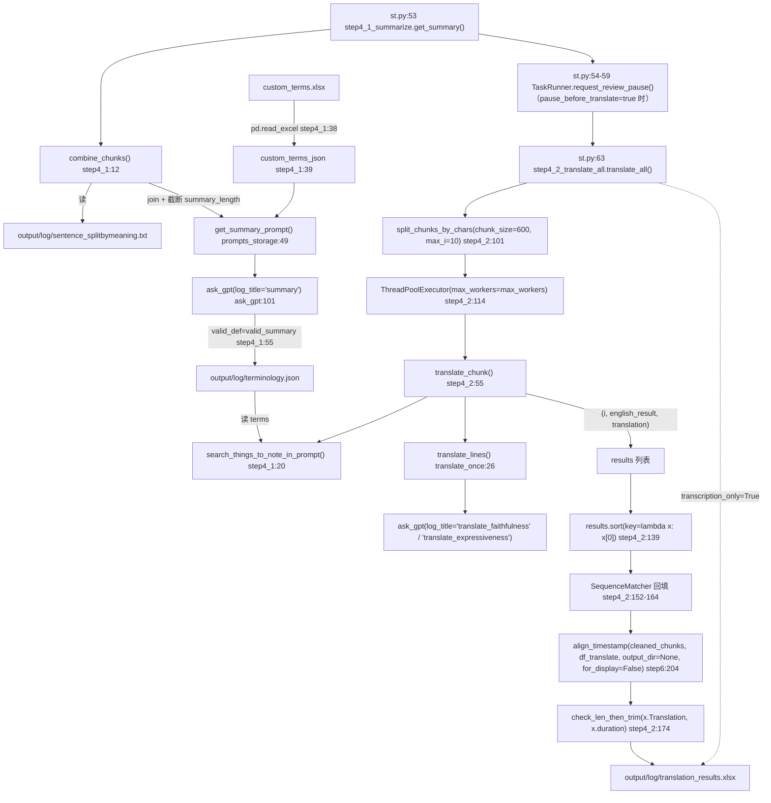

# step4：术语总结与翻译

## 一、职责与边界

step4 把 step3 切好的「句子级源文」变成「句子级译文」，并生成一份全局术语表供翻译时注入上下文。

- **负责**：① 汇总全文（前 N 字符）让 LLM 抽取主题与术语 → `output/log/terminology.json`（主题键统一为 `topic`，见 §4.1）；② 把句子切成 ~600 字符的块，多线程调用 LLM 两阶段翻译（faithful → expressive）；③ 把并发返回的译文按 chunk 下标排序后再用源文相似度回填；④ 复用 step6 的 `align_timestamp()` 给每句译文补上起止时间与 `duration`，并对超时长的句子做 trim；⑤ 产出 `output/log/translation_results.xlsx`。
- **不负责**：不做 ASR（step2）、不做句子切分（step3）、不做字幕二次切分与最终 SRT（step5/step6）、不做时长估算本身（被复用的 `check_len_then_trim()` 已独立到 `core/subtitle_trim.py`）。
- `transcription_only=True` 时 step4 退化为直通模式：不调用 LLM，源文即译文，仍然产出 `translation_results.xlsx`（列比正常模式少）。

## 二、文件清单

| 文件路径 | 行数 | 主要职责 |
| --- | --- | --- |
| `core/step4_1_summarize.py` | 79 | `combine_chunks()`(:12) / `search_things_to_note_in_prompt()`(:20) / `get_summary()`(:36)，产出 `terminology.json` |
| `core/step4_2_translate_all.py` | 189 | `translate_all()`(:67) 主流程：分块、并发（含暂停/停止响应）、结果回填、时间轴对齐、trim、落盘 |
| `core/translate_once.py` | 119 | `translate_lines()`(:26)：单块两阶段翻译，含行数一致性重试 |
| `core/prompts_storage.py` | 330 | `get_summary_prompt()`(:49)、`generate_shared_prompt()`(:121)、`get_prompt_faithfulness()`(:137)、`get_prompt_expressiveness()`(:182)、`get_subtitle_trim_prompt()`(:291) |
| `core/ask_gpt.py` | 226 | `ask_gpt()`(:101)：JSON 修复、`valid_def` 校验、`output/gpt_log/*.json` 缓存（含 `bypass_cache`）与重试 |
| `core/config_utils.py` | 242 | `load_key()`(:75) / `get_source_language()`(:143) |
| `core/subtitle_trim.py` | 62 | 被 step4.2 复用的 `check_len_then_trim()`(:17)，依赖 `speed_factor.max` 与 estimator |
| `core/step6_generate_final_timeline.py` | 324 | 被 step4.2 复用的 `align_timestamp()`(:204) |
| `st.py` | 377 | UI 编排：`step_summarize()`(:52) → `pause_before_translate` 暂停点(:54-59) → `step_translate_and_burn()`(:62) |
| `config.yaml` | 242 | `summary_length` / `max_workers` / `min_trim_duration` / `transcription_only` / `target_language` 等 |

## 三、调用链与数据流



数据流（文件级）：

```text
output/log/sentence_splitbymeaning.txt
        │  combine_chunks() → 前 summary_length 字符
        ▼
   get_summary_prompt() + custom_terms.xlsx ──ask_gpt──▶ output/log/terminology.json
        │
        │  逐 chunk 命中术语（search_things_to_note_in_prompt）
        ▼
   translate_lines() ──▶ results[(i, 源文, 译文)]
        │  SequenceMatcher 回填
        ▼
   df_translate{Source, Translation}
        │  align_timestamp(df_text=cleaned_chunks.xlsx, for_display=False)
        ▼
   df_time{Source, Translation, timestamp, duration} ──▶ output/log/translation_results.xlsx
```

## 四、关键数据结构

### 4.1 `output/log/terminology.json`

```json
{
    "topic": "两句话的主题总结（见下方 ⚠️ 键名说明）",
    "terms": [
        { "src": "源语言术语", "tgt": "目标语言译法", "note": "简短解释" }
    ]
}
```

| 字段 | 类型 | 来源 | 说明 |
| --- | --- | --- | --- |
| `terms[].src` | str | LLM（`valid_summary` 强制要求存在，`core/step4_1_summarize.py:56`） | 术语原文，命中判定用小写子串匹配 |
| `terms[].tgt` | str | LLM / `custom_terms.xlsx` 第 2 列 | 目标语言译法 |
| `terms[].note` | str | LLM / `custom_terms.xlsx` 第 3 列 | 简短解释 |
| `topic` | str | LLM | 顶层总结键。提示词要求输出 `topic`（`core/prompts_storage.py:84`），`valid_summary` 不校验该键，因此 `get_summary()` 会在缺键时补 `''`（`core/step4_1_summarize.py:69-71`）——**写入前保证该键一定存在**；step4.2 读的也是 `topic`（`core/step4_2_translate_all.py:105`），直通模式下 `st.py:92` 手写的同样是 `{"topic": "", "terms": []}`。历史上 step4.2 读的是 `'theme'`（导致主题上下文恒为 `None`），现已统一为 `topic`，**不要**照抄上游 3.x 的 `theme` 改名 |

落盘：`json.dump(summary, f, ensure_ascii=False, indent=4)`（`core/step4_1_summarize.py:73-74`）；无幂等检查，每次调用都覆盖重写。

### 4.2 `output/log/translation_results.xlsx`

列名由 DataFrame 构造顺序决定，`index=False` 落盘：

| 运行模式 | 列顺序 | 列含义 |
| --- | --- | --- |
| 正常模式（`:169-177`） | `Source`, `Translation`, `timestamp`, `duration` | `timestamp` 是 **SRT 字符串**（如 `00:00:01,000 --> 00:00:02,500`，由 `align_timestamp` 在 `core/step6_generate_final_timeline.py:225` 转换）；`duration` 是 float 秒 |
| `transcription_only=True`（`:92-95`） | `Source`, `Translation` | **没有** `timestamp` / `duration` 列 |

> 注意：**不存在** `start` / `end` 独立列。`align_timestamp()` 内部先产生 `(start, end)` 元组与 `duration`（`core/step6_generate_final_timeline.py:215-216`），随后把 `timestamp` 列就地改写成 SRT 字符串（`:225`），所以 Excel 里只看得到合并后的 `timestamp`。

### 4.3 其它内存结构

| 名称 | 位置 | 结构 |
| --- | --- | --- |
| `chunks` | `core/step4_2_translate_all.py:101` | `list[str]`，每项是多行源文（行以 `\n` 分隔） |
| `results` | `:120-139` | `list[tuple[int, str, str]]` = `(chunk 下标, 源文, 译文)`，源文来自 `translate_lines()` 的第二个返回值；`as_completed` 收集后按 `r[0]` 排序 |
| `df_text` | `:167-168` | `cleaned_chunks.xlsx` 的 DataFrame，列 `text`/`start`/`end`，`text` 去掉包裹的双引号 |
| `df_translate` | `:169` | `Source` = chunk 的所有行；`Translation` = 匹配到的译文按 `\n` 展开 |

`cleaned_chunks.xlsx` 实测（仅作示例的取数验证，非代码推断）：列为 `text`/`start`/`end`，第 1 行为表头，word 级，`text` 形如 `"那"`（带双引号、中文逐字）。

## 五、逐函数/逐模块实现说明

### 5.1 `core/step4_1_summarize.py`

| 函数 | 签名 | 关键实现 | 副作用 / 异常 |
| --- | --- | --- | --- |
| `combine_chunks()` | `()` → `str` | 读 `SENTENCE_TXT_PATH`（`output/log/sentence_splitbymeaning.txt`），逐行 `strip()` 后用**硬编码空格** `' '.join(...)` 拼接；`[:load_key('summary_length')]` 只取前 N 字符（`:18`，注释 `#! Return only the first x characters` 标为刻意设计） | 纯读；文件缺失 → `FileNotFoundError` |
| `search_things_to_note_in_prompt(sentence)` | `(sentence: str)` → `str \| None` | 读 `terminology.json`；`things_to_note_list = [t['src'] for t in terms if t['src'].lower() in sentence.lower()]`（`:24`）——**大小写不敏感的子串匹配**；命中后重新遍历全部 terms，用 `term['src'] in things_to_note_list` 精确（区分大小写）过滤，拼成 `序号. "src": "tgt", meaning: note` 多行文本；无命中返回 `None`（`:34`） | 读文件；`things_to_note_list` 非空但 `terms` 中 `src` 大小写与列表不一致时会出现「列表有、输出为空」的边界情况 |
| `get_summary()` | `()` → `None` | ①`combine_chunks()`；②`pd.read_excel(custom_terms.xlsx)` → `row.iloc[0]/[1]/[2]` 映射为 `src/tgt/note`（`:38-48`，**按列位置而非列名**）；③`len(custom_terms) > 0` 时打印术语内容（`:49-51`）；④`get_summary_prompt(src_content, custom_terms_json)`（`:52`）；⑤`ask_gpt(..., response_json=True, valid_def=valid_summary, log_title='summary')`（`:64`）；⑥`summary['terms'].extend(custom_terms_json['terms'])`（`:65-68`）；⑦缺 `topic` 时补空串（`:69-71`）；⑧`json.dump` 到 `terminology.json`（`:73-74`） | 写 `terminology.json`；`custom_terms.xlsx` **必须存在**（无存在性判断 → `FileNotFoundError`） |
| `valid_summary(response_data)` | 内部函数 | 仅要求 `'terms' in response_data`，且每个 term 同时含 `{'src','tgt','note'}`（`:55-62`）；返回 `{'status': 'error'\|'success', 'message': ...}` 供 `ask_gpt` 判断 | `status != 'success'` 时由 `ask_gpt` 写入 `output/gpt_log/error.json` 并重试（`core/ask_gpt.py:201-215`） |

`custom_terms.xlsx` 列含义（由 `:39-47` 的 `row.iloc[0..2]` 反推，**列名无关**）：

| 列序 | 语义 | 映射字段 |
| --- | --- | --- |
| 第 1 列 | 源语言术语 | `src` |
| 第 2 列 | 目标语言译法 | `tgt` |
| 第 3 列 | 解释 / 备注 | `note` |

### 5.2 `core/step4_2_translate_all.py`

| 函数 | 签名 | 关键实现 | 副作用 / 异常 |
| --- | --- | --- | --- |
| `split_chunks_by_chars` | `(chunk_size, max_i)` → `list[str]` | 读 `output/log/sentence_splitbymeaning.txt`，按行累加；当 `len(chunk)+len(sentence+'\n') > chunk_size` **或** `sentence_count == max_i` 时切块（`:38`），最后再 `append` 尾块（`:45`）。以「行」为最小切分单位，不会拆开单行。两个参数都是**必填**（默认值 400/8 已删除） | 纯读 |
| `get_previous_content` | `(chunks, chunk_index)` → `list[str] \| None` | `chunks[i-1].split('\n')[-3:]`，**前 3 行**；首块返回 `None`（`:50`） | 纯内存 |
| `get_after_content` | `(chunks, chunk_index)` → `list[str] \| None` | `chunks[i+1].split('\n')[:2]`，**后 2 行**；末块返回 `None`（`:52`） | 纯内存 |
| `translate_chunk` | `(chunk, chunks, theme_prompt, i)` → `(i, english_result, translation)` | 组装三件上下文（术语命中 / 前 3 行 / 后 2 行），调 `translate_lines()`；`english_result` 实际上就是传入的 `chunk` 原文 | 网络请求（经 `ask_gpt`） |
| `similar` | `(a, b)` → `float` | `SequenceMatcher(None, a, b).ratio()`（`:63-64`） | — |
| `translate_all` | `()` → `None` | 见 5.3 两条分支 | 写 `translation_results.xlsx` |

### 5.3 `translate_all()` 的两条分支

**分支 A：直通模式（`transcription_only=True`，`core/step4_2_translate_all.py:76-97`）**

| 步骤 | 位置 | 说明 |
| --- | --- | --- |
| 打印提示 | `:77` | `⏩ Transcription-only mode: Skipping translation...` |
| 读源文 | `:80-81` | `sentence_splitbymeaning.txt` → `sentences` |
| 源文当译文 | `:84-85` | `src_text = sentences`；`trans_text = sentences.copy()` |
| 读 cleaned_chunks | `:88-89` | `df_text = pd.read_excel(CLEANED_CHUNKS_FILE)` 并去引号——**该变量在本分支后续从未被使用（死代码），但文件不存在时仍会抛 `FileNotFoundError`** |
| 落盘 | `:92-95` | `pd.DataFrame({'Source': src_text, 'Translation': trans_text}).to_excel(..., index=False)`，**无** `timestamp`/`duration` |

**分支 B：正常翻译（`:99-178`）**

| 步骤 | 位置 | 说明 |
| --- | --- | --- |
| 分块 | `:101` | `split_chunks_by_chars(chunk_size=600, max_i=10)`——两个参数都是必填（旧版函数默认值 `400/8` 与调用处的 `500/10` 不一致，已把默认值删除）；**600** 是本次合并由 500 调上来的，目的是减少跨块上下文断裂 |
| 取主题 | `:104-105` | `theme_prompt = json.load(terminology.json).get('topic')`，与提示词键名一致，见 4.1 |
| 并发 | `:108-135` | `ThreadPoolExecutor(max_workers=load_key("max_workers"))`（当前 config 为 1000）；`executor.submit(translate_chunk, chunk, chunks, theme_prompt, i)`；`as_completed` 循环里**先 `eu.check_cancel()`**（`:124`，暂停时阻塞、停止时抛 `StopTask`）再 `future.result()`；一旦抛出 `BaseException` 就把**尚未开始**的 future 全部 `cancel()` 后重抛（`:127-135`），否则 `with` 退出时的 `shutdown(wait=True)` 会等排队中的 chunk 跑完 |
| 排序 | `:139` | `results.sort(key=lambda x: x[0])`——把 `as_completed` 的随机顺序还原为 chunk 下标顺序，避免内容完全相同的重复 chunk 因顺序不同而选到不同的那一份 |
| 回填 | `:152-164` | 对每个 chunk，用 `SequenceMatcher` 找最相似的结果；`< 0.9` 抛 `ValueError`，`< 1.0` 打印告警 |
| 对齐 | `:167-171` | 重新读 `cleaned_chunks.xlsx` 去引号；`align_timestamp(df_text, df_translate, [('trans_subs_for_audio.srt', ['Translation'])], output_dir=None, for_display=False)` |
| 裁剪 | `:174` | 仅当 `x['duration'] > load_key("min_trim_duration")`（当前 3.5 秒）才调 `check_len_then_trim(x['Translation'], x['duration'])` |
| 落盘 | `:177` | `df_time.to_excel(TRANSLATION_RESULTS_FILE, index=False)` |

### 5.4 复用的外部函数

| 函数 | 位置 | 被谁复用 | 语义 |
| --- | --- | --- | --- |
| `translate_lines(lines, previous_content_prompt, after_cotent_prompt, things_to_note_prompt, summary_prompt, index=0)` | `core/translate_once.py:26`（注意形参拼写为 `after_cotent_prompt`） | `translate_chunk` | 入口先 `eu.check_cancel()`（`:30`）；返回 `(translate_result, lines)`；两阶段：`get_prompt_faithfulness` 必做，`reflect_translate=True` 时再做 `get_prompt_expressiveness`；行数不一致时最多重试 3 次（`:41-51`，第 2 次起 `bypass_cache=retry > 0` 真正重新请求），最终不一致则 `ValueError`（`:94-96`）。**第二个返回值就是传入的 `lines`**（`:75` 与 `:98`） |
| `align_timestamp(df_text, df_translate, subtitle_output_configs, output_dir, for_display=True)` | `core/step6_generate_final_timeline.py:204` | step4.2 与 step6 | `output_dir=None` 时不写任何文件，只返回带 `timestamp`/`duration` 的 DataFrame；step4.2 传 `for_display=False`，因而不做「中文逗号句号替换为空格」的美化（`:228-229`） |
| `check_len_then_trim(text, duration)` | `core/subtitle_trim.py:17` | step4.2 | 用 `estimate_duration(text, ESTIMATOR) / speed_factor['max']` 估算朗读时长；**超过 `duration` 才**走 LLM 裁剪（`get_subtitle_trim_prompt`，`log_title='subtitle_trim'`），LLM 失败时回退为「去标点」（`:51-53`）。首次调用会 `init_estimator()` 并缓存到模块级 `ESTIMATOR` |

## 六、关键参数与配置

| config 键 | 当前值 | 位置 | 在 step4 中的作用 |
| --- | --- | --- | --- |
| `summary_length` | `8000` | `config.yaml:110` | `combine_chunks()` 截断的**字符数**上限 |
| `transcription_only` | `true` | `config.yaml:34` | `true` 时 step4.2 直通、跳过所有 LLM 翻译；`st.py:71-80` 同时跳过 step4.1 并补一份空的 `terminology.json` |
| `max_workers` | `1000` | `config.yaml:113` | 翻译线程池大小；注释建议本地 LLM 时设为 1 |
| `min_trim_duration` | `3.5` | `config.yaml:174` | step4.2 调用 `check_len_then_trim` 的 duration 阈值（秒） |
| `target_language` | `'简体中文'` | `config.yaml:31` | 写入 summary / faithfulness / expressiveness 提示词 |
| `reflect_translate` | `true` | `config.yaml:118` | 是否执行第二阶段 expressive 翻译 |
| `pause_before_translate` | `false` | `config.yaml:121` | 人工介入开关，见第七节 7.4 |
| `api.*` | `deepseek-flash` | `config.yaml:5-8` | `ask_gpt` 使用；模型需在 `llm_support_json` 中才启用 `response_format=json_object`（`core/ask_gpt.py:140`） |
| `whisper.language` / `whisper.detected_language` | `'zh'` / `'zh'` | `config.yaml:46-47` | summary/faithfulness/expressiveness 里的 `src_lang`，经 `core/config_utils.get_source_language()`（`:143`）解析 |
| `speed_factor.max` | `1.4` | `config.yaml:170` | `check_len_then_trim` 估算时长的除数 |

## 七、技术要点与坑

### 7.1 结果回填的对齐算法：并发 + 相似度匹配的隐式契约

回填代码（`core/step4_2_translate_all.py:152-164`）逐个 chunk 与**全部** results 做相似度比较：

```python
chunk_text = ''.join(chunk_lines).lower()
matching_results = [(r, similar(''.join(r[1].split('\n')).lower(), chunk_text)) for r in results]
best_match = max(matching_results, key=lambda x: x[1])
```

| 事实 | 依据 | 结论 |
| --- | --- | --- |
| `r[1]` 是该结果的**源文**，且 `translate_lines()` 的第二个返回值就是传入的 `lines` | `core/step4_2_translate_all.py:59`、`core/translate_once.py:75`/`:98` | 对「属于本 chunk 的那条结果」，`''.join(r[1].split('\n')).lower()` 与 `chunk_text` **逐字符相同**，`ratio()` 必然为 `1.0` |
| `max()` 取比值最大者，本 chunk 自己的结果必然在其中 | `:153-155` | `best_match[1] < 0.9` 抛错分支（`:158-160`）与 `< 1.0` 告警分支（`:161-162`）**在现有代码路径下不可达**，属防御性代码；只有 `translate_lines` 的返回值语义被改动后才会生效 |
| `results.sort(key=lambda x: x[0])` | `:139` | **不是冗余**：`as_completed` 的返回顺序随机，而 `max()` 平局时取最先出现的元素；先按下标排序后，重复 chunk 的选择结果才是确定的（本次合并新增，移植自上游 `5e4c143`） |
| 同一 `Source` 出现两次（重复句/重复 chunk） | `:155` `max()` 平局取**最先出现**的元素 | 排序后两处都会命中下标较小的那条结果 → 可能拿到「另一处」的译文；因为两条源文完全相同，不会抛异常、也拿不到告警，属**静默错配**（实践概率低） |
| 一个 future 抛异常 | `:122-126` `future.result()` 会重新抛出 | 异常在 `as_completed` 循环内直接向上传播，`results` 不完整 → `translate_all()` 整体失败；**不存在「部分失败仍继续回填」**。同循环里的 `eu.check_cancel()`（`:124`）让"停止"能在 chunk 边界生效，取消时还会把未开始的 future `cancel()`（`:127-135`） |
| 回填后行数守恒 | `:164` `trans_text.extend(best_match[0][2].split('\n'))` + `translate_lines` 的行数校验（`:47`、`:94-96`） | `src_text` 与 `trans_text` 行数一致，`pd.DataFrame` 不会因长度不等而报错 |

> 💡 建议：如果要重构，直接 `results_by_index = {r[0]: r for r in results}` 按 `i` 取回即可，可省掉双重 `SequenceMatcher` 的 O(n²) 比较；保留相似度校验时，应把它改成「断言自匹配 ratio == 1.0」而不是用于选择。

### 7.2 `combine_chunks()` 的截断是刻意的取舍

`combined_text[:load_key('summary_length')]`（`core/step4_1_summarize.py:18`，带 `#!` 标记）只取**前 8000 个字符**（含 `' '.join` 补的空格）。

- 后果：长视频（例如 1 小时）的术语表**只覆盖开头部分**，后段专有名词不会被抽取；`custom_terms.xlsx` 是唯一的补充手段（会被无条件 `extend` 进 `terms`）。
- 后果：`' '.join(cleaned_sentences)` 用的是硬编码空格，而不是 `get_joiner(language)`，中文会被插入多余空格并占用字符预算——只是提示词层面的观感问题。
- 调大 `summary_length` 会线性增加 summary 请求的 token 成本。

### 7.3 术语注入点的隐性行为

| 现象 | 位置 | 说明 |
| --- | --- | --- |
| 子串匹配误命中 | `:24` | `term['src'].lower() in sentence.lower()` 是无边界子串匹配：术语 `AI` 会命中 `said`、`again`、`wait` 等词；中文短词（如「我」）命中面更大 |
| 序号不连续 | `:26-31` | 输出行的序号来自 `enumerate(things_to_note['terms'])`（**全量** terms），过滤后可能只剩 `3. "xxx"...` 这样的孤行 |
| 空术语表也注入标题 | `core/prompts_storage.py:55-59` | `custom_terms_json` 恒为**非空 dict**（即使 `terms` 为空列表，dict 仍为真值），所以 `### Existing Terms` 段总会出现在 prompt 里 |
| 重复术语 | `core/step4_1_summarize.py:65-68` | 「排除已有术语」只靠 prompt 约束，代码不查重；LLM 若忽略约束，`terms` 里会出现同 `src` 的多条，`search_things_to_note_in_prompt` 会重复输出 |
| `None` 被写进 prompt | `core/step4_2_translate_all.py:56-59` → `core/prompts_storage.py:121-135` | `previous_content_prompt`/`after_content_prompt`/`things_to_note_prompt` 为 `None` 时，f-string 会把它渲染成字面量 `None`（首/末块的 `<previous_content>` 段就是 `None`）。这是既有行为，不是异常 |

### 7.4 `pause_before_translate` 的人工介入点（已改为后台任务暂停）

```python
# st.py:52-59
def step_summarize():
    step4_1_summarize.get_summary()
    if load_key("pause_before_translate"):
        TaskRunner.request_review_pause()
```

- `input()` 阻塞的老实现已被 `TaskRunner.request_review_pause()`（`st_components/task_runner.py:81`）取代：worker 线程发出暂停请求后停下，**不触碰 `session_state`**；UI 侧根据 `paused_for_review` 渲染确认界面，用户点「✅ 术语已确认，继续」后 `runner.resume()`（`st.py:139-148`）。
- 暂停期间可以编辑 `output/log/terminology.json` 或 `custom_terms.xlsx`，再继续翻译。
- 由于 `terminology.json` 变了会改变 chunk prompt，`ask_gpt` 的缓存自然失效，不需要手工清 `output/gpt_log/`。

### 7.5 幂等性与缓存

| 机制 | 位置 | 影响 |
| --- | --- | --- |
| `translation_results.xlsx` 存在即跳过 | `core/step4_2_translate_all.py:69-71` | 想重跑必须**手动删除**该文件；`transcription_only` 模式下也走这条判断（`:69` 在 `:74` 之前） |
| `get_summary()` 无幂等判断 | `core/step4_1_summarize.py:36-76` | 可重复执行；但结果会被 `ask_gpt` 的缓存直接影响，见下一行 |
| `ask_gpt` 按 (model, prompt) 命中缓存 | `core/ask_gpt.py:67-88`、`:126-131` | 只要 `output/gpt_log/<log_title>.json` 中存在**完全相同**的 prompt 与相同 model，就直接返回历史响应、不发请求。改了 `terminology.json` 会改变 chunk prompt → 缓存自然失效；但改了 `custom_terms.xlsx` 而未清 `gpt_log/summary.json` 时，summary 会命中旧响应 |
| 重试靠 `bypass_cache` | `core/translate_once.py:41-46`、`core/ask_gpt.py:101-131` | 第 2 次起 `bypass_cache=True` **真正重新请求**（仍会写入结果）；历史上是 `prompt + retry * " "` 加空格绕过缓存键，已不再使用 |
| 校验失败落 `error.json` | `core/ask_gpt.py:192`、`:210` | 排查术语/翻译失败的第一现场 |

### 7.6 其它

- `max_workers: 1000` 会创建至多 `min(1000, len(chunks))` 个线程；chunk 数通常远小于 1000，实际并发≈chunk 数。用本地 LLM 时按注释改为 1。
- 正常模式**必然**依赖 `output/log/cleaned_chunks.xlsx`（`:167`）；直通模式也读它（`:88`）却不用——若只想跑字幕直通，必须先由 step2 生成该文件（或用 `core/json_to_subtitle.py` 生成）。
- 正常模式下 `align_timestamp` 会对**每一行** Source 做词级子串匹配；精确匹配失败时默认走**模糊兜底并告警**（`subtitle.align_on_mismatch: warn`），把该键设为 `strict` 才会抛 `ValueError`（`core/step6_generate_final_timeline.py:165-169`）。这也是 step4 与 step3 切分结果的强耦合点（详见 `05-字幕切分与时间轴.md`）。
- 传 `subtitle_output_configs=[('trans_subs_for_audio.srt', ['Translation'])]` 但 `output_dir=None`（`:170-171`），因此该文件名只是占位、**不会**产生 `output/audio/trans_subs_for_audio.srt`。

## 八、扩展点

| 想做什么 | 改哪里 | 注意 |
| --- | --- | --- |
| 让术语表覆盖整片 | `combine_chunks()`（`core/step4_1_summarize.py:12`）改为分段摘要或滑窗；同时调 `summary_length` | 长文本会显著增加 summary 的 token 与失败率；保持 `terms[].src/tgt/note` 三字段不变，否则 `valid_summary` 与 step4.2 都会失败 |
| 统一主题键名 | `core/prompts_storage.py:84` 与 `core/step4_2_translate_all.py:105`、`core/step4_1_summarize.py:69-71`、`st.py:92` | 现状已经统一为 `topic`；**不要**改成上游 3.x 的 `theme`（`tests/test_prompt_contract.py` 有断言防止照抄）。改键名需清理 `output/gpt_log/summary.json`，否则命中旧格式缓存 |
| 调整分块粒度 | 调用处 `chunk_size=600, max_i=10`（`core/step4_2_translate_all.py:101`） | 块越大上下文越完整、但单次请求更易超行数校验重试；块越小并发数越多 |
| 换掉相似度回填 | `:139-164` | 用 `{r[0]: r}` 直接映射；删掉 `results.sort` 与 `similar()` 时确认没有其它调用点 |
| 直通模式也想带 `duration` | `:92-95` 改为复用 `align_timestamp(df_text, ...)` | 需先修掉 `:88-89` 的死读，或让它真正参与对齐 |
| 新增一种人工介入点 | 参考 `st.py:52-59` | 不要用 `input()`（Streamlit 下会挂住 worker）；用 `TaskRunner.request_review_pause()` + UI 确认按钮 |
| 换 trim 策略 | `check_len_then_trim()`（`core/subtitle_trim.py:17`） | `speed_factor.max` 与 `min_trim_duration` 是配套旋钮 |

## 九、验证方式

命令行 cwd 必须为仓库根（代码大量使用相对路径）：

```powershell
cd E:\VideoLingo\VideoLingoMove

# 1) 只跑术语总结（需 output/log/sentence_splitbymeaning.txt 与 custom_terms.xlsx 存在）
python -m core.step4_1_summarize
# 检查产物
Get-Content output\log\terminology.json -Raw

# 2) 只跑翻译（有 translation_results.xlsx 时会直接跳过，需先删除）
Remove-Item output\log\translation_results.xlsx -ErrorAction SilentlyContinue
python -m core.step4_2_translate_all
```

最小验证清单：

| 检查项 | 命令 / 方式 | 期望 |
| --- | --- | --- |
| 术语表结构 | `Get-Content output\log\terminology.json -Raw` | 含 `terms` 数组，每项有 `src/tgt/note`；顶层键是 `topic`（缺失时由 `get_summary()` 补空串） |
| 结果列名 | 打开 `output/log/translation_results.xlsx` | 正常模式 4 列 `Source/Translation/timestamp/duration`；直通模式 2 列 |
| 行数守恒 | `len(open('output/log/sentence_splitbymeaning.txt',encoding='utf-8').read().strip().split('\n'))` 与 Excel 行数 | 两者相等（每行一句） |
| 时间轴是否可用 | 观察 `timestamp` 列格式 | 全为 `HH:MM:SS,mmm --> HH:MM:SS,mmm` |
| trim 是否触发 | 控制台 `Subtitle text: ... Estimated reading duration: ...` | `duration > 3.5` 的行才应出现 shorten 面板 |
| 单块翻译自测 | `python core\translate_once.py` | 使用 `core/translate_once.py:110-119` 的内置样例跑通两阶段翻译 |

> 注：本机 PATH 里的 `python` 未安装 pandas（实测 `ModuleNotFoundError: No module named 'pandas'`），运行上述脚本必须使用项目实际使用的 Python 环境。⚠️ 需人工确认该项目环境（仓库内未发现 `venv/` 目录）。

## 十、相关文档

| 文档 | 关系 |
| --- | --- |
| [`02-语音识别ASR.md`](02-语音识别ASR.md) | 上游：`cleaned_chunks.xlsx`（word 级 `text/start/end`）由 step2 产出 |
| [`03-句子切分NLP.md`](03-句子切分NLP.md) | 上游：`sentence_splitbymeaning.txt` 由 step3 产出，是分块与对齐的唯一输入 |
| [`05-字幕切分与时间轴.md`](05-字幕切分与时间轴.md) | 下游：`translation_results.xlsx` 的消费者（step5/step6），也是 `align_timestamp()` 的归属文档 |
| [`00-流水线总览.md`](00-流水线总览.md) | step 依赖矩阵与跳过条件 |
| [`../03-subsystems/01-LLM调用与提示词.md`](../03-subsystems/01-LLM调用与提示词.md) | `ask_gpt` 的缓存/重试与四类提示词的完整定义 |
| [`../04-interfaces/01-配置文件与参数.md`](../04-interfaces/01-配置文件与参数.md) | 上表所有 config 键的读写方式 |
| [`../00-overview/02-数据流与中间产物.md`](../00-overview/02-数据流与中间产物.md) | 全流程产物总表 |
