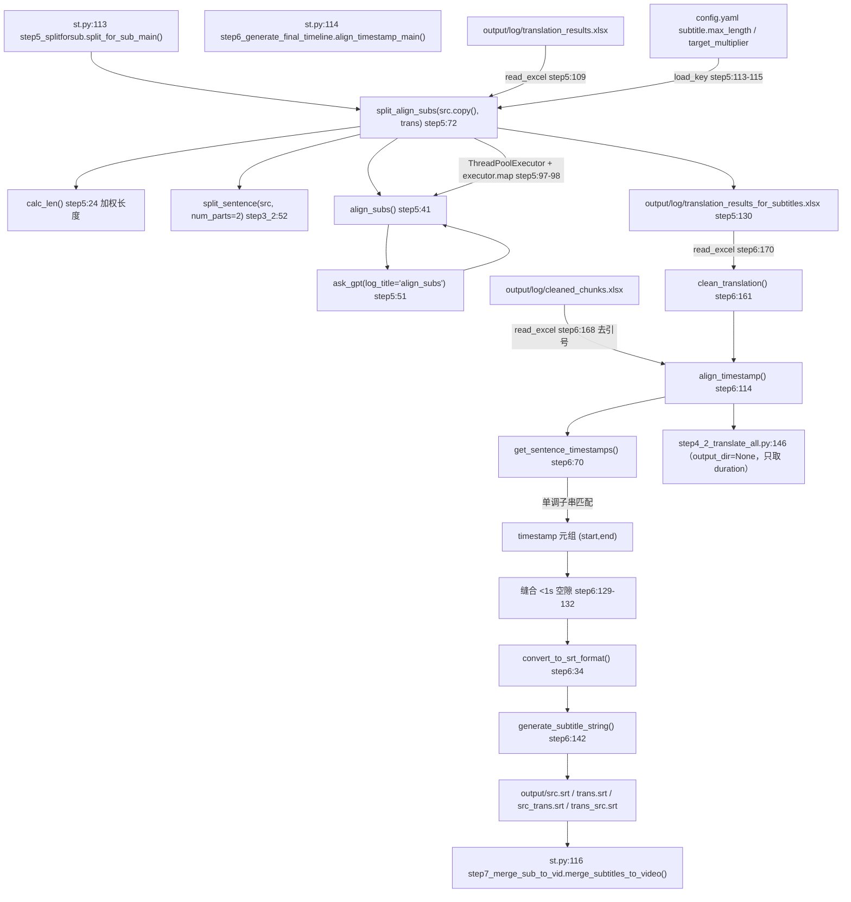

> ## ⚠️ 本文部分内容已在「重构 Round 1」后失效
>
> ⚠️ 本文中作为「配音字幕文件」讨论的 `AUDIO_SUBTITLE_OUTPUT_CONFIGS` / `output/audio/*_subs_for_audio.srt` 相关段落已随配音链路删除（`step6` 中的那段死代码也一并清理）。**step5/step6 本身是当前流水线的一部分，其余描述有效**；另 SRT 生成已修复「单列字幕多一个空行」的问题。


# 字幕切分与时间轴对齐（step5 / step6）

## 一、职责与边界

step5 把「句子级」的双语行按长度上限再切碎成「字幕级」；step6 用 word 级时间戳给每一行字幕重新分配起止时间并写出 SRT。

- **负责**：① step5 `split_for_sub_main()` 判定哪些行超长（源文按字符数、译文按加权长度 × `target_multiplier`），调 LLM 把一行拆成 2 段并对齐译文，最多重试 3 轮，产出 `output/log/translation_results_for_subtitles.xlsx`；② step6 `align_timestamp()` 把句子文本沿 word 级时间戳做**单调子串匹配**，得到 `(start, end)` 与 `duration`，缝合 <1 秒的空隙，格式化 SRT 时间戳，并按 4 种列组合写出 `output/src.srt`、`trans.srt`、`src_trans.srt`、`trans_src.srt`；③ `core/json_to_subtitle.py` 作为旁路工具，把 ASR 的 JSON 直接转成 SRT 与 `cleaned_chunks.xlsx`。
- **不负责**：step5 **不写任何 SRT**（这是常见误解，见 5.1）；step6 **不写** `output/audio/*_subs_for_audio.srt`（对应调用被注释，见 7.5）；字幕烧录在 step7。

## 二、文件清单

| 文件路径 | 行数 | 主要职责 |
| --- | --- | --- |
| `core/step5_splitforsub.py` | 134 | `calc_len()`(:24)、`align_subs()`(:41)、`split_align_subs()`(:72)、`split_for_sub_main()`(:106) |
| `core/step6_generate_final_timeline.py` | 210 | `convert_to_srt_format()`(:34)、`remove_punctuation()`(:47)、`get_sentence_timestamps()`(:70)、`align_timestamp()`(:114)、`clean_translation()`(:161)、`align_timestamp_main()`(:167) |
| `core/json_to_subtitle.py` | 214 | 独立 CLI：`extract_segments()`(:64)、`generate_srt_from_segments()`(:94)、`generate_excel_from_segments()`(:126)、`main()`(:162) |
| `core/step8_1_gen_audio_task.py` | 150 | 复用侧：`check_len_then_trim()`(:22)；消费侧：`process_srt()`(:56) 读 `output/audio/*_subs_for_audio.srt` |
| `core/step3_2_splitbymeaning.py` | 130 | `split_sentence(sentence, num_parts, word_limit=18, ...)`(:52)，被 step5 用 `num_parts=2` 调用 |
| `core/config_utils.py` | 89 | `load_key()`、`get_joiner(language)`(:50) |
| `st.py` | 180 | `process_text()`:113-116 串行调用 step5 → step6 → step7 |
| `config.yaml` | 242 | `subtitle.max_length` / `subtitle.target_multiplier` / `max_workers` / `min_trim_duration` / `min_subtitle_duration` |

## 三、调用链与数据流



## 四、关键数据结构

### 4.1 三次时间映射（Word 级 → sentence 级 → subtitle 级）

| 层级 | 载体文件 | 字段 | 类型 / 单位 | 产生者 |
| --- | --- | --- | --- | --- |
| ① Word 级 | `output/log/cleaned_chunks.xlsx` | `text`, `start`, `end` | `text` 为带双引号的 word 字符串；`start`/`end` 为 float **秒** | step2 `whisperX_utils.save_results()`（`core/all_whisper_methods/whisperX_utils.py:276-277`）或 `json_to_subtitle.generate_excel_from_segments()` |
| ② Sentence 级 | `output/log/translation_results.xlsx` | `Source`, `Translation`, `timestamp`, `duration` | `timestamp` 是 `HH:MM:SS,mmm --> HH:MM:SS,mmm` **字符串**；`duration` 为 float **秒** | step4.2 `translate_all()`（`core/step4_2_translate_all.py:152`） |
| ③ Subtitle 级 | `output/log/translation_results_for_subtitles.xlsx` → `output/*.srt` | `Source`, `Translation`；SRT 的序号/时间行/文本行 | 时间轴继承自 ②，按切分后**逐行重算**（行数变多，时间被重新分配） | step5 `:130` → step6 `:151-156` |

映射规则：①→② 由 `get_sentence_timestamps()` 把「句子文本」在「word 拼接串」中子串匹配，取首词 `start` 与末词 `end`；②→③ 由 step5 在一行内部插 `\n` 拆成多行，**拼接文本不变**，所以 step6 重跑同一套匹配即可把时间重新分配到更细的粒度。

实测对照（示例数据，非推断）：`output/log/cleaned_chunks.xlsx` 当前为 23000 个 word 行、列为 `text`/`start`/`end`，中文逐字且带双引号（如 `"那"`）。

### 4.2 SRT 文本结构

`generate_subtitle_string()`（`core/step6_generate_final_timeline.py:142-149`）逐行拼接：

```text
{i+1}
{row['timestamp']}
{line1}
{line2}

```

- `columns` 只有 1 列时 `line2 = ''`（`:147`），因此 `src.srt` / `trans.srt` 每个块**多出一个空行**（块间为 2 个空行）；`src_trans.srt` / `trans_src.srt` 是标准 1 个空行。ffmpeg 的 `subtitles` 滤镜可容忍，严格 SRT 解析器需注意。
- 文本中的连续空白会被压成单个空格（`:146-147`）。

### 4.3 关键 DataFrame

| 变量 | 位置 | 结构 |
| --- | --- | --- |
| `df_text` | `core/step6_generate_final_timeline.py:168-169` | `cleaned_chunks.xlsx`，`text` 列被 `strip('"').strip()` |
| `df_translate` | `:170-171` | `translation_results_for_subtitles.xlsx`，`Translation` 先过 `clean_translation()` |
| `df_trans_time` | `:116` | `df_translate.copy()` 加 `timestamp`（先元组、后字符串）与 `duration` |
| `words` | `:119-121` | 由 `df_text['text'].str.split(expand=True).stack()...` 构造——**该变量构造后从未被使用，是死代码** |
| `df`（step8.1） | `core/step8_1_gen_audio_task.py:104` | 列 `number`, `start_time`, `end_time`, `duration`, `text`, `origin` |

## 五、逐函数/逐模块实现说明

### 5.1 `core/step5_splitforsub.py`

| 函数 / 常量 | 签名或值 | 关键实现 | 副作用 / 异常 |
| --- | --- | --- | --- |
| `INPUT_FILE` | `"output/log/translation_results.xlsx"`（`:18`） | 输入 | — |
| `OUTPUT_SPLIT_FILE` | `"output/log/translation_results_for_subtitles.xlsx"`（`:19`） | **step5 的唯一产物** | — |
| `OUTPUT_REMERGED_FILE` | `"output/log/translation_results_remerged.xlsx"`（`:20`） | 仅被 `:131` 的**注释行**引用 → 该文件当前**永远不会生成** | — |
| `calc_len(text)` | `(str) -> float` | 逐字符加权求和（`:39`）。⚠️ 与 `:23` 的注释**不符**：注释写「中日 2.5 / 韩 2 / 泰 1.5 / 全角 2 / 其他 1」，代码实际是**中日 1.75**（`:29`）、**韩 1.5**（`:31`）、**泰 1**（`:33`）、**全角 1.75**（`:35`）、其他 1（`:37`） | 纯函数 |
| `align_subs(src_sub, tr_sub, src_part)` | `(str, str, str) -> (list[str], list[str], str)` | 调 `get_align_prompt()` + `ask_gpt(response_json=True, valid_def=valid_align, log_title='align_subs')`（`:51`）；`src_parts = src_part.split('\n')`（`:54`）；`tr_parts = [item[f'target_part_{i+1}'].strip() for i, item in enumerate(align_data)]`（`:55`）；用 `get_joiner(language)` 的 joiner 把译文重新拼成 `tr_remerged`（`:57-60`） | 网络请求；若 LLM 返回的 `align` 项数 > `src_parts` 数 → `KeyError: 'target_part_N'` |
| `valid_align` | 内部函数 | 要求 `align` 键存在且 `len(align) >= 2`（`:44-49`），否则交给 `ask_gpt` 记 `error.json` 并重试 | — |
| `split_align_subs(src_lines, tr_lines)` | `(list[str], list[str]) -> (list[str], list[str], list[str])` | ① 读 `subtitle` 配置（`:73-75`）；② 逐行判定 `len(src) > MAX_SUB_LENGTH or calc_len(tr) * TARGET_SUB_MULTIPLIER > MAX_SUB_LENGTH`（`:81`），命中者记入 `to_split`；③ 线程池并发执行 `process(i)`（`:97-98`），内部 `split_sentence(src_lines[i], num_parts=2).strip()`（`:91`）→ `align_subs()` → 把**列表**写回 `src_lines[i]`/`tr_lines[i]`、把重合串写回 `remerged_tr_lines[i]`（`:93-95`）；④ 展平两个列表（`:101-102`） | 就地修改传入的 list；`executor.map` 的返回迭代器**未被消费** → `process()` 内的异常被静默吞掉（见 7.2） |
| `split_for_sub_main()` | `() -> None` | 读 `INPUT_FILE` 取 `Source`/`Translation`（`:109-111`）；`for attempt in range(3)` 循环重试（`:117`）：每轮跑 `split_align_subs(src.copy(), trans)`，若所有 `len(src) <= MAX_SUB_LENGTH` 且所有 `calc_len(tr) * TARGET_SUB_MULTIPLIER <= MAX_SUB_LENGTH` 则 `break`（`:122-124`），否则用切分结果继续下一轮（`:127-128`）；最后无条件写 `OUTPUT_SPLIT_FILE`（`:130`） | 写 xlsx；**无幂等检查**（重跑直接覆盖，与「产物存在即跳过」的全局约定不一致） |

### 5.2 `core/step6_generate_final_timeline.py`

| 函数 / 常量 | 签名或值 | 关键实现 | 副作用 / 异常 |
| --- | --- | --- | --- |
| `SUBTITLE_OUTPUT_CONFIGS` | `[('src.srt',['Source']), ('trans.srt',['Translation']), ('src_trans.srt',['Source','Translation']), ('trans_src.srt',['Translation','Source'])]`（`:22-27`） | 写到 `OUTPUT_DIR = 'output'`（`:19`） | 生成 `output/src.srt`、`output/trans.srt`、`output/src_trans.srt`、`output/trans_src.srt` |
| `AUDIO_SUBTITLE_OUTPUT_CONFIGS` | `[('src_subs_for_audio.srt',['Source']), ('trans_subs_for_audio.srt',['Translation'])]`（`:29-32`） | 目标目录 `AUDIO_OUTPUT_DIR = 'output/audio'`（`:20`） | **当前无调用点**（`:180` 被注释） |
| `convert_to_srt_format(start_time, end_time)` | `(float, float) -> str` | 内部 `seconds_to_hmsm()` 用 `int()` 截断毫秒（`:40`，非四舍五入），输出 `f"{h:02d}:{m:02d}:{s:02d},{ms:03d}"` | 纯函数；与 `core/json_to_subtitle.py:40-51` 实现重复 |
| `remove_punctuation(text)` | `(str) -> str` | `\s+`→单空格；`[^\w\s]` 删除（Python `\w` 保留 CJK）；末尾 `.strip()`（`:47-50`）。**单词内部的空格会被保留** | 纯函数 |
| `show_difference(str1, str2)` | `(str, str2) -> None` | 打印逐字符差异位置与 `^` 标记行（`:52-68`），仅供人工排障 | stdout |
| `get_sentence_timestamps(df_words, df_sentences)` | `(DataFrame, DataFrame) -> list[tuple[float,float]]` | 见 5.3 | 匹配失败时打印 ⚠️ 并 `raise ValueError`（`:110`） |
| `align_timestamp(df_text, df_translate, subtitle_output_configs, output_dir, for_display=True)` | → `DataFrame` | 见 5.4 | `output_dir` 非空时写 SRT 文件 |
| `clean_translation(x)` | `(Any) -> str` | `NaN` → `''`；`str(x).strip('。').strip('，')` 后过 `autocorrect.format()`（`:161-165`） | 改文本，不改时间 |
| `align_timestamp_main()` | `() -> None` | 读两个 xlsx → `clean_translation` → `align_timestamp(..., SUBTITLE_OUTPUT_CONFIGS, 'output')`（`:173`）；随后打印完成面板、`record_summary_info()`、token/花费面板、`eu.record_messages()`、桌面通知（`:183-188`） | 写 4 个 SRT；依赖 `plyer`、`autocorrect_py`、`easy_util`；**无幂等检查** |

### 5.3 `get_sentence_timestamps()` 的对齐算法

```text
输入：df_words = cleaned_chunks.xlsx（text/start/end，word 级）
      df_sentences = 待对齐的 DataFrame（列名必须是 'Source'，按 index 顺序遍历）

① 构造全词串 full_words_str = concat( remove_punctuation(word.lower()) )   # :77-82
   同时建立 position_to_word_idx：每个字符位置 → 所属 word 的行号
② 逐句顺序扫描（current_pos 单调递增，不回溯）：                          # :84-104
   clean_sentence = remove_punctuation(sentence.lower()).replace(" ", "")   # :86
   从 current_pos 起逐位比较，命中则取
     start = df_words['start'][首词行号]，end = df_words['end'][末词行号]   # :92-98
   命中后 current_pos += sentence_len（保证句子与句子不重叠、保持音频顺序）
③ 未命中 → 打印警告 + show_difference + raise ValueError("❎ 未找到与句子匹配的内容。") # :105-110
```

关键约束（都是隐式契约）：

| 约束 | 依据 | 违反后果 |
| --- | --- | --- |
| 句子的归一化文本必须是全词串的**连续子串**，且**顺序与音频一致** | `:90-103` 单调扫描 | 抛 `ValueError`，整个 step6 中断 |
| 句子侧删掉了**所有空格**（`.replace(" ", "")`），word 侧只做首尾 `strip()` | `:86` vs `:50` | 若某个 word token 内部含空格（例如没有词级时间戳时 `json_to_subtitle` 用整段文本兜底，`core/json_to_subtitle.py:143-151`），全词串会混入空格 → 位置错位甚至匹配失败 ⚠️ |
| `df_sentences` 必须按 0..n-1 的 RangeIndex 排列 | `:85` `.items()` 与 current_pos 单调性 | 索引乱序 → 时间分配错乱 |
| 标点/大小写被归一化，但**字符本身**不能变 | `:47-50` | step5 的 LLM 若改写了源文（回填表里 `src_parts` 来自 `split_sentence`，不会改写；但人工编辑 xlsx 会）→ 抛错 |

### 5.4 `align_timestamp()` 内部步骤

| 步骤 | 行号 | 说明 |
| --- | --- | --- |
| 复制 DataFrame | `:116` | `df_trans_time = df_translate.copy()` |
| 构造 word 表 | `:119-121` | **死代码**：`words` 建好后未使用 |
| 求每行时间 | `:124-126` | `df_trans_time['timestamp'] = time_stamp_list`；`duration = end - start`（float 秒） |
| 缝合空隙 | `:129-132` | 若下一行 `start` 与当前行 `end` 的间隔 `0 < delta < 1` 秒，则把当前行 `end` 拉长到下一行 `start`；**≥1 秒的间隔保留** |
| 格式化时间 | `:135` | `timestamp` 列由元组变成 SRT 字符串（此后不可再做算术语义上的时间计算） |
| `for_display` 分支 | `:138-139` | `True`：把 `Translation` 中的 `，` 和 `。` 替换为空格并 `strip()`（只处理这两个字符）；`False`：完全跳过 |
| 写文件 | `:151-156` | 仅当 `output_dir` 为真值：`os.makedirs(output_dir, exist_ok=True)` 后按 `subtitle_output_configs` 逐个写 |
| 返回 | `:158` | 返回 `df_trans_time` |

`for_display` 的两处调用差异：

| 调用点 | `output_dir` | `for_display` | 结果 |
| --- | --- | --- | --- |
| `core/step4_2_translate_all.py:146` | `None` | `False` | 不写文件、保留标点；只为拿到 `duration` 去做 trim |
| `core/step6_generate_final_timeline.py:173` | `'output'` | 默认 `True` | 写 4 个 SRT、把中文句读换成空格 |

### 5.5 `core/json_to_subtitle.py`（旁路 CLI 工具）

| 成员 | 行号 | 说明 |
| --- | --- | --- |
| `convert_to_srt_format()` | `:40-51` | 与 step6 同名函数**重复实现** |
| `load_json_file()` | `:53-62` | 读 JSON，失败打印红字并 `raise` |
| `extract_segments(data)` | `:64-92` | 支持 3 种格式：`{"segments":[...]}`、`{"converted_result":{"segments":[...]}}`、`{"original_result":{"result":...}}`（后者借 `core.all_whisper_methods.volcano_asr.VolcanoASR._convert_to_whisper_format()` 转换，`:84-86`）；都不匹配则 `ValueError` |
| `generate_srt_from_segments()` | `:94-124` | 跳过 `text` 为空的 segment（`:104-105`）；写 `'\n'.join(srt_lines)`（`:120-121`）；打印条目数 = `len(srt_lines)//4` |
| `generate_excel_from_segments()` | `:126-160` | 优先用 `segment['words']`；**没有 word 级时间戳时用整段 `text` 兜底**（`:143-151`，此时一行 `text` 会含空格）；`df['text']` 统一加双引号（`:155`）匹配 whisperX 约定；`to_excel(index=False)` |
| `main()` | `:162-211` | argparse：位置参数 `json_file`；`--output-srt/-s` 默认 `output/subtitles.srt`（`:165`）；`--output-excel/-e` 默认 `output/log/cleaned_chunks.xlsx`（`:167`）；`--only-srt` / `--only-excel`（`:169-172`）；`:194-196` 自动 `makedirs` |

> 说明：`core/json_to_subtitle.py` **没有被任何流水线模块 import**（全仓库 grep 只命中它自身的 argparse 默认值），是纯命令行旁路工具；它默认写的 `output/subtitles.srt` 也不被 step7 消费（step7 只认 `output/src.srt` 与 `output/trans.srt`，`core/step7_merge_sub_to_vid.py:31-32`、`:61-63`）。

### 5.6 下游消费者

| 消费者 | 位置 | 行为 |
| --- | --- | --- |
| `st.py:116` → `step7_merge_sub_to_vid.merge_subtitles_to_video()` | `core/step7_merge_sub_to_vid.py:41-102` | 校验 `output/src.srt` 与 `output/trans.srt` 存在（`:61-63`，缺失则 `exit(1)`），用 ffmpeg `subtitles=` 滤镜叠加两层字幕；`resolution == '0x0'` 时只生成占位视频（`:48-59`） |
| 字幕打包下载 | `st_components/imports_and_utils.py:44-84` | 遍历 `output/*.srt`，按文件名含 `src_trans`/`trans_src`/`src`/`trans` 重命名为 `<视频名>_src_trans.srt` 等，并把 `trans_src.srt` 额外复制成 `<视频名>.srt` |
| `step8_1_gen_audio_task.process_srt()` | `core/step8_1_gen_audio_task.py:56-137` | 读 `output/audio/trans_subs_for_audio.srt` + `output/audio/src_subs_for_audio.srt`（`:17-18`，`:59-63`），按 `'\n\n'` 切块、`int(lines[0])` 取序号、`' '.join(lines[2:])` 取文本，与 `src` 侧同序号拼接为 `origin`；再按 `min_subtitle_duration` 合并/延长过短字幕（`:107-128`） |

## 六、关键参数与配置

| config 键 | 当前值 | 位置 | 作用 |
| --- | --- | --- | --- |
| `subtitle.max_length` | `75` | `config.yaml:105` | 字幕行长度上限：源文用**字符数**，译文用 `calc_len()` **加权长度 × target_multiplier** |
| `subtitle.target_multiplier` | `1.2` | `config.yaml:107` | 译文长度预算系数：译文允许比源文长 20%（判定式 `calc_len(tr) * 1.2 > 75`） |
| `max_workers` | `1000` | `config.yaml:113` | step5 切分线程池大小（`:97`） |
| `max_split_length` | `20` | `config.yaml:115` | step3 粗切（`split_sentences_by_meaning()`，`core/step3_2_splitbymeaning.py:121`）的上限，决定进入 step5 时的句子长度分布 |
| `min_trim_duration` | `3.5` | `config.yaml:174` | step4.2 是否调用 `check_len_then_trim` 的阈值（**发生在 step5 之前**） |
| `min_subtitle_duration` | `2.5` | `config.yaml:173` | step8.1 合并/延长过短字幕的阈值（秒） |
| `whisper.language` / `whisper.detected_language` | `'zh'` / `'zh'` | `config.yaml:46-47` | step5 选 joiner：`'auto'` 时用 `detected_language`（`core/step5_splitforsub.py:57-59`） |
| `language_split_with_space` / `language_split_without_space` | 见 `config.yaml:229-242` | — | `get_joiner()` 只认这两张表里的语言码，其它语言码会 `ValueError`（`core/config_utils.py:50-56`） |
| `resolution` | `'0x0'` | `config.yaml:97` | 非 `0x0` 时 step7 才真正压字幕 |

## 七、技术要点与坑

### 7.1 `calc_len()` 的权重与注释不一致

`core/step5_splitforsub.py:22-23` 的注释写「Chinese and Japanese 2.5 characters, Korean 2 characters, Thai 1.5 characters, full-width symbols 2 characters」，而 `:28-37` 的实际返回是 **CJK/日文假名 1.75、韩文 1.5、泰文 1、全角符号 1.75、其他 1**。改 `max_length` 或 `target_multiplier` 时以**代码**为准。

另一个细节：`。`(U+3002)、`、`(U+3001) 落在 `0x3002`/`0x3001`，**不属于**任何判定区间（`:28-35` 只覆盖 `0x3040-0x30FF` 假名与 `0xFF01-0xFF5E` 全角）→ 按 1 计权；而 `，`(U+FF0C) 属全角 → 1.75。

### 7.2 `executor.map` 未被消费 → 切分失败会被静默吞掉

```python
# core/step5_splitforsub.py:97-98
with concurrent.futures.ThreadPoolExecutor(max_workers=load_key("max_workers")) as executor:
    executor.map(process, to_split)
```

- `executor.map()` 返回一个**惰性迭代器**，这里从未 `list()` / 迭代它，因此 `process()` 内抛出的异常**不会**冒泡（`Future` 的异常只在取结果时重抛）。`with` 退出时 `shutdown(wait=True)` 会等线程跑完，所以任务确实执行了，只是**错误被丢弃**。
- 触发条件（两类真实场景）：① `align_subs` 里 `item[f'target_part_{i+1}']` 遇到 LLM 少返回一项 → `KeyError`；② `get_joiner(language)` 遇到两张语言表都不含的语言码（如 `th`）→ `ValueError`（`core/config_utils.py:56`）。
- 后果：该行**保持未切分**，但 `src_lines[i]`/`tr_lines[i]` 仍是原字符串 → 行列数守恒，后续不会报错；重试 3 轮仍可能超长，最终写出**超过 `max_length` 的字幕行**，没有任何日志。排查方法是自己重算 `calc_len()`（见第九节）。

### 7.3 切分与时间轴之间的耦合

| 关系 | 事实 | 风险 |
| --- | --- | --- |
| 切分**不破坏**对齐 | `split_sentence()` 只在**原字符串内部插入 `'\n'`**（`core/step3_2_splitbymeaning.py:66-73`），`align_subs` 返回 `src_part.split('\n')`（`core/step5_splitforsub.py:54`） | 拼接文本与切分前逐字符相同 → step6 的单调子串扫描仍能命中，这是「先 step5 再 step6」能工作的**根本前提**；一旦有人改成「改写句子再切分」，step6 立即 `ValueError` |
| 时间**只**来自 Source | `get_sentence_timestamps()` 只用 `df_sentences['Source']`（`:85`）；`Translation` 不参与位置计算 | 译文长短、段数与源文不一致**不会**让时间轴错位，但会让「字幕内容与时间区间」语义错配（观众视角的错位） |
| 粒度变化必须**同时**重算 | step5 改变了行数，step6 依赖行数逐行生成时间 | 只重跑 step5 而 `translation_results_for_subtitles.xlsx` 与新 `translation_results.xlsx` 不匹配时，Source 序列对不上 → `ValueError`；两个 xlsx 必须来自同一次 step3/step4 |
| trim 在切分**之前** | `check_len_then_trim` 在 `core/step4_2_translate_all.py:149` 执行，step5 读的是 trim 后的译文 | 若把 trim 挪到 step5 之后，step5 的长度判定就会基于未裁剪的更长文本 → 字幕偏短/超长判断失真 |
| 词级数据换了就全盘错位 | `cleaned_chunks.xlsx` 若被重跑 step2 覆盖 | 词序列变化 → 老的行文本匹配不上 → `ValueError`（这是保护，不是静默错位） |

### 7.4 step5 的其它坑

| 坑 | 位置 | 说明 |
| --- | --- | --- |
| `zip` 静默截断 | `:79` `for i, (src, tr) in enumerate(zip(src_lines, tr_lines))` | 若两个列表长度不等，短的那部分行**不会被检查**，也不会报错 |
| 就地修改入参 | `:93-95` | `split_align_subs()` 直接改调用方传入的 `src_lines`/`tr_lines`；`split_for_sub_main()` 传的是 `src.copy()`（`:119`），但重试轮次之间依赖上一次的展平结果（`:127-128`），语义较绕 |
| `remerged_tr_lines` 未落盘 | `:76`、`:95`、`:131` | 计算了「重新拼接的译文」却因 `:131` 注释而不写文件；下游 `core/step6_generate_final_timeline.py:177-180` 的配音字幕路径正是为它准备的，当前不可用 |
| 无幂等 | `:106-131` | 与全局「产物存在即跳过」约定相反：重跑 step5 会直接覆盖 `translation_results_for_subtitles.xlsx` |
| LLM 日志复用 | `:51` | 所有切分请求共用 `output/gpt_log/align_subs.json`；同一 prompt 会命中缓存（`core/ask_gpt.py:34-45`），调试时注意 |

### 7.5 step6 的其它坑

| 坑 | 位置 | 说明 |
| --- | --- | --- |
| 配音字幕文件**没有写入点** | `:29-32` 定义了 `output/audio/src_subs_for_audio.srt`、`trans_subs_for_audio.srt`，但唯一调用 `:180` 被注释；`core/step4_2_translate_all.py:145-146` 虽然传了 `'trans_subs_for_audio.srt'` 却带 `output_dir=None` | 全仓库 grep 只有「读」没有「写」→ `core/step8_1_gen_audio_task.py:59` 的 `open(...)` 会 `FileNotFoundError`，**配音链路当前无法从零跑通**。⚠️ 需人工确认（本次仅静态核对，未实跑配音） |
| 日志误导 | `:181` | 无论是否写过文件都会打印 `🎉📝 Audio subtitles generation completed!` |
| 死代码 | `:119-121` | `words` 构造后无用 |
| `timestamp` 被就地改写成字符串 | `:135` | 之后任何想用 `timestamp` 做算术的代码都会失败；step4.2 之所以能 trim，是因为它读的是 `duration` 列（`core/step4_2_translate_all.py:149`） |
| 缝隙缝合只处理 <1 秒 | `:131` | `0 < delta_time < 1`：≥1 秒的静音段不会被覆盖，长静音处字幕会提前结束（设计如此） |
| 时间格式截断 | `:40` | `int(seconds * 1000) % 1000` 截断而非四舍五入，最多早 1ms；四舍五入会带来跨秒进位风险，截断是安全选择 |
| 无幂等 + 依赖桌面通知 | `:167-188` | 每次都覆盖 4 个 SRT；`send_notification()` 走 `plyer`，无桌面环境（服务器/容器）可能抛异常，⚠️ 需人工确认该异常是否会中断流程 |
| 中文句读被吃掉 | `:138-139` | `for_display=True` 时把 `，`/`。` 换成空格；`、！？` 不受影响 |

### 7.6 `json_to_subtitle.py` 的坑

- 无词级时间戳时用整段 `text` 兜底（`:143-151`）→ 该行 `text` 含空格，会让 step6 的位置映射失效（见 5.3 表格）。⚠️
- 不做去重、不做「超过 20 字符的 token 过滤」（whisperX 侧有：`core/all_whisper_methods/whisperX_utils.py:271-274`），也不做 `start <= end` 校验。
- 与 step6 重复实现了 `convert_to_srt_format()`（两处若分别修改会产生格式分歧）。

## 八、扩展点

| 想做什么 | 改哪里 | 注意 |
| --- | --- | --- |
| 调整字幕长度上限 | `subtitle.max_length` / `subtitle.target_multiplier`（`config.yaml:105-107`） | 只影响 step5 的判定；`max_split_length`（step3）决定上游句子粒度，两个旋钮要联合调 |
| 让切分失败可见 | `core/step5_splitforsub.py:97-98`，把 `executor.map` 的结果消费掉（`list(...)`）或改回逐 `submit` + `future.result()` | 会让异常冒泡并中断流程，需同时决定「失败行是保留原样还是退出」；务必与 7.2 的静默行为对照测试 |
| 支持更多语种的 joiner | `core/config_utils.py:50-56` 与 `config.yaml:229-242` 的两张语言表 | 只给 `language_split_without_space` 加语言会改变 step3 的拼句行为，影响面大于 step5 |
| 恢复配音字幕产物 | 取消 `core/step6_generate_final_timeline.py:177-180` 的注释，或改为读 `translation_results_for_subtitles.xlsx` | 原设计依赖 `translation_results_remerged.xlsx`，而该文件因 `core/step5_splitforsub.py:131` 被注释而从未生成——先决定用哪份数据（推荐直接用 `translation_results_for_subtitles.xlsx` 重新对齐，避免二次错位） |
| 改进对齐鲁棒性 | `get_sentence_timestamps()`（`:70-112`） | 现为「精确子串 + 失败即抛」；若要容错（如 `SequenceMatcher` 模糊回退），必须保证**时间单调不回退**，否则 SRT 会出现重叠时间轴 |
| 新增字幕输出组合 | `SUBTITLE_OUTPUT_CONFIGS`（`:22-27`） | `columns` 支持 1~2 列（`generate_subtitle_string()` 用 `columns[0]`/`columns[1]`，超过 2 列会被忽略）；新增文件名要同步 `st_components/imports_and_utils.py:52-69` 的重命名规则 |
| 给 SRT 加样式/行宽 | step7 的 `force_style`（`core/step7_merge_sub_to_vid.py:70-75`） | 不改 SRT 文本，只改烧录样式 |

## 九、验证方式

命令行 cwd 必须为仓库根目录：

```powershell
cd E:\VideoLingo\VideoLingoMove

# 单独跑切分（会覆盖 output/log/translation_results_for_subtitles.xlsx）
python -m core.step5_splitforsub

# 单独跑时间轴与 SRT（会覆盖 output/*.srt）
python -m core.step6_generate_final_timeline

# 查看产物
Get-ChildItem output\*.srt
Get-Content output\trans.srt -TotalCount 12
```

最小复现脚本（复刻 `get_sentence_timestamps()` 的归一化逻辑，验证「句子 = 词串的单调子串」这一前提）：

```python
# 目录需为仓库根；需使用项目实际 Python 环境（带 pandas）
import pandas as pd, re

def norm(t):
    t = re.sub(r'\s+', ' ', str(t))
    t = re.sub(r'[^\w\s]', '', t)
    return t.strip()

df = pd.read_excel('output/log/cleaned_chunks.xlsx')
df['text'] = df['text'].str.strip('"').str.strip()
words = ''.join(norm(w.lower()) for w in df['text'])

lines = [l.strip() for l in open('output/log/sentence_splitbymeaning.txt', encoding='utf-8') if l.strip()]
sent = ''.join(norm(l.lower()).replace(' ', '') for l in lines)

print('words 长度 =', len(words), '| sentences 长度 =', len(sent))
print('完全一致 =', words == sent)          # True 则 step6 的对齐必然成功
print('是否含空格 =', ' ' in words)          # True 表示存在带空格的 token，7.2 风险成立
```

> 注：本机 PATH 中的 `python` 未安装 pandas（实测 `ModuleNotFoundError`），须改用项目实际运行环境；仓库内未发现 `venv/` 目录。⚠️ 需人工确认该项目环境。

验证清单：

| 检查项 | 命令 / 方式 | 期望 |
| --- | --- | --- |
| 切分是否真的发生 | 比较 `translation_results.xlsx` 与 `translation_results_for_subtitles.xlsx` 的行数 | 后者 ≥ 前者；若相等说明没有任何行超长 |
| 是否留下超长行（7.2 静默失败） | 对 `translation_results_for_subtitles.xlsx` 用 `calc_len()` 重算：`len(src) <= 75` 且 `calc_len(tr)*1.2 <= 75` | 全部满足；不满足的行按 7.2 排查 `output/gpt_log/align_subs.json` |
| 对齐是否成功 | 观察 step6 控制台 | **不应**出现 `⚠️ 警告：未找到与句子完全匹配的结果`；出现即 `ValueError` |
| 时间轴单调 | 解析 `output/trans.srt` 的时间行 | 每行 `start < end`，且下一行 `start >= 上一行 start` |
| 条目数一致 | `output/trans.srt` 的块数 vs `translation_results_for_subtitles.xlsx` 行数 | 相等（`generate_subtitle_string()` 逐行输出） |
| SRT 可被 ffmpeg 接受 | `ffmpeg -v error -i output/trans.srt -f null -` | 无报错输出 |
| 单列 SRT 的空行差异 | `Get-Content output\trans.srt -TotalCount 6` | 单列配置每块后多一个空行（见 4.2），属已知现象 |
| 配音链路的文件缺失 | 运行 step8.1 前检查 `output/audio/*_subs_for_audio.srt` | 当前代码不会生成 → 需先补写入点（7.5） |

## 十、相关文档

| 文档 | 关系 |
| --- | --- |
| [`04-术语总结与翻译.md`](04-术语总结与翻译.md) | 上游：产出 `translation_results.xlsx`（含 `duration`），并复用本文档的 `align_timestamp()` |
| [`03-句子切分NLP.md`](03-句子切分NLP.md) | 上游：`split_sentence()` 与 `sentence_splitbymeaning.txt` 的归属 |
| [`06-字幕压制与成片.md`](06-字幕压制与成片.md) | 下游：step7 消费 `output/src.srt` 与 `output/trans.srt` |
| [`07-配音音频生成.md`](07-配音音频生成.md) | 下游：step8.1 读 `output/audio/*_subs_for_audio.srt`（当前无生成者） |
| [`../03-subsystems/01-LLM调用与提示词.md`](../03-subsystems/01-LLM调用与提示词.md) | `get_align_prompt()`、`ask_gpt` 的缓存与 `align_subs` 日志 |
| [`../03-subsystems/04-NLP切分工具.md`](../03-subsystems/04-NLP切分工具.md) | step3 的 spaCy 切分工具链 |
| [`../04-interfaces/01-配置文件与参数.md`](../04-interfaces/01-配置文件与参数.md) | `subtitle.*`、`min_subtitle_duration` 等键的定义 |
| [`../00-overview/02-数据流与中间产物.md`](../00-overview/02-数据流与中间产物.md) | 全流程产物总表 |

> 注：以上相对链接按 `devdocs/README.md` 的目录规划书写；当前仓库 `devdocs/` 下仅存在 `README.md` 与 `_meta/写作模板.md`，其余文档可能尚未创建。
