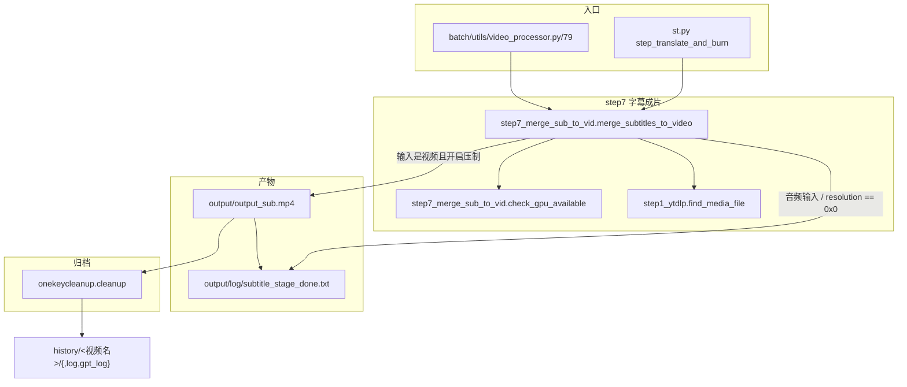

> ## ⚠️ 本文部分内容已在「重构 Round 1」后失效
>
> step12（配音成片合成）已在重构 Round 1 中删除，本文中所有 `core/step12_merge_dub_to_vid.py` 的引用与行号均已失效。**step7（字幕压制）仍是当前流水线的一部分**，但它在之后又改过多轮，本文已按代码现状更正：
>
> - 源媒体定位改用 `find_media_file`（`core/step1_ytdlp.py`），**输入为音频时直接跳过压制**、只写完成标记。
> - 完成判定改为显式标记文件 `output/log/subtitle_stage_done.txt`（`core/step7_merge_sub_to_vid.py`），不再靠"`output_sub.mp4` 是否存在"。
> - `resolution == '0x0'` 且输入是真实视频时**不再生成任何占位视频**（OpenCV 造 1 帧黑视频的代码已删），只写标记。
> - ffmpeg 非 0 退出码现在会 `raise RuntimeError`，不再"打印失败但当作成功"。
> - 本文提到的 `core/delete_retry_dubbing.py` 已随配音链路删除，文件不在仓库中。


## 一、职责与边界

step7 负责流水线的最后一步：把 `output/src.srt` + `output/trans.srt` 烧成**硬字幕**（burn-in）输出 `output/output_sub.mp4`（`core/step7_merge_sub_to_vid.py`），并在成功/跳过时写下阶段完成标记 `output/log/subtitle_stage_done.txt`。

它**不做**字幕的时间轴 / 断句计算（那是 step5、step6 的职责，见 `core/step6_generate_final_timeline.py`），不做 TTS 合成，也不做分辨率适配之外的画面加工（无裁剪、无镜像、无 DAR 修正）。

`core/onekeycleanup.py` 属于本模块的「归档」配套：把 `output/` 整体搬进 `history/<视频名>/`。原本配套的 `core/delete_retry_dubbing.py`（删除配音产物以便重跑 step8~step12）已随配音链路删除。

## 二、文件清单

| 文件路径 | 规模 | 主要职责 |
| --- | --- | --- |
| `core/step7_merge_sub_to_vid.py` | ~6K | 硬字幕烧录 + 缩放补边 + 音频输入跳过 + 阶段完成标记；导出 `check_gpu_available` |
| `core/onekeycleanup.py` | ~3K | `cleanup`(:7)：把 `output/` 归档到 `history/<视频名>/{,log,gpt_log}` |
| `core/json_to_subtitle.py` | ~7K | 独立 CLI：从 ASR JSON 直接生成 SRT / Excel（含生成 `output/log/cleaned_chunks.xlsx`，但不烧字幕） |
| `core/step1_ytdlp.py`（`find_media_file` / `find_video_files`） | 280 | 成片阶段的**唯一**源媒体定位入口（清单优先，回退到视频/音频） |
| `core/all_whisper_methods/demucs_vl.py` | ~3K | 定义 `BACKGROUND_AUDIO_FILE = "output/audio/background.mp3"`（配音链路已删，当前无消费者） |
| `st.py` | ~13K | 编排：`step_translate_and_burn`(:62-66) 里最后调用 step7 |
| `batch/utils/video_processor.py` | ~13K | 批处理编排：同样的函数被包进重试循环 |

## 三、调用链与数据流



> ⚠️ 原 step12 分支（`merge_video_audio`、`output_dub.mp4`、`delete_dubbing_files`）已随配音链路删除，本图不再包含。

上游数据来源（写文件的一方）：

| 输入文件 | 生产函数 | 位置 |
| --- | --- | --- |
| `output/<媒体>.<ext>` | `download_video_ytdlp` / `st.file_uploader` | `core/step1_ytdlp.py`、`st_components/download_video_section.py` |
| `output/src.srt`、`output/trans.srt` | `align_timestamp_main` 的 `SUBTITLE_OUTPUT_CONFIGS` | `core/step6_generate_final_timeline.py` |

## 四、关键数据结构

常量（模块级字符串常量，非 dataclass）：

| 常量 | 值 | 位置 |
| --- | --- | --- |
| `OUTPUT_DIR` | `"output"` | `core/step7_merge_sub_to_vid.py` |
| `OUTPUT_VIDEO` | `"output/output_sub.mp4"` | `core/step7_merge_sub_to_vid.py` |
| `SRC_SRT` | `"output/src.srt"` | `core/step7_merge_sub_to_vid.py` |
| `TRANS_SRT` | `"output/trans.srt"` | `core/step7_merge_sub_to_vid.py` |
| `STAGE_DONE_MARKER` | `"output/log/subtitle_stage_done.txt"` | `core/step7_merge_sub_to_vid.py` |
| `BACKGROUND_AUDIO_FILE` | `os.path.join("output/audio", "background.mp3")` | `core/all_whisper_methods/demucs_vl.py`（配音链路已删，当前无消费者） |

样式常量（ASS 颜色格式 `&HBBGGRR`，注意是 **BGR 不是 RGB**）：

| 常量 | 值 | 作用 |
| --- | --- | --- |
| `SRC_FONT_SIZE` / `TRANS_FONT_SIZE` | `15` / `17` | libass `FontSize` |
| `FONT_NAME` / `TRANS_FONT_NAME` | Windows `Arial`；Linux `NotoSansCJK-Regular`；macOS `Arial Unicode MS` | 由 `platform.system` 决定（`core/step7_merge_sub_to_vid.py`）。macOS 分支是后补的：沿用 `Arial` 会把中日韩字幕烧成豆腐块 |
| `SRC_FONT_COLOR` / `SRC_OUTLINE_COLOR` / `SRC_OUTLINE_WIDTH` / `SRC_SHADOW_COLOR` | `&HFFFFFF` / `&H000000` / `1` / `&H80000000` | 原文字幕：白字黑边带阴影 |
| `TRANS_FONT_COLOR` / `TRANS_OUTLINE_COLOR` / `TRANS_OUTLINE_WIDTH` / `TRANS_BACK_COLOR` | `&H00FFFF` / `&H000000` / `1` / `&H33000000` | 译文字幕：黄字 + 半透明底框（`BorderStyle=4` 即背景框模式） |

落盘产物清单：

| 路径 | 生产者 | 说明 |
| --- | --- | --- |
| `output/output_sub.mp4` | `merge_subtitles_to_video` | 硬字幕成片（仅字幕）；**音频输入与 `resolution == '0x0'` 时不生成** |
| `output/log/subtitle_stage_done.txt` | `_mark_stage_done` | 阶段完成标记，UI 用它判断「已完成」（`st.py` 读 `os.path.exists`） |
| `output/src.srt` / `output/trans.srt` / `output/src_trans.srt` / `output/trans_src.srt` | step6 | 四份字幕文本，供打包下载 |
| `output/cost.txt` | `easy_util.record_messages` | 耗时与 token 统计 |
| `history/<视频名>/` | `cleanup` | 归档目录（含 `log/`、`gpt_log/`） |

## 五、逐函数/逐模块实现说明

### 5.1 `check_gpu_available` —— `core/step7_merge_sub_to_vid.py`

签名 `check_gpu_available -> bool`。执行 `subprocess.run(['ffmpeg', '-encoders'], capture_output=True, text=True)`，在 stdout 里字符串匹配 `'h264_nvenc'`（`core/step7_merge_sub_to_vid.py`）。

| 要点 | 说明 |
| --- | --- |
| 异常处理 | 裸 `except`，任何异常返回 `False` |
| 探测对象 | **只探测 ffmpeg 是否编译了 nvenc，不探测显卡是否存在**；无 N 卡但 ffmpeg 带 nvenc 时仍会走 GPU 分支并失败 |
| 调用者 | step7 自身 |
| 副作用 | 无写文件；每次调用都会完整执行一次 `ffmpeg -encoders` |

### 5.2 `merge_subtitles_to_video` —— `core/step7_merge_sub_to_vid.py`

签名 `merge_subtitles_to_video -> None`。

| 步骤 | 行为 | 行号 |
| --- | --- | --- |
| 1 | `load_key("resolution")`，按 `'x'` 拆成 `TARGET_WIDTH` / `TARGET_HEIGHT` | |
| 2 | `media_file, media_type = find_media_file` 定位源媒体（清单优先，回退到视频/音频） | |
| 3 | `os.makedirs(os.path.dirname(OUTPUT_VIDEO), exist_ok=True)`（即 `output/`） | |
| 4 | **输入是音频** → 打印提示、`_mark_stage_done` 后直接 `return`（不压制） | |
| 5 | 若 `resolution == '0x0'`：走「只出字幕」分支（见 5.3），直接 `return` | |
| 6 | 若 `output/src.srt` 或 `output/trans.srt` 缺失：`raise FileNotFoundError` | |
| 7 | 拼装 ffmpeg 列表（见下），GPU 可用则追加 `-c:v h264_nvenc` | |
| 8 | 追加 `-y` 与输出路径，`subprocess.Popen` 执行并 `wait`；returncode 非 0 时 `raise RuntimeError`，成功才 `_mark_stage_done` | |

关键：**这是硬字幕（burn-in）**。ffmpeg 的 `subtitles` 滤镜把 SRT 渲染进像素，输出文件不再带字幕流。

完整命令（视频为 `output/in.mp4`、resolution 为 `1920x1080` 时的等价形式；命令实际以 `list[str]` 传给 `subprocess.Popen`，`-vf` 参数在 被 `.encode('utf-8')` 编码）：

```
ffmpeg -i output/in.mp4 \
 -vf "scale=1920:1080:force_original_aspect_ratio=decrease,pad=1920:1080:(ow-iw)/2:(oh-ih)/2,subtitles=output/src.srt:force_style='FontSize=15,FontName=Arial,PrimaryColour=&HFFFFFF,OutlineColour=&H000000,OutlineWidth=1,ShadowColour=&H80000000,BorderStyle=1',subtitles=output/trans.srt:force_style='FontSize=17,FontName=Arial,PrimaryColour=&H00FFFF,OutlineColour=&H000000,OutlineWidth=1,BackColour=&H33000000,Alignment=2,MarginV=27,BorderStyle=4'" \
 -c:v h264_nvenc \
 -y output/output_sub.mp4
```

| 参数 | 含义 | 来源 |
| --- | --- | --- |
| `scale=W:H:force_original_aspect_ratio=decrease` | 等比缩放到「不超过」目标框 | |
| `pad=W:H:(ow-iw)/2:(oh-ih)/2` | 居中补边到恰好 W×H | |
| 滤镜链顺序 | `scale` → `pad` → `subtitles(src)` → `subtitles(trans)`，即两路字幕串行叠加 | |
| `Alignment=2` | libass 底部居中（仅译文字幕设置） | |
| `MarginV=27` | 距底部 27 像素 | |
| `BorderStyle=1` / `4` | 1=描边+阴影；4=不透明背景框 |、 |
| 编码器 | 检测到 nvenc 时 `-c:v h264_nvenc`，否则**不指定** `-c:v`（交给 ffmpeg 按 `.mp4` 后缀选默认编码器，本机默认是 `libx264`） | |
| 音频 | 完全未指定 → 走 ffmpeg 默认流选择与重编码（mp4 默认 aac） | — |
| `-y` | 覆盖已有 `output/output_sub.mp4` | |

> `FontName` 在 macOS 上是 `Arial Unicode MS`（`FONT_NAME` / `TRANS_FONT_NAME`，）。

### 5.3 `resolution == '0x0'`（"Burn-in Subtitles" 关闭）与音频输入

`resolution` 为 `0x0` 等价于侧边栏的 "Burn-in Subtitles" 开关处于关闭状态。此时**不再生成任何占位视频**（OpenCV 造 1 帧黑视频的旧实现已删）：

| 条件 | 行号 | 行为 |
| --- | --- | --- |
| `is_audio_placeholder(video_file)` 为真（旧版本上传音频留下的 `black_screen.mp4`） | | `shutil.copy2` 把它原样复制成 `output/output_sub.mp4` 并说明原因——它本身就是黑底 + 完整音频的可播放成片，用黑帧覆盖会丢掉音频 |
| 其余（真实视频） | | 什么都不产出；若上次遗留了 `output/output_sub.mp4` 就删掉，避免使用者误以为这次压制了 |
| 两者 | | 都调用 `_mark_stage_done` 写 `output/log/subtitle_stage_done.txt` |

音频输入（`media_type == 'audio'`，）在更前面就返回，同样只写标记：此时根本没有视频轨可压制，交付物是 `output/*.srt`。

配套逻辑：UI 用 `os.path.exists(STAGE_DONE_MARKER)`（`st.py`）判断阶段完成；`st_components/sidebar_setting.py` 的 "Burn-in Subtitles" 开关通过把 `resolution` 写成 `'0x0'` / 具体值来表达；批处理同样在 `batch/utils/video_processor.py` 跳过 step7。

### 5.4 `merge_video_audio` —— ⚠️ 已删除（原 `core/step12_merge_dub_to_vid.py`）

> 该文件与函数**已随配音链路删除**，以下为历史说明，行号全部失效，保留仅供恢复时参考。

签名 `merge_video_audio -> None`。

| 步骤 | 行为 | 行号 |
| --- | --- | --- |
| 1 | `find_video_files` 拿源视频；`background_file = BACKGROUND_AUDIO_FILE` | |
| 2 | `resolution == '0x0'` → 占位黑视频分支并 `return` | |
| 3 | 读 `dub_volume`、`resolution`，拆宽高 | |
| 4 | 拼 `subtitle_filter`（与 step7 译文样式一致，但 `TRANS_FONT_SIZE = 20`） | |
| 5 | `-filter_complex` 做视频缩放补边 + 双路字幕 + 音量 + amix | |
| 6 | GPU 可用则 `-map [v] -map [a] -c:v h264_nvenc`，否则只 `-map` | |
| 7 | 追加 `-c:a aac -b:a 192k` + 输出路径，`subprocess.run(cmd)`（**不检查 returncode**） | |

完整命令：

```
ffmpeg -y -i output/in.mp4 -i output/audio/background.mp3 -i output/dub.mp3 \
 -filter_complex "[0:v]scale=1920:1080:force_original_aspect_ratio=decrease,pad=1920:1080:(ow-iw)/2:(oh-ih)/2,subtitles=output/dub.srt:force_style='FontSize=20,FontName=Arial,PrimaryColour=&H00FFFF,OutlineColour=&H000000,OutlineWidth=1,BackColour=&H33000000,Alignment=2,MarginV=27,BorderStyle=4'[v];[1:a]volume=1[a1];[2:a]volume=1.5[a2];[a1][a2]amix=inputs=2:duration=first:dropout_transition=3[a]" \
 -map [v] -map [a] -c:v h264_nvenc \
 -c:a aac -b:a 192k output/output_dub.mp4
```

| 参数 | 含义 | 来源 |
| --- | --- | --- |
| 输入顺序 | `[0:v]` 原视频；`[1:a]` `output/audio/background.mp3`；`[2:a]` `output/dub.mp3` | |
| `volume=1` | 背景声**不动音量**（即 100%） | |
| `volume={dub_volume}` | 人声乘 `dub_volume`；当前 `config.yaml` 为 `1.5` → 150% |、 |
| `amix=inputs=2:duration=first:dropout_transition=3` | 两路混音；**长度以第一个输入（背景声）为准**；某一路提前结束时 3 秒内渐出而非硬切 | |
| `-c:a aac -b:a 192k` | 输出音频固定 AAC 192 kbps | |
| `-map [v] -map [a]` | 显式选滤镜输出的视频/音频，丢弃源文件的其它轨道 |、 |
| 覆盖行为 | `-y` 在最前面（`cmd` 第 2 个元素） | |
| 失败处理 | `subprocess.run(cmd)` 返回值未接收，ffmpeg 失败后仍会打印 `Video and audio successfully merged into output/output_dub.mp4` | |

### 5.5 `cleanup` —— `core/onekeycleanup.py`

签名 `cleanup(history_dir="history") -> None`。

| 步骤 | 行为 | 行号 |
| --- | --- | --- |
| 1 | `find_media_file` → `os.path.basename(...)` → 去扩展名 → `sanitize_filename` | |
| 2 | 建 `history/<视频名>/`、`.../log/`、`.../gpt_log/` | |
| 3 | `glob("output/*")` 中不以 `log` / `gpt_log` **结尾**的项移入 `history/<视频名>/` | |
| 4 | `glob("output/log/*")` → `.../log/`；`glob("output/gpt_log/*")` → `.../gpt_log/` | |
| 5 | `os.rmdir` 依次尝试删除 `output/log`、`output/gpt_log`、`output`，`OSError` 静默忽略 | |

`sanitize_filename`把 `<` `>` `:` `"` `/` `\` `|` `?` `*` 这 9 个字符替换为 `_`；`move_file`目标已存在时：目标是目录则 `shutil.rmtree`、是文件则 `os.remove`，移动用 `shutil.move(..., copy_function=shutil.copy2)`；`PermissionError` 时降级为 `shutil.copy2` + `os.remove`，其余异常仅打印。

### 5.6 `delete_dubbing_files` —— ⚠️ 已删除（原 `core/delete_retry_dubbing.py`）

> 文件已随配音链路删除。历史行为：按序删除 `output/dub.wav`、`output/output_dub.mp4`，再 `shutil.rmtree("output/audio/segs")`。UI 入口 `st.py` 的「删除配音文件」按钮也已移除。

### 5.7 `json_to_subtitle.py` 与成片的关系

该脚本是**独立 CLI**（`python core/json_to_subtitle.py <json> -s output/xxx.srt`），从 ASR JSON 反向产出 SRT 与 `output/log/cleaned_chunks.xlsx`；默认参数 `--output-srt output/subtitles.srt`、`--output-excel output/log/cleaned_chunks.xlsx`，`extract_segments` 支持 `segments` / `converted_result.segments` / `original_result.result` 三种 JSON 形状。

与成片的实际关联点只有一个：它写的 `output/log/cleaned_chunks.xlsx` 正是 step3/step6 读的输入（`core/step6_generate_final_timeline.py`）。它**不生成** `src.srt` / `trans.srt`，也**不调用** step7，所以想「用已有 JSON 出片」必须补齐 `src.srt` + `trans.srt`（或直接手工喂 ffmpeg）。详见 `../06-batch-and-tools/` 与 `../02-pipeline/05-字幕切分与时间轴.md`。

## 六、关键参数与配置

| config.yaml 键 | 当前值 | 被谁读 | 影响 |
| --- | --- | --- | --- |
| `resolution` | `'0x0'`（`config.yaml`） | `core/step7_merge_sub_to_vid.py`、`st_components/sidebar_setting.py`、`batch/utils/video_processor.py` | `'0x0'` 表示"只出字幕"（不再生成占位视频，只写完成标记）；合法档位只有 `1920x1080`（1080p）与 `640x360`（360p） |
| `allowed_video_formats` | `mp4/mov/avi/mkv/flv/wmv/webm`（`config.yaml`） | `core/step1_ytdlp.py`（经 `find_video_files`） | 决定源视频能否被识别 |
| `allowed_audio_formats` | `wav/mp3/flac/m4a`（`config.yaml`） | `core/step1_ytdlp.py` | 决定音频输入能否被 `find_media_file` 回退识别 |
| `model_dir` | `'./_model_cache'`（`config.yaml`） | 与成片无关，列出仅为对照 | — |

注释里原本标注 `0x0 will generate a 0-second black video placeholder`（`config.yaml`），这句话**已与代码不符**：现在 `0x0` 只写完成标记、不生成任何视频。

## 七、技术要点与坑

1. **源媒体定位与"唯一视频"约束**（`core/step1_ytdlp.py` 的 `find_media_file`；视频分支）。
 - 优先读 `output/input_manifest.json`；清单缺失/失效时先找视频再找音频。
 - 视频分支扫描 `output/*`（固定 `save_path='output'`），扩展名小写后必须命中 `allowed_video_formats`，并排除 `GENERATED_VIDEO_NAMES = {"output_sub.mp4","output_dub.mp4"}`（、）；
 - 0 个 → `FileNotFoundError`；多个 → 告警并取**修改时间最新**的一个（**不再抛错**）。
2. **step7 遇到音频输入会跳过压制**（`core/step7_merge_sub_to_vid.py`）：只写 `output/log/subtitle_stage_done.txt`。若你期望"音频也要出 mp4"，需要先自行给它配一个视频轨或用 ffmpeg 合成。
3. **`resolution: '0x0'` 时同样不产出视频**：上一次遗留的 `output/output_sub.mp4` 会被删除（真实视频输入），只有旧版 `black_screen.mp4` 会被复制成成片。UI 的「已完成」判断看的是 `output/log/subtitle_stage_done.txt`（`st.py`），不是 mp4。
4. **ffmpeg 失败会抛异常**：returncode 非 0 时 `raise RuntimeError`，并且 `process.kill` 兜底；历史上只打印一行 ❌ 却当作成功。
5. **`-c:v h264_nvenc` 后面没有显式质量参数**，用的是 nvenc 默认（约 `-cq 23`/`-b:v 2M` 量级）。CPU 分支完全不指定 `-c:v`，靠容器后缀决定编码器——想固定行为必须显式写。
6. **`onekeycleanup.cleanup` 会清空 `output/`**，之后 `find_media_file` 必然抛 `FileNotFoundError`，UI 上的成片预览也会消失。批处理里 `cleanup` 在 `batch/utils/video_processor.py` 导入、在归档步骤调用。
7. **`cleanup` 的名字提取现在用 `os.path.basename`**（`core/onekeycleanup.py`）：不再依赖分隔符形式与路径深度（旧的 `video_file.split("/")[1]` 在非 Windows 上会 `IndexError`）。
8. **`cleanup` 的 log 三连移动是死代码**：`glob("output/*")` 拿到的是 `output/log`、`output/gpt_log`（以 `log` / `gpt_log` 结尾，因而被跳过）和 `output/audio`（**不以 log 结尾，会被整体搬进 `history/<视频名>/audio`**），随后 的 `os.rmdir("output/log")` 因目录已空才可能成功。
9. **`json_to_subtitle.py` 输出的 `output/subtitles.srt` 不会被任何成片步骤消费**，容易被误当成交付物。
10. **改这些地方会影响谁**：
 - 改 `SRC_FONT_SIZE` / `TRANS_FONT_SIZE` / `FONT_NAME` / `TRANS_FONT_NAME`（`core/step7_merge_sub_to_vid.py`）→ 两路字幕的观感与字体（Linux/macOS 分支各自有专用字体名）；
 - 改 `allowed_video_formats` / `allowed_audio_formats` → 同时影响 UI 上传白名单（`st_components/download_video_section.py`）与 `find_video_files` / `find_audio_files`；
 - 改 `check_gpu_available` → 影响 step7 是否走 nvenc 分支；
 - 改 `resolution` → 影响 step7 的 scale/pad 目标与是否只出字幕；
 - 改 `STAGE_DONE_MARKER`→ 必须同步 `st.py` 的读取点，否则 UI 永远显示"未完成"。

## 八、扩展点

| 目标 | 改动位置 | 注意事项 |
| --- | --- | --- |
| 换编码器（如 libx264 / h265 / av1） | `core/step7_merge_sub_to_vid.py` | 目前是「GPU 有就 nvenc，没有就啥都不加」。建议引入 config 键（如 `video.encoder`），并同时补 `-pix_fmt yuv420p`（libx264 + 滤镜链产物可能不是 yuv420p，某些播放器会花屏） |
| 加字幕样式（字体、字号、位置） | `core/step7_merge_sub_to_vid.py` 的常量，或把 `force_style` 抽成配置 | `force_style` 里逗号是分隔符，样式值本身不能含逗号；Linux 需要 `NotoSansCJK-Regular`、macOS 需要 `Arial Unicode MS`（字体安装见 `installer.py`：Debian 系装 `fonts-noto-cjk`） |
| 多语言输出（同时出多份 srt 对应的成片） | 新增一个循环调用 `merge_subtitles_to_video` 的包装函数 | 现在函数内部把 `SRC_SRT`/`TRANS_SRT`/`OUTPUT_VIDEO` 写死为模块常量，必须先参数化（建议签名改成 `merge_subtitles_to_video(src_srt=..., trans_srt=..., out=...)`） |
| 软字幕方案（可开关的字幕流） | 在现有 `-vf` 之外改用 `-i trans.srt -c:s mov_text` 并把 `subtitles` 滤镜变为可选 | 软字幕能保留源画质（可 `-c:v copy`），代价是播放器必须支持字幕轨 |
| 只输出无字幕成片 | 把 `-vf` 里的两段 `subtitles=...` 去掉（保留 `scale`/`pad`） | 若还想完全不重编码，就只做 `-c copy` 封装 |
| 新增“归档”行为（保留源视频） | `core/onekeycleanup.py` | 当前 `glob("output/*")` 会把源视频也搬走；若要保留，需在循环里排除 `find_media_file` 的返回值 |
| 想保留 `output_sub.mp4` 不被 `0x0` 分支删除 | `core/step7_merge_sub_to_vid.py` | 该分支会主动删掉上一次的成片，避免误以为本次压制过 |
| ~~重跑配音时清得更干净~~ | — | `core/delete_retry_dubbing.py` 已随配音链路删除，不适用 |

> 💡 建议：把 `resolution` 的 `'0x0'` 魔法值抽成一个具名常量或 config 键（现在 `'0x0'` 同时表示"关闭烧录"、又参与 `split('x')` 的宽高解析，语义重叠）。

## 九、验证方式

前提：cwd 必须是项目根目录（代码里 `output/...`、`config.yaml` 都是相对路径），且 PATH 含项目根目录（见 `st.py`）。

```powershell
# 0) 让 ffmpeg.exe 可被找到（st.py 在启动时做的同一件事）
$env:PATH = 'E:\VideoLingo\VideoLingoMove' + [IO.Path]::PathSeparator + $env:PATH
ffmpeg -version
ffmpeg -hide_banner -encoders | Select-String 'h264_nvenc|libx264|aac'
```

```powershell
# 1) 单独跑 step7（需先有源媒体 + output/src.srt + output/trans.srt）；
# 输入是音频或 resolution=0x0 时不会产出 mp4，只写完成标记
python -c "from core.step7_merge_sub_to_vid import merge_subtitles_to_video as f; f"
Test-Path output\log\subtitle_stage_done.txt

# 2) 只探 GPU 分支
python -c "from core.step7_merge_sub_to_vid import check_gpu_available as g; print(g)"
```

```powershell
# 3) 校验产物：应为 h264(v) + aac(a)，且没有字幕流（硬字幕特征）
ffprobe -v error -show_entries stream=index,codec_name,codec_type,width,height,r_frame_rate,bit_rate -of default=nw=1 output\output_sub.mp4
ffprobe -v error -show_entries stream=codec_type -of csv=p=0 output\output_sub.mp4 # 只应出现 video / audio

# 4) 归档
python -c "from core.onekeycleanup import cleanup; cleanup"
```

最小 ffmpeg 复现（不依赖 Python，用于隔离「样式问题 vs 代码问题」）：

```powershell
ffmpeg -y -f lavfi -i "color=c=black:s=640x360:d=3" -f lavfi -i "sine=frequency=440:duration=3" `
 -vf "subtitles=output/trans.srt:force_style='FontSize=17,FontName=Arial,PrimaryColour=&H00FFFF,BackColour=&H33000000,Alignment=2,MarginV=27,BorderStyle=4'" `
 -c:v libx264 -pix_fmt yuv420p -c:a aac -b:a 192k -shortest tmp_check.mp4
```

## 十、相关文档

- [`00-流水线总览.md`](00-流水线总览.md) —— step1~step7 的串行关系与跳过条件
- [`01-下载与音频提取.md`](01-下载与音频提取.md) —— `find_media_file` / `find_video_files`、`output/` 目录布局的来源
- [`05-字幕切分与时间轴.md`](05-字幕切分与时间轴.md) —— `src.srt` / `trans.srt` 的时间轴生成
- 配音链路历史文档 —— 历史文档：`dub.mp3` 与 TTS 分段（链路已删除）
- [`../04-interfaces/01-配置文件与参数.md`](../04-interfaces/01-配置文件与参数.md) —— `resolution` 等键的完整定义
- [`../04-interfaces/03-批处理任务系统.md`](../04-interfaces/03-批处理任务系统.md) —— 批处理如何复用 step7
- [`../05-guides/03-如何新增一个流水线步骤.md`](../05-guides/03-如何新增一个流水线步骤.md)
- [`../06-batch-and-tools/02-安装脚本与依赖.md`](../06-batch-and-tools/02-安装脚本与依赖.md) —— ffmpeg 从哪来、PATH 如何注入
- [`../00-overview/02-数据流与中间产物.md`](../00-overview/02-数据流与中间产物.md)
