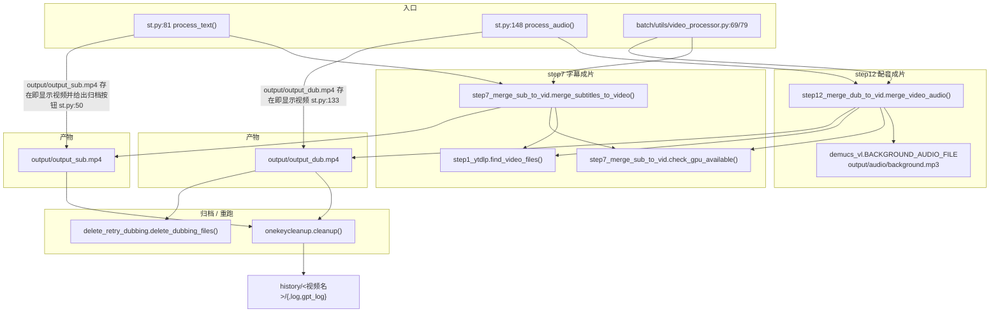

> ## ⚠️ 本文部分内容已在「重构 Round 1」后失效
>
> step12（配音成片合成）已在重构 Round 1 中删除，本文中所有 `core/step12_merge_dub_to_vid.py` 的引用与行号均已失效。**step7（字幕压制）仍是当前流水线的一部分，描述有效。** 当前流水线只到 step7，见 `00-流水线总览.md`。


## 一、职责与边界

本模块负责流水线的最后两步：把 `output/src.srt` + `output/trans.srt` 烧成**硬字幕**（burn-in）输出 `output/output_sub.mp4`（`core/step7_merge_sub_to_vid.py:41`），再把 TTS 生成的人声 `output/dub.mp3` 与原背景声 `output/audio/background.mp3` 混音并烧入 `output/dub.srt`，输出 `output/output_dub.mp4`（`core/step12_merge_dub_to_vid.py:30`）。

它**不做**字幕的时间轴 / 断句计算（那是 step5、step6 的职责，见 `core/step6_generate_final_timeline.py`），不做 TTS 合成（step10/step11），也不做分辨率适配之外的画面加工（无裁剪、无镜像、无 DAR 修正）。

`core/onekeycleanup.py` 与 `core/delete_retry_dubbing.py` 属于本模块的「归档 / 重跑」配套：前者把 `output/` 整体搬进 `history/<视频名>/`，后者删除配音产物以便重跑 step8~step12。

## 二、文件清单

| 文件路径 | 行数 | 主要职责 |
| --- | --- | --- |
| `core/step7_merge_sub_to_vid.py` | 104 | 硬字幕烧录 + 缩放补边；导出 `check_gpu_available()` 供 step12 复用 |
| `core/step12_merge_dub_to_vid.py` | 82 | 原背景声与人声混音 + 再烧一遍字幕；输出最终成片 |
| `core/onekeycleanup.py` | 81 | `cleanup()`：把 `output/` 归档到 `history/<视频名>/{,log,gpt_log}` |
| `core/delete_retry_dubbing.py` | 32 | `delete_dubbing_files()`：删 `output/dub.wav`、`output/output_dub.mp4`、`output/audio/segs/` |
| `core/json_to_subtitle.py` | 214 | 独立 CLI：从 ASR JSON 直接生成 SRT / Excel（含生成 `output/log/cleaned_chunks.xlsx`，但不烧字幕） |
| `core/step1_ytdlp.py`（`find_video_files`） | 98 | 成片阶段的**唯一**视频源定位入口 |
| `core/all_whisper_methods/demucs_vl.py` | 59 | 定义 `BACKGROUND_AUDIO_FILE = "output/audio/background.mp3"` |
| `st.py` | 180 | UI 编排：`process_text()` 调 step7，`process_audio()` 调 step12 |
| `batch/utils/video_processor.py` | 326 | 批处理编排：同样的两个函数被包进重试循环 |

## 三、调用链与数据流



上游数据来源（写文件的一方）：

| 输入文件 | 生产函数 | 位置 |
| --- | --- | --- |
| `output/<视频>.<ext>` | `download_video_ytdlp()` / `st.file_uploader` / `convert_audio_to_video()` | `core/step1_ytdlp.py:16`、`st_components/download_video_section.py:46`、`st_components/download_video_section.py:67` |
| `output/src.srt`、`output/trans.srt` | `align_timestamp_main()` 的 `SUBTITLE_OUTPUT_CONFIGS` | `core/step6_generate_final_timeline.py:22` |
| `output/audio/background.mp3` | `demucs_main()` | `core/all_whisper_methods/demucs_vl.py:16`、`:50` |
| `output/dub.mp3`、`output/dub.srt` | `merge_full_audio()` → `create_srt_subtitle()` | `core/step11_merge_full_audio.py:12`、`:14`、`:92` |

## 四、关键数据结构

常量（两个模块都是模块级字符串常量，非 dataclass）：

| 常量 | 值 | 位置 |
| --- | --- | --- |
| `OUTPUT_DIR` | `"output"` | `core/step7_merge_sub_to_vid.py:29` |
| `OUTPUT_VIDEO` | `"output/output_sub.mp4"` | `core/step7_merge_sub_to_vid.py:30` |
| `SRC_SRT` | `"output/src.srt"` | `core/step7_merge_sub_to_vid.py:31` |
| `TRANS_SRT` | `"output/trans.srt"` | `core/step7_merge_sub_to_vid.py:32` |
| `DUB_VIDEO` | `"output/output_dub.mp4"` | `core/step12_merge_dub_to_vid.py:16` |
| `DUB_SUB_FILE` | `"output/dub.srt"` | `core/step12_merge_dub_to_vid.py:17` |
| `DUB_AUDIO` | `"output/dub.mp3"` | `core/step12_merge_dub_to_vid.py:18` |
| `BACKGROUND_AUDIO_FILE` | `os.path.join("output/audio", "background.mp3")` | `core/all_whisper_methods/demucs_vl.py:16` |

样式常量（ASS 颜色格式 `&HBBGGRR`，注意是 **BGR 不是 RGB**）：

| 常量 | 值 | 作用 |
| --- | --- | --- |
| `SRC_FONT_SIZE` / `TRANS_FONT_SIZE` | `15` / `17`（step7）、`20`（step12） | libass `FontSize` |
| `FONT_NAME` / `TRANS_FONT_NAME` | Windows/macOS `Arial`；Linux `NotoSansCJK-Regular` | 由 `platform.system()` 决定，`core/step7_merge_sub_to_vid.py:16`、`core/step12_merge_dub_to_vid.py:22` |
| `SRC_FONT_COLOR` / `SRC_OUTLINE_COLOR` / `SRC_OUTLINE_WIDTH` / `SRC_SHADOW_COLOR` | `&HFFFFFF` / `&H000000` / `1` / `&H80000000` | 原文字幕：白字黑边带阴影 |
| `TRANS_FONT_COLOR` / `TRANS_OUTLINE_COLOR` / `TRANS_OUTLINE_WIDTH` / `TRANS_BACK_COLOR` | `&H00FFFF` / `&H000000` / `1` / `&H33000000` | 译文字幕：黄字 + 半透明底框（`BorderStyle=4` 即背景框模式） |

落盘产物清单：

| 路径 | 生产者 | 说明 |
| --- | --- | --- |
| `output/output_sub.mp4` | `merge_subtitles_to_video()` | 硬字幕成片（仅字幕） |
| `output/output_dub.mp4` | `merge_video_audio()` | 成片（配音 + 硬字幕） |
| `output/src.srt` / `output/trans.srt` / `output/src_trans.srt` / `output/trans_src.srt` | step6 | 四份字幕文本，供打包下载 |
| `output/dub.srt` | step11 | 与 `dub.mp3` 时间轴一致的字幕 |
| `output/cost.txt` | `easy_util.record_messages()` | 耗时与 token 统计 |
| `history/<视频名>/` | `cleanup()` | 归档目录（含 `log/`、`gpt_log/`） |

## 五、逐函数/逐模块实现说明

### 5.1 `check_gpu_available()` —— `core/step7_merge_sub_to_vid.py:34`

签名 `check_gpu_available() -> bool`。执行 `subprocess.run(['ffmpeg', '-encoders'], capture_output=True, text=True)`，在 stdout 里字符串匹配 `'h264_nvenc'`（`core/step7_merge_sub_to_vid.py:36-37`）。

| 要点 | 说明 |
| --- | --- |
| 异常处理 | 裸 `except`，任何异常返回 `False`（`:38-39`） |
| 探测对象 | **只探测 ffmpeg 是否编译了 nvenc，不探测显卡是否存在**；无 N 卡但 ffmpeg 带 nvenc 时仍会走 GPU 分支并失败 |
| 调用者 | step7 自身（`:79`）、step12（`:70`，通过 `from core.step7_merge_sub_to_vid import check_gpu_available`，`:12`） |
| 副作用 | 无写文件；每次调用都会完整执行一次 `ffmpeg -encoders` |

### 5.2 `merge_subtitles_to_video()` —— `core/step7_merge_sub_to_vid.py:41`

签名 `merge_subtitles_to_video() -> None`。

| 步骤 | 行为 | 行号 |
| --- | --- | --- |
| 1 | `load_key("resolution")`，按 `'x'` 拆成 `TARGET_WIDTH` / `TARGET_HEIGHT` | `:42-43` |
| 2 | `find_video_files()` 定位源视频 | `:44` |
| 3 | `os.makedirs(os.path.dirname(OUTPUT_VIDEO), exist_ok=True)`（即 `output/`） | `:45` |
| 4 | 若 `resolution == '0x0'`：走占位分支（见 5.3），直接 `return` | `:48-59` |
| 5 | 若 `output/src.srt` 或 `output/trans.srt` 缺失：`print` 后 `exit(1)` | `:61-63` |
| 6 | 拼装 ffmpeg 列表（见下），GPU 可用则追加 `-c:v h264_nvenc` | `:65-84` |
| 7 | 追加 `-y` 与输出路径，`subprocess.Popen` 执行并 `wait()`，按 returncode 打印成功/失败 | `:86-99` |

关键：**这是硬字幕（burn-in）**。ffmpeg 的 `subtitles` 滤镜把 SRT 渲染进像素，输出文件不再带字幕流。

完整命令（视频为 `output/in.mp4`、resolution 为 `1920x1080` 时的等价形式；命令实际以 `list[str]` 传给 `subprocess.Popen`，`-vf` 参数在 `:76` 被 `.encode('utf-8')` 编码）：

```
ffmpeg -i output/in.mp4 \
  -vf "scale=1920:1080:force_original_aspect_ratio=decrease,pad=1920:1080:(ow-iw)/2:(oh-ih)/2,subtitles=output/src.srt:force_style='FontSize=15,FontName=Arial,PrimaryColour=&HFFFFFF,OutlineColour=&H000000,OutlineWidth=1,ShadowColour=&H80000000,BorderStyle=1',subtitles=output/trans.srt:force_style='FontSize=17,FontName=Arial,PrimaryColour=&H00FFFF,OutlineColour=&H000000,OutlineWidth=1,BackColour=&H33000000,Alignment=2,MarginV=27,BorderStyle=4'" \
  -c:v h264_nvenc \
  -y output/output_sub.mp4
```

| 参数 | 含义 | 来源 |
| --- | --- | --- |
| `scale=W:H:force_original_aspect_ratio=decrease` | 等比缩放到「不超过」目标框 | `:68` |
| `pad=W:H:(ow-iw)/2:(oh-ih)/2` | 居中补边到恰好 W×H | `:69` |
| 滤镜链顺序 | `scale` → `pad` → `subtitles(src)` → `subtitles(trans)`，即两路字幕串行叠加 | `:67-75` |
| `Alignment=2` | libass 底部居中（仅译文字幕设置） | `:75` |
| `MarginV=27` | 距底部 27 像素 | `:75` |
| `BorderStyle=1` / `4` | 1=描边+阴影；4=不透明背景框 | `:72`、`:75` |
| 编码器 | 检测到 nvenc 时 `-c:v h264_nvenc`，否则**不指定** `-c:v`（交给 ffmpeg 按 `.mp4` 后缀选默认编码器，本机默认是 `libx264`） | `:82`、`:83-84` |
| 音频 | 完全未指定 → 走 ffmpeg 默认流选择与重编码（mp4 默认 aac） | — |
| `-y` | 覆盖已有 `output/output_sub.mp4` | `:86` |

### 5.3 `resolution == '0x0'` 的占位黑视频

两个模块各有**一份重复实现**，产物不同、行为相同：

| 模块 | 行号 | 产物 | 分辨率/帧率 |
| --- | --- | --- | --- |
| step7 | `:48-59` | `output/output_sub.mp4` | `cv2.VideoWriter(..., 1, (1920, 1080))`，1 fps、写 1 帧 |
| step12 | `:35-46` | `output/output_dub.mp4` | 同上 |

实现细节：`numpy.zeros((1080, 1920, 3))` 造一帧黑图（`:52`），`cv2.VideoWriter_fourcc(*'mp4v')`（`:53`），写一帧后 `release()`（`:55-56`）。**不用 ffmpeg**，因此该分支即便 ffmpeg 缺失也能出文件。

占位视频时长由「1 帧 ÷ 1 fps」决定（约 1 秒或 0 秒，取决于解复用器对单帧的处理），代码自身的提示文案写的是 “A 0-second black video will be generated as a placeholder”（`:49`、`core/step12_merge_dub_to_vid.py:36`）。⚠️ 需人工确认：单帧 mp4v 容器实际报告时长为多少（不同 ffmpeg/opencv 版本表现可能不同，未实测）。

配套逻辑：`st.py:61` 与 `st.py:139` 用 `load_key("resolution") != "0x0"` 决定是否 `st.video(...)` 预览；`st_components/sidebar_setting.py:165` 的 “Burn-in Subtitles” 开关关闭时会把 `resolution` 写回 `"0x0"`（`:180`、`:183`）。批处理同样在 `batch/utils/video_processor.py:68` 跳过 step7。

### 5.4 `merge_video_audio()` —— `core/step12_merge_dub_to_vid.py:30`

签名 `merge_video_audio() -> None`。

| 步骤 | 行为 | 行号 |
| --- | --- | --- |
| 1 | `find_video_files()` 拿源视频；`background_file = BACKGROUND_AUDIO_FILE` | `:32-33` |
| 2 | `resolution == '0x0'` → 占位黑视频分支并 `return` | `:35-46` |
| 3 | 读 `dub_volume`、`resolution`，拆宽高 | `:49-51` |
| 4 | 拼 `subtitle_filter`（与 step7 译文样式一致，但 `TRANS_FONT_SIZE = 20`） | `:53-58` |
| 5 | `-filter_complex` 做视频缩放补边 + 双路字幕 + 音量 + amix | `:60-68` |
| 6 | GPU 可用则 `-map [v] -map [a] -c:v h264_nvenc`，否则只 `-map` | `:70-74` |
| 7 | 追加 `-c:a aac -b:a 192k` + 输出路径，`subprocess.run(cmd)`（**不检查 returncode**） | `:76-79` |

完整命令：

```
ffmpeg -y -i output/in.mp4 -i output/audio/background.mp3 -i output/dub.mp3 \
  -filter_complex "[0:v]scale=1920:1080:force_original_aspect_ratio=decrease,pad=1920:1080:(ow-iw)/2:(oh-ih)/2,subtitles=output/dub.srt:force_style='FontSize=20,FontName=Arial,PrimaryColour=&H00FFFF,OutlineColour=&H000000,OutlineWidth=1,BackColour=&H33000000,Alignment=2,MarginV=27,BorderStyle=4'[v];[1:a]volume=1[a1];[2:a]volume=1.5[a2];[a1][a2]amix=inputs=2:duration=first:dropout_transition=3[a]" \
  -map [v] -map [a] -c:v h264_nvenc \
  -c:a aac -b:a 192k output/output_dub.mp4
```

| 参数 | 含义 | 来源 |
| --- | --- | --- |
| 输入顺序 | `[0:v]` 原视频；`[1:a]` `output/audio/background.mp3`；`[2:a]` `output/dub.mp3` | `:61` |
| `volume=1` | 背景声**不动音量**（即 100%） | `:66` |
| `volume={dub_volume}` | 人声乘 `dub_volume`；当前 `config.yaml:178` 为 `1.5` → 150% | `:49`、`:66` |
| `amix=inputs=2:duration=first:dropout_transition=3` | 两路混音；**长度以第一个输入（背景声）为准**；某一路提前结束时 3 秒内渐出而非硬切 | `:67` |
| `-c:a aac -b:a 192k` | 输出音频固定 AAC 192 kbps | `:76` |
| `-map [v] -map [a]` | 显式选滤镜输出的视频/音频，丢弃源文件的其它轨道 | `:72`、`:74` |
| 覆盖行为 | `-y` 在最前面（`cmd` 第 2 个元素） | `:61` |
| 失败处理 | `subprocess.run(cmd)` 返回值未接收，ffmpeg 失败后仍会打印 `Video and audio successfully merged into output/output_dub.mp4` | `:78-79` |

### 5.5 `cleanup()` —— `core/onekeycleanup.py:7`

签名 `cleanup(history_dir="history") -> None`。

| 步骤 | 行为 | 行号 |
| --- | --- | --- |
| 1 | `find_video_files()` → `video_file.split("/")[1]` → 去扩展名 → `sanitize_filename()` | `:9-12` |
| 2 | 建 `history/<视频名>/`、`.../log/`、`.../gpt_log/` | `:15-20` |
| 3 | `glob("output/*")` 中不以 `log` / `gpt_log` **结尾**的项移入 `history/<视频名>/` | `:23-25` |
| 4 | `glob("output/log/*")` → `.../log/`；`glob("output/gpt_log/*")` → `.../gpt_log/` | `:28-33` |
| 5 | `os.rmdir` 依次尝试删除 `output/log`、`output/gpt_log`、`output`，`OSError` 静默忽略 | `:36-41` |

`sanitize_filename()`（`:73`）把 `<` `>` `:` `"` `/` `\` `|` `?` `*` 这 9 个字符替换为 `_`；`move_file()`（`:43`）目标已存在时：目标是目录则 `shutil.rmtree`、是文件则 `os.remove`，移动用 `shutil.move(..., copy_function=shutil.copy2)`；`PermissionError` 时降级为 `shutil.copy2` + `os.remove`（`:60-68`），其余异常仅打印。

### 5.6 `delete_dubbing_files()` —— `core/delete_retry_dubbing.py:5`

签名 `delete_dubbing_files() -> None`。按序删除 `output/dub.wav`、`output/output_dub.mp4`（`:7-8`），再 `shutil.rmtree("output/audio/segs")`（`:21-24`）。逐项 try/except，不存在或失败只打印（`:16-19`、`:26-27`）。UI 入口是 `st.py:141-143` 的「删除配音文件」按钮（`key="delete_dubbing_files"`）。

### 5.7 `json_to_subtitle.py` 与成片的关系

该脚本是**独立 CLI**（`python core/json_to_subtitle.py <json> -s output/xxx.srt`），从 ASR JSON 反向产出 SRT 与 `output/log/cleaned_chunks.xlsx`；默认参数 `--output-srt output/subtitles.srt`（`:165`）、`--output-excel output/log/cleaned_chunks.xlsx`（`:167`），`extract_segments()` 支持 `segments` / `converted_result.segments` / `original_result.result` 三种 JSON 形状（`:64-89`）。

与成片的实际关联点只有一个：它写的 `output/log/cleaned_chunks.xlsx` 正是 step3/step6 读的输入（`core/step6_generate_final_timeline.py:15`）。它**不生成** `src.srt` / `trans.srt`，也**不调用** step7，所以想「用已有 JSON 出片」必须补齐 `src.srt` + `trans.srt`（或直接手工喂 ffmpeg）。详见 `../06-batch-and-tools/` 与 `../02-pipeline/05-字幕切分与时间轴.md`。

## 六、关键参数与配置

| config.yaml 键 | 当前值 | 被谁读 | 影响 |
| --- | --- | --- | --- |
| `resolution` | `'0x0'`（`config.yaml:97`） | `core/step7_merge_sub_to_vid.py:42`、`core/step12_merge_dub_to_vid.py:50`、`st.py:61`、`st.py:139`、`batch/utils/video_processor.py:68`、`st_components/sidebar_setting.py:165` | `'0x0'` 只出 1 帧黑视频；合法档位只有 `1920x1080`（1080p）与 `640x360`（360p），见 `st_components/sidebar_setting.py:167-170` |
| `dub_volume` | `1.5`（`config.yaml:178`） | `core/step12_merge_dub_to_vid.py:49` | 直接写进 `volume=` 滤镜；人声相对背景声的增益 |
| `allowed_video_formats` | `mp4/mov/avi/mkv/flv/wmv/webm`（`config.yaml:185-192`） | `core/step1_ytdlp.py:82`（经 `find_video_files`） | 决定源视频能否被识别；不在列表内的容器会直接触发「视频数不唯一」异常 |
| `model_dir` | `'./_model_cache'`（`config.yaml:182`） | 与成片无关，列出仅为对照 | — |

注释里标注 `0x0 will generate a 0-second black video placeholder`（`config.yaml:96`），与代码行为一致。

## 七、技术要点与坑

1. **`find_video_files()` 是成片阶段最脆的一环**（`core/step1_ytdlp.py:81-90`）。
   - 扫描 `output/*`（固定 `save_path='output'`），扩展名小写后必须命中 `allowed_video_formats`；
   - Windows 下把 `\` 换成 `/`（`:84-85`），所以返回的是**正斜杠路径**；
   - 排除以 `output/output` 开头的文件（`:86`）——正是为了不把 `output_sub.mp4` / `output_dub.mp4` 当成源视频；
   - **数量必须恰好为 1**，否则 `raise ValueError`（`:88-89`）。任何多出来的 `output/black_screen.mp4`、手工放的样例视频、上一轮没归档的源视频都会让 step7/step12 直接抛错。
2. **step12 强依赖 `output/audio/background.mp3`**。该文件只在 `demucs: true` 时由 `demucs_main()` 写出（`core/step2_whisperX.py:342-343`、`core/all_whisper_methods/demucs_vl.py:50`）。当前 `config.yaml:40` 是 `demucs: false` → 文件不存在 → step12 的 `-i output/audio/background.mp3` 会失败（且因不检查 returncode 仍打印成功）。⚠️ 需人工确认：在 `demucs: false` 路径下 `background.mp3` 究竟由谁产生（全仓库仅此一处写入）。
3. **`amix` 会让每一路音量衰减**。两路输入时 ffmpeg 的 `amix` 默认做 `1/inputs` 归一化，`dub_volume=1.5` 实际听感约为 0.75 倍；`duration=first` 又使输出长度取决于背景声，若背景声短于 `dub.mp3`，**人声尾部会被截断**。
4. **`-c:v h264_nvenc` 后面没有显式质量参数**，用的是 nvenc 默认（约 `-cq 23`/`-b:v 2M` 量级）。CPU 分支完全不指定 `-c:v`，靠容器后缀决定编码器——想固定行为必须显式写。
5. **`0x0` 分支用 OpenCV 不用 ffmpeg**，所以 `output/output_sub.mp4` 的帧率是 **1 fps**，编辑软件里时间轴会很难看；同时该分支**不检查 SRT 是否存在**（`:48-59` 在 `:61` 的检查之前 `return`）。
6. **`onekeycleanup.cleanup()` 会清空 `output/`**，之后 `find_video_files()` 必然抛 ValueError，UI 上的成片预览按钮（`st.py:50`、`:133` 依赖 `os.path.exists`）也会消失。批处理里 `cleanup()` 在 `batch/utils/video_processor.py:4` 导入、在归档步骤调用。
7. **`cleanup()` 的视频名提取在 Windows 上是隐患**：`video_file.split("/")[1]`（`core/onekeycleanup.py:10`）依赖 `find_video_files()` 已经做过 `\`→`/` 替换；若 `save_path` 变成带子目录的路径，取到的只是第一层目录名。
8. **`cleanup()` 的 log 三连移动是死代码**：`glob("output/*")` 拿到的是 `output/log`、`output/gpt_log`（以 `log` / `gpt_log` 结尾，因而被跳过）和 `output/audio`（**不以 log 结尾，会被整体搬进 `history/<视频名>/audio`**），随后 `:36-41` 的 `os.rmdir("output/log")` 因目录已空才可能成功。
9. **`json_to_subtitle.py` 输出的 `output/subtitles.srt` 不会被任何成片步骤消费**，容易被误当成交付物。
10. **改这些地方会影响谁**：
    - 改 `SRC_FONT_SIZE` / `TRANS_FONT_SIZE` / `FONT_NAME`（`core/step7_merge_sub_to_vid.py:10-13`、`core/step12_merge_dub_to_vid.py:20-21`）→ 三处字幕观感（step7 原文、step7 译文、step12 译文），step12 的字号与 step7 的 `TRANS_FONT_SIZE` **不一致（17 vs 20）**，改一处会看到两个成片风格不同；
    - 改 `allowed_video_formats` → 同时影响 UI 上传白名单（`st_components/download_video_section.py:46`）与 `find_video_files()`；
    - 改 `check_gpu_available()` → 同时影响 step7 与 step12；
    - 改 `resolution` → 影响 step7/step12 的 scale/pad 目标、是否走占位分支、UI 是否预览视频、批处理是否跳过 step7。

## 八、扩展点

| 目标 | 改动位置 | 注意事项 |
| --- | --- | --- |
| 换编码器（如 libx264 / h265 / av1） | `core/step7_merge_sub_to_vid.py:79-84`、`core/step12_merge_dub_to_vid.py:70-74` | 目前是「GPU 有就 nvenc，没有就啥都不加」。建议引入 config 键（如 `video.encoder`），并同时补 `-pix_fmt yuv420p`（libx264 + 滤镜链产物可能不是 yuv420p，某些播放器会花屏） |
| 加字幕样式（字体、字号、位置） | `core/step7_merge_sub_to_vid.py:10-27`、`core/step12_merge_dub_to_vid.py:20-28` 的常量，或把 `force_style` 抽成配置 | `force_style` 里逗号是分隔符，样式值本身不能含逗号；Linux 需要 `NotoSansCJK-Regular`（`install.py:194` 装 `fonts-noto` / `google-noto*`） |
| 多语言输出（同时出多份 srt 对应的成片） | 新增一个循环调用 `merge_subtitles_to_video()` 的包装函数 | 现在函数内部把 `SRC_SRT`/`TRANS_SRT`/`OUTPUT_VIDEO` 写死为模块常量，必须先参数化（建议签名改成 `merge_subtitles_to_video(src_srt=..., trans_srt=..., out=...)`） |
| 软字幕方案（可开关的字幕流） | 在现有 `-vf` 之外改用 `-i trans.srt -c:s mov_text` 并把 `subtitles` 滤镜变为可选 | 软字幕能保留源画质（可 `-c:v copy`），但 `output_dub.mp4` 的 `filter_complex` 会强制重编码视频；建议拆成「先混音出无字幕成片，再 copy 封装软字幕」两步 |
| 只输出无字幕成片 | 复制 step12 的命令，去掉 `subtitles=...` 一段 | 注意 `filter_complex` 仍需 `[v]` 标签与 `-map [v]` |
| 新增“归档”行为（保留源视频） | `core/onekeycleanup.py:23-25` | 当前 `glob("output/*")` 会把源视频也搬走；若要保留，需在循环里排除 `find_video_files()` 的返回值 |
| 重跑配音时清得更干净 | `core/delete_retry_dubbing.py:6-9` 的 `files_to_delete` | 当前不删 `output/dub.mp3`、`output/dub.srt`、`output/audio/tts_tasks.xlsx`；step11 的 `merge_full_audio()` 也没有「已存在即跳过」检查，重跑前建议一并删 |

> 💡 建议：把 `resolution` 的 `'0x0'` 魔法值与占位黑视频逻辑抽成一个共用函数（现在 step7 `:48-59` 与 step12 `:35-46` 是两份几乎相同的拷贝，占位宽度写死 `(1920, 1080)`，与 `resolution` 语义无关）。

## 九、验证方式

前提：cwd 必须是项目根目录（代码里 `output/...`、`config.yaml` 都是相对路径），且 PATH 含项目根目录（见 `st.py:8-9`）。

```powershell
# 0) 让 ffmpeg.exe 可被找到（st.py 在启动时做的同一件事）
$env:PATH = 'E:\VideoLingo\VideoLingoMove' + [IO.Path]::PathSeparator + $env:PATH
ffmpeg -version                      # 应输出 ffmpeg version N-117740-g7f51cf75c6-20241110
ffmpeg -hide_banner -encoders | Select-String 'h264_nvenc|libx264|aac'
```

```powershell
# 1) 单独跑 step7（需先有 output/源视频 + output/src.srt + output/trans.srt）
python -c "from core.step7_merge_sub_to_vid import merge_subtitles_to_video as f; f()"

# 2) 单独跑 step12（需先有 output/audio/background.mp3 + output/dub.mp3 + output/dub.srt）
python core/step12_merge_dub_to_vid.py

# 3) 只探 GPU 分支
python -c "from core.step7_merge_sub_to_vid import check_gpu_available as g; print(g())"
```

```powershell
# 4) 校验产物：应为 h264(v) + aac/192k(a)，且没有字幕流（硬字幕特征）
ffprobe -v error -show_entries stream=index,codec_name,codec_type,width,height,r_frame_rate,bit_rate -of default=nw=1 output\output_dub.mp4
ffprobe -v error -show_entries stream=codec_type -of csv=p=0 output\output_sub.mp4   # 只应出现 video / audio

# 5) 归档与重跑
python -c "from core.onekeycleanup import cleanup; cleanup()"
python core/delete_retry_dubbing.py
```

最小 ffmpeg 复现（不依赖 Python，用于隔离「样式问题 vs 代码问题」）：

```powershell
ffmpeg -y -f lavfi -i "color=c=black:s=640x360:d=3" -f lavfi -i "sine=frequency=440:duration=3" `
  -vf "subtitles=output/dub.srt:force_style='FontSize=20,FontName=Arial,PrimaryColour=&H00FFFF,BackColour=&H33000000,Alignment=2,MarginV=27,BorderStyle=4'" `
  -c:v libx264 -pix_fmt yuv420p -c:a aac -b:a 192k -shortest tmp_check.mp4
```

## 十、相关文档

- [`00-流水线总览.md`](00-流水线总览.md) —— step1~step12 的串行关系与跳过条件
- [`01-下载与音频提取.md`](01-下载与音频提取.md) —— `find_video_files()`、`output/` 目录布局的来源
- [`05-字幕切分与时间轴.md`](05-字幕切分与时间轴.md) —— `src.srt` / `trans.srt` / `dub.srt` 的时间轴生成
- [`07-配音音频生成.md`](07-配音音频生成.md) —— `dub.mp3` 与 TTS 分段
- [`../03-subsystems/02-TTS引擎适配层.md`](../03-subsystems/02-TTS引擎适配层.md)
- [`../04-interfaces/01-配置文件与参数.md`](../04-interfaces/01-配置文件与参数.md) —— `resolution`、`dub_volume` 的完整定义
- [`../04-interfaces/03-批处理任务系统.md`](../04-interfaces/03-批处理任务系统.md) —— 批处理如何复用这两个成片函数
- [`../05-guides/03-如何新增一个流水线步骤.md`](../05-guides/03-如何新增一个流水线步骤.md)
- [`../06-batch-and-tools/02-安装脚本与依赖.md`](../06-batch-and-tools/02-安装脚本与依赖.md) —— ffmpeg 从哪来、PATH 如何注入
- [`../00-overview/02-数据流与中间产物.md`](../00-overview/02-数据流与中间产物.md)
