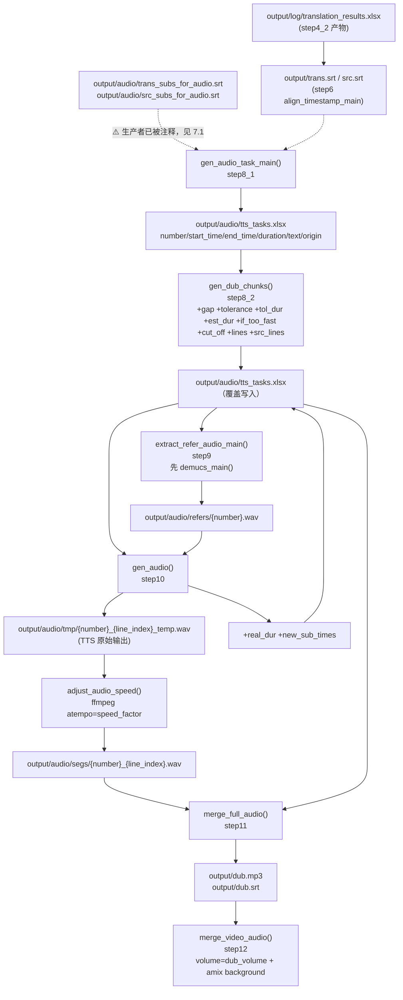

> # ⚠️ 本文档描述的功能已在重构 Round 1 中**物理删除**
>
> 以下文件**在仓库中已不存在**，本文的代码引用与行号全部失效：
> `core/step8_1_gen_audio_task.py`、`core/step8_2_gen_dub_chunks.py`、`core/step9_extract_refer_audio.py`、
> `core/step10_gen_audio.py`、`core/step11_merge_full_audio.py`、`core/step12_merge_dub_to_vid.py`、
> `core/delete_retry_dubbing.py`、`core/all_tts_functions/*`（含 `tts_main.py`）。
> （2026-09-16 复核：上述路径确实都不在仓库中；`core/` 下现在只有 step1~step7 与 `subtitle_trim.py` / `estimate_duration.py` 等无配音依赖的模块。）
>
> - 本文**不是现状描述**。当前流水线只到 **step7**，见 [`00-流水线总览.md`](00-流水线总览.md)。
> - 保留本文的原因：其中的**时间轴规划、变速算法、整轨拼接**等分析在未来恢复配音功能时仍有参考价值。
> - 删除原因、迁移去向与影响面见 [`../05-guides/04-已知问题与技术债.md`](../05-guides/04-已知问题与技术债.md)。
> - ⚠️ 唯一被保留复用的部分已迁出：`check_len_then_trim()` → `core/subtitle_trim.py`；`estimate_duration.py` → `core/estimate_duration.py`。

---

# 配音音频生成（历史文档）

## 一、职责与边界

这一段负责把「翻译后的字幕」变成「一条与原视频时间轴对齐的配音音轨」：生成配音任务表 → 规划分块与语速 → 从 Demucs 人声轨切出参考音频 → 逐条调用 TTS 合成并变速对齐 → 按时间轴拼成整轨 `output/dub.mp3`。

它**不负责**：TTS 引擎自身的实现（见 [`../03-subsystems/02-TTS引擎适配层.md`](../03-subsystems/02-TTS引擎适配层.md)）、视频压制与音画混合（`core/step12_merge_dub_to_vid.py`）、字幕文本的翻译与压缩（step4/step5/step6）。

关键边界事实：本段的所有步骤都假设 **cwd = 项目根**，并且**只通过文件系统传递数据**——`output/audio/tts_tasks.xlsx` 一个 Excel 就是 step8_2/step9/step10/step11 之间的全部接口（列名即 schema，见第四节）。

---

## 二、文件清单

| 文件路径 | 行数 | 主要职责 |
| --- | --- | --- |
| `core/step8_1_gen_audio_task.py` | 150 | 解析 `output/audio/{trans,src}_subs_for_audio.srt` → 生成 `output/audio/tts_tasks.xlsx`；包含 `min_subtitle_duration` 合并/延长逻辑与 `check_len_then_trim()`（当前已停用） |
| `core/step8_2_gen_dub_chunks.py` | 211 | 计算 gap / tolerance / tol_dur / est_dur / if_too_fast，规划 `cut_off` 分块点，把 task 行与 `output/trans.srt`、`output/src.srt` 的逐行文本对齐，回写同一个 xlsx |
| `core/step9_extract_refer_audio.py` | 59 | 先跑 `demucs_main()` 保证有人声轨，再按行时间戳从 `output/audio/vocal.mp3` 切出 `output/audio/refers/{number}.wav` |
| `core/step10_gen_audio.py` | 238 | 主生成循环：warmup 串行 + ThreadPoolExecutor 并发调 `tts_main()`（写 `output/audio/tmp/`）→ 逐 chunk 算 `speed_factor` → ffmpeg `atempo` 变速产出 `output/audio/segs/{number}_{line_index}.wav` → 重算 `new_sub_times` 并回写 xlsx |
| `core/step11_merge_full_audio.py` | 142 | 按 `new_sub_times` 把 segs 拼成整轨（补静音、统一 16kHz 单声道 64kbps），导出 `output/dub.mp3`，同时写 `output/dub.srt` |
| `core/delete_retry_dubbing.py` | 32 | UI「删除配音文件」按钮的实现：删 `output/dub.wav`（⚠️ 陈旧路径）、`output/output_dub.mp4` 与整个 `output/audio/segs/` 目录 |
| `core/all_tts_functions/tts_main.py` | 82 | 被 step10 调用的统一 TTS 入口（文字清洗 / 跳过已存在 / 3 次重试 / 零时长兜底） |
| `core/all_whisper_methods/demucs_vl.py` | 59 | `demucs_main()` 产出 `output/audio/vocal.mp3` 与 `output/audio/background.mp3`，被 step9 与 step12 复用 |
| `st.py` | 180 | 交互式编排：`process_audio()`（`st.py:148-162`）串起 step8_1→step12；`audio_processing_section()`（`st.py:121-146`）提供按钮与完成判定 |
| `batch/utils/video_processor.py` | 358 | 批处理编排。⚠️ 本文提到的 `dubbing_steps` 与 `gen_audio_tasks()` **均已随配音链路删除**，该文件现在只剩预处理/翻译/字幕/压制相关的步骤表与统计逻辑 |

---

## 三、调用链与数据流

### 3.1 真实调用链（交互式，`st.py`）

```
st.py:148 process_audio()
├─ step8_1_gen_audio_task.gen_audio_task_main()      # st.py:150
│   └─ process_srt()                                 # step8_1:56
│       ├─ open('output/audio/trans_subs_for_audio.srt')   # step8_1:59
│       ├─ open('output/audio/src_subs_for_audio.srt')     # step8_1:62
│       ├─ time_diff_seconds()                        # step8_1:50
│       └─ df.to_excel('output/audio/tts_tasks.xlsx') # step8_1:145
├─ step8_2_gen_dub_chunks.gen_dub_chunks()            # st.py:151
│   ├─ pd.read_excel('output/audio/tts_tasks.xlsx')   # step8_2:139
│   ├─ analyze_subtitle_timing_and_speed(df)          # step8_2:63
│   │   ├─ get_audio_duration('output/audio/raw.mp3') # step8_2:69
│   │   └─ estimate_duration(text, ESTIMATOR)         # step8_2:84
│   ├─ process_cutoffs(df)                            # step8_2:106
│   │   ├─ calc_if_too_fast()  (module-level)         # step8_2:20
│   │   └─ merge_rows()                               # step8_2:31
│   └─ df.to_excel('output/audio/tts_tasks.xlsx')     # step8_2:207（覆盖同一文件）
├─ step9_extract_refer_audio.extract_refer_audio_main()   # st.py:153
│   ├─ demucs_vl.demucs_main()                        # step9:31
│   ├─ pd.read_excel('output/audio/tts_tasks.xlsx')   # step9:40
│   ├─ soundfile.read('output/audio/vocal.mp3')       # step9:41
│   └─ sf.write('output/audio/refers/{number}.wav')   # step9:52-53
├─ step10_gen_audio.gen_audio()                       # st.py:155
│   ├─ generate_tts_audio(tasks_df)                   # step10:82
│   │   └─ process_row(row, tasks_df)                 # step10:71
│   │       └─ tts_main.tts_main(line, temp_file, number, task_df)  # step10:78
│   │           └─ {openai_tts | gpt_sovits_tts_for_videolingo | fish_tts | azure_tts
│   │               | siliconflow_fish_tts_for_videolingo | edge_tts | custom_tts}
│   ├─ merge_chunks(tasks_df)                         # step10:147
│   │   ├─ process_chunk(chunk_df, accept, min_speed)  # step10:124
│   │   └─ adjust_audio_speed(temp, segs, speed_factor)  # step10:36
│   └─ tasks_df.to_excel('output/audio/tts_tasks.xlsx')  # step10:234
└─ step11_merge_full_audio.merge_full_audio()         # st.py:157
    ├─ load_and_flatten_data('output/audio/tts_tasks.xlsx')  # step11:18
    ├─ get_audio_files(df)                            # step11:29
    ├─ create_srt_subtitle() → 'output/dub.srt'       # step11:92
    └─ merge_audio_segments() → 'output/dub.mp3'      # step11:56 / 133
→ step12_merge_dub_to_vid.merge_video_audio()          # st.py:159
```

### 3.2 端到端流程图



### 3.3 幂等条件（「存在即跳过」）一览

| 步骤 | 跳过条件（真实代码） | 是否真幂等 |
| --- | --- | --- |
| step8_1 `gen_audio_task_main()` | `os.path.exists('output/audio/tts_tasks.xlsx')`（`step8_1:140`） | ✅ 是，但**改了 `min_subtitle_duration` 也不会重算** |
| step8_2 `gen_dub_chunks()` | **无任何存在性检查**，每次读入后覆盖写回（`step8_2:139/207`） | ❌ 每次全量重算；会丢弃 step10 上一轮写入的 `real_dur`/`new_sub_times` 语义（列还在，但值会被 step10 重置） |
| step9 `extract_refer_audio_main()` | ① `demucs_main()` 内部：`vocal.mp3` 与 `background.mp3` 同时存在 → 跳过分离（`demucs_vl.py:28`）<br>② `os.path.exists('output/audio/segs/1.wav')` → 跳过切参考音频（`step9:32`） | ⚠️ ②的守卫指向的是 **segs** 目录而不是它实际写入的 **refers** 目录，正常流程下该文件不存在，等于**守卫失效**（见 7.3） |
| step10 `gen_audio()` | 顶层无检查；**逐条**在 `tts_main()` 里跳过：`if os.path.exists(save_as): return`（`tts_main.py:37`），`save_as` = `output/audio/tmp/{number}_{line_index}_temp.wav` | ⚠️ 半幂等：TTS 不会重合成，但速度变换 → segs → 整轨每次都会重跑 |
| step11 `merge_full_audio()` | 无检查 | ❌ 每次重新拼接并覆盖 `output/dub.mp3`/`output/dub.srt` |
| step12 `merge_video_audio()` | 无检查，但 UI 用 `os.path.exists('output/output_dub.mp4')` 决定是否显示「开始处理音频」按钮（`st.py:133`） | ⚠️ UI 层幂等，代码层不幂等 |

---

## 四、关键数据结构

### 4.1 `output/audio/tts_tasks.xlsx` 列定义（本段的核心契约）

列按产生顺序列出；**所有列都真实存在于最终 Excel 中**。

| 列名 | 类型 | 单位 | 由谁写入 | 含义 / 来源 |
| --- | --- | --- | --- | --- |
| `number` | int | — | step8_1 | SRT 序号（1 起），后续所有引擎按它定位参考音频与 `origin` |
| `start_time` | str `HH:MM:SS.mmm` | — | step8_1 | 该配音行的起始时间；`step8_1:130` 用 `strftime('%H:%M:%S.%f')[:-3]` 格式化 |
| `end_time` | str `HH:MM:SS.mmm` | — | step8_1 | 结束时间（可能被 `min_subtitle_duration` 强行延长，见 5.1） |
| `duration` | float | 秒 | step8_1 | `end_time - start_time` |
| `text` | str | — | step8_1 | **译文**（来自 `trans_subs_for_audio.srt`），已删除 `(...)`/`（...）` 与 `-`（`step8_1:90-93`） |
| `origin` | str | — | step8_1 | **原文**（来自 `src_subs_for_audio.srt`，按 `number` 对齐）；TTS 引擎的 `prompt_text`/`ref_text` 用它 |
| `gap` | float | 秒 | step8_2 | 本行 `end_time` 到下一行 `start_time` 的间隔；**最后一行** = `get_audio_duration('output/audio/raw.mp3') - 最后一行 end 的秒数`（`step8_2:77-80`） |
| `tolerance` | float | 秒 | step8_2 | `min(gap, config: tolerance)`（`step8_2:82`）；即「可以往后借用的时间」 |
| `tol_dur` | float | 秒 | step8_2 | `duration + tolerance`（`step8_2:83`），可占用的最大时长 |
| `est_dur` | float | 秒 | step8_2 | `estimate_duration(text, ESTIMATOR)`（`step8_2:84`），**按 `text`（译文）估算**，未除以任何 speed_factor |
| `if_too_fast` | int | — | step8_2 | `2`=即使 `accept` 倍速也放不下；`1`=需要变速；`-1`=说得太慢；`0`=正常（`step8_2:88-101`） |
| `cut_off` | int 0/1 | — | step8_2 | **=1 表示该行是一个 chunk 的「最后一行」**；step10 据此切块（`step8_2:108-133`、`step10:157`） |
| `lines` | list[str] | — | step8_2 | 该 task 行在 `output/trans.srt` 中对应的若干整行译文（1 行 task 可能由多条字幕合并而来） |
| `src_lines` | list[str] | — | step8_2 | 对应的原文行；**下游无人消费**（grep 全仓仅 `step8_2` 写入） |
| `real_dur` | float | 秒 | step10 | 该行所有 `lines` 的 TTS 音频实测时长之和（`step10:79`）；每次 `generate_tts_audio()` 开头重置为 0（`step10:84`） |
| `new_sub_times` | list[[float,float]] | 秒 | step10 | 逐 `lines` 在**配音轨**上的 `[start, end]`（`step10:178`）；step11 唯一的拼接依据 |

> ⚠️ `lines` / `src_lines` / `new_sub_times` 是 **Python list**，写进 xlsx 后变成字符串（如 `"[['a','b']]"`），下游统一用 `eval(row['lines']) if isinstance(row['lines'], str) else row['lines']` 反序列化（`step10:74`、`step10:171`、`step11:21`、`step11:24`、`step11:34`）。这是本段最容易踩的隐式约定。

### 4.2 落盘的中间产物

| 产物路径 | 生产者 | 关键格式 |
| --- | --- | --- |
| `output/audio/tts_tasks.xlsx` | step8_1 → step8_2 → step10（三次写同一文件） | 上表 16 列 |
| `output/audio/vocal.mp3` / `output/audio/background.mp3` | `demucs_main()`（step9 调用） | htdemucs 分离，64kbps，16bit |
| `output/audio/refers/{number}.wav` | `extract_refer_audio_main()` | `soundfile.write`，采样率继承 `vocal.mp3` |
| `output/audio/refers/combined_reference.wav` | `siliconflow_fish_tts.get_ref_audio()` | 多段拼接，段间插 100ms 静音，导出参数 `-acodec pcm_s16le -ar 44100 -ac 1` |
| `output/audio/tmp/{number}_{line_index}_temp.wav` | 各 TTS 引擎（经 `tts_main`） | 引擎原生格式；**从不清理**，充当 TTS 缓存 |
| `output/audio/segs/{number}_{line_index}.wav` | `adjust_audio_speed()`（step10） | ffmpeg `atempo` 变速后的段落音频 |
| `output/dub.mp3` | step11 `merge_audio_segments()` + `export()` | 16000Hz、单声道、`-b:a 64k` |
| `output/dub.srt` | step11 `create_srt_subtitle()` | 时间戳由 `new_sub_times` 秒数格式化而来 |

### 4.3 产物 → 消费者

| 产物 | 消费者 | 消费方式 |
| --- | --- | --- |
| `output/audio/tts_tasks.xlsx` | step8_2 / step9 / step10 / step11 | `pd.read_excel`；同时被 step10 回写 |
| ↳ 同上 | `tts_main.gpt_sovits_tts_for_videolingo` / `siliconflow_fish_tts_for_videolingo` | 取 `task_df[task_df['number']==number]['origin']` 作 `prompt_text`/`ref_text`（`gpt_sovits_tts.py:69`、`siliconflow_fish_tts.py:241`） |
| `output/audio/refers/{number}.wav` | `gpt_sovits`（refer_mode 2/3）、`sf_fish_tts`（dynamic）、`sf_fish_tts.get_ref_audio()`（custom） | 作为声音克隆参考音频 |
| `output/audio/refers/combined_reference.wav` | `siliconflow_fish_tts.create_custom_voice()` | base64 上传建音色 |
| `output/audio/segs/*.wav` | step11 `get_audio_files()` | 仅被拼接；被 `delete_dubbing_files()` 整目录删除 |
| `output/audio/tmp/*.wav` | 无（仅被 `tts_main` 用作存在性缓存） | 断点续跑时避免重新合成 |
| `output/dub.mp3` | **step12**（`DUB_AUDIO = 'output/dub.mp3'`，`step12_merge_dub_to_vid.py:18`） | `[2:a]volume={dub_volume}` 后与 `background.mp3` `amix`（`step12:66-67`） |
| `output/dub.srt` | **step12**（`DUB_SUB_FILE`，`step12:17`） | ffmpeg `subtitles=...` 滤镜烧进视频（`step12:53-58`） |
| `output/output_dub.mp4` | `st.py:133`（UI 显隐）、`delete_dubbing_files()`、`cleanup()` | 阶段完成标志 / 删除 / 归档 |
| `output/audio/background.mp3` | step12（`BACKGROUND_AUDIO_FILE`） | `[1:a]volume=1` 后 `amix` |
| `output/audio/raw.mp3` | step8_2 `get_audio_duration(AUDIO_FILE)` | 提供全片总时长 `whole_dur` |

> ⚠️ 任务书里提到的 `output/log/dub_audio_tasks.xlsx` 与 `output/dub.wav` **在现版本代码中都不存在**：任务表是 `output/audio/tts_tasks.xlsx`，整轨是 `output/dub.mp3`。`core/delete_retry_dubbing.py:7` 里删除的 `output/dub.wav` 是历史遗留路径（见 7.7）。

---

## 五、逐函数/逐模块实现说明

### 5.1 `core/step8_1_gen_audio_task.py`

| 函数 | 签名 | 作用与关键实现 | 副作用 / 异常 |
| --- | --- | --- | --- |
| `gen_audio_task_main` | `()` → `None` | 入口。`step8_1:140` 检查 `output/audio/tts_tasks.xlsx`，存在则打印 Panel 直接返回；否则调 `process_srt()` 并 `df.to_excel(SOVITS_TASKS_FILE, index=False)` | 写 `output/audio/tts_tasks.xlsx` |
| `process_srt` | `()` → `pd.DataFrame` | ① 读译文 SRT 与原文 SRT，按空行分块解析，原文进 `src_subtitles[number]`（`step8_1:68-75`）；② 译文块解析 `start_time/end_time/duration`，正则删除 `(...)`、`（...）`、`-`（`step8_1:90-93`）；③ 用 `min_subtitle_duration` 做「合并/延长」循环（`step8_1:106-128`）；④ 时间格式化为 `HH:MM:SS.mmm` | 解析失败只 warn 并 `continue`（`step8_1:98-100`）；文件缺失直接 `FileNotFoundError` |
| `check_len_then_trim` | `(text: str, duration: float)` → `str` | 用 `estimate_duration(text, ESTIMATOR) / speed_factor['max']` 估朗读时长（`step8_1:26`）；超过 `duration` 则调 `ask_gpt(get_subtitle_trim_prompt(text, duration), response_json=True, log_title='subtitle_trim', valid_def=valid_trim)` 让 LLM 压缩（`step8_1:40`）；LLM 失败（敏感内容等）时**降级为删标点**：`re.sub(r'[,.!?;:，。！？；：]', ' ', text).strip()`（`step8_1:44`）；未超时返回原文 | 调 LLM（`output/gpt_log/subtitle_trim.json` 缓存） |
| `time_diff_seconds` | `(t1: time, t2: time, base_date: date)` → `float` | 把两个 `datetime.time` 挂到同一基准日相减 | 被 `step8_2` 复用（`step8_2:6`） |

**`min_subtitle_duration` 合并/延长规则（`step8_1:106-128`，逐行扫描 `while i < len(df)`）：**

| 条件 | 动作 |
| --- | --- |
| `duration < MIN_SUB_DUR` 且下一行 `start_time - 当前 start_time < MIN_SUB_DUR` | **合并**：`text`/`origin` 用空格拼接，`end_time` 取下一行，`duration` 重算，`df.drop(i+1)`；`i` 不前进 |
| `duration < MIN_SUB_DUR` 且不是最后一行 | **强行延长**：`end_time = start_time + MIN_SUB_DUR`，`duration = MIN_SUB_DUR`；`i += 1` |
| 最后一行且 `duration < MIN_SUB_DUR` | 只打印红色警告，**不延长**（`step8_1:125`） |

⚠️ **`check_len_then_trim` 在 step8_1 中已被停用**：调用处被注释（`step8_1:133-135`，注释写着 `##! No longer perform secondary trim`）。它现在真正的调用点是 **`core/step4_2_translate_all.py:149`**，且带门槛：只有 `duration > min_trim_duration` 的句子才压缩。这个「停用」是刻意的——因为 step8_2 的文本匹配依赖 `text` 与 `output/trans.srt` 逐字一致（见 7.2）。

### 5.2 `core/step8_2_gen_dub_chunks.py`

| 函数 | 签名 | 作用与关键实现 |
| --- | --- | --- |
| `gen_dub_chunks` | `()` → `None` | 入口。`pd.read_excel('output/audio/tts_tasks.xlsx')` → `analyze_subtitle_timing_and_speed()` → `process_cutoffs()` → 读取 `output/trans.srt` 与 `output/src.srt` 逐行文本 → 为每行匹配 `lines`/`src_lines` → **覆盖写回同一个 xlsx**（`step8_2:207`） |
| `analyze_subtitle_timing_and_speed` | `(df)` → `df` | `TOLERANCE = load_key("tolerance")`；`whole_dur = get_audio_duration('output/audio/raw.mp3')`；逐行 `gap`；`tolerance = min(gap, TOLERANCE)`；`tol_dur`；`est_dur`；`if_too_fast` |
| `calc_if_too_fast`（模块级） | `(est_dur, tol_dur, duration, tolerance)` → `int` | 与内层同名函数逻辑完全相同（`step8_2:20-29` vs `step8_2:88-101`），`accept = load_key("speed_factor.accept")` 在函数内读取 |
| `merge_rows` | `(df, start_idx, merge_count)` → `int` | 从 `start_idx` 起向后累计 `est_dur/tol_dur/duration`，一旦 `speed_flag <= 0`（能放下）或 `merge_count == 2` 就把 `df.at[start_idx + merge_count, 'cut_off'] = 1` 并返回块长 |
| `process_cutoffs` | `(df)` → `df` | 初始化 `cut_off`；`gap >= tolerance` 的行直接标 1；然后线性扫描：已标 1 的行只检查 `if_too_fast == 2` 并告警；最后一行强制标 1；`if_too_fast <= 0` 且下一行也 `<= 0` 时当前行收尾，否则调 `merge_rows` 合并 |

**分块规则的实质（重要）**：

```
chunk 边界（cut_off=1）= 「明显停顿（gap ≥ tolerance）」 或 「语速正常/偏慢的行彼此相邻」 或 「最多 3 行」
```

- `MAX_MERGE_COUNT = 5`（`step8_2:16`）在**当前调用方式下永远不生效**：调用方一律传 `merge_count=1`，而 `merge_count == 2` 的短路条件总在第 2 次循环命中，所以单块最多 3 个 task 行（见 7.4）。
- `if_too_fast == 2` 的行会被告警但仍会进入分块，最终由 step10 的 `process_chunk` 决定实际语速（可能超过 `accept`）。

### 5.3 `core/step9_extract_refer_audio.py`

| 函数 | 签名 | 作用与关键实现 |
| --- | --- | --- |
| `extract_refer_audio_main` | `()` → `None` | ① `demucs_main()` 保证有人声轨（`step9:31`）；② `os.path.exists('output/audio/segs/1.wav')` 则跳过（`step9:32`）；③ `os.makedirs('output/audio/refers', exist_ok=True)`；④ 读 `output/audio/tts_tasks.xlsx` 与 `soundfile.read('output/audio/vocal.mp3')`；⑤ 用 `rich.progress.Progress` 逐行 `sf.write('output/audio/refers/{number}.wav', audio_data[start:end], sr)` |
| `time_to_samples` | `(time_str, sr)` → `int` | 解析 `HH:MM:SS,mmm`（缺 `,` 时毫秒按 0），`int(seconds * sr)` |
| `extract_audio` | `(audio_data, sr, start_time, end_time, out_file)` → `None` | 切片 + `sf.write`，**不做淡入淡出、不重采样** |

- 参考音频的采样率 = `vocal.mp3` 的采样率（demucs 默认 44100Hz），不是 16kHz。
- 片段长度完全由 SRT 行决定，不裁剪最短/最长；只有 `sf_fish_tts` 侧会再做长度筛选（见 TTS 子系统文档）。
- 被 `core/all_tts_functions/gpt_sovits_tts.py:96-98` **反向调用**：GPT-SoVITS 的 refer_mode 2/3 发现参考音频缺失时会 import 本函数现场补齐。

### 5.4 `core/step10_gen_audio.py`

| 函数 | 签名 | 作用与关键实现 |
| --- | --- | --- |
| `gen_audio` | `()` → `None` | 入口：`os.makedirs('output/audio/tmp')` + `os.makedirs('output/audio/segs')`（`step10:220-221`）→ 读 xlsx → `generate_tts_audio()` → `merge_chunks()` → `to_excel` 回写 |
| `generate_tts_audio` | `(tasks_df)` → `tasks_df` | `real_dur` 置 0；**前 `WARMUP_SIZE=5` 行串行**（`step10:91-99`，用于暴露配置/额度错误），剩余行用 `ThreadPoolExecutor(max_workers=max_workers)` 并发；`max_workers = load_key("max_workers")`，但 `tts_method == "gpt_sovits"` 时**强制为 1**（`step10:102`）；进度用 `rich.progress.Progress`（**不是** `easy_util.set_progress`，见 7.6） |
| `process_row` | `(row, tasks_df)` → `Tuple[int, float]` | 遍历该行 `lines`，对每个 `line_index` 调 `tts_main(line, 'output/audio/tmp/{number}_{line_index}_temp.wav', number, tasks_df)`，累加 `get_audio_duration(temp_file)` |
| `adjust_audio_speed` | `(input_file, output_file, speed_factor)` → `None` | `|speed-1| < 0.001` → `shutil.copy2` 直接拷贝；否则 `ffmpeg -i in -filter:a atempo={speed} -y out`。`max_retries=2`，只对 `subprocess.CalledProcessError` 重试（间隔 1s）。产出时长校验：若 `output >= expected*1.02` 且 `input < 3s` 且误差 `<= 0.1s` → 用 pydub 截到 `expected`；若仅 `output >= expected*1.02` → **抛异常且不重试**（`step10:60-61` 的 `raise` 不被 `except CalledProcessError` 捕获） |
| `process_chunk` | `(chunk_df, accept, min_speed)` → `Tuple[float, bool]` | 计算该块的 `speed_factor` 与 `keep_gaps`（见下方公式） |
| `merge_chunks` | `(tasks_df)` → `tasks_df` | 按 `cut_off == 1` 切块，逐行/逐 `lines` 变速写 `output/audio/segs/{number}_{line_index}.wav`，重建 `new_sub_times`，做块尾溢出处理 |

**`process_chunk` 的四分支公式（`step10:124-145`，`speed_var_error = 0.1`）：**

记 `S = Σ real_dur`、`T = Σ tol_dur`、`D = T - 末行 tolerance`（= Σ duration + 前 n-1 行的 tolerance）、`G = Σ gap - 末行 gap`：

| 条件 | speed_factor | keep_gaps |
| --- | --- | --- |
| `(S+G)/accept < D` | `max(min_speed, (S+G)/(D-0.1))` | `True` |
| 否则若 `S/accept < D` | `max(min_speed, S/(D-0.1))` | `False` |
| 否则若 `(S+G)/accept < T` | `max(min_speed, (S+G)/(T-0.1))` | `True` |
| 否则 | `S/(T-0.1)`（**不受 `min_speed` 保护**） | `False` |

返回前 `round(speed_factor, 3)`。日志用 `⚡`（`speed_factor <= accept`）或 `⚠️` 标记（`step10:184-185`）。

**`merge_chunks` 的时间轴重建（`step10:156-210`）：**

1. `chunk_start_time = SRT 秒数(块首行 start_time)`；`chunk_end_time = SRT 秒数(块尾行 end_time) + 块尾行 tolerance`（`step10:162-163`，注释写明「加上 tolerance 才是这一块的结束」）。
2. `cur_time` 从块首开始；每换一行且 `keep_gaps=True` 时 `cur_time += 上一行 gap / speed_factor`（`step10:167-168`）。
3. 每行内部每个 `line`：变速产出 segs 文件 → `ad_dur = get_audio_duration(segs)` → `new_sub_times.append([cur_time, cur_time+ad_dur])` → `cur_time += ad_dur`。
4. 块结束后若 `cur_time > chunk_end_time`：溢出 `<= 0.6s` 则**截断块尾最后一个 segs 文件**并把该区间终点改写为 `chunk_end_time`（`step10:189-207`）；溢出 `> 0.6s` 直接抛异常终止（`step10:209`）。

### 5.5 `core/step11_merge_full_audio.py`

| 函数 | 签名 | 作用与关键实现 |
| --- | --- | --- |
| `merge_full_audio` | `()` → `None` | 入口。加载数据 → `get_audio_files()` → `create_srt_subtitle()` → 若 `audios[0]` 不存在则打印错误**直接 return**（`step11:121-123`）→ `sample_rate = 16000` → `merge_audio_segments()` → `set_frame_rate(16000).set_channels(1)` → `export('output/dub.mp3', format="mp3", parameters=["-b:a","64k"])`（`step11:132-137`） |
| `load_and_flatten_data` | `(excel_file)` → `(df, lines, new_sub_times)` | 把 `lines` 与 `new_sub_times` 两列**展平成一维**，且顺序必须一一对应 |
| `get_audio_files` | `(df)` → `List[str]` | 按 `number` × `len(lines)` 生成 `output/audio/segs/{number}_{line_index}.wav`，顺序与 `load_and_flatten_data` 一致 |
| `process_audio_segment` | `(audio_file)` → `AudioSegment` | 每段先 `ffmpeg -ar 16000 -ac 1 -b:a 64k` 转成临时 mp3（`{segs}/xxx.wav_temp.mp3`），用 `AudioSegment.from_mp3` 读入后 `os.remove` 临时文件 |
| `merge_audio_segments` | `(audios, new_sub_times, sample_rate)` → `AudioSegment` | 从 `AudioSegment.silent(duration=0, frame_rate=sample_rate)` 起；文件缺失只 warn 并 `continue`（**不抛异常**，会导致音画错位）；`i>0` 时补 `start_time - 上一段 end` 的静音，`i==0` 且 `start_time > 0` 时补片头静音；然后 `merged_audio += audio_segment` |
| `create_srt_subtitle` | `()` → `None` | 用 `new_sub_times` + `lines` 生成 `output/dub.srt`，序号从 1 计数，时间戳格式 `HH:MM:SS,mmm`（**毫秒由 `int((t*1000)%1000)` 直接取整，存在 1ms 级截断**） |

**step11 里没有的东西（常见误解）**：

| 以为在 step11 | 实际位置 |
| --- | --- |
| 变速（`speed_factor`） | **step10** `adjust_audio_speed()` + `process_chunk()` |
| `min_subtitle_duration` 强制延长 | **step8_1** `process_srt()`（`step8_1:106-128`） |
| `tolerance` 容差 | **step8_2**（算 `tolerance`/`tol_dur`）+ **step10**（`chunk_end_time` 与 `process_chunk`） |
| `dub_volume` 音量处理 | **step12**（`step12:49`、`step12:66`），step11 不做任何增益 |
| `min_trim_duration` | **step4_2**（`core/step4_2_translate_all.py:149`），本段五个 step 完全没读这个键 |

### 5.6 `core/delete_retry_dubbing.py`

| 函数 | 签名 | 行为 |
| --- | --- | --- |
| `delete_dubbing_files` | `()` → `None` | 删除 `output/dub.wav`（⚠️ 陈旧路径，现已不存在）、`output/output_dub.mp4`，并 `shutil.rmtree('output/audio/segs')`。每个删除都 try/except 并打印结果 |

调用点在 UI：`st.py:141-143` 的「删除配音文件」按钮（仅当 `output/output_dub.mp4` 存在时才显示）。它的语义是「让配音阶段可以被重新触发」：删掉 `output_dub.mp4` 后 `st.py:133` 的按钮重新出现。

⚠️ 它**不删** `output/audio/tts_tasks.xlsx` 与 `output/audio/tmp/`，所以重新跑配音时 `tts_main` 会因为 tmp 里已有文件而**跳过全部 TTS 合成**、直接沿用旧音频（见 7.5）。

---

## 六、关键参数与配置

| config 键 | 当前值 | 读取位置 | 作用 |
| --- | --- | --- | --- |
| `tts_method` | `'edge_tts'` | `tts_main.py:41`、`step10:102` | 决定调用哪个 TTS 引擎；`gpt_sovits` 时并发被压到 1 |
| `max_workers` | `1000` | `step10:102` | `ThreadPoolExecutor` 的线程数（同时被 step3_2/step4_2/step5 用作 LLM 并发）。⚠️ 1000 对 HTTP TTS 意味着可能瞬时打满供应商限流；建议 4~16 |
| `speed_factor.min` | `1` | `step10:151` | `process_chunk` 的语速下界（`max(min_speed, ...)`），**唯一一处分支不生效**（第 4 分支） |
| `speed_factor.accept` | `1.2` | `step8_2:21`/`step8_2:87`、`step10:150` | 「可接受的最大语速」：在 `calc_if_too_fast` 与 `process_chunk` 中作为**除数**判断「即使 1.2 倍速也放不下」；也用于日志 emoji 阈值 |
| `speed_factor.max` | `1.4` | `step8_1:15`/`step8_1:26` | **仅**用于 `check_len_then_trim` 的时长估算：`estimated / speed_factor['max']`。⚠️ 在模块 import 时读取一次（见 7.8） |
| `min_subtitle_duration` | `2.5` | `step8_1:107` | 配音任务行最短时长，短则合并或强行延长 `end_time`（最后一行除外） |
| `min_trim_duration` | `3.5` | `core/step4_2_translate_all.py:149` | 超过该时长的字幕才允许 LLM 压缩文本；**本段不读** |
| `tolerance` | `1.5` | `step8_2:68`、`step8_2:109` | 允许向后借用/提前进入的时间；换算成逐行 `tolerance = min(gap, 1.5)` 与 `tol_dur`；也是 `cut_off` 的初始判据 |
| `dub_volume` | `1.5` | `core/step12_merge_dub_to_vid.py:49`、`:66` | 配音轨增益（1.5 = 150%）；**step11 不读** |
| `whisper.language` / `whisper.detected_language` | `'zh'` / `'zh'` | `gpt_sovits_tts.py:62`/`:68` | GPT-SoVITS 的 `prompt_lang` 来源（`auto` 时用 detected） |
| `target_language` | `'简体中文'` | `gpt_sovits_tts.py:61` | GPT-SoVITS 的 `text_lang`，经 `check_lang()` 归一为 `zh`/`en` |

---

## 七、技术要点与坑

### 7.1 ⚠️ 上游产物已被停用：`output/audio/*_subs_for_audio.srt` 无人生成

`step8_1:59-63` 强制读取 `output/audio/trans_subs_for_audio.srt` 与 `output/audio/src_subs_for_audio.srt`。但：

- 唯一会写这两个文件的代码是 `core/step6_generate_final_timeline.py:176-181`，**该段已被整块注释**（`AUDIO_SUBTITLE_OUTPUT_CONFIGS` 与 `AUDIO_OUTPUT_DIR` 也只剩定义，`step6:20/29-32`）。
- `core/step4_2_translate_all.py:146` 虽然传了 `('trans_subs_for_audio.srt', ['Translation'])`，但 `output_dir=None`，不落盘。
- git 证据：commit `36edcc3`「修复计时错误; 暂时禁用音频转字幕，以提高视频处理的稳定性」，diff 正是把这段调用注释掉。

**结论**：在当前 HEAD 上，从零跑配音链路会在 `gen_audio_task_main()` 第一步 `FileNotFoundError`。要恢复配音，必须先将 `standard` 输出链（`output/trans.srt`/`output/src.srt`，`step6:22-27` 已正常产出）转为 `output/audio/` 下的两个「音频专用 SRT」，或手工放置这两个文件。

> 💡 建议：恢复时优先复用 `step6.align_timestamp(df_text, df_translate, AUDIO_SUBTITLE_OUTPUT_CONFIGS, AUDIO_OUTPUT_DIR)`，而不是新写一套解析——因为 `step8_2` 的文本匹配依赖它与 `trans.srt` 完全同源。

### 7.2 step8_2 的文本匹配是全链路最脆弱的一环

`gen_dub_chunks()` 用「去标点去空格后字符串完全相等」的方式，把 task 行的 `text` 与 `output/trans.srt` 的行序列做**顺序累计匹配**（`step8_2:182-204`）：`current += clean_text(line)` 直到 `current == target`，否则 `raise ValueError("Matching failed")`。

由此产生强耦合：

| 隐含假设 | 破坏它的改动 |
| --- | --- |
| task 表 `text` 与 `output/trans.srt` 的第 3 行文本逐字相同 | 在 step8_1 里重新启用 `check_len_then_trim`（会改写 `text`）→ 必然匹配失败。这正是 `step8_1:133-135` 被注释的原因 |
| 两个 SRT 的行序、行数一致 | 手改 `output/trans.srt`、或让 step5 重排字幕 |
| `clean_text` 的清洗规则两侧一致 | 只改 `step8_1:90-93` 或只改 `step8_2:160/168` 的清洗正则 |

### 7.3 step9 的幂等守卫指错了目录

`step9:32` 检查 `os.path.exists('output/audio/segs/1.wav')` 就认为「音频分段已存在」并跳过。但它自己写入的是 `output/audio/refers/`；而 `output/audio/segs/` 里正常只有 `{number}_{line_index}.wav`（如 `1_0.wav`），**永远不会出现 `1.wav`**。因此该守卫在当前流程下等于失效：每次跑 step9 都会重新切一遍参考音频（读一遍 `vocal.mp3` 全片）。

### 7.4 `MAX_MERGE_COUNT = 5` 是死代码

`merge_rows()` 的循环条件允许最多合并 5 行，但 `step8_2:52` 的 `merge_count == 2` 短路条件使单块最多 3 个 task 行；两个调用点（`step8_2:130`、`step8_2:133`）都固定传 `merge_count=1`。想调整块大小应改 `step8_2:52` 的常量 `2`，改 `MAX_MERGE_COUNT` 没有效果。

### 7.5 「删除配音文件」不会清 TTS 缓存

`delete_dubbing_files()` 删 `output_dub.mp4` + `output/audio/segs/`，但 `tts_main` 的跳过判据是 `output/audio/tmp/{number}_{line_index}_temp.wav`（`tts_main.py:37`）。tmp 目录既不会被该函数删除，也没有任何清理代码（全仓 grep 只有 `step10:22/26/220` 三处引用）。结果是：**改了 TTS 音色/文本后点「删除配音文件」重跑，合成结果不会更新**，只会用旧 tmp 音频重新变速拼接。

> 💡 建议：把 `output/audio/tmp` 也纳入 `delete_dubbing_files()`，或改成按 `tts_method`/文本哈希命名缓存文件。

### 7.6 进度条与 `easy_util` 的关系（纠正一个常见误解）

step8~step11 **没有**使用 `easy_util.set_progress()/is_processing()`：

- `step10:87-119` 用 `rich.progress.Progress`；
- `step9:43-54`、`step11:59-88` 也各自用 `rich.progress.Progress`；
- `st.py:149-159` 用 `st.spinner`；
- `easy_util.set_progress()` 的唯一调用点是批处理 `batch/utils/batch_processor.py:391`，`easy_util.is_processing()` 的唯一调用点是 `batch/utils/gui.py:68`。

所以在 Web UI 里看不到 TTS 的百分比进度条，只有 spinner 文案；批处理 GUI 的进度条来自任务表统计而非 TTS 阶段。

### 7.7 `delete_dubbing_files()` 里的 `output/dub.wav` 是历史遗留

step11 的产物是 `output/dub.mp3`（`step11:12`），`output/dub.wav` 在当前代码里**没有任何生产者**（全仓 grep 仅命中 `delete_retry_dubbing.py:7`）。删除它会打印 `File not found`，属无害噪音。

### 7.8 `speed_factor` 在 import 时被冻结

`step8_1:15` 在**模块顶层**执行 `speed_factor = load_key("speed_factor")`。`st_components/imports_and_utils.py:21-22` 在 Streamlit 启动时就 import 了该模块，所以同一次会话内用户在侧边栏改 `speed_factor.max` 不会影响 `check_len_then_trim`（该函数也只被 step4_2 调用）。其余键（`accept`/`min`）都是在函数内实时 `load_key`，行为不一致。

### 7.9 `lines`/`src_lines`/`new_sub_times` 走 `eval` 反序列化

Excel 无法保存 list，这些列以 Python repr 字符串落盘，下游用 `eval` 还原（`step10:74`、`step10:171`、`step11:21`、`step11:24`、`step11:34`）。任何手工编辑 xlsx 破坏该语法（例如把 `[['a']]` 改成 `[['a']`）都会在 step10/step11 直接抛 `SyntaxError`。`count` 侧还有一个隐患：`load_and_flatten_data()` 展平 `lines` 与 `new_sub_times` 时假设两者长度相同，若 step10 中途失败（未写 `new_sub_times`），`zip()` 会静默截断。

### 7.10 step11 对缺失片段只告警不报错

`merge_audio_segments()`（`step11:68-71`）遇到不存在的 segs 文件只打印黄字并 `continue`，整轨时长随之变短，最终成片会音画不同步但**不会报错**。只有 `audios[0]`（第一个文件）缺失才会提前 return（`step11:121`）。定位此类问题要回看 step10 的日志里有没有 `⚠️` 或截断记录。

### 7.11 并发下的线程安全边界

- `tts_main` 内部 `load_key()` 每次读整个 `config.yaml`（`config_utils.load_key` 带 `threading.Lock`，`config_utils.py:9/15`），所以配置读取是安全的；
- 但 `siliconflow_fish_tts_for_videolingo` 的 custom 模式会 `update_key("sf_fish_tts.voice_id"/"custom_name")` **写回 config.yaml**（`siliconflow_fish_tts.py:230-231`）。这是全流程唯一会在配音阶段改配置的地方，多线程下先到先写；
- `generate_tts_audio` 在并发分支给每个任务传 `tasks_df.copy()`（`step10:108`），避免共享 DataFrame 竞争，但 `real_dur` 是回到主线程后按 `number` 写回的（`step10:115`），因此**同一 `number` 只能出现在一行**，否则会互相覆盖。

### 7.12 step10 溢出容差是硬编码的 0.6 秒

`step10:189` 的 `time_diff <= 0.6` 决定「截断」还是「抛异常终止整个配音阶段」。这个 0.6 与 `config.yaml` 的 `tolerance`(1.5) 无关，调整 `tolerance` 不会放宽它。

---

## 八、扩展点

| 想做的事 | 要改哪里 | 注意 |
| --- | --- | --- |
| 恢复配音链路（最高优先级） | 取消 `core/step6_generate_final_timeline.py:176-181` 的注释 | 恢复后 `output/audio/{src,trans}_subs_for_audio.srt` 与 `output/*.srt` 同源，step8_2 的匹配才能成立 |
| 调整分块粒度（更少/更多变速） | `step8_2:52` 的 `merge_count == 2`、`step8_2:109` 的 `gap >= tolerance` | 改大块会把更多句子交给同一个 `speed_factor`，语音更连贯但个别行可能过快 |
| 放宽/收紧语速上限 | `config.yaml: speed_factor.{min,accept,max}` | ⚠️ `max` 只影响 step4_2 的文本压缩估算，不约束实际变速；真正的上限来自 `process_chunk` 的公式与 ffmpeg `atempo`（1.4 很安全，`atempo` 单次有效范围通常 0.5~2.0） |
| 换掉「删标点」降级策略 | `step8_1:44` | 该分支只在 LLM 拒绝（敏感内容）时触发 |
| 让 TTS 真正可续跑/可失效 | `tts_main.py:37` 的存在性判断 + `delete_dubbing_files()` | 建议引入内容哈希命名（见 7.5 建议） |
| 修 step9 幂等守卫 | `step9:32` 改成 `os.path.exists(os.path.join(REF_DIR, '1.wav'))` 或统计 `refers/` 下文件数 | 注意 `sf_fish_tts` 会在 `refers/` 里额外生成 `combined_reference.wav`，判据不要写死文件数 |
| 换掉 step11 的拼接实现（速度/内存） | `merge_audio_segments()` | 现状是纯 Python 逐段 `+=`，长视频内存峰值高；可改用 ffmpeg `concat` demuxer 或 `amix` 方案 |
| 给配音阶段加真实进度上报 | `step10.generate_tts_audio()` / `step11.merge_audio_segments()` | 可直接复用 `easy_util.set_progress()`（已有全局实现），批处理 GUI 会自动显示（`batch/utils/gui.py:68`） |
| 新增 TTS 引擎 | 见 [`../03-subsystems/02-TTS引擎适配层.md`](../03-subsystems/02-TTS引擎适配层.md) 第八节 | step10 无需改动 |

---

## 九、验证方式

前提：cwd = 项目根，`output/` 下恰好一个源视频，且已具备 `output/trans.srt`/`output/src.srt` 与 `output/audio/raw.mp3`。

```powershell
# 0) 确认前置输入（step8_1 的两个 SRT 目前需要人工准备或恢复 step6 的注释块）
Test-Path output/audio/trans_subs_for_audio.srt, output/audio/src_subs_for_audio.srt, output/audio/raw.mp3

# 1) 单步执行（每个模块都有 __main__ 入口）
python -m core.step8_1_gen_audio_task      # → output/audio/tts_tasks.xlsx（6 列）
python -m core.step8_2_gen_dub_chunks      # → 同一文件，14 列
python -m core.step9_extract_refer_audio   # → output/audio/refers/*.wav
python -m core.step10_gen_audio            # → output/audio/segs/*.wav + 16 列 + new_sub_times
python -m core.step11_merge_full_audio     # → output/dub.mp3 + output/dub.srt

# 2) 校验任务表（列名与数量）
python -c "import pandas as pd; d=pd.read_excel('output/audio/tts_tasks.xlsx'); print(d.columns.tolist()); print(d[['number','duration','tolerance','tol_dur','est_dur','if_too_fast','cut_off','real_dur']].head())"

# 3) 校验产物规格（应为 mp3、16kHz、单声道）
ffprobe -v error -show_entries stream=codec_name,sample_rate,channels -of default=nw=1 output/dub.mp3

# 4) 校验配音轨与字幕是否对齐（dub.srt 与 dub.mp3 的时长应一致）
ffprobe -v error -show_entries format=duration -of default=nw=1 output/dub.mp3
```

最小复现片段（不跑全流程，只验证语速规划逻辑）：

```python
import pandas as pd
from core.step10_gen_audio import process_chunk
from core.config_utils import load_key

df = pd.read_excel('output/audio/tts_tasks.xlsx')
accept, min_speed = load_key('speed_factor.accept'), load_key('speed_factor.min')
chunk = df.iloc[0:3].reset_index(drop=True)
chunk['real_dur'] = chunk['est_dur']          # 用估算值代替真实合成，快速试算
print(process_chunk(chunk, accept, min_speed))
```

清理与重跑：

```powershell
python -m core.delete_retry_dubbing        # 删 output_dub.mp4 + output/audio/segs/
Remove-Item -Recurse -Force output/audio/tmp   # ⚠️ 必须手动做，否则 TTS 不会重新合成（见 7.5）
Remove-Item output/audio/tts_tasks.xlsx        # 想重算 step8_1/step8_2 时必须删
```

---

## 十、相关文档

- [`00-流水线总览.md`](00-流水线总览.md) — 当前流水线（step1~step7）的依赖矩阵与跳过条件
- [`06-字幕压制与成片.md`](06-字幕压制与成片.md) — step7/step12：`output/dub.mp3` 与 `output/dub.srt` 的下游消费者
- [`05-字幕切分与时间轴.md`](05-字幕切分与时间轴.md) — step5/step6：`output/trans.srt`、`output/src.srt` 的来源
- [`../03-subsystems/02-TTS引擎适配层.md`](../03-subsystems/02-TTS引擎适配层.md) — `tts_main` 分发、各引擎对照、时长估算、新增引擎清单
- [`../00-overview/02-数据流与中间产物.md`](../00-overview/02-数据流与中间产物.md) — 全项目产物总表
- [`../04-interfaces/01-配置文件与参数.md`](../04-interfaces/01-配置文件与参数.md) — `speed_factor`/`tolerance`/`dub_volume` 等键的完整说明
- [`../05-guides/05-常见故障排查.md`](../05-guides/05-常见故障排查.md) — 匹配失败、音频不同步等现场排查
