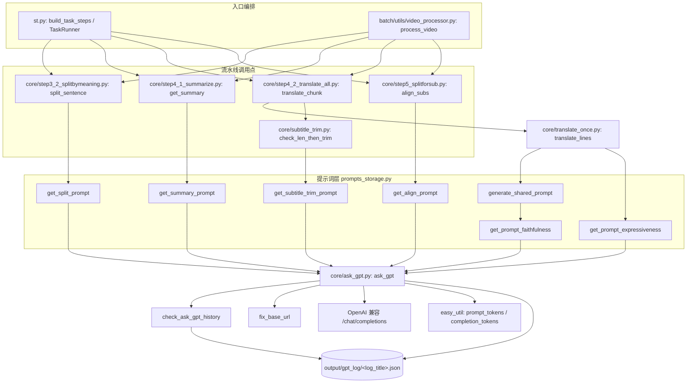

> ## ⚠️ 本文的「配音/LLM 旧实现」段落已失效，其余已按现状更正
>
> - 涉及**已删除的配音链路**的段落一律保留原标注、不再复原：`get_correct_text_prompt`、`core/all_tts_functions/tts_main.py`、`core/step8_1_gen_audio_task.py`、`log_title='tts_correct_text'` 都已不存在（`devdocs/README.md:15` 已声明失效）。
> - `ask_gpt` 曾在「重构 Round 1」被**重写**，本次「上游 3.0.4 合并」（`afff2bb`）又加了 base_url 归一化与显式超时。本文 §三/§四/§五/§七 已按当前代码逐条核对（取舍理由见 `05-guides/04-已知问题与技术债.md` 的「六」）。


# LLM 调用层与提示词工程

VideoLingo 的所有「智能」能力（按句意切分、术语总结、三步翻译、字幕压缩）都收敛到一个函数：`core/ask_gpt.py: ask_gpt`（历史上还包括 **TTS 文本清洗，已随配音链路删除**）。它同时承担了 5 件事：**取配置、查磁盘缓存、归一化 base_url、调用 OpenAI 兼容接口、把结果写进日志**（外加 3 次重试与失败原因回注）。本文件说明这条链路的完整行为、提示词构造约定、以及由「缓存 + 步骤幂等」共同构成的陷阱。

## ⚠️ 安全提醒（先读）

| 事项 | 现状（已核实） |
| --- | --- |
| `config.yaml` 已不入库 | `.gitignore:172` 忽略 `config.yaml`；仓库里只有模板 `config.example.yaml`（密钥位是 `YOUR_API_KEY` 之类占位符）。本地 `config.yaml` 由首次 `load_key` 从模板自动复制生成（`core/config_utils.py`） |
| 密钥可以不落盘 | `load_key` 优先读环境变量 `VIDEOLINGO_<KEY>`（`api.key` → `VIDEOLINGO_API_KEY`，`core/config_utils.py-88`），字符串里的 `${VAR}` 也会被展开 |
| 未配置的判定 | `is_placeholder`（`core/config_utils.py`）把含 `YOUR_`/`your_`/`密钥`/`<`/`>` 或空串的值视为"未配置"，UI 据此提示 |
| 仍可能落盘的秘密 | 若把真实密钥写进本地 `config.yaml`（`volcano_asr.access_token`、`tos.access_key`/`secret_key` 等），它仍是明文——只是不再进版本历史 |
| 已实现的「环境变量回退」范例 | `core/all_whisper_methods/tos_service.py` 读 `TOS_ACCESS_KEY`/`TOS_SECRET_KEY`， 另外接受 `VIDEOLINGO_TOS_ACCESS_KEY`/`VIDEOLINGO_TOS_SECRET_KEY` |
| 另一处易被忽略 | `.gitignore:208` 是 `*.md`、 是 `!devdocs/**/*.md`：**`devdocs/` 下的文档是被跟踪的**（`git ls-files devdocs` 现有 32 个文件），而仓库其它位置的 `.md` 默认不进 git |

> 💡 建议：不要在本地 `config.yaml` 里填真实密钥，改用 `VIDEOLINGO_API_KEY` 等环境变量（`core/config_utils.py`）；模板里保持 `YOUR_*` 占位符，`is_placeholder` 才能正确提示"未配置"。若历史提交里曾经提交过密钥，仍需轮换并清理历史。

---

## 一、职责与边界

本子系统负责：把所有 LLM 交互统一到 `ask_gpt` 一个入口，维护 `output/gpt_log/<log_title>.json` 形式的提示词-响应对缓存，统计 token 与估算成本，并按 log_title 归档请求日志。

它**不**负责：并发调度（并发由各 step 的 `ThreadPoolExecutor` 决定）、步骤级幂等（由 `core/step*.py` 各自的「产物存在即跳过」决定）、提示词版本管理（没有任何版本号或哈希机制）、流式输出、function calling、多轮对话（首次请求都是单条 user message，且**不带 system message**，见 `core/ask_gpt.py`；只有失败重试时会临时追加一轮纠错消息，见）。

## 二、文件清单

| 文件 | 规模 | 主要职责 |
| --- | --- | --- |
| `core/ask_gpt.py` | ~8K | `fix_base_url` 地址归一化、`ask_gpt` 主入口、`check_ask_gpt_history` 缓存、`save_log` 落盘、token 计数、重试 |
| `core/prompts_storage.py` | ~13K | 7 个提示词构造函数（全部返回纯字符串，无副作用，仅读取配置） |
| `core/translate_once.py` | ~6K | `translate_lines`：直译→反思→意译的三步编排 + JSON 校验重试 + 行数校验 |
| `core/config_utils.py` | ~8K | `load_key/load_key_or/update_key/assign_key/get_joiner/get_source_language`（详见 `../04-interfaces/01-配置文件与参数.md`） |
| `easy_util.py` | ~7K | 进程内全局统计：token 计数、成本估算、耗时、进度、`ensure_utf8_console`/`check_cancel` |
| `core/pypi_autochoose.py` | ~4K | **与 LLM 无关**的独立运维脚本：测速并切换 pip 镜像源；由 `installer.py` 在安装依赖前调用（见 §五.7） |

## 三、调用链与数据流



一次 `ask_gpt` 的控制流（含真实行号）：

```
ask_gpt(prompt, response_json=True, valid_def=None, core/ask_gpt.py
 log_title='default', use_cache=True, bypass_cache=False)
├─ load_key("api") / load_key("llm_support_json") :122-124
├─ check_ask_gpt_history(prompt, model, log_title, :126-131
│ allow_cache = use_cache and not bypass_cache)
│ └─ 命中则直接 return（log_title in (None,'None') 或关缓存则恒不命中） :73-74
├─ api_set["key"] 为空 → raise ValueError("API_KEY is missing") :133-134
├─ messages = [{"role":"user","content":prompt}] :136
├─ base_url = fix_base_url(api_set["base_url"]) :138
├─ OpenAI(api_key=..., base_url=...) 客户端 :139
├─ response_format 决策（白名单） :140
└─ for attempt in range(max_retries=3): :142-145
 ├─ attempt>0 → 追加 assistant+user 纠错消息（回注 last_error） :147-152
 ├─ client.chat.completions.create(timeout=REQUEST_TIMEOUT) :154-157
 ├─ RequestException / Exception → sleep(2) 后重试，末次 raise :158-171
 ├─ usage → increase_prompt_tokens/increase_completion_tokens :174-178
 ├─ response_json 为假: 直接 save_log + return 原文 :182-184
 ├─ ① json_repair.loads(content) → 失败即写 error 日志并 continue :187-198
 ├─ ② valid_def(data) 非 success → 末次写 error 日志并 raise :201-215
 └─ save_log(...) + return response_data :217-218
```

## 四、关键数据结构

### 4.1 `output/gpt_log/<log_title>.json`（日志即缓存）

该文件是**数组**，每个元素由 `save_log`（`core/ask_gpt.py`）追加写入，字段固定为 4 个（`core/ask_gpt.py`）：

| 字段 | 类型 | 说明 |
| --- | --- | --- |
| `model` | str | 写入时的 `api.model`；**参与缓存匹配**（`core/ask_gpt.py`），换模型即换缓存 |
| `prompt` | str | 完整提示词原文（含注入的上下文），缓存键的另一半 |
| `response` | dict \| str | `response_json=True` 且解析成功时为已解析对象；否则为模型原始字符串 |
| `message` | str \| null | 正常写入时为 `null`；错误日志（`log_title="error"`）时为错误信息 |

落盘样例（结构照抄 `save_log` 的字段定义；`response` 里的键来自 §5.5 的 `get_split_prompt` 提示词契约）：

```json
[
 {
 "model": "deepseek-flash",
 "prompt": "### Role\nYou are a professional Netflix subtitle splitter in zh.\n...",
 "response": {
 "analysis": "句子为口语表达，包含多个逗号分隔的分句；…",
 "split1": "我都说什么挂那个干什么，[br]不是在做，之前一直在做就挂着做呗",
 "split2": "我都说什么挂那个干什么，不是在做，[br]之前一直在做就挂着做呗",
 "assess": "两个候选长度接近，split2 的切点更贴合语义停顿…",
 "choice": "2"
 },
 "message": null
 }
]
```

> ⚠️ `save_log` 在 `log_title in (None, 'None')` 时**直接 return，什么都不写**（`core/ask_gpt.py`，哨兵定义在）。

文件写入参数为 `json.dump(logs, f, ensure_ascii=False, indent=4)`（`core/ask_gpt.py`），因此中文原样保留、缩进 4 空格、**每次追加都会整体重写文件**。写入本身已在 `with LOCK:` 内完成，调用方不需要额外加锁。

### 4.2 代码中真实出现的全部 `log_title`

| `log_title` | 落盘文件 | 真实调用点 | 备注 |
| --- | --- | --- | --- |
| `'summary'` | `output/gpt_log/summary.json` | `core/step4_1_summarize.py` | 术语总结 |
| `'sentence_splitbymeaning'` | `output/gpt_log/sentence_splitbymeaning.json` | `core/step3_2_splitbymeaning.py` | 调用量最大（每句一次） |
| `'align_subs'` | `output/gpt_log/align_subs.json` | `core/step5_splitforsub.py` | 字幕对齐切分 |
| `'subtitle_trim'` | `output/gpt_log/subtitle_trim.json` | `core/subtitle_trim.py` | 超长字幕压缩（由 step4_2 在 `duration > min_trim_duration` 时触发，`core/step4_2_translate_all.py`） |
| `'translate_faithfulness'` | `output/gpt_log/translate_faithfulness.json` | `core/translate_once.py`（`f'translate_{step_name}'`，`step_name='faithfulness'`） | 直译阶段 |
| `'translate_expressiveness'` | `output/gpt_log/translate_expressiveness.json` | `core/translate_once.py`（`step_name='expressiveness'`） | 反思+意译阶段 |
| `'error'` | `output/gpt_log/error.json` | `core/ask_gpt.py`（解析失败）、（校验失败） | 排错第一现场 |
| `'default'` | `output/gpt_log/default.json` | 无显式调用点，仅 `core/ask_gpt.py` 的默认参数值 | 一旦有代码漏传 `log_title`，日志会混进同一个文件 |
| `None` 或 `'None'`（**字符串**） | **不写文件、也不读缓存** | `st_components/sidebar_setting.py`、`batch/utils/gui.py`、`batch/utils/batch_processor.py`（后两者同时传 `use_cache=False`） | API 连通性自测，故意不留痕；见 `NO_LOG_TITLES`（`core/ask_gpt.py`） |

> ⚠️ 注意两点：① **不存在名为 `translation` 的 log_title**，翻译相关日志只有 `translate_faithfulness` / `translate_expressiveness` 两个；② `'tts_correct_text'` 与 `core/all_tts_functions/tts_main.py` 属于**已删除的配音链路**，现已无对应代码。

### 4.3 `output/gpt_log/error.json`

由 `core/ask_gpt.py` 与 写入（`log_title="error"`），字段同上，`message` 承载真实原因。两种写入时机：

1. JSON 解析/后续处理抛异常：`message` 是 `"JSON 解析失败: ..."`。
2. `valid_def` 返回非 `success`：`message` 是**校验器给出的真实原因**（校验器自身抛异常时记为 `"valid_def 抛异常: ..."`，）。这条只在**最后一次**尝试才落盘，前两次失败只打印、不写日志。

该文件只追加、不轮转、无大小上限，且每条都带完整 prompt，因此长视频跑崩几次就会膨胀到几十 MB。它是 `core/ask_gpt.py` 的报错信息里明确指引用户去看的文件。

### 4.4 `valid_def` 校验回调协议

签名约定（无类型注解，靠约定）：`valid_def(response_data: dict) -> dict`，返回值必须是 `{"status": ..., "message": ...}`，仅当 `status == 'success'` 才被接受（`core/ask_gpt.py`）。

仓库内已有的 5 个实现：

| 实现 | 位置 | 校验内容 |
| --- | --- | --- |
| `valid_summary` | `core/step4_1_summarize.py` | 必须有 `terms`，且每个 term 含 `src/tgt/note`（**不校验 `topic`**，缺失时 补空串） |
| `valid_split` | `core/step3_2_splitbymeaning.py` | 必须有 `choice ∈ {1,2}`，且存在 `split{choice}` 并含 `[br]`（与 §5.5 的双候选提示词成对，见 §7.7） |
| `valid_align` | `core/step5_splitforsub.py` | 必须有 `align`，且 `len(align) >= 2` |
| `valid_trim` | `core/subtitle_trim.py` | 必须有 `result` |
| `valid_faith` / `valid_express` | `core/translate_once.py`，复用 `valid_translate_result`（`core/translate_once.py`） | 必须存在 key `'1'`，且其值含 `direct` / `free` |

协议的两个隐含要求：**返回值必须是 dict 且含 `status`**（非 dict 会在 抛 `AttributeError`）；校验器**可以**抛异常，异常会被 捕获并当作 `"valid_def 抛异常: ..."` 处理，但异常信息与"最后一次才写 error.json"的规则叠加后仍不易定位。

### 4.5 token 与成本统计（`easy_util.py` 全局变量）

| 变量/函数 | 位置 | 说明 |
| --- | --- | --- |
| `prompt_tokens` / `completion_tokens` / `total_tokens` | `easy_util.py` | 进程内全局；`ask_gpt` 只累加前两个，`total_tokens` 从未被写入（`get_total_tokens` 是现算的，`easy_util.py`） |
| `lock` | `easy_util.py` | `increase_prompt_tokens`/`increase_completion_tokens` 用**这把锁**（`core/ask_gpt.py`），与 `ask_gpt` 里保护日志的 `LOCK`（`core/ask_gpt.py`）**不是同一把** |
| `price_input_uncached` / `price_input_cached` / `price_output` | `easy_util.py` | 1 / 0.02 / 2，单位「元 / 百万 token」 |
| `cached_token_rate` | `easy_util.py` | 0.3：**硬编码假设** prompt token 中有 30% 命中供应商侧 prompt caching，按 0.02 计价 |
| `get_estimated_cost` | `easy_util.py` | `prompt/1e6*(1-0.3)*1 + prompt/1e6*0.3*0.02 + completion/1e6*2` |
| `get_formated_estimated_cost` | `easy_util.py` | 保留 5 位小数并拼 `"元"` |
| `estimated_cost` | `easy_util.py` | 声明后从未被赋值/读取，**死变量** |
| `estimated_total_cost` | `easy_util.py` | 由 `core/step6_generate_final_timeline.py` 累加（`eu.estimated_total_cost += eu.get_estimated_cost`）；`get_total_estimated_cost`（`easy_util.py`）读它 |
| `record_messages` | `easy_util.py` | 写 `output/cost.txt`（5 行纯文本：耗时、prompt tokens、completion tokens、总 tokens、预计花费） |
| `add_to_total_tokens` / `add_to_total_time` | `easy_util.py` / | 批处理每跑完一个视频调用（`batch/utils/video_processor.py`）； 的 docstring 明确警告**不要**与 step6 的累加同时调用，否则总时长翻倍 |

调用点：`st.py`（`reset_tokens`， 点「开始处理」时调用）、`core/step6_generate_final_timeline.py`（`record_messages`）、`batch/utils/video_processor.py`（每个视频开头 `record_start` → `reset_tokens`）、`core/all_whisper_methods/` 无涉。

**计数口径的两个缺口**：① 缓存命中直接 return，不计数；② `int(response.usage.prompt_tokens)` 抛错时被 `except Exception: pass` **静默吞掉**，响应本身仍会正常解析——即某些不返回 `usage` 的兼容网关会让成本统计恒为 0，而不会报错。计数在 完成，早于 的 `response_json` 分支，所以 `response_json=False` 的调用**也**计数；重试失败的那几次不计数（只有拿到响应才累加）。

## 五、逐函数/逐模块实现说明

### 5.1 `core/ask_gpt.py`

| 函数 | 签名 | 关键实现与副作用 |
| --- | --- | --- |
| `fix_base_url` | `fix_base_url(base_url: str) -> str` | 见 §5.2；非 str 入参抛 `ValueError` |
| `_is_no_log` | `_is_no_log(log_title)` | `log_title in (None, 'None')`（哨兵 `NO_LOG_TITLES`，） |
| `save_log` | `save_log(model, prompt, response, log_title='default', message=None)` | 哨兵值直接 return；`os.makedirs(LOG_FOLDER, exist_ok=True)`；读-改-写整个 JSON 数组，**自身已持 `LOCK`**，但仍是跨进程不安全的 read-modify-write |
| `check_ask_gpt_history` | `check_ask_gpt_history(prompt, model, log_title, allow_cache=True)` | 哨兵值/关缓存返回 `None`；目录或文件不存在返回 `None`；JSON 损坏返回 `None`；命中条件 `item["prompt"] == prompt and item["model"] == model`，返回 `item["response"]`。**`model` 已参与匹配**（不再是死参数） |
| `increase_prompt_tokens` | `increase_prompt_tokens(value)` | `with eu.lock: eu.prompt_tokens += value` |
| `increase_completion_tokens` | `increase_completion_tokens(value)` | 同上，累加 `completion_tokens` |
| `ask_gpt` | `ask_gpt(prompt, response_json=True, valid_def=None, log_title='default', use_cache=True, bypass_cache=False)` | 见 §三 控制流；返回值类型随 `response_json` 变化（dict 或 str） |
| `__main__` 自测 | | 打一句 hi 并要求 JSON；`log_title=None` **不再写任何文件** |

三个"绕过缓存"的手段要分清（`core/ask_gpt.py` 的 docstring 写明）：

| 手段 | 效果 |
| --- | --- |
| `use_cache=False` | 只跳过**读取**缓存，写日志照旧；连通性检查同时传 `log_title=None`，因此实际既不读也不写（`st_components/sidebar_setting.py`） |
| `bypass_cache=True` | 只跳过**读取**，结果仍会写入日志。`core/translate_once.py` 与 `core/step3_2_splitbymeaning.py` 在重试轮次用它替代了历史上的 `prompt + ' ' * retry` |
| 改 prompt 字符串 | 历史做法，会污染日志且语义晦涩；现仓库内已无此写法 |

**`LOCK` 的作用与粒度**（`core/ask_gpt.py`）：这是一个模块级 `threading.Lock`，**只**保护 `save_log` 的读-改-写。缓存读取 `check_ask_gpt_history`与真正的 HTTP 请求都**不在**锁内。含义是：

- 同一进程内多个线程同时问同一个 prompt，都会查到「未命中」（除非其中一个已完成写入），然后**各自发起一次真实请求**（重复计费），最后串行地把 N 条相同 prompt 追加进同一个 json。
- 跨进程无效：批处理 GUI（`batch/utils/gui.py`）与 `st.py` 若同时运行，两个进程会各自读写同一批 json。

### 5.2 base_url 归一化（`core/ask_gpt.py`，调用点）

```python
def fix_base_url(base_url: str) -> str:
 if not isinstance(base_url, str):
 raise ValueError("api.base_url must be a string")
 if 'ark' in base_url: # 火山方舟
 return "https://ark.cn-beijing.volces.com/api/v3"
 if 'v1' not in base_url:
 return base_url.strip('/') + '/v1'
 return base_url
```

（上游 3.0.4 移植项，提交 `afff2bb`；三条分支的真实行号是、、、。）

实际效果：

| `config.yaml: api.base_url` | 传给 `OpenAI(base_url=...)` | 最终请求路径 |
| --- | --- | --- |
| `https://api.deepseek.com` | `https://api.deepseek.com/v1` | `/v1/chat/completions` ✅ |
| `https://dashscope.aliyuncs.com/compatible-mode/v1` | 原样 | `/compatible-mode/v1/chat/completions` ✅ |
| `https://api.siliconflow.cn` | `https://api.siliconflow.cn/v1` | `/v1/chat/completions` ✅ |
| `http://localhost:11434`（Ollama） | `http://localhost:11434/v1` | `/v1/chat/completions` ✅ |
| `https://ark.cn-beijing.volces.com/api/v3` | 原样（`ark` 分支固定返回同一个常量） | `/api/v3/chat/completions` ✅ |
| `https://ark.cn-beijing.volces.com`（只写域名） | **被强制改成** `https://ark.cn-beijing.volces.com/api/v3` | `/api/v3/chat/completions` ✅ |
| `https://api.openai.com/v1/chat/completions` | **原样保留**（含 `v1`） | `/v1/chat/completions/chat/completions` ❌ 404 |

**修掉的真实缺陷**：`ark` 的兼容端点固定在 `/api/v3`，而通用规则是"缺 `v1` 才补 `/v1`"。旧写法会把火山方舟拼成 `.../api/v3/v1`（该 URL 里既没有 `v1` 也没有对应路由），因此方舟必须走单独的固定分支。

**仍然存在的坑**：

1. **子串误判**：`'ark' in base_url` 与 `'v1' not in base_url` 都是**子串**判断。域名或路径里恰好含 `ark`（如自建网关 `https://ark-proxy.example.com/v1`）会被无条件改写成火山官方地址；含 `v1` 的其它写法（`https://gw.example.com/openai/v1beta`、`https://v1-proxy.example.com`）则不会补 `/v1`。正确做法是按 path 段判断（`urlparse(...).path.rstrip('/').endswith('/v1')`）并把方舟做成可配置项。
2. **与 UI 提示文案的关系**：`st_components/sidebar_setting.py` 的 help 现在写的是「OpenAI 兼容格式；会自动补上 /v1/chat/completions」（2026-09-20 前是英文 "Openai format, will add /v1/chat/completions automatically"）。**注意这话只对"base_url 指向模型服务根"成立**：若用户按提示粘贴的其实是**已经是完整 endpoint** 的 URL（含 `/chat/completions`、或火山方舟的 `/api/v3/...`），就会踩中上一条。
3. **UI 的模型列表拉取没有同步这条规则**：`st_components/sidebar_setting.py` 的 `_fetch_model_list` 自己判了一次 `if 'v1' not in url: url += '/v1'`，**没有 `ark` 分支**。因此方舟用户点「拉取模型列表」会请求 `https://ark.cn-beijing.volces.com/v1/models` 而不是 `/api/v3/models`。改 `fix_base_url` 时记得同步这里，或直接复用它。
3. **`.strip('/')` 语义过宽**：它去掉的是首尾所有 `/`，不是只去尾斜杠；对 `//host/` 这类输入会削掉协议相对前缀（实际配置不会这么写，但属于隐藏假设）。
4. 拼接结果**不回写 config**（每次调用重新算），所以文件里看到的永远是你手填的那个值。

### 5.3 `response_format` 的启用条件（`core/ask_gpt.py`）

```python
response_format = {"type": "json_object"} if response_json and model in llm_support_json else None
```

- `response_json` 为真（默认 `True`）且 `api.model` **精确命中** `config.yaml: llm_support_json` 白名单（模板里是 `config.example.yaml`，共 10 项：`deepseek-flash`、`deepseek/deepseek-v4-flash`、`deepseek-v4-pro`、`gpt-4o`、`gpt-4o-mini`、`qwen3-vl-flash`、`qwen-flash`、`qwen-plus`、`qwen3-max`、`qwen3:30b-a3b`）时才带上 `json_object`。
- 不在白名单时**静默降级**：请求照发，只是不再约束输出格式，全靠模型自觉 + `json_repair` 兜底。
- 现实落差：一键切换里的「硅基流动」预设模型是 `Qwen/Qwen2.5-72B-Instruct`（`config.example.yaml`），**不在白名单内**，切过去之后 JSON mode 就失效了；`ollama_api.model` = `qwen3:30b-a3b` 恰好在白名单内。
- 该白名单是 **dev 的刻意保留**：上游 3.0.4 把它改成了布尔开关 `api.llm_support_json`，dev 明确不跟（保留为逐模型精确匹配的白名单）。改动前请先确认白名单是"逐模型精确匹配"的语义。
- 现在**没有**任何调用点省略 `response_json` 参数：`core/step3_2_splitbymeaning.py`、`core/step4_1_summarize.py`、`core/translate_once.py`、`core/step5_splitforsub.py`、`core/subtitle_trim.py` 都显式传 `response_json=True`。

### 5.4 重试与容错解析

| 机制 | 位置 | 行为 |
| --- | --- | --- |
| 请求超时 | `core/ask_gpt.py` | `REQUEST_TIMEOUT = 300`（秒），通过 `completion_args["timeout"]` 显式传给 `chat.completions.create`，不再依赖 SDK 默认值 |
| 外层重试 | `core/ask_gpt.py` | `max_retries = 3`；`RequestException`与其它异常都重试；`time.sleep(2)` **固定 2 秒**，无指数退避、无抖动；末次抛 `Exception(f"Still failed after {max_retries} attempts: {e}")` |
| 失败原因回注 | `core/ask_gpt.py` | 第 2 次起把上一轮的真实失败原因（网络错误 / 解析失败 / 校验失败）作为一条 assistant + 一条 user 消息追加到 `messages`，重试不再是"原样再问一遍" |
| JSON 解析重试 | `core/ask_gpt.py` | 解析失败时打印 `❎ json_repair parsing failed: '''...'''` 并立即 `continue`（**不 sleep**），同时写一条 `error.json` |
| 业务校验重试 | `core/ask_gpt.py` | `valid_def` 非 success 时打印真实原因并 `continue`；**只有最后一次**才写 `error.json` 并 `raise` |
| 容错解析 | `core/ask_gpt.py` | `json_repair.loads` 能修复缺引号、markdown 代码围栏、尾逗号、单引号等常见脏输出 |
| 耗尽报错 | `core/ask_gpt.py` | 消息里给出真实原因并提示去看 `output/gpt_log/error.json` |
| 上层再重试 | `core/translate_once.py`、`core/step3_2_splitbymeaning.py` | 用 `bypass_cache=retry > 0` 强制重新请求（见 §5.1 的三种手段） |

### 5.5 `core/prompts_storage.py` 逐函数表

所有函数都只读配置（`load_key` / `get_source_language`）并返回字符串，**没有副作用、没有缓存**。

| 函数（签名） | 用途 | 关键输出格式约束 | 真实调用点 | 改它要注意什么 |
| --- | --- | --- | --- | --- |
| `get_split_prompt(sentence, num_parts=2, word_limit=20)` | 让 LLM 按 Netflix 规范把长句切成 `num_parts` 段，切点用 `[br]` 标记 | **双候选 CoT**：JSON `{"analysis", "split1", "split2", "assess", "choice"}`，`choice` 取 `"1"`/`"2"`，被选中的 `split{choice}` **必须含 `[br]`**（校验 `core/step3_2_splitbymeaning.py`） | `core/step3_2_splitbymeaning.py`；并被 `core/step5_splitforsub.py` 经 `split_sentence(num_parts=2)` 间接使用 | 源语言取自 `get_source_language`；`### Steps`要求"分析 → 生成两个候选 → 对比 → 选择"；**提示词与 `valid_split` 必须成对改**（见 §7.7）；`[br]` 是硬契约，改成别的标记会让 `find_split_positions`（`core/step3_2_splitbymeaning.py`）失效 |
| `get_summary_prompt(source_content, custom_terms_json=None)` | 生成两句主题总结 + 抽取专业术语/人名及目标语译法 | JSON `{"topic": str, "terms":[{"src","tgt","note"}]}`（校验 `core/step4_1_summarize.py`）；提示词内含一个中文示例，并明确 `Extract less than 15 terms` | `core/step4_1_summarize.py` | 同时读 `get_source_language` 与 `target_language`；**主题键名是 `topic`，刻意不跟上游改 `theme`**（消费端 `core/step4_2_translate_all.py` 读 `topic`，`core/step4_1_summarize.py` 还会补空串）；`custom_terms_json` 结构由 `core/step4_1_summarize.py` 从 `custom_terms.xlsx` 三列构造；改 JSON 示例时注意 `{{ }}` 转义（f-string） |
| `generate_shared_prompt(previous_content_prompt, after_content_prompt, summary_prompt, things_to_note_prompt)` | 把「前文 / 后文 / 主题总结 / 需注意术语」拼成共享上下文块 | 纯文本，用 `<previous_content>` 等标签包住 | `core/translate_once.py` | 4 个入参都可能为 `None`（`core/step4_2_translate_all.py` 对首尾 chunk 返回 `None`），拼进提示词会得到字面量 `None`；新增段落会改变**所有翻译请求的 prompt**，直接导致缓存全量失效 |
| `get_prompt_faithfulness(lines, shared_prompt)` | 直译（Step 1）：逐行忠实翻译 | JSON 形如 `{"1":{"origin":...,"direct":...}, "2":{...}}`；key 从 `"1"` 起编号，**构成行数契约**（`core/translate_once.py`） | `core/translate_once.py` | `json_format` 由 `lines.split('\n')` 生成，**行数即 key 数**；改这里要同步 `core/translate_once.py` 的校验逻辑 |
| `get_prompt_expressiveness(faithfulness_result, lines, shared_prompt)` | 反思 + 意译（Step 2）：对直译结果逐行挑毛病再改写 | JSON 每项含 `origin/direct/reflection/free` 四键，并显式要求 `free` 不许留空 | `core/translate_once.py` | 遍历 `faithfulness_result.items` 生成样例，因此输出 key 与直译结果绑定；`free` 的空值会污染最终字幕（`core/translate_once.py`）；**反思清单里"译文过于啰嗦"的后半句已删除**（现为 "Check the conciseness of the subtitles, point out where the translation is too wordy"），长度约束改由 `core/subtitle_trim.py` 与 `subtitle.max_length`/`target_multiplier` 在 step5/step4_2 强制 |
| `get_align_prompt(src_sub, tr_sub, src_part)` | 依据源语已切分版本，对目标语字幕做对齐切分 | JSON `{"analysis": str, "align":[{"src_part_i":..., "target_part_i":...}]}` | `core/step5_splitforsub.py` | 用 `.format` 渲染（**不是 f-string**，）；提示词里新增裸 `{}` 会抛 `KeyError`；`num_parts = len(src_part.split('\n'))`，当 `src_part` 无换行时 `num_parts=1`，与 `valid_align` 的 `len>=2` 要求冲突（`core/step5_splitforsub.py`） |
| `get_subtitle_trim_prompt(text, duration)` | 字幕朗读时长不够时压缩字幕文本 | JSON `{"analysis": str, "result": str}`；`result` 需保持原语言 | `core/subtitle_trim.py`（经 `check_len_then_trim` → 调 `ask_gpt`） | 同为 `.format` 渲染；`duration` 单位是**秒**（`core/subtitle_trim.py` 算出可用时长、 与它比较）；`rule` 变量在函数内定义，`.format` 只填 `text`/`duration`/`rule` 三个占位符 |

> ⚠️ 函数名核实结论：`core/prompts_storage.py` 里**没有** `get_translate_prompt`，也**没有** `get_reflect_prompt`。翻译相关的两个函数真名是 `get_prompt_faithfulness`（直译）与 `get_prompt_expressiveness`（含义译，**反思步骤写在它的提示词正文里**，对应 JSON 字段 `reflection`）。同理也没有 `get_summary` 之类的提示词函数——`get_summary` 是步骤函数，在 `core/step4_1_summarize.py`。此外 `get_correct_text_prompt` 属于**已删除的 TTS 链路**，已不存在。

> ⚠️ `prompts_storage.py` 顶部的 `# @ xxx.py` 注释**已经过期**： 写 `step4_splitbymeaning.py`（现为 `core/step3_2_splitbymeaning.py`）、 写 `step5_translate.py & translate_lines.py`（现为 `core/step4_2_translate_all.py` + `core/translate_once.py`）、 写 `step6_splitforsub.py`（现为 `core/step5_splitforsub.py`）、 写 `core/subtitle_trim.py`（配音链路删除后的新归属，已正确）。找调用点时不要信这些注释，以 `grep` 结果为准。

### 5.6 `core/translate_once.py: translate_lines`

`translate_lines(lines, previous_content_prompt, after_cotent_prompt, things_to_note_prompt, summary_prompt, index=0)`的第 0 步是 `eu.check_cancel`，使「停止」能在 chunk 边界生效。

| 阶段 | 行号 | 行为 |
| --- | --- | --- |
| 0. 组装共享上下文 | | `generate_shared_prompt(previous, after, summary, things_to_note)` |
| 1. 直译 | | `get_prompt_faithfulness` → `retry_translation(prompt, 'faithfulness')` |
| 2. 规范化直译 | | 把每个 `direct` 里的 `\n` 换成空格 |
| 3. 分流 | | `load_key('reflect_translate')` 为假 → 直接把 `direct` 拼成结果，`console.print` rich 表格后 `return translate_result, lines`（**早退路径不做最终行数校验**） |
| 4. 反思+意译 | | `get_prompt_expressiveness(faith_result, ...)` → `retry_translation(prompt, 'expressiveness')` |
| 5. 输出 | | 打印 Origin/Direct/Free 三行对照表，`free` 以 `\n` 拼接 |
| 6. 最终校验 | | `len(lines.split('\n')) != len(translate_result.split('\n'))` → 打印提示并 `raise ValueError`（指引看 `output/gpt_log/translate_expressiveness.json`） |
| 7. 返回 | | `return translate_result, lines` |

`retry_translation(prompt, step_name)`的细节：

- `valid_faith` / `valid_express` 分别要求 key `'1'` 含 `direct` / `free`，这是**最低限度**校验，只查第 1 项。
- 循环 3 次，第 2 次起传 `bypass_cache=retry > 0`——语义是"这次一定重新请求"，而**不需要**改 prompt 字符串（历史上用 `prompt + retry * " "`，见 §7.3）。
- 通过条件是 `len(lines.split('\n')) == len(result)`，即**响应对象的顶级 key 数量等于输入行数**；不校验 key 是否为 `"1".."n"` 或顺序。
- 3 次都不满足 → `raise ValueError('... failed after 3 retries. Please check `output/gpt_log/error.json` ...')`。

**返回值 `(translation, english_result)` 中 `english_result` 是什么**：它就是入参 `lines`，也就是**本段原文（源语言 chunk 文本）**，不是英文、也不是任何译文。命名遗留自早期「英文视频 → 中文」的单向场景。证据：函数体只在 和 两个 `return` 处原样返回 `lines`；调用方 `core/step4_2_translate_all.py` 把它命名为 `english_result` 并在 用它和原文 chunk 做相似度匹配（因此 `similar` 实际上恒接近 1.0，这一步的真实作用是「按原文把乱序返回的结果重新贴回 chunk」，而不是质量校验）。

### 5.7 `core/pypi_autochoose.py` 的真实行为

任务描述里的猜测（「镜像源自动选择」）是**对的**，但要补三点事实：

| 项 | 事实 |
| --- | --- |
| 定位 | 独立运维脚本（`main`，`if __name__ == "__main__":`、`main`），与 LLM 调用层无耦合。唯一调用方是安装器：`installer.py`（`from core.pypi_autochoose import main as choose_mirror`），即**装依赖之前先切镜像**；`install.py` 已缩成 19 行的向后兼容入口 |
| 数据源 | `MIRRORS`只有两项：清华 TUNA（`https://mirrors.tuna.tsinghua.edu.cn/pypi/web/simple`）与 PyPI 官方（`https://pypi.org/simple`） |
| 测速方式 | `requests.get(url, timeout=5)` 单次 GET，返回耗时毫秒数；非 200 或 `RequestException` 记 `inf`。**测的是索引页一次响应时间，不是下载吞吐** |
| 并发 | `ThreadPoolExecutor(max_workers=get_optimal_thread_count)`，线程数 = `max(cpu_count-1, 1)`，异常时退化为 2 |
| 副作用 | `set_pip_mirror`执行 `python -m pip config set global.index-url <url>`，**修改的是当前解释器对应的全局 pip 配置**（写入用户 pip 配置文件），影响机器上所有 Python 项目；随后用 `pip config get global.index-url` 回读校验（、） |
| 死代码 | `FAST_THRESHOLD = 3000` / `SLOW_THRESHOLD = 5000`声明后从未使用 |
| 失败分支 | 全部 `inf` → 打印 "❌ All mirrors unreachable"；写入失败 → 提示「Try running with admin privileges」 |

## 六、关键参数与配置

> 下表行号指向模板 `config.example.yaml`（仓库里没有 `config.yaml`，它由 `load_key` 首次运行时从模板复制；不同机器的行号可能因本地编辑而漂移，以键名为准）。

| 键路径 | 模板默认值 | 在本子系统中的作用 |
| --- | --- | --- |
| `api.key` | `'YOUR_API_KEY'`（`config.example.yaml`，占位符） | `ask_gpt` 唯一读取的 LLM 凭据（`core/ask_gpt.py`）；为空字符串时抛 `ValueError("API_KEY is missing")`；也可用 `VIDEOLINGO_API_KEY` 覆盖（`core/config_utils.py`） |
| `api.base_url` | `'https://api.deepseek.com'` | 经 `fix_base_url`归一化后交给 `OpenAI(base_url=...)`，见 §5.2 |
| `api.model` | `'deepseek-flash'` | 请求的 model，同时是 `llm_support_json` 白名单的匹配键，也是缓存键与日志 `model` 字段的来源 |
| `llm_support_json` | 10 个模型 | JSON mode 白名单，**精确匹配 `api.model` 的列表**，见 §5.3 |
| `target_language` | `'简体中文'` | 被 4 个提示词函数读取（`core/prompts_storage.py`），是 prompt 文本的一部分→影响缓存 key |
| `whisper.language` | `'zh'` | **源语言的唯一判定入口**：`get_source_language` 以它为准，仅 `'auto'` 时回退 `detected_language`（`core/config_utils.py`）；被 5 个提示词/工具处读取（`core/prompts_storage.py`） |
| `whisper.detected_language` | `'zh'` | ASR 写回的真实检测语言（`core/all_whisper_methods/whisperX_utils.py` 的 `save_language`）；`update_key("whisper.language", ...)` 时会被原子同步（`core/config_utils.py`） |
| `summary_length` | `8000` | `core/step4_1_summarize.py` 截断送入总结的字符数；改它=改 prompt=缓存失效 |
| `max_workers` | `1000` | 并发线程数：`core/step3_2_splitbymeaning.py`（`parallel_split_sentences` 的调用处）、`core/step4_2_translate_all.py`、`core/step5_splitforsub.py` |
| `max_split_length` | 自动档位（中日 30 / 韩 28 / 拉丁 26 / 泰 20） | step3_2 判断"这一行是否需要 LLM 再切"的 token 上限（`core/step3_2_splitbymeaning.py`），同时作为 `get_split_prompt` 的 `word_limit`。取哪个数由 `core/subtitle_limits.py` 按语言决定；关闭"按语言自动设置"后才读 config 里的手填值 |
| `reflect_translate` | `true` | `core/translate_once.py` 决定是否执行「反思+意译」第二步；关闭可省约一半翻译 token，但字幕自然度下降 |
| `transcription_only` | `false` | `core/step4_2_translate_all.py`：为真时**完全跳过所有翻译 LLM 调用**，直接把源文复制成译文 |
| `min_trim_duration` | `3.5` | `core/step4_2_translate_all.py`：只有 `duration` 超过它才调 `check_len_then_trim`（即 `subtitle_trim` 提示词） |
| `pause_before_translate` | `false` | `st.py`：为真时在翻译前 `input` 阻塞等待人工改 `output/log/terminology.json` |

## 七、技术要点与坑

### 7.1 缓存是「双刃剑」：改了提示词结果却不更新

缓存键是 **(model, prompt) 二元组精确匹配**（`core/ask_gpt.py`），而 prompt 由「模板 + 注入的上下文 + 语言配置」拼成。因此实际有**三层**「不更新」的来源，只清 `gpt_log` 通常不够：

| 层 | 机制 | 表现 |
| --- | --- | --- |
| L1 prompt 命中 | 提示词模板的**动态部分**没变（如你只改了 `max_workers`、或只改了模板里没被用到的空格/注释以外的东西）→ prompt 字符串不变 → 直接返回旧响应 | 花钱 0、耗时 0，结果一模一样 |
| L2 步骤幂等 | `core/step4_2_translate_all.py`（`translation_results.xlsx` 存在即 return）、`core/step2_whisperX.py`（`cleaned_chunks.xlsx` 存在即跳过）等 | **即使提示词真变了，整个步骤根本不会执行**，连缓存查询都不会发生 |
| L3 回退命中 | 你把提示词改回历史版本，旧缓存条目又被匹配上 | 以为是新结果，其实是若干天前的输出 |

另外两个容易忽略的点：

- **缓存有 model 维度，但没有 `target_language` 维度**：`check_ask_gpt_history(prompt, model, log_title)` 会同时比 `model`（`core/ask_gpt.py`），所以换供应商不会串味；但**只改目标语言、不改 prompt 之外的任何东西**时，prompt 字符串本身变了（语言被写进正文），仍会正常失效——真正没有覆盖的是"同名同 prompt、换了 `log_title` 之外的语义"这类情况。
- **缓存检查早于 API key 校验**（在 之前），所以把 `api.key` 清空后重跑，仍可能全程「成功」——直到遇到一个未缓存的 prompt 才报 `API_KEY is missing`。

**清理方法（PowerShell，在项目根目录执行）**：

```powershell
# 1) 全量清 LLM 缓存（最小粒度，安全）
Remove-Item -Recurse -Force output\gpt_log

# 2) 只清翻译相关缓存
Remove-Item -Force output\gpt_log\translate_faithfulness.json, output\gpt_log\translate_expressiveness.json

# 3) 关键：连带清掉下游中间产物，否则步骤幂等会让 LLM 根本不被调用
Remove-Item -Force output\log\translation_results.xlsx, `
 output\log\translation_results_for_subtitles.xlsx, `
 output\log\terminology.json, `
 output\log\sentence_splitbymeaning.txt
```

各提示词对应的「必须删什么」对照：

| 我改了哪个提示词函数 | 必须删除的文件 |
| --- | --- |
| `get_split_prompt` | `output/gpt_log/sentence_splitbymeaning.json` + `output/log/sentence_splitbymeaning.txt`（+ 全部下游产物） |
| `get_summary_prompt` | `output/gpt_log/summary.json` + `output/log/terminology.json` |
| `generate_shared_prompt` / `get_prompt_faithfulness` / `get_prompt_expressiveness` | `output/gpt_log/translate_faithfulness.json`、`output/gpt_log/translate_expressiveness.json` + `output/log/translation_results.xlsx` |
| `get_align_prompt` | `output/gpt_log/align_subs.json` + `output/log/translation_results_for_subtitles.xlsx` |
| `get_subtitle_trim_prompt` | `output/gpt_log/subtitle_trim.json` + `output/log/translation_results.xlsx`（压缩结果直接写回该表，`core/step4_2_translate_all.py`） |

> 另一个「清缓存」的现成入口是 UI 的「归档到'历史记录'」按钮 → `core/onekeycleanup.py: cleanup`，它把 `output/gpt_log/*` 整体搬到 `history/<视频名>/gpt_log/`，等价于清缓存，但会连同视频产物一起归档。

### 7.2 `log_title=None` 与 `log_title='None'` 已被统一（旧交互 bug 已修复）

判据只有一处：`core/ask_gpt.py` 的 `NO_LOG_TITLES = (None, 'None')`，由 `_is_no_log`在 `save_log`与 `check_ask_gpt_history`里同时使用。

| 传入值 | 是否写日志 | 是否读缓存 |
| --- | --- | --- |
| 默认 `'default'` | 是 → `output/gpt_log/default.json` | 查 `default.json` |
| `None`（NoneType，如 `core/ask_gpt.py` 的模块自测） | **否** | **否** |
| `'None'`（字符串，如 `st_components/sidebar_setting.py`） | **否** | **否** |

历史坑（现已消失，仅作排障背景）：旧实现只判断字符串 `'None'`，于是模块自测写出 `output/gpt_log/None.json`，而所有「API 连通性检查」都会命中这条缓存，造成**即使 API key 已失效、界面仍显示「API密钥有效」**。若你的 `output/gpt_log/` 是从旧版本沿用下来的，里面可能仍残留 `None.json`——它现在**不会再被读取**，但可以直接删掉。

### 7.3 重试不再靠「尾巴加空格」绕过缓存

历史写法是 `prompt + retry * " "`：因为缓存是精确字符串比较，多加一个空格就是另一个 key。现在改用显式的 `bypass_cache` 参数（`core/ask_gpt.py` 的 docstring 写明语义），调用点在 `core/translate_once.py` 与 `core/step3_2_splitbymeaning.py`，**仓库内已无加空格的写法**。

副作用对比：旧写法的 0/1/2 尾空格变体会各自在 `output/gpt_log/<log_title>.json` 里留下独立条目，日志体积翻倍，且把提示词改回去时这些带空格的旧条目仍会被命中；`bypass_cache=True` 只跳过读取、结果仍以**原始 prompt** 写入，因此不会再产生这类"变体条目"。

### 7.4 校验失败与解析失败已被分开（旧误报已修复）

旧实现在 `valid_def` 判定失败时先写日志再 `raise ValueError`，而这个 `raise` 又被"解析失败"的 `except Exception` 接住，于是同一次失败会写两条日志、且打印的是 `json_repair parsing failed`。现在两条路径彻底分开：

| 情况 | 代码 | 打印 | 写 `error.json` |
| --- | --- | --- | --- |
| `json_repair.loads` 抛异常 | `core/ask_gpt.py` | `❎ json_repair parsing failed: '''...'''` | 每次失败都写，`message` 是 `"JSON 解析失败: ..."` |
| `valid_def` 返回非 success | `core/ask_gpt.py` | `❎ API response validation failed: <真实原因>` | **只在最后一次**尝试写 |
| `valid_def` 自身抛异常 | `core/ask_gpt.py` | 同上，原因是 `"valid_def 抛异常: ..."` | 同上 |
| `usage` 缺失导致计数抛错 | `core/ask_gpt.py` | 无输出（`except Exception: pass`） | 不写；响应继续正常解析，只是成本统计失真 |

### 7.5 并发与限流

- 默认 `max_workers: 1000`（`config.example.yaml`）对多数云厂商是**远超配额**的：`core/step4_2_translate_all.py` 会一次性把整个视频的所有 chunk 全部 submit，`core/step3_2_splitbymeaning.py` 同样对全部长句并发。触发 429/超时后由 `ask_gpt` 的「2 秒 + 3 次」兜底，失败即整条流水线抛异常（没有队列、没有退避；断点续跑只能靠已写盘的 `gpt_log` 与中间产物，暂停/停止由 `easy_util.check_cancel` + `TaskRunner` 提供，见 `../01-entrypoints/01-Streamlit主应用入口.md`）。
- `LOCK`（`core/ask_gpt.py`）只保证日志文件读写的互斥，**不是速率限制器**。
- 若用本地 Ollama，请**手动**把 `max_workers` 调小（如 1）：模板里 `max_workers` 那行已经没有相关注释了，`ollama_api` 块（`config.example.yaml`）也只剩密钥/地址/模型三项。

### 7.6 单条 user message + 无 system message

首次请求固定为 `messages = [{"role": "user", "content": prompt}]`（`core/ask_gpt.py`）——所有角色设定都写在 prompt 正文里（`### Role`）。只有失败重试时才会追加 `<上一次的输出不合规，已丢弃>` + 纠错指令两条消息。

这意味着：无法用 system prompt 做全局约束，也无法复用供应商的 prompt caching 前缀（每段 prompt 的正文都不同，只有公共前缀部分可能命中，这也是 `easy_util.cached_token_rate = 0.3` 这个拍脑袋系数的来源之一）。

### 7.7 断句提示词与 `valid_split` 必须成对修改

`get_split_prompt` 在 2d0287c 里被改成**双候选 CoT**（`core/prompts_storage.py`：`### Steps` 要求"分析结构 → 生成 split1/split2 → 对比 assess → 选择 choice"），消费端 `valid_split`（`core/step3_2_splitbymeaning.py`）同步改成校验 `choice ∈ {1,2}` + `split{choice}` 含 `[br]`，取值处用 `str(response_data.get('choice','')).strip` 归一化，因此模型返回整数 `1` 或带空格的 `" 1 "` 都能取到正确的键。

**只改一边的后果**：`valid_split` 是 `ask_gpt` 的业务校验器，校验失败会触发 3 次重试并在耗尽后抛异常——若提示词还输出旧的单候选 `"split"` 键，**每一个长句都会校验失败 3 次**，整条 step3_2 直接失败而不是降级。改动前先读 `tests/test_prompt_contract.py`（`test_summary_keeps_topic_key` 等用例就是为这类"提示词 ↔ 消费端"契约写的）。

## 八、扩展点

1. **换 LLM 供应商**
 - 只换同一家/兼容 OpenAI 协议的服务：改 `api.base_url`、`api.key`、`api.model` 三个键即可，UI 路径是侧边栏「LLM 配置」（`st_components/sidebar_setting.py`，模型选择在），或「一键切换配置」下拉（→ `apply_config`，把 `deepseek_api/qwen_api/siliconflow_api/ollama_api` 的值 `assign_key` 覆盖到 `api.*`）。
 - 新模型若不支持 `response_format: json_object`，**不要**加进 `llm_support_json`（它是**逐模型精确匹配的列表**，不是布尔开关，见 §5.3）；但要意识到此时 JSON 合规性只靠 `json_repair` 兜底。
 - 需要自定义 header / query / 超时：`core/ask_gpt.py` 是唯一构造 client 与请求参数的地方，`OpenAI(api_key=..., base_url=fix_base_url(...))` 之外要加参数只能改这里；超时已由 的 `timeout=REQUEST_TIMEOUT` 统一给出，改超时只需改 的常量。
2. **新增一个提示词**
 - 在 `core/prompts_storage.py` 末尾追加 `get_xxx_prompt(...)`，只做字符串拼装、只读 `load_key`/`get_source_language`，返回 `str`。
 - 调用侧：`from core.ask_gpt import ask_gpt`，传一个**新的、唯一的** `log_title`（同一 log_title 会与其它步骤共用缓存文件，`prompt` 与 `model` 同时相同才命中）。
 - 写一个 `valid_def` 返回 `{"status","message"}`；返回 `non-success` 时真实原因会进 `error.json`，但**只在最后一次尝试**才写（见 §7.4）。
 - 若提示词用 `.format` 渲染（如现有 `get_align_prompt`），JSON 里的花括号必须写成 `{{ }}`；用 f-string 时同理。
 - 若提示词是"多候选 + 自选"这类结构，务必同步改校验器（见 §7.7）。
3. **提高翻译质量**
 - 调 `core/prompts_storage.py` 的 `get_prompt_faithfulness` / `get_prompt_expressiveness` 正文（注意 §7.1 的缓存与幂等清理）。
 - 开启 `reflect_translate: true`（三步流程中的第 2、3 步都依赖它）。
 - 扩充术语表 `custom_terms.xlsx`（三列 src/tgt/note，读取于 `core/step4_1_summarize.py`）；注意术语注入是**子串包含匹配**（`core/step4_1_summarize.py`：`term['src'].lower in sentence.lower`），短词/缩写会误命中，也会漏掉词形变化。
 - 加大上下文：`core/step4_2_translate_all.py` 只取前文末 3 行、后文前 2 行；`split_chunks_by_chars(chunk_size=600, max_i=10)`决定 chunk 粒度（该函数的两个参数都是**必填**、没有默认值，定义在）。
 - `summary_length`（`config.example.yaml`）越大，总结看到的上下文越全，但首轮 token 成本越高。
4. **调并发**
 - 改 `max_workers`（`config.example.yaml`），一次性影响断句、翻译、字幕对齐三处 LLM 调用（`core/step3_2_splitbymeaning.py`、`core/step4_2_translate_all.py`、`core/step5_splitforsub.py`）。
 - 想只调 LLM 并发：把这三处的 `load_key("max_workers")` 换成新键（例如 `llm_max_workers`）。
5. **给缓存加维度（建议）**
 - 现状缓存键是 `(model, prompt)`（`core/ask_gpt.py`），已覆盖"换供应商/换模型"这一最常见的串味场景。
 - > 💡 建议：把缓存键改为 `hash(model + target_language + prompt)` 并在条目里记录 `target_language` 与 `prompt_version`，这样调参时能精确失效而不必手删文件（会让历史日志中所有条目失效一次）。
6. **降低 `error.json` 体积（建议）**
 - > 💡 建议：错误日志只存 prompt 的哈希 + 前后各 200 字符，或按天轮转，避免长视频跑挂后产生几十 MB 的 JSON。

## 九、验证方式

```powershell
# 0) 前置：必须在项目根目录（所有路径都是相对路径）
cd <仓库根目录> # 本机为 D:\Git\github\VideoLingoMove

# 1) 只看配置读到了什么（不联网、不花钱）
python -c "from core.config_utils import load_key; print(load_key('api')['model'], load_key('llm_support_json'))"

# 2) 只验证 base_url 归一化（纯函数，不联网）
python -c "from core.ask_gpt import fix_base_url as f; print([f(u) for u in ['https://api.deepseek.com','https://dashscope.aliyuncs.com/compatible-mode/v1','https://ark.cn-beijing.volces.com']])"

# 3) 打印某个提示词的真实内容（不联网）——改提示词后核对缓存 key 是否变了
python -c "from core.prompts_storage import get_split_prompt; print(get_split_prompt('我在测试一句话'))"

# 4) 打印源语言解析结果（不联网）
python -c "from core.config_utils import get_source_language; print(get_source_language)"

# 5) 查看缓存条目数（json 数组长度）
python -c "import json;d=json.load(open('output/gpt_log/sentence_splitbymeaning.json',encoding='utf-8'));print(len(d), '条');print(d[0]['model'], d[0]['prompt'][:60])"

# 6) 真实调用一次（会联网、会计费、会写日志）——慎用；log_title=None 不会写任何文件
python core/ask_gpt.py

# 7) 端到端跑一次翻译三步流程（会用 __main__ 里的 4 行样例，真实联网）
python core\translate_once.py

# 8) 单步跑本子系统相关的流水线步骤（依赖上游产物已存在）
python core\step3_2_splitbymeaning.py # 需要 output/log/sentence_splitbynlp.txt
python core\step4_1_summarize.py # 需要 output/log/sentence_splitbymeaning.txt + custom_terms.xlsx
python core\step5_splitforsub.py # 需要 output/log/translation_results.xlsx
python core\subtitle_trim.py # 自带 __main__，用一条超长中文样例验证压缩链路

# 9) 核对成本统计产物
Get-Content output\cost.txt

# 10) pip 镜像测速脚本（⚠️ 会真实修改全局 pip 配置，非必要不要跑）
# python core\pypi_autochoose.py
```

| 想验证的行为 | 最小复现方式 |
| --- | --- |
| 提示词契约（双候选） | `python -c "from core.prompts_storage import get_split_prompt; p=get_split_prompt('测试'); print([k for k in ('split1','split2','choice','assess') if k in p])"` → 应打印 4 个键名 |
| 提示词契约测试 | `python -m unittest tests.test_prompt_contract -v`（校验 `topic` 键、双候选键等"提示词 ↔ 消费端"约定） |
| 缓存命中 | 连续两次执行第 7 步，第二次不再发出网络请求但返回相同结果；`translate_faithfulness.json` 条目数不增加 |
| 缓存带 model 维度 | 修改 `api.model` 指向另一个模型后重跑同一 prompt——会**重新请求**，而不是命中旧模型的答案（`core/ask_gpt.py`） |
| 校验失败只影响最后一次日志 | 临时把 `core/step4_1_summarize.py` 的 `required_keys` 改成不存在的键，观察 `error.json` **只新增 1 条**，且 `message` 是校验器返回的真实原因 |
| `bypass_cache` 生效 | 把 `core/translate_once.py` 的 `bypass_cache=retry > 0` 临时改成 `False`，重跑同一个块——重试会命中缓存而不再发请求 |
| base_url 归一化 | `python -c "from core.ask_gpt import fix_base_url; print(fix_base_url('https://ark.cn-beijing.volces.com'))"` → `https://ark.cn-beijing.volces.com/api/v3` |

## 十、相关文档

- [`../04-interfaces/01-配置文件与参数.md`](../04-interfaces/01-配置文件与参数.md) — `api` / `llm_support_json` / `target_language` 等键的完整表与 `config_utils` 的读写语义
- [`../02-pipeline/04-术语总结与翻译.md`](../02-pipeline/04-术语总结与翻译.md) — step4_1/step4_2 在流水线中的位置与产物
- [`../02-pipeline/03-句子切分NLP.md`](../02-pipeline/03-句子切分NLP.md) — `get_split_prompt` 的上游（spaCy 初切）与下游
- [`../02-pipeline/05-字幕切分与时间轴.md`](../02-pipeline/05-字幕切分与时间轴.md) — `get_align_prompt` 与字幕长度约束
- [`../00-overview/02-数据流与中间产物.md`](../00-overview/02-数据流与中间产物.md) — `output/gpt_log/` 与其他产物的全局位置
- [`../05-guides/04-已知问题与技术债.md`](../05-guides/04-已知问题与技术债.md) — 缓存/密钥/并发等已知债的汇总
