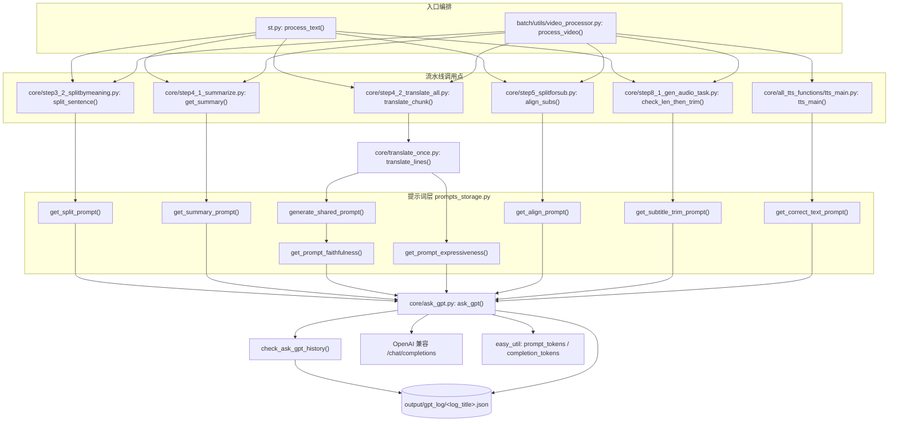

> ## ⚠️ 本文部分内容已在「重构 Round 1」后失效
>
> ⚠️ 本文的 `ask_gpt()` 描述已过期：函数已被**重写**——解析与业务校验分成独立分支、错误信息如实透传、token 不再重复累加、重试时会把失败原因回注给模型、缓存键改为 `(model, prompt)`、新增 `use_cache` 参数、`log_title=None` 不再写 `None.json`。`get_correct_text_prompt()` 已删除（原供 TTS 使用）。


# LLM 调用层与提示词工程

VideoLingo 的所有「智能」能力（按句意切分、术语总结、三步翻译、字幕压缩、TTS 文本清洗）都收敛到一个函数：`core/ask_gpt.py: ask_gpt()`。它同时承担了 5 件事：**取配置、查磁盘缓存、拼 base_url、调用 OpenAI 兼容接口、把结果写进日志**。本文件说明这条链路的完整行为、提示词构造约定、以及由「缓存 + 步骤幂等」共同构成的陷阱。

## ⚠️ 安全提醒（先读）

| 事项 | 现状（已核实） |
| --- | --- |
| `config.yaml` 含明文密钥 | `api.key`(config.yaml:6)、`deepseek_api.key`(:11)、`qwen_api.key`(:16)、`siliconflow_api.key`(:21)、`volcano_asr.access_token`(:54) 当前均为**可直接使用的明文密钥/token**；文档中一律以 `***` 占位，不复制其值 |
| `.gitignore` 是否忽略 config.yaml | **没有忽略**。`.gitignore:169` 只忽略了 `config.backup.yaml`；`git ls-files config.yaml` 显示该文件**已被 git 跟踪**，密钥因此进入版本历史 |
| 其他敏感字段 | `volcano_asr.app_id`(:52) 为真实 App ID；`tos.access_key`/`tos.secret_key`(:80,82) 当前为空字符串，代码支持 `TOS_ACCESS_KEY`/`TOS_SECRET_KEY` 环境变量回退（`core/all_whisper_methods/tos_service.py:58-59`）——这是本仓库里唯一已实现的「密钥走环境变量」范式，可作为改造模板 |
| 另一处易被忽略 | `.gitignore:194` 是 `*.md`，即新增的 `devdocs/*.md` 默认不会进 git；与安全无关，但会影响文档协作 |

> 💡 建议：把 `config.yaml` 加入 `.gitignore`，另存一份 `config.example.yaml`（密钥位留空）入库；密钥读取处改为 `os.getenv("VIDEOLINGO_LLM_KEY") or load_key("api.key")`，参照 `tos_service.py:58-59` 的写法。同时用 `git filter-repo` 清理历史中的旧密钥，并**立即轮换**上述已泄露的 key。

---

## 一、职责与边界

本子系统负责：把所有 LLM 交互统一到 `ask_gpt()` 一个入口，维护 `output/gpt_log/<log_title>.json` 形式的提示词-响应对缓存，统计 token 与估算成本，并按 log_title 归档请求日志。

它**不**负责：并发调度（并发由各 step 的 `ThreadPoolExecutor` 决定）、步骤级幂等（由 `core/step*.py` 各自的「产物存在即跳过」决定）、提示词版本管理（没有任何版本号或哈希机制）、流式输出、function calling、多轮对话（所有请求都是单条 user message，且**不带 system message**，见 `core/ask_gpt.py:66`）。

## 二、文件清单

| 文件 | 行数 | 主要职责 |
| --- | --- | --- |
| `core/ask_gpt.py` | 129 | `ask_gpt()` 主入口、`check_ask_gpt_history()` 缓存、`save_log()` 落盘、token 计数、重试 |
| `core/prompts_storage.py` | 343 | 8 个提示词构造函数（全部返回纯字符串，无副作用，仅读取配置） |
| `core/translate_once.py` | 103 | `translate_lines()`：直译→反思→意译的三步编排 + JSON 校验重试 + 行数校验 |
| `core/config_utils.py` | 89 | `load_key/update_key/assign_key/get_joiner`（详见 `../04-interfaces/01-配置文件与参数.md`） |
| `easy_util.py` | 189 | 进程内全局统计：token 计数、成本估算、耗时、进度 |
| `core/pypi_autochoose.py` | 110 | **与 LLM 无关**的独立运维脚本：测速并切换 pip 镜像源；由 `install.py:157-158` 在安装依赖前调用（见 §五.7） |

## 三、调用链与数据流



一次 `ask_gpt()` 的控制流（含真实行号）：

```
ask_gpt(prompt, response_json, valid_def, log_title)      core/ask_gpt.py:55
├─ load_key("api") / load_key("llm_support_json")          :56-57
├─ with LOCK:                                               :58
│   └─ check_ask_gpt_history()  → 命中则直接 return         :59-61
├─ api_set["key"] 为空 → raise ValueError("⚠️API_KEY is missing")  :63-64
├─ base_url 拼接 + OpenAI() 客户端                          :68-69
├─ response_format 决策                                     :70
└─ for attempt in range(3):                                 :73
    ├─ client.chat.completions.create(...)                  :82
    ├─ response_json 为真:                                   :84
    │   ├─ usage → increase_prompt_tokens/increase_completion_tokens :87-90
    │   ├─ json_repair.loads(content)                        :92
    │   ├─ valid_def(data) 非 success → save_log('error') + raise :95-99
    │   ├─ break                                              :101
    │   └─ except → save_log('error') → 最后一次则 raise        :102-107
    ├─ response_json 为假: 直接取 content 并 break             :108-110
    └─ except → print + time.sleep(2) → 第 3 次 raise          :112-120
with LOCK: log_title != 'None' 时 save_log(...)              :121-123
return response_data                                        :125
```

## 四、关键数据结构

### 4.1 `output/gpt_log/<log_title>.json`（日志即缓存）

该文件是**数组**，每个元素由 `save_log()`（`core/ask_gpt.py:15-32`）追加写入，字段固定为 4 个（`core/ask_gpt.py:17-22`）：

| 字段 | 类型 | 说明 |
| --- | --- | --- |
| `model` | str | 写入时的 `api.model`（仅记录用，**不参与缓存匹配**） |
| `prompt` | str | 完整提示词原文（含注入的上下文），缓存匹配的唯一依据 |
| `response` | dict \| str | `response_json=True` 且解析成功时为已解析对象；否则为模型原始字符串 |
| `message` | str \| null | 正常写入时为 `null`；错误日志（`log_title="error"`）时为错误信息 |

真实落盘样例（`output/gpt_log/sentence_splitbymeaning.json`，本仓库现存文件）：

```json
[
    {
        "model": "deepseek-flash",
        "prompt": "### Role\nYou are a professional Netflix subtitle splitter in zh.\n...",
        "response": {
            "analysis": "句子为口语表达，包含多个逗号分隔的分句；…",
            "split": "我都说什么挂那个干什么，不是在做，[br]之前一直在做就挂着做呗"
        },
        "message": null
    }
]
```

文件写入参数为 `json.dump(logs, f, ensure_ascii=False, indent=4)`（`core/ask_gpt.py:32`），因此中文原样保留、缩进 4 空格、**每次追加都会整体重写文件**。

### 4.2 代码中真实出现的全部 `log_title`

| `log_title` | 落盘文件 | 真实调用点 | 备注 |
| --- | --- | --- | --- |
| `'summary'` | `output/gpt_log/summary.json` | `core/step4_1_summarize.py:64` | 术语总结 |
| `'sentence_splitbymeaning'` | `output/gpt_log/sentence_splitbymeaning.json` | `core/step3_2_splitbymeaning.py:62` | 调用量最大（每句一次） |
| `'align_subs'` | `output/gpt_log/align_subs.json` | `core/step5_splitforsub.py:51` | 字幕对齐切分 |
| `'subtitle_trim'` | `output/gpt_log/subtitle_trim.json` | `core/step8_1_gen_audio_task.py:40` | 超长字幕压缩 |
| `'translate_faithfulness'` | `output/gpt_log/translate_faithfulness.json` | `core/translate_once.py:36`（`f'translate_{step_name}'`，`step_name='faithfulness'`） | 直译阶段 |
| `'translate_expressiveness'` | `output/gpt_log/translate_expressiveness.json` | `core/translate_once.py:38`（`step_name='expressiveness'`） | 反思+意译阶段 |
| `'tts_correct_text'` | `output/gpt_log/tts_correct_text.json` | `core/all_tts_functions/tts_main.py:48` | TTS 文本清洗 |
| `'error'` | `output/gpt_log/error.json` | `core/ask_gpt.py:98`（校验失败）、`:105`（解析失败） | 排错第一现场 |
| `'default'` | `output/gpt_log/default.json` | 无显式调用点，仅 `core/ask_gpt.py:55` 的默认参数值 | 一旦有代码漏传 `log_title`，日志会混进同一个文件 |
| `'None'`（**字符串**） | **不写文件** | `st_components/sidebar_setting.py:17`、`batch/utils/gui.py:30`、`batch/utils/batch_processor.py:476` | API 连通性自测，故意不留痕 |
| `None`（**NoneType**） | `output/gpt_log/None.json` | `core/ask_gpt.py:129`（模块自测 `__main__`） | 见 §七.2 的坑 |

> ⚠️ 注意：**不存在名为 `translation` 的 log_title**。翻译相关日志只有 `translate_faithfulness` / `translate_expressiveness` 两个。若按 `output/gpt_log/translation.json` 去找日志会永远找不到。

### 4.3 `output/gpt_log/error.json`

由 `core/ask_gpt.py:98` 与 `:105` 写入（`log_title="error"`），字段同上，`message` 承载真实原因。两种写入时机：

1. `valid_def` 返回非 `success`（`:97-99`）：此时 `message` 是**校验器给出的真实原因**。
2. JSON 解析/后续处理抛异常（`:102-107`）：`message` 是固定字符串 `"json_repair parsing failed."`。

该文件只追加、不轮转、无大小上限，且每条都带完整 prompt，因此长视频跑崩几次就会膨胀到几十 MB。它是 `translate_once.py:43`、`ask_gpt.py:107` 报错信息里明确指引用户去看的文件。

### 4.4 `valid_def` 校验回调协议

签名约定（无类型注解，靠约定）：`valid_def(response_data: dict) -> dict`，返回值必须是 `{"status": ..., "message": ...}`，仅当 `status == 'success'` 才被接受（`core/ask_gpt.py:96-99`）。

仓库内已有的 5 个实现：

| 实现 | 位置 | 校验内容 |
| --- | --- | --- |
| `valid_summary` | `core/step4_1_summarize.py:55-62` | 必须有 `terms`，且每个 term 含 `src/tgt/note` |
| `valid_split` | `core/step3_2_splitbymeaning.py:55-60` | 必须有 `split`，且内容含 `[br]` |
| `valid_align` | `core/step5_splitforsub.py:44-49` | 必须有 `align`，且 `len(align) >= 2` |
| `valid_trim` | `core/step8_1_gen_audio_task.py:35-38` | 必须有 `result` |
| `valid_faith` / `valid_express` | `core/translate_once.py:30-33`，复用 `valid_translate_result()`（`core/translate_once.py:13-23`） | 必须存在 key `'1'`，且其值含 `direct` / `free` |

协议的两个隐含要求：**校验器不能抛异常**（抛了会被 `:102` 当解析失败吞掉），**返回值必须是 dict 且含 `status`**（否则 `:97` 抛 `KeyError`，同样被吞）。

### 4.5 token 与成本统计（`easy_util.py` 全局变量）

| 变量/函数 | 位置 | 说明 |
| --- | --- | --- |
| `prompt_tokens` / `completion_tokens` / `total_tokens` | `easy_util.py:13-15` | 进程内全局；`ask_gpt` 只累加前两个，`total_tokens` 从未被写入（`st.py:79` 与 `batch/utils/video_processor.py:196` 只把它清零） |
| `lock` | `easy_util.py:4` | `increase_prompt_tokens()`/`increase_completion_tokens()` 用**这把锁**（`core/ask_gpt.py:47-53`），与 `ask_gpt` 里的 `LOCK`（`core/ask_gpt.py:13`）**不是同一把** |
| `price_input_uncached` / `price_input_cached` / `price_output` | `easy_util.py:18-20` | 1 / 0.02 / 2，单位「元 / 百万 token」 |
| `cached_token_rate` | `easy_util.py:23` | 0.3：**硬编码假设** prompt token 中有 30% 命中供应商侧 prompt caching，按 0.02 计价 |
| `get_estimated_cost()` | `easy_util.py:56-61` | `prompt/1e6*(1-0.3)*1 + prompt/1e6*0.3*0.02 + completion/1e6*2` |
| `get_formated_estimated_cost()` | `easy_util.py:66-67` | 保留 5 位小数并拼 `"元"` |
| `estimated_cost` | `easy_util.py:26` | 声明后从未被赋值/读取，**死变量** |
| `estimated_total_cost` | `easy_util.py:27` | 由 `core/step6_generate_final_timeline.py:194` 累加（`+= eu.get_estimated_cost()`）；`get_total_estimated_cost()`（`easy_util.py:63-64`）读它 |
| `record_messages()` | `easy_util.py:72-79` | 写 `output/cost.txt`（5 行纯文本：耗时、prompt tokens、completion tokens、总 tokens、预计花费） |
| `add_to_total_tokens()` / `add_to_total_time()` | `easy_util.py:101-110` | 批处理每跑完一个视频调用一次（`batch/utils/video_processor.py:130-132`） |

调用点：`st.py:76-79`（`reset_tokens()`，每次点「开始处理字幕」清零）、`core/step6_generate_final_timeline.py:184-187`（打印 + `record_messages()`）、`batch/utils/video_processor.py:186-196`（每个视频开头 `record_start()` 清零）、`core/all_whisper_methods/` 无涉。

**计数口径的三个缺口**：① `response_json=False` 的调用不计数（`core/ask_gpt.py:84` 的条件）；② 缓存命中直接 return，不计数（`:60-61`）；③ `int(response.usage.prompt_tokens)` 若因 `usage` 为 `None` 抛错，则连 `json_repair` 都不会执行（见 §七.4）。

## 五、逐函数/逐模块实现说明

### 5.1 `core/ask_gpt.py`

| 函数 | 签名 | 关键实现与副作用 |
| --- | --- | --- |
| `save_log` | `save_log(model, prompt, response, log_title='default', message=None)` `:15` | 读-改-写整个 JSON 数组（`:25-32`）；`os.makedirs(LOG_FOLDER, exist_ok=True)`（`:16`）；**无锁、非原子**，调用方需自己保证互斥 |
| `check_ask_gpt_history` | `check_ask_gpt_history(prompt, model, log_title)` `:34` | 目录不存在返回 `False`（`:36-37`）；逐条比较 `item["prompt"] == prompt`（`:43`），命中返回 `item["response"]`，否则 `False`。**`model` 参数在函数体内从未被使用**（死参数） |
| `increase_prompt_tokens` | `increase_prompt_tokens(value)` `:47` | `with eu.lock: eu.prompt_tokens += value` |
| `increase_completion_tokens` | `increase_completion_tokens(value)` `:51` | 同上，累加 `completion_tokens` |
| `ask_gpt` | `ask_gpt(prompt, response_json=True, valid_def=None, log_title='default')` `:55` | 见 §三 控制流；返回值类型随 `response_json` 变化（dict 或 str） |
| `__main__` 自测 | `:128-129` | 打一句 hi 并要求 JSON，**`log_title=None` 会写出 `output/gpt_log/None.json`** |

**`LOCK` 的作用与粒度**（`core/ask_gpt.py:13`）：这是一个模块级 `threading.Lock`，只保护两段代码——缓存读取（`:58-61`）和成功路径的日志写入（`:121-123`）。它**不**保护：真正的 HTTP 请求（`:82`）、错误日志写入（`:98`、`:105`）。含义是：

- 同一进程内多个线程同时问同一个 prompt，都会在锁内查到「未命中」，然后**各自发起一次真实请求**（重复计费），最后串行地把 N 条相同 prompt 追加进同一个 json。
- 错误路径的 `save_log` 没进锁，多线程同时写 `error.json` 时存在典型的 read-modify-write 竞态，**可能丢条目**。
- 跨进程无效：批处理 GUI（`batch/utils/gui.py`）与 `st.py` 若同时运行，两个进程会各自读写同一批 json。

### 5.2 base_url 拼接规则（`core/ask_gpt.py:68`）

```python
base_url = api_set["base_url"].strip('/') + '/v1' if 'v1' not in api_set["base_url"] else api_set["base_url"]
```

Python 的优先级使这行等价于 `(strip('/') + '/v1') if ('v1' not in raw) else raw`。判定依据是**子串**
`'v1' not in base_url`，而不是路径段判断。实际效果：

| `config.yaml: api.base_url` | 传给 `OpenAI(base_url=...)` | 最终请求路径 |
| --- | --- | --- |
| `https://api.deepseek.com` | `https://api.deepseek.com/v1` | `/v1/chat/completions` ✅ |
| `https://dashscope.aliyuncs.com/compatible-mode/v1` | 原样 | `/compatible-mode/v1/chat/completions` ✅ |
| `https://api.siliconflow.cn` | `https://api.siliconflow.cn/v1` | `/v1/chat/completions` ✅ |
| `http://localhost:11434`（Ollama） | `http://localhost:11434/v1` | `/v1/chat/completions` ✅ |
| `https://api.openai.com/v1/chat/completions` | **原样保留**（含 `v1`） | `/v1/chat/completions/chat/completions` ❌ 404 |

**潜在 bug 清单**：

1. **子串误判**：任何路径或域名里出现 `v1` 就不再补 `/v1`。例如网关 `https://gw.example.com/openai/v1beta`、代理域名 `https://v1-proxy.example.com` 都会导致 URL 错误。正确做法是按 path 段判断（`urlparse(...).path.rstrip('/').endswith('/v1')`）。
2. **与 UI 提示文案冲突**：`st_components/sidebar_setting.py:66` 的 help 写的是 "Openai format, will add /v1/chat/completions automatically"，会诱导用户粘贴**已经是完整 endpoint** 的 URL，从而踩中上一条。
3. **`.strip('/')` 语义过宽**：它去掉的是首尾所有 `/`，不是只去尾斜杠；对 `//host/` 这类输入会削掉协议相对前缀（实际配置不会这么写，但属于隐藏假设）。
4. 拼接结果**不回写 config**（每次调用重新算），所以文件里看到的永远是你手填的那个值。

### 5.3 `response_format` 的启用条件（`core/ask_gpt.py:70`）

```python
response_format = {"type": "json_object"} if response_json and api_set["model"] in llm_support_json else None
```

- `response_json` 为真（默认 `True`）且 `api.model` **精确命中** `config.yaml: llm_support_json` 白名单（config.yaml:201-210，共 9 项：`deepseek-flash`、`deepseek-v4-pro`、`gpt-4o`、`gpt-4o-mini`、`qwen3-vl-flash`、`qwen-flash`、`qwen-plus`、`qwen3-max`、`qwen3:30b-a3b`）时才带上 `json_object`。
- 不在白名单时**静默降级**：请求照发，只是不再约束输出格式，全靠模型自觉 + `json_repair` 兜底。
- 现实落差：一键切换里的「硅基流动」预设模型是 `Qwen/Qwen2.5-72B-Instruct`（config.yaml:23），**不在白名单内**，切过去之后 JSON mode 就失效了；`ollama_api.model` = `qwen3:30b-a3b` 恰好在白名单内。
- `tts_main.py:48` 调用时没传 `response_json`，依赖默认值 `True`，因此 TTS 清洗也走 JSON mode。

### 5.4 重试与容错解析

| 机制 | 位置 | 行为 |
| --- | --- | --- |
| 外层重试 | `core/ask_gpt.py:72-73, 112-120` | `max_retries = 3`；`RequestException` 与其它异常都重试；`time.sleep(2)` **固定 2 秒**，无指数退避、无抖动；第 3 次失败抛 `Exception(f"Still failed after {max_retries} attempts: {e}")` |
| JSON 解析重试 | `core/ask_gpt.py:84-107` | 解析/校验失败时 **不 sleep**，立即重试；但重试用的 prompt **与上一次完全相同**，对确定性失败（如模型稳定输出散文）毫无帮助 |
| 容错解析 | `core/ask_gpt.py:92` | `json_repair.loads()` 能修复缺引号、markdown 代码围栏、尾逗号、单引号等常见脏输出 |
| 耗尽报错 | `core/ask_gpt.py:106-107` | `Exception("JSON parsing still failed after 3 attempts: ...")`，消息里提示去看 `output/gpt_log/error.json` |
| 上层再重试 | `core/translate_once.py:34-43`、`core/step3_2_splitbymeaning.py:62` | 通过 `prompt + retry * " "` **故意改掉 prompt 字符串**，从而绕过缓存强制重新请求（见 §七.3） |

### 5.5 `core/prompts_storage.py` 逐函数表

所有函数都只读配置（`load_key`）并返回字符串，**没有副作用、没有缓存**。

| 函数（签名） | 用途 | 关键输出格式约束 | 真实调用点 | 改它要注意什么 |
| --- | --- | --- | --- | --- |
| `get_split_prompt(sentence, num_parts=2, word_limit=20)` `:7` | 让 LLM 按 Netflix 规范把长句切成 `num_parts` 段，切点用 `[br]` 标记 | JSON `{"analysis": str, "split": str}`；`split` **必须含 `[br]`**（校验 `core/step3_2_splitbymeaning.py:58`） | `core/step3_2_splitbymeaning.py:54`；并被 `core/step5_splitforsub.py:91` 经 `split_sentence(num_parts=2)` 间接使用 | 源语言取自 `whisper.detected_language`（`:8`）；`[br]` 是硬契约，改成别的标记会让 `find_split_positions()`（`core/step3_2_splitbymeaning.py:20-50`）失效 |
| `get_summary_prompt(source_content, custom_terms_json=None)` `:40` | 生成两句主题总结 + 抽取专业术语/人名及目标语译法 | JSON `{"topic": str, "terms":[{"src","tgt","note"}]}`（校验 `core/step4_1_summarize.py:55-62`）；提示词内含一个中文示例（`:86-101`） | `core/step4_1_summarize.py:52` | 同时读 `whisper.detected_language` 与 `target_language`（`:41-42`）；`custom_terms_json` 结构由 `core/step4_1_summarize.py:39-48` 从 `custom_terms.xlsx` 三列构造；改 JSON 示例时注意 `{{ }}` 转义（f-string） |
| `generate_shared_prompt(previous_content_prompt, after_content_prompt, summary_prompt, things_to_note_prompt)` `:112` | 把「前文 / 后文 / 主题总结 / 需注意术语」拼成共享上下文块 | 纯文本，用 `<previous_content>` 等标签包住 | `core/translate_once.py:26` | 4 个入参都可能为 `None`（`core/step4_2_translate_all.py:45,47` 对首尾 chunk 返回 `None`），拼进提示词会得到字面量 `None`；新增段落会改变**所有翻译请求的 prompt**，直接导致缓存全量失效 |
| `get_prompt_faithfulness(lines, shared_prompt)` `:128` | 直译（Step 1）：逐行忠实翻译 | JSON 形如 `{"1":{"origin":...,"direct":...}, "2":{...}}`；key 从 `"1"` 起编号，**构成行数契约**（`core/translate_once.py:39`） | `core/translate_once.py:46` | `json_format` 由 `lines.split('\n')` 生成（`:131-139`），**行数即 key 数**；改这里要同步 `core/translate_once.py:39` 的校验逻辑 |
| `get_prompt_expressiveness(faithfulness_result, lines, shared_prompt)` `:173` | 反思 + 意译（Step 2）：对直译结果逐行挑毛病再改写 | JSON 每项含 `origin/direct/reflection/free` 四键（`:177-182`），并显式要求 `free` 不许留空 | `core/translate_once.py:70` | 遍历 `faithfulness_result.items()` 生成样例（`:176`），因此输出 key 与直译结果绑定；`free` 的空值会污染最终字幕（`core/translate_once.py:84`） |
| `get_align_prompt(src_sub, tr_sub, src_part)` `:226` | 依据源语已切分版本，对目标语字幕做对齐切分 | JSON `{"analysis": str, "align":[{"src_part_i":..., "target_part_i":...}]}` | `core/step5_splitforsub.py:42` | 用 `.format()` 渲染（**不是 f-string**，`:271-278`）；提示词里新增裸 `{}` 会抛 `KeyError`；`num_parts = len(src_part.split('\n'))`（`:229-230`），当 `src_part` 无换行时 `num_parts=1`，与 `valid_align` 的 `len>=2` 要求冲突（`core/step5_splitforsub.py:47-48`） |
| `get_subtitle_trim_prompt(text, duration)` `:282` | 在配音时长不够时压缩字幕文本 | JSON `{"analysis": str, "result": str}`；`result` 需保持原语言 | `core/step8_1_gen_audio_task.py:34`（经 `check_len_then_trim()` → `:40`）；也被 `core/step4_2_translate_all.py:149` 间接调起 | 同为 `.format()` 渲染（`:316-320`）；`duration` 单位是**秒**（`core/step8_1_gen_audio_task.py:87` 计算） |
| `get_correct_text_prompt(text)` `:324` | TTS 前清洗文本（只保留 `. , ? !`） | JSON `{"text": str}` | `core/all_tts_functions/tts_main.py:48` | 该调用未传 `response_json`/`valid_def`，靠默认 `True` 和调用处 `correct_text['text']`（`tts_main.py:49`）直接取值；删掉 `text` 键会 `KeyError` |

> ⚠️ 函数名核实结论：`core/prompts_storage.py` 里**没有** `get_translate_prompt()`，也**没有** `get_reflect_prompt()`。翻译相关的两个函数真名是 `get_prompt_faithfulness()`（直译）与 `get_prompt_expressiveness()`（含义译，**反思步骤写在它的提示词正文里**，对应 JSON 字段 `reflection`）。同理也没有 `get_summary()` 之类的提示词函数——`get_summary()` 是步骤函数，在 `core/step4_1_summarize.py:36`。

> ⚠️ `prompts_storage.py` 顶部的 `# @ xxx.py` 注释**已经过期**：`:6` 写 `step4_splitbymeaning.py`（现为 `core/step3_2_splitbymeaning.py`）、`:111` 写 `step5_translate.py & translate_lines.py`（现为 `core/step4_2_translate_all.py` + `core/translate_once.py`）、`:225` 写 `step6_splitforsub.py`（现为 `core/step5_splitforsub.py`）、`:281` 写 `step8_gen_audio_task.py`（现为 `core/step8_1_gen_audio_task.py`）、`:323` 写 `tts_main`（现为 `core/all_tts_functions/tts_main.py`）。找调用点时不要信这些注释，以 `grep` 结果为准。

### 5.6 `core/translate_once.py: translate_lines()`

| 阶段 | 行号 | 行为 |
| --- | --- | --- |
| 0. 组装共享上下文 | `:26` | `generate_shared_prompt(previous, after, summary, things_to_note)` |
| 1. 直译 | `:46-47` | `get_prompt_faithfulness()` → `retry_translation(prompt, 'faithfulness')` |
| 2. 规范化直译 | `:49-50` | 把每个 `direct` 里的 `\n` 换成空格 |
| 3. 分流 | `:53-67` | `load_key('reflect_translate')` 为假 → 直接把 `direct` 拼成结果，`console.print` rich 表格后 `return translate_result, lines`（**早退路径不做最终行数校验**） |
| 4. 反思+意译 | `:70-71` | `get_prompt_expressiveness(faith_result, ...)` → `retry_translation(prompt, 'expressiveness')` |
| 5. 输出 | `:73-84` | 打印 Origin/Direct/Free 三行对照表，`free` 以 `\n` 拼接 |
| 6. 最终校验 | `:86-88` | `len(lines.split('\n')) != len(translate_result.split('\n'))` → 打印提示并 `raise ValueError`（指引看 `output/gpt_log/translate_expressiveness.json`） |
| 7. 返回 | `:90` | `return translate_result, lines` |

`retry_translation(prompt, step_name)`（`:29-43`）的细节：

- `valid_faith` / `valid_express` 分别要求 key `'1'` 含 `direct` / `free`（`:30-33`），这是**最低限度**校验，只查第 1 项。
- 循环 3 次（`:34`），每次请求用 `prompt + retry * " "`（`:36`、`:38`）——尾部空格数量不同，缓存 key 就不同，**保证重试一定打到网络而不是命中坏缓存**。
- 通过条件是 `len(lines.split('\n')) == len(result)`（`:39`），即**响应对象的顶级 key 数量等于输入行数**；不校验 key 是否为 `"1".."n"` 或顺序。
- 3 次都不满足 → `raise ValueError('... failed after 3 retries. Please check `output/gpt_log/error.json` ...')`（`:43`）。

**返回值 `(translation, english_result)` 中 `english_result` 是什么**：它就是入参 `lines`，也就是**本段原文（源语言 chunk 文本）**，不是英文、也不是任何译文。命名遗留自早期「英文视频 → 中文」的单向场景。证据：函数体只在 `:67` 和 `:90` 两个 `return` 处原样返回 `lines`；调用方 `core/step4_2_translate_all.py:54-55` 把它命名为 `english_result` 并在 `:128` 用它和原文 chunk 做相似度匹配（因此 `similar()` 实际上恒接近 1.0，这一步的真实作用是「按原文把乱序返回的结果重新贴回 chunk」，而不是质量校验）。

### 5.7 `core/pypi_autochoose.py` 的真实行为

任务描述里的猜测（「镜像源自动选择」）是**对的**，但要补三点事实：

| 项 | 事实 |
| --- | --- |
| 定位 | 独立运维脚本（`main()` `:60`，`if __name__ == "__main__": main()` `:109-110`），与 LLM 调用层无耦合。唯一调用方是安装器：`install.py:157-158`（`from core.pypi_autochoose import main as choose_mirror; choose_mirror()`），即**装依赖之前先切镜像** |
| 数据源 | `MIRRORS`（`:12-15`）只有两项：清华 TUNA（`https://mirrors.tuna.tsinghua.edu.cn/pypi/web/simple`）与 PyPI 官方（`https://pypi.org/simple`） |
| 测速方式 | `requests.get(url, timeout=5)` 单次 GET（`:32`），返回耗时毫秒数；非 200 或 `RequestException` 记 `inf`（`:38-40`）。**测的是索引页一次响应时间，不是下载吞吐** |
| 并发 | `ThreadPoolExecutor(max_workers=get_optimal_thread_count())`（`:71`），线程数 = `max(cpu_count()-1, 1)`，异常时退化为 2（`:22-27`） |
| 副作用 | `set_pip_mirror()`（`:42-50`）执行 `python -m pip config set global.index-url <url>`，**修改的是当前解释器对应的全局 pip 配置**（写入用户 pip 配置文件），影响机器上所有 Python 项目；随后用 `pip config get global.index-url` 回读校验（`:52-58`、`:99-103`） |
| 死代码 | `FAST_THRESHOLD = 3000` / `SLOW_THRESHOLD = 5000`（`:19-20`）声明后从未使用 |
| 失败分支 | 全部 `inf` → 打印 "❌ All mirrors unreachable"（`:107`）；写入失败 → 提示「Try running with admin privileges」（`:103-105`） |

## 六、关键参数与配置

| 键路径 | 默认值（config.yaml） | 在本子系统中的作用 |
| --- | --- | --- |
| `api.key` | `***`（明文，config.yaml:6） | `ask_gpt` 唯一读取的 LLM 凭据（`core/ask_gpt.py:56,63`）；为空字符串时抛 `ValueError` |
| `api.base_url` | `'https://api.deepseek.com'`（:7） | 经 `:68` 拼接后交给 `OpenAI(base_url=...)` |
| `api.model` | `'deepseek-flash'`（:8） | 请求的 model，同时是 `llm_support_json` 白名单的匹配键（`:70`），也是日志里记录的 `model` 字段 |
| `llm_support_json` | 9 个模型（:201-210） | JSON mode 白名单，见 §5.3 |
| `target_language` | `'简体中文'`（:31） | 被 4 个提示词函数读取（`core/prompts_storage.py:42,129,174,227`），是 prompt 文本的一部分→影响缓存 key |
| `whisper.detected_language` | `'zh'`（:47） | 同上（`core/prompts_storage.py:8,41,141,184,228`）；由 `core/all_whisper_methods/whisperX_utils.py:281` 在转写后写回 |
| `summary_length` | `8000`（:110） | `core/step4_1_summarize.py:18` 截断送入总结的字符数；改它=改 prompt=缓存失效 |
| `max_workers` | `1000`（:113） | 并发线程数：`core/step3_2_splitbymeaning.py:121`、`core/step4_2_translate_all.py:107`、`core/step5_splitforsub.py:97`、`core/step10_gen_audio.py:102`（`tts_method == 'gpt_sovits'` 时强制 1） |
| `reflect_translate` | `true`（:118） | `core/translate_once.py:53` 决定是否执行「反思+意译」第二步；关闭可省约一半翻译 token，但字幕自然度下降 |
| `transcription_only` | `true`（:34） | `core/step4_2_translate_all.py:69-92`：为真时**完全跳过所有翻译 LLM 调用**，直接把源文复制成译文 |
| `pause_before_translate` | `false`（:121） | `st.py:108-109`：为真时在翻译前 `input()` 阻塞等待人工改 `output/log/terminology.json` |

## 七、技术要点与坑

### 7.1 缓存是「双刃剑」：改了提示词结果却不更新

缓存键是 **prompt 全文精确匹配**（`core/ask_gpt.py:43`），而 prompt 由「模板 + 注入的上下文 + 语言配置」拼成。因此实际有**三层**「不更新」的来源，只清 `gpt_log` 通常不够：

| 层 | 机制 | 表现 |
| --- | --- | --- |
| L1 prompt 命中 | 提示词模板的**动态部分**没变（如你只改了 `max_workers`、或只改了模板里没被用到的空格/注释以外的东西）→ prompt 字符串不变 → 直接返回旧响应（`:60-61`） | 花钱 0、耗时 0，结果一模一样 |
| L2 步骤幂等 | `core/step4_2_translate_all.py:64-66`（`translation_results.xlsx` 存在即 return）、`core/step8_1_gen_audio_task.py:140-141`（`tts_tasks.xlsx` 存在即跳过）等 | **即使提示词真变了，整个步骤根本不会执行**，连缓存查询都不会发生 |
| L3 回退命中 | 你把提示词改回历史版本，旧缓存条目又被匹配上 | 以为是新结果，其实是若干天前的输出 |

另外两个容易忽略的点：

- **缓存没有 model 维度**：`check_ask_gpt_history(prompt, model, log_title)` 的 `model` 形参是死参数（`core/ask_gpt.py:34`）。用侧边栏「一键切换配置」从 Deepseek 换到千问后，只要 prompt 相同，返回的仍是 Deepseek 的旧答案。
- **缓存检查早于 API key 校验**（`:58-61` 在 `:63-64` 之前），所以把 `api.key` 清空后重跑，仍可能全程「成功」——直到遇到一个未缓存的 prompt 才报 `⚠️API_KEY is missing`。

**清理方法（PowerShell，在项目根目录执行）**：

```powershell
# 1) 全量清 LLM 缓存（最小粒度，安全）
Remove-Item -Recurse -Force output\gpt_log

# 2) 只清翻译相关缓存
Remove-Item -Force output\gpt_log\translate_faithfulness.json, output\gpt_log\translate_expressiveness.json

# 3) 关键：连带清掉下游中间产物，否则步骤幂等会让 LLM 根本不被调用
Remove-Item -Force output\log\translation_results.xlsx, `
                  output\log\translation_results_for_subtitles.xlsx, `
                  output\log\terminology.json, `
                  output\log\sentence_splitbymeaning.txt, `
                  output\audio\tts_tasks.xlsx
```

各提示词对应的「必须删什么」对照：

| 我改了哪个提示词函数 | 必须删除的文件 |
| --- | --- |
| `get_split_prompt` | `output/gpt_log/sentence_splitbymeaning.json` + `output/log/sentence_splitbymeaning.txt`（+ 全部下游产物） |
| `get_summary_prompt` | `output/gpt_log/summary.json` + `output/log/terminology.json` |
| `generate_shared_prompt` / `get_prompt_faithfulness` / `get_prompt_expressiveness` | `output/gpt_log/translate_faithfulness.json`、`output/gpt_log/translate_expressiveness.json` + `output/log/translation_results.xlsx` |
| `get_align_prompt` | `output/gpt_log/align_subs.json` + `output/log/translation_results_for_subtitles.xlsx` |
| `get_subtitle_trim_prompt` | `output/gpt_log/subtitle_trim.json` + `output/audio/tts_tasks.xlsx` |

> 另一个「清缓存」的现成入口是 UI 的「归档到'历史记录'」按钮 → `core/onekeycleanup.py: cleanup()`（`:7-41`），它把 `output/gpt_log/*` 整体搬到 `history/<视频名>/gpt_log/`（`:32-33`），等价于清缓存，但会连同视频产物一起归档。

### 7.2 `log_title=None` 与 `log_title='None'` 的差异（真实交互 bug）

判据只有一处：`core/ask_gpt.py:122` 的 `if log_title != 'None':`（与**字符串**比较）。

| 传入值 | 是否写日志 | 写成哪个文件 | 是否读缓存 |
| --- | --- | --- | --- |
| 默认 `'default'` | 是 | `output/gpt_log/default.json` | 查 `default.json` |
| `None`（NoneType，`core/ask_gpt.py:129`） | **是**（`None != 'None'` 为真） | `output/gpt_log/None.json`（f-string 把 `None` 变成 `"None"`） | 查 `None.json` |
| `'None'`（字符串，`st_components/sidebar_setting.py:17` 等） | **否** | — | **仍会查 `None.json`** |

后果：只要有人执行过 `python core/ask_gpt.py`（模块自测，`:129` 传 `None`），磁盘上就有了 `output/gpt_log/None.json`。此后所有「API 连通性检查」（`st_components/sidebar_setting.py:13-20`、`batch/utils/gui.py:29-31`、`batch/utils/batch_processor.py:472-479`）都会命中这条缓存，于是**即使 API key 已失效，界面仍显示「API密钥有效」**——因为响应来自磁盘而不是网络。排障时若结果莫名其妙，先删 `output/gpt_log/None.json`。

### 7.3 用「尾巴加空格」绕过缓存

`core/translate_once.py:36,38` 与 `core/step3_2_splitbymeaning.py:62` 都写成 `prompt + retry * " "`。因为缓存是精确字符串比较，多加一个空格就是**另一个 key**，于是重试必然走真实请求——这是有意为之的 cache-busting hack。副作用：同一逻辑内容的多个变体（0/1/2 个尾空格）会各自在 `output/gpt_log/<log_title>.json` 里留下独立条目，日志体积翻倍，且**你把提示词改回去时，这些带空格的旧条目仍会被命中**。

### 7.4 JSON 校验失败会被误报为「解析失败」，且重复记两条日志

`core/ask_gpt.py:95-99` 在 `valid_def` 判定失败时先按真实原因写一条错误日志并 `raise ValueError`；但这个 `raise` 落在 `:102` 的 `except Exception` 里，于是：

1. `:104` 打印的是 `❎ json_repair parsing failed. Retrying: '''...'''` —— 与实际原因（校验不通过）**不符**，误导排障。
2. `:105` 再写一条 `error.json`，`message` 固定为 `"json_repair parsing failed."`，真实原因是上一条（靠顺序区分）。

同理，`int(response.usage.prompt_tokens)`（`:87-88`）抛错（某些兼容网关不返回 `usage`）也会被这条 `except` 吞掉并计入「解析失败」，连 `json_repair` 都没跑到。

### 7.5 并发与限流

- 默认 `max_workers: 1000`（config.yaml:113）对多数云厂商是**远超配额**的：`core/step4_2_translate_all.py:107` 会一次性把整个视频的所有 chunk 全部 submit，`core/step3_2_splitbymeaning.py:121` 同样对全部长句并发。触发 429/超时后由 `ask_gpt` 的「2 秒 + 3 次」兜底，失败即整条流水线抛异常（没有队列、没有退避、没有断点续传；断点续跑只能靠已写盘的 `gpt_log` 与中间产物）。
- `LOCK`（`core/ask_gpt.py:13`）只保证日志文件读写的互斥，**不是速率限制器**。
- 若用本地 Ollama，config.yaml:112-113 的注释已提示把 `max_workers` 设为 1。

### 7.6 单条 user message + 无 system message

`messages = [{"role": "user", "content": prompt}]`（`core/ask_gpt.py:66`）——所有角色设定都写在 prompt 正文里（`### Role`）。这意味着：无法用 system prompt 做全局约束，也无法复用供应商的 prompt caching 前缀（每段 prompt 的正文都不同，只有公共前缀部分可能命中，这也是 `easy_util.cached_token_rate = 0.3` 这个拍脑袋系数的来源之一）。

## 八、扩展点

1. **换 LLM 供应商**
   - 只换同一家/兼容 OpenAI 协议的服务：改 `api.base_url`、`api.key`、`api.model` 三个键即可，UI 路径是侧边栏「LLM 配置」（`st_components/sidebar_setting.py:64-75`），或「一键切换配置」下拉（`:22-39`，把 `deepseek_api/qwen_api/siliconflow_api/ollama_api` 的值 `assign_key` 覆盖到 `api.*`）。
   - 新模型若不支持 `response_format: json_object`，**不要**加进 `llm_support_json`；但要意识到此时 JSON 合规性只靠 `json_repair` 兜底。
   - 需要自定义 header / query / 超时：`core/ask_gpt.py:69` 是唯一构造 client 的地方，`OpenAI(api_key=..., base_url=...)` 之外要加参数只能改这一行（可考虑在此处读一个 `api.extra_headers` 配置）。
2. **新增一个提示词**
   - 在 `core/prompts_storage.py` 末尾追加 `get_xxx_prompt(...)`，只做字符串拼装、只读 `load_key`，返回 `str`。
   - 调用侧：`from core.ask_gpt import ask_gpt`，传一个**新的、唯一的** `log_title`（同一 log_title 会与其它步骤共用缓存文件，prompt 相同即命中，可能串味）。
   - 写一个 `valid_def` 返回 `{"status","message"}`；返回 `non-success` 时记得真实原因会进 `error.json`。
   - 若提示词用 `.format()` 渲染（如现有 `get_align_prompt`），JSON 里的花括号必须写成 `{{ }}`；用 f-string 时同理。
3. **提高翻译质量**
   - 调 `core/prompts_storage.py` 的 `get_prompt_faithfulness` / `get_prompt_expressiveness` 正文（注意 §7.1 的缓存与幂等清理）。
   - 开启 `reflect_translate: true`（三步流程中的第 2、3 步都依赖它）。
   - 扩充术语表 `custom_terms.xlsx`（三列 src/tgt/note，读取于 `core/step4_1_summarize.py:38-48`）；注意术语注入是**子串包含匹配**（`core/step4_1_summarize.py:24,30`：`term['src'].lower() in sentence.lower()`），短词/缩写会误命中，也会漏掉词形变化。
   - 加大上下文：`core/step4_2_translate_all.py:45,47` 只取前文末 3 行、后文前 2 行；`split_chunks_by_chars(chunk_size=500, max_i=10)`（`:96`）决定 chunk 粒度（函数默认值 400/8 在 `:24`，实际调用被覆盖）。
   - `summary_length`（config.yaml:110）越大，总结看到的上下文越全，但首轮 token 成本越高。
4. **调并发**
   - 改 `max_workers`（config.yaml:113），一次性影响切分/翻译/对齐/TTS 四处；`core/step10_gen_audio.py:102` 对 `gpt_sovits` 强制 1 线程是刻意保留的例外。
   - 想只调 LLM 并发而不动 TTS：需要把 `load_key("max_workers")` 换成新键（例如 `llm_max_workers`），四处调用点都要改。
5. **给缓存加维度（建议）**
   - 现状 `check_ask_gpt_history` 只比 prompt。若能让 `model` 参与匹配（把 `core/ask_gpt.py:34,43` 改成同时比 `model`），可解决换模型后拿到旧答案的问题；但会让历史日志中所有条目失效一次。
   - > 💡 建议：把缓存键改为 `hash(model + target_language + prompt)`，并在日志条目里显式记录 `target_language` 与 `prompt_version`，这样调参时能精确失效而不必手删文件。
6. **降低 `error.json` 体积（建议）**
   - > 💡 建议：错误日志只存 prompt 的哈希 + 前后各 200 字符，或按天轮转，避免长视频跑挂后产生几十 MB 的 JSON。

## 九、验证方式

```powershell
# 0) 前置：必须在项目根目录（所有路径都是相对路径）
cd E:\VideoLingo\VideoLingoMove

# 1) 只看配置读到了什么（不联网、不花钱）
python -c "from core.config_utils import load_key; print(load_key('api')['model'], load_key('llm_support_json'))"

# 2) 打印某个提示词的真实内容（不联网）——改提示词后核对缓存 key 是否变了
python -c "from core.prompts_storage import get_split_prompt; print(get_split_prompt('我在测试一句话'), sep='')"

# 3) 查看缓存条目数（json 数组长度）
python -c "import json;d=json.load(open('output/gpt_log/sentence_splitbymeaning.json',encoding='utf-8'));print(len(d), '条');print(d[0]['prompt'][:80])"

# 4) 检查是否有「污染」的 None.json（会让 API 连通性检查假通过）
Test-Path output\gpt_log\None.json

# 5) 真实调用一次（会联网、会计费、会写日志）——慎用
python core/ask_gpt.py          # 注意：log_title=None → 写出 output/gpt_log/None.json

# 6) 端到端跑一次翻译三步流程（会用 __main__ 里的 4 行样例，真实联网）
python core\translate_once.py

# 7) 单步跑本子系统相关的流水线步骤（依赖上游产物已存在）
python core\step3_2_splitbymeaning.py    # 需要 output/log/sentence_splitbynlp.txt
python core\step4_1_summarize.py         # 需要 output/log/sentence_splitbymeaning.txt + custom_terms.xlsx
python core\step5_splitforsub.py         # 需要 output/log/translation_results.xlsx
python core\step8_1_gen_audio_task.py    # 需要 output/audio/{trans,src}_subs_for_audio.srt

# 8) 核对成本统计产物
Get-Content output\cost.txt

# 9) pip 镜像测速脚本（⚠️ 会真实修改全局 pip 配置，非必要不要跑）
# python core\pypi_autochoose.py
```

| 想验证的行为 | 最小复现方式 |
| --- | --- |
| 缓存命中 | 连续两次执行第 6 步，第二次不再发出网络请求但返回相同结果；`translate_faithfulness.json` 条目数不增加 |
| 缓存被 `prompt + " "` 绕过 | 对比 `translate_faithfulness.json` 里同义条目的 `prompt` 尾部空格数 |
| `'None'` 假通过 | 先跑 `python core/ask_gpt.py`，再把 `api.key` 改成 `''`，然后在 UI 点 📡 按钮——仍提示「API密钥有效」 |
| `valid_def` 失败写两条日志 | 临时把 `core/step4_1_summarize.py:59` 的 `required_keys` 改成不存在的键，观察 `error.json` 新增 2 条（消息一真一假） |
| base_url 拼接 | `python -c "u='https://api.openai.com/v1/chat/completions';print(u.strip('/')+'/v1' if 'v1' not in u else u)"` |

## 十、相关文档

- [`../04-interfaces/01-配置文件与参数.md`](../04-interfaces/01-配置文件与参数.md) — `api` / `llm_support_json` / `target_language` 等键的完整表与 `config_utils` 的读写语义
- [`../02-pipeline/04-术语总结与翻译.md`](../02-pipeline/04-术语总结与翻译.md) — step4_1/step4_2 在流水线中的位置与产物
- [`../02-pipeline/03-句子切分NLP.md`](../02-pipeline/03-句子切分NLP.md) — `get_split_prompt` 的上游（spaCy 初切）与下游
- [`../02-pipeline/05-字幕切分与时间轴.md`](../02-pipeline/05-字幕切分与时间轴.md) — `get_align_prompt` 与字幕长度约束
- [`../00-overview/02-数据流与中间产物.md`](../00-overview/02-数据流与中间产物.md) — `output/gpt_log/` 与其他产物的全局位置
- [`../05-guides/04-已知问题与技术债.md`](../05-guides/04-已知问题与技术债.md) — 缓存/密钥/并发等已知债的汇总
