> # ⚠️ 整个 TTS 引擎适配层已在重构 Round 1 中删除
>
> **`core/all_tts_functions/` 目录已不存在**（含本文件描述的全部 7 个引擎、`tts_main.py`、`custom_tts.py`）。
> 同时被删除的还有 `core/step10_gen_audio.py`、`core/step8_1_gen_audio_task.py`、`core/step8_2_gen_dub_chunks.py`。
>
> - 本文**不是现状描述**，其代码引用与行号全部失效。
> - **唯一被保留的部分**：`estimate_duration.py` 已迁到 `core/estimate_duration.py`，服务于 `core/subtitle_trim.py`（按朗读时长压缩译文）。
> - 当前项目**没有 TTS 层**；[`../05-guides/01-如何新增一个TTS引擎.md`](../05-guides/01-如何新增一个TTS引擎.md) 同样已失效。
> - 若未来要恢复配音，本文的**引擎对照表与 `refer_mode` 语义**仍是有价值的起点（尤其是各引擎对参考音频格式的不同要求）。

---

# TTS 引擎适配层（历史文档）

## 一、职责与边界

`core/all_tts_functions/` 是配音链路的「引擎插槽层」：向上（`core/step10_gen_audio.py`）提供唯一入口 `tts_main(text, save_as, number, task_df)`，向下把 7 种互不兼容的 TTS 服务/库归一化成「给定一段文本 → 在指定路径写一个音频文件」。

它**不负责**：任务分块与语速规划（step8_2/step10）、时间轴拼接（step11）、字幕文本压缩（step4_2）。它也不做音频格式统一——只保证「把引擎返回的字节流写到 `save_as`」，统一到 16kHz/单声道/64kbps 是 `step11_merge_full_audio.py:40-54` 干的。

一句话边界：**`tts_main` 是 if/elif 分发器，不是注册表；引擎失败必须靠「抛异常」或「不写文件」来表达，返回值一律被忽略。**

---

## 二、文件清单

| 文件路径 | 行数 | 主要职责 |
| --- | --- | --- |
| `core/all_tts_functions/tts_main.py` | 82 | 统一入口：文本清洗 → 空文本兜底 → 已存在跳过 → `tts_method` if/elif 分发 → 3 次重试 → 零时长兜底 |
| `core/all_tts_functions/estimate_duration.py` | 139 | 音节级朗读时长估算（`AdvancedSyllableEstimator`），供 step8_1/step8_2 判断是否需要压缩文本 |
| `core/all_tts_functions/edge_tts.py` | 39 | edge-tts CLI（`subprocess`）适配，无 API Key |
| `core/all_tts_functions/azure_tts.py` | 31 | Azure TTS（经 302.ai 代理），SSML + `requests` |
| `core/all_tts_functions/openai_tts.py` | 48 | OpenAI TTS-1（经 302.ai 代理），`requests` |
| `core/all_tts_functions/fish_tts.py` | 49 | Fish Audio（经 302.ai 代理），两段式：POST 拿 URL → GET 下载 |
| `core/all_tts_functions/siliconflow_fish_tts.py` | 251 | SiliconFlow Fish-Speech：`preset`/`custom`/`dynamic` 三模式 + 音色上传 `create_custom_voice()` + 参考音频合并 `get_ref_audio()` |
| `core/all_tts_functions/gpt_sovits_tts.py` | 192 | 本地 GPT-SoVITS `api_v2.py` 服务适配，含服务自启动、`refer_mode` 1/2/3 |
| `core/all_tts_functions/custom_tts.py` | 34 | 自定义引擎占位（`TODO` + `pass`，**未实现**） |
| `st_components/sidebar_setting.py` | 368 | `Dubbing Settings` 面板：引擎下拉（`:312`）与各引擎配置输入（`:318-368`） |
| `config.yaml` | 242 | `tts_method`（`:125`）与各引擎配置块（`:127-164`） |

---

## 三、调用链与数据流

### 3.1 真实调用链

```
step10_gen_audio.process_row(row, tasks_df)              # core/step10_gen_audio.py:71
└─ tts_main.tts_main(line, temp_file, number, task_df)   # core/step10_gen_audio.py:78
   ├─ clean_text_for_tts(text)                           # tts_main.py:19  （去掉 & ® ™ ©）
   ├─ re.sub(r'[^\w\s]', '', text) → 空/单字符 → 100ms 静音  # tts_main.py:29-34
   ├─ os.path.exists(save_as) → return                   # tts_main.py:37  （TTS 缓存命中）
   ├─ TTS_METHOD = load_key("tts_method")                # tts_main.py:41
   └─ for attempt in range(3):                           # tts_main.py:44
      ├─ 最后一次尝试先 ask_gpt(get_correct_text_prompt(text),
      │                        log_title='tts_correct_text')   # tts_main.py:46-49
      ├─ if   TTS_METHOD == 'openai_tts'  → openai_tts(text, save_as)                    # :51
      ├─ elif TTS_METHOD == 'gpt_sovits'  → gpt_sovits_tts_for_videolingo(text, save_as, number, task_df)  # :53
      ├─ elif TTS_METHOD == 'fish_tts'    → fish_tts(text, save_as)                       # :55
      ├─ elif TTS_METHOD == 'azure_tts'   → azure_tts(text, save_as)                      # :57
      ├─ elif TTS_METHOD == 'sf_fish_tts' → siliconflow_fish_tts_for_videolingo(text, save_as, number, task_df)  # :59
      ├─ elif TTS_METHOD == 'edge_tts'    → edge_tts(text, save_as)                       # :61
      ├─ elif TTS_METHOD == 'custom_tts'  → custom_tts(text, save_as)                     # :63
      └─ duration = get_audio_duration(save_as)            # tts_main.py:66
```

### 3.2 模块依赖与数据流

```mermaid
flowchart TD
    S10["step10_gen_audio.generate_tts_audio()"] --> TM["tts_main.tts_main(text, save_as, number, task_df)"]
    TM -->|"if/elif on load_key('tts_method')"| E1["edge_tts()"]
    TM --> E2["azure_tts()"]
    TM --> E3["openai_tts()"]
    TM --> E4["fish_tts()"]
    TM --> E5["siliconflow_fish_tts_for_videolingo()"]
    TM --> E6["gpt_sovits_tts_for_videolingo()"]
    TM --> E7["custom_tts()（空实现）"]

    E1 -->|"subprocess: edge-tts CLI"| NET1["Microsoft Edge 在线服务\n(无 API Key)"]
    E2 -->|"POST api.302.ai/cognitiveservices/v1"| NET2["302.ai 代理 → Azure"]
    E3 -->|"POST api.302.ai/v1/audio/speech"| NET2
    E4 -->|"POST api.302.ai/fish-audio/v1/tts\n+ GET 返回的 url"| NET2
    E5 -->|"POST api.siliconflow.cn/v1/audio/speech"| NET3["SiliconFlow"]
    E5 -->|"POST api.siliconflow.cn/v1/uploads/audio/voice"| NET3
    E6 -->|"POST 127.0.0.1:9880/tts\nGET 127.0.0.1:9880/ping"| LOCAL["本地 GPT-SoVITS api_v2.py"]

    E5 -.->|"读"| REF["output/audio/refers/*.wav\ncombined_reference.wav"]
    E6 -.->|"读"| REF
    E5 -.->|"写"| CFG["config.yaml\nsf_fish_tts.voice_id / custom_name"]
    E6 -.->|"缺失时调用"| S9["step9_extract_refer_audio.extract_refer_audio_main()"]
    E6 -.->|"读"| REF

    S81["step8_1_gen_audio_task.check_len_then_trim()"] --> ED["estimate_duration.estimate_duration()"]
    S82["step8_2_gen_dub_chunks.analyze_subtitle_timing_and_speed()"] --> ED
    ED --> AE["AdvancedSyllableEstimator.process_mixed_text()"]
    AE --> LIB["syllables / pypinyin / g2p_en"]

    TM -->|"save_as"| OUT["output/audio/tmp/{number}_{line_index}_temp.wav"]
```



### 3.3 统一签名约定（实际上是「两套」）

| 调用形态 | 签名 | 谁用 | `tts_main` 里的调用 |
| --- | --- | --- | --- |
| 基础形态 | `(text: str, save_path: str) -> Any` | edge / azure / openai / fish / custom | 只传 2 个参数（`tts_main.py:51/55/57/61/63`） |
| 上下文形态 | `(text, save_as, number, task_df)` | gpt_sovits / sf_fish | 传 4 个参数（`tts_main.py:53/59`） |

**返回值约定：`tts_main` 完全忽略引擎的返回值**（`fish_tts` 与 `siliconflow_fish_tts` 返回 `bool`，`gpt_sovits_tts` 返回 `bool`，其余返回 `None`）。判定成功的唯一标准是 `get_audio_duration(save_as)` 能解析出 `> 0` 的时长（`tts_main.py:66-67`）。

**因此引擎表达失败有三种等价方式**：

| 方式 | 效果 | 例子 |
| --- | --- | --- |
| 抛异常 | 被 `tts_main.py:79` 捕获 → 计入重试；第 3 次仍失败则 `raise Exception(...)` 冒泡到 step10 | `openai_tts` 音色非法 `raise ValueError`（`openai_tts.py:23`）、`gpt_sovits` 配置目录缺失 `FileNotFoundError`（`gpt_sovits_tts.py:120/124`） |
| 不写文件 | `get_audio_duration` 抛 `FileNotFoundError` → 同样计入重试 | `custom_tts`（空实现）、`openai_tts` 非 200 分支（`openai_tts.py:40-42`） |
| 写坏文件 | ffmpeg 解析不出时长 → 计入重试 | `azure_tts` 失败时把错误响应体直接落盘（`azure_tts.py:26-27`，无状态码检查） |

---

## 四、关键数据结构

### 4.1 `tts_main` 的输入参数

| 参数 | 类型 | 说明 |
| --- | --- | --- |
| `text` | str | 单条配音文本（`lines` 里的一行），非整段字幕 |
| `save_as` | str | 目标 WAV 路径，固定为 `output/audio/tmp/{number}_{line_index}_temp.wav`（`step10:26/77`） |
| `number` | int | 任务行号，供 `gpt_sovits` 定位 `output/audio/refers/{number}.wav`、供 `sf_fish` 查 `origin` |
| `task_df` | `pd.DataFrame` | 完整任务表，字段见 [`../02-pipeline/07-配音音频生成.md`](../02-pipeline/07-配音音频生成.md) 第 4.1 节；引擎只读 `number` / `origin` / `duration` |

### 4.2 引擎读写的文件

| 路径 | 读/写 | 引擎 |
| --- | --- | --- |
| `output/audio/tmp/{number}_{line_index}_temp.wav` | 写 | 全部（`save_as`） |
| `output/audio/refers/{number}.wav` | 读 | `sf_fish` dynamic；`gpt_sovits` refer_mode 3 |
| `output/audio/refers/1.wav` | 读 | `gpt_sovits` refer_mode 2 与 mode 3 的失败回退（`gpt_sovits_tts.py:92/108`） |
| `output/audio/refers/combined_reference.wav` | 写后读 | `sf_fish` custom（`siliconflow_fish_tts.py:198`） |
| `<项目根>/../GPT-SoVITS-v2*/GPT_SoVITS/configs/{character}.yaml` | 读 | `gpt_sovits` refer_mode 1（`gpt_sovits_tts.py:112-126`） |
| `<项目根>/../GPT-SoVITS-v2*/GPT_SoVITS/configs/{character}_*.wav|mp3` | 读 | `gpt_sovits` refer_mode 1（`gpt_sovits_tts.py:77`） |
| `config.yaml` | 写 | `sf_fish` custom：`sf_fish_tts.voice_id`、`sf_fish_tts.custom_name`（`siliconflow_fish_tts.py:230-231`） |
| `output/gpt_log/tts_correct_text.json`、`output/gpt_log/subtitle_trim.json` | 读写 | `ask_gpt` 缓存（`core/ask_gpt.py:12/34-45`） |

### 4.3 `estimate_duration` 的返回结构

`process_mixed_text(text)` 返回 dict（`estimate_duration.py:74/104`）：

| 键 | 类型 | 单位 | 含义 |
| --- | --- | --- | --- |
| `language_breakdown` | dict[lang] → `{syllables: int, text: str}` | — | 按语言分组的音节数与原文 |
| `total_syllables` | int | 个 | 总音节数 |
| `punctuation` | list[str] | — | 命中的中/尾标点段 |
| `spaces` | list[str] | — | 计入停顿的空格段 |
| `estimated_duration` | float | **秒** | 最终估算朗读时长 |

---

## 五、逐函数/逐模块实现说明

### 5.1 `tts_main.py`：分发机制（是 if/elif 链，不是 dict）

| 位置 | 代码事实 |
| --- | --- |
| `tts_main.py:9-15` | 顶层 `from ... import` 逐个导入 7 个引擎函数（`gpt_sovits_tts_for_videolingo`、`siliconflow_fish_tts_for_videolingo`、`openai_tts`、`fish_tts`、`azure_tts`、`edge_tts`、`custom_tts`） |
| `tts_main.py:41` | `TTS_METHOD = load_key("tts_method")`，**在 `for attempt` 循环体内**（每次重试都重读配置） |
| `tts_main.py:50-63` | 7 个 `if / elif` 分支，按 `openai_tts → gpt_sovits → fish_tts → azure_tts → sf_fish_tts → edge_tts → custom_tts` 顺序判断 |
| 无 else | `tts_method` 取到未注册值时**静默什么都不做** → `get_audio_duration` 抛异常 → 3 次重试后统一报 `Failed to generate audio after 3 attempts` |

`clean_text_for_tts(text)`（`tts_main.py:19-24`）：删除 `&`、`®`、`™`、`©` 后 `strip()`。这是为了规避部分引擎对这些字符的解析错误。

`tts_main` 的执行顺序（顺序本身是语义的一部分）：

| 顺序 | 行为 | 副作用 |
| --- | --- | --- |
| 1 | `clean_text_for_tts` | 无 |
| 2 | `re.sub(r'[^\w\s]', '', text)` 后长度 `<= 1` → 写 100ms 静音并 return（`tts_main.py:29-34`） | **覆盖式**写 `save_as` |
| 3 | `os.path.exists(save_as)` → return（`tts_main.py:37-38`） | TTS 缓存命中，不联网 |
| 4 | `for attempt in range(3)`；最后一次先 `ask_gpt(get_correct_text_prompt(text), log_title='tts_correct_text')` 清洗文本（`tts_main.py:46-49`） | 调 LLM，写 `output/gpt_log/tts_correct_text.json` |
| 5 | 调引擎；`get_audio_duration(save_as) > 0` 则 `break` | 写 `save_as` |
| 6 | 时长为 0：`os.remove(save_as)`；若是最后一次 → 写 100ms 静音后 return；否则打印重试（`tts_main.py:69-78`） | 删文件 / 兜底静音 |
| 7 | 异常：最后一次 → `raise Exception(f"Failed to generate audio after 3 attempts: {e}")`；否则打印重试（`tts_main.py:79-82`） | 异常冒泡到 step10 → `generate_tts_audio` 里 `raise e` → **整个配音阶段终止** |

⚠️ 重试**没有 sleep/退避**（对比 `siliconflow_fish_tts` 内部有 `time.sleep(1)`）。第 4 步的 LLM 纠错只在最后一次尝试发生，且**不会回写任务表**，纠正后的文本只用于本次合成。

### 5.2 `estimate_duration.py`：时长估算算法

```
estimate_duration(text, estimator)                        # estimate_duration.py:109
  = estimator.process_mixed_text(text)['estimated_duration']
  # 空串/非字符串 → 0（:110-111）

process_mixed_text(text)                                  # estimate_duration.py:64
  按 (\s+ | [，；：,;、]+ | [。！？.!?]+) 切分（捕获组，标点保留）  # :75
  逐 segment 累加 total_duration：
    ① 空格段 → 若前后语言都存在且任一侧的 lang_joiners 为空串（即 zh/ja）→ +0.15s   # :81-86
    ② 中/尾标点段 → +0.1s（连续标点算一次，因为正则有 +）                          # :87-89
    ③ 普通文本段 → lang = _detect_language(segment)
                    syllables = count_syllables(segment, lang)
                    += syllables * duration_params[lang]                          # :90-100
```

常数表（`estimate_duration.py:10/15-18`）：

| 常数 | 值 | 单位 | 说明 |
| --- | --- | --- | --- |
| `duration_params['en']` | `0.225` | 秒/音节 | 英语每音节耗时 |
| `duration_params['zh']` | `0.21` | 秒/音节 | 中文每字（= 每拼音音节）耗时 |
| `duration_params['ja']` | `0.21` | 秒/音节 | 日语 |
| `duration_params['ko']` | `0.21` | 秒/音节 | 韩语 |
| `duration_params['fr']` / `['es']` | `0.22` | 秒/音节 | 法/西 |
| `duration_params['default']` | `0.22` | 秒/音节 | 未识别语言的兜底 |
| `punctuation['pause']['space']` | `0.15` | 秒 | 中/日文语流中空格的停顿 |
| `punctuation['pause']['default']` | `0.1` | 秒 | 每个标点段（含 `。！？.!?` 与 `，；：,;、`） |

音节计数规则（`count_syllables`，`estimate_duration.py:24-57`）：

| 语言 | 规则 | 代码 |
| --- | --- | --- |
| `zh` | 只保留 `[\u4e00-\u9fff]`，再 `len(pinyin(text, style=Style.NORMAL))`（即汉字数，不考虑多音字） | `:36-37` |
| `en` | 逐词 `syllables.estimate(word)` 求和；抛异常时用 `g2p_en` 音素中「含元音字母」的音素数；最后 `max(1, total)` | `:49-57` |
| `ja` | 拗音合并（`[きぎしじちぢにひびぴみり][ょゅゃ]` → `X`）、删除 `[っー]`，再数假名 + 汉字个数 | `:38-41` |
| `fr` / `es` | 先 `lower()`（fr 额外 `re.sub(r'e\b','')` 去掉词尾 e），再数元音串 `[vowels]+` 的个数，`max(1, ...)` | `:42-44` |
| `ko` | 数 `[\uac00-\ud7af]`（谚文音节）个数 | `:45-46` |
| 兜底 | `len(text.split())`（按词数） | `:47` |

语言检测（`_detect_language`，`estimate_duration.py:59-62`）：按 `lang_patterns` 的**字典插入顺序** `zh → ja → fr → es → en → ko` 返回第一个命中的语言；全不命中 → `'en'`。由于 `en` 的模式是 `[a-zA-Z]+`，任何含拉丁字母的片段至少会被判为 `en`，而 `ko` 排在最后（`ko` 文本不会被 `zh`/`ja` 误判，因为谚文不在 CJK 统一表意区间内）。

**与 `speed_factor` 的关系（关键）**：`estimate_duration` 本身**不含任何语速因子**，它输出「按常速朗读需要多少秒」。语速因子由调用方施加：

| 调用点 | 公式 | 含义 |
| --- | --- | --- |
| `core/step8_1_gen_audio_task.py:26` | `estimate_duration(text, ESTIMATOR) / speed_factor['max']` | 「最快能压到多少秒」，与 `duration` 比较决定是否让 LLM 压缩文本 |
| `core/step8_2_gen_dub_chunks.py:84` | `estimate_duration(text, ESTIMATOR)`（不除） | 原始估算值存入 `est_dur`，再由 `if_too_fast` 用 `speed_factor.accept` 判断（`step8_2:88-101`） |

### 5.3 七个引擎逐个说明

#### 5.3.1 edge_tts（`core/all_tts_functions/edge_tts.py`）

| 项 | 事实 |
| --- | --- |
| 函数 | `edge_tts(text, save_path)`（`:16`） |
| 调用方式 | **本地已安装的 `edge-tts` CLI**，通过 `subprocess.run(cmd, check=True)`（`:28-35`）；命令为 `edge-tts --voice <voice> --text <text> --write-media <path>` |
| 需要的 config | `edge_tts.voice`，用 `edge_set.get("voice", "en-US-JennyNeural")`（`:18-19`），缺键不报错 |
| 参考音频 | ❌ 不需要 |
| 自定义音色 | ❌ 只能用 edge-tts 内置音色名（文件头注释列了 `en-US-JennyNeural`/`en-US-GuyNeural`/`en-GB-SoniaNeural`/`zh-CN-XiaoxiaoNeural`/`zh-CN-YunxiNeural`/`zh-CN-XiaoyiNeural`，`edge_tts.py:7-15`） |
| 输出格式 | 代码不指定容器格式，由 edge-tts CLI 默认输出决定，落盘文件名却是 `.wav`（`step10:26`）⚠️ 需人工确认实际容器（若实际是 MP3 流，`step10:55` 的 `AudioSegment.from_wav()` 截断分支会失败，但主链路用 ffmpeg 解析，不受影响） |
| 失败行为 | CLI 非 0 退出 → `CalledProcessError`（`check=True`）→ 被 `tts_main` 捕获重试 |
| 并发 | ✅ 支持（每次调用起独立进程）；受本机进程数与网络影响 |
| 额外副作用 | 会 `mkdir` 目标目录（`:22-23`） |

#### 5.3.2 azure_tts（`core/all_tts_functions/azure_tts.py`）

| 项 | 事实 |
| --- | --- |
| 函数 | `azure_tts(text: str, save_path: str) -> None`（`:6`） |
| 调用方式 | HTTP POST `https://api.302.ai/cognitiveservices/v1`（`:7`，302.ai 代理，**不是** `*.cognitiveservices.azure.com`） |
| 请求体 | SSML 字符串：`<speak version='1.0' xml:lang='zh-CN'><voice name='{voice}'>{text}</voice></speak>`（`:12-16`）——⚠️ `xml:lang` **硬编码 `zh-CN`** |
| 请求头 | `Authorization: Bearer <key>`、`X-Microsoft-OutputFormat: riff-16khz-16bit-mono-pcm`、`Content-Type: application/ssml+xml`（`:18-22`） |
| 需要的 config | `azure_tts.api_key`、`azure_tts.voice`（`:9-10`） |
| 参考音频 | ❌ 不需要 |
| 自定义音色 | ⚠️ 只能填 Azure 预置 neural voice 名（如 `zh-CN-YunfengNeural`）；不支持自建音色 |
| 输出格式 | `riff-16khz-16bit-mono-pcm` → 16kHz/16bit/单声道 WAV |
| 失败行为 | **不检查 `status_code`、无 try/except**：失败时把错误响应体写入 `save_path`（`:26-27`），由 `tts_main` 的时长检查兜底 |
| 并发 | ✅ 支持（无共享状态） |

#### 5.3.3 openai_tts（`core/all_tts_functions/openai_tts.py`）

| 项 | 事实 |
| --- | --- |
| 函数 | `openai_tts(text, save_path)`（`:12`） |
| 调用方式 | HTTP POST `BASE_URL = "https://api.302.ai/v1/audio/speech"`（`:8`） |
| 请求体 | `{"model": "tts-1", "input": text, "voice": voice, "response_format": "wav"}`（`:15-20`），以 `data=payload`（JSON 字符串）发送 |
| 需要的 config | `openai_tts.api_key`、`openai_tts.voice`（`:13-14`） |
| 参考音频 | ❌ 不需要 |
| 自定义音色 | ❌ 白名单硬编码：`VOICE_LIST = ["alloy","echo","fable","onyx","nova","shimmer"]`（`:9`）；不在列表内直接 `raise ValueError`（`:22-23`） |
| 输出格式 | `response_format: "wav"`（实际容器由服务端决定） |
| 失败行为 | HTTP 非 200 → 只打印 `status_code` 与 `response.text`，**不写文件、不抛异常**（`:40-42`）；`requests` 异常 → `print` 后 `raise`（`:43-45`） |
| 并发 | ✅ 支持 |

#### 5.3.4 fish_tts（`core/all_tts_functions/fish_tts.py`）

| 项 | 事实 |
| --- | --- |
| 函数 | `fish_tts(text: str, save_as: str) -> bool`（`:7`） |
| 调用方式 | HTTP POST `https://api.302.ai/fish-audio/v1/tts`（`:13`）→ 取响应 JSON 的 `url` → **第二次 GET 下载音频**（`:33-38`） |
| 请求体 | `{"text", "reference_id", "chunk_length": 200, "normalize": True, "format": "wav", "latency": "normal"}`（`:14-21`） |
| 需要的 config | `fish_tts.api_key`、`fish_tts.character`、`fish_tts.character_id_dict`（`:9-11`，`reference_id = character_id_dict[character]`） |
| 参考音频 | ❌ 不需要「音频文件」；音色由 302.ai 平台上的 `reference_id` 决定 |
| 自定义音色 | ⚠️ 需要在 `config.yaml: fish_tts.character_id_dict` 里**手工追加**「角色名 → reference_id」映射，UI 下拉只能选已有键（`sidebar_setting.py:345`）；若 `fish_tts.character` 不在字典里，UI 会 `ValueError` |
| 输出格式 | 服务端 `"format": "wav"`，字节流直写 `save_as` |
| 失败行为 | 全部包在 try/except 里，失败只 `print` 并 `return False`（`:44-46`）→ 由 `tts_main` 的时长检查兜底 |
| 并发 | ✅ 支持；`response.raise_for_status()` 会对 4xx/5xx 抛异常并被自己的 except 吞掉 |

#### 5.3.5 siliconflow_fish_tts（`core/all_tts_functions/siliconflow_fish_tts.py`）—— 三模式

**入口与内层函数**

| 函数 | 签名 | 说明 |
| --- | --- | --- |
| `siliconflow_fish_tts_for_videolingo` | `(text, save_as, number, task_df)`（`:210`） | `tts_main` 调用的入口；按 `sf_fish_tts.mode` 分派；返回值是内层的 `bool`（被 `tts_main` 忽略） |
| `siliconflow_fish_tts` | `(text, save_path, mode="preset", voice_id=None, ref_audio=None, ref_text=None, check_duration=False)`（`:28`） | 真正发请求的函数 |
| `create_custom_voice` | `(audio_path, text, custom_name=None)`（`:84`） | 上传音色，成功返回 `voice_id`（即响应的 `uri`） |
| `get_ref_audio` | `(task_df) -> Tuple[str, str]`（`:152`） | 从任务表挑行、合并成 `combined_reference.wav` 并返回 `(audio_path, text)` |
| `merge_audio` | `(files: List[str], output: str) -> bool`（`:122`） | 顺序拼接 + 每段后加 100ms 静音 |

**三种模式的差异（`siliconflow_fish_tts`，`:32-54`）**

| 模式 | 触发条件 | 请求体关键字段 | 需要什么前置产物 | 音色稳定性 |
| --- | --- | --- | --- | --- |
| `preset` | `sf_fish_tts.mode == "preset"` | `voice = f"fishaudio/fish-speech-1.4:{sf_fish_set['voice']}"`（`:33`） | 无 | 平台预置音色，最稳定 |
| `custom` | `mode == "custom"`，且必须有 `voice_id`，否则 `raise ValueError("custom mode requires voice_id")`（`:35-37`） | `voice = voice_id`（`:37`） | 需要**先上传音色**得到 `voice_id` | 整片同一个克隆音色（`Refer_stable`） |
| `dynamic` | `mode == "dynamic"`，且必须有 `ref_audio` 与 `ref_text`，否则 `raise ValueError`（`:39-40`） | `voice = None` + `references = [{"audio": "data:audio/wav;base64,...", "text": ref_text}]`（`:43-53`） | 每行都需要 `output/audio/refers/{number}.wav` | 逐行参考，音色随参考片段波动（`Refer_dynamic`） |

**`voice_id` 与 `custom_name` 的完整使用流程（custom 模式，`:216-234`）**

1. `video_file = find_video_files()`（`core/step1_ytdlp.py:81`，要求 `output/` 下恰好一个视频）。
2. `custom_name = hashlib.md5(video_file.encode()).hexdigest()[:8]` —— **以视频路径字符串的 MD5 前 8 位作为音色名**，同一视频重跑会复用音色。
3. `log_name = load_key("sf_fish_tts.custom_name")`；若 `log_name != custom_name`：
   - `ref_audio, ref_text = get_ref_audio(task_df)`；返回 `(None, None)` 时**回退 preset 模式**（`:225-227`）；
   - `voice_id = create_custom_voice(ref_audio, ref_text, custom_name)`；
   - `update_key("sf_fish_tts.voice_id", voice_id)` 与 `update_key("sf_fish_tts.custom_name", custom_name)` —— **回写 `config.yaml`**（`:230-231`）。
4. 否则直接 `voice_id = load_key("sf_fish_tts.voice_id")`（`:233`）→ 用 `mode="custom"` 合成。

**音色上传流程（`create_custom_voice`，`:84-120`）**

```
读取 output/audio/refers/combined_reference.wav
→ base64 编码为 "data:audio/wav;base64,<...>"
→ POST https://api.siliconflow.cn/v1/uploads/audio/voice
   payload = {audio, model: "fishaudio/fish-speech-1.4",
              customName: <custom_name 或 uuid4()[:8]>, text: <ref_text>}
→ 200: 返回 response_json['uri'] 作为 voice_id（:107）
→ 非 200: raise ValueError(...)（:120）
```

**参考音频挑选流程（`get_ref_audio`，`:152-208`）**

| 规则 | 数值 / 代码 |
| --- | --- |
| 单条原文长度上限 | `REFER_MAX_LENGTH = 90` 字符（`:23`）——超过则跳过该行，继续找第一条合格的 |
| 停止条件 | 累计文本长度 > 90 字符即 `break`；累计 `duration > 10` 秒即 `break`（`:178/186`） |
| 拼接方式 | `merge_audio()`：各段 WAV 顺序拼接，**每段后插 100ms 静音**（`:127/132`） |
| 输出 | `output/audio/refers/combined_reference.wav`，导出参数 `-acodec pcm_s16le -ar 44100 -ac 1`（`:135-139`） |
| 失败 | 一行都没选中 → 打印红字并返回 `(None, None)`（`:189-191`）；合并失败同样返回 `(None, None)`（`:201-203`） |

> ⚠️ 函数 docstring 写的是「不超过 100 characters」，实际常量是 `REFER_MAX_LENGTH = 90`（`:23`）。以常量与代码判断为准。

**通用行为**：`API_URL_SPEECH = "https://api.siliconflow.cn/v1/audio/speech"`（`:18`）、`MODEL_NAME = "fishaudio/fish-speech-1.4"`（`:22`）、`response_format: "wav"`、`stream: False`；写入时强制 `Path(save_path).with_suffix('.wav')`（`:62`）；内置重试 `max_retries = 2` + `time.sleep(1)`（`:56-80`），全部失败返回 `False`。

#### 5.3.6 gpt_sovits_tts（`core/all_tts_functions/gpt_sovits_tts.py`）—— 本地服务 + refer_mode

**本地服务依赖（端口与接口路径全部来自代码）**

| 项 | 值 | 代码位置 |
| --- | --- | --- |
| 服务地址 | `http://127.0.0.1:9880` | `:52`（`/tts`）、`:185`（`/ping`）、`:132`（socket 探测端口） |
| 合成接口 | `POST http://127.0.0.1:9880/tts` | `:52` |
| 健康检查 | `GET http://127.0.0.1:9880/ping` | `:185` |
| 启动命令（Windows） | `runtime\python.exe api_v2.py -a 127.0.0.1 -p 9880 -c <config_path>`，`subprocess.Popen(..., creationflags=subprocess.CREATE_NEW_CONSOLE)` | `:155-164` |
| 启动命令（macOS） | 不自动启动，提示用户手动起服务并 `input()` 等 y/n 确认 | `:165-173` |
| 其他平台 | `raise OSError("Unsupported operating system. Only Windows and macOS are supported.")` | `:174-175` |
| 启动等待 | 最多 **50 秒**：`while time.time() - start_time < 50`，每轮 `time.sleep(15)` 后 `/ping`，超时抛异常 | `:181-192` |
| 已运行判定 | `socket.connect_ex(('127.0.0.1', 9880)) == 0` → 直接 `return None`，不重复启动 | `:131-136` |
| SoVITS 目录查找 | 在**项目根的父目录**中找名字以 `GPT-SoVITS-v2` 开头的目录（`find_and_check_config_path`，`:112-126`） |
| 配置文件 | `<gpt_sovits_dir>/GPT_SoVITS/configs/{gpt_sovits.character}.yaml` | `:122` |

⚠️ 启动服务时 `start_gpt_sovits_server()` 会临时 `os.chdir(gpt_sovits_dir)` 再切回 `current_dir`（`:152/178`），而 `gpt_sovits_tts()` 内部用 `Path.cwd()` 拼接保存路径（`:33/46`）。**多线程下 `chdir` 与 `cwd` 是进程级全局状态**——这正是 step10 对 gpt_sovits 强制 `max_workers = 1` 的原因（`step10:102`）。

**`refer_mode` 语义（`gpt_sovits_tts_for_videolingo`，`:71-109`；UI 文案见 `sidebar_setting.py:357`）**

| `refer_mode` | 参考音频来源 | `prompt_text` 来源 | `prompt_lang` 来源 | 失败回退 |
| --- | --- | --- | --- | --- |
| `1` | `GPT_SoVITS/configs/{character}_*.wav` / `*.mp3` 的第一个文件（`:77-80`）；找不到则 `FileNotFoundError` | 文件名去掉 `{character}_` 前缀后的内容（`:83`） | 若内容含 CJK 字符则 `'zh'`，否则 `'en'`（`:86`） | 无回退 |
| `2` | `output/audio/refers/1.wav`（全片用第一条） | `task_df` 中当前 `number` 的 `origin`（`:69`）⚠️ 与参考音频不是同一句 | `whisper.language`，若为 `'auto'` 则用 `whisper.detected_language`（`:68`） | 无回退 |
| `3` | `output/audio/refers/{number}.wav`（逐句） | 同上 | 同上 | 请求失败（非 200）时**自动改用 mode 2 的 `refers/1.wav` 重试一次**（`:106-109`） |
| 其他值 | `raise ValueError("Invalid REFER_MODE. Choose 1, 2, or 3.")`（`:103`） | — | — | — |

- refer_mode 2/3 下若参考文件不存在，会现场 `from core.step9_extract_refer_audio import extract_refer_audio_main; extract_refer_audio_main()`（`:96-98`）补齐 **`refers/` 整个目录**（不只是当前行）。
- `check_lang()`（`:12-27`）把 `target_language` / `whisper.language` 归一成 `zh`/`en`：命中 `zh|cn|中文|chinese` → `zh`，命中 `英文|英语|english|en` → `en`，否则 `raise ValueError("Unsupported text language...")`。**不支持中日韩以外的其它目标语言**（日语也不支持）。
- 请求体固定 `"speed_factor": 1.0`（`:41`）——GPT-SoVITS 侧不变速，变速全部由 step10 的 ffmpeg 完成。
- 返回值：`gpt_sovits_tts()` 200 时返回 `True`（`save_audio`），非 200 打印红字并返回 `False`（`:53-57`）。

#### 5.3.7 custom_tts（`core/all_tts_functions/custom_tts.py`）

| 项 | 事实 |
| --- | --- |
| 函数 | `custom_tts(text, save_path)`（`:3`） |
| 调用方式 | 无——函数体只有 `speech_file_path.parent.mkdir(...)` 与 `# TODO: Implement your custom TTS logic here` + `pass`（`:22-28`） |
| 现状风险 | **不写任何音频文件** → `tts_main` 的 `get_audio_duration` 抛 `FileNotFoundError` → 3 次重试后 `raise Exception` → 整个配音阶段终止。因此 `tts_method: 'custom_tts'` 在当前版本**必然失败**（除非用户自己实现） |
| 并发 | N/A |

### 5.4 各引擎对照表

| 引擎（`tts_method` 值） | 函数名 | 调用方式 | 需要的 config 键 | 需要参考音频（声音克隆） | 支持自定义音色 | 输出音频格式 | 失败行为 | 支持并发 |
| --- | --- | --- | --- | --- | --- | --- | --- | --- |
| `edge_tts` | `edge_tts(text, save_path)` | 本地 `edge-tts` CLI（`subprocess`） | `edge_tts.voice` | ❌ | ❌（仅内置音色名） | 由 CLI 默认决定，文件名 `.wav` ⚠️ 需确认 | CLI 非 0 退出抛 `CalledProcessError` | ✅ |
| `azure_tts` | `azure_tts(text, save_path)` | HTTP（302.ai 代理） | `azure_tts.api_key`、`azure_tts.voice` | ❌ | ❌ | 16kHz/16bit/mono PCM WAV | 不检查状态码，错误体直接落盘 → 靠 `tts_main` 时长检查兜底 | ✅ |
| `openai_tts` | `openai_tts(text, save_path)` | HTTP（302.ai 代理） | `openai_tts.api_key`、`openai_tts.voice` | ❌ | ❌（白名单 6 个音色） | `response_format: "wav"` | 非 200 只打印不写文件；音色非法抛 `ValueError` | ✅ |
| `fish_tts` | `fish_tts(text, save_as) -> bool` | HTTP（302.ai 代理）+ GET 下载 | `fish_tts.api_key`、`fish_tts.character`、`fish_tts.character_id_dict` | ❌（用平台 `reference_id`） | ⚠️ 手工在 `character_id_dict` 加映射 | `format: "wav"` | 全捕获，返回 `False` | ✅ |
| `sf_fish_tts` | `siliconflow_fish_tts_for_videolingo(text, save_as, number, task_df)` | HTTP（SiliconFlow 官方） | `sf_fish_tts.api_key`、`sf_fish_tts.mode`、`sf_fish_tts.voice`（preset）、`sf_fish_tts.voice_id`、`sf_fish_tts.custom_name` | ✅ custom（`refers/combined_reference.wav`）／dynamic（`refers/{number}.wav`） | ✅ 上传音色得 `voice_id` | `response_format: "wav"` | 内置重试 2 次后返回 `False`；mode 缺参抛 `ValueError`；custom 拿不到参考音频时回退 preset | ✅（⚠️ custom 首次建音色会写 config，依赖 warmup 的串行性，见 7.6） |
| `gpt_sovits` | `gpt_sovits_tts_for_videolingo(text, save_as, number, task_df)` | HTTP 本地服务 `127.0.0.1:9880` | `gpt_sovits.character`、`gpt_sovits.refer_mode`、`target_language`、`whisper.language`、`whisper.detected_language` | ✅ refer_mode 1/2/3 各有来源 | ✅ 用参考音频做 zero-shot 克隆（音色来自 `configs/{character}.yaml` 与参考音频） | 服务端返回字节流直写（payload 未指定格式）⚠️ 需确认 | 非 200 返回 `False`；refer_mode 3 失败回退 mode 2；服务启动超时抛异常 | ❌ **被强制串行**（`step10:102`，因 `os.chdir` 与本地服务单实例） |
| `custom_tts` | `custom_tts(text, save_path)` | 无（占位空实现） | 无 | ❌ | — | 无输出 | 不写文件 → `tts_main` 3 次后抛异常 | N/A |

### 5.5 UI 侧（`st_components/sidebar_setting.py`）

| 位置 | 内容 |
| --- | --- |
| `:312` | `tts_methods = ["azure_tts", "openai_tts", "fish_tts", "sf_fish_tts", "edge_tts", "gpt_sovits", "custom_tts"]` —— **唯一的下拉选项来源** |
| `:313-315` | `st.selectbox(...)` 变更即 `update_key("tts_method", select_tts)`（直写 `config.yaml`） |
| `:318-337` | `sf_fish_tts`：API Key + 模式下拉（`preset` / `custom`→`Refer_stable` / `dynamic`→`Refer_dynamic`）+ 仅 preset 显示 `Voice` |
| `:339-341` | `openai_tts`：302ai API + OpenAI Voice |
| `:343-347` | `fish_tts`：302ai API + 角色下拉（选项来自 `fish_tts.character_id_dict` 的键） |
| `:349-351` | `azure_tts`：302ai API + Azure Voice |
| `:353-366` | `gpt_sovits`：`SoVITS Character` + `Refer Mode`（1/2/3，带中文帮助文案） |
| `:367-368` | `edge_tts`：`Edge TTS Voice` |
| 无 | `custom_tts` 没有任何配置控件 |

---

## 六、关键参数与配置

| config 键 | 当前值（`config.yaml`） | 被谁读 | 说明 |
| --- | --- | --- | --- |
| `tts_method` | `'edge_tts'` | `tts_main.py:41`、`step10:102` | 引擎选择；合法值就是 `sidebar_setting.py:312` 的 7 个字符串 |
| `edge_tts.voice` | `'zh-CN-XiaoxiaoNeural'` | `edge_tts.py:18-19` | 缺键时默认 `en-US-JennyNeural` |
| `azure_tts.api_key` | `'***'`（占位 `YOUR_302_API_KEY`） | `azure_tts.py:9` | 302.ai 的 Key，非 Azure 直连 Key |
| `azure_tts.voice` | `'zh-CN-YunfengNeural'` | `azure_tts.py:10` | Azure 音色名，需与 SSML 内 `xml:lang='zh-CN'` 匹配 |
| `openai_tts.api_key` | `'***'` | `openai_tts.py:13` | 302.ai 的 Key |
| `openai_tts.voice` | `'alloy'` | `openai_tts.py:14` | 必须 ∈ `VOICE_LIST`（`openai_tts.py:9`） |
| `fish_tts.api_key` | `'***'` | `fish_tts.py:9` | 302.ai 的 Key |
| `fish_tts.character` | `'AD学姐'` | `fish_tts.py:10` | 必须是 `character_id_dict` 的键 |
| `fish_tts.character_id_dict` | 2 条映射（`AD学姐` / `丁真`） | `fish_tts.py:11`、`sidebar_setting.py:345` | 手工维护的音色字典 |
| `sf_fish_tts.api_key` | `'***'`（占位「密钥」） | `siliconflow_fish_tts.py:26` | SiliconFlow 官方 Key |
| `sf_fish_tts.mode` | `"preset"` | `siliconflow_fish_tts.py:212` | `preset` / `custom` / `dynamic`，其它值抛 `ValueError`（`:244`） |
| `sf_fish_tts.voice` | `'alex'` | `siliconflow_fish_tts.py:33` | **仅 preset 模式**使用，拼成 `fishaudio/fish-speech-1.4:alex` |
| `sf_fish_tts.voice_id` | 形如 `speech:<custom_name>:<id>:<id>` | `siliconflow_fish_tts.py:233` | **仅 custom 模式**使用，由 `create_custom_voice()` 自动写入 |
| `sf_fish_tts.custom_name` | `'2f7dc682'` | `siliconflow_fish_tts.py:220/222` | 与「视频路径 MD5 前 8 位」比对，决定是否重新建音色；自动写入 |
| `gpt_sovits.character` | `'Huanyuv2'` | `gpt_sovits_tts.py:64/149` | 对应 `GPT_SoVITS/configs/Huanyuv2.yaml` |
| `gpt_sovits.refer_mode` | `3` | `gpt_sovits_tts.py:65` | 1/2/3，语义见 5.3.6 |
| `target_language` | `'简体中文'` | `gpt_sovits_tts.py:61` | 作为 `text_lang` 传入 `check_lang()` |
| `whisper.language` / `whisper.detected_language` | `'zh'` / `'zh'` | `gpt_sovits_tts.py:62/68` | `prompt_lang` 来源 |
| `max_workers` | `1000` | `step10:102` | TTS 并发上限（`gpt_sovits` 除外） |
| `speed_factor.{min,accept,max}` | `1` / `1.2` / `1.4` | `estimate_duration` 的调用方 | 与时长估算的关系见 5.2 末表 |

⚠️ 本文档不复制 `config.yaml` 中的任何真实密钥；上表一律用 `***` 表示。

---

## 七、技术要点与坑

### 7.1 分发是 if/elif 硬编码，没有注册表

新增引擎必须同时改 `tts_main.py` 的 import 区（`:9-15`）与 `:50-63` 的 if/elif 链，并同步 `sidebar_setting.py:312` 的列表。`tts_method` 被写成未注册值时**不会报错**，而是 3 次重试后报一个语焉不详的 `Failed to generate audio after 3 attempts`。

### 7.2 判定成功的唯一标准是「ffmpeg 能读出时长」

`tts_main.py:66` 的 `get_audio_duration()`（`core/all_whisper_methods/whisperX_utils.py:96`）靠解析 `ffmpeg -i` 的 stderr 拿 `Duration:`，所以：

- 引擎返回 `False` 但文件已写好 → **算成功**（`fish_tts`/`sf_fish` 的返回值形同虚设）；
- 引擎写了一个 44 字节的空 WAV 头或错误文本 → 抛 `ValueError`/`FileNotFoundError` → 算失败。

### 7.3 「最后一次尝试才纠错」的顺序陷阱

`tts_main.py:46-49` 把「请 LLM 清洗文本」放在第 3 次尝试**之前**，而前两次用的是原始文本。也就是说：前两次失败可能完全是文本问题（如 `azure_tts` 的 SSML 未转义 `&`），却要等第 3 次才修。另外 `clean_text_for_tts` 只处理 `& ® ™ ©`，**不做 XML 转义**——含 `<`、`>`、`'` 的文本走 Azure SSML 有失败风险。

### 7.4 `edge_tts` 的 `--text` 走命令行参数

`edge_tts.py:28-35` 把整段文本作为 argv 传递。Windows 下单条命令行长度上限约 32k 字符，一般不会触发，但含引号/换行的文本会有转义风险；同时每条都要起一个 Python 进程，`max_workers: 1000` 时进程创建开销显著。

### 7.5 `openai_tts` 与 `azure_tts` 都依赖 302.ai 代理

两个文件里的 URL 分别是 `https://api.302.ai/v1/audio/speech`（`openai_tts.py:8`）与 `https://api.302.ai/cognitiveservices/v1`（`azure_tts.py:7`），**不是** `api.openai.com` / `*.cognitiveservices.azure.com`。填 Azure/OpenAI 官方 Key 会失败，必须填 302.ai 的 Key（`config.yaml` 注释也写了 `302.ai API only`）。

### 7.6 `sf_fish_tts` custom 模式会写 config，依赖 warmup 的串行性

`siliconflow_fish_tts_for_videolingo` 在 `custom_name` 变化时会**建音色并 `update_key()` 回写 `config.yaml`**（`:229-231`）。若这一步在并发线程里发生，多条线程会各自建一次音色、互相覆盖 `voice_id`。实际之所以没炸，是因为 step10 先串行跑前 5 行（`WARMUP_SIZE = 5`，`step10:91`），到并发阶段 `custom_name` 已一致。**如果把 `WARMUP_SIZE` 调成 0，或让第 6 行以后才首次触发建音色，就会出现重复建音色的竞态。**

### 7.7 `sf_fish_tts` dynamic 模式的 `ref_text` 来自 `origin`，不是 `text`

`siliconflow_fish_tts.py:241` 取 `task_df[task_df['number'] == number]['origin'].iloc[0]`。因此 `origin` 为空（例如上游 `src_subs_for_audio.srt` 缺失或行号对不上）时，dynamic 模式会拿着空文本当参考文本去合成，音色克隆质量会崩但**不会报错**。同理 `gpt_sovits_tts.py:69` 也依赖 `origin`。

### 7.8 `gpt_sovits` 的 refer_mode 2 是「用第一句的音频，配当前句的文本」

mode 2 的 `ref_audio_path = refers/1.wav`，但 `prompt_text` 是**当前行**的 `origin`（`:69` 在分支之前就取好了）。GPT-SoVITS 的 `prompt_text` 语义上应与 `ref_audio_path` 对应，这里存在错配；mode 3 失败回退到 mode 2 时（`:106-109`）也是同样的错配。这是「稳定优先」的有意取舍，但会带来音色/韵律漂移。

### 7.9 `gpt_sovits` 的启动流程有进程级副作用

`start_gpt_sovits_server()`：

- 用 `os.chdir()` 切目录再切回（`:152/178`）——线程不安全；
- Windows 用 `CREATE_NEW_CONSOLE` 另开窗口（`:164`），**不会被本进程回收**，重复运行会残留服务进程；
- 服务只在「端口已占用」时才被认为已就绪，`/ping` 只在启动后探测，**不校验端口占用者是不是 GPT-SoVITS**；
- 端口 9880 硬编码，无配置项。

### 7.10 `check_lang` 只支持中英

`gpt_sovits_tts.py:12-27`：`text_lang` 必须命中 `zh|cn|中文|chinese` 或 `英文|英语|english`，`prompt_lang` 同理。目标语言是日语/韩语时直接抛 `ValueError`。注意 `'en'` 的小写匹配对 `'english'` 也成立，但 `'zh'` 的检查顺序在前（`:14-18`）。

### 7.11 `custom_tts` 是「陷阱选项」

它在 UI 下拉里可见（`sidebar_setting.py:312`），但函数体只有 `pass`。选中它并跑配音 → `tts_main` 3 次重试 → 抛异常 → `generate_tts_audio` 里 `raise e` → 配音阶段整体失败。若要用它，必须先实现写文件逻辑。

### 7.12 `estimate_duration` 的精度边界

| 场景 | 行为 | 影响 |
| --- | --- | --- |
| 混排文本（如 "Hello 你好"）在同一个 segment 里 | `_detect_language` 返回 `zh`（zh 优先），整段按汉字数 × 0.21 计 | 英文部分被低估，`est_dur` 偏小 |
| 含拉丁字母的语言 | 至少被判为 `en`（`[a-zA-Z]+`） | 德语等用默认 0.22 秒/音节近似 |
| 连续标点 `！！！` | 正则 `+` 归为一段 → 只加 0.1s | 强情感停顿被低估 |
| 日文拗音/促音 | `[きぎしじちぢにひびぴみり][ょゅゃ]` 合并、删除 `[っー]` | 拍数近似，非精确 mora |
| `fr` 词尾 e | `re.sub(r'e\b','')`，可能把单字母词 `e` 删空 | 语速波动 |

所有常数都写在 `estimate_duration.py:10/15-18`，是调优语速对齐手感的第一入口。

### 7.13 引擎的统一音频规格由 step11 兜底

各引擎输出的采样率/位深/声道数都不一致（Azure 16kHz、`combined_reference.wav` 44.1kHz、edge/gpt_sovits 未知），但 `step11.process_audio_segment()` 会对每个片段统一重编码为 16kHz/单声道/64kbps MP3 后再拼接（`step11_merge_full_audio.py:43-50`）。**不要指望引擎侧的统一**，也不要以为 `output/audio/tmp/*.wav` 与 `output/audio/segs/*.wav` 规格相同。

---

## 八、扩展点

### 8.1 如何新增一个 TTS 引擎（完整清单，按顺序执行）

| 步骤 | 动作 | 具体位置 |
| --- | --- | --- |
| 1 | 新建 `core/all_tts_functions/<name>_tts.py` | 与现有 7 个文件同级 |
| 2 | 定义入口函数。**最小要求签名 `(text: str, save_path: str)`**；若需要参考音频/逐行上下文，用 `(text, save_as, number, task_df)` | 参考 `edge_tts.py:16` 与 `siliconflow_fish_tts.py:210` |
| 3 | 用 `from core.config_utils import load_key` 读取自己的配置块；**只读不写**（除非确实要持久化音色 id，参考 `siliconflow_fish_tts.py:230-231`） | — |
| 4 | 把音频**写到 `save_path` 指定的路径**（`open(...,'wb')` / `AudioSegment.export` / `sf.write`）。不要让扩展名漂移，除非像 `sf_fish` 那样用 `Path(save_path).with_suffix('.wav')` 并保证与 `save_as` 同后缀 | — |
| 5 | 失败时**抛异常或干脆不写文件**——不要只 `return False`（返回值被忽略） | 见第三节「三种等价方式」 |
| 6 | 在 `tts_main.py:9-15` 的 import 区加入新函数 | `core/all_tts_functions/tts_main.py:9-15` |
| 7 | 在 `tts_main.py:50-63` 的 if/elif 链里加一个分支，字符串必须与 `tts_method` 的取值完全一致 | `core/all_tts_functions/tts_main.py:50-63` |
| 8 | 在 `config.yaml` 增加配置块（如 `my_tts:` + `api_key`/`voice`），并填写默认值 | `config.yaml` 的 `Dubbing Settings` 段（`:123-178`） |
| 9 | 在 UI 加选项：`sidebar_setting.py:312` 的 `tts_methods` 列表加入名字 | 注意列表顺序即下拉顺序 |
| 10 | 在 `sidebar_setting.py:318-368` 的 `if select_tts == ...` 链里加配置输入（用 `config_input("标签", "my_tts.api_key")`，帮助函数在 `:6-11`） | 若不加，用户只能改 `config.yaml` |
| 11 | 更新 `config.yaml:124` 的注释候选列表（`# TTS selection [sf_fish_tts, openai_tts, ...]`） | 仅注释，但保持一致便于检索 |
| 12 | 若引擎**不支持并发**（本地单实例服务、共享 GPU、会 `os.chdir`），在 `step10:102` 的白名单里加上它 | 现有写法是硬编码 `if load_key("tts_method") != "gpt_sovits" else 1`，建议改成集合判断 |
| 13 | 若引擎需要参考音频，复用 `output/audio/refers/{number}.wav`（step9 的产物）或模仿 `get_ref_audio()` 自建合并音频 | 不要自己重切 `vocal.mp3`，会让 step9 的幂等语义更混乱 |
| 14 | 自测：给自己文件写 `if __name__ == "__main__":`（现有 `azure_tts.py:30-31`、`edge_tts.py:38-39`、`fish_tts.py:48-49`、`openai_tts.py:47-48`、`custom_tts.py:32-34`、`estimate_duration.py:115-138` 都有） | `python -m core.all_tts_functions.<name>_tts` |

**不需要改的地方**：`core/step10_gen_audio.py`（除了第 12 步的并发白名单）、`core/step11_merge_full_audio.py`、`core/step8_*`、`core/delete_retry_dubbing.py`。

**还要注意的两处隐式契约**：

1. `tts_main` 传给引擎的 `task_df` 是**完整任务表副本**（并发分支传 `tasks_df.copy()`，`step10:108`），不要原地修改它；
2. 引擎不能假设 `origin`/`duration` 列一定非空——`origin` 依赖已被停用的上游产物（见 [`../02-pipeline/07-配音音频生成.md`](../02-pipeline/07-配音音频生成.md) 7.1）。

### 8.2 选型建议

| 目标 | 推荐 | 理由 |
| --- | --- | --- |
| 零成本跑通链路 / 调试 | `edge_tts` | 无需 API Key、无配额、本地 CLI；缺点是音色不可克隆、无情感控制 |
| 中文自然度 + 稳定 API | `azure_tts`（302.ai） | `zh-CN-*Neural` 系列成熟，输出规格固定 16kHz mono；注意 SSML 文本未转义的坑 |
| 通用英文 / 多语种，要简单 | `openai_tts`（302.ai） | 6 个预置音色，音色一致性最好；不支持克隆 |
| 要「克隆视频里本人的声音」且不想本地部署 | `sf_fish_tts` | `custom` 模式一次上传全片复用（稳定）；`dynamic` 逐句参考更贴情绪但音色会漂 |
| 要最高克隆质量、能接受本地部署 | `gpt_sovits` | 本地服务 + zero-shot；代价是强制串行（速度最慢）、只支持中英、依赖 `GPT-SoVITS-v2*` 目录与 9880 端口 |
| 已有自研 TTS 服务 | `custom_tts` | 需先按 8.1 实现 |

> 💡 建议：把「引擎选择」与「音色选择」解耦成两个概念——现在 `tts_method` 一改，`sf_fish_tts.refer_mode`（应为 `mode`）与 `gpt_sovits.refer_mode` 的语义完全不同却同名相邻，极易误配。若要重构，建议统一为 `{method, voice_ref_mode}` 两级配置。

> 💡 建议：`estimate_duration` 的语言判定是「第一个 pattern 命中即返回」，对混排文本（中英夹杂的播客最常见）系统性偏乐观。若发现总是「估短了 → 强制变速 → 语音赶」的听感，优先调 `duration_params['zh']`（当前 0.21 秒/字）而不是改 `speed_factor`。

> 💡 建议：新增引擎时顺手加「重试退避」与「显式 raise」——`tts_main` 的重试是密集重试，对限流型 API 不友好（对比 `siliconflow_fish_tts.py:78-80` 已有 `time.sleep(1)`）。

---

## 九、验证方式

```powershell
# 1) 单引擎冒烟（各文件都带 __main__ 自测入口）
python -m core.all_tts_functions.edge_tts          # → edge_tts.wav
python -m core.all_tts_functions.azure_tts         # → test.wav
python -m core.all_tts_functions.openai_tts        # → test.wav
python -m core.all_tts_functions.fish_tts          # → test.wav（fish_tts.py:48-49）
python -m core.all_tts_functions.estimate_duration # 打印示例文本的音节数与估算时长

# 2) 就地替换 config.yaml 的 tts_method 后，验证统一入口的分发与重试
python -c "from core.all_tts_functions.tts_main import tts_main; tts_main('这是一句配音测试。', 'output/audio/tmp/probe_0_temp.wav', 1, None)"
ffprobe -v error -show_entries stream=codec_name,sample_rate,channels -of default=nw=1 output/audio/tmp/probe_0_temp.wav

# 3) 验证「存在即跳过」（应打印 Generating 一次，第二次不再输出）
python -c "from core.all_tts_functions.tts_main import tts_main; tts_main('缓存命中测试', 'output/audio/tmp/probe_1_temp.wav', 1, None)"

# 4) 时长估算与纯函数单测（无网络、无依赖引擎）
python -c "from core.all_tts_functions.estimate_duration import init_estimator, estimate_duration; e=init_estimator(); print(estimate_duration('我们需要在输出中体现空格的停顿时间', e)); print(estimate_duration('We need to analyze this problem', e))"
```

`sf_fish_tts` 三模式的针对性验证：

```python
# preset：不需要任何参考音频
from core.all_tts_functions.siliconflow_fish_tts import siliconflow_fish_tts
siliconflow_fish_tts("测试文本", "probe_preset.wav", mode="preset", check_duration=True)

# custom：需要 sf_fish_tts.voice_id 已存在（否则走 create_custom_voice 上传）
siliconflow_fish_tts("测试文本", "probe_custom.wav", mode="custom",
                     voice_id="speech:<name>:<id>:<id>")

# dynamic：需要 output/audio/refers/1.wav
siliconflow_fish_tts("测试文本", "probe_dynamic.wav", mode="dynamic",
                     ref_audio="output/audio/refers/1.wav", ref_text="Okay folks, welcome back.")
```

`gpt_sovits` 的本地服务验证（不依赖本项目的流水线）：

```powershell
# 端口/接口探活（路径来自 gpt_sovits_tts.py:185）
Invoke-WebRequest -Uri http://127.0.0.1:9880/ping -UseBasicParsing | Select-Object -ExpandProperty StatusCode
# 手工合成（路径来自 gpt_sovits_tts.py:52）
$body = @{ text='测试'; text_lang='zh'; ref_audio_path='output/audio/refers/1.wav';
           prompt_lang='zh'; prompt_text='参考文本'; speed_factor=1.0 } | ConvertTo-Json
Invoke-WebRequest -Uri http://127.0.0.1:9880/tts -Method Post -Body $body -ContentType 'application/json' -OutFile probe_sovits.wav
```

配置联动检查（确认 UI 下拉与分发链一致）：

```powershell
python -c "from core.config_utils import load_key; print(load_key('tts_method'))"
Select-String -Path st_components/sidebar_setting.py -Pattern 'tts_methods = '      # 应看到 7 个名字
Select-String -Path core/all_tts_functions/tts_main.py -Pattern "TTS_METHOD =="    # 应看到 7 个分支
```

---

## 十、相关文档

- [`../02-pipeline/07-配音音频生成.md`](../02-pipeline/07-配音音频生成.md) — 本层唯一的调用方上下文（step8_1/8_2/9/10/11 全链路、任务表列定义、幂等条件）
- [`01-LLM调用与提示词.md`](01-LLM调用与提示词.md) — `ask_gpt` 的缓存与重试，本层用到的 `tts_correct_text`、`subtitle_trim` 两个 log_title
- [`../05-guides/01-如何新增一个TTS引擎.md`](../05-guides/01-如何新增一个TTS引擎.md) — 新增引擎的操作手册（本文 8.1 是代码视角的精简版）
- [`../04-interfaces/01-配置文件与参数.md`](../04-interfaces/01-配置文件与参数.md) — `tts_method` 与各引擎配置块的完整说明
- [`../04-interfaces/02-Streamlit界面组件.md`](../04-interfaces/02-Streamlit界面组件.md) — `Dubbing Settings` 面板与 `config_input()` 的写法
- [`../05-guides/05-常见故障排查.md`](../05-guides/05-常见故障排查.md) — TTS 失败、音色不生效、音频不同步的排查路径
