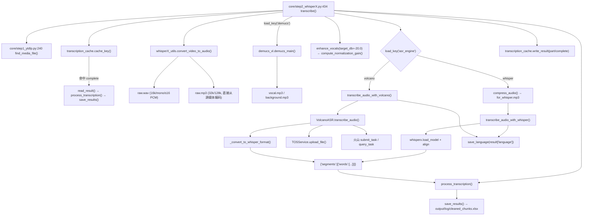

# ASR 引擎适配层（WhisperX / 火山引擎 / TOS）

`core/all_whisper_methods/` 是「语音识别插槽层」。它把一个**上游契约**（整段音频 + 时间区间）归一化成**下游契约**（WhisperX 形状的 `{'segments': [{'words': [...]}]}`），使得上层 `core/step2_whisperX.py` 与下游 `process_transcription()` 完全不需要知道用的是本地模型还是云端 API。

---

## 一、职责与边界

| 做什么 | 不做什么 |
| --- | --- |
| 把音频转成各引擎需要的格式与码率 | 决定什么时候切分音频（那是 `whisperX_utils.split_audio()`） |
| 调用 WhisperX 本地模型或火山引擎 HTTP API | 决定用哪个引擎（那是 `load_key('asr_engine')` 分支） |
| 把云端结果伪装成 WhisperX 的 `segments/words` 结构 | 落盘 `cleaned_chunks.xlsx`（那是 `save_results()`） |
| 管理 TOS 对象存储的上传/清理/缓存（火山路径） | 提供 LLM/TTS 相关能力 |

**核心设计约束**：下游只认 `segment['words'][i]['word'|'start'|'end']`。任何新引擎必须产出这个形状，否则 `process_transcription()` 会 `KeyError`。详见 [`../05-guides/02-如何新增一个ASR引擎.md`](../05-guides/02-如何新增一个ASR引擎.md)。

---

## 二、文件清单

| 文件 | 行数 | 主要职责 |
| --- | --- | --- |
| `core/all_whisper_methods/whisperX_utils.py` | 345 | 音频格式转换、静音切分、词级展平、音量归一化增益、语言回写（**引擎无关的公共工具**） |
| `core/all_whisper_methods/volcano_asr.py` | 803 | `VolcanoASR` 类：火山引擎在线 ASR 的完整客户端（上传、提交、轮询、结果转换、结果缓存） |
| `core/all_whisper_methods/tos_service.py` | 452 | `TOSService` 类：火山引擎对象存储（Torch Object Storage）封装 + `get_tos_service()` 单例 |
| `core/all_whisper_methods/transcription_cache.py` | 158 | **内容寻址的转录缓存**（`.cache/asr/<key>/<part>.json`），与引擎解耦（上游 `043aa7a` 移植） |
| `core/all_whisper_methods/demucs_vl.py` | 69 | Demucs 人声分离（严格说属于预处理，但与 ASR 输入强耦合） |
| `core/step2_whisperX.py` | 549 | **分发层**：引擎选择、音频准备、内容缓存、分段循环、合并、落盘 |

---

## 三、调用链



关键行号：`transcribe()` `core/step2_whisperX.py:434`、`_asr_cache_settings()` `:408`、`transcribe_audio()` 分发 `:312`、`transcribe_audio_with_whisper()` `:134`、`transcribe_audio_with_volcano()` `:267`、`enhance_vocals()` `:345`、`check_hf_mirror()` `:43`、`resolve_whisper_model()` `:110`。

---

## 四、两个引擎的实现对照

| 维度 | `whisper`（本地 WhisperX） | `volcano`（火山引擎在线） |
| --- | --- | --- |
| 实现位置 | `core/step2_whisperX.py:134-264` | `core/all_whisper_methods/volcano_asr.py`（入口 `core/step2_whisperX.py:267-309`） |
| 入口函数 | `transcribe_audio_with_whisper(audio_file, start, end)` | `transcribe_audio_with_volcano(audio_file, start, end)` |
| 底层调用 | `whisperx.load_model()` + `model.transcribe()` + `whisperx.align()` | `VolcanoASR.transcribe_audio()` → `submit_task()` + 轮询 `query_task()` |
| 输入音频 | `output/audio/for_whisper.mp3`（16 kHz / 96 kbps / 单声道，`compress_audio()` `whisperX_utils.py:27`） | `output/audio/raw.wav`（16 kHz / 单声道 / 16-bit PCM，`convert_video_to_audio()` `whisperX_utils.py:52`） |
| 是否需要网络 | 仅首次下载模型（含 HF 镜像探测 `check_hf_mirror()`，现在**每进程只探测一次**） | 全程需要（含 TOS 对象存储） |
| 是否需要额外凭证 | 无（模型缓存于 `config.yaml: model_dir`，`:120`） | `volcano_asr.app_id` / `access_token`；TOS 的 `tos.access_key` / `secret_key` |
| 词级时间戳来源 | `whisperx.align()` 强制对齐 | 火山返回的 `utterances[*].words[*]`（若 `show_utterances` 开启且服务端返回 words） |
| 时间戳单位换算 | 直接是秒 | **毫秒 → 秒**（`/ 1000.0`，`volcano_asr.py:491-508`） |
| 时间偏移处理 | 手动把 `start` 加回每个 segment/word（`step2_whisperX.py:252-260`） | `_convert_to_whisper_format(result, start_offset)` 的 `start_offset` 参数 |
| 分段策略 | `split_audio()` 按静音切成 ≤30 分钟段，避免 Whisper 的 25 MB 限制 | 同样走 `split_audio()`，但火山是按整段提交、自己切片 |
| 结果缓存 | 内容寻址缓存（`transcription_cache`，含分段级 `part` 与整段 `complete` 两级键） | 除内容缓存外**还有一级**：`output/log/asr_results/volcano_asr_<audio>_*.json`（`_find_cached_result()`） |
| 失败回退 | 无（异常直接抛） | 配置不全时**回退 whisper**（`step2_whisperX.py:329-337`） |
| 中文特殊处理 | `whisper.language == 'zh'` → 强制 Belle 标点模型（`load_whisper_model_name()` `:103-107`） | 由 `volcano_asr.language` + `enable_punc` 控制 |
| 语言回写 | `save_language(result['language'])`（`step2_whisperX.py:239`） | `save_language(result.get('language'))`（`:302`，`None` 时保持原值不写） |
| 本地模型目录 | `resolve_whisper_model()` 先用"完整"的本地目录，否则回退 HuggingFace（`:110-131`） | 不涉及 |

---

## 五、`VolcanoASR` 类详解

### 5.1 方法清单

| 方法 | 行号 | 作用 |
| --- | --- | --- |
| （类定义） | `:22` | `class VolcanoASR` |
| `__init__()` | `:25` | 读 `config.yaml` 的 `volcano_asr.*` 与 `tos.*`，构造 `TOSService` 实例 |
| `_validate_config()` | `:57` | 校验 `app_id` / `access_token` 是否齐全 |
| `_upload_audio_to_temp_url(audio_file)` | `:66` | **上传音频到 TOS 并返回可访问 URL**（火山需要音频公网可达） |
| `_convert_audio_for_volcano(audio_file)` | `:117` | 转成 16 kHz / 单声道 / 16-bit PCM WAV（并用 ffprobe 校验） |
| `submit_task(audio_url, audio_file=None)` | `:178` | 提交识别任务，返回 `(task_id, log_id)` |
| `query_task(task_id, log_id)` | `:277` | 轮询任务状态，返回结果 dict |
| `_extract_audio_segment(audio_file, start, end)` | `:331` | 从整段音频切出 `[start, end)` 区间为临时文件 |
| `transcribe_audio(audio_file, start=0, end=None)` | `:372` | **主入口**：缓存查找 → 切片 → 转换 → 上传 → 提交 → 轮询 → 转换格式 → 存缓存 → 清理临时文件 |
| `_convert_to_whisper_format(volcano_result, start_offset=0)` | `:465` | **契约转换点**：火山结果 → WhisperX 形状 |
| `_find_cached_result(audio_file, start, end=None)` | `:524` | 在 `output/log/asr_results/` 里找同音频 + 同 `start_offset` 的历史结果 |
| `_save_asr_result_to_json(...)` | `:601` | 把火山原始结果 + 转换结果 + `metadata` 一起落盘 |
| `_cleanup_tos_file_after_result()` | `:667` | 按 `tos.auto_cleanup` 决定是否删除 TOS 上的临时文件 |
| `_detect_language_from_result(result_data)` | `:686` | **如实回报**本次识别语言：响应字段 → 配置语言 → `None`（见 §九.11） |
| `cleanup()` | `:738` | 释放资源（清理 TOS 旧文件） |
| `test_volcano_asr()` | `:753` | 模块 `__main__` 的手工联调入口 |

### 5.2 契约转换的真实逻辑（`_convert_to_whisper_format`，`:465-522`）

```
① 从 volcano_result["result"] 取出 utterances（缺 result 字段直接 raise，:476-477）
② 若 utterances 存在（:488）：
     每个 utterance → 一个 segment
        start = utterance.start_time / 1000 + start_offset   （:491）
        end   = utterance.end_time   / 1000 + start_offset   （:492）
        words = utterance.words[*] → {word, start/1000+offset, end/1000+offset}（:499-509）
        跳过纯空白词（:502-503）
③ 若只有 text（没有 utterances）（:512-520）：
     造**一个** segment，start = start_offset，
     end = start_offset + audio_info.duration / 1000，words = []
④ 返回 {"segments": [...], "language": <_detect_language_from_result(result_data)>}（:482-485）
```

> ⚠️ **分支 ③ 是个地雷**：它产出的 segment 的 `words` 是**空列表**。`process_transcription()` 遍历 `segment['words']` 时不会报错（空列表直接跳过），于是一整段文本**静默丢失**，最终 `cleaned_chunks.xlsx` 里没有这些词——下游 `step3` 会得到不完整的句子，`step6` 的对齐更会直接报「未找到与句子匹配的内容」。
>
> **触发条件链**：`config.example.yaml:66` 的 `volcano_asr.show_utterances` 控制是否走分支 ②（`submit_task()` 的请求体字段，`volcano_asr.py:227`）。走 ② 之后，**还要求服务端在 `utterances[*]` 里返回 `words` 数组**才会填充词级时间戳（`volcano_asr.py:498-509`）。代码里**没有**单独的"词级时间戳开关"，所以这一层完全取决于火山侧的返回。建议：跑完火山后立刻检查 `cleaned_chunks.xlsx` 是否为 0 行或行数异常少。
>
> **补充**（`submit_task()` 的请求体，`volcano_asr.py:213-239`）：
> - `model_version` 只在值 **不等于 `"310"`** 时才写入请求（`:237-239`），所以默认的 `'400'` 会发送、`'310'` 反而不发（依赖服务端默认）。
> - 音频 `format` 由文件扩展名推断（`:199-211`），扩展名不在映射表内则默认 `"mp3"`。
> - `language` 只在非空时写入（`:233-235`）。

### 5.3 结果缓存机制（两级）

**第一级：内容寻址缓存**（`core/all_whisper_methods/transcription_cache.py`，上游 `043aa7a` 移植）

| 函数 | 行号 | 作用 |
| --- | --- | --- |
| `cache_key(media_file, settings)` | `:45` | 对源媒体分块算 md5 以收敛大文件，再用 sha256 把 `{schema, media_md5, packages, **settings}` 序列化成键 |
| `valid_result(result)` | `:66` | 结构校验：`segments` 必须是 list，每个 word 要有字符串 `word`，`start/end` 必须是有限非负数且 `end >= start` |
| `read_result(key, part)` | `:98` | 读 `.cache/asr/<key>/<part>.json`；schema/key 不符或校验失败一律返回 `None`（当作未命中） |
| `write_result(key, part, result, language=None)` | `:116` | 临时文件 + `os.replace()` **原子写入**；失败静默 |
| `clear_cache()` | `:147` | 删除 `.cache/asr/` 下的 `*.json`，返回删除文件数 |

身份里放什么、不放什么（`_asr_cache_settings()`，`core/step2_whisperX.py:408-431`）：放 `asr_engine`、`whisper.model`、`whisper.language`、`demucs`，火山引擎时再加 10 个参数（`resource_id`/`language`/`enable_punc`/`enable_itn`/`enable_ddc`/`enable_speaker_info`/`show_utterances`/`enable_channel_split`/`vad_segment`/`model_version`）；**刻意不含密钥、文件名与翻译/TTS 设置**（`transcription_cache.py:46-50` 的 docstring 写明理由）。包版本 `whisperx`/`faster-whisper`/`demucs` 也参与身份（`_package_versions()` `:34-42`）。

缓存粒度两级：分段级 `<start>_<end>.json`（`core/step2_whisperX.py:509-521`）与整段 `complete.json`（`:530-534`）；`complete` 命中时会**连 Demucs 一起跳过**（`:456-463`）。用 `whisper.cache: false` 可整体关闭（`:447`，由 `load_key_or` 读取，键不存在时默认 `true`）。

**第二级：火山自己的 JSON 结果缓存**

- 目录：`output/log/asr_results/`
- 命名：`volcano_asr_<音频basename不含扩展名>_*.json`（`volcano_asr.py:547`）
- 命中条件（`_find_cached_result`，`:524-599`）：`metadata.audio_file` 的 basename 匹配 **且** `metadata.start_offset` 与 `start` 相差 ≤ 0.1 秒（`:568-573`）；若传入 `end`，还要求 `audio_info.duration` 与区间长度一致（`:576-582`）
- 排序：按 mtime 倒序，取最新命中（`:551`）
- 简化版文件缺 `language` 时返回 `None` 而不是兜底成 `'en'`（`:591-593`）

> 💡 这是**独立于两个整体幂等标记（`cleaned_chunks.xlsx`）的额外缓存**。如果你改了火山参数却发现结果没变，除了删 `cleaned_chunks.xlsx`，还要**删 `output/log/asr_results/`**；若还开着内容缓存，则连 `.cache/asr/` 一起删（或临时设 `whisper.cache: false`）。

---

## 六、`TOSService` 类详解

TOS = 火山引擎对象存储（Torch Object Storage）。火山 ASR 要求音频以 URL 形式可达，所以必须先上传。

| 方法 | 行号 | 作用 |
| --- | --- | --- |
| `__init__()` | `:30` | 读 `tos.*` 配置（`:38`/`:40` 支持 `TOS_ACCESS_KEY`/`TOS_SECRET_KEY` 环境变量回退） |
| `_init_tos_client()` | `:62` | 延迟初始化 `tos` SDK 客户端 |
| `_build_object_key(...)` | `:115` | 生成带前缀/名字提示的对象键 |
| `upload_file(local_file_path, object_key=None, prefix=, name_hint=)` | `:134` | 上传并返回 `(成功, 公网URL, object_key)` |
| `delete_file(object_key)` | `:209` | 删除单个对象 |
| `cleanup_old_files()` | `:234` | 清理历史对象 |
| `cleanup_all_files()` | `:242` | 清空 bucket 内本工具的对象 |
| `cleanup_uploaded_file(object_key)` | `:263` | 删除本次上传的文件 |
| `cleanup_by_name(name_hint)` | `:305` | 按名字提示清理同一视频的对象 |
| `get_public_url(object_key)` | `:332` | 由 `tos.public_url_prefix` 拼公网地址 |
| `is_enabled()` | `:344` | 返回 `tos.enabled` |
| `get_upload_info()` | `:348` | 返回本次上传信息汇总 |
| `clear_file_cache(local_file_path=None)` | `:357` | 清掉本地"已上传"记录缓存 |
| `get_tos_service()` / `reset_tos_service()` | `:381` / `:389` | 单例获取 / 重置 |

配置键（模板 `config.example.yaml:75-91` 的 `tos:` 段）：

| 键 | 作用 |
| --- | --- |
| `access_key` / `secret_key` | 火山 TOS 凭证（也可用 `TOS_ACCESS_KEY`/`TOS_SECRET_KEY` 或 `VIDEOLINGO_TOS_ACCESS_KEY`/`VIDEOLINGO_TOS_SECRET_KEY`，`tos_service.py:38,40,69-70`） |
| `endpoint` / `region` | 服务端点与地域 |
| `bucket_name` | 存储桶 |
| `enabled` | 是否启用上传（false 时走 `file://` 形式的 URL——⚠️ 需人工确认该分支的真实可用性） |
| `public_url_prefix` | 公网 URL 前缀，为空则自动生成 |
| `auto_cleanup` | 识别完成后是否删除已上传文件 |

> 📌 **本文件是项目唯一的 TOS 实现**。历史上 `batch/utils/tos_manager.py` 里另有一个未接线的 `BatchTOSManager`，其能力（语义化对象键、按视频清理、上传信息汇总）已在重构 Round 2 合并进这里并删除该文件。
> 现在的对外接口：`get_tos_service()`（单例）、`upload_file(..., prefix=, name_hint=)`、`cleanup_by_name()`、`get_upload_info()`、`reset_tos_service()`。
> 用单例的原因：ASR 分段循环里**每段**都会新建 `VolcanoASR`，若每段都新建 `TOSService`，`file_cache`（同一文件只上传一次）会失效、`uploaded_files` 也无法统一清理。

---

## 七、`whisperX_utils.py` 的公共工具（引擎无关）

| 函数 | 行号 | 作用 |
| --- | --- | --- |
| `_ffmpeg_has_encoder(encoder_name)` | `:13` | 探测 `ffmpeg -encoders` 输出；缺 `libmp3lame` 时各处回退为 PCM/WAV（`conda-forge` 精简构建常见） |
| `compress_audio(input, output)` | `:27` | 转 16 kHz / 96 kbps / 单声道 mp3（Whisper 输入）；无 lame 时转 16 kHz PCM WAV |
| `convert_video_to_audio(video_file)` | `:52` | 视频 → `raw.wav`（16 kHz/mono/s16，火山输入）+ `raw.mp3`（**直接从源媒体**编码 32 kHz/128 kbps，Whisper/Demucs 输入）；两条命令都带 `aresample=async=1:first_pts=0` 做时间轴对齐 |
| `_detect_silence(audio_file, start, end)` | `:96` | 用 `silencedetect=n=-30dB:d=0.5` 找静音点 |
| `get_audio_duration(audio_file)` | `:110` | 解析 ffmpeg stderr 的 `Duration:` 行取时长 |
| `split_audio(audio_file, target_len=30*60, win=60, min_segment_len=0.5)` | `:145` | 按静音点把长音频切段 |
| `process_transcription(result)` | `:223` | 展平 segments→words 为 DataFrame，含词级清洗（>20 字符的词丢弃、法文 `«»` 清除） |
| `save_results(df)` | `:274` | 落盘 `cleaned_chunks.xlsx`（**text 值加双引号**） |
| `compute_normalization_gain(audio_path, target_db=-20.0, peak_ceiling_db=-1.0)` | `:294` | 按实测 `dBFS` 算增益，并用峰值上限夹住；算不出时返回 `0.0`（见 §九.8） |
| `save_language(language)` | `:332` | 回写 `config.yaml: whisper.detected_language`；**`None`/空串/`'auto'` 一律跳过** |

> ⚠️ 历史上还有一个 `convert_to_volcano_wav(input, output)`，现在**已不存在**——该职责并入 `VolcanoASR._convert_audio_for_volcano()`（`volcano_asr.py:117`），并带 ffprobe 校验（16 kHz / 单声道 / s16）。文档或脚本里再引用这个名字会直接 `ImportError`。

---

## 八、关键参数与配置

| 配置键 | 默认 | 影响 |
| --- | --- | --- |
| `asr_engine` | `'whisper'` | 引擎分发（`'whisper'` / `'volcano'`）；**上游 3.0.4 把它改名为 `whisper.runtime`，dev 明确不跟** |
| `whisper.model` | `'large-v3'` | 非中文时的本地模型名 |
| `whisper.language` | `'zh'` | 识别语言；`'zh'` 强制 Belle 模型；`'auto'` 走检测；也是 `get_source_language()` 的首选来源 |
| `whisper.detected_language` | `'zh'` | **由 `save_language()` 回写**，翻译/切分阶段在 `whisper.language == 'auto'` 时读它 |
| `whisper.cache` | （模板中**没有**该键，默认 `true`） | 内容寻址转录缓存开关，`core/step2_whisperX.py:447` 用 `load_key_or` 读，旧配置不写也能跑；要关闭需手动加 `cache: false` |
| `demucs` | `false` | 是否先做人声分离 |
| `model_dir` | `'./_model_cache'` | 模型缓存目录，同时作为 `download_root` |
| `volcano_asr.app_id` / `access_token` | — | 火山凭证，缺失则回退 whisper |
| `volcano_asr.resource_id` | `'volc.bigasr.auc'` | 请求头 `X-Api-Resource-Id` |
| `volcano_asr.language` | `'zh-CN'` | 火山语言码（与 whisper 的 `zh` 不同！） |
| `volcano_asr.show_utterances` | `true` | **必须为 true 才有时序结构**（见 5.2 的地雷） |
| `volcano_asr.enable_punc` | `false` | 标点 |
| `volcano_asr.model_version` | `'400'` | `'310'` / `'400'`（`'310'` 不写进请求体） |
| `tos.enabled` | `true` | 是否上传 TOS |
| `tos.auto_cleanup` | `true` | 识别后是否清 TOS 临时文件 |

配置键行号见模板 `config.example.yaml:37-91`（`asr_engine` `:37`、`demucs` `:38`、`whisper` 块 `:39-44`、`volcano_asr` 块 `:47-72`、`tos` 块 `:75-91`）。

---

## 九、技术要点与坑

1. **毫秒 vs 秒**：火山返回毫秒，WhisperX 用秒。转换只在 `_convert_to_whisper_format()` 一处发生，若新增引擎务必确认单位。
2. **`start_offset` 必须传**：分段转写时，若不把区间起点加回，所有时间戳都会从 0 开始，`step6` 的对齐会全错（Whisper 分支是手写循环加的，见 `step2_whisperX.py:252-260`）。
3. **空 `words` 会静默丢文本**：见 5.2 的 ⚠️。
4. **三层缓存**：内容寻址缓存 `.cache/asr/`（分段 + 整段）+ `output/log/asr_results/*.json`（火山专用）+ `cleaned_chunks.xlsx`（整体幂等）。调参后三层都要清。
5. **中文模型强制替换**：`whisper.language == 'zh'` 时 `whisper.model` 被忽略（`step2_whisperX.py:103-107`）。
6. **本地模型完整性校验**：`resolve_whisper_model()`（`:110-131`）要求目录内 `config.json`/`model.bin`/`tokenizer.json` 三者**都存在且非空**（`_complete_model_directory()` `:93-100`）才当作本地模型，否则回落到 HuggingFace 名字重新获取——避免"下载到一半"的目录被误用。
7. **HF 镜像探测只做一次**：`check_hf_mirror()`（`:43-85`）结果缓存在模块级 `_HF_ENDPOINT_CACHE`；若用户已设置 `HF_ENDPOINT` 环境变量则**直接尊重**、完全不探测（`:52-56`）。旧实现是每个音频分段各 ping 两个域名一次（最坏每段白等 6 秒）。
8. **人声归一化按实测电平**：`enhance_vocals(target_db=-20.0)`（`:345-406`）用 `compute_normalization_gain()` 算增益并限制峰值（默认 −1 dBFS，**衰减从不限制**），替换掉原先拍脑袋的 `volume=2.50`；编码参数与旧实现完全一致（火山输出仍 16 kHz/mono/s16）。
9. **`save_language()` 会改 `config.yaml`**：这是"步骤会修改全局配置"的少见例子，也是批处理中断后配置可能被改掉的原因。它现在会过滤 `None`/空串/`'auto'`（`whisperX_utils.py:340-344`），因此"拿不到语言"时**保持原值**而不是写入伪造值。
10. **`raw.mp3` 直接从源媒体编码**：它不再从 16 kHz 的 `raw.wav` 转码（旧实现因此实际带宽被卡在 8 kHz 以内），`raw.wav` 仍保持 16 kHz/单声道/s16 PCM（火山侧 ffprobe 校验，不可改）。
11. **火山分支现在也会写识别语言**：`transcribe_audio_with_volcano()` 在拿到结果后调用 `save_language(result.get('language'))`（`step2_whisperX.py:302`），而 `_detect_language_from_result()`（`volcano_asr.py:686-736`）按"响应字段 → 配置语言 → `None`"如实回报，不再在自动检测时无条件返回 `'en'`。

---

## 十、扩展点

| 想做的事 | 动哪里 |
| --- | --- |
| 新增 ASR 引擎 | [`../05-guides/02-如何新增一个ASR引擎.md`](../05-guides/02-如何新增一个ASR引擎.md)（本文件只定义"适配层契约"；该手册给逐步操作清单） |
| 调整分段长度 / 静音阈值 | `whisperX_utils.split_audio()` 与 `_detect_silence()` 的默认参数（当前是硬编码，非配置项） |
| 换掉 TOS（用 S3/OSS） | 实现与 `TOSService` 同名的接口，改 `volcano_asr.py` 的引用 |
| 让火山支持更细的分段并行 | `volcano_asr.py` 的 `transcribe_audio()` 目前是串行提交+轮询 |
| 加一门语言的 whisper 模型 | `config.example.yaml: whisper.model` 语义不变，直接填模型名即可 |
| 调整 / 关闭转录缓存 | 开关：配置项 `whisper.cache`（模板里没有，手动加才生效）；身份字段：`core/step2_whisperX.py:408-431` 的 `_asr_cache_settings()`；结构变更时递增 `transcription_cache.py:31` 的 `SCHEMA` 即可让旧缓存整体失效 |
| 新增一种"结果结构" | 必须同时满足 `transcription_cache.valid_result()`（`:66`）与下游 `process_transcription()`（`whisperX_utils.py:223`）对 `segment['words'][i]['word'|'start'|'end']` 的要求 |

---

## 十、相关文档

- [`../02-pipeline/02-语音识别ASR.md`](../02-pipeline/02-语音识别ASR.md) — step2 完整流程与 `split_audio` 算法
- [`../02-pipeline/01-下载与音频提取.md`](../02-pipeline/01-下载与音频提取.md) — Demucs 与音频格式转换
- [`../05-guides/02-如何新增一个ASR引擎.md`](../05-guides/02-如何新增一个ASR引擎.md) — 新增引擎的操作手册
- `参考文档/火山引擎ASR使用说明.md`、`参考文档/tos.md` — 官方 API 原始文档
