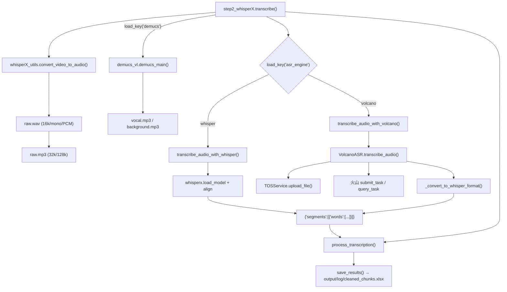

# ASR 引擎适配层（WhisperX / 火山引擎 / TOS）

`core/all_whisper_methods/` 是「语音识别插槽层」。它把一个**上游契约**（整段音频 + 时间区间）归一化成**下游契约**（WhisperX 形状的 `{'segments': [{'words': [...]}]}`），使得上层 `core/step2_whisperX.py` 与下游 `process_transcription()` 完全不需要知道用的是本地模型还是云端 API。

---

## 一、职责与边界

| 做什么 | 不做什么 |
| --- | --- |
| 把音频转成各引擎需要的格式与码率 | 决定什么时候切分音频（那是 `whisperX_utils.split_audio()`） |
| 调用 WhisperX 本地模型或火山引擎 HTTP API | 决定用哪个引擎（那是 `load_key('asr_engine')` 分支） |
| 把云端结果伪装成 WhisperX 的 `segments/words` 结构 | 落盘 `cleaned_chunks.xlsx`（那是 `save_results()`） |
| 管理 TOS 对象存储的上传/清理/缓存（火山路径） | 提供 LLM/TTS 相关能力 |

**核心设计约束**：下游只认 `segment['words'][i]['word'|'start'|'end']`。任何新引擎必须产出这个形状，否则 `process_transcription()` 会 `KeyError`。详见 [`../05-guides/02-如何新增一个ASR引擎.md`](../05-guides/02-如何新增一个ASR引擎.md)。

---

## 二、文件清单

| 文件 | 行数 | 主要职责 |
| --- | --- | --- |
| `core/all_whisper_methods/whisperX_utils.py` | 281 | 音频格式转换、静音切分、词级展平、语言回写（**引擎无关的公共工具**） |
| `core/all_whisper_methods/volcano_asr.py` | 766 | `VolcanoASR` 类：火山引擎在线 ASR 的完整客户端（上传、提交、轮询、结果转换、结果缓存） |
| `core/all_whisper_methods/tos_service.py` | ~310 | `TOSService` 类：火山引擎对象存储（Torch Object Storage）封装 |
| `core/all_whisper_methods/demucs_vl.py` | 59 | Demucs 人声分离（严格说属于预处理，但与 ASR 输入强耦合） |
| `core/step2_whisperX.py` | 391 | **分发层**：引擎选择、音频准备、分段循环、合并、落盘 |

---

## 三、调用链



---

## 四、两个引擎的实现对照

| 维度 | `whisper`（本地 WhisperX） | `volcano`（火山引擎在线） |
| --- | --- | --- |
| 实现位置 | `core/step2_whisperX.py:66-206` | `core/all_whisper_methods/volcano_asr.py` |
| 入口函数 | `transcribe_audio_with_whisper(audio_file, start, end)` | `transcribe_audio_with_volcano(audio_file, start, end)` |
| 底层调用 | `whisperx.load_model()` + `model.transcribe()` + `whisperx.align()` | `VolcanoASR.transcribe_audio()` → `submit_task()` + `poll query_task()` |
| 输入音频 | `output/audio/for_whisper.mp3`（16 kHz / 96 kbps / 单声道） | `output/audio/raw.wav`（16 kHz / 单声道 / 16-bit PCM） |
| 是否需要网络 | 仅首次下载模型（含 HF 镜像测速 `check_hf_mirror()`） | 全程需要（含 TOS 对象存储） |
| 是否需要额外凭证 | 无（模型本地缓存于 `config.yaml: model_dir`） | `volcano_asr.app_id` / `access_token`；TOS 的 `tos.access_key` / `secret_key` |
| 词级时间戳来源 | `whisperx.align()` 强制对齐 | 火山返回的 `utterances[*].words[*]`（若 `enable_punc`/词级开关开启） |
| 时间戳单位换算 | 直接是秒 | **毫秒 → 秒**（`/ 1000.0`，`volcano_asr.py:484-501`） |
| 时间偏移处理 | 手动把 `start` 加回每个 segment/word（`step2_whisperX.py:194-202`） | `_convert_to_whisper_format(result, start_offset)` 的 `start_offset` 参数 |
| 分段策略 | `split_audio()` 按静音切成 ≤30 分钟段，避免 Whisper 的 25 MB 限制 | 同样走 `split_audio()`，但火山是按整段提交、自己切片 |
| 结果缓存 | `output/gpt_log` 不涉及；靠 `cleaned_chunks.xlsx` 整体幂等 | **额外一级**：`output/log/asr_results/volcano_asr_<audio>_*.json`（`_find_cached_result()`） |
| 失败回退 | 无（异常直接抛） | 配置不全时**回退 whisper**（`step2_whisperX.py:258-271`） |
| 中文特殊处理 | `whisper.language == 'zh'` → 强制 Belle 标点模型 | 由 `volcano_asr.language` + `enable_punc` 控制 |
| 语言回写 | `save_language(result['language'])` | 同样有 `_detect_language_from_result()` |

---

## 五、`VolcanoASR` 类详解

### 5.1 方法清单

| 方法 | 行号 | 作用 |
| --- | --- | --- |
| `__init__()` | `:25` | 读 `config.yaml` 的 `volcano_asr.*` 与 `tos.*`，构造 `TOSService` 实例 |
| `_validate_config()` | `:54` | 校验 `app_id` / `access_token` 是否齐全 |
| `_upload_audio_to_temp_url(audio_file)` | `:63` | **上传音频到 TOS 并返回可访问 URL**（火山需要音频公网可达） |
| `_convert_audio_for_volcano(audio_file)` | `:112` | 转成 16 kHz / 单声道 / 16-bit PCM WAV |
| `submit_task(audio_url, audio_file=None)` | `:173` | 提交识别任务，返回 `(task_id, log_id)` |
| `query_task(task_id, log_id)` | `:272` | 轮询任务状态，返回结果 dict |
| `_extract_audio_segment(audio_file, start, end)` | `:326` | 从整段音频切出 `[start, end)` 区间为临时文件 |
| `transcribe_audio(audio_file, start=0, end=None)` | `:367` | **主入口**：缓存查找 → 切片 → 转换 → 上传 → 提交 → 轮询 → 转换格式 → 存缓存 → 清理临时文件 |
| `_convert_to_whisper_format(volcano_result, start_offset=0)` | `:458` | **契约转换点**：火山结果 → WhisperX 形状 |
| `_find_cached_result(audio_file, start, end=None)` | `:517` | 在 `output/log/asr_results/` 里找同音频 + 同 `start_offset` 的历史结果 |
| `_save_asr_result_to_json(...)` | `:593` | 把火山原始结果 + 转换结果 + `metadata` 一起落盘 |
| `_cleanup_tos_file_after_result()` | `:659` | 按 `tos.auto_cleanup` 决定是否删除 TOS 上的临时文件 |
| `_detect_language_from_result(result_data)` | `:678` | 从结果里推断语言码 |
| `cleanup()` | `:709` | 释放资源 |

### 5.2 契约转换的真实逻辑（`_convert_to_whisper_format`，`:458-515`）

```
① 从 volcano_result["result"] 取出 utterances
② 若 utterances 存在：
     每个 utterance → 一个 segment
        start = utterance.start_time / 1000 + start_offset
        end   = utterance.end_time   / 1000 + start_offset
        words = utterance.words[*] → {word, start/1000+offset, end/1000+offset}
        跳过纯空白词
③ 若只有 text（没有 utterances）：
     造**一个** segment，start = start_offset，
     end = start_offset + audio_info.duration / 1000，words = []
④ 返回 {"segments": [...], "language": <detected>}
```

> ⚠️ **分支 ③ 是个地雷**：它产出的 segment 的 `words` 是**空列表**。`process_transcription()` 遍历 `segment['words']` 时不会报错（空列表直接跳过），于是一整段文本**静默丢失**，最终 `cleaned_chunks.xlsx` 里没有这些词——下游 `step3` 会得到不完整的句子，`step6` 的对齐更会直接报「未找到与句子匹配的内容」。
>
> **触发条件链**：`config.yaml: volcano_asr.show_utterances` 控制是否走分支 ②（`submit_task()` 的请求体字段，`volcano_asr.py:222`）。走 ② 之后，**还要求服务端在 `utterances[*]` 里返回 `words` 数组**才会填充词级时间戳（`volcano_asr.py:491`）。代码里**没有**单独的"词级时间戳开关"，所以这一层完全取决于火山侧的返回。建议：跑完火山后立刻检查 `cleaned_chunks.xlsx` 是否为 0 行或行数异常少。
>
> **补充**（`submit_task()` 的请求体，`volcano_asr.py:208-234`）：
> - `model_version` 只在值 **不等于 `"310"`** 时才写入请求（`:233`），所以默认的 `'400'` 会发送、`'310'` 反而不发（依赖服务端默认）。
> - 音频 `format` 由文件扩展名推断（`:196-205`），扩展名不在映射表内则默认 `"mp3"`。
> - `language` 只在非空时写入（`:229-230`）。

### 5.3 结果缓存机制

- 目录：`output/log/asr_results/`
- 命名：`volcano_asr_<音频basename不含扩展名>_*.json`（`volcano_asr.py:540`）
- 命中条件（`_find_cached_result`，`:517-592`）：`metadata.audio_file` 的 basename 匹配 **且** `metadata.start_offset` 匹配
- 文件结构：火山原始结果 + 转换后的 whisper 格式 + `metadata`（含 `audio_file` / `start_offset` 等）三段
- 排序：按 mtime 倒序，取最新命中（`:544`）

> 💡 这是**独立于 `cleaned_chunks.xlsx` 幂等机制的第二层缓存**。如果你改了火山参数却发现结果没变，除了删 `cleaned_chunks.xlsx`，还要**删 `output/log/asr_results/`**。

---

## 六、`TOSService` 类详解

TOS = 火山引擎对象存储（Torch Object Storage）。火山 ASR 要求音频以 URL 形式可达，所以必须先上传。

| 方法 | 行号 | 作用 |
| --- | --- | --- |
| `__init__()` | `:20` | 读 `tos.*` 配置 |
| `_init_tos_client()` | `:51` | 延迟初始化 `tos` SDK 客户端 |
| `upload_file(local_file_path, object_key=None)` | `:95` | 上传并返回 `(成功, 公网URL, object_key)` |
| `delete_file(object_key)` | `:174` | 删除单个对象 |
| `cleanup_old_files()` | `:199` | 清理历史对象 |
| `cleanup_all_files()` | `:207` | 清空 bucket 内本工具的对象 |
| `cleanup_uploaded_file(object_key)` | `:228` | 删除本次上传的文件 |
| `get_public_url(object_key)` | `:272` | 由 `tos.public_url_prefix` 拼公网地址 |
| `is_enabled()` | `:284` | 返回 `tos.enabled` |
| `clear_file_cache(local_file_path=None)` | `:288` | 清掉本地"已上传"记录缓存 |

配置键（`config.yaml: tos`）：

| 键 | 作用 |
| --- | --- |
| `access_key` / `secret_key` | 火山 TOS 凭证 |
| `endpoint` / `region` | 服务端点与地域 |
| `bucket_name` | 存储桶 |
| `enabled` | 是否启用上传（false 时走 `file://` 形式的 URL——⚠️ 需人工确认该分支的真实可用性） |
| `public_url_prefix` | 公网 URL 前缀，为空则自动生成 |
| `auto_cleanup` | 识别完成后是否删除已上传文件 |

> 📌 **本文件是项目唯一的 TOS 实现**。历史上 `batch/utils/tos_manager.py` 里另有一个未接线的 `BatchTOSManager`，其能力（语义化对象键、按视频清理、上传信息汇总）已在重构 Round 2 合并进这里并删除该文件。
> 现在的对外接口：`get_tos_service()`（单例）、`upload_file(..., prefix=, name_hint=)`、`cleanup_by_name()`、`get_upload_info()`、`reset_tos_service()`。
> 用单例的原因：ASR 分段循环里**每段**都会新建 `VolcanoASR`，若每段都新建 `TOSService`，`file_cache`（同一文件只上传一次）会失效、`uploaded_files` 也无法统一清理。

---

## 七、`whisperX_utils.py` 的公共工具（引擎无关）

| 函数 | 行号 | 作用 |
| --- | --- | --- |
| `compress_audio(input, output)` | `:13` | 转 16 kHz / 96 kbps / 单声道 mp3（Whisper 输入） |
| `convert_to_volcano_wav(input, output)` | `:27` | 转 16 kHz / 单声道 / 16-bit PCM WAV（火山输入） |
| `convert_video_to_audio(video_file)` | `:51` | 视频 → `raw.wav` + `raw.mp3` 双轨 |
| `_detect_silence(audio_file, start, end)` | `:82` | 用 `silencedetect=n=-30dB:d=0.5` 找静音点 |
| `get_audio_duration(audio_file)` | `:96` | 解析 ffmpeg stderr 的 `Duration:` 行取时长 |
| `split_audio(audio_file, target_len=30*60, win=60, min_segment_len=0.5)` | `:131` | 按静音点把长音频切段 |
| `process_transcription(result)` | `:209` | 展平 segments→words 为 DataFrame，含词级清洗 |
| `save_results(df)` | `:260` | 落盘 `cleaned_chunks.xlsx`（**text 值加双引号**） |
| `save_language(language)` | `:280` | 回写 `config.yaml: whisper.detected_language` |

---

## 八、关键参数与配置

| 配置键 | 默认 | 影响 |
| --- | --- | --- |
| `asr_engine` | `'whisper'` | 引擎分发（`'whisper'` / `'volcano'`） |
| `whisper.model` | `'large-v3'` | 非中文时的本地模型名 |
| `whisper.language` | `'zh'` | 识别语言；`'zh'` 强制 Belle 模型；`'auto'` 走检测 |
| `whisper.detected_language` | `'zh'` | **由代码回写**，翻译/切分阶段读取 |
| `demucs` | `false` | 是否先做人声分离 |
| `model_dir` | `'./_model_cache'` | 模型缓存目录，同时作为 `download_root` |
| `volcano_asr.app_id` / `access_token` | — | 火山凭证，缺失则回退 whisper |
| `volcano_asr.language` | `'zh-CN'` | 火山语言码（与 whisper 的 `zh` 不同！） |
| `volcano_asr.show_utterances` | `true` | **必须为 true 才有时序结构**（见 5.2 的地雷） |
| `volcano_asr.enable_punc` | `false` | 标点 |
| `volcano_asr.model_version` | `'400'` | `'310'` / `'400'` |
| `tos.enabled` | `true` | 是否上传 TOS |
| `tos.auto_cleanup` | `true` | 识别后是否清 TOS 临时文件 |

---

## 九、技术要点与坑

1. **毫秒 vs 秒**：火山返回毫秒，WhisperX 用秒。转换只在 `_convert_to_whisper_format()` 一处发生，若新增引擎务必确认单位。
2. **`start_offset` 必须传**：分段转写时，若不把区间起点加回，所有时间戳都会从 0 开始，`step6` 的对齐会全错（Whisper 分支是通过手写循环加的，见 `step2_whisperX.py:194-202`）。
3. **空 `words` 会静默丢文本**：见 5.2 的 ⚠️。
4. **两级缓存**：`cleaned_chunks.xlsx`（整体）+ `output/log/asr_results/*.json`（火山分段）。调参后两者都要清。
5. **中文模型强制替换**：`whisper.language == 'zh'` 时 `whisper.model` 被忽略（`step2_whisperX.py:95-97`）。
6. **HF 镜像测速**：每次转写都会 `ping` huggingface.co 与 hf-mirror.com 决定 `HF_ENDPOINT`（`step2_whisperX.py:36-64`），在无 ICMP 的环境下会白等最多 6 秒。
7. **`save_language()` 会改 `config.yaml`**：这是"步骤会修改全局配置"的少见例子，也是批处理中断后配置可能被改掉的原因（`batch/README.zh.md:51` 也提醒了这点）。

---

## 十、扩展点

| 想做的事 | 动哪里 |
| --- | --- |
| 新增 ASR 引擎 | [`../05-guides/02-如何新增一个ASR引擎.md`](../05-guides/02-如何新增一个ASR引擎.md) |
| 调整分段长度 / 静音阈值 | `whisperX_utils.split_audio()` 与 `_detect_silence()` 的默认参数（当前是硬编码，非配置项） |
| 换掉 TOS（用 S3/OSS） | 实现与 `TOSService` 同名的接口，改 `volcano_asr.py` 的引用 |
| 让火山支持更细的分段并行 | `volcano_asr.py` 的 `transcribe_audio()` 目前是串行提交+轮询 |
| 加一门语言的 whisper 模型 | `config.yaml: whisper.model` 语义不变，直接填模型名即可 |

---

## 十、相关文档

- [`../02-pipeline/02-语音识别ASR.md`](../02-pipeline/02-语音识别ASR.md) — step2 完整流程与 `split_audio` 算法
- [`../02-pipeline/01-下载与音频提取.md`](../02-pipeline/01-下载与音频提取.md) — Demucs 与音频格式转换
- [`../05-guides/02-如何新增一个ASR引擎.md`](../05-guides/02-如何新增一个ASR引擎.md) — 新增引擎的操作手册
- `参考文档/火山引擎ASR使用说明.md`、`参考文档/tos.md` — 官方 API 原始文档
