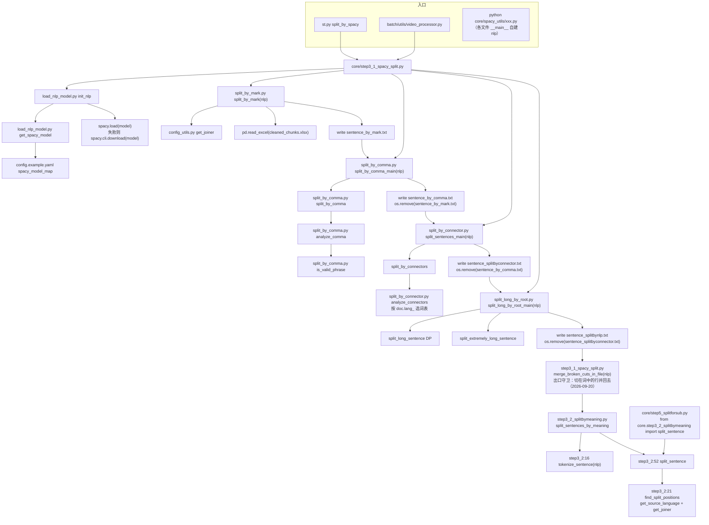

# NLP 切分工具（core/spacy_utils/ 逐函数手册）

## 一、职责与边界

`core/spacy_utils/` 是 step3 阶段一的实现层：把一段**没有任何标点之外的边界信息**的连续文本，用 spaCy 的句法分析结果切成一行一句的短句，交给 step3 阶段二的 LLM 再细化。

它只做切分，不做翻译、不生成时间戳、不读写 Excel 之外的结构化数据（唯一读的 Excel 是 `output/log/cleaned_chunks.xlsx`，唯一读的配置是 `config.yaml`）。

四个切分函数按"句末标点 → 逗号 → 连接词 → 依存 root"的顺序逐级细分，每个函数都是"读上一个函数的 txt、写自己的 txt、删掉输入"，因此**单独调用其中任何一个函数都要求它的输入文件已经存在**。

`core/spacy_utils/load_nlp_model.py` 与 `core/config_utils.py:get_joiner` 同时被阶段二（`core/step3_2_splitbymeaning.py`-）复用，本子系统因此也是"语言 → 模型 / 连接符"的唯一判定处。

## 二、文件清单

| 文件路径 | 规模 | 主要函数 | 主要职责 |
| --- | --- | --- | --- |
| `core/spacy_utils/load_nlp_model.py` | ~1K | `get_spacy_model(language)`、`init_nlp` | 语言 → spaCy 模型名 → 加载；模型缺失时自动 `spacy.cli.download` |
| `core/spacy_utils/split_by_mark.py` | ~2K | `split_by_mark(nlp)` | 第 1 步：按句末标点切（依赖 `doc.sents`），合并"标点单独成句" |
| `core/spacy_utils/split_by_comma.py` | ~3K | `is_valid_phrase`、`analyze_comma`、`split_by_comma`、`split_by_comma_main(nlp)` | 第 2 步：按 `,` / `，` / `:` 切，带主谓与词数门槛 |
| `core/spacy_utils/split_by_connector.py` | ~6K | `analyze_connectors`、`split_by_connectors`、`split_sentences_main(nlp)` | 第 3 步：按 8 种语言的连接词表 + 依存规则切 |
| `core/spacy_utils/split_long_by_root.py` | ~5K | `split_long_sentence`、`split_extremely_long_sentence`、`split_long_by_root_main(nlp)` | 第 4 步：DP 按 VERB/AUX/ROOT 切，兜底等分 |
| `core/config_utils.py` | ~8K | `get_joiner(language)`（第 165-171 行）、`get_source_language`（第 143-161 行） | 语言 → 连接符 `" "` / `""`，未知语言抛 `ValueError`；源语言统一解析 |
| `core/step3_2_splitbymeaning.py` | ~9K | `tokenize_sentence`（第 16 行） | 复用 `init_nlp` 与 `get_joiner`；`tokenize_sentence` 也用于数 token |

## 三、调用链与数据流



> 📌 **出口守卫不在 `core/spacy_utils/` 里**：四个切分函数之上由 `core/step3_1_spacy_split.py::merge_broken_cuts_in_file(nlp)` 收尾（2026-09-20 新增）——用 `core/subtitle_split.merge_broken_cuts` + `spaCy_boundaries` 把"切点落在词中间"的相邻行并回一行（开关 `subtitle.merge_broken_lines`，默认 `true`）；`step3_2_splitbymeaning.py` 的 LLM 分支出口也有同一个守卫，而"关掉 LLM 断句"的直通分支没有。判定细节、以及"已有产物不会被补跑"这点见 [`../02-pipeline/03-句子切分NLP.md`](../02-pipeline/03-句子切分NLP.md) 七.15。

调用方式上的不对称（读代码时最容易困惑的一点）：

| 文件 | 导入 `init_nlp` 的写法 | 行号 |
| --- | --- | --- |
| `split_by_mark.py` | `from core.spacy_utils.load_nlp_model import init_nlp` | |
| `split_long_by_root.py` | `from core.spacy_utils.load_nlp_model import init_nlp` | |
| `split_by_comma.py` | `from load_nlp_model import init_nlp` | |
| `split_by_connector.py` | `from load_nlp_model import init_nlp` | |

两种写法都能跑（各自在 `sys.path` 里补了目录），但 `load_nlp_model` 会被当成两个不同模块各执行一遍模块级代码（`load_nlp_model.py` 的 `load_key("spacy_model_map")` 因此读两次 config）。

## 四、关键数据结构

### 4.1 spaCy 对象（贯穿四个切分函数）

| 对象 | 类型 | 用到的属性 | 说明 |
| --- | --- | --- | --- |
| `nlp` | `spacy.Language` | 调用即返回 `Doc` | 由 `init_nlp` 产生，step3_1 只创建一次并传给四个函数 |
| `doc` | `spacy.tokens.Doc` | `len(doc)`、`doc.lang_`、`doc.sents`、`doc[i]`、切片 | `len(doc)` 是 **token 数**；`doc.lang_` 是**模型自带语言**（决定连接词分支） |
| `sent` | `spacy.tokens.Span` | `.text` | `doc.sents` 需要 `SENT_START` 标注 |
| `token` | `spacy.tokens.Token` | `.text`、`.lower`、`.i`、`.pos_`、`.dep_`、`.is_punct`、`.is_sent_end`、`.head` | 所有阈值判断都基于这些字段 |
| `phrase` | `spacy.tokens.Span` | 迭代得 `Token` | `is_valid_phrase(phrase)` 的入参 |

### 4.2 函数返回类型（"返回 list" 还是 "写文件"）

| 函数 | 返回 | 是否读写文件 |
| --- | --- | --- |
| `get_spacy_model(language)` | `str`（模型名） | 否 |
| `init_nlp` | `spacy.Language` | 间接：模型缺失时联网下载并写入 spaCy 模型目录 |
| `split_by_mark(nlp)` | `None` | **读** `cleaned_chunks.xlsx`，**写** `sentence_by_mark.txt` |
| `split_by_comma(text, nlp)` | `list[str]` | 否（纯函数） |
| `split_by_comma_main(nlp)` | `None` | **读** `sentence_by_mark.txt`，**写** `sentence_by_comma.txt`，**删** 输入 |
| `split_by_connectors(text, context_words=5, nlp=None)` | `list[str]` | 否（纯函数） |
| `split_sentences_main(nlp)` | `None` | **读** `sentence_by_comma.txt`，**写** `sentence_splitbyconnector.txt`，**删** 输入 |
| `split_long_sentence(doc)` | `list[str]` | 否（读 config 里的 joiner） |
| `split_extremely_long_sentence(doc)` | `list[str]` | 否（读 config 里的 joiner） |
| `split_long_by_root_main(nlp)` | `None` | **读** `sentence_splitbyconnector.txt`，**写** `sentence_splitbynlp.txt`，**删** 输入 |
| `get_joiner(language)` | `str`（`" "` 或 `""`） | 读 `config.yaml`（`language_split_*`） |

### 4.3 落盘的中间产物（生命周期见 `../02-pipeline/03-句子切分NLP.md` 第四节）

`sentence_by_mark.txt` → `sentence_by_comma.txt` → `sentence_splitbyconnector.txt` → `sentence_splitbynlp.txt`，前三个在下一步读完后被 `os.remove`（`split_by_comma.py`、`split_by_connector.py`、`split_long_by_root.py`）。全部为 UTF-8 文本、每行一句。

## 五、逐函数/逐模块实现说明

### 5.1 `load_nlp_model.py` —— 模型选择与加载

| 函数 | 签名 | 行为 | 异常 / 回退 | 副作用 |
| --- | --- | --- | --- | --- |
| `get_spacy_model` | `get_spacy_model(language: str)` → `str` | `key = language.lower`→ `SPACY_MODEL_MAP.get(key, "en_core_web_md")`；`key` 不在表里时打印 `Spacy model does not support '{language}', using en_core_web_md model as fallback...` | 未知语言→回退 `en_core_web_md`，**不报错** | 无 |
| `init_nlp` | `init_nlp` → `spacy.Language` | **语言解析在 `try` 之外**：`language = get_source_language`→ `model = get_spacy_model(language)`→ `spacy.load(model)` | 内层 `spacy.load` 失败→ 打印下载提示→ `download(model)`→ 再 `spacy.load`；仍失败则被外层 `except`捕获并 `raise ValueError(f"❌ Failed to load NLP Spacy model: {model} ({e})")` | 打印 3 条 rich 日志；可能联网 pip 下载模型（几十 MB 级磁盘写入） |

关键实现细节：

- **模块级常量只读一次**：`SPACY_MODEL_MAP = load_key("spacy_model_map")`在 import 时执行。改完 `config.yaml` 的 `spacy_model_map` 必须**重启进程**才生效。
- **没有缓存**：`init_nlp` 内部没有任何记忆化，每次调用都真的执行 `spacy.load(model)`。一次完整流水线里它被调用两次（`core/step3_1_spacy_split.py`、`core/step3_2_splitbymeaning.py`），每个 `spacy_utils/*.py` 的 `__main__` 又各调一次。
- **语言解析已经统一**：`init_nlp` 用的是 `core.config_utils.get_source_language`——"以 `whisper.language` 为准，仅 `'auto'` 时回退 `whisper.detected_language`，都不可用则 `ValueError`"。`split_by_mark.py`、`split_long_by_root.py`/、`step3_2_splitbymeaning.py`、`core/step5_splitforsub.py` 也全部改用同一个函数，"joiner 用空格、模型用中文"的错配已消失。
- **错误信息不再被吞掉**：语言解析刻意放在 `try` 之外（的注释写明理由）。旧实现把 `load_key("whisper.detected_language")` 放在 `try` 内，一旦它抛 `KeyError`/`ValueError`，异常处理器里的 f-string 又会引用尚未赋值的局部变量 `model`，于是抛 `UnboundLocalError` 把真正的"源语言未知"盖掉。
- **大小写一致**： 先取 `key = language.lower`，/ 都用 `key` 查表与判断，因此传入 `'ZH'` 不会再"命中模型却打印回退告警"。
- **spaCy 版本**：`requirements.txt` 固定 `spacy==3.7.4`；`config.example.yaml` 的 10 个模型全部是带 parser 的 `*_md` 模型，`doc.sents` 与 `token.is_sent_end` 才有标注可用。

### 5.2 `split_by_mark` —— 句末标点切分（`core/spacy_utils/split_by_mark.py`）

| 项 | 内容 |
| --- | --- |
| 签名 | `split_by_mark(nlp)` → `None` |
| 输入 | `output/log/cleaned_chunks.xlsx`，`text` 列的引号用 `x.strip('"').strip("")` 去掉（；第二个 `strip("")` 是空操作，实测不删任何字符） |
| 拼接 | `input_text = joiner.join(chunks.text.to_list)`——**整段视频拼成一个字符串**，joiner 由 `get_source_language` 决定（-，并打印 `🔍 Using {language} language joiner: '{joiner}'`） |
| 切分 | `doc = nlp(input_text)`→ `assert doc.has_annotation("SENT_START")`→ `sentences_by_mark = [sent.text for sent in doc.sents]` |
| 输出 | `output/log/sentence_by_mark.txt`，`sentence + "\n"` 直接写，**不做 strip**，行首可能带空格，由下游 `.strip` 兜住 |
| 副作用 | 写 1 个 txt；对整段视频做一次全量 spaCy 分析（CPU 主力开销） |

**按哪些标点切分**：代码里**没有**标点白名单，实际句界由 spaCy 的 `SENT_START` 标注决定（英文 `en_core_web_md` 由 parser 判定，中文 `zh_core_web_md` 同理），所以"哪些标点算句末"是模型的统计行为，不是本文件的规则。

**代码里唯一写死的标点列表**是"标点单独成句时的合并名单"：

| 项 | 值 |
| --- | --- |
| 会被合并回上一行的标点 | `','`、`'.'`、`'，'`、`'。'`、`'？'`、`'！'`（共 6 个） |
| 条件 | `i > 0 and sentence.strip in [...]`，即该 sent 的**全部内容**恰好是这 6 个之一 |
| 合并实现 | `output_file.seek(output_file.tell - 1, os.SEEK_SET)` 后退 1 字节再写标点（-），意图是覆盖掉上一行末尾的 `\n` |
| 被忽略（不会合并） | 半角 `!`、`?`、`;`、`:`、`"`、`…`、中文顿号 `、`、全角分号 `；`、全角冒号 `：` 等所有不在名单里的标点——若它们单独成句，会各自占一行 |

> 💡 建议：这个"退 1 字节"的合并技巧在 Windows 文本模式下会失效（写入 `\n` 实际落盘 `\r\n`，只退 1 字节会留下一个 `\r`，读回时被当成换行）。触发条件是 sent 恰好只有标点，比较罕见；若要修，改成"先缓存上一行、遇到纯标点行时再补写"更稳。

### 5.3 `split_by_comma` —— 逗号 / 冒号切分

| 函数 | 签名 | 作用 |
| --- | --- | --- |
| `is_valid_phrase` | `is_valid_phrase(phrase)` → `bool` | 短语里**同时**存在主语与动词：主语 = 任一 token 的 `dep_ in ["nsubj", "nsubjpass"]` 或 `pos_ == "PRON"`；动词 = 任一 token 的 `pos_ == "VERB"` 或 `pos_ == "AUX"` |
| `analyze_comma` | `analyze_comma(start, doc, token)` → `bool` | 判断在 `token`（逗号）处切分是否合适，见下表 |
| `split_by_comma` | `split_by_comma(text, nlp)` → `list[str]` | 对**一行**文本按逗号（+冒号）切分 |
| `split_by_comma_main` | `split_by_comma_main(nlp)` → `None` | 逐行读 `sentence_by_mark.txt`，`sentence.strip` 后逐行切，`extend` 汇总写 `sentence_by_comma.txt`（-），删输入 |

`analyze_comma` 的判定链（-）：

| 步骤 | 代码 | 值 |
| --- | --- | --- |
| 左窗口 | `doc[max(start, token.i - 9) : token.i]` | 最多 **9** 个 token，且不会跨过上一个切点（受 `start` 限制） |
| 右窗口 | `doc[token.i + 1 : min(len(doc), token.i + 10)]` | 最多 **9** 个 token |
| 主谓要求 | `suitable_for_splitting = is_valid_phrase(right_phrase)` | **只查右侧**；左侧的主谓检查被注释掉（注释原文 `# and is_valid_phrase(left_phrase) # ! no need to chekc left phrase`） |
| 左侧词数 | `left_words = [t for t in left_phrase if not t.is_punct]` | 非标点 token 数 |
| 右侧词数 | `right_words = list(itertools.takewhile(lambda t: not t.is_punct, right_phrase))` | **只数到第一个标点为止**的非标点 token |
| 词数门槛 | `if len(left_words) <= 3 or len(right_words) <= 3:` → 不切（-） | 即左右两侧各需 **≥ 4 个非标点 token** |

注意门槛是 **token（词）数**，不是字符数：中文里 4 个 token 大约是 4 个词。

`split_by_comma` 的切分流程（-）：

1. 第一遍只认 `token.text == ","` 或 `token.text == "，"`——半角逗号和**全角逗号**都算，中文顿号 `、` 不算。命中且通过门槛时 `sentences.append(doc[start:token.i].text.strip)` 并 `start = token.i + 1`（-），同时打印 `✂️ Split at comma: <左4token>,| <右4token>`。
2. 第二遍只认 `token.text == ":"`（，**只有半角冒号**），对每个命中项 `sentences.append(doc[start:token.i].text.strip)`——**但循环里没有更新 `start`**（-，函数体里第 48、49 行是空行，看起来像漏了一句 `start = token.i + 1`）。
3. 最后 `sentences.append(doc[start:].text.strip)` 收尾。

第 2 步的后果（静态可推导，属真实缺陷）：同一行里若出现半角 `:`，则"从上一个逗号切点到该冒号"的文本会**再被包含进第 3 步的尾部片段**，即在 `sentence_by_comma.txt` 里出现重复文本；若某个冒号位于最后一个逗号切点之前，则该次 append 得到**空字符串**，产物里多出一个空行（空行最终会被 `split_long_by_root_main` 的过滤丢掉，重复文本不会）。

### 5.4 `split_by_connector` —— 连接词切分

| 函数 | 签名 | 作用 |
| --- | --- | --- |
| `analyze_connectors` | `analyze_connectors(doc, token)` → `tuple[bool, bool]` | 判断该 token 是否为"应在其**前面**切分"的连接词；第二个返回值恒为 `False`（调用方用 `split_before, _ = ...` 丢弃，） |
| `split_by_connectors` | `split_by_connectors(text, context_words=5, nlp=None)` → `list[str]` | 纯函数，对一行文本反复切到稳定 |
| `split_sentences_main` | `split_sentences_main(nlp)` → `None` | 逐行读 `sentence_by_comma.txt`，**不传 context_words**（，用默认 5），写 `sentence_splitbyconnector.txt`并删输入 |

连接词分支以 `lang = doc.lang_`为键，即**spaCy 模型的语言**，而不是 config 里的语言。真实词表（逐字抄自 -）：

| `doc.lang_` | `connectors` | `mark_dep` | `det_pron_deps` | `verb_pos` | `noun_pos` |
| --- | --- | --- | --- | --- | --- |
| `en` | `["that", "which", "where", "when", "because", "but", "and", "or"]` | `mark` | `["det", "pron"]` | `VERB` | `["NOUN", "PROPN"]` |
| `zh` | `["因为", "所以", "但是", "而且", "虽然", "如果", "即使", "尽管"]` | `mark` | `["det", "pron"]` | `VERB` | `["NOUN", "PROPN"]` |
| `ja` | `["けれども", "しかし", "だから", "それで", "ので", "のに", "ため"]` | `mark` | `["case"]` | `VERB` | `["NOUN", "PROPN"]` |
| `fr` | `["que", "qui", "où", "quand", "parce que", "mais", "et", "ou"]` | `mark` | `["det", "pron"]` | `VERB` | `["NOUN", "PROPN"]` |
| `ru` | `["что", "который", "где", "когда", "потому что", "но", "и", "или"]` | `mark` | `["det"]` | `VERB` | `["NOUN", "PROPN"]` |
| `es` | `["que", "cual", "donde", "cuando", "porque", "pero", "y", "o"]` | `mark` | `["det", "pron"]` | `VERB` | `["NOUN", "PROPN"]` |
| `de` | `["dass", "welche", "wo", "wann", "weil", "aber", "und", "oder"]` | `mark` | `["det", "pron"]` | `VERB` | `["NOUN", "PROPN"]` |
| `it` | `["che", "quale", "dove", "quando", "perché", "ma", "e", "o"]` | `mark` | `["det", "pron"]` | `VERB` | `["NOUN", "PROPN"]` |
| 其他（含 `ko`、`pt`） | — | — | — | — | 直接 `return False, False`（-），**本步对该语言不生效** |

判定规则（-）：

| 顺序 | 规则 | 行号 |
| --- | --- | --- |
| 1 | `token.text.lower not in connectors` → 返回 `(False, False)` | - |
| 2 | 仅英文 `that`：必须 `dep_ == "mark"` 且 `head.pos_ == "VERB"` 才返回 `True`，否则 `False` | - |
| 3 | 其他连接词：若 `dep_ in det_pron_deps` 且 `head.pos_ in noun_pos` → `False`（典型是 `det` 修饰名词的情况，如 `which + 名词`） | - |
| 4 | 其余情况 → `True`（默认倾向切分） | - |

`split_by_connectors` 的循环结构（-）：

| 项 | 内容 |
| --- | --- |
| 初始化 | `sentences = [doc.text]`，随后进入 `while True` |
| 每轮每句只切一刀 | 命中后 `new_sentences.append(doc[start:token.i].text.strip)`、`start = token.i`、`break`（-）——注释写明意图是"避免一次把句子切碎成多段"（-） |
| 缩写跳过 | 若下一个 token 是 `'s / 're / 've / 'll / 'd` 之一则 `continue`（-），避免在 `that's` 这类缩写处切 |
| 上下文门槛 | `left_words`/`right_words` 各取 `context_words`（默认 5）个 token 并去标点（-），要求 `len(left_words) >= 5 and len(right_words) >= 5` 且 `split_before` 为真才切 |
| 尾部 | `if start < len(doc): new_sentences.append(doc[start:].text.strip)`（-） |
| 收敛 | 本轮无任何切分则 `break`（-），否则 `sentences = new_sentences` 再来一轮 |
| 打印 | 每次切分打印 `✂️ Split before '{token.text}': <左5词>\| <token.text> <右5词>` |

切分发生在连接词**之前**（`start = token.i`，），所以保留下来的行以连接词开头。

### 5.5 `split_long_by_root` —— 依存句法 root 切分与兜底

| 函数 | 签名 | 作用 |
| --- | --- | --- |
| `split_long_sentence` | `split_long_sentence(doc)` → `list[str]` | DP 求"最少段数"的切法，段长限制 [30, 100) |
| `split_extremely_long_sentence` | `split_extremely_long_sentence(doc)` → `list[str]` | 无脑等分：`num_parts = (n + 59) // 60`，`part_length = n // num_parts`，最后一段吃掉余数 |
| `split_long_by_root_main` | `split_long_by_root_main(nlp)` → `None` | 逐行读 `sentence_splitbyconnector.txt`，只处理 `len(doc) > 60` 的行，写 `sentence_splitbynlp.txt`并删输入 |

DP 的真实参数（-）：

| 参数 | 值 | 行号 |
| --- | --- | --- |
| 状态 | `dp[i]` = 前 i 个 token 的最少段数；`prev[i]` = 该最优解的上一段结束位置 | - |
| 回溯窗口 | `for j in range(max(0, i - 100), i)` → 单段最长 **100** 个 token | |
| 最短段长 | `if i - j >= 30` → 单段至少 **30** 个 token | |
| 可切条件 | `if j == 0 or (token.is_sent_end or token.pos_ in ['VERB', 'AUX'] or token.dep_ == 'ROOT')`，其中 `token = doc[i-1]`，即切点**紧跟在一个"句末 token / 动词 / 助动词 / 依存根"之后** | - |
| 目标 | `if dp[j] + 1 < dp[i]`（严格小于 + j 升序）→ **最少段数**；由于严格小于且 j 升序，`prev[i]` 落在能取到最小值的**最小 j** 上，即切点尽量靠左、末段尽量长 | - |
| 重组 | `while i > 0: j = prev[i]; sentences.append(joiner.join(tokens[j:i]).strip); i = j`，最后 `return sentences[::-1]` | - |

无标点长句（中文 / 日文 ASR 的常见情况）就是这样处理的：

1. ASR 出来的中文往往整段没有标点，`token.is_sent_end` 几乎不会为真，可切条件主要靠 `pos_ in ['VERB','AUX']`（中文模型能标出动词 / 助动词）与 `dep_ == 'ROOT'`，因此**不依赖任何标点**也能找到切点。
2. 切出来的片段用 `joiner` 重新拼接：中文 / 日文 joiner 是 `""`，因此是**直接字符拼接**；英文 / 俄文等是 `" "`，会把 token 之间的空白归一化成一个空格。`joiner` 由 `get_source_language` + `get_joiner` 现算。
3. 只要任一片段重新分词后仍 `> 60`（的 `any(len(nlp(sent)) > 60 for sent in split_sentences)`），该片段就被 `split_extremely_long_sentence` **等分**——注意这里会对每个片段再跑一次 `nlp`。
4. DP 的目标是"段数最少"而不是"段长最均匀"，所以 `j == 0` 这条捷径（的短路）会让 DP 在 `n <= 100` 时直接判定"整句一段"，切分信息随即被第 3 条的等分覆盖。用脚本按该 DP 逐行复算（anchor 全部为真，即句中有动词的常见情形）得到下表：

| 输入 token 数 n | DP 段长 | 是否触发 `> 60` 兜底 | 最终段长 |
| --- | --- | --- | --- |
| 40 / 60 | `[40]` / `[60]` | 否（`len(doc) > 60` 不成立，根本不会进 DP） | 原样 |
| 61 | `[61]` | 是 | `[30, 31]` |
| 80 | `[80]` | 是 | `[40, 40]` |
| 100 | `[100]` | 是 | `[50, 50]` |
| 101 | `[30, 71]` | 是（71 > 60） | `[30, 35, 36]` |
| 150 | `[50, 100]` | 是（100 > 60） | `[50, 50, 50]` |
| 200 | `[100, 100]` | 是 | `[50, 50, 50, 50]` |
| 300 | `[100, 100, 100]` | 是 | `[50, 50, 50, 50, 50, 50]` |

结论：**只有 ≤ 60 token 的 DP 片段能保留句法切分结果**，超过 60 的片段一律被等分覆盖；等分本身在 `n` 取某些值时仍可能产出 61-62 token 的尾段（例：无 anchor 且 n=239 时最终段长 `[59, 59, 59, 62]`），真正的长度上限由阶段二的 LLM 兜底。

`split_long_by_root_main` 的收尾过滤（-）：

| 项 | 内容 |
| --- | --- |
| 标点集合 | `punctuation = string.punctuation + "'" + '"'`——**只有 ASCII 标点**（`!"#$%&'*+,-./:;<=>?@[\]^_`{|}~`；`'` 与 `"` 本就在 `string.punctuation` 里，拼接属冗余），中文全角标点（`，。！？：；`）**不在其中** |
| 丢弃条件 | `if not stripped_sentence or all(char in punctuation for char in stripped_sentence)`→ 空行或"全部字符都是 ASCII 标点"的行 |
| 打印 | `⚠️ Warning: Empty or punctuation-only line detected at index {i}` |
| 合并意图 | `all_split_sentences[i-1] += sentence`想把标点接回上一行，但上一行在**更早的循环轮次里已经写进文件了**，所以这个"合并"对产物**无效**——该行的内容被直接丢弃 |

### 5.6 `get_joiner` —— 语言 → 连接符（`core/config_utils.py`）

| 判定顺序 | 条件 | 返回 | 行号 |
| --- | --- | --- | --- |
| 1 | `language in load_key('language_split_with_space')` | `" "` | - |
| 2 | `language in load_key('language_split_without_space')` | `""` | - |
| 3 | 都不在 | `raise ValueError(f"Unsupported language code: {language}")` | |

两个列表的当前内容（`config.example.yaml`）：

| 键 | 行号 | 值 |
| --- | --- | --- |
| `language_split_with_space` | - | `en, es, fr, de, it, ru, ko, pt` |
| `language_split_without_space` | - | `zh, ja` |

被判定的语言**全部来自 `core.config_utils.get_source_language`**（，语义：`whisper.language` 非空且非 `'auto'` 时以它为准，否则用 `whisper.detected_language`，都不可用则抛 `ValueError`）。调用点共 5 处：`split_by_mark.py`、`split_long_by_root.py`、`split_long_by_root.py`、`step3_2_splitbymeaning.py`、`core/step5_splitforsub.py`——**不再有各写一遍的三元表达式**。

## 六、关键参数与配置

| config 键（模板 `config.example.yaml`） | 行号 | 当前值 | 被谁读 | 作用 |
| --- | --- | --- | --- | --- |
| `spacy_model_map` | - | `en/ru/fr/ja/es/de/it/zh/ko/pt` → `*_core_news_md`、`en_core_web_md`、`zh_core_web_md` | `load_nlp_model.py` | 语言 → 模型名；import 时读一次 |
| `whisper.language` | | `'zh'` | `get_source_language`（`config_utils.py`），进而被 5 个调用点读取 | 源语言首选值；`'auto'`/空时才用 detected |
| `whisper.detected_language` | | `'zh'` | `get_source_language`（`config_utils.py`） | step2 写入（`core/all_whisper_methods/whisperX_utils.py`） |
| `language_split_with_space` | - | 8 种语言 | `config_utils.py` | joiner = `" "` |
| `language_split_without_space` | - | `zh`、`ja` | `config_utils.py` | joiner = `""` |

代码内写死的阈值（**不是 config，改粒度要动代码**）：

| 值 | 位置 | 含义 |
| --- | --- | --- |
| `9` | `split_by_comma.py` | 逗号左右各最多 9 个 token 的判定窗口 |
| `3`（`<= 3` 则不切） | `split_by_comma.py` | 逗号两侧各需 ≥ 4 个非标点 token |
| `context_words=5` | `split_by_connector.py`（调用处 用默认值） | 连接词左右各需 ≥ 5 个非标点 token |
| `60` | `split_long_by_root.py` | 只有 `len(doc) > 60` 的行才进 DP |
| `60` | `split_long_by_root.py` | DP 片段仍 > 60 则改等分 |
| `30` | `split_long_by_root.py` | DP 单段最短 30 个 token |
| `100` | `split_long_by_root.py` | DP 单段最长 100 个 token |
| `60` | `split_long_by_root.py` | 等分的目标段长 `(n + 59) // 60` |
| 6 个标点 | `split_by_mark.py` | 纯标点行的合并名单 |

## 七、技术要点与坑

1. **`init_nlp` 没有缓存**，一次流水线加载两次模型（`core/step3_1_spacy_split.py`、`core/step3_2_splitbymeaning.py`）；`spacy_model_map` 仅在 import 时读一次（`load_nlp_model.py`），改配置必须重启。
2. **语言解析已统一为 `get_source_language`**（`core/config_utils.py`，上游 `9dcf149` 移植）：`init_nlp`（`load_nlp_model.py`）与 4 个切分函数现在读同一个值，且 `update_key("whisper.language", ...)` 会同步 `detected_language`（`config_utils.py`），"joiner 用空格、模型用中文"这类错配不再出现。调用点：`split_by_mark.py`、`split_long_by_root.py`/、`step3_2_splitbymeaning.py`、`step5_splitforsub.py`。
3. **`doc.lang_` 而不是配置语言决定连接词分支**（`split_by_connector.py`）。给一门没加进 `spacy_model_map` 的语言跑中文/泰文时，模型回退到 `en_core_web_md`，`doc.lang_ == 'en'`，连接词就会拿英文表去匹配非英文文本——一句也切不动，但没有任何报错。
4. **不支持的语言会在 joiner 处炸**：`get_joiner` 对既不在 `language_split_with_space` 也不在 `language_split_without_space` 的语言直接 `raise ValueError`（`config_utils.py`）。泰语、越南语、阿拉伯语等即属此类，而它们同样不在 `spacy_model_map` 里——报错点是 `split_by_mark.py`，不是模型加载处。
5. **`ko` / `pt` 是"半支持"语言**：在 `spacy_model_map` 与 joiner 列表里都有（`config.example.yaml`-、-），所以不会崩；但 `split_by_connector.py`- 没有它们的 `elif` 分支，走到 - 返回 `(False, False)`，**连接词切分被静默跳过**。
6. **中 / 日文的句末标点不在"丢弃过滤"集合里**：`split_long_by_root.py` 只收集 `string.punctuation`，因此像 `。`、`，` 这种中文标点单独占一行不会被过滤，会一路带到 `sentence_splitbynlp.txt`（英文的 `.` / `,` 才会被丢弃）。
7. ** 的"合并回上一行"是无效代码**：上一行早已写出，标点行被静默丢弃；同时列表 `all_split_sentences` 在遍历中被修改，属于易误读的写法。
8. **- 的冒号分支不更新 `start`**：会让同一段文本在 `sentence_by_comma.txt` 中重复出现，或在产物里插入空行（空行会在最后一步被过滤）。
9. **多词连接词匹配不到**：`connectors` 里的 `"parce que"`（fr，）与 `"потому что"`（ru，）含空格，而匹配用的是单个 token 的 `token.text.lower in connectors`，单 token 文本基本不可能等于含空格的字符串，这两条实际是死条目。
10. **`det_pron_deps` 里的 `"pron"` 几乎不可能命中**：它被拿去和 `token.dep_` 比较，而 `dep_` 的取值来自 Universal Dependencies 标签集（`det` 是标签，`pron` 是 `pos_` 词性，不是依存标签）。真正生效的是 `"det"` 与日语的 `"case"`。
11. **连接词切分每轮每句只切一刀**（- 的 `break`），靠 `while True` 反复切到稳定（、-），因此 spaCy 调用次数是 O(句子数 × 轮数)；`analyze_connectors` 还会对**每个** token 调用一次。
12. **`split_by_comma` 与 `split_by_connectors` 对每个 token 都做切片**（-、-），长行时开销明显；这是纯 Python 层热点，不是 spaCy 的瓶颈。
13. **`split_by_mark` 的输出不做 strip**，行首可能带空格；下游三处都靠 `.strip` 兜住（`split_by_comma.py`、`split_by_connector.py`、`split_long_by_root.py`）。若给 `split_by_mark` 加自己的消费方，记得 strip。
14. **`assert doc.has_annotation("SENT_START")`（`split_by_mark.py`）**要求模型带 parser/senter；`python -O` 会跳过该断言，届时错误出现在 `doc.sents`。
15. **整段视频一次性进 spaCy**（`split_by_mark.py`-）：spaCy 3.7.4 默认 `nlp.max_length = 1000000` 字符，超长视频拼接文本越界会抛 `[E088]`。
16. **每个 `spacy_utils/*.py` 的 `__main__` 入口都会先调 `easy_util.ensure_utf8_console`**（`split_by_mark.py` 等）：Windows GBK 控制台下直接 `python core/spacy_utils/split_by_mark.py` 不再因 emoji 抛 `UnicodeEncodeError`。

## 八、扩展点

### 8.1 新增一门语言要动的地方

| # | 位置 | 必改 | 内容 |
| --- | --- | --- | --- |
| 1 | `config.example.yaml`- `spacy_model_map` | **必改** | 加 `xx: 'xx_core_news_md'`（键用小写；代码先 `language.lower` 再查表，`load_nlp_model.py`）。不加则回退 `en_core_web_md` 并打印告警 |
| 2 | `config.example.yaml`- `language_split_with_space` / `language_split_without_space` | **必改** | 二选一。不加则 `get_joiner` 抛 `ValueError`（`config_utils.py`），step3 直接失败。按"词之间是否用空格分隔"选列表（中/日 → 无空格列表） |
| 3 | `core/spacy_utils/split_by_connector.py`- | 可选（不加以后静默失效） | 复制一个 `elif lang == "xx":` 分支，填 `connectors` / `mark_dep` / `det_pron_deps` / `verb_pos` / `noun_pos` 五个变量。分支键是 **spaCy 模型的 `doc.lang_`**，要和第 1 步模型的语言代码一致。注意每个连接词必须是**单 token** |
| 4 | `core/spacy_utils/split_by_mark.py` | 可选（仅影响"标点单独成句"的合并） | 把该语言的独立标点（如 `'、'`、`'；'`、`'：'`）加进 6 元素名单 |
| 5 | `core/spacy_utils/split_long_by_root.py` | 可选（仅影响空行/纯标点行过滤） | 把该语言的全角标点补进 `punctuation`（当前只含 ASCII） |
| 6 | `core/spacy_utils/split_by_comma.py` | 可选 | 逗号只认 `,` 与 `，`；若目标语言的逗号形如 `、`（顿号）或 `‚`，需要扩这个判断。冒号只认半角 `:` |
| 7 | `core/spacy_utils/split_by_comma.py`- | 通常不用改 | 主谓判定依赖 spaCy 的 `dep_`/`pos_` 标注；若新语言模型的标签体系不同（不是 UD 标签），需同步调整 `nsubj`/`nsubjpass`/`PRON`/`VERB`/`AUX` |
| 8 | `core/config_utils.py`- `get_source_language` 的返回语言码 | 通常不用改 | 新语言的代码必须与 `spacy_model_map` 的键、`language_split_*` 列表的取值**同一套写法**（都用 ISO-639-1 小写），否则第 1/2 步会各自回退或报错 |

### 8.2 调整切分粒度

| 想要的效果 | 动哪里 | 代价 |
| --- | --- | --- |
| 整体少切一点（行长变长） | 先在**侧边栏**的「✂️ 字幕长度调节」（`st_components/sidebar_setting.py`）里**关掉「按语言自动设置」**，再改 `config.example.yaml` 的 `max_split_length`（只影响阶段二 LLM） | 太大 → step5/step6 对齐变难；开着自动时该值由语言档位决定（中日 30 / 韩 28 / 拉丁 26），手改无效 |
| 逗号处更少切 | `split_by_comma.py` 的 `<= 3` 门槛（改成 `<= 5` 等） | 硬编码，改后需回归 |
| 连接词处更少切 | `split_by_connector.py` 的 `context_words` 默认值；或 的 `>= context_words` | 调用处 未显式传参，改默认值即可全局生效 |
| root 切分更积极 | `split_long_by_root.py` 的 `> 60`、 的 `100`、 的 `30` | 段数目标是最少段数，调窗口比调目标更有效 |
| 等分兜底粒度 | `split_long_by_root.py` 的 `(n + 59) // 60` | 该值同时是"目标段长 60" |
| 让某个连接词不再触发切分 | `split_by_connector.py` 对应语言的 `connectors` 列表删词 | 删词即全局生效；`"and"`/`"but"` 这类高频词影响最大 |
| 让 `ko`/`pt` 也做连接词切分 | 在 `split_by_connector.py`- 补分支 | 需要该语言模型的 `dep_` 标注经验 |

> 💡 建议：调整任何阈值前先跑一遍"超长行统计"（见 `../02-pipeline/03-句子切分NLP.md` 第九节），用真实视频数据判断是 spaCy 阶段还是 LLM 阶段没切够。

### 8.3 结构性优化点

| 需求 | 位置 | 说明 |
| --- | --- | --- |
| 消除重复的模型加载 | `load_nlp_model.py` | 加 `functools.lru_cache` 或由调用方传 `nlp`（`core/step3_2_splitbymeaning.py` 是第二个加载点） |
| ~~合并两种语言解析规则~~（**已完成**） | 现状：`load_nlp_model.py` 与 `split_by_mark.py` 等都调 `core.config_utils.get_source_language` | 上游 `9dcf149` 已统一；后续新增调用点时直接用它，不要自己写三元表达式 |
| 保留中间产物便于调试 | `split_by_comma.py`、`split_by_connector.py`、`split_long_by_root.py` | 删掉 `os.remove` 即可逐级观察；注意幂等标记只在 `core/step3_1_spacy_split.py` |
| 修复冒号切分 | `split_by_comma.py`- | 补 `start = token.i + 1`，或直接删除该分支 |
| 修复标点行合并 | `split_by_mark.py`- | 改为缓存上一行文本、遇纯标点行时重写该行 |
| 修复无效的丢弃前合并 | `split_long_by_root.py`- | 要么改成"先收集、后写出"，要么删掉误导性的合并语句 |

> 💡 建议：以上都是"改行为"级别的手术，改完务必用 `../02-pipeline/03-句子切分NLP.md` 第九节的校验脚本对同一视频对比前后产物。

## 九、验证方式

工作目录必须是仓库根目录（所有路径都是 `output/log/...`、`config.yaml` 相对路径），并已安装 `spacy==3.7.4`（`requirements.txt`）与对应语言模型。

```powershell
# 0) 依赖与模型自检
python -c "import spacy; print(spacy.__version__, spacy.util.get_installed_models)"

# 1) 只验证模型选择逻辑（不动任何文件）
python -c "from core.spacy_utils.load_nlp_model import get_spacy_model; print([get_spacy_model(x) for x in ['en','zh','ja','ko','th','ZH']])"
# 预期：th 打印回退告警并返回 en_core_web_md；ZH 命中 zh 模型且不打印告警

# 2) 只验证源语言解析与 joiner（未知语言应抛 ValueError）
python -c "from core.config_utils import get_source_language, get_joiner; print(get_source_language); print([repr(get_joiner(x)) for x in ['en','zh','ja']]); get_joiner('th')"

# 3) 单独跑某个切分步骤（要求其输入文件存在，见第二节的产物链）
python core/spacy_utils/split_by_mark.py # 需要 output/log/cleaned_chunks.xlsx
python core/spacy_utils/split_by_comma.py # 需要 output/log/sentence_by_mark.txt
python core/spacy_utils/split_by_connector.py # 需要 output/log/sentence_by_comma.txt
python core/spacy_utils/split_long_by_root.py # 需要 output/log/sentence_splitbyconnector.txt
```

纯函数可以直接喂字符串，不碰文件（`split_by_comma.py`、`split_by_connector.py` 的注释里就留了这样的示例句）：

```python
from core.spacy_utils.load_nlp_model import init_nlp
from core.spacy_utils.split_by_comma import split_by_comma
from core.spacy_utils.split_by_connector import split_by_connectors
from core.spacy_utils.split_long_by_root import split_long_sentence

nlp = init_nlp
t = "So in the same frame, right there, almost in the exact same spot on the ice, Brown has committed himself, whereas McDavid has not."
print(split_by_comma(t, nlp)) # 逗号切分（需右侧有主谓且两侧 >=4 词）
print(split_by_connectors(t, nlp=nlp)) # 连接词切分（需两侧各 >=5 词）
doc = nlp("平口さんの盛り上げごまが初めて売れました本当に嬉しいです" * 20)
print([len(s) for s in split_long_sentence(doc)]) # DP 段长（中文场景无标点）
```

想固定复现"冒号重复"这一缺陷，构造一行含半角冒号的文本即可：

```python
from core.spacy_utils.load_nlp_model import init_nlp
from core.spacy_utils.split_by_comma import split_by_comma
nlp = init_nlp
print(split_by_comma("We need three things: apples, bananas, and pears.", nlp))
# 注意输出里逗号切分的片段与尾部片段是否重复出现
```

校验 `split_long_by_root_main` 的过滤行为（ASCII 标点被丢弃、非 ASCII 不被丢弃）：

```python
import string
punctuation = string.punctuation + "'" + '"' # split_long_by_root.py 的集合
for s in [".", ",", "。", "，"]:
 print(repr(s), all(c in punctuation for c in s)) # 前两个 True，后两个 False
```

> 本节命令与代码片段基于源码静态确认；DP 行为表由按 `split_long_by_root.py`- 逐行复算的模拟脚本得到（anchor 谓词抽象为恒真/恒假两种极端），**未在本机执行 spaCy 相关命令**：当前 `python` 环境未安装 spaCy（`import spacy` → `ModuleNotFoundError`）。

## 十、相关文档

- 所在流水线：[`../02-pipeline/03-句子切分NLP.md`](../02-pipeline/03-句子切分NLP.md)（step3 整体、幂等、LLM 阶段、切点漂移）
- LLM 与提示词：[`01-LLM调用与提示词.md`](01-LLM调用与提示词.md)（`get_split_prompt` 的双候选契约与 `ask_gpt`）
- 配置项总表：[`../04-interfaces/01-配置文件与参数.md`](../04-interfaces/01-配置文件与参数.md)
- 源语言解析：[`../04-interfaces/01-配置文件与参数.md`](../04-interfaces/01-配置文件与参数.md) 与 [`../02-pipeline/02-语音识别ASR.md`](../02-pipeline/02-语音识别ASR.md)（`get_source_language` 与 `whisper.detected_language` 的写入点）
- 下游消费：[`../02-pipeline/05-字幕切分与时间轴.md`](../02-pipeline/05-字幕切分与时间轴.md)（`split_sentence` 被 step5 复用）
- 本次合并的取舍：../05-guides/上游合并记录（统一源语言解析、断句双候选 CoT）
- 已知问题清单：[`../05-guides/04-已知问题与技术债.md`](../05-guides/04-已知问题与技术债.md)
- 全局产物清单：[`../00-overview/02-数据流与中间产物.md`](../00-overview/02-数据流与中间产物.md)
- 写作规范：[`../_meta/写作模板.md`](../_meta/写作模板.md)
