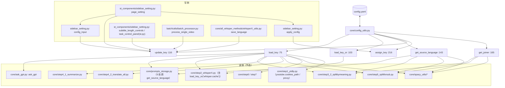

# 配置文件与参数

`config.yaml` 是 VideoLingo 的配置文件，也是**运行时开关面板**：流程走向（`transcription_only`、`asr_engine`、`resolution`）、外部凭据（API key / token）、以及大量提示词与切分参数都从这里读。读写统一经过 `core/config_utils.py` 的 4 个函数，写侧还会被 Streamlit 侧边栏直接调用。

> 📌 **`config.yaml` 已不入库**（重构后）：它被 `.gitignore` 忽略，模板是提交进仓库的 `config.example.yaml`；`load_key` 还支持 `VIDEOLINGO_*` 环境变量覆盖（优先级最高）。详见下方「安全提醒」与 §6。

## 安全提醒（先读）

| 事项 | 现状（已核实） |
| --- | --- |
| 密钥存放 | `config.yaml` 是**本地文件**，`api.key` / `deepseek_api.key` / `qwen_api.key` / `siliconflow_api.key` / `volcano_asr.access_token` / `tos.*` 等字段的真实值只存在于本机。**本文档表格中一律以 `***` 占位** |
| `.gitignore` 现状 | 已忽略 `config.yaml`（`git check-ignore -v config.yaml` 命中），`git ls-files config.yaml` 无输出 = **未被跟踪** |
| 已提交的模板 | `config.example.yaml`（密钥字段为 `YOUR_*` 占位符）。首次运行时 `_read_config` 会自动复制它生成 `config.yaml` |
| 环境变量覆盖 | `load_key("api.key")` → 先查 `VIDEOLINGO_API_KEY`，命中即返回（布尔/数字会自动还原类型）。规则：`VIDEOLINGO_` + 键路径中的非字母数字换下划线 + 全大写。值里也支持 `${VAR}` 展开 |
| 仍需人工处理 | ⚠️ **密钥已进入 git 历史**（多笔提交改过 `config.yaml`）。代码侧只能保证"以后不再跟踪"，**必须轮换密钥并用 `git filter-repo` 清理历史**，命令见 [`../05-guides/04-已知问题与技术债.md`](../05-guides/04-已知问题与技术债.md) §4.1 |
| 附带说明 | `.gitignore` 里 `*.md` 之后有 `!devdocs/` 与 `!devdocs/**/*.md` 例外，因此 `devdocs/` 会正常入库 |

---

---

> 📌 **环境变量覆盖对 UI 是只读的**：设了 `VIDEOLINGO_API_KEY` 后，侧边栏文本框会显示该值，但你在框里改并保存只会写进 `config.yaml`，**环境变量仍然优先**。`config_input` 现在会检测到这种情况并给出提示，不再静默丢弃你的输入。

---

## 一、职责与边界

本接口负责：定义全部可调参数及其默认值；提供带线程锁的读写 API（`load_key` / `load_key_or` / `update_key` / `assign_key` / `get_joiner`）；提供「实际生效的源语言」这一单一判定点（`get_source_language`）；让 Streamlit 侧边栏与批处理 GUI 能把用户输入直接落盘。

它**不**负责：参数校验（没有 schema、没有类型检查、没有取值范围检查）、密钥加密、多环境 profile、配置热重载通知（每次读取都重新打开文件，因此下一行代码就能读到新值）、配置版本迁移（`version` 只是字符串，无升级逻辑）。

## 二、文件清单

| 文件 | 规模 | 主要职责 |
| --- | --- | --- |
| `config.yaml` | — | 本地配置文件（不入库），含 Basic / Advanced / Additional 三段；Dubbing 段已随配音链路删除 |
| `config.example.yaml` | — | 提交进仓库的模板，密钥为占位符；缺失 `config.yaml` 时自动复制生成 |
| `core/config_utils.py` | — | `load_key`(:75)、`load_key_or`(:103)、`update_key`(:116)、`get_source_language`(:143)、`get_joiner`(:165)、`assign_key`(:216)、`is_placeholder`(:174)；`_read_config`（含自举）、`_to_env_name` / `_coerce_env`（环境变量覆盖）、`CONFIG_PATH`（可由 `VIDEOLINGO_CONFIG` 指定） |
| `st_components/sidebar_setting.py` | — | 写侧主力：`config_input`(:6)、`_fetch_model_list`(:26)、`_search_models`(:49)、`model_input`(:66)、`check_api`(:92)、`apply_config`(:106)、`page_setting`(:129) |
| `batch/utils/gui.py` | — | 批处理 GUI；`CONFIG_PATH = os.path.join(root_dir, 'config.yaml')`(:24)，并在 覆盖 `core.config_utils.CONFIG_PATH` |
| `batch/utils/batch_processor.py` | — | 每个视频开始/结束时临时改写 `whisper.language`、`target_language`（、） |

## 三、调用链与数据流



关键点：**读侧每天在跑，写侧只有 4 个来源**——Streamlit 侧边栏（`st_components/sidebar_setting.py`）、侧边栏的「✂️ 字幕长度调节」面板（`st_components/sidebar_setting.py::subtitle_length_controls`，写 `max_split_length` 与 `subtitle.max_length`；2026-09-20 从主区移入）、批处理的语言临时改写（`batch/utils/batch_processor.py`）、运行时的自动写回（`whisper.detected_language`，由 `core/all_whisper_methods/whisperX_utils.py` 的 `save_language` 在 写入）。

源语言的读取在合并后收敛到**一个函数**：`get_source_language`（`core/config_utils.py`）——`whisper.language` 是明确语言码时一律以它为准，只有它是 `"auto"`/空时才回退 `whisper.detected_language`；两者都不可用时抛 `ValueError`。调用点：`core/prompts_storage.py`、`core/step3_2_splitbymeaning.py`、`core/step5_splitforsub.py`、`core/spacy_utils/load_nlp_model.py`、`core/spacy_utils/split_by_mark.py`、`core/spacy_utils/split_long_by_root.py`。

## 四、关键数据结构

### 4.1 顶层结构

```yaml
version: "3.0.4" # 仅标识，无代码读取
api: {key, base_url, model} # ← ask_gpt 真正读的
deepseek_api: {key, base_url, model} # 预设，被 apply_config 复制到 api.*
qwen_api: {key, base_url, model}
siliconflow_api:{key, base_url, model}
ollama_api: {key, base_url, model}
target_language: '简体中文'
transcription_only: false
llm_sentence_split: true
asr_engine: 'whisper'
demucs: false
whisper: {model, language, detected_language, initial_prompt} # 可选键 cache（模板里没有，代码用 load_key_or 读，默认 true）
volcano_asr: {app_id, access_token, resource_id, language, enable_punc, enable_itn,
 enable_ddc, enable_speaker_info, show_utterances, enable_channel_split,
 vad_segment, model_version}
tos: {access_key, secret_key, endpoint, region, bucket_name, enabled,
 public_url_prefix, auto_cleanup}
resolution: '0x0'
ytb_resolution: '1080'
youtube: {cookies_path, proxy} # 合并新增（config.example.yaml）
subtitle: {auto_length_by_language, max_length, target_multiplier, align_on_mismatch,
 align_validate, align_allow_rewrite, boundary_window, merge_short_cues,
 short_cue_min_duration, merge_max_gap, strip_punctuation_in_source,
 merge_broken_lines} # 可选键 length_profiles（只在模板里注释示例，代码用 load_key_or 读，缺省用内置档位表）
summary_length: 8000
max_workers: 1000
max_split_length: 20
reflect_translate: true
pause_before_translate: false
min_trim_duration: 3.5
model_dir: './_model_cache'
allowed_video_formats: [...7 项]
allowed_audio_formats: [...4 项]
llm_support_json: [...10 项]
spacy_model_map: {en: ..., ru: ..., ... 共 10 项}
language_split_with_space: [...8 项]
language_split_without_space: [...2 项]
speed_factor: {max}
```

### 4.2 读侧返回的内存类型

`load_key` 用 ruamel.yaml 加载（`core/config_utils.py`），返回的是 ruamel 的 `CommentedMap` / `CommentedSeq` / `ScalarString`，它们是 `dict` / `list` / `str` 的**子类**（因此 `isinstance(x, dict)` 成立、`x == {...}` 按内容比较、可以直接喂给 `json.dump` 与 pandas）。真正的差别在于这些对象**自带**格式信息（注释、引号风格、行内位置），这些信息挂在对象的 `.ca` 属性上——用 `update_key` 改一个键后，`yaml.dump` 会据此决定注释挂在哪个键后面，所以「改动一个键」偶尔会带着相邻注释一起移动（这在 `core/config_utils.py` 的整体重写中就能观察到）。

### 4.3 落盘产物

| 产物 | 触发 | 说明 |
| --- | --- | --- |
| `config.yaml`（原地重写） | 每次 `update_key` / `assign_key` 成功（`core/config_utils.py`） | `yaml.dump(data, file)` 会**整体重写文件**：注释与引号风格被保留（`preserve_quotes = True`，），但缩进/空行/锚点等排版可能与手写版略有差异 |
| `config.backup.yaml` | 无（`.gitignore:169` 预留） | 当前仓库中**不存在**该文件 |

## 五、逐函数实现说明

| 函数 | 签名 | 语义 | 异常/回退 | 副作用 |
| --- | --- | --- | --- | --- |
| `load_key` | `load_key(key: str) -> Any` `core/config_utils.py` | 按 `.` 分隔逐级下钻读取；`'a.b.c'` 等价于 `data['a']['b']['c']`；命中 `VIDEOLINGO_<KEY>` 环境变量时优先返回 | 任一层不是 dict 或键不存在 → `raise KeyError(f"Key '{k}' not found in configuration")`。**没有默认值机制，没有类型转换**（环境变量走 `_coerce_env` 只还原 bool/int/float） | 无（只读文件） |
| `load_key_or` | `load_key_or(key: str, default: Any = None) -> Any` | `load_key` 的容错版：**键不存在时返回 `default`**，其余语义完全一致 | 只吞 `KeyError`；环境变量/解析异常照样抛 | 无（只读文件） |
| `update_key` | `update_key(key: str, new_value: Any) -> bool` | 修改**已存在**的叶子键的值 | 中间层缺失 → 返回 `False`；叶子键不存在 → `KeyError`。**不能新增键** | 原地重写 `config.yaml`。⚠️ 当 `key == "whisper.language"` 且新值不是 `"auto"` 时，会**原子同步** `whisper.detected_language`，避免残留旧语种影响提示词与 spaCy 模型 |
| `get_source_language` | `get_source_language -> str` | 解析「实际生效的源语言」，全流程唯一判定点：`whisper.language` 是明确语言码时以它为准，只有它是 `"auto"`/空时才回退 `whisper.detected_language` | 两者都不可用 → `raise ValueError` | 无 |
| `assign_key` | `assign_key(target_key: str, source_key: str) -> bool` | 把 `source_key` 的值**复制**到 `target_key`（源与目标都必须已存在） | 源键缺失 → `KeyError`；目标中间层缺失 → `False`；目标叶子键缺失 → `KeyError` | 原地重写 `config.yaml` |
| `get_joiner` | `get_joiner(language) -> str` | 语言是否用空格分词：在 `language_split_with_space` → `" "`；在 `language_split_without_space` → `""` | 两者都不在 → `raise ValueError(f"Unsupported language code: {language}")` | 无 |

**线程锁**：模块级 `config_lock = threading.Lock`，只包住「读文件 → 修改 → 写文件」的临界区（`load_key`、`update_key`、`assign_key`）。因此同一进程内不会出现半写状态。注意 `get_joiner` 会**连续两次** `load_key`（、），各自加锁一次。

**ruamel.yaml 的两个特性**：`yaml.preserve_quotes = True`让 `'简体中文'` 这类单引号在重写后仍是单引号；默认 round-trip 模式会保留注释与键顺序。但如果用别的工具（普通 PyYAML、文本编辑器批量替换）改写 `config.yaml`，这些特性就没了——**不要用别的 YAML 库写这个文件**。

**「每次 load 都重新读文件」的含义**：

| 维度 | 影响 |
| --- | --- |
| 性能 | 每次 `load_key` 都是一次磁盘 open+parse。热路径上的例子：`core/ask_gpt.py` 每次调用读 2 次；`core/prompts_storage.py` 每个提示词函数读 1-2 次；`core/step3_2_splitbymeaning.py` 在循环里每轮读 `max_split_length` 与 `max_workers`。并发 1000 线程时会高频重复解析同一个 7 KB 文件 |
| 一致性 | 好处是「改文件立即生效」，无需重启服务；坏处是**没有事务边界**——同一次业务逻辑里先读到的 `whisper.language` 和后读到的可能不同（批处理正是靠这点临时改写再恢复，见 `batch/utils/batch_processor.py`） |
| 并发 | 进程内安全；**跨进程不安全**。`st.py` 与 `batch/utils/gui.py` 同时运行时会互相覆盖：后者读-改-写整个文件的窗口内，前者的修改会丢 |
| 缓存 | 没有内存缓存，所以不用担心「改了不生效」；反过来也无法通过改文件让运行中的 `st.py` 放弃某个已读入的局部变量（如 `core/subtitle_trim.py` 的 `ESTIMATOR`、`core/step2_whisperX.py` 的 `MODEL_DIR` 是**导入时**读取的，改 config 后不重启无效） |

**写侧封装**（`st_components/sidebar_setting.py`）：

| 函数 | 位置 | 行为 |
| --- | --- | --- |
| `config_input(label, key, help=None)` | | `st.text_input` 显示当前值，值变了才 `update_key`（避免每帧都重写文件）；检测到 `VIDEOLINGO_<KEY>` 覆盖时给出警告而不是静默丢弃输入 |
| `_fetch_model_list(base_url, api_key)` | | GET `<base_url>/v1/models` 拉取模型 id 列表（缺 `/v1` 会自动补），返回排序去重后的列表 |
| `_search_models(search_term, model_list)` | | `model_input` 的搜索回调：空串/有命中时最多返回 50 条，完全无命中才把用户输入本身作为候选项 |
| `model_input` | | 模型选择控件：装了可选依赖 `streamlit-searchbox` 时用搜索框（`key="api_model_searchbox"`，选中即 `update_key("api.model", ...)`），未装则回退 `config_input("模型", "api.model")` |
| `check_api` | | 用 `ask_gpt(..., log_title=None, use_cache=False)` 做连通性自测——**刻意绕过缓存**，因此不再有「命中 `output/gpt_log/None.json` 导致假通过」的问题；调用方只调一次 |
| `apply_config(config_name)` | | 4 个预设（`"Deepseek"`/`"千问"`/`"硅基流动"`/`"Ollama"`）→ 3 次 `assign_key` 把 `xxx_api.*` 覆盖到 `api.*`，并清掉 `st.session_state.api_status` 强制重测 |
| `page_setting` | | 所有 UI 控件的落盘点，见 §六「是否出现在 UI」列 |

## 六、关键参数与配置（完整键值表）

> 默认值照抄 `config.example.yaml`（提交进仓库的模板）；密钥/令牌/真实 ID 一律写作 `***`。类型来自默认值的 YAML 字面量。
>
> ⚠️ 表里出现的 `(config.yaml:NN)` / 裸 `(:NN)` 是**本地未入库**的 `config.yaml` 行号（`.gitignore` 忽略、`git ls-files` 无输出，但本机的 `config.yaml` 确实存在且会被运行时改写），行号随每次写盘漂移、**不可核对**；默认值以提交进仓库的 `config.example.yaml` 为准，定位键请看**键路径**而不是行号。**2026-09-20 新增的一批 `subtitle.*` / `whisper.initial_prompt` 按 `config.example.yaml` 逐条核对，不再标注行号。**

### 6.1 Basic Settings

| 键路径 | 类型 | 默认值 | 作用 | 被哪些代码读取 | UI |
| --- | --- | --- | --- | --- | --- |
| `version` | str | `"3.0.4"` | 版本标识 | **无代码读取**（全仓库无 `load_key('version')`） | 否 |
| `api.key` | str | `***` (config.yaml) | LLM 凭据（OpenAI 兼容） | `core/ask_gpt.py`（唯一读点）；`batch/utils/gui.py` 仅判空 | 是（sidebar_setting.py） |
| `api.base_url` | str | `'https://api.deepseek.com'` (:7) | 接口地址，会被自动补 `/v1` | `core/ask_gpt.py` | 是（:66） |
| `api.model` | str | `'deepseek-flash'` (:8) | 模型名，同时决定 JSON mode 是否启用 | `core/ask_gpt.py` | 是（:70） |
| `deepseek_api.key` | str | `***` (:11) | Deepseek 预设 | 仅 `st_components/sidebar_setting.py`（`assign_key` 源） | 间接（"一键切换配置"→Deepseek，:24-27、:47） |
| `deepseek_api.base_url` | str | `'https://api.deepseek.com'` (:12) | 同上 | | 间接 |
| `deepseek_api.model` | str | `'deepseek-flash'` (:13) | 同上 | | 间接 |
| `qwen_api.key` | str | `***` (:16) | 千问/百炼预设 | | 间接（"千问"） |
| `qwen_api.base_url` | str | `'https://dashscope.aliyuncs.com/compatible-mode/v1'` (:17) | 同上（已含 `/v1`，不会被重复拼接） | | 间接 |
| `qwen_api.model` | str | `'qwen-plus'` (:18) | 同上（在 `llm_support_json` 白名单内） | | 间接 |
| `siliconflow_api.key` | str | `***` (:21) | 硅基流动预设 | | 间接（"硅基流动"） |
| `siliconflow_api.base_url` | str | `'https://api.siliconflow.cn'` (:22) | 同上 | | 间接 |
| `siliconflow_api.model` | str | `'Qwen/Qwen2.5-72B-Instruct'` (:23) | 同上（**不在 `llm_support_json` 白名单内**） | | 间接 |
| `ollama_api.key` | str | `'null'` (:26) | 本地 Ollama 预设；字符串 `'null'` 为真值，能通过 `ask_gpt` 的非空校验 | | 间接（"Ollama"） |
| `ollama_api.base_url` | str | `'http://localhost:11434'` (:27) | 会补成 `http://localhost:11434/v1` | | 间接 |
| `ollama_api.model` | str | `'qwen3:30b-a3b'` (:28) | 在 `llm_support_json` 白名单内 | | 间接 |
| `target_language` | str | `'简体中文'` (:31) | 目标语言，**直接写进提示词**（自然语言即可） | `core/prompts_storage.py`| 是（sidebar_setting.py「目标语言」） |
| `transcription_only` | bool | `false` (:31) | 只转写不翻译 | `st.py`（`build_task_steps` 据此决定是否插入「术语提取」步骤）；`core/step4_2_translate_all.py` | 是（sidebar_setting.py） |
| `asr_engine` | str | `'whisper'` (:37) | ASR 引擎：`'whisper'` / `'volcano'` | `core/step2_whisperX.py`；sidebar_setting.py | 是（sidebar_setting.py「ASR 引擎」） |
| `demucs` | bool | `false` (:40) | 转写前用人声分离 | `core/step2_whisperX.py` | 是（sidebar_setting.py） |
| `whisper.model` | str | `'large-v3'` (:44) | Whisper 模型；**注意识别语言为 `zh` 时该键被忽略**，强制用 `Huan69/Belle-whisper-large-v3-zh-punct-fasterwhisper` | `core/step2_whisperX.py` 的 `load_whisper_model_name`、`:110 resolve_whisper_model`，调用点 | 否 |
| `whisper.language` | str | `'zh'` (:46) | 识别语言；`'auto'` 表示自动检测 | 统一经 `core/config_utils.py` 的 `get_source_language` 读取：`core/prompts_storage.py`、`core/spacy_utils/load_nlp_model.py`、`core/spacy_utils/split_by_mark.py`、`core/spacy_utils/split_long_by_root.py`、`core/step3_2_splitbymeaning.py`、`core/step5_splitforsub.py`；另有 `core/step2_whisperX.py`；`batch/utils/batch_processor.py` | 是（sidebar_setting.py「识别语言」，含 `🌐 自动检测` → `auto`） |
| `whisper.detected_language` | str | `'zh'` (:47) | 实际识别到的语言；**运行时被写回**，且只在 `whisper.language` 为 `auto`/空时才作为回退 | 读：`core/config_utils.py`；写：`core/all_whisper_methods/whisperX_utils.py` 的 `save_language`（调用点 `core/step2_whisperX.py`（whisper 分支）、（火山分支）、（缓存命中））；`core/config_utils.py` 会在侧边栏改语言时同步它 | 否 |
| `whisper.cache` | bool | 缺省视为 `true` | 是否启用内容寻址的转录缓存（`.cache/asr/<key>/<part>.json`）；**合并新增的可选键**，模板 `config.example.yaml` 里没有它，旧 `config.yaml` 也无需补 | `core/step2_whisperX.py`（`load_key_or("whisper.cache", True)`） | 否 |
| `whisper.initial_prompt` | str | `''` | **2026-09-20 新增**。喂给 Whisper 的 `initial_prompt`（影响标点风格），实参是 `load_key_or("whisper.initial_prompt", "") or default_initial_prompt(whisper.language)`：① 留空 → 用按语种的内置**中性**示例（`core/step2_whisperX.py::default_initial_prompt`，覆盖 ja/zh/en/ko/es/fr/de/it/pt/ru；其他语种返回空串=真正的空 prompt）；② 任意非空字符串 → **原样**传给 Whisper（模板注释建议填 `'none'`，那只是把字面量 `none` 当提示词用；对上述 10 个语种**没法用配置把提示词关成空**，只能改 `_INITIAL_PROMPTS`）。⚠️ 只影响**新跑**的识别：`cleaned_chunks.xlsx` 存在或转录缓存命中时不经过这里 | `core/step2_whisperX.py::transcribe_audio_with_whisper`（`asr_options["initial_prompt"]`） | 否 |
| `volcano_asr.app_id` | str | `***` (:52) | 火山 ASR App ID | `core/all_whisper_methods/volcano_asr.py`；`core/step2_whisperX.py` | 是（:190） |
| `volcano_asr.access_token` | str | `***` (:54) | 火山 ASR Access Token | `volcano_asr.py`；`step2_whisperX.py` | 是（:191） |
| `volcano_asr.resource_id` | str | `'volc.bigasr.auc'` (:56) | 资源 ID | `volcano_asr.py` | 是（:194） |
| `volcano_asr.language` | str | `'zh-CN'` (:59) | 识别语言（空=自动） | `volcano_asr.py` | 是（:211） |
| `volcano_asr.enable_punc` | bool | `false` (:61) | 自动标点 | `volcano_asr.py` | 是（:231） |
| `volcano_asr.enable_itn` | bool | `true` (:63) | 数字规整 | `volcano_asr.py` | 是（:235） |
| `volcano_asr.enable_ddc` | bool | `true` (:65) | 语义顺滑 | `volcano_asr.py` | 是（:239） |
| `volcano_asr.enable_speaker_info` | bool | `false` (:67) | 说话人分离 | `volcano_asr.py` | 是（:248） |
| `volcano_asr.show_utterances` | bool | `true` (:69) | 返回分句时间戳 | `volcano_asr.py` | 是（:244） |
| `volcano_asr.enable_channel_split` | bool | `false` (:71) | 双声道识别 | `volcano_asr.py` | 是（:252） |
| `volcano_asr.vad_segment` | bool | `false` (:73) | VAD 分句 | `volcano_asr.py` | 是（:259） |
| `volcano_asr.model_version` | str | `'400'` (:75) | 模型版本 `'310'`/`'400'` | `volcano_asr.py-234,628` | 是（:220） |
| `tos.access_key` | str | `''` (:80) | TOS Access Key（可走环境变量） | `core/all_whisper_methods/tos_service.py` | 是（:283，需先开 `tos.enabled`） |
| `tos.secret_key` | str | `''` (:82) | TOS Secret Key（可走环境变量） | `tos_service.py` | 是（:284） |
| `tos.endpoint` | str | `'tos-cn-shanghai.volces.com'` (:84) | TOS Endpoint | `tos_service.py` | 是（:288） |
| `tos.region` | str | `'cn-shanghai'` (:86) | TOS Region | `tos_service.py` | 是（:289） |
| `tos.bucket_name` | str | `'lingo'` (:88) | Bucket 名 | `tos_service.py` | 是（:287） |
| `tos.enabled` | bool | `true` (:90) | 是否上传 TOS | `tos_service.py` | 是（:277） |
| `tos.public_url_prefix` | str | `''` (:92) | 公网 URL 前缀（空=自动） | `tos_service.py` | 否 |
| `tos.auto_cleanup` | bool | `true` (:94) | ASR 后自动删远端文件 | `tos_service.py` | 是（:294） |
| `resolution` | str | `'0x0'` (:97) | 压制分辨率；`'0x0'` 表示**不压制** | `st.py`；`core/step7_merge_sub_to_vid.py`；`batch/utils/video_processor.py` | 是（「烧录字幕（压进成片）」开关 + 分辨率下拉） |

### 6.2 Advanced Settings

| 键路径 | 类型 | 默认值 | 作用 | 被哪些代码读取 | UI |
| --- | --- | --- | --- | --- | --- |
| `ytb_resolution` | str | `'1080'` (:95) | YouTube 下载分辨率（`360`/`1080`/`best`） | `st_components/download_video_section.py` | 否（`# *`） |
| `youtube.cookies_path` | str | `''`（config.example.yaml） | 需要登录/年龄限制/会员视频时指向 Netscape 格式 `cookies.txt` 的路径；**合并新增** | `core/step1_ytdlp.py`（文件存在才传给 yt-dlp 的 `cookiefile`） | 否 |
| `youtube.proxy` | str/null | `null`（config.example.yaml） | 代理语义三态：缺省/`null`=交给 yt-dlp 自动发现；空串=显式禁用；URL=强制使用。**合并新增** | `core/step1_ytdlp.py`（非字符串会抛 `ValueError`） | 否 |
| `subtitle.auto_length_by_language` | bool | `true`（config.example.yaml） | **2026-09-20 新增**。按语言自动设置字幕长度：开=切「识别语言」/改「目标语言」即按档位覆盖下面两个值，且 step3_2/step5 **运行期按当前语言现算**（config 里的值只是落盘副本，手改无效）；关=按手填值走。档位表 `core/subtitle_limits.LENGTH_PROFILES`（`(单行上限, 粗切词数)`）：zh/ja `60/30`、ko `48/28`、拉丁 en/es/pt/it/fr/de/vi/id/ms/tl `70/26`、ru/ar/fa/ur/he `65/26`、th `65/20`；语言识别不出用兜底 `70/26`（`fallback=True` 会在 UI 提示）。另留 `GRACE = 1.15` 宽容量：只超一点点不切 | `core/config_utils.auto_length_by_language`；`core/subtitle_limits.resolve_limits` / `apply_language_profile` | 是（侧边栏「✂️ 字幕长度调节」的开关） |
| `subtitle.max_length` | int | 自动模式写入（中日 60 / 韩 48 / 拉丁 70 / 俄与 RTL 65；单行**显示宽度**） | 字幕单行长度上限。自动模式：源/译两侧各按自己语言的档位；手动模式：源文按**字符数**、译文按加权长度（宽度 × `target_multiplier`） | `core/step5_splitforsub.py`（`row_overflows`）；`core/subtitle_limits.py`；写回：`st_components/sidebar_setting.py::subtitle_length_controls` / `sync_subtitle_lengths` | 是（侧边栏「✂️ 字幕长度调节」；自动模式下控件置灰） |
| `subtitle.target_multiplier` | float | `1.2` | **仅手动模式使用**的译文长度折算系数 | `core/subtitle_limits.resolve_limits`（自动模式不再乘它） | 否（`# *`） |
| `subtitle.length_profiles` | dict | 缺省（用内置档位表） | 可选覆盖：`{zh: {max_length: 30, max_split_length: 20}}`，只认这两个字段；模板里只有注释示例，键本身不存在也能跑 | `core/subtitle_limits.profile_for` | 否 |
| `subtitle.align_on_mismatch` | str | `warn` | 字幕对齐兜底策略：`warn`=模糊兜底并告警；`strict`=精确匹配失败即报错 | `core/step6_generate_final_timeline.py`（`warn` 时的提示在 `get_sentence_timestamps`） | 否 |
| `subtitle.align_validate` | bool | `true` | **2026-09-20 新增**。校验 LLM 的对齐结果：段数必须等于源文段数、每段非空、不许留孤立碎片（`_MIN_PART_WIDTH = 6.0` 显示宽度）、段首不许是**悬空助词**（を/の/的，两档都拦）。校验不过会让 `ask_gpt` **带失败原因**重试（3 次），仍不过则 step5 退回机械等分 | `core/step5_splitforsub.py::_align_validation_enabled`；护栏在 `core/subtitle_split.check_align_parts` | 否 |
| `subtitle.align_allow_rewrite` | bool | `true` | **2026-09-20 新增（B 方案）**。对齐严格度档位，**同时**决定提示词第 3 条与校验强度（判定点 `core/config_utils.align_allow_rewrite`，缺键/读失败都视为开；`step5._align_rewrite_allowed` 只是转发）：开=提示词用轻改写版 `_ALIGN_RULE3_LIGHT`（只许移动边界、移动一个虚词、删掉会孤零零留在切点上的连接词、最多补一个虚词，**不许把裸从句补成完整句**），校验拦五类结果（段数 <2/空段/孤立碎片、**段首悬空助词** を/の/的（`dangling_start`）、长度比超出 `(0.8, 1.3)`、重复、覆盖率 < 85%）；关=提示词换 `_ALIGN_RULE3_STRICT`（一个字都不许动），校验要求拼接**逐字等于**整句译文。两档都允许**移动边界**，也都拦段首悬空助词 | `core/step5_splitforsub.py::_align_rewrite_allowed` → `core/config_utils.align_allow_rewrite`；再分发给 `core/prompts_storage.get_align_prompt`（第 3 条两版）与 `core/subtitle_split.check_align_parts(allow_rewrite=…)` | 否 |
| `subtitle.boundary_window` | float | `0.15` | **2026-09-20 新增**。纯本地切分时切点允许偏离"理想宽度位置"的比例：窗口内优先挑句法边界（标点 → 日语接续/助词 → 拉丁连接词）。读取时夹在 `0..0.4`，默认值与 `subtitle_limits.GRACE`（宽容量）一致 | `core/step5_splitforsub.py::_boundary_window` → `core/subtitle_split.split_at_boundaries` | 否 |
| `subtitle.merge_short_cues` | bool | `true` | **2026-09-20 新增**。把**停留过短**的字幕并入相邻字幕（开关关闭时 `merge_short_cues_in_place` 原样返回） | `core/step5_splitforsub.py::merge_short_cues_in_place` → `core/subtitle_split.merge_short_cues` | 否 |
| `subtitle.short_cue_min_duration` | float | `0.8` | **2026-09-20 新增**。短于它（秒）的字幕才算"极短"（Netflix 最短 5/6 s ≈ 0.83 s） | 同上 | 否 |
| `subtitle.merge_max_gap` | float | `0.35` | **2026-09-20 新增**。与邻居的时间间隔超过它（秒）就不合并 | 同上 | 否 |
| `subtitle.strip_punctuation_in_source` | bool | `false` | **2026-09-20 新增**。原文行是否也去标点（默认 `false`=保留；译文侧的 `，。` 与原文/译文**行尾**句末标点恒定处理，见 `core/step6_generate_final_timeline.py::align_timestamp`、`core/subtitle_split.strip_terminal_punctuation`） | `core/step6_generate_final_timeline.py`（`load_key_or`，缺键也能跑） | 否 |
| `subtitle.merge_broken_lines` | bool | `true` | **2026-09-20 新增**。step3_1 / step3_2 的**出口守卫**：切点落在词中间（`…フィギュアとし \| て…`）时把两行并回去 | `core/step3_1_spacy_split.py::merge_broken_cuts_in_file`、`core/step3_2_splitbymeaning.py::split_sentences_by_meaning` → `core/subtitle_split.merge_broken_cuts` | 否 |
| `summary_length` | int | `8000` (:114) | 送进总结提示词的字符数上限 | `core/step4_1_summarize.py` | 否（`# *`） |
| `max_workers` | int | `1000` (:115) | LLM 线程池大小（TTS 已删除，现仅用于 LLM 并发） | `core/step3_2_splitbymeaning.py`；`core/step4_2_translate_all.py`；`core/step5_splitforsub.py` | 否（`# *`） |
| `max_split_length` | int | 自动模式写入（中日 30 / 韩 28 / 拉丁 26 / 泰 20，单位=spaCy token≈词） | 首次粗切的最大词数（也是提示词里的 `word_limit`）。⚠️ 仅转录模式关掉 LLM 断句时**不参与** | `core/step3_2_splitbymeaning.py`（`split_sentences_by_meaning`）；`core/subtitle_limits.py`；写回：`st_components/sidebar_setting.py::subtitle_length_controls` / `sync_subtitle_lengths` | 是（侧边栏「✂️ 字幕长度调节」；自动模式下置灰） |
| `reflect_translate` | bool | `true` (:117) | 是否执行「反思+意译」第二步 | `core/translate_once.py` | 否（`# *`） |
| `pause_before_translate` | bool | `false` (:118) | 术语提取后暂停，等人工确认术语表 | `st.py`（`step_summarize` 内，调 `TaskRunner.request_review_pause`） | 否（`# *`） |

### 6.3（原 Dubbing Settings，仅保留仍在使用的项）

| 键 | 类型 | 默认 | 作用 | 读取点 | UI |
| --- | --- | --- | --- | --- | --- |
| `speed_factor.max` | float | `1.4` | 最快语速倍率。`core/subtitle_trim.check_len_then_trim` 用它折算预估朗读时长——只有在最快语速下仍超时才真正压缩文本 | `core/subtitle_trim.py` | 否（`# *`） |

> 📌 `speed_factor.min` / `speed_factor.accept`、`tts_method`、各 TTS 引擎段、`dub_volume`、`min_subtitle_duration`、`tolerance` 都只服务于已删除的配音链路，已从 `config.yaml` 移除。


### 6.4 Additional settings（文件内注明「请勿修改」）

| 键路径 | 类型 | 默认值 | 作用 | 被哪些代码读取 | UI |
| --- | --- | --- | --- | --- | --- |
| `model_dir` | str | `'./_model_cache'` (:182) | Whisper/对齐模型缓存目录 | `core/step2_whisperX.py` | 否 |
| `allowed_video_formats` | list[str] | 7 项 (:185-192) | 允许上传/识别的视频扩展名 | `core/step1_ytdlp.py`；`st_components/download_video_section.py` | 间接（作为 `file_uploader` 的 `type`） |
| `allowed_audio_formats` | list[str] | 4 项 (:194-198) | 允许上传的音频扩展名 | `download_video_section.py` | 间接（同上） |
| `llm_support_json` | list[str] | 9 项 (:201-210) | 支持 `response_format: json_object` 的模型白名单（含价格注释） | `core/ask_gpt.py` | 否 |
| `spacy_model_map` | dict | 10 项 (:216-226) | 语言→spaCy 模型名 | `core/spacy_utils/load_nlp_model.py` | 否 |
| `language_split_with_space` | list[str] | 8 项 `en/es/fr/de/it/ru/ko/pt` (:229-237) | 用空格分词的语言 | `core/config_utils.py` | 否 |
| `language_split_without_space` | list[str] | 2 项 `zh/ja` (:240-242) | 不用空格分词的语言 | `core/config_utils.py` | 否 |

## 七、技术要点与坑

### 7.1 「高级设置不显示在 UI」的机制

约定写在 `config.yaml`：`# * Settings marked with * are advanced settings that won't appear in the Streamlit page and can only be modified manually in config.py`。

三点必须说清：

1. **这只是注释约定，没有任何代码解析它**。`core/config_utils.py` 不读注释，`sidebar_setting.py` 也不按 `# *` 过滤——「不显示」纯粹是因为 UI 里没有写那个控件。
2. 注释里的 `config.py` 是**过期说法**，仓库里不存在 `config.py`，应理解为 `config.yaml`。
3. 因此「哪些参数只能手改」的权威答案是**代码里有没有对应的 widget**，而不是注释。实测清单如下。

**带 `# *` 标记的参数（UI 中确实没有控件）**：

> ⚠️ 行号不再标注（`config.yaml` 每次写盘都会整体重写、行号漂移）。**本机 `config.yaml` 里实际带 `# *` 的只有四处**：`subtitle.max_length`、`subtitle.target_multiplier`、`subtitle.align_on_mismatch`、`summary_length`；`config.example.yaml` 只保留了 `summary_length` 一处。下表把"历史上标过 `# *`、且现在确实没有 UI 控件"的键一并列出，最后一列写明本机是否真的有标记。

| 键路径 | 本机 `config.yaml` 有 `# *` |
| --- | --- |
| `ytb_resolution` | 否 |
| `subtitle.max_length` | 是 |
| `subtitle.target_multiplier` | 是 |
| `subtitle.align_on_mismatch` | 是（`align_validate` 等新键没有标记，见下表） |
| `summary_length` | 是 |
| `max_workers` | 否 |
| `max_split_length` | 否 |
| `reflect_translate` | 否 |
| `pause_before_translate` | 否 |
| `speed_factor.max` | 否（`.min` / `.accept` 已随配音链路删除） |

**没有 `# *` 但同样没有 UI 控件的参数**（容易误判，务必一起记）：

| 键路径 | 为什么没 UI |
| --- | --- |
| `version` | 仅标识，无代码读取 |
| `whisper.model` | 只有语言有下拉，模型名要手改（config.yaml） |
| `whisper.detected_language` | 运行时由 `whisperX_utils.py` 写回，不应手改 |
| `whisper.initial_prompt` | **2026-09-20 新增**，只能手改 `config.yaml`（留空=按语言用内置中性示例） |
| `subtitle.align_validate` / `subtitle.align_allow_rewrite` / `subtitle.boundary_window` / `subtitle.merge_short_cues` / `subtitle.short_cue_min_duration` / `subtitle.merge_max_gap` / `subtitle.strip_punctuation_in_source` / `subtitle.merge_broken_lines` / `subtitle.length_profiles` | **2026-09-20 新增的一批字幕链路开关**，模板里都没有 `# *` 标记（`length_profiles` 只有注释示例），UI 里也确实没有控件；要调就手改 `config.yaml` |
| `tos.public_url_prefix` | 空=自动生成 |
| `deepseek_api.*` / `qwen_api.*` / `siliconflow_api.*` / `ollama_api.*` | 只作为「一键切换配置」的源值，本身没有输入框（改它们=改预设） |
| `model_dir`、`allowed_*_formats`、`llm_support_json`、`spacy_model_map`、`language_split_*` | 归在注释为「请勿修改」的 Additional 段（config.yaml） |

### 7.2 危险操作清单

| 操作 | 后果 | 依据 |
| --- | --- | --- |
| 把 `transcription_only` 改成 `true`（**模板默认值是 `false`**，见 `config.example.yaml`） | 完全跳过翻译：`core/step4_2_translate_all.py` 直接把源文复制成译文写进 `translation_results.xlsx`；UI 文案与按钮也会变成「开始生成字幕」（`st.py`），`build_task_steps` 不再插入「术语提取」步骤（`st.py`）；字幕链路后续步骤照常跑，成片只有原语言 | `core/step4_2_translate_all.py`、`st.py` |
| 把 `pause_before_translate` 改成 `true` | 会在术语提取后**暂停**，由页面上的「✅ 术语已确认，继续」按钮继续。（早期实现用 `input`，在 Streamlit 下会阻塞页面；现已改为 `TaskRunner.request_review_pause` + 控制面板两段式） | `st.py`、`st.py`、`st_components/task_runner.py` |
| `resolution: '0x0'` | 等价于侧边栏 **烧录字幕（压进成片）关闭**：`step7` 静默跳过压制——真实视频**不产出成片**（并删掉遗留的 `output_sub.mp4`）；纯音频输入（`input_manifest.json` 记为 `audio`）本来就只交字幕文件；旧产物 `black_screen.mp4` 走兼容分支被原样保留为成片。要出成片就设为 `'1920x1080'` 或 `'640x360'`（那个开关就是在 `'0x0'` 与分辨率之间切换） | `core/step7_merge_sub_to_vid.py`、`st_components/sidebar_setting.py` |
| 手改 `api.model` 为白名单外模型 | `response_format` 静默失效，JSON 合规性只靠 `json_repair` 兜底。换模型现在**会**使缓存失效（缓存键含 model + prompt） | `core/ask_gpt.py` |
| 清空 `config.yaml` 里不存在的键 | `load_key` 直接 `KeyError`，没有默认值兜底；`update_key` 不能新增键（叶子键缺失即 `KeyError`，`core/config_utils.py`）。需要容错读取时用 `load_key_or(key, default)`（`core/config_utils.py`） | `core/config_utils.py` |
| 把 `whisper.language` 设为 `zh/ja` 之外又不在空格列表里的语言码 | `get_joiner` 抛 `ValueError`（`core/config_utils.py`），切句与对齐全挂 | `core/config_utils.py` |
| 把 `whisper.language` 与 `whisper.detected_language` 手动改成互相矛盾的值 | 提示词与 spaCy 模型以 `whisper.language` 为准（`get_source_language`），`detected_language` 只在 `auto` 时生效；侧边栏改语言会自动同步两者，手改文件则不会 | `core/config_utils.py` |
| 在 `st.py` 运行中手改 `summary_length` / `max_workers` 等 | 会立即生效（每次 `load_key` 重读文件），但**模块级已缓存的变量不会变**，例如 `core/subtitle_trim.py` 的 `ESTIMATOR`、`core/step2_whisperX.py` 的 `MODEL_DIR` 是 import 时读的 | `core/subtitle_trim.py`、`core/step2_whisperX.py` |

### 7.3 `api` 与 `deepseek_api` 的重复字段关系（哪个生效？）

结论：**`ask_gpt` 只读 `api`**，`deepseek_api` / `qwen_api` / `siliconflow_api` / `ollama_api` 只是「预设值仓库」。

| 事实 | 证据 |
| --- | --- |
| 唯一读取点 | `core/ask_gpt.py`：`api_set = load_key("api")`，随后 全部用 `api_set[...]`。全仓库**没有**任何地方 `load_key("deepseek_api")` |
| 预设如何生效 | `st_components/sidebar_setting.py`：`assign_key("api.key", "deepseek_api.key")` 等 3 次调用把值**复制**到 `api.*`，并顺手重写 `config.yaml` |
| 结果 | 点一次「应用配置」后，`api.*` 与对应预设组的值一致；此后你手改 `api.*`，两边就会不一致，而**生效的永远是 `api.*`** |
| 陷阱 | 改 `deepseek_api.model` 却忘了点「应用配置」，会发现「改了没用」；反之改了 `api.*`，下次点「应用配置」会被预设覆盖回去 |
| 另一处不对称 | `ask_gpt` 的 key 判空只检查 `api.key`（`core/ask_gpt.py`）；`batch/utils/gui.py` 也只检查 `api.key` |

### 7.4 写侧的两个副作用

- **每次控件变化就重写整个文件**。`config_input`（`sidebar_setting.py`）的逻辑是 `val = st.text_input(label, value=load_key(key))`，仅当 `val != load_key(key)` 时才 `update_key`；由于写入后两者立即相等，正常输入下每个字符变化只触发一次全文件重写。但 Streamlit 每次 rerun 都会重新 `load_key`（重新读盘），所以连续输入时文件会被反复重写。
- **UI 写入会打破「配置即代码」的假设**。运行 UI 后 `config.yaml` 的 diff 会混入 `resolution`、`whisper.language`、`transcription_only` 等无关改动，review 时容易误判。

### 7.5 `version` 与配置迁移

`config.yaml` 的 `version: "3.0.4"` 没有任何代码读取，也没有「旧配置升级」逻辑。因此从上游拉取新代码后，若 `config.yaml` 缺失新键，第一个用到它的 `load_key` 就会 `KeyError`。**新增配置项必须同时修改代码根目录的 `config.yaml`，并且需要手工同步到用户已有的配置文件**（或用外部脚本 merge）。

合并新增的 `load_key_or(key, default)`（`core/config_utils.py`）给了另一条出路：只在**确实可以缺省**的键上用它（例如 `whisper.cache` 在 `core/step2_whisperX.py` 的读法），就能让旧 `config.yaml` 继续工作而不必强制用户补键。注意它只吞 `KeyError`，不能用来掩盖拼错的键名之外的问题。

## 八、扩展点

### 8.1 新增一个配置项的完整步骤

以「新增 `llm_max_workers`，只控制 LLM 并发」为例：

1. **写默认值进 `config.yaml`**：在 Advanced 段（config.yaml 附近）追加，并在需要手改的参数上按约定加 `# *` 前缀注释：
 ```yaml
 # *Number of LLM worker threads (does not affect TTS)
 llm_max_workers: 16
 ```
 注意：YAML 缩进用空格；字符串即使看起来像数字也建议加引号（`preserve_quotes` 会保留风格）；放在 `## ==== Advanced Settings ====`（:99）与下一段之间以维持分组。
2. **代码里 `load_key`**：在调用点 `from core.config_utils import load_key`，然后
 ```python
 max_workers = load_key("llm_max_workers")
 ```
 把原来 3 处 `load_key("max_workers")`（`core/step3_2_splitbymeaning.py`、`core/step4_2_translate_all.py`、`core/step5_splitforsub.py`）换成新键；TTS 用途已随配音链路删除，无需保留。
3. **（可选）加到 sidebar**：在 `st_components/sidebar_setting.py: page_setting` 里挑一个 expander 加控件，照抄现有模式：
 ```python
 val = st.number_input("LLM Workers", value=load_key("llm_max_workers"), min_value=1)
 if val != load_key("llm_max_workers"):
 update_key("llm_max_workers", val)
 ```
 或用现成的 `config_input("LLM Workers", "llm_max_workers")`（文本输入，会写成字符串，需要 `int` 转换——这是 `config_input` 的已知局限）。
4. **UI 展示的注意事项**：
 - `update_key` **不能新增键**（`core/config_utils.py` 会 `KeyError`），所以顺序必须是「先改 `config.yaml` 的默认值，再让 UI 去改它」。
 - 类型要小心：`st.text_input` 返回 str，`st.number_input` 返回 int/float，`st.toggle` 返回 bool。用 `config_input` 写数字键会把 `1000` 变成 `'1000'`，而 `ThreadPoolExecutor(max_workers='1000')` 会报错——数字参数请用 `st.number_input` 或读出来时 `int`。
 - 控件默认值来自 `load_key`，因此每次 rerun 都会重读文件；不要在该控件里做昂贵读取。
 - 若新键会改变**提示词文本**（如 `target_language` 那类），务必在键的注释里写明「修改后 `output/gpt_log/` 旧缓存与新结果不一致，需清缓存」。

### 8.2 其他改造点（建议）

- > 💡 建议：给 `config.yaml` 加一份 `config.schema.json`，或把 `load_key(key, default=None)` 的默认值机制补齐（`load_key_or` 已覆盖「键可能不存在」的场景，但仍是显式选择而非 schema 约束）。
- > 💡 建议：为读侧加一层进程内缓存 + 基于 mtime 的失效，减少 1000 线程下的重复文件解析；跨进程一致性另用文件锁解决。
- > 💡 建议：把写侧统一收敛到 `config_utils`（目前 `batch/utils/gui.py` 直接改模块级 `CONFIG_PATH`，属于绕过封装的隐式全局改写）。

## 九、验证方式

```powershell
# 0) 必须在项目根目录（CONFIG_PATH = 'config.yaml' 是相对路径，core/config_utils.py）
cd E:\VideoLingo\VideoLingoMove

# 1) 读任意键（不存在会抛 KeyError）
python -c "from core.config_utils import load_key; print(load_key('resolution')); print(load_key('subtitle.max_length'))"
python -c "from core.config_utils import load_key; print(load_key('no_such_key'))" # 预期 KeyError

# 1b) load_key_or 的容错（键不存在返回默认值，不抛异常）
python -c "from core.config_utils import load_key_or; print(load_key_or('whisper.cache', True), load_key_or('no.such.key', 'FALLBACK'))"

# 1c) 源语言的单一判定点（whisper.language 明确时以它为准，auto 才回退 detected_language）
python -c "from core.config_utils import load_key, get_source_language; print(load_key('whisper.language'), '->', get_source_language)"

# 1d) 字幕长度档位：显式传语言可离线验证"自动档位/手动模式"两条路径（参数为 None 时才读 config）
python -c "from core.subtitle_limits import resolve_limits; print(resolve_limits(source_language='ja', target_language='简体中文').label)"
python -c "from core.subtitle_limits import resolve_limits; print(resolve_limits(source_language='ja', target_language='简体中文', auto=False, manual={'max_length': 75, 'max_split_length': 20, 'target_multiplier': 1.2}).label)"

# 2) 确认「生效的是 api 而不是 deepseek_api」（两边刻意改不同，看读出来是哪个）
python -c "from core.config_utils import load_key; a=load_key('api'); d=load_key('deepseek_api'); print('api.model =', a['model'], '| deepseek_api.model =', d['model'])"

# 3) get_joiner 的分支与兜底
python -c "from core.config_utils import get_joiner; print(repr(get_joiner('zh')), repr(get_joiner('en')))"
python -c "from core.config_utils import get_joiner; get_joiner('xx')" # 预期 ValueError

# 4) update_key 的写回（先备份，避免污染工作配置）
Copy-Item config.yaml config.local-backup.yaml
python -c "from core.config_utils import update_key; print(update_key('max_workers', 8))"
Select-String -Path config.yaml -Pattern '^max_workers'
Move-Item -Force config.local-backup.yaml config.yaml

# 4b) update_key 对 whisper.language 的同步副作用（同样建议先备份）
python -c "from core.config_utils import update_key, load_key; update_key('whisper.language','ja'); print(load_key('whisper.detected_language'))" # 预期 ja

# 5) 确认注释与引号被保留（ruamel 特性）
python -c "print(open('config.yaml',encoding='utf-8').read[:200])"

# 6) 确认 config.yaml 是否被 git 跟踪（安全自查）
git ls-files config.yaml # 无输出 = 未被跟踪（期望）
git check-ignore -v config.yaml # 有输出 = 已被忽略（期望）

# 7) 统计 UI 实际覆盖了多少键（写侧来源）
Select-String -Path st_components\sidebar_setting.py -Pattern 'update_key\(' | Measure-Object
```

⚠️ 上面的命令都会真的读写工作目录的 `config.yaml`；本机没有可用的项目 Python 环境（`videolingo` conda 环境不存在、base 环境缺 `json_repair`），因此**本次未实际执行**，只作复现步骤。

| 想验证的行为 | 最小复现方式 |
| --- | --- |
| 「每次 load 都重读文件」 | 开两个终端：A 循环打印 `load_key('max_workers')`；B 执行 `update_key('max_workers', 8)`——A 下一轮即变 |
| `update_key` 不能新增键 | `python -c "from core.config_utils import update_key; update_key('brand_new_key', 1)"` → `KeyError` |
| `update_key` 中间层缺失返回 `False` | `python -c "from core.config_utils import update_key; print(update_key('no.such.key', 1))"` → `False` |
| `load_key_or` 只吞 `KeyError` | `python -c "from core.config_utils import load_key_or; print(load_key_or('no.such.key'))"` → `None`（不抛异常） |
| `get_source_language` 的分支 | 把 `config.yaml` 的 `whisper.language` 改成 `auto` 后跑 `python -c "from core.config_utils import get_source_language; print(get_source_language)"` → 返回 `whisper.detected_language`；两者都不可用时抛 `ValueError`（`tests/test_source_language.py` 覆盖了这三种情形） |
| `assign_key` 的「一键切换」 | `python -c "from core.config_utils import assign_key; assign_key('api.model','qwen_api.model'); from core.config_utils import load_key; print(load_key('api.model'))"` |
| 新键缺失时的容错 | `subtitle.strip_punctuation_in_source` / `whisper.initial_prompt` / `subtitle.merge_broken_lines`（step3_1）/ `whisper.cache` 都用 `load_key_or` 读，旧 `config.yaml` 缺这些键仍能跑；反例是 `subtitle.align_validate` / `align_allow_rewrite` / `boundary_window` / `merge_short_cues` 等用 `load_key` 读（step5 侧包了 `except Exception` 兜默认值）——**手改 `config.yaml` 删键前先确认读法** |
| `# *` 只是注释 | `python -c "print([l for l in open('config.yaml',encoding='utf-8') if l.lstrip.startswith('# *')])"`，再对照 `sidebar_setting.py` 确认无过滤逻辑 |

## 十、相关文档

- [`../03-subsystems/01-LLM调用与提示词.md`](../03-subsystems/01-LLM调用与提示词.md) — `api` / `llm_support_json` / `target_language` / `max_workers` 在 LLM 层的实际用法与缓存机制
- [`../00-overview/01-项目总览与架构.md`](../00-overview/01-项目总览与架构.md) — 配置文件在整个架构中的位置
- [`../00-overview/03-快速上手与调试.md`](../00-overview/03-快速上手与调试.md) — 首次配置与最小可跑配置
- [`02-Streamlit界面组件.md`](02-Streamlit界面组件.md) — 侧边栏控件的完整实现（写侧的上下文）
- [`03-批处理任务系统.md`](03-批处理任务系统.md) — 批处理如何临时改写 `whisper.language` / `target_language`
- [`../05-guides/04-已知问题与技术债.md`](../05-guides/04-已知问题与技术债.md) — 明文密钥、`update_key` 不能新增键等已知债
