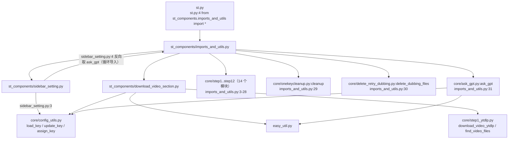
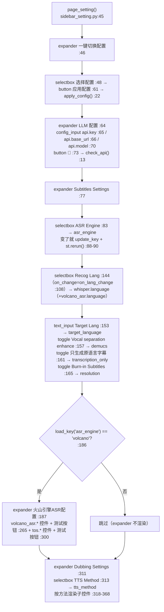
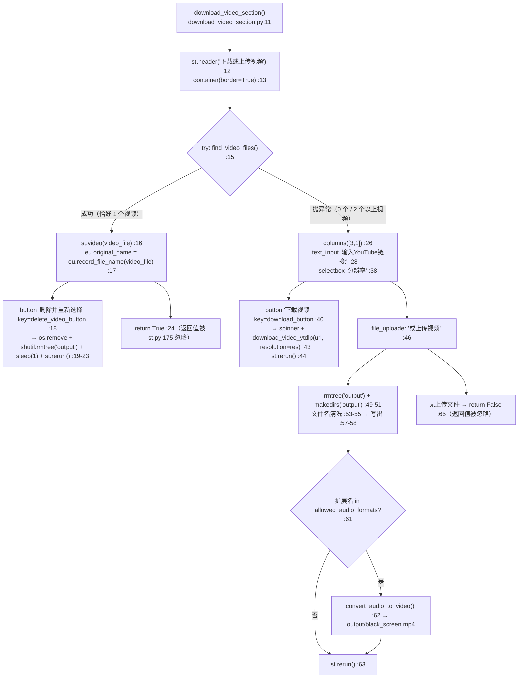

> ## ⚠️ 本文部分内容已在「重构 Round 1」后失效
>
> ⚠️ 本文的「Dubbing Settings」整节（TTS Method 与各引擎子控件、相关 config 键）已失效——该区块已从 `sidebar_setting.py` 删除。其余控件（API 预设、ASR、TOS、字幕参数）仍然有效。


# Streamlit 界面组件（st_components/）

## 一、职责与边界

`st_components/` 是主应用 `st.py` 的「视图层」：`sidebar_setting.py` 渲染侧边栏的全部配置控件并把用户输入写回 `config.yaml`，`download_video_section.py` 负责视频下载/上传区块，`imports_and_utils.py` 负责聚合导入 core 模块、提供 zip 下载按钮与两段全局 HTML/CSS。

它**不**实现任何流水线逻辑：控件只做「读 `load_key` → 渲染 → 变化即 `update_key`」，下游行为由 `core/step*.py` 在真正执行时重新 `load_key` 决定。

它**不**做输入校验：绝大多数控件只比较「控件值 != config 值」就写盘，没有类型/范围/连通性校验（只有「📡 检查 API 连接」「测试火山引擎连接」「测试TOS连接」三个主动探测按钮）。

它**不**维护控件状态：没有用 `st.form`，没有 `st.session_state` 持久化（唯一的 session 键是 `_recog_lang_select`，见 `st_components/sidebar_setting.py:148`），控件的「默认值」每次 rerun 都从 `config.yaml` 现取。

## 二、文件清单

| 文件路径 | 行数 | 主要职责 |
| --- | --- | --- |
| `st_components/sidebar_setting.py` | 368 | `config_input()` / `check_api()` / `apply_config()` / `page_setting()`：侧边栏全部控件 |
| `st_components/download_video_section.py` | 76 | `download_video_section()` 与 `convert_audio_to_video()` |
| `st_components/imports_and_utils.py` | 201 | 聚合 core 导入；`download_subtitle_zip_button()`；`copy_as_default_subbtitle()`；`button_style` / `give_star_button` |
| `core/config_utils.py` | 89 | `load_key / update_key / assign_key / get_joiner`（界面层唯一配置出入口） |
| `config.yaml` | 242 | 配置真值源（ruamel.yaml，保留引号与注释） |
| `.streamlit/config.toml` | 2 | 仅 `[server] maxUploadSize = 4096` |
| `st.py` | 180 | 调用方：`st.py:173 page_setting()`、`st.py:175 download_video_section()`、`st.py:169/174` 注入两段 CSS/HTML |

> 注：`st_components/` 目录下**没有** `__init__.py`，三个模块以命名空间包方式被导入。

## 三、调用链与数据流

### 3.1 导入关系图



> ⚠️ **循环导入依赖执行顺序**：`imports_and_utils.py:36` 导入 `sidebar_setting`，而 `sidebar_setting.py:4` 又 `from st_components.imports_and_utils import ask_gpt`。这能成功**只因为** `imports_and_utils.py:31` 的 `from core.ask_gpt import ask_gpt` 排在 `:36` 之前——把这行挪到 `:36` 之后会立刻 `ImportError`。

### 3.2 `page_setting()` 的控制流（真实顺序）



### 3.3 `download_video_section()` 的控制流



## 四、关键数据结构

### 4.1 `config_input()` 的契约（`sidebar_setting.py:6-11`）

```python
def config_input(label, key, help=None):
    val = st.text_input(label, value=load_key(key), help=help)
    if val != load_key(key):
        update_key(key, val)
    return val
```

| 项 | 说明 |
| --- | --- |
| 输入 | `label`（控件标题）、`key`（config 点分键路径）、`help` |
| 控件类型 | 固定 `st.text_input`（**没有** `type="password"`，API Key 明文显示） |
| 默认值 | 每次都 `load_key(key)` 现读 `config.yaml` |
| 写回 | 值不同即 `update_key(key, val)`：读整文件 → 改键 → **整文件回写**（`core/config_utils.py:28-47`） |
| 返回 | 字符串（页面其余逻辑未使用其返回值） |
| 失败行为 | 键不存在时 `load_key` 抛 `KeyError`（`core/config_utils.py:25`），`update_key` 抛 `KeyError`（`:47`）→ 整页报错 |

### 4.2 `apply_config()` 的预设映射（`sidebar_setting.py:22-43`）

| 选项文本（`:47`） | 分支 | `assign_key` 调用 | 源键 |
| --- | --- | --- | --- |
| `"Deepseek"` | `:24-27` | `api.key` / `api.base_url` / `api.model` | `deepseek_api.key` / `.base_url` / `.model` |
| `"千问"` | `:28-31` | 同上三个目标键 | `qwen_api.*` |
| `"硅基流动"` | `:32-35` | 同上三个目标键 | `siliconflow_api.*` |
| `"Ollama"` | `:36-39` | 同上三个目标键 | `ollama_api.*` |

机制与副作用：

1. 用 `assign_key(target_key, source_key)`（`core/config_utils.py:61-88`）把预设块的**值复制**到 `api.*`，然后整文件回写 `config.yaml`；预设块本身保留不变（`api:` 与 `xxx_api:` 是两份数据）。
2. 三个 `assign_key` 是三次独立的「读整文件 → 改一个键 → 写整文件」，**不是原子操作**：中间若第二个键与第三个键之间进程被杀/文件被另一进程改写，会出现 `api.key` 是千问、`api.model` 还是 Deepseek 的混合状态。
3. `:42-43` 尝试删除 `st.session_state.api_status`——该键在全仓库**从未被赋值**，属无效清理代码（`check_api()` 也不写 session）。
4. `apply_config()` **不调用 `st.rerun()`**，但按钮点击本身就是一次 rerun，且「LLM 配置」三个输入框在源码里位于按钮**之后**（`:61` vs `:65-70`），所以同一次 rerun 里 `config_input` 读到的是新值、控件会以新值重建。
5. `config_name` 不在四个选项内时函数静默无操作（无 `else` 分支）。
6. ⚠️ 需人工确认：切换预设后是否需要在 UI 上给出「已切换」的反馈（当前只有按钮无任何提示）。

### 4.3 硬编码的选项字典（界面侧唯一的数据源，不在 `config.yaml` 里）

| 变量 | 位置 | 内容 | 说明 |
| --- | --- | --- | --- |
| `config_options` | `sidebar_setting.py:47` | `["Deepseek", "千问", "硅基流动", "Ollama"]` | 与 `apply_config()` 的字符串分支必须逐字一致 |
| `asr_engines` | `:79-82` | `{"Whisper": "whisper", "火山引擎ASR": "volcano"}` | 值写入 `asr_engine` |
| `langs` | `:94-105` | 10 种语言标签 → `en/zh/es/ru/fr/de/it/ja/ko/pt` | 写入 `whisper.language` |
| `lang_map`（回调内） | `:126-130` | `en/zh/ja/ko/fr/de/es/pt` → `en-US/zh-CN/ja-JP/ko-KR/fr-FR/de-DE/es-MX/pt-BR` | 同步到 `volcano_asr.language`；**不含 `it`、`ru`**，故意大利语/俄语只写 whisper 不同步火山 |
| `resolution_options` | `:167-170` | `{"1080p": "1920x1080", "360p": "640x360"}` | 值写入 `resolution` |
| `volcano_langs` | `:197-210` | 12 项（首项「自动检测」→ `""`） | 写入 `volcano_asr.language` |
| `tts_methods` | `:312` | `["azure_tts", "openai_tts", "fish_tts", "sf_fish_tts", "edge_tts", "gpt_sovits", "custom_tts"]` | 值写入 `tts_method`；`custom_tts` 无子控件分支 |
| `mode_options` | `:322-326` | `{"preset": "Preset", "custom": "Refer_stable", "dynamic": "Refer_dynamic"}` | 写入 `sf_fish_tts.mode` |
| `refer_mode_options` | `:357` | `{1: "Mode 1: …", 2: "Mode 2: …", 3: "Mode 3: …"}` | 写入 `gpt_sovits.refer_mode` |
| `res_dict` | `download_video_section.py:30-34` | `{"360p": "360", "1080p": "1080", "最佳": "best"}` | 作为 `download_video_ytdlp(resolution=...)` 参数，**不回写 config** |

## 五、逐控件实现说明

### 5.1 辅助函数

| 函数 | 行号 | 作用 | 关键细节 |
| --- | --- | --- | --- |
| `config_input(label, key, help=None)` | `sidebar_setting.py:6-11` | 通用文本配置输入 | 见 §4.1；每次调用读 2 次 `config.yaml` |
| `check_api()` | `:13-20` | 用 `ask_gpt("This is a test, response 'message':'success' in json format.", response_json=True, log_title='None')` 探测连通性 | 返回 `resp.get('message') == 'success'`；任何异常 → `False`；`log_title='None'` 使结果**不落** `output/gpt_log/`；**真实的 API 请求** |
| `apply_config(config_name)` | `:22-43` | 切换 API 预设 | 见 §4.2 |
| `page_setting()` | `:45-368` | 渲染整个侧边栏 | 无返回值 |
| `download_video_section()` | `download_video_section.py:11-65` | 渲染下载/上传区块 | 返回值无人使用 |
| `convert_audio_to_video(audio_file)` | `download_video_section.py:67-76` | 纯音频上传时用 ffmpeg 生成 `output/black_screen.mp4`（640x360 黑底 + AAC） | `subprocess.run(..., check=True, capture_output=True)`；成功后 `os.remove(audio_file)`；已存在 `black_screen.mp4` 时直接返回 |

### 5.2 【核心表】`page_setting()` 全控件清单（严格按源码顺序）

| # | 行号 | 区块（容器） | 控件（逐字） | `key` | config 键 | 默认值来源 | 写回方式 | 影响的下游 |
| --- | --- | --- | --- | --- | --- | --- | --- | --- |
| 1 | `:48` | expander「一键切换配置」(`:46`) | `st.selectbox("选择配置", options=["Deepseek", "千问", "硅基流动", "Ollama"])` | 无 | 不绑定 | 硬编码 `config_options`，无 `index` → 默认第 0 项 `Deepseek` | 不回写 | 仅作为 `apply_config()` 入参 |
| 2 | `:61` | 同上 | `st.button("应用配置")` | 无 | 见 §4.2 | — | `assign_key` ×3 写 `api.key/base_url/model` | LLM 全流程 |
| 3 | `:51-60` | 同上 | `st.markdown(<style> div[data-testid="stButton"] button { color: white !important; } …)` | — | — | — | — | 全局 CSS，见 §7.6 |
| 4 | `:65` | expander「LLM 配置」(`:64`) | `config_input("API_KEY", "api.key")` | 无 | `api.key` | `load_key("api.key")` | `update_key` | `core/ask_gpt.py:56/63/69` |
| 5 | `:66` | 同上 | `config_input("BASE_URL", "api.base_url", help="Openai format, will add /v1/chat/completions automatically")` | 无 | `api.base_url` | `load_key` | `update_key` | `core/ask_gpt.py:68`（拼接 `/v1`） |
| 6 | `:70` | 同上（`c1`，`columns([5,1])`） | `config_input("MODEL", "api.model", help="click to check API validity 👉")` | 无 | `api.model` | `load_key` | `update_key` | `core/ask_gpt.py:70` 决定是否发 `response_format={"type":"json_object"}`（与 `llm_support_json` 比对） |
| 7 | `:73` | 同上（`c2`，`:72` 垫高 `div`） | `st.button("📡", key="api", help="Check API connection")` | `"api"` | — | — | 无 | `st.toast("API密钥有效"/"API密钥无效", icon="✅"/"❌")`；**`check_api()` 被调用 2 次**（`:74`、`:75`）→ 每次点击发 2 个真实请求 |
| 8 | `:83-87` | expander「Subtitles Settings」(`:77`) | `st.selectbox("ASR Engine", options=list(asr_engines.keys()), index=…)` | 无 | `asr_engine` | `list(asr_engines.values()).index(load_key("asr_engine"))`，取不到则 `0` | `update_key("asr_engine", …)` + `st.rerun()` (`:88-90`) | `core/step2_whisperX.py:241 transcribe_audio()` 选择 WhisperX / 火山 |
| 9 | `:144-150` | 同上（`c1`，`columns(2)` `:92`） | `st.selectbox("Recog Lang", options=list(langs.keys()), index=current_index, key="_recog_lang_select", on_change=on_lang_change)` | `"_recog_lang_select"` | `whisper.language`（回调内 `:119`）；可选 `volcano_asr.language`（`:135`） | `list(langs.values()).index(load_key("whisper.language"))`，`ValueError` 时 `0`（`:139-142`） | 回调 `on_lang_change()`（`:108-135`）里 `update_key` | WhisperX 识别语言；火山引擎识别语言 |
| 10 | `:153-155` | 同上（`c2`） | `st.text_input("Target Lang", value=load_key("target_language"))` | 无 | `target_language` | `load_key` | `update_key` | 翻译提示词的目标语言（`config.yaml:31` 默认 `'简体中文'`） |
| 11 | `:157-159` | 同上 | `st.toggle("Vocal separation enhance", value=load_key("demucs"), help="Recommended for videos with loud background noise, but will increase processing time")` | 无 | `demucs` | `load_key` | `update_key` | 转录前是否跑 Demucs（`core/all_whisper_methods/demucs_vl.py`） |
| 12 | `:161-163` | 同上 | `st.toggle("只生成原语言字幕 (跳过翻译)", value=load_key("transcription_only"), help="只生成原语言字幕，跳过翻译步骤")` | 无 | `transcription_only` | `load_key` | `update_key` | `st.py:17/89` 的全部文案与执行分支 |
| 13 | `:165` | 同上 | `st.toggle("Burn-in Subtitles", value=load_key("resolution") != "0x0", help="takes longer time")` | 无 | **无独立键**（派生自 `resolution`） | `load_key("resolution") != "0x0"` | 不直接写；由 #14/#15 写 `resolution` | 是否压制字幕（`0x0` = 只生成 1 帧黑屏占位，`core/step7_merge_sub_to_vid.py:48-59`） |
| 14 | `:173-177` | 同上（**仅 #13 为开时渲染**） | `st.selectbox("Video Resolution", options=["1080p", "360p"], index=…)` | 无 | `resolution` | `list(resolution_options.values()).index(load_key("resolution"))`，`resolution == "0x0"` 时 `0` | `update_key("resolution", "1920x1080"｜"640x360")`（`:182-183`） | 压制分辨率；`st.py:61/139` 是否内嵌播放 |
| 15 | `:179-183` | 同上（**#13 为关时**） | 无控件，直接 `resolution = "0x0"` | — | `resolution` | — | `update_key("resolution", "0x0")` | 同 #14 |
| 16 | `:190` | expander「火山引擎ASR配置」(`:187`，**仅 `asr_engine == "volcano"` 渲染**，`:186`) | `config_input("App ID", "volcano_asr.app_id", help="火山引擎控制台获取的APP ID")` | 无 | `volcano_asr.app_id` | `load_key` | `update_key` | `core/all_whisper_methods/volcano_asr.py` |
| 17 | `:191` | 同上 | `config_input("Access Token", "volcano_asr.access_token", help="…Access Token")` | 无 | `volcano_asr.access_token` | `load_key` | `update_key` | 同上 |
| 18 | `:194` | 同上 | `config_input("Resource ID", "volcano_asr.resource_id", help="资源ID，默认: volc.bigasr.auc")` | 无 | `volcano_asr.resource_id` | `load_key` | `update_key` | 同上 |
| 19 | `:211-215` | 同上 | `st.selectbox("识别语言", options=list(volcano_langs.keys()), index=…)` | 无 | `volcano_asr.language` | `list(volcano_langs.values()).index(load_key(...))`，取不到则 `0`（「自动检测」） | `update_key`（`:216-217`） | 火山 ASR 语言 |
| 20 | `:220-224` | 同上 | `st.selectbox("模型版本", options=["310", "400"], index=0 if load_key("volcano_asr.model_version") == "310" else 1)` | 无 | `volcano_asr.model_version` | 硬编码映射 | `update_key`（`:225-226`） | 火山 ASR 模型版本（`config.yaml:75` 默认 `'400'`） |
| 21 | `:231-233` | 同上（`col1`，`columns(2)` `:229`） | `st.toggle("自动标点", value=load_key("volcano_asr.enable_punc"))` | 无 | `volcano_asr.enable_punc` | `load_key` | `update_key` | 火山请求参数 |
| 22 | `:235-237` | 同上 | `st.toggle("数字规整", value=load_key("volcano_asr.enable_itn"))` | 无 | `volcano_asr.enable_itn` | `load_key` | `update_key` | 同上 |
| 23 | `:239-241` | 同上 | `st.toggle("语义顺滑", value=load_key("volcano_asr.enable_ddc"))` | 无 | `volcano_asr.enable_ddc` | `load_key` | `update_key` | 同上 |
| 24 | `:244-246` | 同上（`col2`） | `st.toggle("显示分句", value=load_key("volcano_asr.show_utterances"))` | 无 | `volcano_asr.show_utterances` | `load_key` | `update_key` | 同上 |
| 25 | `:248-250` | 同上 | `st.toggle("说话人分离", value=load_key("volcano_asr.enable_speaker_info"))` | 无 | `volcano_asr.enable_speaker_info` | `load_key` | `update_key` | 同上 |
| 26 | `:252-254` | 同上 | `st.toggle("双声道识别", value=load_key("volcano_asr.enable_channel_split"))` | 无 | `volcano_asr.enable_channel_split` | `load_key` | `update_key` | 同上 |
| 27 | `:257-258` | 同上 | `st.markdown("---")` + `st.markdown("**高级设置**")` | — | — | — | — | 视觉分隔（源码注释说明：避免嵌套 expander） |
| 28 | `:259-262` | 同上 | `st.toggle("VAD分句", value=load_key("volcano_asr.vad_segment"), help="使用VAD分句代替语义分句，双声道识别时建议开启")` | 无 | `volcano_asr.vad_segment` | `load_key` | `update_key` | 火山请求参数 |
| 29 | `:265-271` | 同上 | `st.button("测试火山引擎连接", type="secondary")` | 无 | — | — | 无 | `from core.all_whisper_methods.volcano_asr import VolcanoASR; asr = VolcanoASR()`（`:267-268`）→ `st.success("✅ 火山引擎ASR配置有效")` / `st.error(f"❌ 配置错误: {str(e)}")` |
| 30 | `:274-275` | 同上 | `st.markdown("---")` + `st.markdown("**TOS对象存储配置**")` | — | — | — | — | 视觉分隔 |
| 31 | `:277-280` | 同上 | `st.toggle("启用TOS上传", value=load_key("tos.enabled"), help="启用后，音频文件将上传到火山引擎TOS")` | 无 | `tos.enabled` | `load_key` | `update_key` | 决定 #32-#37 是否渲染；火山 ASR 音频上传方式 |
| 32 | `:283` | 同上（**仅 #31 为开**，`:282`） | `config_input("Access Key", "tos.access_key", help="…或设置环境变量TOS_ACCESS_KEY")` | 无 | `tos.access_key` | `load_key` | `update_key` | `core/all_whisper_methods/tos_service.py` |
| 33 | `:284` | 同上 | `config_input("Secret Key", "tos.secret_key", help="…或设置环境变量TOS_SECRET_KEY")` | 无 | `tos.secret_key` | `load_key` | `update_key` | 同上 |
| 34 | `:287` | 同上 | `config_input("Bucket名称", "tos.bucket_name", help="火山引擎TOS的Bucket名称")` | 无 | `tos.bucket_name` | `load_key` | `update_key` | 同上 |
| 35 | `:288` | 同上 | `config_input("Endpoint", "tos.endpoint", help="火山引擎TOS的Endpoint地址")` | 无 | `tos.endpoint` | `load_key` | `update_key` | 同上 |
| 36 | `:289` | 同上 | `config_input("Region", "tos.region", help="火山引擎TOS的Region区域")` | 无 | `tos.region` | `load_key` | `update_key` | 同上 |
| 37 | `:292-293` | 同上 | `st.markdown("---")` + `st.markdown("**TOS高级设置**")` | — | — | — | — | 视觉分隔 |
| 38 | `:294-297` | 同上 | `st.toggle("自动清理", value=load_key("tos.auto_cleanup"), help="启用后，ASR处理完成返回结果后会删除TOS上的音频文件")` | 无 | `tos.auto_cleanup` | `load_key` | `update_key` | TOS 上传后清理策略 |
| 39 | `:300-309` | 同上 | `st.button("测试TOS连接", type="secondary")` | 无 | — | — | 无 | `from core.all_whisper_methods.tos_service import TOSService; TOSService().is_enabled()`（`:302-304`）→ `st.success("✅ TOS连接成功")` / `st.error("❌ TOS连接失败，请检查配置")` / `st.error(f"❌ TOS连接错误: {str(e)}")` |
| 40 | `:313` | expander「Dubbing Settings」(`:311`) | `st.selectbox("TTS Method", options=tts_methods, index=tts_methods.index(load_key("tts_method")))` | 无 | `tts_method` | `tts_methods.index(load_key("tts_method"))`——**配置值不在列表里会 `ValueError` 崩页** | `update_key("tts_method", …)`（`:314-315`） | 全部 TTS 步骤（step10） |
| 41 | `:319` | 同上（`select_tts == "sf_fish_tts"`，`:318`） | `config_input("SiliconFlow API Key", "sf_fish_tts.api_key")` | 无 | `sf_fish_tts.api_key` | `load_key` | `update_key` | `core/all_tts_functions/siliconflow_fish_tts.py` |
| 42 | `:327-334` | 同上 | `st.selectbox("Mode Selection", options=["preset","custom","dynamic"], format_func=…, index=…)` | 无 | `sf_fish_tts.mode` | `list(mode_options.keys()).index(load_key(...))`，取不到则 `0` | `update_key`（`:333-334`） | 决定 #43 是否出现；TTS 参考音频模式 |
| 43 | `:337` | 同上（**仅 `mode == "preset"`**，`:336`） | `config_input("Voice", "sf_fish_tts.voice")` | 无 | `sf_fish_tts.voice` | `load_key` | `update_key` | 预设音色 |
| 44 | `:340-341` | 同上（`openai_tts`，`:339`） | `config_input("302ai API", "openai_tts.api_key")` + `config_input("OpenAI Voice", "openai_tts.voice")` | 无 | `openai_tts.api_key` / `openai_tts.voice` | `load_key` | `update_key` | OpenAI TTS |
| 45 | `:344-347` | 同上（`fish_tts`，`:343`） | `config_input("302ai API", "fish_tts.api_key")` + `st.selectbox("Fish TTS Character", options=list(load_key("fish_tts.character_id_dict").keys()), index=…)` | 无 | `fish_tts.api_key` / `fish_tts.character` | 角色列表**来自 `config.yaml` 的 `fish_tts.character_id_dict` 键**；`index` 用 `.index(load_key("fish_tts.character"))`，取不到会 `ValueError` | `update_key`（`:346-347`） | Fish TTS 音色 |
| 46 | `:350-351` | 同上（`azure_tts`，`:349`） | `config_input("302ai API", "azure_tts.api_key")` + `config_input("Azure Voice", "azure_tts.voice")` | 无 | `azure_tts.api_key` / `azure_tts.voice` | `load_key` | `update_key` | Azure TTS |
| 47 | `:354-366` | 同上（`gpt_sovits`，`:353`） | `st.info("Please refer to Github homepage for GPT_SoVITS configuration")` + `config_input("SoVITS Character", "gpt_sovits.character")` + `st.selectbox("Refer Mode", options=[1,2,3], format_func=…, index=…)` | 无 | `gpt_sovits.character` / `gpt_sovits.refer_mode` | `list(refer_mode_options.keys()).index(load_key("gpt_sovits.refer_mode"))`——类型必须精确匹配（`config.yaml:164` 是整数 `3`） | `update_key`（`:365-366`） | GPT-SoVITS 参考音频模式 |
| 48 | `:368` | 同上（`edge_tts`，`:367`） | `config_input("Edge TTS Voice", "edge_tts.voice")` | 无 | `edge_tts.voice` | `load_key` | `update_key` | Edge TTS（`config.yaml:125` 默认 `tts_method: 'edge_tts'`） |
| 49 | — | 同上（`custom_tts`） | **无专属子控件**（`custom_tts` 在 `tts_methods` 列表里但没有 `if/elif` 分支） | — | — | — | — | 自定义 TTS 需自行改代码 |

### 5.3 `download_video_section()` 控件表

| # | 行号 | 控件（逐字） | `key` | config 键 | 默认值来源 | 行为 / 副作用 |
| --- | --- | --- | --- | --- | --- | --- |
| 1 | `download_video_section.py:16` | `st.video(video_file)` | — | — | `find_video_files()` 的返回值 | 仅当 `output/` 下恰好 1 个视频时出现 |
| 2 | `:18-23` | `st.button("删除并重新选择", key="delete_video_button")` | `"delete_video_button"` | — | — | `os.remove(video_file)` → `shutil.rmtree("output")`（**连 `output_sub.mp4`/`output_dub.mp4` 一起删**）→ `sleep(1)` → `st.rerun()` |
| 3 | `:28` | `st.text_input("输入YouTube链接:")`（`col1`） | 无 | 不绑定 | 空 | 仅存于局部变量 `url`；空值点下载时**无任何提示**（`:41` 的 `if url:` 为假，静默无操作） |
| 4 | `:38` | `st.selectbox("分辨率", options=list(res_dict.keys()), index=default_idx)`（`col2`） | 无 | 读 `ytb_resolution` 作默认值，**不回写** | `list(res_dict.values()).index(load_key("ytb_resolution"))`，取不到则 `0`（`360p`） | 传给 `download_video_ytdlp(url, resolution=res)`（`:43`），取值 `360/1080/best` |
| 5 | `:40-44` | `st.button("下载视频", key="download_button", use_container_width=True)` | `"download_button"` | — | — | `with st.spinner("正在下载视频...")` → `download_video_ytdlp(url, resolution=res)` → `st.rerun()` |
| 6 | `:46` | `st.file_uploader("或上传视频", type=load_key("allowed_video_formats") + load_key("allowed_audio_formats"))` | 无 | 读两个格式键 | `config.yaml:185-198`：7 种视频 + 4 种音频 | 有文件时：删除并重建 `output/` → 文件名清洗（`:53-55`：空格换 `_`、`re.sub(r'[^\w\-_\.]', '', name)`、扩展名转小写）→ 写出 → 音频则 `convert_audio_to_video()` → `st.rerun()` |
| 7 | `:65` | 无控件：无上传文件时 `return False` | — | — | — | 返回值在 `st.py:175` 被忽略 |

下载与上传的**错误提示**：该组件内**没有**任何 `st.error` / `st.warning`；`find_video_files()` 的 `ValueError`、yt-dlp 的下载异常、ffmpeg 的 `CalledProcessError` 全部只打印到服务器终端，或者直接冒泡成页面上的红色异常堆栈。

## 六、关键参数与配置

### 6.1 侧边栏已暴露的键（与 §5.2 一一对应）

`api.key`、`api.base_url`、`api.model`、`asr_engine`、`whisper.language`、`volcano_asr.language`、`target_language`、`demucs`、`transcription_only`、`resolution`、`volcano_asr.app_id`、`volcano_asr.access_token`、`volcano_asr.resource_id`、`volcano_asr.model_version`、`volcano_asr.enable_punc`、`volcano_asr.enable_itn`、`volcano_asr.enable_ddc`、`volcano_asr.show_utterances`、`volcano_asr.enable_speaker_info`、`volcano_asr.enable_channel_split`、`volcano_asr.vad_segment`、`tos.enabled`、`tos.access_key`、`tos.secret_key`、`tos.bucket_name`、`tos.endpoint`、`tos.region`、`tos.auto_cleanup`、`tts_method`、`sf_fish_tts.api_key`、`sf_fish_tts.mode`、`sf_fish_tts.voice`、`openai_tts.api_key`、`openai_tts.voice`、`fish_tts.api_key`、`fish_tts.character`、`azure_tts.api_key`、`azure_tts.voice`、`gpt_sovits.character`、`gpt_sovits.refer_mode`、`edge_tts.voice`。

### 6.2 只在 `config.yaml` 里、UI 不暴露的键

`config.yaml:1` 的注释声明：带 `*` 的高级设置不出现在 Streamlit 页面，只能手改文件。

| 类别 | 键 |
| --- | --- |
| 版本/元信息 | `version` |
| 下载 | `ytb_resolution`*（只作默认值，UI 不回写）、`allowed_video_formats`、`allowed_audio_formats`（只作 `file_uploader` 的 `type`） |
| ASR | `whisper.model`*、`whisper.detected_language` |
| 字幕/翻译 | `subtitle.max_length`*、`subtitle.target_multiplier`*、`summary_length`*、`max_workers`*、`max_split_length`*、`reflect_translate`*、`pause_before_translate`* |
| 配音 | `speed_factor`*、`min_subtitle_duration`*、`min_trim_duration`*、`tolerance`*、`dub_volume`*、`sf_fish_tts.custom_name`*、`sf_fish_tts.voice_id`* |
| 其它 | `model_dir`、`llm_support_json`、`spacy_model_map`、`language_split_with_space`、`language_split_without_space`、`tos.public_url_prefix` |
| API 预设源 | `deepseek_api.*`、`qwen_api.*`、`siliconflow_api.*`、`ollama_api.*`（仅被 `apply_config()` 读取，不作为运行时配置） |

### 6.3 「模型下拉列表」的真实来源

**UI 中不存在模型下拉框。** `api.model` 由 `sidebar_setting.py:70` 的 `config_input` 渲染成**自由文本输入框**，`help` 文案是 `click to check API validity 👉`。

`llm_support_json`（`config.yaml:201-210`）**与界面无关**，只被 `core/ask_gpt.py:57,70` 使用：仅当 `api.model in llm_support_json` 时才给请求加 `response_format={"type": "json_object"}`。也就是说，模型名必须与 `config.yaml:201-210` 的字符串**逐字一致**（如 `deepseek-flash`、`qwen-plus`、`qwen3:30b-a3b`），否则模型仍能用，但会退化为「提示词里要求 JSON + `json_repair` 兜底解析」的路径。

## 七、技术要点与坑

### 7.1 控件写回的粒度是「整文件重写」

`update_key`（`core/config_utils.py:28-47`）与 `assign_key`（`:61-88`）都是「读整个 YAML → 改键 → 写整个 YAML」，用 ruamel 的 `preserve_quotes = True`（`:12`）保住引号与注释。因此：

- 每次交互都会重写 `config.yaml`（文件 mtime 频繁变化，`git status` 长期为 dirty）；
- `config_lock`（`core/config_utils.py:9`）是**进程内的 `threading.Lock`**，跨进程无效：UI 与 `batch` 模式、`AudioExtract` GUI 同时运行时是「读-改-写」竞态，后写者会丢掉前者的修改；
- 每次 rerun 都会多次 `load_key`（每个控件至少 1~2 次 + 下游步骤），每次都 `open()` 读盘且**无缓存**（`core/config_utils.py:14-26`）。

### 7.2 控件 ID 由参数决定 → 「外部改配置会让控件重建」

Streamlit 1.38.0 的控件 ID 是对参数做 md5（`streamlit/runtime/state/common.py:235-260`），且**默认值参与计算**：

| 控件 | ID 参与参数 | 源码位置（本机 conda 环境 `videolingo`） |
| --- | --- | --- |
| `st.text_input` | `label, value, max_chars, key, type, help, placeholder, form_id, page` | `streamlit/elements/widgets/text_widgets.py:278-291` |
| `st.selectbox` | `label, options, index, key, help, placeholder, form_id, page` | `streamlit/elements/widgets/selectbox.py:287-298` |
| `st.toggle` | `label, value, key, help, form_id, page` | `streamlit/elements/widgets/checkbox.py:294-303` |
| `st.button` | `label, key, help, type, use_container_width, …`（**无 value**） | `streamlit/elements/widgets/button.py:779-789` |

由此可得三条结论：

1. **写回是收敛的**：`config_input` 写盘后 `load_key` 变了 → 下一次 rerun 控件 ID 也变了 → 用新默认值重建 → `val == load_key(key)` 成立 → 不会反复写。所以「控件默认值把 config.yaml 覆盖回去」在单进程单会话下不会发生。
2. **真正的风险在并发写者**：batch/AudioExtract/手改文件与 UI 同时写 `config.yaml` 时（§7.1），胜出者取决于写入顺序，UI 并不知道自己的值已被覆盖。
3. **副作用是焦点与未提交输入丢失**：任何一次配置值变化都会让控件重建（输入框失焦、光标归位）；同理，`#13 Burn-in Subtitles`（`sidebar_setting.py:165`）这类「无 key、默认值派生自 config」的控件，其显示状态完全由 `resolution` 决定——它不是一个独立的开关状态。

### 7.3 一批控件会因为「配置值不在硬编码列表里」直接崩掉整页

| 位置 | 写法 | 失败后果 |
| --- | --- | --- |
| `sidebar_setting.py:313` | `tts_methods.index(load_key("tts_method"))` | `ValueError` → 异常从 `page_setting()` 冒泡出 `main()`，整页显示错误堆栈 |
| `sidebar_setting.py:345` | `…keys()).index(load_key("fish_tts.character"))` | 手改了 `character` 而 `character_id_dict` 里没有该角色 → `ValueError` |
| `sidebar_setting.py:362` | `…index(load_key("gpt_sovits.refer_mode"))` | 配置写成字符串 `"3"` 而非整数 `3` → `ValueError` |
| `sidebar_setting.py:86` | `list(asr_engines.values()).index(...) if … in … else 0` | **有保护**，不会崩 |
| `sidebar_setting.py:176` | `… if load_key("resolution") != "0x0" else 0` | **有保护** |
| `sidebar_setting.py:214` | `… if load_key("volcano_asr.language") in volcano_langs.values() else 0` | **有保护** |
| 任意 `config_input` / 方括号读取 | `load_key(key)` 在键不存在时抛 `KeyError`（`core/config_utils.py:25`） | 手删任何一个被 UI 引用的键（如 `api.key`）→ 整页报错 |

### 7.4 API Key 明文显示 + 按钮触发真实请求

- `config_input` 用普通 `st.text_input`，没有 `type="password"`，所以 `api.key`、`volcano_asr.access_token`、`tos.secret_key`、各 TTS 的 `api_key` 都以明文呈现在侧边栏（`config.yaml` 中的值形如 `'sk-***'`，本文档不复制真实值）。
- `sidebar_setting.py:73-75` 的 📡 按钮把 `check_api()` 写了**两遍**（`:74` 的 `st.toast` 文案判断 + `:75` 的 `icon` 判断），每次点击发 **2 个**真实 LLM 请求；`log_title='None'` 让结果不写入 `output/gpt_log/`，所以**也不会被缓存命中**，点击 N 次就是 2N 次请求。

### 7.5 语言联动的两处不一致

- `on_lang_change`（`sidebar_setting.py:108-135`）通过 `st.session_state._recog_lang_select` 取值（因此 `:148` 的 `key="_recog_lang_select"` 是必需的，注释也写明了）。
- 同步到火山的 `lang_map`（`:126-130`）**只有 8 种语言**：`en/zh/ja/ko/fr/de/es/pt` → `en-US/zh-CN/ja-JP/ko-KR/fr-FR/de-DE/es-MX/pt-BR`；`langs`（`:94-105`）里另有 `it`（意大利语）与 `ru`（俄语）**不在 `lang_map` 中**，选它们时只更新 `whisper.language`，`volcano_asr.language` 保持旧值。
- `volcano_langs`（`:197-210`）本身也**没有**意大利语/俄语（只有 en-US/zh-CN/ja-JP/ko-KR/fr-FR/de-DE/es-MX/pt-BR/id-ID/th-TH/ar-SA + 「自动检测」），所以这两门语言在 `asr_engine == "volcano"` 时只能靠「自动检测」。⚠️ 需人工确认：产品上是否要求补全 `it`/`ru` 对应的火山语言码。

### 7.6 全局 CSS 注入点与作用域

| 注入点 | 位置 | 内容 | 作用域 |
| --- | --- | --- | --- |
| `button_style` | `imports_and_utils.py:138-200`，注入于 `st.py:169` | `div.stButton > button:first-child`、`div.stDownloadButton > button:first-child` 及其 hover/active/focus | `<style>` 注入到文档，**全局**（主区 + 侧边栏都受影响） |
| `give_star_button` | `imports_and_utils.py:111-136`，注入于 `st.py:174`（`with st.sidebar:` 内） | `.github-button` 样式 + 指向 `https://github.com/Huanshere/VideoLingo` 的 `<a>` | 元素渲染在侧边栏；其 `<style>` 仍是全局 |
| 侧边栏白字样式 | `sidebar_setting.py:51-60`（在「一键切换配置」expander 内） | `div[data-testid="stButton"] button { color: white !important; }` | **全局**：与 `button_style` 的 `color: #144070` 冲突，`!important` 会胜出（特异性分析见 [`../01-entrypoints/01-Streamlit主应用入口.md`](../01-entrypoints/01-Streamlit主应用入口.md) §7.12）。⚠️ 需人工确认：需实际运行页面目视核对按钮文字颜色 |
| 对齐占位 | `sidebar_setting.py:72` | `<div style="margin-top: 25px; margin-right: 10px;"></div>` | 侧边栏，仅用于让 📡 按钮与 MODEL 输入框对齐 |
| 页面 HTML 文案 | `st.py:21-44`、`st.py:124-132`、`st.py:170` | `<p style='font-size: 20px;'>` 步骤说明、欢迎语与外链 | 主区 |

所有 `st.markdown(...)` 注入 HTML/CSS 的地方都显式传了 `unsafe_allow_html=True`（`st.py:48/132/169/170/174`、`sidebar_setting.py:59/72`）。

### 7.7 下载区块的几个反直觉行为

1. **`ytb_resolution` 只在 UI 里被读、不被写**：下载页选的分辨率不落 `config.yaml`（`download_video_section.py:35-39`），下次打开恢复成配置里的 `'1080'`。
2. **`try/except` 用裸 `except:`**（`:25`）兜住了 `find_video_files()` 的 `ValueError`，也兜住了 `st.video()` 的任何异常。于是「`output/` 里有 2 个视频」（例如残留 `*_trim.mp4`，见 `core/step1_ytdlp.py:62-77`）会表现为「突然回到下载/上传界面」，而不是报错。
3. **上传即清空 `output/`**（`:49-51`）——正在处理的产物会被直接删掉；下载路径则相反，会把新视频写进同一个目录（`core/step1_ytdlp.py:24` `outtmpl='output/%(title)s.%(ext)s'`），若旧视频还在，就会出现「2 个视频」→ 下次 rerun 掉进 §7.7.2 的分支。
4. **上传音频会静默替换成黑屏视频**（`:61-62` → `:67-76`）：`convert_audio_to_video()` 产出 `output/black_screen.mp4` 并删掉原始音频文件。
5. **`download_video_ytdlp()` 每次都会先 `pip install --upgrade yt-dlp`**（`core/step1_ytdlp.py:34-37`），即点一次「下载视频」就可能触发一次联网升级（失败只打印警告）。
6. **空 URL 点「下载视频」无反馈**（`:41` 的 `if url:`）。

### 7.8 组件内没有错误提示

三个文件里只有 `sidebar_setting.py:269/271/305/307/309/354` 有用户可见的状态提示（两个测试按钮 + `gpt_sovits` 的 `st.info`）。下载/上传/写配置失败都不会有 toast/error，排查时必须看启动 Streamlit 的那个终端。

## 八、扩展点

> 💡 以下均为建议，当前代码未实现。

### 8.1 新增一个配置控件（以把 `dub_volume` 暴露到 UI 为例）

1. `config.yaml` 里确认键已存在（`dub_volume: 1.5`，`:178`）；新键要新增时**必须**同时让所有读它的代码不出 `KeyError`。
2. 在 `page_setting()` 合适的位置加（例如「Dubbing Settings」`sidebar_setting.py:311` 之后）：

```python
dub_volume = st.slider("配音音量", min_value=0.5, max_value=3.0,
                       value=float(load_key("dub_volume")), step=0.1)
if dub_volume != load_key("dub_volume"):
    update_key("dub_volume", dub_volume)
```

3. 注意三点：① 用 `st.slider` 时 `value` 参与控件 ID（规则同 §7.2），浮点比较建议留容差；② 写回值是 Python `float`，ruamel 会写成 `1.5` 而不是字符串（现有 int 型键如 `speed_factor.max`、`gpt_sovits.refer_mode` 同理，不要写成字符串）；③ 该键的下游是 `core/step12_merge_dub_to_vid.py:49`，改 UI 不会自动让已生成的产物失效，需重新跑 step12。
4. 若新控件放在条件分支里（如 `if tos_enabled:`），记得它对「分支关闭时用户改不回来」的可用性影响。

### 8.2 新增一种 API 预设（例如 OpenRouter）

1. `config.yaml` 里加同名块（键名约定：`<name>_api`）：

```yaml
openrouter_api:
  key: '***'
  base_url: 'https://openrouter.ai/api'
  model: 'deepseek/deepseek-chat'
```

2. `sidebar_setting.py:47` 的 `config_options` 加显示名 `"OpenRouter"`。
3. `apply_config()`（`:22-43`）加一个 `elif config_name == "OpenRouter":` 分支，三行 `assign_key` 分别指向 `openrouter_api.key/base_url/model`；**字符串必须与 `config_options` 里的选项逐字一致**（`apply_config` 用的是精确相等判断）。
4. 若该服务支持 `response_format={"type":"json_object"}`，把模型名加进 `config.yaml:201 llm_support_json`，否则会走 `json_repair` 兜底路径。
5. `ollama_api.base_url` 这类「不带 `/v1`」的地址要注意 `core/ask_gpt.py:68` 会自动补 `/v1`。

### 8.3 把某个高级参数暴露到 UI（推荐清单与对应位置）

| 想暴露的键 | 建议控件 | 插入位置 | 下游 |
| --- | --- | --- | --- |
| `whisper.model`（`medium`/`large-v3`/`large-v3-turbo`） | `st.selectbox` | 「Subtitles Settings」`sidebar_setting.py:87` 之后 | `core/step2_whisperX.py` |
| `max_workers`（LLM 并发，默认 1000） | `st.number_input` | 「LLM 配置」`sidebar_setting.py:70` 之后 | `core/step4_2_translate_all.py:107`、`core/step5_splitforsub.py:97` |
| `summary_length`、`max_split_length` | `st.number_input` | 同上 | `core/step4_1_summarize.py`、`core/step3_2_splitbymeaning.py` |
| `subtitle.max_length`、`subtitle.target_multiplier` | `st.number_input` / `st.slider` | 「Subtitles Settings」 | `core/step5_splitforsub.py:74-75` |
| `pause_before_translate` | `st.toggle` + 改掉 `st.py:109` 的 `input()`（见 [`../01-entrypoints/01-Streamlit主应用入口.md`](../01-entrypoints/01-Streamlit主应用入口.md) §7.1） | 「Subtitles Settings」 | `st.py:108` |
| `speed_factor.*`、`min_subtitle_duration`、`min_trim_duration`、`tolerance` | `st.number_input` | 「Dubbing Settings」 | `core/step8_1_gen_audio_task.py`、`core/step11_merge_full_audio.py` |

### 8.4 其它改进方向

- 给 `config_input` 加 `password=True` 参数（内部用 `st.text_input(type="password")`）以隐藏密钥；注意 `type` 参与控件 ID。
- 把 `sidebar_setting.py:51-60` 的全局白字样式挪进 `button_style` 并去掉 `!important`，消除 §7.6 的冲突。
- 给所有 `.index(...)` 写法统一加上「取不到则 0」的保护（对照 §7.3 的表）。
- 把 `config.yaml` 的值缓存在 `st.session_state`（以文件 mtime 失效）以减少每 rerun 的读盘次数。

## 九、验证方式

```bat
cd /d E:\VideoLingo\VideoLingoMove
call "%USERPROFILE%\anaconda3\Scripts\activate.bat" videolingo
python -m streamlit run st.py
:: http://localhost:8501
```

| 验证目标 | 操作 | 期望 |
| --- | --- | --- |
| 控件 → config 写回 | 在侧边栏改 `MODEL` 后回车，然后 `Select-String -Path config.yaml -Pattern 'model:'` | `api.model` 变成新值，注释与引号保留 |
| 预设切换 | 选「千问」→ 点「应用配置」，再看 `api.key` / `api.base_url` / `api.model` 三行 | 三个值都等于 `qwen_api.*`；`qwen_api.*` 原块不变 |
| 只读确认（不写文件） | `python -c "from core.config_utils import load_key; print(load_key('api.model'), load_key('asr_engine'), load_key('tts_method'))"` | 打印当前配置值（该命令不修改文件） |
| 写回确认（⚠️ 会真实改写 config.yaml） | 先备份 `copy config.yaml config.yaml.bak`，再跑 `python -c "from core.config_utils import assign_key; assign_key('api.model','deepseek_api.model')"`，之后 `move /y config.yaml.bak config.yaml` 还原 | 验证 `assign_key` 的语义 |
| 条件渲染 | 把 `asr_engine` 改成 `volcano` 刷新页面 | 「火山引擎ASR配置」expander 出现；改回 `whisper` 后消失 |
| TTS 子控件 | 依次切换 `TTS Method` 的 7 个选项 | 每个方法只出现对应的子控件；`custom_tts` 无子控件 |
| 下载区块分支 | 在 `output/` 放 2 个视频文件后刷新 | `find_video_files()` 抛错 → 页面显示 URL + 上传控件（证明裸 `except:` 吞异常） |
| 崩溃点复现 | 把 `config.yaml` 的 `tts_method` 改成一个不在 `tts_methods` 里的值后刷新 | 页面报 `ValueError`（§7.3） |

## 十、相关文档

- [`../01-entrypoints/01-Streamlit主应用入口.md`](../01-entrypoints/01-Streamlit主应用入口.md) —— `st.py` 主入口、隐式状态机、`easy_util` 全局状态
- [`./01-配置文件与参数.md`](./01-配置文件与参数.md) —— `config.yaml` 全量键位与读写 API
- [`./03-批处理任务系统.md`](./03-批处理任务系统.md) —— `batch/utils/gui.py` 的另一套界面与 `config.yaml` 并发写风险
- [`../02-pipeline/01-下载与音频提取.md`](../02-pipeline/01-下载与音频提取.md) —— `download_video_ytdlp()` / `find_video_files()` 细节
- [`../02-pipeline/07-配音音频生成.md`](../02-pipeline/07-配音音频生成.md) —— 各 TTS 方法对应的 config 键
- [`../03-subsystems/01-LLM调用与提示词.md`](../03-subsystems/01-LLM调用与提示词.md) —— `api.*` 与 `llm_support_json` 的消费方式
- [`../05-guides/04-已知问题与技术债.md`](../05-guides/04-已知问题与技术债.md) —— §7 各项坑的技术债登记

> 注：截至 `last_verified`，`devdocs/` 下仅有 `README.md` 与 `_meta/写作模板.md`，上面除本文档外的链接指向尚未编写的文档。
