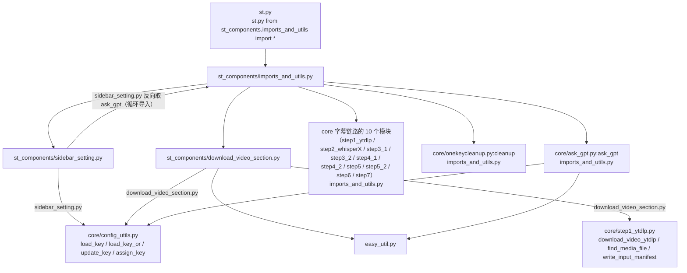
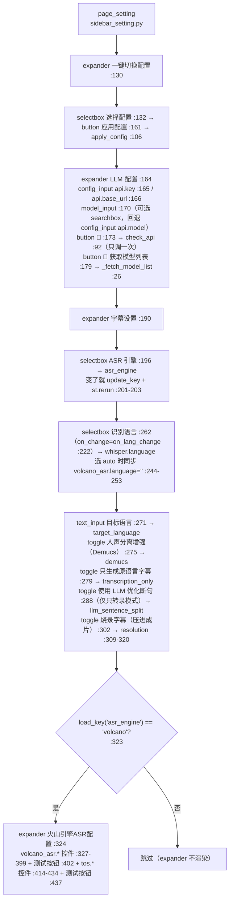
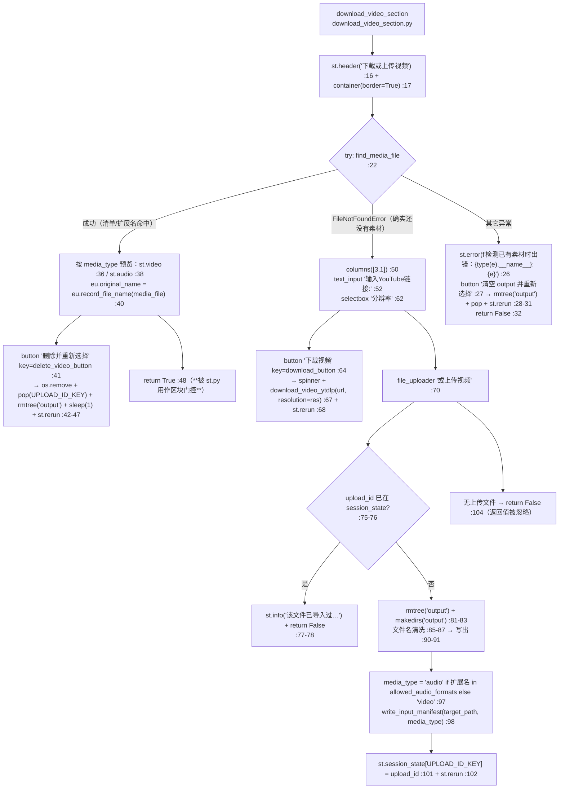

> ## ⚠️ 本文部分内容已在「重构 Round 1」后失效
>
> ⚠️ 本文的「Dubbing Settings」整节（TTS Method 与各引擎子控件、相关 config 键）已失效——该区块已从 `sidebar_setting.py` 删除，`tts_method` / `sf_fish_tts.*` / `openai_tts.*` / `fish_tts.*` / `azure_tts.*` / `gpt_sovits.*` / `edge_tts.*` / `dub_volume` 等键也已从 `config.example.yaml` 移除。§5.2 控件表中对应行（原 #40~#49）与 §6.1/§6.2 里列出的那些键**均不再存在**，请忽略。其余控件（API 预设、ASR、TOS、字幕参数）仍然有效。
>
> ⚠️ **上游 3.0.4 合并后新增/变更的控件**（本文已按现状更正）：LLM 配置里新增 `model_input` 模型搜索框与「🔄 获取模型列表」按钮、📡 按钮改为只调一次 `check_api`；识别语言 新增「🌐 自动检测」(`auto`)；下载区块的裸 `except:` 改为只捕 `FileNotFoundError`、音频输入不再包成黑屏视频（改 `st.audio` + `input_manifest.json`）、上传增加幂等保护、删除 `convert_audio_to_video`。
>
> 🌐 **2026-09-20：侧边栏文案全部中文化**（本文下面的表格与图示都已按新文案更正 —— 用旧英文名 grep 本文是找不到的，对照表如下）：
>
> | 旧（英文） | 现（中文） |
> | --- | --- |
> | `Subtitles Settings` | 字幕设置 |
> | `ASR Engine` | ASR 引擎 |
> | `Recog Lang` | 识别语言 |
> | `Target Lang` | 目标语言 |
> | `Vocal separation enhance` | 人声分离增强（Demucs） |
> | `Burn-in Subtitles` | 烧录字幕（压进成片） |
> | `Video Resolution` | 视频分辨率 |
> | `MODEL` | 模型 |
> | `API_KEY` / `BASE_URL` | API 密钥 (API_KEY) / 接口地址 (BASE_URL) |
> | `App ID` / `Access Token` / `Resource ID` | 应用 ID (App ID) / 访问令牌 (Access Token) / 资源 ID (Resource ID) |
> | `Access Key` / `Secret Key` / `Bucket名称` / `Endpoint` / `Region` | 访问密钥 (Access Key) / 私钥 (Secret Key) / 存储桶 (Bucket) / 接入地址 (Endpoint) / 区域 (Region) |
>
> 只动了 `label` / `help` 文案：控件类型、`key`、绑定的 config 键、以及所有写入行为**都没变**（`api.key` / `api.base_url` / `api.model` 等键名不受影响）。平台自己的字段名保留英文原词（放在括号里），方便与火山 / TOS 控制台逐字对上。


# Streamlit 界面组件（st_components/）

## 一、职责与边界

`st_components/` 是主应用 `st.py` 的「视图层」：`sidebar_setting.py` 渲染侧边栏的全部配置控件并把用户输入写回 `config.yaml`，`download_video_section.py` 负责视频下载/上传区块，`imports_and_utils.py` 负责聚合导入 core 模块、提供 zip 下载按钮与两段全局 HTML/CSS。

它**不**实现任何流水线逻辑：控件只做「读 `load_key` → 渲染 → 变化即 `update_key`」，下游行为由 `core/step*.py` 在真正执行时重新 `load_key` 决定。

它**不**做输入校验：绝大多数控件只比较「控件值 != config 值」就写盘，没有类型/范围/连通性校验（只有「📡 检查 API 连接」「🔄 获取模型列表」「测试火山引擎连接」「测试TOS连接」四个主动发起网络请求的按钮）。

它**不**维护控件状态：没有用 `st.form`，控件的「默认值」每次 rerun 都从 `config.yaml` 现取。用到的 `st.session_state` 键只有三个：`_recog_lang_select`（`st_components/sidebar_setting.py`）、`_model_list`（，模型搜索框的候选列表）、`_processed_upload_id`（`st_components/download_video_section.py`，上传幂等标识）。

## 二、文件清单

| 文件路径 | 规模 | 主要职责 |
| --- | --- | --- |
| `st_components/sidebar_setting.py` | ~19K | `config_input` / `_fetch_model_list` / `_search_models` / `model_input` / `check_api` / `apply_config` / `page_setting`：侧边栏全部控件 |
| `st_components/download_video_section.py` | ~4K | `download_video_section`：下载/上传区块（含上传幂等与 `input_manifest.json` 写入） |
| `st_components/imports_and_utils.py` | ~7K | 聚合 core 导入（字幕链路 8 个 step，含可选的 step5_2 润色）；`subtitle_zip_name`；`pick_default_subtitle`；`download_subtitle_zip_button`；`button_style` / `give_star_button` |
| `core/config_utils.py` | ~8K | `load_key / load_key_or / update_key / assign_key / get_joiner`（界面层唯一配置出入口） |
| `config.yaml` | — | 配置真值源（ruamel.yaml，保留引号与注释）；**未入库**，模板为 `config.example.yaml` |
| `.streamlit/config.toml` | 13 | `[server] maxUploadSize = 4096` + `[client] toolbarMode = "viewer"`（隐藏 Deploy 菜单；**没有**设 `fileWatcherType`，见文件内注释） |
| `st.py` | ~13K | 调用方：`st.py` 的 `page_setting`、`st.py` 的 `download_video_section`、`st.py/365` 注入两段 CSS/HTML |

> 注：`st_components/` 目录下**没有** `__init__.py`，三个模块以命名空间包方式被导入。

## 三、调用链与数据流

### 3.1 导入关系图



> ⚠️ **循环导入依赖执行顺序**：`imports_and_utils.py` 导入 `sidebar_setting`，而 `sidebar_setting.py` 又 `from st_components.imports_and_utils import ask_gpt`。这能成功**只因为** `imports_and_utils.py` 的 `from core.ask_gpt import ask_gpt` 排在 之前——把这行挪到 之后会立刻 `ImportError`。（`core/delete_retry_dubbing.py` 曾在这里被导入，该文件已随配音链路删除。）

### 3.2 `page_setting` 的控制流（真实顺序）



> ⚠️ 上述流程里**没有** Dubbing Settings：`page_setting` 到 结束，最后一个控件是 TOS 的「测试TOS连接」按钮。旧版本的 `tts_methods` 列表（原）、`sf_fish_tts.*` / `openai_tts.*` / `fish_tts.character_id_dict` / `azure_tts.*` / `gpt_sovits.refer_mode` / `edge_tts.voice` 等控件全部随配音链路删除。

### 3.3 `download_video_section` 的控制流



⚠️ 该区块**没有** `convert_audio_to_video`（合并时删除）：音频上传后原样留在 `output/`，只把 `"type": "audio"` 写进 `output/input_manifest.json`（→ `core/step1_ytdlp.py`），后续由 `core/step7_merge_sub_to_vid.py` 据此跳过压制。

## 四、关键数据结构

### 4.1 `config_input` 的契约（`sidebar_setting.py`）

```python
def config_input(label, key, help=None):
 env_name = _to_env_name(key)
 overridden = bool(os.environ.get(env_name))
 val = st.text_input(label, value=load_key(key), help=help)
 if overridden:
 st.caption(f"⚠️ 该项已被环境变量 `{env_name}` 覆盖；在此处的修改不会生效。")
 if val != load_key(key):
 if overridden:
 st.warning(f"`{key}` 当前由环境变量 `{env_name}` 决定，修改未写入。")
 else:
 update_key(key, val)
 return val
```

| 项 | 说明 |
| --- | --- |
| 输入 | `label`（控件标题）、`key`（config 点分键路径）、`help` |
| 控件类型 | 固定 `st.text_input`（**没有** `type="password"`，API Key 明文显示） |
| 默认值 | 每次都 `load_key(key)` 现读 `config.yaml` |
| 写回 | 值不同即 `update_key(key, val)`：读整文件 → 改键 → **整文件回写**（`core/config_utils.py`）。检测到 `VIDEOLINGO_<KEY>` 覆盖时只警告、不写盘 |
| 返回 | 字符串（页面其余逻辑未使用其返回值） |
| 失败行为 | 键不存在时 `load_key` 抛 `KeyError`（`core/config_utils.py`），`update_key` 抛 `KeyError`→ 整页报错 |

### 4.2 `apply_config` 的预设映射（`sidebar_setting.py`）

| 选项文本 | 分支 | `assign_key` 调用 | 源键 |
| --- | --- | --- | --- |
| `"Deepseek"` | | `api.key` / `api.base_url` / `api.model` | `deepseek_api.key` / `.base_url` / `.model` |
| `"千问"` | | 同上三个目标键 | `qwen_api.*` |
| `"硅基流动"` | | 同上三个目标键 | `siliconflow_api.*` |
| `"Ollama"` | | 同上三个目标键 | `ollama_api.*` |

机制与副作用：

1. 用 `assign_key(target_key, source_key)`（`core/config_utils.py`）把预设块的**值复制**到 `api.*`，然后整文件回写 `config.yaml`；预设块本身保留不变（`api:` 与 `xxx_api:` 是两份数据）。
2. 三个 `assign_key` 是三次独立的「读整文件 → 改一个键 → 写整文件」，**不是原子操作**：中间若第二个键与第三个键之间进程被杀/文件被另一进程改写，会出现 `api.key` 是千问、`api.model` 还是 Deepseek 的混合状态。
3. 尝试删除 `st.session_state.api_status`——该键在全仓库**从未被赋值**，属无效清理代码（`check_api` 也不写 session）。
4. `apply_config` **不调用 `st.rerun`**，但按钮点击本身就是一次 rerun，且「LLM 配置」三个输入框在源码里位于按钮**之后**（vs），所以同一次 rerun 里 `config_input` 读到的是新值、控件会以新值重建。
5. `config_name` 不在四个选项内时函数静默无操作（无 `else` 分支）。
6. ⚠️ 需人工确认：切换预设后是否需要在 UI 上给出「已切换」的反馈（当前只有按钮无任何提示）。

### 4.3 硬编码的选项字典（界面侧唯一的数据源，不在 `config.yaml` 里）

| 变量 | 位置 | 内容 | 说明 |
| --- | --- | --- | --- |
| `config_options` | `sidebar_setting.py` | `["Deepseek", "千问", "硅基流动", "Ollama"]` | 与 `apply_config` 的字符串分支必须逐字一致 |
| `asr_engines` | | `{"Whisper": "whisper", "火山引擎ASR": "volcano"}` | 值写入 `asr_engine` |
| `langs` | | 11 项：`"🌐 自动检测": "auto"` + `en/zh/es/ru/fr/de/it/ja/ko/pt` | 写入 `whisper.language`；`auto` 是**合并新增**项 |
| `lang_map`（回调内） | | `auto→""`、`en/zh/ja/ko/fr/de/es/pt` → `en-US/zh-CN/ja-JP/ko-KR/fr-FR/de-DE/es-MX/pt-BR` | 同步到 `volcano_asr.language`；**不含 `it`、`ru`**，故意大利语/俄语只写 whisper 不同步火山 |
| `resolution_options` | | `{"1080p": "1920x1080", "360p": "640x360"}` | 值写入 `resolution` |
| `volcano_langs` | | 12 项（首项「自动检测」→ `""`） | 写入 `volcano_asr.language` |
| `res_dict` | `download_video_section.py` | `{"360p": "360", "1080p": "1080", "最佳": "best"}` | 作为 `download_video_ytdlp(resolution=...)` 参数，**不回写 config** |
| `_model_list`（session） | | `list[str]`，来自 `_fetch_model_list` | 供 `model_input` 的搜索框使用；未获取时搜索框只能手输 |

> ⚠️ 旧版本此表还列有 `tts_methods`（原）、`mode_options`（原）、`refer_mode_options`（原）——它们随 Dubbing Settings 一起删除，当前 `sidebar_setting.py` 中不存在。

## 五、逐控件实现说明

### 5.1 辅助函数

| 函数 | 行号 | 作用 | 关键细节 |
| --- | --- | --- | --- |
| `config_input(label, key, help=None)` | `sidebar_setting.py` | 通用文本配置输入 | 见 §4.1；每次调用读 2 次 `config.yaml`；环境变量覆盖时只警告不写盘 |
| `_fetch_model_list(base_url, api_key)` | | `GET <base_url>/v1/models` 拉取模型 id | 缺 `/v1` 会自动补；`timeout=15`；`raise_for_status`；返回 `sorted({item['id'] …})`。**合并新增** |
| `_search_models(search_term, model_list)` | | `model_input` 的搜索回调 | 空串返回前 50 条；有命中返回命中；**完全无命中时返回 `[term]` 本身**（允许手输未在清单里的模型名） |
| `model_input` | | 模型选择控件 | `try: from streamlit_searchbox import st_searchbox`，`ImportError` 时回退 `config_input("模型", "api.model")` 并提示重跑安装脚本即可（该包已进主依赖）；搜索框 `key="api_model_searchbox"`，选中即 `update_key("api.model", selected)` |
| `check_api` | | 用 `ask_gpt("This is a test, …", response_json=True, log_title=None, use_cache=False)` 探测连通性 | 返回 `resp.get('message') == 'success'`；任何异常 → `False`；**刻意绕过缓存**（`use_cache=False`），`log_title=None` 使结果不落 `output/gpt_log/`；**真实的 API 请求**，调用方只调一次 |
| `apply_config(config_name)` | | 切换 API 预设 | 见 §4.2 |
| `polish_controls` | `sidebar_setting.py` | 字幕润色面板 expander「✨ 字幕润色（可选）」 | **2026-09-21 新增**，渲染位置在 `subtitle_length_controls()` 之后、火山/TOS 区块之前（`page_setting` 内）。**三个 `st.toggle`，顺序就是决策链"做不做 → 质量/花费 → 润色范围"**：① `st.toggle("翻译后润色字幕措辞", value=load_key_or("subtitle.polish_translation", False), key="polish_translation")` → 写 `subtitle.polish_translation`（默认关，缺键也按关）；② `st.toggle("允许模型思考", value=load_key_or("subtitle.polish_thinking", True), key="polish_thinking", disabled=not enabled)` → 写 `subtitle.polish_thinking`（默认开）；③ `st.toggle("只润色有分句的长行", value=load_key_or("subtitle.polish_long_lines_only", False), key="polish_long_lines_only", disabled=not enabled)` → 写 `subtitle.polish_long_lines_only`（默认关）。**后两个都只在 ① 打开时可用**（润色关着时置灰，避免误以为改了会有效果）；每个 toggle 都是"值变了才 `update_key` + `st.rerun(scope="app")"`。三个 `help` 各一行（①"额外调用 LLM 逐行润色：只改措辞、不改信息"；②"关掉省约 90% 润色 token，但更容易丢词（回退的行更多）。审校不受影响。"；③"短句与无分句的行原样保留，省 token。"）——**实测 token 数字已从 UI 撤掉，只在代码注释与 devdocs 里**；末尾 `st.caption` 一行："ℹ️ 每 20 行一次调用；超长/丢数字/丢信息会被拦下并回退原译文。"（"行数不变""仅转录模式自动跳过"仍是代码行为，只是不再进文案） |
| `page_setting` | | 渲染整个侧边栏 | 无返回值；到 TOS 的「测试TOS连接」按钮结束 |
| `download_video_section` | `download_video_section.py` | 渲染下载/上传区块 | 返回值 `True/False` **现在被使用**：`st.py` 用它门控处理区块 |

> ⚠️ `convert_audio_to_video(audio_file)`（原 `download_video_section.py`，用 ffmpeg 把音频包成 `output/black_screen.mp4`）**已删除**；音频输入改为写 `input_manifest.json` 并原样保留源文件。批量模式里另有一份同名实现（`batch/utils/batch_processor.py`），两者不再是同一套逻辑。

### 5.2 【核心表】`page_setting` 全控件清单（严格按源码顺序）

| # | 行号 | 区块（容器） | 控件（逐字） | `key` | config 键 | 默认值来源 | 写回方式 | 影响的下游 |
| --- | --- | --- | --- | --- | --- | --- | --- | --- |
| 1 | | expander「一键切换配置」 | `st.selectbox("选择配置", options=["Deepseek", "千问", "硅基流动", "Ollama"])` | 无 | 不绑定 | 硬编码 `config_options`，无 `index` → 默认第 0 项 `Deepseek` | 不回写 | 仅作为 `apply_config` 入参 |
| 2 | | 同上 | `st.button("应用配置")` | 无 | 见 §4.2 | — | `assign_key` ×3 写 `api.key/base_url/model` | LLM 全流程 |
| 3 | | 同上 | `st.markdown(<style> .stSidebar div[data-testid="stButton"] button, [data-testid="stSidebar"] div[data-testid="stButton"] button { color: white !important; } …)` | — | — | — | — | 侧边栏内 CSS（作用域已限定），见 §7.6 |
| 4 | | expander「LLM 配置」 | `config_input("API 密钥 (API_KEY)", "api.key")` | 无 | `api.key` | `load_key("api.key")` | `update_key` | `core/ask_gpt.py/133` |
| 5 | | 同上 | `config_input("接口地址 (BASE_URL)", "api.base_url", help="OpenAI 兼容格式；会自动补上 /v1/chat/completions")` | 无 | `api.base_url` | `load_key` | `update_key` | `core/ask_gpt.py`（拼接 `/v1`） |
| 6 | | 同上（`c1`，`columns([5,1])`） | `model_input`：装了 `streamlit-searchbox` 时是搜索框 `st_searchbox(label="模型", key="api_model_searchbox", default=load_key("api.model"))`，否则回退 `config_input("模型", "api.model", help="点右侧 📡 可检测 API 是否可用 👉")` | `"api_model_searchbox"`（仅搜索框分支） | `api.model` | `load_key("api.model")` | 搜索框选中即 `update_key("api.model", selected)`；回退分支走 `config_input` | `core/ask_gpt.py` 决定是否发 `response_format={"type":"json_object"}`（与 `llm_support_json` 比对）。**合并新增** |
| 7 | | 同上（`c2`， 垫高 `div`） | `st.button("📡", key="api", help="检测 API 连接是否可用")` | `"api"` | — | — | 无 | `is_valid = check_api` 只调**一次**→ `st.toast("API密钥有效"/"API密钥无效", icon=…)`。合并前是双调用，每次点击发 2 个真实请求 |
| 7b | | 同上（expander 末尾） | `st.button("🔄 获取模型列表", key="fetch_model_list", width="stretch", help="从 api.base_url 的 /v1/models 拉取可用模型，供上方搜索框使用")` | `"fetch_model_list"` | 不写 config | — | 无（只写 `st.session_state['_model_list']`） | `_fetch_model_list(load_key("api.base_url"), load_key("api.key"))`→ `st.toast(f"已获取 {len(models)} 个模型")` + `st.rerun(scope="app")`；失败 `st.toast(f"获取失败：{e}", icon="❌")`。**合并新增**。宽度参数 2026-09-20 由 `use_container_width=True` 改为 `width="stretch"` |
| 8 | | expander「字幕设置」 | `st.selectbox("ASR 引擎", options=list(asr_engines.keys), index=…)` | 无 | `asr_engine` | `list(asr_engines.values).index(load_key("asr_engine"))`，取不到则 `0` | `update_key("asr_engine", …)` + `st.rerun` | `core/step2_whisperX.py` 的 `transcribe` 选择 WhisperX / 火山 |
| 9 | | 同上（`c1`，`columns(2)`） | `st.selectbox("识别语言", options=list(langs.keys), index=current_index, key="_recog_lang_select", on_change=on_lang_change)` | `"_recog_lang_select"` | `whisper.language`（回调内）；可选 `volcano_asr.language` | `list(langs.values).index(load_key("whisper.language"))`，`ValueError` 时 `0` | 回调 `on_lang_change`里 `update_key`；`update_key` 会同步 `whisper.detected_language` | WhisperX 识别语言（经 `get_source_language`）；火山引擎识别语言。**`🌐 自动检测` 是合并新增项** |
| 10 | | 同上（`c2`） | `st.text_input("目标语言", value=load_key("target_language"))` | 无 | `target_language` | `load_key` | `update_key` | 翻译提示词的目标语言（`config.example.yaml` 默认 `'简体中文'`） |
| 11 | | 同上 | `st.toggle("人声分离增强（Demucs）", value=load_key("demucs"), help="先用 Demucs 把人声分离出来再识别：背景音乐/噪声大的视频效果更好，但会明显增加处理时间")` | 无 | `demucs` | `load_key` | `update_key` | 转录前是否跑 Demucs（`core/all_whisper_methods/demucs_vl.py`） |
| 12 | `sidebar_setting.py` | 同上 | `st.toggle("只生成原语言字幕 (跳过翻译)", value=load_key("transcription_only"), help="只生成原语言字幕，跳过翻译步骤")` | 无 | `transcription_only` | `load_key` | `update_key` | `st.py` 的全部文案与 `build_task_steps` 的步骤分支；**同时决定 #12b 是否显示** |
| 12b | `sidebar_setting.py` | 同上（**仅 #12 为开时渲染**） | `st.toggle("使用 LLM 优化断句", value=load_key("llm_sentence_split"))` | 无 | `llm_sentence_split` | `load_key` | `update_key` | `core/step3_2_splitbymeaning.py` 与 `core/step5_splitforsub.py` 是否调 LLM 做断句优化。**下方 #12c 是它的"反面"** |
| 12c | `sidebar_setting.py` | 同上（**#12 为关时**） | 无控件，静默把配置纠正为 `true` | — | `llm_sentence_split` | — | `update_key("llm_sentence_split", True)` | 翻译模式**强制开启**断句优化，故不显示开关、也不给提示文案；判定入口是 `core.config_utils.use_llm_sentence_split`，UI 与执行逻辑共用它以免漂移 |
| 13 | `sidebar_setting.py` | 同上 | `st.toggle("烧录字幕（压进成片）", value=load_key("resolution") != "0x0", help="开启后把字幕压进成片，需要重新编码、耗时更长；关闭则只产出字幕文件")` | 无 | **无独立键**（派生自 `resolution`） | `load_key("resolution") != "0x0"` | 不直接写；由 #14/#15 写 `resolution` | 是否压制字幕。**关 = `resolution: '0x0'`**：真实视频不产出成片（`core/step7_merge_sub_to_vid.py`）；纯音频输入（`input_manifest.json` 记为 `audio`）只交字幕；旧 `black_screen.mp4` 走兼容分支被保留为成片 |
| 14 | | 同上（**仅 #13 为开时渲染**） | `st.selectbox("视频分辨率", options=["1080p", "360p"], index=…)` | 无 | `resolution` | `list(resolution_options.values).index(load_key("resolution"))`，`resolution == "0x0"` 时 `0` | `update_key("resolution", "1920x1080"｜"640x360")` | 压制分辨率；`st.py` 是否内嵌播放 |
| 15 | | 同上（**#13 为关时**） | 无控件，直接 `resolution = "0x0"` | — | `resolution` | — | `update_key("resolution", "0x0")` | 同 #14 |
| 16 | | expander「火山引擎ASR配置」(，**仅 `asr_engine == "volcano"` 渲染**，) | `config_input("应用 ID (App ID)", "volcano_asr.app_id", help="火山引擎控制台获取的 App ID")` | 无 | `volcano_asr.app_id` | `load_key` | `update_key` | `core/all_whisper_methods/volcano_asr.py` |
| 17 | | 同上 | `config_input("访问令牌 (Access Token)", "volcano_asr.access_token", help="…Access Token")` | 无 | `volcano_asr.access_token` | `load_key` | `update_key` | 同上 |
| 18 | | 同上 | `config_input("资源 ID (Resource ID)", "volcano_asr.resource_id", help="资源 ID，默认：volc.bigasr.auc")` | 无 | `volcano_asr.resource_id` | `load_key` | `update_key` | 同上 |
| 19 | | 同上 | `st.selectbox("识别语言", options=list(volcano_langs.keys), index=…)` | 无 | `volcano_asr.language` | `list(volcano_langs.values).index(load_key(...))`，取不到则 `0`（「自动检测」） | `update_key` | 火山 ASR 语言 |
| 20 | | 同上 | `st.selectbox("模型版本", options=["310", "400"], index=0 if load_key("volcano_asr.model_version") == "310" else 1)` | 无 | `volcano_asr.model_version` | 硬编码映射 | `update_key` | 火山 ASR 模型版本（`config.example.yaml` 默认 `'400'`） |
| 21 | | 同上（`col1`，`columns(2)`） | `st.toggle("自动标点", value=load_key("volcano_asr.enable_punc"))` | 无 | `volcano_asr.enable_punc` | `load_key` | `update_key` | 火山请求参数 |
| 22 | | 同上 | `st.toggle("数字规整", value=load_key("volcano_asr.enable_itn"))` | 无 | `volcano_asr.enable_itn` | `load_key` | `update_key` | 同上 |
| 23 | | 同上 | `st.toggle("语义顺滑", value=load_key("volcano_asr.enable_ddc"))` | 无 | `volcano_asr.enable_ddc` | `load_key` | `update_key` | 同上 |
| 24 | | 同上（`col2`） | `st.toggle("显示分句", value=load_key("volcano_asr.show_utterances"))` | 无 | `volcano_asr.show_utterances` | `load_key` | `update_key` | 同上 |
| 25 | | 同上 | `st.toggle("说话人分离", value=load_key("volcano_asr.enable_speaker_info"))` | 无 | `volcano_asr.enable_speaker_info` | `load_key` | `update_key` | 同上 |
| 26 | | 同上 | `st.toggle("双声道识别", value=load_key("volcano_asr.enable_channel_split"))` | 无 | `volcano_asr.enable_channel_split` | `load_key` | `update_key` | 同上 |
| 27 | | 同上 | `st.markdown("---")` + `st.markdown("**高级设置**")` | — | — | — | — | 视觉分隔（源码注释说明：避免嵌套 expander） |
| 28 | | 同上 | `st.toggle("VAD分句", value=load_key("volcano_asr.vad_segment"), help="使用VAD分句代替语义分句，双声道识别时建议开启")` | 无 | `volcano_asr.vad_segment` | `load_key` | `update_key` | 火山请求参数 |
| 29 | | 同上 | `st.button("测试火山引擎连接", type="secondary")` | 无 | — | — | 无 | `from core.all_whisper_methods.volcano_asr import VolcanoASR; asr = VolcanoASR`→ `st.success("✅ 火山引擎ASR配置有效")` / `st.error(f"❌ 配置错误: {str(e)}")` |
| 30 | | 同上 | `st.markdown("---")` + `st.markdown("**TOS对象存储配置**")` | — | — | — | — | 视觉分隔 |
| 31 | | 同上 | `st.toggle("启用TOS上传", value=load_key("tos.enabled"), help="启用后，音频文件将上传到火山引擎TOS")` | 无 | `tos.enabled` | `load_key` | `update_key` | 决定 #32-#38 是否渲染；火山 ASR 音频上传方式 |
| 32 | | 同上（**仅 #31 为开**，） | `config_input("访问密钥 (Access Key)", "tos.access_key", help="…或设置环境变量TOS_ACCESS_KEY")` | 无 | `tos.access_key` | `load_key` | `update_key` | `core/all_whisper_methods/tos_service.py` |
| 33 | | 同上 | `config_input("私钥 (Secret Key)", "tos.secret_key", help="…或设置环境变量TOS_SECRET_KEY")` | 无 | `tos.secret_key` | `load_key` | `update_key` | 同上 |
| 34 | | 同上 | `config_input("存储桶 (Bucket)", "tos.bucket_name", help="火山引擎 TOS 的 Bucket 名称")` | 无 | `tos.bucket_name` | `load_key` | `update_key` | 同上 |
| 35 | | 同上 | `config_input("接入地址 (Endpoint)", "tos.endpoint", help="火山引擎 TOS 的 Endpoint 地址")` | 无 | `tos.endpoint` | `load_key` | `update_key` | 同上 |
| 36 | | 同上 | `config_input("区域 (Region)", "tos.region", help="火山引擎 TOS 的 Region 区域")` | 无 | `tos.region` | `load_key` | `update_key` | 同上 |
| 37 | | 同上 | `st.markdown("---")` + `st.markdown("**TOS高级设置**")` | — | — | — | — | 视觉分隔 |
| 38 | | 同上 | `st.toggle("自动清理", value=load_key("tos.auto_cleanup"), help="启用后，ASR处理完成返回结果后会删除TOS上的音频文件")` | 无 | `tos.auto_cleanup` | `load_key` | `update_key` | TOS 上传后清理策略 |
| 39 | | 同上 | `st.button("测试TOS连接", type="secondary")` | 无 | — | — | 无 | `from core.all_whisper_methods.tos_service import get_tos_service; tos_service = get_tos_service`→ `st.success("✅ TOS连接成功")` / `st.error("❌ TOS连接失败，请检查配置")` / `st.error(f"❌ TOS连接错误: {str(e)}")` |

> ⚠️ 旧版本的 #40~#49（expander「Dubbing Settings」：`st.selectbox("TTS Method", …)`、`sf_fish_tts.*`、`openai_tts.*`、`fish_tts.*`、`azure_tts.*`、`gpt_sovits.*`、`edge_tts.*` 子控件）**已整体删除**：`page_setting` 在 #39 之后结束，`tts_methods` / `mode_options` / `refer_mode_options` 三个硬编码列表与 `core/all_tts_functions/` 目录都不再存在。旧文档里「配置值不在列表里会 `ValueError` 崩页」的两个崩溃点（原 的 `tts_methods.index(...)`、原 的 `fish_tts.character_id_dict`）随之消失；当前仅剩 的模型版本与 的识别语言这类**带保护**的 `.index(...)` 写法。

### 5.3 `download_video_section` 控件表

| # | 行号 | 控件（逐字） | `key` | config 键 | 默认值来源 | 行为 / 副作用 |
| --- | --- | --- | --- | --- | --- | --- |
| 1 | `download_video_section.py` | 按 `media_type` 预览：`st.video(media_file)`（视频）/ `st.audio(media_file)` + `st.caption("输入为音频：只产出字幕文件（含原语言与译文），不做压制。")`（音频） | — | — | `find_media_file` 的返回值 | 视频与音频**都**会走到这里；音频不再被包成黑屏视频 |
| 2 | | `st.button("删除并重新选择", key="delete_video_button")` | `"delete_video_button"` | — | — | `os.remove(media_file)` → `st.session_state.pop(UPLOAD_ID_KEY)` → `shutil.rmtree("output")`（**连 `output_sub.mp4` 一起删**）→ `sleep(1)` → `st.rerun` |
| 3 | | `st.text_input("输入YouTube链接:")`（`col1`） | 无 | 不绑定 | 空 | 仅存于局部变量 `url`；空值点下载时**无任何提示**（的 `if url:` 为假，静默无操作） |
| 4 | | `st.selectbox("分辨率", options=list(res_dict.keys), index=default_idx)`（`col2`） | 无 | 读 `ytb_resolution` 作默认值，**不回写** | `list(res_dict.values).index(load_key("ytb_resolution"))`，取不到则 `0`（`360p`） | 传给 `download_video_ytdlp(url, resolution=res)`，取值 `360/1080/best` |
| 5 | | `st.button("下载视频", key="download_button", width="stretch")` | `"download_button"` | — | — | `with st.spinner("正在下载视频...")` → `download_video_ytdlp(url, resolution=res)` → `st.rerun`；下载函数内部会写 `output/input_manifest.json`（`core/step1_ytdlp.py`） |
| 6 | | `st.file_uploader("或上传视频", type=load_key("allowed_video_formats") + load_key("allowed_audio_formats"))` | 无 | 读两个格式键 | `config.example.yaml`：7 种视频 + 4 种音频 | **幂等**（：`upload_id = f"{name}:{size}"`，与 `st.session_state[UPLOAD_ID_KEY]` 相同则 `st.info` + `return False`）；否则删除并重建 `output/` → 文件名清洗→ 写出 → 按扩展名判定 `media_type` 并 `write_input_manifest`→ 记录 `UPLOAD_ID_KEY` → `st.rerun` |
| 7 | | 无控件：无上传文件时 `return False` | — | — | — | 返回值在 `st.py` 用作**区块门控**（`False` → 主区显示「请先在上方下载或上传…」） |
| 8 | | 素材检测异常时的错误分支 | `"clear_output_on_error"` | — | — | `st.error(f"检测已有素材时出错：{type(e).__name__}: {e}")` + `st.button("清空 output 并重新选择")` → `shutil.rmtree("output", ignore_errors=True)` + 清 `UPLOAD_ID_KEY` + `st.rerun`。**只有 `FileNotFoundError` 被当作「还没有素材」**，其余异常都会报出来 |

**错误提示现状**：该组件现在有用户可见的提示——`st.error`（，检测异常）、`st.info`（，重复上传）、`st.caption`（，音频输入说明）。但 yt-dlp 的下载异常、`st.file_uploader` 写盘失败等仍会冒泡成页面上的红色异常堆栈。

## 六、关键参数与配置

### 6.1 侧边栏已暴露的键（与 §5.2 一一对应）

`api.key`、`api.base_url`、`api.model`、`asr_engine`、`whisper.language`（含 `🌐 自动检测` → `auto`）、`volcano_asr.language`、`target_language`、`demucs`、`transcription_only`、`llm_sentence_split`（仅只转录模式可见，翻译模式被静默纠正为 `true`）、`resolution`、`volcano_asr.app_id`、`volcano_asr.access_token`、`volcano_asr.resource_id`、`volcano_asr.model_version`、`volcano_asr.enable_punc`、`volcano_asr.enable_itn`、`volcano_asr.enable_ddc`、`volcano_asr.show_utterances`、`volcano_asr.enable_speaker_info`、`volcano_asr.enable_channel_split`、`volcano_asr.vad_segment`、`tos.enabled`、`tos.access_key`、`tos.secret_key`、`tos.bucket_name`、`tos.endpoint`、`tos.region`、`tos.auto_cleanup`、`subtitle.polish_translation` / `subtitle.polish_thinking` / `subtitle.polish_long_lines_only`（2026-09-21 新增，同属「✨ 字幕润色」面板的三个 toggle，见下方）。

> ⚠️ 旧版本此处还列有 `tts_method` 与各 TTS 引擎子键（`sf_fish_tts.*` / `openai_tts.*` / `fish_tts.*` / `azure_tts.*` / `gpt_sovits.*` / `edge_tts.*`）——Dubbing Settings 已删除，这些键也不在 `config.example.yaml` 中，UI 无法再读写它们。
>
> **「✂️ 字幕长度调节」面板**（`st_components/sidebar_setting.py::subtitle_length_controls`，2026-09-20 从主区搬进侧边栏）是另一处写侧，它读写三个键：`subtitle.auto_length_by_language`（开关「按语言自动设置」）、`max_split_length`、`subtitle.max_length`（两个 `st.number_input`，自动模式下都置灰；"仅转录+关断句"时只有第一个置灰、并多一行 caption 说明本项不参与），另有「保存手填值」与「恢复当前语言推荐值」（`subtitle_limits.apply_language_profile(force=True)`）两个按钮；切「识别语言」/改「目标语言」/切「仅转录」时由 `sync_subtitle_lengths()` 按档位覆盖，详见 [`../01-entrypoints/01-Streamlit主应用入口.md`](../01-entrypoints/01-Streamlit主应用入口.md) §5 与 [`../04-interfaces/01-配置文件与参数.md`](01-配置文件与参数.md) §6.2。
>
> **「✨ 字幕润色（可选）」面板**（`st_components/sidebar_setting.py::polish_controls`，2026-09-21 新增）紧跟在上一个面板之后（`page_setting` 内、火山/TOS 区块之前），写**三个**键 —— 三个 toggle 自上而下是 ①`翻译后润色字幕措辞` → `subtitle.polish_translation`（默认关）、②`允许模型思考` → `subtitle.polish_thinking`（默认开）、③`只润色有分句的长行` → `subtitle.polish_long_lines_only`（默认关）；**②③ 在 ① 关闭时 `disabled` 置灰**（用户原话是"加个支持关闭思考的开关，放在侧边栏润色开关的下方"）。打开 ① 后 step5 与 step6 之间会多跑 `core/step5_2_polish_subs.py`（每 20 行一次 LLM 调用 + 每个有改动的批次一次审校调用）；② 关闭时**润色调用**（`polish_lines`）给 `ask_gpt` 传 `extra_body={"thinking": {"type": "disabled"}}` 并把覆盖率门槛自动收紧到 0.85、换到 `polish_subs_nothink` 缓存分区（切换立即生效）—— **审校调用 `_audit_info_changes` 不跟随这个开关**：它没有 `extra_body` 形参，恒按模型默认档（思考开）跑、恒落 `polish_audit`（用户规则"思考开关只管润色，其他包括审校默认都开思考"；审校是兜"换词式增补"的安全网且很便宜，实测一次 3 行 ≈ 860 tokens），③ 打开时先用 `subtitle_split.needs_polish_long_line` 预筛；关掉 ① 则该步零调用，且 step6 立刻回到未润色的 `translation_results_for_subtitles.xlsx`（润色产物仍在，不必重跑 step5）。详见 [`../02-pipeline/05-字幕切分与时间轴.md`](../02-pipeline/05-字幕切分与时间轴.md) §5.2、§7.8。

### 6.2 只在 `config.yaml` 里、UI 不暴露的键

`config.yaml` 的注释声明：带 `*` 的高级设置不出现在 Streamlit 页面，只能手改文件。

| 类别 | 键 |
| --- | --- |
| 版本/元信息 | `version` |
| 下载 | `ytb_resolution`*（只作默认值，UI 不回写）、`youtube.cookies_path`、`youtube.proxy`（**合并新增**，无控件）、`allowed_video_formats`、`allowed_audio_formats`（只作 `file_uploader` 的 `type`） |
| ASR | `whisper.model`*、`whisper.detected_language`、`whisper.cache`（合并新增，可缺省）、`whisper.initial_prompt`（**2026-09-20 新增**，留空=按语言用内置中性示例） |
| 字幕/翻译 | `subtitle.target_multiplier`*、`subtitle.align_on_mismatch`*、`subtitle.align_validate`、`subtitle.align_allow_rewrite`、`subtitle.boundary_window`、`subtitle.merge_short_cues`、`subtitle.short_cue_min_duration`、`subtitle.merge_max_gap`、`subtitle.strip_punctuation_in_source`、`subtitle.merge_broken_lines`、`subtitle.length_profiles`（以上九个为 **2026-09-20 新增**，均无控件；**2026-09-21 新增的 `subtitle.polish_translation` / `polish_thinking` / `polish_long_lines_only` 三个键都有控件，归 §6.1**）、`summary_length`*、`max_workers`*、`reflect_translate`*、`pause_before_translate`*（`max_split_length` / `subtitle.max_length` / `subtitle.auto_length_by_language` 见 §6.1） |
| 其它 | `model_dir`、`llm_support_json`、`spacy_model_map`、`language_split_with_space`、`language_split_without_space`、`tos.public_url_prefix`、`min_trim_duration`、`speed_factor.max` |
| API 预设源 | `deepseek_api.*`、`qwen_api.*`、`siliconflow_api.*`、`ollama_api.*`（仅被 `apply_config` 读取，不作为运行时配置） |

> ⚠️ 旧版本此表有一整行「配音」键（`speed_factor` 全组、`min_subtitle_duration`、`dub_volume`、`sf_fish_tts.custom_name` / `voice_id`、`tolerance`）——它们只服务于已删除的配音链路，`config.example.yaml` 里已不存在（只保留 `speed_factor.max`，供 `core/subtitle_trim.py` 估算朗读时长）。

### 6.3 「模型下拉列表」的真实来源

**当前有两种形态**（`model_input`，`sidebar_setting.py`）：

| 条件 | 形态 | 数据来源 |
| --- | --- | --- |
| 装了 `streamlit-searchbox`（**已在主依赖里**） | `st_searchbox` 搜索框（`key="api_model_searchbox"`，`default=load_key("api.model")`） | 候选来自 `st.session_state['_model_list']`，由「🔄 获取模型列表」按钮经 `_fetch_model_list(api.base_url, api.key)` 拉 `GET <base_url>/v1/models` 填充；搜索无命中时把输入本身作为候选（`_search_models`，） |
| 未装该依赖 | 回退 `config_input("模型", "api.model")` 自由文本输入框，并提示「重跑 `python installer.py`（或 `Install.bat`）即可获得带搜索的下拉框」。**正常安装不会再走到这个分支** —— `streamlit-searchbox>=0.1.24,<0.2.0` 已在 `requirements.txt` 里，只有旧环境没重装时才会命中 | 手输 |

无论哪种形态，写入的都是 `api.model`。`llm_support_json`（`config.example.yaml`，10 项）**与界面无关**，只被 `core/ask_gpt.py` 使用：仅当 `api.model in llm_support_json` 时才给请求加 `response_format={"type": "json_object"}`。也就是说，模型名必须与模板里的字符串**逐字一致**（如 `deepseek-flash`、`qwen-plus`、`qwen3:30b-a3b`），否则模型仍能用，但会退化为「提示词里要求 JSON + `json_repair` 兜底解析」的路径。

## 七、技术要点与坑

### 7.1 控件写回的粒度是「整文件重写」

`update_key`（`core/config_utils.py`）与 `assign_key`都是「读整个 YAML → 改键 → 写整个 YAML」，用 ruamel 的 `preserve_quotes = True`保住引号与注释。因此：

- 每次交互都会重写 `config.yaml`（文件 mtime 频繁变化，`git status` 长期为 dirty）；
- `config_lock`（`core/config_utils.py`）是**进程内的 `threading.Lock`**，跨进程无效：UI 与 `batch` 模式、`AudioExtract` GUI 同时运行时是「读-改-写」竞态，后写者会丢掉前者的修改；
- 每次 rerun 都会多次 `load_key`（每个控件至少 1~2 次 + 下游步骤），每次都 `open` 读盘且**无缓存**（`core/config_utils.py`）。

### 7.2 控件 ID 由参数决定 → 「外部改配置会让控件重建」

Streamlit 1.38.0 的控件 ID 是对参数做 md5（`streamlit/runtime/state/common.py`），且**默认值参与计算**：

| 控件 | ID 参与参数 | 源码位置（本机 conda 环境 `videolingo`） |
| --- | --- | --- |
| `st.text_input` | `label, value, max_chars, key, type, help, placeholder, form_id, page` | `streamlit/elements/widgets/text_widgets.py` |
| `st.selectbox` | `label, options, index, key, help, placeholder, form_id, page` | `streamlit/elements/widgets/selectbox.py` |
| `st.toggle` | `label, value, key, help, form_id, page` | `streamlit/elements/widgets/checkbox.py` |
| `st.button` | `label, key, help, type, width, …`（**无 value**） | `streamlit/elements/widgets/button.py` |

由此可得三条结论：

1. **写回是收敛的**：`config_input` 写盘后 `load_key` 变了 → 下一次 rerun 控件 ID 也变了 → 用新默认值重建 → `val == load_key(key)` 成立 → 不会反复写。所以「控件默认值把 config.yaml 覆盖回去」在单进程单会话下不会发生。
2. **真正的风险在并发写者**：batch/AudioExtract/手改文件与 UI 同时写 `config.yaml` 时（§7.1），胜出者取决于写入顺序，UI 并不知道自己的值已被覆盖。
3. **副作用是焦点与未提交输入丢失**：任何一次配置值变化都会让控件重建（输入框失焦、光标归位）；同理，`#13 烧录字幕（压进成片）`（`sidebar_setting.py`）这类「无 key、默认值派生自 config」的控件，其显示状态完全由 `resolution` 决定——它不是一个独立的开关状态。

### 7.3 一批控件会因为「配置值不在硬编码列表里」直接崩掉整页

> ⚠️ 旧版本列出的三个崩溃点（`tts_methods.index(...)`、`fish_tts.character_id_dict` 的 `.index(...)`、`gpt_sovits.refer_mode` 的 `.index(...)`）**已随 Dubbing Settings 删除而消失**。当前仍存在的 `.index(...)` 写法都带保护：

| 位置 | 写法 | 失败后果 |
| --- | --- | --- |
| `sidebar_setting.py` | `list(asr_engines.values).index(...) if … in … else 0` | **有保护**，不会崩 |
| `sidebar_setting.py` | `list(langs.values).index(load_key("whisper.language"))`，`except ValueError` → `0` | **有保护**（`whisper.language` 被手改成不在列表里的值时退回第 0 项「🌐 自动检测」） |
| `sidebar_setting.py` | `… if load_key("resolution") != "0x0" else 0` | **有保护** |
| `sidebar_setting.py` | `… if load_key("volcano_asr.language") in volcano_langs.values else 0` | **有保护** |
| `sidebar_setting.py`（`model_input`） | `load_key("api.model")` 只作为 `default`，不做 `.index(...)` | **不会崩**（手输任意模型名都合法） |
| 任意 `config_input` / 方括号读取 | `load_key(key)` 在键不存在时抛 `KeyError`（`core/config_utils.py`） | 手删任何一个被 UI 引用的键（如 `api.key`）→ 整页报错 |

### 7.4 API Key 明文显示 + 按钮触发真实请求

- `config_input` 用普通 `st.text_input`，没有 `type="password"`，所以 `api.key`、`volcano_asr.access_token`、`tos.secret_key` 都以明文呈现在侧边栏（`config.yaml` 中的值形如 `'sk-***'`，本文档不复制真实值）。
- 📡 按钮（`sidebar_setting.py`）现在把 `check_api` 的结果存进局部变量 `is_valid` 后**只调用一次**，每次点击是 **1 个**真实 LLM 请求。旧实现写成 `st.toast(… if check_api else …)` + `icon=… if check_api else …`，一次点击发 2 个请求——**已修**。`check_api` 传 `use_cache=False`且 `log_title=None`，因此既不读磁盘缓存也不写 `output/gpt_log/`。
- 「🔄 获取模型列表」是**第二个**会发真实网络请求的按钮：它 GET `<api.base_url>/v1/models`，失败只弹 toast。

### 7.5 语言联动的两处不一致

- `on_lang_change`（`sidebar_setting.py`）通过 `st.session_state._recog_lang_select` 取值（因此 的 `key="_recog_lang_select"` 是必需的，注释也写明了）。
- `update_key("whisper.language", …)`现在会**原子同步** `whisper.detected_language`（`core/config_utils.py`），选 `auto` 时跳过同步（留给下一次转录写真实检测值）。
- 同步到火山的 `lang_map`现在含 **9 项**：新增 `"auto": ""`（让火山自行检测），另有 `en/zh/ja/ko/fr/de/es/pt` → `en-US/zh-CN/ja-JP/ko-KR/fr-FR/de-DE/es-MX/pt-BR`；`langs`里另有 `it`（意大利语）与 `ru`（俄语）**不在 `lang_map` 中**，选它们时只更新 `whisper.language`，`volcano_asr.language` 保持旧值。
- `volcano_langs`本身也**没有**意大利语/俄语（只有 en-US/zh-CN/ja-JP/ko-KR/fr-FR/de-DE/es-MX/pt-BR/id-ID/th-TH/ar-SA + 「自动检测」），所以这两门语言在 `asr_engine == "volcano"` 时只能靠「自动检测」。⚠️ 需人工确认：产品上是否要求补全 `it`/`ru` 对应的火山语言码。

### 7.6 全局 CSS 注入点与作用域

| 注入点 | 位置 | 内容 | 作用域 |
| --- | --- | --- | --- |
| `button_style` | `imports_and_utils.py`，注入于 `st.py` | `div.stButton > button:first-child`、`div.stDownloadButton > button:first-child` 及其 hover/active/focus | `<style>` 注入到文档，**全局**（主区 + 侧边栏都受影响） |
| `give_star_button` | `imports_and_utils.py`，注入于 `st.py`（`with st.sidebar:` 内） | `.github-button` 样式 + 指向 `https://github.com/Huanshere/VideoLingo` 的 `<a>` | 元素渲染在侧边栏；其 `<style>` 仍是全局 |
| 侧边栏白字样式 | `sidebar_setting.py`（在「一键切换配置」expander 内） | `.stSidebar div[data-testid="stButton"] button, [data-testid="stSidebar"] div[data-testid="stButton"] button { color: white !important; }` | **已限定在侧边栏内**，不再与 `button_style` 的 `color: #144070` 冲突（`sidebar_setting.py` 的注释记录了这次修复）。⚠️ 需人工确认：需实际运行页面目视核对按钮文字颜色 |
| 对齐占位 | `sidebar_setting.py` | `<div style="margin-top: 25px; margin-right: 10px;"></div>` | 侧边栏，仅用于让 📡 按钮与 MODEL 输入框对齐 |
| 页面 HTML 文案 | `st.py`、`st.py` | `<p style='font-size: 20px;'>` 步骤说明、欢迎语与外链 | 主区 |

所有 `st.markdown(...)` 注入 HTML/CSS 的地方都显式传了 `unsafe_allow_html=True`（`st.py`、`sidebar_setting.py/172`）。

### 7.7 下载区块的几个反直觉行为

1. **`ytb_resolution` 只在 UI 里被读、不被写**：下载页选的分辨率不落 `config.yaml`（`download_video_section.py`），下次打开恢复成配置里的 `'1080'`。
2. **`try/except` 不再吞掉一切**：只有 `FileNotFoundError` 被当作「还没有素材」，「output 不可写」「目录里有多个视频」这类情况会走 的错误分支（`st.error` + 「清空 output 并重新选择」按钮）。旧实现的裸 `except:` 会把这些故障静默显示成「还没上传」——**已修**。
3. **上传即清空 `output/`**——正在处理的产物会被直接删掉；下载路径则相反，会把新素材写进同一个目录（`core/step1_ytdlp.py` `outtmpl='output/%(title)s.%(ext)s'`），若旧素材还在，`find_video_files` 会告警并取最新的一个（`core/step1_ytdlp.py`）。
4. **音频输入不再被包成黑屏视频**： 只写 `output/input_manifest.json`（`{"path":…, "type":"audio"}`）并保留原音频；预览改用 `st.audio`。旧实现会 `convert_audio_to_video` 产出 `output/black_screen.mp4` 并删掉原始音频——**该函数已删除**（`core/step7_merge_sub_to_vid.py` 仍保留对旧 `black_screen.mp4` 产物的兼容分支）。
5. **重复上传同一文件会被拦下**： 用 `文件名:大小` 作为 `UPLOAD_ID_KEY`，同一个 uploader 值在后续 rerun 里只提示 `st.info("该文件已导入过…")` 并 `return False`，不会再次清空 `output/`。
6. **`download_video_ytdlp` 每次都会先 `pip install --upgrade yt-dlp`**（`core/step1_ytdlp.py`），即点一次「下载视频」就可能触发一次联网升级（失败只打印警告）；另外它现在会读 `youtube.cookies_path` / `youtube.proxy`。
7. **空 URL 点「下载视频」无反馈**（的 `if url:`）。

### 7.8 组件内的用户可见提示

现在的提示点分布在三处：`download_video_section.py`（`st.error`，素材检测异常）、（`st.caption`，音频输入说明）、（`st.info`，重复上传）；`sidebar_setting.py`/（两个测试按钮的 `st.success`/`st.error`）、/（获取模型列表与 📡 的 `st.toast`）、（环境变量覆盖警告）。配置写盘失败仍不会有 toast/error，排查时必须看启动 Streamlit 的那个终端。

## 八、扩展点

> 💡 以下均为建议，当前代码未实现。

### 8.1 新增一个配置控件（以把 `subtitle.target_multiplier` 暴露到 UI 为例）

> ⚠️ 旧版本用 `dub_volume` 举例，该键已随配音链路删除，改用一个仍然存在的键。

1. `config.example.yaml` 里确认键已存在（`subtitle.target_multiplier: 1.2`）；新键要新增时**必须**同时让所有读它的代码不出 `KeyError`（或对该键使用 `load_key_or`）。
2. 在 `page_setting` 合适的位置加（例如「字幕设置」`sidebar_setting.py` 之后）：

```python
multiplier = st.number_input("字幕长度折算系数", min_value=0.5, max_value=3.0,
 value=float(load_key("subtitle.target_multiplier")), step=0.1)
if multiplier != load_key("subtitle.target_multiplier"):
 update_key("subtitle.target_multiplier", multiplier)
```

3. 注意三点：① 用 `st.number_input` 时 `value` 参与控件 ID（规则同 §7.2），浮点比较建议留容差；② 写回值是 Python `float`，ruamel 会写成 `1.2` 而不是字符串；③ 该键的下游是 `core/step5_splitforsub.py`，改 UI 不会自动让已生成的字幕失效，需重跑 step5 之后的步骤。
4. 若新控件放在条件分支里（如 `if tos_enabled:`），记得它对「分支关闭时用户改不回来」的可用性影响。

### 8.2 新增一种 API 预设（例如 OpenRouter）

1. `config.yaml` 里加同名块（键名约定：`<name>_api`）：

```yaml
openrouter_api:
 key: '***'
 base_url: 'https://openrouter.ai/api'
 model: 'deepseek/deepseek-chat'
```

2. `sidebar_setting.py` 的 `config_options` 加显示名 `"OpenRouter"`。
3. `apply_config`加一个 `elif config_name == "OpenRouter":` 分支，三行 `assign_key` 分别指向 `openrouter_api.key/base_url/model`；**字符串必须与 `config_options` 里的选项逐字一致**（`apply_config` 用的是精确相等判断）。
4. 若该服务支持 `response_format={"type":"json_object"}`，把模型名加进 `config.example.yaml` 的 `llm_support_json`，否则会走 `json_repair` 兜底路径。
5. `ollama_api.base_url` 这类「不带 `/v1`」的地址要注意 `core/ask_gpt.py` 会自动补 `/v1`。（OpenRouter 风格模型名已经在白名单里：`deepseek/deepseek-v4-flash`，`config.example.yaml`。）

### 8.3 把某个高级参数暴露到 UI（推荐清单与对应位置）

| 想暴露的键 | 建议控件 | 插入位置 | 下游 |
| --- | --- | --- | --- |
| `whisper.model`（`medium`/`large-v3`/`large-v3-turbo`） | `st.selectbox` | 「字幕设置」`sidebar_setting.py` 之后 | `core/step2_whisperX.py` |
| `whisper.cache`（转录缓存开关，默认 true） | `st.toggle` | 同上 | `core/step2_whisperX.py` |
| `max_workers`（LLM 并发，默认 1000） | `st.number_input` | 「LLM 配置」`sidebar_setting.py` 之后 | `core/step4_2_translate_all.py`、`core/step5_splitforsub.py` |
| `summary_length` | `st.number_input` | 同上 | `core/step4_1_summarize.py` |
| `pause_before_translate` | `st.toggle` | 「字幕设置」 | `st.py`（术语确认暂停，见 [`../01-entrypoints/01-Streamlit主应用入口.md`](../01-entrypoints/01-Streamlit主应用入口.md) §7.1） |
| `youtube.cookies_path` / `youtube.proxy` | `config_input` / `st.text_input` + `st.toggle` | 新增一个 expander | `core/step1_ytdlp.py` |

> 📌 `max_split_length` 与 `subtitle.max_length` **已经在 UI 上**（侧边栏「✂️ 字幕长度调节」面板，`st_components/sidebar_setting.py::subtitle_length_controls`，2026-09-20 从主区移入）；`subtitle.target_multiplier` 仍只能手改文件。**「加一个可选步骤的开关」也有现成先例**：`sidebar_setting.py::polish_controls` 的「✨ 字幕润色（可选）」expander（2026-09-21）就是三个 toggle（做不做 / 是否允许思考 / 润色范围）+ 一行 caption（每 20 行一次调用 + 超长/丢数字/丢信息回退原译文），每个 `update_key` 后 `st.rerun(scope="app")`，且"子开关"用 `disabled=not enabled` 跟着主开关置灰。

### 8.4 其它改进方向

- 给 `config_input` 加 `password=True` 参数（内部用 `st.text_input(type="password")`）以隐藏密钥；注意 `type` 参与控件 ID。
- 把 `sidebar_setting.py` 的侧边栏白字样式并进 `button_style` 的命名空间（当前已限定作用域，见 §7.6，冲突已不存在）。
- 给所有 `.index(...)` 写法统一加上「取不到则 0」的保护（对照 §7.3 的表）。
- 把 `config.yaml` 的值缓存在 `st.session_state`（以文件 mtime 失效）以减少每 rerun 的读盘次数。

## 九、验证方式

```bat
cd /d E:\VideoLingo\VideoLingoMove
set "PY=.venv\Scripts\python.exe"
%PY% launch.py
:: 或 %PY% -m streamlit run st.py；http://localhost:8501
```

| 验证目标 | 操作 | 期望 |
| --- | --- | --- |
| 控件 → config 写回 | 在侧边栏改 `模型`（搜索框或文本框）后回车，然后 `Select-String -Path config.yaml -Pattern 'model:'` | `api.model` 变成新值，注释与引号保留 |
| 模型搜索框 | 点「🔄 获取模型列表」，再在 `模型` 里输入片段（如 `qwen`） | `streamlit-searchbox` 已在 `requirements.txt` 里，装完环境即生效；候选来自服务端列表 |
| 预设切换 | 选「千问」→ 点「应用配置」，再看 `api.key` / `api.base_url` / `api.model` 三行 | 三个值都等于 `qwen_api.*`；`qwen_api.*` 原块不变 |
| 只读确认（不写文件） | `python -c "from core.config_utils import load_key; print(load_key('api.model'), load_key('asr_engine'), load_key('whisper.language'), load_key('transcription_only'), load_key('resolution'))"` | 打印当前配置值（该命令不修改文件） |
| 写回确认（⚠️ 会真实改写 config.yaml） | 先备份 `copy config.yaml config.yaml.bak`，再跑 `python -c "from core.config_utils import assign_key; assign_key('api.model','deepseek_api.model')"`，之后 `move /y config.yaml.bak config.yaml` 还原 | 验证 `assign_key` 的语义 |
| 条件渲染 | 把 `asr_engine` 改成 `volcano` 刷新页面 | 「火山引擎ASR配置」expander 出现；改回 `whisper` 后消失 |
| 自动检测联动 | 把 识别语言 选成「🌐 自动检测」并选 `asr_engine = volcano` | `whisper.language` 写成 `auto`、`volcano_asr.language` 写成 `""`；`whisper.detected_language` **不变** |
| 下载区块分支 | 在 `output/` 放 2 个视频文件后刷新 | `find_video_files` 告警并返回最新一个，页面显示该视频的预览（不再静默回到上传界面；只有 0 个素材才是「还没上传」） |
| 上传幂等 | 上传一个文件后刷新页面（不删除） | 显示「该文件已导入过。如需重新导入，请先在上方删除，或换一个文件。」，不重复清空 `output/` |
| ~~TTS 子控件 / `tts_method` 崩溃点复现~~ | 已随 Dubbing Settings 删除而消失（`tts_method` 不再是合法 config 键，`load_key('tts_method')` 会 `KeyError`） | — |

## 十、相关文档

- [`../01-entrypoints/01-Streamlit主应用入口.md`](../01-entrypoints/01-Streamlit主应用入口.md) —— `st.py` 主入口、隐式状态机、`easy_util` 全局状态
- [`./01-配置文件与参数.md`](./01-配置文件与参数.md) —— `config.yaml` 全量键位与读写 API
- [`./03-批处理任务系统.md`](./03-批处理任务系统.md) —— `batch/utils/gui.py` 的另一套界面与 `config.yaml` 并发写风险
- [`../02-pipeline/01-下载与音频提取.md`](../02-pipeline/01-下载与音频提取.md) —— `download_video_ytdlp` / `find_media_file` 细节
- [`../03-subsystems/01-LLM调用与提示词.md`](../03-subsystems/01-LLM调用与提示词.md) —— `api.*` 与 `llm_support_json` 的消费方式
- [`../05-guides/04-已知问题与技术债.md`](../05-guides/04-已知问题与技术债.md) —— §7 各项坑的技术债登记

> 注：本文的 `路径.py:行号` 引用已按当前代码逐条更正；未复核的只有 §7.2 里 streamlit 内部源码的行号（本机没有可用的项目环境）。旧版本文档中指向配音链路的链接已移除。
