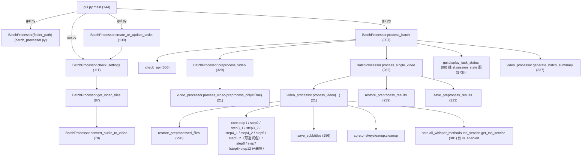
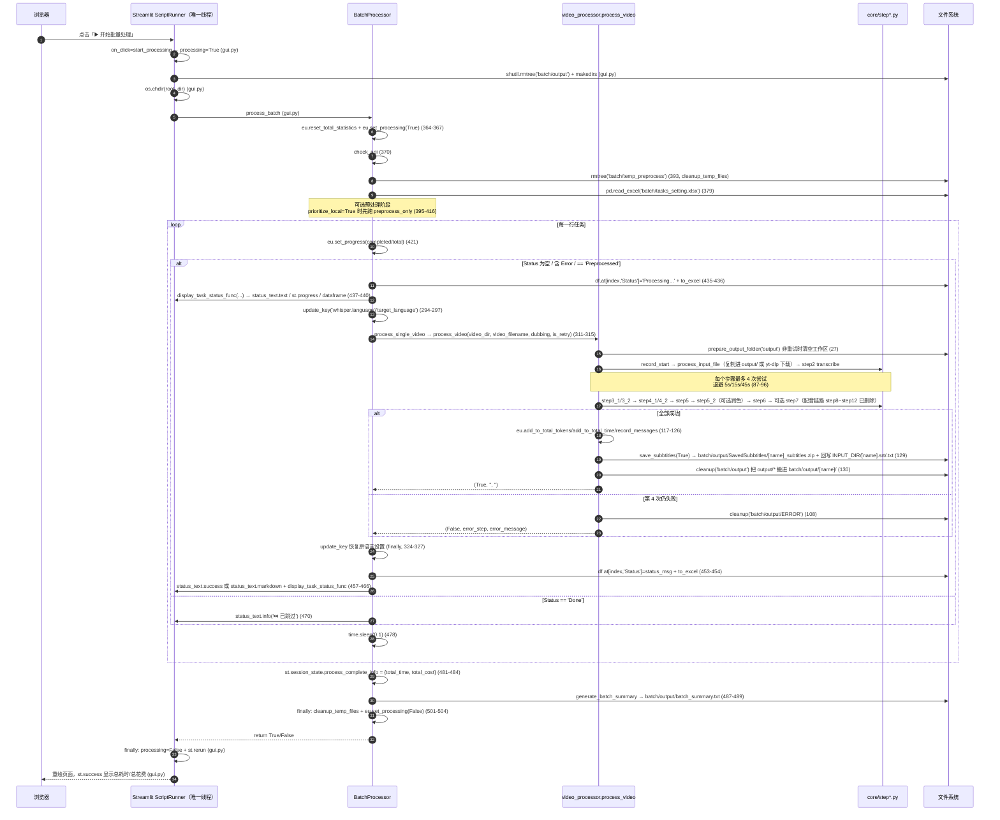

> ## ⚠️ 本文部分内容已在「重构 Round 1」后失效
>
> ⚠️ 本文涉及 `Dubbing` 列与配音步骤的段落已失效（列与步骤均已删除）。另有两处行为已改变：`batch/output/` 上一批产物改为**归档**（`output_archive_<时间戳>`）而非删除；字幕烧录不再因 `prioritize_local` 被跳过。


# 批处理任务系统（batch/utils 四模块 + tasks_setting.xlsx）

批量模式由四个模块构成一条链：`gui.py`（Streamlit 界面）→ `batch_processor.py`（任务表与调度）→ `video_processor.py`（单视频流水线）→ `core/step*.py`（真实处理），外加一个**目前未被调用**的 `tos_manager.py`。任务状态通过 `batch/tasks_setting.xlsx` 的 `Status` 列落盘，每完成一步就整表重写。

---

## 一、职责与边界

- 本系统负责：任务表的生成/读取/写回、输入目录扫描（含音频转 mp4、已翻译跳过）、串行调度、每视频的预处理缓存、失败归档与字幕打包。
- 本系统不负责：任何字幕/语音/视频算法。全部算法在 `core/step*.py`，本系统只按固定顺序调用它们（`video_processor.py`）。
- 本系统不做真并发、不做任务队列持久化、不做失败自动重跑（跨运行重试靠 `Status` 含 `Error` 的人工再点一次）。
- 界面语言与框架：**Streamlit**（`batch/utils/gui.py` 的 `import streamlit as st`；由 `batch/StartBatch.bat` 的 `python -m streamlit run` 启动）。全仓库无 `tkinter` / `PySimpleGUI` / `gradio`，也没有 `logging` 模块使用（日志只走 `rich` 控制台与界面占位符）。

---

## 二、文件清单

| 文件 | 规模 | 主要职责 |
| --- | --- | --- |
| `batch/utils/gui.py` | ~15K | Streamlit 页面：侧边栏（复用单次模式 `page_setting`）、路径选择、处理选项、任务表展示、两个操作按钮、上一批产物归档 |
| `batch/utils/batch_processor.py` | ~21K | `BatchProcessor`：目录扫描（含音频转 mp4）/ 建表 / 预处理缓存 / 时间窗等待 / 主循环 / 状态写回；模块级 `check_api` |
| `batch/utils/video_processor.py` | ~13K | `process_video`：core 字幕步骤的编排 + 4 次退避重试 + 字幕打包 + 归档；`generate_batch_summary` |
| `batch/tasks_setting.xlsx` | — | 任务表（运行时产物，`create_or_update_tasks` 重建） |
| `batch/tasks_setting-template.xlsx` | — | 任务表模板（被 `shutil.copy2` 复制，`batch_processor.py`） |
| `batch/README.zh.md` | ~1K | 用户侧说明：4 个可编辑字段、中断与错误处理 |
| `core/onekeycleanup.py` | ~3K | `cleanup(history_dir)`：`output/*` → 归档目录（批量模式每视频调用）；取名用 `find_media_file` |
| `core/all_whisper_methods/tos_service.py` | ~15K | 火山引擎 TOS 服务（**现在也是唯一的 TOS 实现**：`get_tos_service` 在、`is_enabled` 在、`upload_file` 在、`cleanup_by_name` 在；`batch/utils/tos_manager.py` 已删除） |

---

## 三、调用链与数据流

### 3.1 模块与函数级调用关系



`video_processor.py` 靠 `video_processor.py` 的 `from st_components.imports_and_utils import *` 一次性拿到全部 `step*` 模块名（星号导入的源头是 `st_components/imports_and_utils.py`），因此源码里出现的是 `step2_whisperX.transcribe` 这种「模块名不带 `core.` 前缀」的调用。

### 3.2 与单次模式共享代码的边界（含重复实现清单）

**真复用（同一份实现）**：

| core / 共享模块 | 单次模式调用点 | 批量模式调用点 |
| --- | --- | --- |
| `core/step1_ytdlp.py` `download_video_ytdlp` / `find_video_files` | 下载区块经 `find_media_file` 间接使用（`st_components/download_video_section.py`、`core/step1_ytdlp.py`） | `video_processor.py`（**直接**调用 `download_video_ytdlp` + `find_video_files`） |
| `core/step2_whisperX.py` 的 `transcribe` | `st.py` | `video_processor.py` |
| `core/step3_1_spacy_split.py` `split_by_spacy` | `st.py` | `video_processor.py` |
| `core/step3_2_splitbymeaning.py` `split_sentences_by_meaning` | `st.py` | `video_processor.py` |
| `core/step4_1_summarize.py:get_summary` | `st.py` | `video_processor.py` |
| `core/step4_2_translate_all.py:translate_all` | `st.py` | `video_processor.py` |
| `core/step5_splitforsub.py:split_for_sub_main` | `st.py` | `video_processor.py` |
| `core/step5_2_polish_subs.py:polish_subs_main` | `st.py`（`step_translate_and_burn`） | `video_processor.py`（`process_and_align_subtitles`；开关关着时只打印一行） |
| `core/step6_generate_final_timeline.py:align_timestamp_main` | `st.py` | `video_processor.py` |
| `core/step7_merge_sub_to_vid.py:merge_subtitles_to_video` | `st.py` | `video_processor.py`（有条件：`not preprocess_only and resolution != '0x0'`） |
| `core/onekeycleanup.py:cleanup` | `st.py` | `video_processor.py`、`video_processor.py` |
| `core/config_utils.py` `load_key` / `update_key` | 全项目 | `batch_processor.py`、`video_processor.py` |
| `core/ask_gpt.py:ask_gpt` | 经 `imports_and_utils` | `batch_processor.py`、`batch/utils/gui.py` |
| `easy_util.py` 统计与进度 | `st.py`、各 step | `video_processor.py`、`batch_processor.py`、`batch/utils/gui.py` |
| `st_components/sidebar_setting.py:page_setting` | `st.py` | `batch/utils/gui.py`（**同一套侧边栏**） |
| `st_components/imports_and_utils.py:button_style` | `st.py` | `batch/utils/gui.py` |
| `st_components/imports_and_utils.py:subtitle_zip_name` / `pick_default_subtitle` | `imports_and_utils.py` | `video_processor.py`（经星号导入，命名规则只有一份） |

> ⚠️ 旧版本此表还列有 `core/step8_1…step12`（配音链路）——那些模块与 `st.py`、`video_processor.py` 的调用点都已删除。

**复制粘贴的重实现（技术债）**：

| 重复逻辑 | 批量侧 | 单次侧 | 差异 |
| --- | --- | --- | --- |
| `check_api` | `batch_processor.py`、`batch/utils/gui.py` | `st_components/sidebar_setting.py` | 三份**逐字相同**的实现（同一个 prompt、同一个 `log_title=None`、同一个 `use_cache=False`）；批量侧的 `batch_processor.check_api` 与 `gui.check_api` 也是两份 |
| 字幕打包 | `video_processor.py` `save_subbtitles` | `st_components/imports_and_utils.py` `download_subtitle_zip_button` | **命名与默认字幕选择已共用**（`subtitle_zip_name` / `pick_default_subtitle`）；仍然重复的是「遍历目录 → 组装 entries → 写 zip」流程。批量多一步「写盘 + 回写 `<video_name>.srt/.txt` 到输入目录」（`video_processor.py`），单次走 `st.download_button` |
| ~~默认字幕复制~~ | — | — | 旧版本此处记录 `copy_as_default_subbtitle` 有两份实现，该函数**已不存在**，两份实现合并成了共用的 `pick_default_subtitle`（`imports_and_utils.py`） |
| 计时/token 重置 | `video_processor.py` `record_start` / `record_start_time` / `reset_tokens` | `st.py` `record_start_time` / `reset_tokens`（语义相同） | 批量把它们包装成一个 `record_start` 步骤函数 |
| 流水线编排 | `video_processor.py` 的 `split_sentences` / `summarize_and_translate` / `process_and_align_subtitles` | `st.py` `build_task_steps`（步骤表）+ `st_components/task_runner.py` | 调同一批 step（step3_1→step7）。差异：批量按 `resolution` 与 `preprocess_only` 决定是否调 `step7`（`video_processor.py`），单次在 `st.py` 无条件调用；批量**不看** `pause_before_translate`，单次会据此进入术语确认暂停（`st.py`）；批量不看 `transcription_only`（`video_processor.py` 总会跑 `get_summary`），单次的 `build_task_steps` 会据此少一个步骤（`st.py`） |
| 预处理恢复 | `batch_processor.py` `restore_preprocess_results` | `video_processor.py` `restore_preprocessed_files` | **同一件事两份实现**：前者返回 `bool`（缺文件即 `False`），后者抛异常并额外做「目标文件存在 + 非空」校验（`video_processor.py`）。两处都硬编码了 `'batch/temp_preprocess'` 与三件产物的文件名；必需清单都改为按 ASR 引擎区分（`batch_processor.py`、`video_processor.py`） |
| 文件类型白名单 | `batch_processor.py`、`batch_processor.py` 硬编码扩展名元组 | `core/step1_ytdlp.py` 读 `load_key("allowed_video_formats")` | 配置驱动 vs 硬编码，新增格式要改两处 |
| **音频输入处理** | `batch_processor.py` 的 `convert_audio_to_video`：ffmpeg 包成同目录同名 `.mp4` 并**删除源音频** | `st_components/download_video_section.py`：写 `input_manifest.json`、保留原文件 | ⚠️ 上游 3.0.4 合并只改了单次模式，**批量模式没有迁移到清单机制**，两者行为不同（见 `../01-entrypoints/02-批量模式入口.md` §3.3 的说明） |

### 3.3 完整时序图（GUI → 处理 → core 步骤 → 状态回写）

> ⚠️ 说明：**并不存在独立的「处理线程」**。`process_batch` 直接在 Streamlit ScriptRunner 线程里同步执行（详见 §五.2 与 §七.1），下图的「批处理调用栈」即同一个线程内的普通函数调用。



---

## 四、关键数据结构

### 4.1 任务表 `batch/tasks_setting.xlsx`

列约定、取值、依据来源与不确定性说明见 [`../01-entrypoints/02-批量模式入口.md`](../01-entrypoints/02-批量模式入口.md) §4.1/§4.2（同一份事实，此处不重复）。要点复述：

| 项 | 结论 |
| --- | --- |
| 列名与顺序（代码推断） | `Video File` / `Source Language` / `Target Language` / `Dubbing` / `Status`（依据：`batch_processor.py`、`batch_processor.py` 的 DataFrame 构造；`batch/README.zh.md:31-43` 的用户侧字段表） |
| 取值方式 | 全部**按列名**取值（`row['Status']` 等），无 `iloc[n]`；因此列名可读性优先于顺序 |
| `Status` 状态机 | 空 → `Processing...` → `Done` 或 `Error: <step> - <msg>`；另有 `Preprocessed` / `Preprocess Failed`（仅预处理阶段）；`Skipped` 无写入方 |
| 未确认项 | ⚠️ 需人工确认（依据：代码按列名取值，未解析二进制模板）——`batch/tasks_setting-template.xlsx` 的真实表头是否与上述 5 列一致 |

### 4.2 状态写回机制

- 写回方式：**整表重写**。所有状态变更后都执行 `df.to_excel(self.tasks_setting_path, index=False)`，共 **4 个**写盘点位：
 - `batch_processor.py` —— `create_or_update_tasks` 建表落盘；
 - `batch_processor.py` —— 预处理阶段写完 `Preprocessed` / `Preprocess Failed`；
 - `batch_processor.py` —— 主循环写入 `Processing...`；
 - `batch_processor.py` —— 主循环写入终态（`Done` / `Error: …`）。
 跳过分支与另外三次 UI 刷新（、、）**不写盘**，只更新界面。
- 读回方式：`gui.display_task_status` 每次刷新都重新 `pd.read_excel`（`batch/utils/gui.py`）；`process_batch` 只在开始时读一次（`batch_processor.py`），之后只用内存里的 `df`。
- 文件占用风险：处理期间用 Excel 打开该文件会让 `to_excel` 抛 `PermissionError` → 被 `process_batch` 的外层 `except` 捕获（`batch_processor.py`），本批中断（`batch/README.zh.md:45` 已警告）。
- 外部依赖：`Status` 的值语义同时被 GUI 的进度计算使用（`batch/utils/gui.py` 只把 `Done`/`Skipped` 记为已完成），所以新增状态值必须同时检查 `batch/utils/gui.py` 的 `format_status` 与 `batch/utils/gui.py`。

### 4.3 跨模块传递的返回值

| 生产者 | 结构 | 消费者 |
| --- | --- | --- |
| `video_processor.process_video`（`video_processor.py`） | `Tuple[bool, str, str]` = `(status, error_step, error_message)`；成功为 `(True, '', '')` | `batch_processor.process_single_video`（`batch_processor.py`）、`preprocess_video` |
| `BatchProcessor.process_single_video`（`batch_processor.py`） | `str`：`'Done'` 或 `f"Error: {error_step} - {error_message}"` / `f"Error: Unhandled exception - {e}"` | 直接写入 `Status` 列 |
| `BatchProcessor.preprocess_video`（`batch_processor.py`） | `bool` | `Status` 写 `Preprocessed` / `Preprocess Failed` |
| `BatchProcessor.check_settings`（`batch_processor.py`） | `List[str]`：相对 `self.folder_path` 的视频路径 | `create_or_update_tasks`、GUI 视频列表与计数（`batch/utils/gui.py`）；`process_batch` 调用后**丢弃** |
| `generate_batch_summary`（`video_processor.py`） | `str` 总结文本（同时写 `batch/output/batch_summary.txt`） | `batch_processor.py` 打印 |
| `st.session_state.process_complete_info`（`batch_processor.py`） | `{'total_time': str, 'total_cost': str}` | `gui.display_task_status`（`batch/utils/gui.py`） |

### 4.4 预处理缓存结构

| 项 | 值 |
| --- | --- |
| 目录 | `batch/temp_preprocess/<视频名不含扩展名>/`（`batch_processor.py`；`video_processor.py` 用字面量 `os.path.join('batch','temp_preprocess', video_name)`） |
| 文件 | `raw.mp3`、`for_whisper.mp3`、`cleaned_chunks.xlsx`（`batch_processor.py`、） |
| 对应工作区路径 | `output/audio/raw.mp3`、`output/audio/for_whisper.mp3`、`output/log/cleaned_chunks.xlsx` |
| 生命周期 | `process_batch` 开头整体删除、每视频成功后删该视频子目录、`finally` 整体删除→ **不跨运行保留** |
| 触发条件 | 仅 `prioritize_local=True`（`batch_processor.py`、GUI `batch/utils/gui.py`） |

---

> ### ⚠️ 本文中 `batch/utils/tos_manager.py` 相关内容已失效（Round 2）
>
> 该文件已**删除**，其能力已合并进唯一的 TOS 实现 `core/all_whisper_methods/tos_service.py`：
> `get_tos_service`（单例）、`upload_file(..., prefix=, name_hint=)`（语义化对象键）、
> `cleanup_by_name`、`get_upload_info`。`batch/utils/video_processor.py` 的 TOS 监控现在走 `get_tos_service`。
> 因此本文涉及 `BatchTOSManager` / `tos_manager.py` 的段落（文件清单、调用链、§5.4 整节、扩展点等）请忽略。
> 另：批量预处理缓存清单已按 ASR 引擎区分（volcano 下不再要求 `for_whisper.mp3`）。
## 五、逐函数/逐模块实现说明

### 5.1 `batch/utils/batch_processor.py`（527 行）

模块级：`console = Console`；`status_lock = Lock`（，**定义后从未使用**，全仓库无第二处引用）。

| 签名 | 作用 | 关键实现 | 副作用 | 异常处理 |
| --- | --- | --- | --- | --- |
| `BatchProcessor.__init__(self, folder_path)` | 初始化处理器 | `folder_path` 取 `os.path.abspath`；`root_dir`/`batch_dir` 由 `__file__` 上溯三级；`tasks_setting_path`/`template_path` 指向 `batch/`；初始化 `total_tasks`/`completed_tasks`，重置 `eu.total_time_duration`/`eu.estimated_total_cost`；默认 `process_subdirs=False`、`time_limit_enabled=False`、`start_time='00:30'`、`end_time='08:30'`、`prioritize_local=False`、`preprocessed_files=set` | `os.makedirs(folder_path)`、`os.makedirs(batch_dir)`、`os.makedirs(batch/temp_preprocess)`；改 `easy_util` 全局量 | 无 |
| `convert_audio_to_video(self, input_audio: str, output_video: str)` | 音频转 mp4 | 目标存在则跳过；否则 `ffmpeg -f lavfi -i color=c=black:s=640x360 -i <audio> -shortest -c:v libx264 -c:a aac -pix_fmt yuv420p` | 写 mp4；**成功后 `os.remove(input_audio)` 删除源音频** | 无 try；`subprocess.run(check=True)` 失败会抛 `CalledProcessError`，冒泡到 `get_video_files` 的调用者 |
| `get_video_files(self, directory)` | 扫描目录中的视频/音频 | 视频扩展名硬编码 `('.mp4','.avi','.mov','.mkv','.flv','.wmv','.webm')`；音频硬编码 `('.wav','.mp3','.flac','.m4a')`；**跳过判据**：同目录存在 `<basename>.srt` 则不返回该文件（、）；返回 `os.path.relpath(full_path, self.folder_path)` | 音频会被转换成 `<base>.mp4` 并删除源文件；不改其他状态 | 无 try；单个文件失败会中断整个扫描 |
| `check_settings(self)` | 汇总待处理文件 | 先扫主目录，若 `process_subdirs` 为真再 `os.walk` 其余子目录 | 同 `get_video_files` | `except Exception` → `console.print(Panel('设置检查失败: …'))` 并返回 `[]` |
| `create_or_update_tasks(self)` | 生成/覆盖任务表 | 模板不存在则用 `pd.DataFrame(columns=['Video File','Source Language','Target Language','Dubbing','Status'])` 创建；**删除旧表**→ `shutil.copy2(template, tasks_setting)`→ 读表→ 对每个视频 `pd.concat` 一行（默认取 `whisper.language`、`target_language`、`Dubbing=0`、`Status=None`，）→ `to_excel` | 删除并重建 `batch/tasks_setting.xlsx`（手工编辑内容丢失）；读 `config.yaml` | `except Exception` → 打印错误并 **`raise`**（GUI 侧 `batch/utils/gui.py` 显示 `st.error`） |
| `is_time_in_range(self)` | 判断当前时刻是否在允许的时间窗内 | 未启用直接 `True`；`HH:MM` 解析；处理跨天（`end < start` 时 `end += 1 day`） | 无 | 无；`start_time`/`end_time` 格式非法时抛 `ValueError`（GUI 已做格式校验，`batch/utils/gui.py`） |
| `wait_until_time_in_range(self)` | 阻塞等待进入时间窗 | `while not is_time_in_range: print('Waiting...'); time.sleep(60)` | 阻塞当前线程（会卡住整个 Streamlit 会话） | 无 |
| `get_temp_dir_for_video(self, video_file: str) -> str` | 取/建某视频的临时目录 | 目录名 = `os.path.splitext(os.path.basename(video_file))[0]` | `os.makedirs(temp_dir, exist_ok=True)` | 无 |
| `save_preprocess_results(self, video_file: str) -> None` | 把预处理产物存入临时目录 | 复制 `output/audio/raw.mp3`、`output/audio/for_whisper.mp3`、`output/log/cleaned_chunks.xlsx`（用**相对路径**，要求 cwd=项目根） | 写 `batch/temp_preprocess/<name>/` | 无；源文件不存在时静默跳过（`os.path.exists` 判断） |
| `restore_preprocess_results(self, video_file: str) -> bool` | 从临时目录恢复预处理产物 | 三个文件必须齐全否则 `False`；先 `os.makedirs('output/audio')` 与 `os.makedirs('output/log')`，再 `shutil.copy2` 写回工作区 | 写 `output/` | `except Exception` → 打印红字并返回 `False` |
| `cleanup_temp_files(self, video_file: str = None)` | 删除临时目录 | 传视频名只删该子目录；否则 `shutil.rmtree(self.temp_dir)` + 重建 | 删目录 | `shutil.rmtree` 无 try，权限异常会冒泡 |
| `process_single_video(self, video_file, source_lang, target_lang, dubbing, is_retry=False, skip_preprocess=False)` | 处理一个视频（含语言设置切换） | 时间窗等待→ 保存原语言→ 覆盖 `whisper.language`/`target_language`→ 计算 `video_dir`/`video_filename`→ `skip_preprocess` 时先 `restore_preprocess_results`→ `process_video(...)`→ 成功则 `cleanup_temp_files(video_file)`→ 返回 `'Done'` / `'Error: step - msg'` | 写 `config.yaml`（并在 `finally` 恢复，）；删临时目录；触发整条流水线 | `except Exception` → `f"Error: Unhandled exception - {e}"`；`finally` 一定恢复语言设置 |
| `preprocess_video(self, video_file: str) -> bool` | 只跑本地步骤（预处理） | `process_video(video_dir, video_filename, dubbing=False, is_retry=False, preprocess_only=True)`；成功后 `save_preprocess_results` + `self.preprocessed_files.add(video_file)` | 写 `output/` 与 `batch/temp_preprocess/`；改内存 set | `except Exception` → 红字 + `return False` |
| `process_batch(self)` | 批量主流程 | 见 `../01-entrypoints/02-批量模式入口.md` §3.2 的 11 阶段表；核心循环 `batch_processor.py` | 见 §3.2/§3.3；含 `pd.read_excel`、多次 `to_excel`、`rmtree`、`update_key`、`st.session_state` 读写、`time.sleep(0.1)` per row | 外层 `except Exception` → `console.print` + `status_text.error(...)`（；若异常早于，`status_text` 未定义会再抛 `NameError`）；`finally` 清临时目录 + `eu.set_processing(False)` |
| `check_api`（模块级，） | 用 LLM 往返探测 API | `ask_gpt(..., response_json=True, log_title='None')`，判断 `resp.get('message') == 'success'` | 网络请求 | `except Exception: return False` |
| `output_total_cost`（模块级，） | 打印总耗时与总花费 | `console.print(Panel(...))` | 仅打印 | 无；**全仓库无调用方（死代码）** |
| `__main__` | 命令行入口 | `python batch_processor.py <folder_path>` → `BatchProcessor(folder_path).process_batch` | 同 process_batch | 无参数时打印「未提供视频存储文件夹路径」；⚠️ 该入口不 `os.chdir(root_dir)`，且缺 `st.session_state`，会在 直接 `return False` |

### 5.2 `batch/utils/gui.py`（428 行）

**框架确认**：Streamlit（`import streamlit as st`，`batch/utils/gui.py`），由 `python -m streamlit run batch\utils\gui.py` 启动（`batch/StartBatch.bat`）。无 tkinter、无线程、无自定义 JS。

| 函数 | 作用 | 关键实现 | 副作用/异常 |
| --- | --- | --- | --- |
| `check_api` | 页面级 API 探测 | 与 `batch_processor.check_api` 逐字相同 | 网络请求；异常吞掉返回 `False` |
| `init_session_state` | 初始化 6 个 session 键 | `processing` / `current_progress` / `folder_path` / `process_complete_info` / `current_task_info` / `processor` | 其中 `current_progress`、`current_task_info` 全仓库只写不读 |
| `start_processing` | 按钮 `on_click` | 置 `processing=True`，清完成信息 | 只在回调里跑，先于脚本主体 |
| `reset_processor` | 丢弃 processor 以重建 | `processor=None; processing=False` | 绑到 7 个控件的 `on_change`（`:210/219/238/273/282/296/306`） |
| `display_task_status(tasks_setting_path, status_placeholder, progress_placeholder, table_placeholder)` | 读表并重绘状态区 | `pd.read_excel` → 进度：`eu.is_processing` 时用 `eu.get_progress`，否则按 `Status in ('Done','Skipped')` 计→ `progress_placeholder.columns([1,4])` 里 `st.text('总进度: n%')` + `st.progress`→ `format_status` 中文化→ `table_placeholder.dataframe(styled_df, width="stretch")`→ `process_complete_info` 且 `not processing` 时 `st.success` 展示总耗时/总花费 | 读 xlsx；写占位符；异常 → `st.error(f'读取任务状态失败: …')` |
| `main` | 页面装配 | 见下方控件清单 | 见下方按钮行为 |

**控件清单（`main` 内，按渲染顺序）**：

| 位置 | 控件 | key | 作用/写入的 config 键 |
| --- | --- | --- | --- |
| | `st.set_page_config(page_title="视频批量处理", layout="wide")` | — | 页面配置 |
| | 自定义 CSS（侧边栏最小宽度 450px、表格字号 14px） | — | 纯样式 |
| | `st.markdown(button_style, unsafe_allow_html=True)` | — | 复用单次模式按钮样式 |
| | `st.sidebar` + `st.title("设置")` + `page_setting` | — | **等价于单次模式侧边栏**：`api.key/base_url/model`、一键切换配置、`asr_engine`、`whisper.language`、`target_language`、`demucs`、`transcription_only`、`llm_sentence_split`、`resolution`、`volcano_asr.*`、`tos.*`（TTS 相关键已随配音链路删除）；全部即时 `update_key` 写回 `config.yaml` |
| | `core.config_utils.CONFIG_PATH = CONFIG_PATH` | — | 让配置读写走绝对路径 |
| | `st.title("视频批量处理工具")` | — | 标题 |
| | API 状态提示 | — | `load_key('api.key')` 为空 → `st.warning` 并 `return`；`check_api` 失败 → `st.error` 并 `return`；成功 → `st.success("✅ API状态: 正常")` |
| | `st.radio("选择路径模式", ["使用默认路径","手动输入路径"])` | `path_mode` | `on_change=reset_processor` |
| | `st.checkbox("处理子目录")` | `process_subdirs` | → `processor.process_subdirs` |
| | `st.text_input("默认路径", disabled=True)` | `default_path` | 值 = `<root>/batch/input` |
| | `st.text_input("输入视频文件夹路径")` + `st.caption` + `st.code` 示例 | `custom_path` | → `BatchProcessor(folder_path)` |
| | 路径校验 | — | 空 → `st.warning` + `return`；不存在 → `st.error` + `return` |
| | `st.checkbox("优先进行本地计算")` | `prioritize_local` | → `processor.prioritize_local` |
| | `st.checkbox("启用时间限制")` | `time_limit_enabled` | → `processor.time_limit_enabled` |
| | 两个 `st.text_input`（开始/结束时间，默认 `00:30`/`08:30`） | `start_time` / `end_time` | → `processor.start_time` / `end_time`；格式错误 → `st.error` + `return` |
| | 处理器实例化 | — | `if st.session_state.processor is None:` 才创建，故改选项靠 `reset_processor` 触发重建 |
| （expander `📂 当前文件夹信息`） | `st.info` + `st.metric("📊 视频文件数量")` + `st.button("🗂️ 在资源管理器中打开")` | — | 计数调 `processor.check_settings`（，有音频转换副作用）；按钮用 `os.startfile`（Windows）/ `xdg-open` |
| （expander `🎥 发现以下视频文件`） | `st.text` 逐条列出 | — | 无文件时 `st.warning` 并 `return` |
| （`### 📊 当前任务状态:`） | 3 个 `st.empty` 占位符 + `display_task_status` | — | 存入 `st.session_state.status_text`（`status_placeholder.empty`）/`progress_placeholder`/`table_placeholder`/`display_task_status_func`；仅当 `tasks_setting.xlsx` 已存在才渲染 |
| | `st.button("📝 创建/更新任务配置")` | — | 见下 |
| | `st.button("▶️ 开始批量处理")` | — | 见下 |
| | 自刷新块 | — | `if st.session_state.processing: time.sleep(0.5); st.rerun` |

**按钮行为**：

| 按钮 | 触发条件 | 行为 | 失败处理 |
| --- | --- | --- | --- |
| `📝 创建/更新任务配置` | `disabled=st.session_state.processing` | `with st.spinner` 包住 `processor.create_or_update_tasks` → `st.success("✅ 任务配置已更新!")` → `st.rerun` | `except Exception` → `st.error(f"❌ {e}")` |
| `▶️ 开始批量处理` | `disabled=st.session_state.processing`，`on_click=start_processing` | ① `shutil.rmtree('<root>/batch/output')` + `os.makedirs`② `os.chdir(root_dir)`③ `processor.process_batch`；`finally` 里 `processing=False` + `st.rerun` | `except Exception` → `st.error(f"❌ 处理过程中出现错误: {e}")` |
| `📡`（侧边栏，`st_components/sidebar_setting.py`） | 始终可点 | `st.toast` 提示 API 密钥有效/无效 | `check_api` 内部吞异常 |

**进度与日志展示**：

| 通道 | 实现 | 说明 |
| --- | --- | --- |
| 状态文字 | `batch_processor` 里 `status_text.text/success/markdown/info/warning`（`:403/428/432/458/470` 等） | 指向 `st.session_state.status_text`，即 `batch/utils/gui.py` 建的 `st.empty` 容器 |
| 进度条 + 百分比 | `batch/utils/gui.py`，数据源 `eu.get_progress` | `eu.set_progress(completed/total)`（`batch_processor.py`） |
| 任务表 | `batch/utils/gui.py`，每次刷新重读 xlsx | `format_status` 做中文与 emoji 映射 |
| 完成信息 | `batch/utils/gui.py` | 读 `st.session_state.process_complete_info`（未运行时显示） |
| 控制台日志 | 全部模块用 `rich`：`batch_processor.py`、`video_processor.py`、`batch/utils/gui.py` 的 `Console`；`process_video` 每步打印 `Panel`（`video_processor.py`） | **只有终端，不落盘**（无 logging、无日志文件） |

**线程安全**：无并发，唯一线程原语 `status_lock`（`batch_processor.py`）未被使用。同一时刻只有 Streamlit 的 ScriptRunner 线程会碰 `output/`、`config.yaml`、`tasks_setting.xlsx` 与 `easy_util` 全局量。真正的并发风险来自**被测代码内部的线程池**（`core/step4_2_translate_all.py`、`core/step5_splitforsub.py` 用 `max_workers` 起 `ThreadPoolExecutor`；原 `core/step10_gen_audio.py` 已随配音链路删除），它们只读 `config.yaml`、只写各自的中间产物，属于既有设计。

### 5.3 `batch/utils/video_processor.py`（358 行）

模块级常量：`INPUT_DIR = 'batch/input'`（，运行时被覆盖）、`OUTPUT_DIR = 'output'`、`SAVE_DIR = 'batch/output'`、`ERROR_OUTPUT_DIR = 'batch/output/ERROR'`、`YTB_RESOLUTION_KEY = "ytb_resolution"`。

| 函数 | 作用 | 关键实现 | 副作用 | 异常处理 |
| --- | --- | --- | --- | --- |
| `process_video(video_storage_folder, file, is_retry=False, save_to_video_storage_folder=True, preprocess_only=False, skip_preprocess=False)` | **单视频流水线总入口** | ① `global INPUT_DIR; INPUT_DIR = video_storage_folder`；② 非重试时 `prepare_output_folder('output')` + 重建 `output/audio`、`output/log`；③ 探测 TOS 并打日志；④ `skip_preprocess` 时 `restore_preprocessed_files(file)`；⑤ 组装 `preprocess_steps`、`remaining_steps`，`not preprocess_only and resolution != '0x0'` 时追加 `step7`；⑥ 按 `preprocess_only`/`skip_preprocess` 选步骤表；⑦ 逐步执行 + 重试；⑧ 非预处理时累加统计并 `save_subbtitles` + `cleanup(SAVE_DIR)` | 删/建 `output/`；复制或下载视频；改 `easy_util` 全局量；写 `batch/output/**`；`cleanup` 移动 `output/*` | 每步 `except Exception` 最多 4 次（退避 `5 * 3**(attempt-1)` 秒，）；第 4 次失败 → 打印错误 Panel + `cleanup(ERROR_OUTPUT_DIR)` + `return False, current_step, str(e)`。只捕 `Exception`；`core/step7_merge_sub_to_vid.py` 的缺字幕错误已改为 `FileNotFoundError`（可被重试兜住） |
| `prepare_output_folder(output_folder)` | 清空并重建工作区 | `shutil.rmtree` + `os.makedirs` | **删除 `output/` 全部内容** | 无 |
| `process_input_file(file)` | 输入准备（URL 或本地） | `file.startswith('http')` → `step1_ytdlp.download_video_ytdlp(file, resolution=load_key(YTB_RESOLUTION_KEY), cutoff_time=None)` + `find_video_files`；否则 `shutil.copy(INPUT_DIR/file, 'output'/file)`；两条路径都设 `eu.original_name` | 下载（含 `pip install --upgrade yt-dlp`，`core/step1_ytdlp.py`）；复制文件 | 无 try（由上层统一重试） |
| `copy_input_file(file)` | 仅复制本地输入 | `shutil.copy(INPUT_DIR/file, 'output'/file)` + `eu.original_name` | 复制文件 | 无 |
| `split_sentences` | `step3_1_spacy_split.split_by_spacy` + `step3_2_splitbymeaning.split_sentences_by_meaning` | 顺序调用 | 写 `output/log/*` | 无 |
| `summarize_and_translate` | `step4_1_summarize.get_summary` + `step4_2_translate_all.translate_all` | ⚠️ 不检查 `transcription_only`（与 `st.py` 不一致） | LLM 调用 | 无 |
| `process_and_align_subtitles` | `step5_splitforsub.split_for_sub_main` + `step5_2_polish_subs.polish_subs_main`（2026-09-21 新增，**开关 `subtitle.polish_translation` 默认关**，关着时零 LLM 调用）+ `step6_generate_final_timeline.align_timestamp_main` | 顺序调用 | 写 srt / 累加 `eu.total_time_duration`（`core/step6_generate_final_timeline.py`） | 无 |
| ~~`gen_audio_tasks`~~ | **已删除**：`step8_1_gen_audio_task` / `step8_2_gen_dub_chunks` 随配音链路一起移除 | — | — | — |
| `record_start` | 每个视频第一步 | `record_start_time` + `reset_tokens` | 改 `eu.start_time`、清零 per-video token | 无 |
| `record_start_time` | 记开始时间 | `eu.start_time = time.time` | 改全局量 | 无 |
| `reset_tokens` | 清零 token | `eu.prompt_tokens = eu.completion_tokens = eu.total_tokens = 0` | 改全局量 | 无 |
| `save_subbtitles(save_to_video_storage_folder)` | 字幕打包 + 回写 | 目录 `batch/output/SavedSubbtitles`；**先**用共用的 `pick_default_subtitle` 生成 `output/<video_name>.srt`并把转录文本复制成 `output/<video_name>.txt`；再遍历 `output/*.srt`，用共用的 `subtitle_zip_name` 映射包内名、以 dict 去重；`save_to_video_storage_folder=True` 时把 `<video_name>.srt`/`.txt` 复制到 `INPUT_DIR`；ZIP 落盘为 `<video_name>_subtitles.zip` | 写 `batch/output/SavedSubbtitles/*.zip`、`output/<name>.srt`、`INPUT_DIR/<name>.srt/.txt` | 无 |
| `required_preprocess_files` | 预处理缓存所需文件清单 | 基础 `raw.mp3` + `cleaned_chunks.xlsx`，`asr_engine != 'volcano'` 时插入 `for_whisper.mp3` | 无 | `load_key('asr_engine')` 失败时回退 `'whisper'` |
| `restore_preprocessed_files(file)` | 从 `batch/temp_preprocess/<name>/` 恢复预处理产物 | 目录不存在/缺必需文件 → `raise Exception`；复制后额外校验目标非空 | 写 `output/audio`、`output/log` | **抛异常**（由 `process_video` 的 `try/except` 捕获，） |
| `generate_batch_summary` | 生成批处理总结 | 用 `eu.get_total_tokens_summary`、`eu.convert_seconds(eu.total_time_duration)`、`eu.get_formatted_total_cost` 拼字符串，写 `batch/output/batch_summary.txt` | 写文件 | 无 |

> ⚠️ 旧版本的这两行已删除：`copy_as_default_subbtitle(folder_path, file_name, file_new_name)`（原）在整个仓库中已不存在——默认字幕改由共用的 `pick_default_subtitle`（`st_components/imports_and_utils.py`）选出源文件后 `shutil.copy`；`gen_audio_tasks`（原）随配音链路删除。

**异常隔离结论**：**一个视频失败不会中断整批**。`process_video` 的失败被折叠成 `(False, step, msg)` → `process_single_video` 折叠成字符串 → 主循环写进 `Status` 后继续下一行（`batch_processor.py`）。打断整批的例外只剩两个：① `df.to_excel` 因 Excel 占用文件失败（外层 `except` → 本批终止）；② `SystemExit`/`BaseException` 类异常——注意旧的 `core/step7_merge_sub_to_vid.py` 缺字幕时调 `exit(1)`，现已改为 `raise FileNotFoundError`，因此**不再**穿透重试逻辑；③ ~~需要人工输入的函数（`core/all_tts_functions/gpt_sovits_tts.py` 的 `input`）~~ 该目录已随配音链路删除。

### 5.4 `batch/utils/tos_manager.py`（**已删除**）

> ⚠️ 该文件已不在仓库中（`batch/utils/` 下只有 `gui.py` / `batch_processor.py` / `video_processor.py` 三个模块）。其能力已合并进唯一的 TOS 实现 `core/all_whisper_methods/tos_service.py`（`get_tos_service` 单例、`upload_file`、`cleanup_by_name`、`is_enabled`），`video_processor.py` 的 TOS 状态提示现在走 `get_tos_service`。旧版本本节记录的 `BatchTOSManager` 类、`upload_file_for_batch` / `cleanup_after_video_processed` / `cleanup_all_batch_files` 与「未接线的并行实现」结论一并失效。

替代它的现状（`video_processor.py`）：

```python
from core.all_whisper_methods.tos_service import get_tos_service
tos_service = get_tos_service
if tos_service.is_enabled:
 console.print(f"[cyan]🔧 TOS 已启用（自动清理: {tos_service.auto_cleanup}）: 视频 '{file}' 开始处理[/cyan]")
```

即批量侧仍然只问 `is_enabled` 并打一行日志；真正跑 TOS 上传/删除的是火山 ASR 路径使用的同一个 `TOSService` 实例——实现都在 `core/all_whisper_methods/tos_service.py`（`upload_file` 在、`cleanup_by_name` 在、`is_enabled` 在、单例工厂 `get_tos_service` 在）。

---

## 六、关键参数与配置

### 6.1 与 `config.yaml` 的键路径对应关系

`batch_processor.py` / `gui.py` / `video_processor.py` 直接读写的键：

| 键路径 | 代码位置 | 读/写 |
| --- | --- | --- |
| `whisper.language` | `batch_processor.py`（读）、（读原值）、（写）、（恢复） | 读 + 临时写 |
| `target_language` | `batch_processor.py`、、 | 读 + 临时写 |
| `resolution` | `video_processor.py` | 读 |
| `ytb_resolution` | `video_processor.py` | 读 |
| `api.key` | `batch/utils/gui.py` | 读 |
| `asr_engine` | `batch_processor.py`（`get_required_preprocess_files`）、`video_processor.py` | 读 |
| `tos.enabled` / `tos.auto_cleanup` 等 | `core/all_whisper_methods/tos_service.py`（`is_enabled` 在；经 `get_tos_service`） | 读 |
| 侧边栏可改的全部键 | `batch/utils/gui.py` → `st_components/sidebar_setting.py` | **写**（`update_key` 立即落盘） |

> ⚠️ 批量模式**不读** `input_manifest.json`：它自己的音频处理在 `batch_processor.py` 的 `convert_audio_to_video`（包成黑底 mp4 并删源音频），与单次模式的新路径不同。

### 6.2 `BatchProcessor` 运行参数（与 GUI 控件的对应）

| 属性 | 默认值 | 代码位置 | GUI 来源 |
| --- | --- | --- | --- |
| `folder_path` | 构造参数 | `batch_processor.py` | `path_mode` radio + `custom_path` / 默认 `<root>/batch/input` |
| `process_subdirs` | `False` | | `st.checkbox("处理子目录")` → `batch/utils/gui.py` |
| `time_limit_enabled` | `False` | | `st.checkbox("启用时间限制")` → `batch/utils/gui.py` |
| `start_time` / `end_time` | `"00:30"` / `"08:30"` | | 两个 `st.text_input` → `batch/utils/gui.py` |
| `prioritize_local` | `False` | | `st.checkbox("优先进行本地计算")` → `batch/utils/gui.py` |
| `preprocessed_files` | `set` | | 无（内存态，`preprocess_video` 写入） |
| `temp_dir` | `<root>/batch/temp_preprocess` | | 无 |
| `tasks_setting_path` | `<root>/batch/tasks_setting.xlsx` | | 无 |
| `template_path` | `<root>/batch/tasks_setting-template.xlsx` | | 无 |

### 6.3 计时/统计相关配置（`easy_util.py` 常量）

`price_input_uncached = 1`、`price_input_cached = 0.02`、`price_output = 2`（每百万 token）、`cached_token_rate = 0.3`（`easy_util.py`）——花费估算全部基于这四个硬编码常量，**无 config 键**。批量的三个出口数字分别是：`batch/output/batch_summary.txt`、`st.session_state.process_complete_info`（`batch_processor.py`）、`output/cost.txt`（`easy_util.py`，随后被 `cleanup` 搬进归档）。

---

## 七、技术要点与坑

1. **没有后台线程**：`process_batch` 在 Streamlit ScriptRunner 线程内同步执行（`batch/utils/gui.py`）。`batch_processor.py` 的 `status_lock` 与 `batch_processor.py` 的 `from threading import Lock` 是死代码。进度刷新靠 3 个 `st.empty` 占位符的增量写入，而不是 `st.rerun`；`batch/utils/gui.py` 的自刷新块在处理期间不会被求值。
2. **状态写回是「整表重写」**：每次状态变化都 `df.to_excel(...)`（`batch_processor.py`、），因此 ① 处理中不能用 Excel 打开该文件；② 大量任务时 I/O 开销随行数线性增长。
3. **`is_retry` 依赖 `iterrows` 的副本语义**：取值表达式用 `row['Status']`（`batch_processor.py`），而此时 `Status` 已在 被改写成 `'Processing...'`。实测（pandas 2.2.3）`row` 不反映这次写回，所以语义是「上一次状态含 Error」——符合意图，但是隐式依赖。
4. **~~`tos_manager.py` 是未接线的并行实现~~**：该文件已删除（详见 §5.4）。真正干活的是 `core/all_whisper_methods/tos_service.py` 的 `get_tos_service`（`upload_file` 在、`cleanup_by_name` 在）。
5. **~~预处理缓存在火山 ASR 下必然失效~~**：**已修**——必需文件清单改为按引擎区分（`batch_processor.py` 的 `get_required_preprocess_files`、`video_processor.py` 的 `required_preprocess_files`），`asr_engine == 'volcano'` 时不再要求 `for_whisper.mp3`。仍然成立的是「缓存不跨运行」：`batch/temp_preprocess` 在 `process_batch` 开头与 `finally` 都被整体删除（`batch_processor.py`），且 `self.preprocessed_files`是内存 set。
6. **~~`skip_preprocess=True` 会禁用字幕烧录~~**：**已修**——`video_processor.py` 的条件现在是 `not preprocess_only and load_key("resolution") != "0x0"`，不再含 `skip_preprocess`，因此「优先进行本地计算」时仍会跑 `step7`。
7. **重复代码清单见 §3.2**：`check_api` 三份、字幕打包两份、预处理恢复两份、流水线编排两份、音频转 mp4 两份（与单次模式已分叉）——改任一处都要同步另一处。（旧的 `copy_as_default_subbtitle` 两份已合并为共用的 `pick_default_subtitle`。）
8. **顶层异常处理不再会自己抛 `NameError`**：`batch_processor.py` 已把 `status_text` 预绑定为 `None`，兜底分支 做存在性判断；GUI 侧仍是 `batch/utils/gui.py` 的通用错误。
9. **`Status` 的处理条件是白名单式**：只有 `空 / 含 Error / == 'Preprocessed'` 会被处理（`batch_processor.py`）。任何新增状态值（例如 `Skipped`、`Processing...` 的残留）都会被当成「已完成」永久跳过。
10. **`batch/utils/gui.py` 的 `check_settings` 会在页面渲染时产生真实副作用**：目录里有音频就转 mp4 并删除源音频（`batch_processor.py`）。仅打开页面、什么都没点，也可能改动用户目录。
11. **归档依赖 `output/` 下能识别出素材**：`cleanup` → `find_media_file`（`core/onekeycleanup.py`），先读清单、再回退 `find_video_files`/`find_audio_files`（`core/step1_ytdlp.py`）。**一个都没有**时抛 `FileNotFoundError`（，多个则取最新并告警）；该异常发生在失败处理器内时会掩盖原始错误（`video_processor.py`）。
12. **无日志文件**：既没有 `logging`，也没有把 `rich` 输出重定向到文件；批处理控制台输出只存在于启动它的终端里。
13. **死代码/半成品清单**：`batch_processor.py` 的 `status_lock`、`:515 output_total_cost`、`batch/utils/gui.py` 的 `current_progress`、`batch/utils/gui.py` 的 `current_task_info`、`batch/utils/gui.py/119` 的 `'Skipped'` 分支、`sidebar_setting.py` 的未使用局部变量 `model_list`。（`tos_manager.py` 已整文件删除；`batch/utils/__pycache__/settings_check.cpython-310.pyc` 对应的源文件 `settings_check.py` 也不存在。）

---

## 八、扩展点与已知限制

### 8.1 扩展点

| 目标 | 要动的函数 | 注意事项 |
| --- | --- | --- |
| 新增任务表列（如「只转录」「自定义 TTS 音色」） | `batch_processor.py`（模板列）、（新行）、（读取）、`batch/utils/gui.py`（展示）；并同步 `batch/tasks_setting-template.xlsx` | `create_or_update_tasks` 会删表重建，手工列会丢；新列必须同时出现在模板里，否则 `pd.concat` 产生 NaN 列 |
| 新增一个流水线步骤 | `video_processor.py` 的步骤列表 | 步骤函数必须是**零参可调用**，返回值若不是 `None` 会被 `globals.update(result)` 展开；要拿到重试必须放进这个列表而不是直接调用 |
| 让「优先本地计算」真正复用预处理 | `video_processor.py`、`batch_processor.py`/ | 需要 ① 缓存包含火山路径用的 WAV（`core/all_whisper_methods/whisperX_utils.py`）、② 跨运行保留 `batch/temp_preprocess`、③ 统一两处 `restore_*` 实现 |
| 给火山 ASR 做批量上传/清理 | `video_processor.py`（接线点）、`tos_manager.py`（已删除） | 当前 `BatchTOSManager` 与 `volcano_asr.py` 内建的 `TOSService` 实例会**各持一份** `uploaded_files`/`file_cache`，接线时必须统一为同一实例，否则清理会失效 |
| 并发处理多视频 | `batch_processor.py` 主循环 | 共享状态清单见 `../01-entrypoints/02-批量模式入口.md` §8.2（`output/`、`config.yaml`、`cleanup` 的唯一视频假设、`easy_util` 全局量、单一 UI 占位符） |
| 失败重试与断点续跑 | `video_processor.py`、`batch_processor.py`/ | 页内退避参数硬编码为 `5 * 3**(attempt-1)`、上限 4 次；跨运行靠 `Status` 含 `Error` + `is_retry=True`（不清空 `output/`） |
| 集中日志 | 三个模块的 `Console`（`batch_processor.py`、`video_processor.py`、`batch/utils/gui.py`） | 建议引入 `logging` 或 `rich.FileHandler`，落到 `batch/output/<name>/log/` |

### 8.2 已知限制

| 限制 | 依据 |
| --- | --- |
| 完全串行，无并发（批量级） | `batch_processor.py` 单层 for 循环 |
| 无法取消/暂停正在运行的批次 | 无线程、无 signal 处理；只有 GUI 按钮的 `disabled` 控制 |
| 状态机不接受自定义状态 | `batch_processor.py` 的条件枚举 |
| 归档目录每次运行被清空 | `batch/utils/gui.py` |
| 工作目录 `output/` 与单次模式共享并被删除 | `video_processor.py` |
| 任务表与工作目录都要求「一次一个视频」 | `core/step1_ytdlp.py`（`find_video_files`）、`core/onekeycleanup.py` |
| 统计数字重复计时 / 花费不清零 / 两个总花费不同源 | `core/step6_generate_final_timeline.py`、`easy_util.py`、`batch_processor.py` 与 `video_processor.py` |
| `gpt_sovits` 需要在控制台手动确认，会挂住批次 | `core/all_tts_functions/gpt_sovits_tts.py` 的 `input` |
| ~~字幕烧录在「优先本地计算」下静默失效~~ | **已修**：`video_processor.py` 的条件不再含 `skip_preprocess` |
| ~~无自动化测试~~ | **已修**：仓库现有 `tests/`（12 个文件 / 242 例，标准库 `unittest`），运行 `python -m unittest discover -s tests -v`；其中 `tests/test_batch_paths.py` 就是批量路径的专属用例 |
| ⚠️ 需人工确认（依据：未解析二进制模板） | `batch/tasks_setting-template.xlsx` 的真实表头是否等于 `['Video File','Source Language','Target Language','Status']`（`Dubbing` 列已从代码中移除，见 `batch_processor.py`） |

---

## 九、验证方式

**① 只读地验证函数结构（不跑流水线）**

```powershell
Select-String -Path batch\utils\*.py -Pattern '^\s*(class |def)' |
 Select-Object Path, LineNumber, Line
```

**①b 回归测试（不跑批量流水线）**

```powershell
python -m unittest discover -s tests -v # 242 例；含 tests/test_batch_paths.py
```

**② 验证 `BatchProcessor` 的目录扫描与跳过判据**

```python
import sys, os
sys.path.insert(0, r'E:\VideoLingo\VideoLingoMove\batch\utils')
sys.path.insert(0, r'E:\VideoLingo\VideoLingoMove')
os.chdir(r'E:\VideoLingo\VideoLingoMove')
from batch_processor import BatchProcessor
p = BatchProcessor(r'E:\VideoLingo\VideoLingoMove\batch\input')
print('subdirs :', p.process_subdirs)
print('tasks :', p.tasks_setting_path, os.path.exists(p.tasks_setting_path))
print('temp :', p.temp_dir)
print('files :', p.check_settings) # ⚠️ 目录内若有音频会转 mp4 并删除源音频
```

**③ 验证状态写回（安全的观察方式，不写盘）**

```powershell
Get-Item batch\tasks_setting.xlsx | Select-Object Name, Length, LastWriteTime
```

批处理运行中反复执行该命令，`LastWriteTime` 会在每个状态变更时更新（写回点是 `batch_processor.py`）。

**④ 验证 `tos_manager.py` 已删除、TOS 只有一份实现**

```powershell
Test-Path batch\utils\tos_manager.py # 预期 False
Select-String -Path batch\utils\*.py -Pattern 'get_batch_tos_manager|upload_file_for_batch' # 预期无输出
Select-String -Path batch\utils\video_processor.py -Pattern 'get_tos_service' # 预期命中 :35
```

**⑤ 验证批量模式没有用输入清单（与单次模式的差异）**

```powershell
Select-String -Path batch\utils\*.py -Pattern 'input_manifest|find_media_file|write_input_manifest' # 预期无输出
Select-String -Path batch\utils\*.py -Pattern 'convert_audio_to_video|prepare_output_folder' # 预期命中原生实现
Select-String -Path batch\utils\video_processor.py -Pattern 'find_video_files' # 预期命中 :142
```

**⑥ 端到端（会真正跑流水线，仅在确有必要时执行）**

双击 `batch/StartBatch.bat`（或 `python -m streamlit run batch\utils\gui.py`）→ 选输入目录 → 「📝 创建/更新任务配置」→ 检查任务表 → 「▶️ 开始批量处理」。跑完后核对：`batch/output/<name>/`、`batch/output/SavedSubbtitles/<name>_subtitles.zip`、`batch/output/batch_summary.txt`、`batch/tasks_setting.xlsx` 的 `Status` 列、`<输入目录>/<name>.srt`。

---

## 十、相关文档

- [`../01-entrypoints/02-批量模式入口.md`](../01-entrypoints/02-批量模式入口.md) —— 启动链路、生命周期、目录切换机制、任务表列约定
- [`../00-overview/02-数据流与中间产物.md`](../00-overview/02-数据流与中间产物.md) —— 被批量模式复用的 `output/` 产物契约
- [`../00-overview/01-项目总览与架构.md`](../00-overview/01-项目总览与架构.md) —— 进程模型与模块依赖
- [`01-配置文件与参数.md`](01-配置文件与参数.md) —— `config.yaml` 全量键说明
- [`02-Streamlit界面组件.md`](02-Streamlit界面组件.md) —— 单次模式界面与 `page_setting`（批量模式复用同一套侧边栏）
- [`../05-guides/04-已知问题与技术债.md`](../05-guides/04-已知问题与技术债.md) —— 全项目技术债汇总
- ../05-guides/上游合并记录 —— 本次合并改了什么（批量模式**未**迁移到 `input_manifest`，见该文 §七）
- [`../README.md`](../README.md) —— devdocs 总入口

> 注：本文的 `路径.py:行号` 引用已按当前代码更正；§3.1 调用图、§3.3 时序图与 §5 各表里的 `batch_processor.py` / `batch/utils/gui.py` / `video_processor.py` 内部行号已按「重构 Round 1」后的源码逐条重排。
