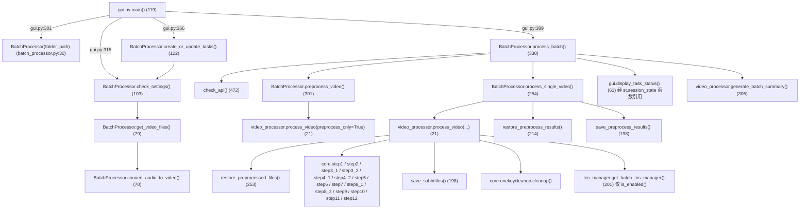
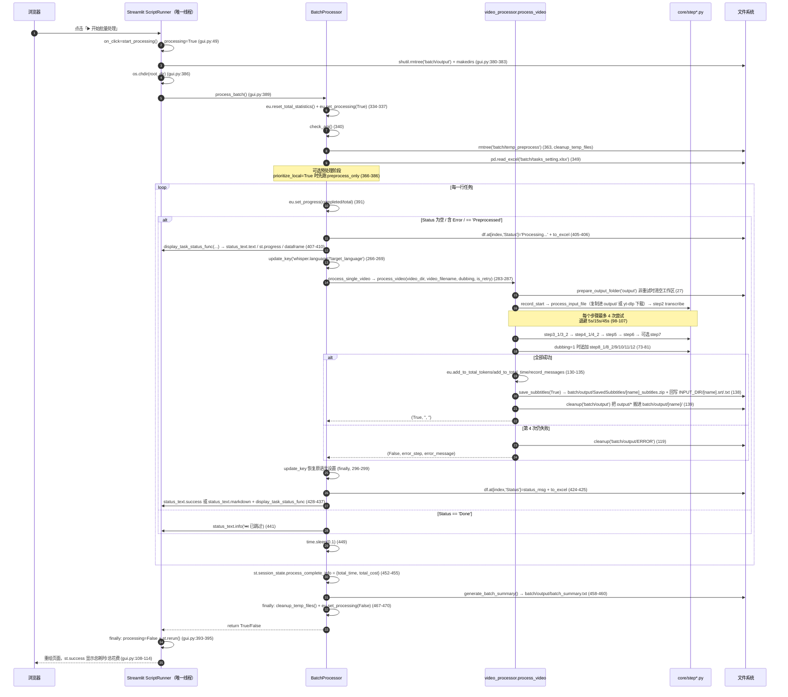

> ## ⚠️ 本文部分内容已在「重构 Round 1」后失效
>
> ⚠️ 本文涉及 `Dubbing` 列与配音步骤的段落已失效（列与步骤均已删除）。另有两处行为已改变：`batch/output/` 上一批产物改为**归档**（`output_archive_<时间戳>`）而非删除；字幕烧录不再因 `prioritize_local` 被跳过。


# 批处理任务系统（batch/utils 四模块 + tasks_setting.xlsx）

批量模式由四个模块构成一条链：`gui.py`（Streamlit 界面）→ `batch_processor.py`（任务表与调度）→ `video_processor.py`（单视频流水线）→ `core/step*.py`（真实处理），外加一个**目前未被调用**的 `tos_manager.py`。任务状态通过 `batch/tasks_setting.xlsx` 的 `Status` 列落盘，每完成一步就整表重写。

---

## 一、职责与边界

- 本系统负责：任务表的生成/读取/写回、输入目录扫描（含音频转 mp4、已翻译跳过）、串行调度、每视频的预处理缓存、失败归档与字幕打包。
- 本系统不负责：任何字幕/语音/视频算法。全部算法在 `core/step*.py`，本系统只按固定顺序调用它们（`video_processor.py:51-93`）。
- 本系统不做真并发、不做任务队列持久化、不做失败自动重跑（跨运行重试靠 `Status` 含 `Error` 的人工再点一次）。
- 界面语言与框架：**Streamlit**（`batch/utils/gui.py:3 import streamlit as st`；由 `batch/StartBatch.bat:4` 的 `python -m streamlit run` 启动）。全仓库无 `tkinter` / `PySimpleGUI` / `gradio`，也没有 `logging` 模块使用（日志只走 `rich` 控制台与界面占位符）。

---

## 二、文件清单

| 文件 | 行数 | 主要职责 |
| --- | --- | --- |
| `batch/utils/gui.py` | 403 | Streamlit 页面：侧边栏（复用单次模式 `page_setting()`）、路径选择、处理选项、任务表展示、两个操作按钮 |
| `batch/utils/batch_processor.py` | 493 | `BatchProcessor`：目录扫描 / 建表 / 预处理缓存 / 时间窗等待 / 主循环 / 状态写回；模块级 `check_api()` |
| `batch/utils/video_processor.py` | 326 | `process_video()`：16 个 core 步骤的编排 + 4 次退避重试 + 字幕打包 + 归档；`generate_batch_summary()` |
| `batch/utils/tos_manager.py` | 217 | `BatchTOSManager` 单例：TOS 上传跟踪与批量清理（**当前无调用方**，见 §五.4 与 §七.4） |
| `batch/tasks_setting.xlsx` | — | 任务表（运行时产物，`create_or_update_tasks` 重建） |
| `batch/tasks_setting-template.xlsx` | — | 任务表模板（被 `shutil.copy2` 复制，`batch_processor.py:135`） |
| `batch/README.zh.md` | 60 | 用户侧说明：4 个可编辑字段、中断与错误处理 |
| `core/onekeycleanup.py` | 81 | `cleanup(history_dir)`：`output/*` → 归档目录（批量模式每视频调用） |
| `core/all_whisper_methods/tos_service.py` | 362 | 火山引擎 TOS 服务（真正被 ASR 调用的那一份） |

---

## 三、调用链与数据流

### 3.1 模块与函数级调用关系



`video_processor.py` 靠 `video_processor.py:3` 的 `from st_components.imports_and_utils import *` 一次性拿到全部 `step*` 模块名（星号导入的源头是 `st_components/imports_and_utils.py:3-36`），因此源码里出现的是 `step2_whisperX.transcribe()` 这种「模块名不带 `core.` 前缀」的调用。

### 3.2 与单次模式共享代码的边界（含重复实现清单）

**真复用（同一份实现）**：

| core / 共享模块 | 单次模式调用点 | 批量模式调用点 |
| --- | --- | --- |
| `core/step1_ytdlp.py` `download_video_ytdlp` / `find_video_files` | `st.py:4` 星号导入 + `st_components/download_video_section.py` | `video_processor.py:150-151` |
| `core/step2_whisperX.py:332 transcribe()` | `st.py:83` | `video_processor.py:54` |
| `core/step3_1_spacy_split.py` `split_by_spacy()` | `st.py:85` | `video_processor.py:171` |
| `core/step3_2_splitbymeaning.py` `split_sentences_by_meaning()` | `st.py:86` | `video_processor.py:172` |
| `core/step4_1_summarize.py:get_summary()` | `st.py:107` | `video_processor.py:175` |
| `core/step4_2_translate_all.py:translate_all()` | `st.py:110` | `video_processor.py:176` |
| `core/step5_splitforsub.py:split_for_sub_main()` | `st.py:113` | `video_processor.py:179` |
| `core/step6_generate_final_timeline.py:align_timestamp_main()` | `st.py:114` | `video_processor.py:180` |
| `core/step7_merge_sub_to_vid.py:merge_subtitles_to_video()` | `st.py:116` | `video_processor.py:69`（有条件） |
| `core/step8_1/8_2/9/10/11/12` | `st.py:150-159` | `video_processor.py:75-79` |
| `core/onekeycleanup.py:cleanup()` | `st.py:66`、`st.py:145` | `video_processor.py:119`、`video_processor.py:139` |
| `core/config_utils.py` `load_key` / `update_key` | 全项目 | `batch_processor.py:21`、`video_processor.py:5` |
| `core/ask_gpt.py:ask_gpt()` | 经 `imports_and_utils` | `batch_processor.py:22`、`gui.py:17` |
| `easy_util.py` 统计与进度 | `st.py:3`、各 step | `video_processor.py:10`、`batch_processor.py:24`、`gui.py:19` |
| `st_components/sidebar_setting.py:page_setting()` | `st.py:173` | `gui.py:154`（**同一套侧边栏**） |
| `st_components/imports_and_utils.py:button_style` | `st.py:169` | `gui.py:140` |

**复制粘贴的重实现（技术债）**：

| 重复逻辑 | 批量侧 | 单次侧 | 差异 |
| --- | --- | --- | --- |
| `check_api()` | `batch_processor.py:472-479`、`gui.py:26-33` | `st_components/sidebar_setting.py:13-20` | 三份**逐字相同**的实现（同一个 prompt、同一个 `log_title='None'`）；批量侧的 `batch_processor.check_api()` 与 `gui.check_api()` 也是两份 |
| 字幕打包 | `video_processor.py:198-244` `save_subbtitles()` | `st_components/imports_and_utils.py:44-85` `download_subtitle_zip_button()` | ZIP 命名规则、`src_trans`/`trans_src`/`src`/`trans` 分支判断完全同源；批量多了「写盘 + 回写 `<video_name>.srt/.txt` 到输入目录 + 把 txt 复制进 `output/`」（`video_processor.py:233-240`），单次走 `st.download_button`（`:80-85`） |
| 默认字幕复制 | `video_processor.py:246-251` `copy_as_default_subbtitle()` | `imports_and_utils.py:87-92` `copy_as_default_subbtitle()` | 逐字相同 |
| 计时/token 重置 | `video_processor.py:186-196` `record_start()` / `record_start_time()` / `reset_tokens()` | `st.py:70-79` `record_start_time()` / `reset_tokens()`（语义相同） | 批量把它们包装成一个 `record_start()` 步骤函数 |
| 流水线编排 | `video_processor.py:170-184` 的 `split_sentences` / `summarize_and_translate` / `process_and_align_subtitles` / `gen_audio_tasks` | `st.py:81-116` `process_text()`、`st.py:148-159` `process_audio()` | 调同一批 step；差异：批量按 `resolution` 与 `skip_preprocess` 决定是否调 `step7`（`video_processor.py:65-71`），单次无条件调用（`st.py:116`）；批量不看 `pause_before_translate`，单次会 `input()` 暂停（`st.py:108-109`）；批量不看 `transcription_only` 而单次会短路 `get_summary()`（`st.py:88-104`） |
| 预处理恢复 | `batch_processor.py:214-239` `restore_preprocess_results()` | `video_processor.py:253-302` `restore_preprocessed_files()` | **同一件事两份实现**：前者返回 `bool`（缺文件即 `False`），后者抛异常并额外做「目标文件存在 + 非空」校验（`video_processor.py:291-299`）。两处都硬编码了 `'batch/temp_preprocess'` 与三件产物的文件名 |
| 文件类型白名单 | `batch_processor.py:84`、`batch_processor.py:90` 硬编码扩展名元组 | `core/step1_ytdlp.py:82` 读 `load_key("allowed_video_formats")` | 配置驱动 vs 硬编码，新增格式要改两处 |

### 3.3 完整时序图（GUI → 处理 → core 步骤 → 状态回写）

> ⚠️ 说明：**并不存在独立的「处理线程」**。`process_batch()` 直接在 Streamlit ScriptRunner 线程里同步执行（详见 §五.2 与 §七.1），下图的「批处理调用栈」即同一个线程内的普通函数调用。



---

## 四、关键数据结构

### 4.1 任务表 `batch/tasks_setting.xlsx`

列约定、取值、依据来源与不确定性说明见 [`../01-entrypoints/02-批量模式入口.md`](../01-entrypoints/02-批量模式入口.md) §4.1/§4.2（同一份事实，此处不重复）。要点复述：

| 项 | 结论 |
| --- | --- |
| 列名与顺序（代码推断） | `Video File` / `Source Language` / `Target Language` / `Dubbing` / `Status`（依据：`batch_processor.py:127`、`batch_processor.py:147-153` 的 DataFrame 构造；`batch/README.zh.md:31-43` 的用户侧字段表） |
| 取值方式 | 全部**按列名**取值（`row['Status']` 等），无 `iloc[n]`；因此列名可读性优先于顺序 |
| `Status` 状态机 | 空 → `Processing...` → `Done` 或 `Error: <step> - <msg>`；另有 `Preprocessed` / `Preprocess Failed`（仅预处理阶段）；`Skipped` 无写入方 |
| 未确认项 | ⚠️ 需人工确认（依据：代码按列名取值，未解析二进制模板）——`batch/tasks_setting-template.xlsx` 的真实表头是否与上述 5 列一致 |

### 4.2 状态写回机制

- 写回方式：**整表重写**。所有状态变更后都执行 `df.to_excel(self.tasks_setting_path, index=False)`，共 **4 个**写盘点位：
  - `batch_processor.py:157` —— `create_or_update_tasks` 建表落盘；
  - `batch_processor.py:382` —— 预处理阶段写完 `Preprocessed` / `Preprocess Failed`；
  - `batch_processor.py:406` —— 主循环写入 `Processing...`；
  - `batch_processor.py:425` —— 主循环写入终态（`Done` / `Error: …`）。
  跳过分支（`:439-447`）与另外三次 UI 刷新（`:407-410`、`:434-437`、`:444-447`）**不写盘**，只更新界面。
- 读回方式：`gui.display_task_status()` 每次刷新都重新 `pd.read_excel`（`gui.py:64`）；`process_batch` 只在开始时读一次（`batch_processor.py:349`），之后只用内存里的 `df`。
- 文件占用风险：处理期间用 Excel 打开该文件会让 `to_excel` 抛 `PermissionError` → 被 `process_batch` 的外层 `except` 捕获（`batch_processor.py:463-466`），本批中断（`batch/README.zh.md:45` 已警告）。
- 外部依赖：`Status` 的值语义同时被 GUI 的进度计算使用（`gui.py:71` 只把 `Done`/`Skipped` 记为已完成），所以新增状态值必须同时检查 `gui.py:85-98` 的 `format_status` 与 `gui.py:71`。

### 4.3 跨模块传递的返回值

| 生产者 | 结构 | 消费者 |
| --- | --- | --- |
| `video_processor.process_video()`（`video_processor.py:120`、`:141`） | `Tuple[bool, str, str]` = `(status, error_step, error_message)`；成功为 `(True, '', '')` | `batch_processor.process_single_video`（`batch_processor.py:283`）、`preprocess_video`（`:310`） |
| `BatchProcessor.process_single_video()`（`batch_processor.py:293`） | `str`：`'Done'` 或 `f"Error: {error_step} - {error_message}"` / `f"Error: Unhandled exception - {e}"` | 直接写入 `Status` 列（`:424`） |
| `BatchProcessor.preprocess_video()`（`batch_processor.py:301`） | `bool` | `Status` 写 `Preprocessed` / `Preprocess Failed`（`:377-379`） |
| `BatchProcessor.check_settings()`（`batch_processor.py:103`） | `List[str]`：相对 `self.folder_path` 的视频路径 | `create_or_update_tasks`（`:141`）、GUI 视频列表与计数（`gui.py:315-332`）；`process_batch` 调用后**丢弃**（`:346`） |
| `generate_batch_summary()`（`video_processor.py:305`） | `str` 总结文本（同时写 `batch/output/batch_summary.txt`） | `batch_processor.py:459-460` 打印 |
| `st.session_state.process_complete_info`（`batch_processor.py:452-455`） | `{'total_time': str, 'total_cost': str}` | `gui.display_task_status`（`gui.py:108-114`） |

### 4.4 预处理缓存结构

| 项 | 值 |
| --- | --- |
| 目录 | `batch/temp_preprocess/<视频名不含扩展名>/`（`batch_processor.py:190-196`；`video_processor.py:256-257` 用字面量 `os.path.join('batch','temp_preprocess', video_name)`） |
| 文件 | `raw.mp3`、`for_whisper.mp3`、`cleaned_chunks.xlsx`（`batch_processor.py:203-207`、`:219`） |
| 对应工作区路径 | `output/audio/raw.mp3`、`output/audio/for_whisper.mp3`、`output/log/cleaned_chunks.xlsx` |
| 生命周期 | `process_batch` 开头整体删除（`:363`）、每视频成功后删该视频子目录（`:291`）、`finally` 整体删除（`:469`）→ **不跨运行保留** |
| 触发条件 | 仅 `prioritize_local=True`（`batch_processor.py:61`、GUI `gui.py:244-249`） |

---

> ### ⚠️ 本文中 atch/utils/tos_manager.py 相关内容已失效（Round 2）
>
> 该文件已**删除**，其能力已合并进唯一的 TOS 实现 core/all_whisper_methods/tos_service.py：
> get_tos_service()（单例）、upload_file(..., prefix=, name_hint=)（语义化对象键）、
> cleanup_by_name()、get_upload_info()。ideo_processor 的 TOS 监控现在走 get_tos_service()。
> 因此本文涉及 BatchTOSManager / 	os_manager.py 的段落（文件清单、调用链、§5.4 整节、扩展点等）请忽略。
> 另：批量预处理缓存清单已按 ASR 引擎区分（volcano 下不再要求 `for_whisper.mp3`）。
## 五、逐函数/逐模块实现说明

### 5.1 `batch/utils/batch_processor.py`（493 行）

模块级：`console = Console()`（`:26`）；`status_lock = Lock()`（`:27`，**定义后从未使用**，全仓库无第二处引用）。

| 签名 | 作用 | 关键实现 | 副作用 | 异常处理 |
| --- | --- | --- | --- | --- |
| `BatchProcessor.__init__(self, folder_path)`（`:30-68`） | 初始化处理器 | `folder_path` 取 `os.path.abspath`；`root_dir`/`batch_dir` 由 `__file__` 上溯三级；`tasks_setting_path`/`template_path` 指向 `batch/`；初始化 `total_tasks`/`completed_tasks`，重置 `eu.total_time_duration`/`eu.estimated_total_cost`；默认 `process_subdirs=False`、`time_limit_enabled=False`、`start_time='00:30'`、`end_time='08:30'`、`prioritize_local=False`、`preprocessed_files=set()` | `os.makedirs(folder_path)`、`os.makedirs(batch_dir)`、`os.makedirs(batch/temp_preprocess)`；改 `easy_util` 全局量 | 无 |
| `convert_audio_to_video(self, input_audio: str, output_video: str)`（`:70-77`） | 音频转 mp4 | 目标存在则跳过；否则 `ffmpeg -f lavfi -i color=c=black:s=640x360 -i <audio> -shortest -c:v libx264 -c:a aac -pix_fmt yuv420p` | 写 mp4；**成功后 `os.remove(input_audio)` 删除源音频** | 无 try；`subprocess.run(check=True)` 失败会抛 `CalledProcessError`，冒泡到 `get_video_files` 的调用者 |
| `get_video_files(self, directory)`（`:79-101`） | 扫描目录中的视频/音频 | 视频扩展名硬编码 `('.mp4','.avi','.mov','.mkv','.flv','.wmv','.webm')`（`:84`）；音频硬编码 `('.wav','.mp3','.flac','.m4a')`（`:90`）；**跳过判据**：同目录存在 `<basename>.srt` 则不返回该文件（`:85-86`、`:92-93`）；返回 `os.path.relpath(full_path, self.folder_path)` | 音频会被转换成 `<base>.mp4` 并删除源文件（`:97`）；不改其他状态 | 无 try；单个文件失败会中断整个扫描 |
| `check_settings(self)`（`:103-120`） | 汇总待处理文件 | 先扫主目录，若 `process_subdirs` 为真再 `os.walk` 其余子目录（`:112-115`） | 同 `get_video_files` | `except Exception` → `console.print(Panel('设置检查失败: …'))` 并返回 `[]` |
| `create_or_update_tasks(self)`（`:122-162`） | 生成/覆盖任务表 | 模板不存在则用 `pd.DataFrame(columns=['Video File','Source Language','Target Language','Dubbing','Status'])` 创建（`:126-128`）；**删除旧表**（`:131-132`）→ `shutil.copy2(template, tasks_setting)`（`:135`）→ 读表（`:138`）→ 对每个视频 `pd.concat` 一行（默认取 `whisper.language`、`target_language`、`Dubbing=0`、`Status=None`，`:145-153`）→ `to_excel` | 删除并重建 `batch/tasks_setting.xlsx`（手工编辑内容丢失）；读 `config.yaml` | `except Exception` → 打印错误并 **`raise`**（GUI 侧 `gui.py:370-371` 显示 `st.error`） |
| `is_time_in_range(self)`（`:164-182`） | 判断当前时刻是否在允许的时间窗内 | 未启用直接 `True`；`HH:MM` 解析；处理跨天（`end < start` 时 `end += 1 day`） | 无 | 无；`start_time`/`end_time` 格式非法时抛 `ValueError`（GUI 已做格式校验，`gui.py:285-293`） |
| `wait_until_time_in_range(self)`（`:184-188`） | 阻塞等待进入时间窗 | `while not is_time_in_range(): print('Waiting...'); time.sleep(60)` | 阻塞当前线程（会卡住整个 Streamlit 会话） | 无 |
| `get_temp_dir_for_video(self, video_file: str) -> str`（`:190-196`） | 取/建某视频的临时目录 | 目录名 = `os.path.splitext(os.path.basename(video_file))[0]` | `os.makedirs(temp_dir, exist_ok=True)` | 无 |
| `save_preprocess_results(self, video_file: str) -> None`（`:198-212`） | 把预处理产物存入临时目录 | 复制 `output/audio/raw.mp3`、`output/audio/for_whisper.mp3`、`output/log/cleaned_chunks.xlsx`（用**相对路径**，要求 cwd=项目根） | 写 `batch/temp_preprocess/<name>/` | 无；源文件不存在时静默跳过（`os.path.exists` 判断） |
| `restore_preprocess_results(self, video_file: str) -> bool`（`:214-239`） | 从临时目录恢复预处理产物 | 三个文件必须齐全否则 `False`（`:219-221`）；先 `os.makedirs('output/audio')` 与 `os.makedirs('output/log')`，再 `shutil.copy2` 写回工作区 | 写 `output/` | `except Exception` → 打印红字并返回 `False` |
| `cleanup_temp_files(self, video_file: str = None)`（`:241-252`） | 删除临时目录 | 传视频名只删该子目录；否则 `shutil.rmtree(self.temp_dir)` + 重建 | 删目录 | `shutil.rmtree` 无 try，权限异常会冒泡 |
| `process_single_video(self, video_file, source_lang, target_lang, dubbing, is_retry=False, skip_preprocess=False)`（`:254-299`） | 处理一个视频（含语言设置切换） | 时间窗等待（`:256-258`）→ 保存原语言（`:261-262`）→ 覆盖 `whisper.language`/`target_language`（`:266-269`）→ 计算 `video_dir`/`video_filename`（`:272-274`）→ `skip_preprocess` 时先 `restore_preprocess_results`（`:277-280`）→ `process_video(...)`（`:283-287`）→ 成功则 `cleanup_temp_files(video_file)`（`:290-291`）→ 返回 `'Done'` / `'Error: step - msg'`（`:293`） | 写 `config.yaml`（并在 `finally` 恢复，`:296-299`）；删临时目录；触发整条流水线 | `except Exception` → `f"Error: Unhandled exception - {e}"`（`:294-295`）；`finally` 一定恢复语言设置 |
| `preprocess_video(self, video_file: str) -> bool`（`:301-328`） | 只跑本地步骤（预处理） | `process_video(video_dir, video_filename, dubbing=False, is_retry=False, preprocess_only=True)`（`:310-316`）；成功后 `save_preprocess_results` + `self.preprocessed_files.add(video_file)`（`:320-321`） | 写 `output/` 与 `batch/temp_preprocess/`；改内存 set | `except Exception` → 红字 + `return False` |
| `process_batch(self)`（`:330-470`） | 批量主流程 | 见 `../01-entrypoints/02-批量模式入口.md` §3.2 的 11 阶段表；核心循环 `batch_processor.py:389-449` | 见 §3.2/§3.3；含 `pd.read_excel`、多次 `to_excel`、`rmtree`、`update_key`、`st.session_state` 读写、`time.sleep(0.1)` per row | 外层 `except Exception` → `console.print` + `status_text.error(...)`（`:463-466`；若异常早于 `:354`，`status_text` 未定义会再抛 `NameError`）；`finally` 清临时目录 + `eu.set_processing(False)` |
| `check_api()`（模块级，`:472-479`） | 用 LLM 往返探测 API | `ask_gpt(..., response_json=True, log_title='None')`，判断 `resp.get('message') == 'success'` | 网络请求 | `except Exception: return False` |
| `output_total_cost()`（模块级，`:481-485`） | 打印总耗时与总花费 | `console.print(Panel(...))` | 仅打印 | 无；**全仓库无调用方（死代码）** |
| `__main__`（`:487-493`） | 命令行入口 | `python batch_processor.py <folder_path>` → `BatchProcessor(folder_path).process_batch()` | 同 process_batch | 无参数时打印「未提供视频存储文件夹路径」；⚠️ 该入口不 `os.chdir(root_dir)`，且缺 `st.session_state`，会在 `:359-360` 直接 `return False` |

### 5.2 `batch/utils/gui.py`（403 行）

**框架确认**：Streamlit（`import streamlit as st`，`gui.py:3`），由 `python -m streamlit run batch\utils\gui.py` 启动（`batch/StartBatch.bat:4`）。无 tkinter、无线程、无自定义 JS。

| 函数 | 作用 | 关键实现 | 副作用/异常 |
| --- | --- | --- | --- |
| `check_api()`（`:26-33`） | 页面级 API 探测 | 与 `batch_processor.check_api()` 逐字相同 | 网络请求；异常吞掉返回 `False` |
| `init_session_state()`（`:35-47`） | 初始化 6 个 session 键 | `processing` / `current_progress` / `folder_path` / `process_complete_info` / `current_task_info` / `processor` | 其中 `current_progress`、`current_task_info` 全仓库只写不读 |
| `start_processing()`（`:49-52`） | 按钮 `on_click` | 置 `processing=True`，清完成信息 | 只在回调里跑，先于脚本主体 |
| `reset_processor()`（`:54-59`） | 丢弃 processor 以重建 | `processor=None; processing=False` | 绑到 7 个控件的 `on_change`（`:185/194/213/248/257/271/281`） |
| `display_task_status(tasks_setting_path, status_placeholder, progress_placeholder, table_placeholder)`（`:61-117`） | 读表并重绘状态区 | `pd.read_excel` → 进度：`eu.is_processing()` 时用 `eu.get_progress()`，否则按 `Status in ('Done','Skipped')` 计（`:68-73`）→ `progress_placeholder.columns([1,4])` 里 `st.text('总进度: n%')` + `st.progress`（`:76-80`）→ `format_status` 中文化（`:85-98`）→ `table_placeholder.dataframe(styled_df, use_container_width=True)`（`:105`）→ `process_complete_info` 且 `not processing` 时 `st.success` 展示总耗时/总花费（`:108-114`） | 读 xlsx；写占位符；异常 → `st.error(f'读取任务状态失败: …')`（`:116-117`） |
| `main()`（`:119-400`） | 页面装配 | 见下方控件清单 | 见下方按钮行为 |

**控件清单（`main()` 内，按渲染顺序）**：

| 位置 | 控件 | key | 作用/写入的 config 键 |
| --- | --- | --- | --- |
| `:120` | `st.set_page_config(page_title="视频批量处理", layout="wide")` | — | 页面配置 |
| `:123-138` | 自定义 CSS（侧边栏最小宽度 450px、表格字号 14px） | — | 纯样式 |
| `:140` | `st.markdown(button_style, unsafe_allow_html=True)` | — | 复用单次模式按钮样式 |
| `:145-157` | `st.sidebar` + `st.title("设置")` + `page_setting()` | — | **等价于单次模式侧边栏**：`api.key/base_url/model`、一键切换配置、`asr_engine`、`whisper.language`、`target_language`、`demucs`、`transcription_only`、`resolution`、`volcano_asr.*`、`tos.*`、`tts_method` 及各 TTS 子键；全部即时 `update_key` 写回 `config.yaml` |
| `:150` | `core.config_utils.CONFIG_PATH = CONFIG_PATH` | — | 让配置读写走绝对路径 |
| `:159` | `st.title("视频批量处理工具")` | — | 标题 |
| `:162-172` | API 状态提示 | — | `load_key('api.key')` 为空 → `st.warning` 并 `return`；`check_api()` 失败 → `st.error` 并 `return`；成功 → `st.success("✅ API状态: 正常")` |
| `:180-186` | `st.radio("选择路径模式", ["使用默认路径","手动输入路径"])` | `path_mode` | `on_change=reset_processor` |
| `:190-195` | `st.checkbox("处理子目录")` | `process_subdirs` | → `processor.process_subdirs`（`:302`） |
| `:199-204` | `st.text_input("默认路径", disabled=True)` | `default_path` | 值 = `<root>/batch/input`（`:198`） |
| `:207-221` | `st.text_input("输入视频文件夹路径")` + `st.caption` + `st.code` 示例 | `custom_path` | → `BatchProcessor(folder_path)` |
| `:224-230` | 路径校验 | — | 空 → `st.warning` + `return`；不存在 → `st.error` + `return` |
| `:244-249` | `st.checkbox("优先进行本地计算")` | `prioritize_local` | → `processor.prioritize_local`（`:303`） |
| `:253-258` | `st.checkbox("启用时间限制")` | `time_limit_enabled` | → `processor.time_limit_enabled`（`:304`） |
| `:266-282` | 两个 `st.text_input`（开始/结束时间，默认 `00:30`/`08:30`） | `start_time` / `end_time` | → `processor.start_time` / `end_time`（`:305-306`）；格式错误 → `st.error` + `return`（`:285-293`） |
| `:300-306` | 处理器实例化 | — | `if st.session_state.processor is None:` 才创建，故改选项靠 `reset_processor` 触发重建 |
| `:309-326`（expander `📂 当前文件夹信息`） | `st.info` + `st.metric("📊 视频文件数量")` + `st.button("🗂️ 在资源管理器中打开")` | — | 计数调 `processor.check_settings()`（`:315`，有音频转换副作用）；按钮用 `os.startfile`（Windows）/ `xdg-open` |
| `:330-335`（expander `🎥 发现以下视频文件`） | `st.text` 逐条列出 | — | 无文件时 `st.warning` 并 `return`（`:334-335`） |
| `:338-354`（`### 📊 当前任务状态:`） | 3 个 `st.empty()` 占位符 + `display_task_status` | — | 存入 `st.session_state.status_text`（`status_placeholder.empty()`）/`progress_placeholder`/`table_placeholder`/`display_task_status_func`；仅当 `tasks_setting.xlsx` 已存在才渲染 |
| `:360-371` | `st.button("📝 创建/更新任务配置")` | — | 见下 |
| `:374-395` | `st.button("▶️ 开始批量处理")` | — | 见下 |
| `:398-400` | 自刷新块 | — | `if st.session_state.processing: time.sleep(0.5); st.rerun()` |

**按钮行为**：

| 按钮 | 触发条件 | 行为 | 失败处理 |
| --- | --- | --- | --- |
| `📝 创建/更新任务配置`（`:360-371`） | `disabled=st.session_state.processing` | `with st.spinner` 包住 `processor.create_or_update_tasks()` → `st.success("✅ 任务配置已更新!")` → `st.rerun()` | `except Exception` → `st.error(f"❌ {e}")` |
| `▶️ 开始批量处理`（`:374-395`） | `disabled=st.session_state.processing`，`on_click=start_processing` | ① `shutil.rmtree('<root>/batch/output')` + `os.makedirs`（`:380-383`）② `os.chdir(root_dir)`（`:386`）③ `processor.process_batch()`（`:389`）；`finally` 里 `processing=False` + `st.rerun()`（`:393-395`） | `except Exception` → `st.error(f"❌ 处理过程中出现错误: {e}")` |
| `📡`（侧边栏，`st_components/sidebar_setting.py:73-75`） | 始终可点 | `st.toast` 提示 API 密钥有效/无效 | `check_api()` 内部吞异常 |

**进度与日志展示**：

| 通道 | 实现 | 说明 |
| --- | --- | --- |
| 状态文字 | `batch_processor` 里 `status_text.text/success/markdown/info/warning`（`:373/402/429/431/441` 等） | 指向 `st.session_state.status_text`，即 `gui.py:347` 建的 `st.empty()` 容器 |
| 进度条 + 百分比 | `gui.py:76-80`，数据源 `eu.get_progress()` | `eu.set_progress(completed/total)`（`batch_processor.py:391`） |
| 任务表 | `gui.py:100-105`，每次刷新重读 xlsx | `format_status` 做中文与 emoji 映射 |
| 完成信息 | `gui.py:108-114` | 读 `st.session_state.process_complete_info`（未运行时显示） |
| 控制台日志 | 全部模块用 `rich`：`batch_processor.py:26`、`video_processor.py:13`、`gui.py:21` 的 `Console()`；`process_video` 每步打印 `Panel`（`video_processor.py:100-124`） | **只有终端，不落盘**（无 logging、无日志文件） |

**线程安全**：无并发，唯一线程原语 `status_lock`（`batch_processor.py:27`）未被使用。同一时刻只有 Streamlit 的 ScriptRunner 线程会碰 `output/`、`config.yaml`、`tasks_setting.xlsx` 与 `easy_util` 全局量。真正的并发风险来自**被测代码内部的线程池**（`core/step4_2_translate_all.py:107`、`core/step5_splitforsub.py:97`、`core/step10_gen_audio.py:106` 用 `max_workers` 起 `ThreadPoolExecutor`），它们只读 `config.yaml`、只写各自的中间产物，属于既有设计。

### 5.3 `batch/utils/video_processor.py`（326 行）

模块级常量：`INPUT_DIR = 'batch/input'`（`:15`，运行时被覆盖）、`OUTPUT_DIR = 'output'`（`:16`）、`SAVE_DIR = 'batch/output'`（`:17`）、`ERROR_OUTPUT_DIR = 'batch/output/ERROR'`（`:18`）、`YTB_RESOLUTION_KEY = "ytb_resolution"`（`:19`）。

| 函数 | 作用 | 关键实现 | 副作用 | 异常处理 |
| --- | --- | --- | --- | --- |
| `process_video(video_storage_folder, file, dubbing=False, is_retry=False, save_to_video_storage_folder=True, preprocess_only=False, skip_preprocess=False)`（`:21-141`） | **单视频流水线总入口** | ① `global INPUT_DIR; INPUT_DIR = video_storage_folder`（`:22-23`）；② 非重试时 `prepare_output_folder('output')` + 重建 `output/audio`、`output/log`（`:26-30`）；③ 探测 TOS 并打日志（`:33-39`）；④ `skip_preprocess` 时 `restore_preprocessed_files(file)`（`:42-48`）；⑤ 组装 `preprocess_steps`（`:51-55`）、`remaining_steps`（`:58-62`），`resolution != '0x0'` 且非 `skip_preprocess` 时追加 `step7`（`:65-71`），`dubbing` 时追加 `step8_1…step12`（`:73-81`）；⑥ 按 `preprocess_only`/`skip_preprocess` 选步骤表（`:84-93`）；⑦ 逐步执行 + 重试（`:96-124`）；⑧ 非预处理时累加统计并 `save_subbtitles` + `cleanup(SAVE_DIR)`（`:128-139`） | 删/建 `output/`；复制或下载视频；改 `easy_util` 全局量；写 `batch/output/**`；`cleanup` 移动 `output/*` | 每步 `except Exception` 最多 4 次（退避 `5 * 3**(attempt-1)` 秒，`:106`）；第 4 次失败 → 打印错误 Panel + `cleanup(ERROR_OUTPUT_DIR)` + `return False, current_step, str(e)`（`:113-120`）。⚠️ 只捕 `Exception`，`SystemExit`（`core/step7_merge_sub_to_vid.py:63` 的 `exit(1)`）会穿透 |
| `prepare_output_folder(output_folder)`（`:143-146`） | 清空并重建工作区 | `shutil.rmtree` + `os.makedirs` | **删除 `output/` 全部内容** | 无 |
| `process_input_file(file)`（`:148-159`） | 输入准备（URL 或本地） | `file.startswith('http')` → `step1_ytdlp.download_video_ytdlp(file, resolution=load_key(YTB_RESOLUTION_KEY), cutoff_time=None)` + `find_video_files()`；否则 `shutil.copy(INPUT_DIR/file, 'output'/file)`；两条路径都设 `eu.original_name` | 下载（含 `pip install --upgrade yt-dlp`，`core/step1_ytdlp.py:35`）；复制文件 | 无 try（由上层统一重试） |
| `copy_input_file(file)`（`:161-168`） | 仅复制本地输入 | `shutil.copy(INPUT_DIR/file, 'output'/file)` + `eu.original_name` | 复制文件 | 无 |
| `split_sentences()`（`:170-172`） | `step3_1_spacy_split.split_by_spacy()` + `step3_2_splitbymeaning.split_sentences_by_meaning()` | 顺序调用 | 写 `output/log/*` | 无 |
| `summarize_and_translate()`（`:174-176`） | `step4_1_summarize.get_summary()` + `step4_2_translate_all.translate_all()` | ⚠️ 不检查 `transcription_only`（与 `st.py:88-110` 不一致） | LLM 调用 | 无 |
| `process_and_align_subtitles()`（`:178-180`） | `step5_splitforsub.split_for_sub_main()` + `step6_generate_final_timeline.align_timestamp_main()` | 顺序调用 | 写 srt / 累加 `eu.total_time_duration`（`core/step6_generate_final_timeline.py:193`） | 无 |
| `gen_audio_tasks()`（`:182-184`） | `step8_1_gen_audio_task.gen_audio_task_main()` + `step8_2_gen_dub_chunks.gen_dub_chunks()` | 顺序调用 | 写 `output/audio/tts_tasks.xlsx` | 无 |
| `record_start()`（`:186-188`） | 每个视频第一步 | `record_start_time()` + `reset_tokens()` | 改 `eu.start_time`、清零 per-video token | 无 |
| `record_start_time()`（`:190-191`） | 记开始时间 | `eu.start_time = time.time()` | 改全局量 | 无 |
| `reset_tokens()`（`:193-196`） | 清零 token | `eu.prompt_tokens = eu.completion_tokens = eu.total_tokens = 0` | 改全局量 | 无 |
| `save_subbtitles(save_to_video_storage_folder)`（`:198-244`） | 字幕打包 + 回写 | 目录 `batch/output/SavedSubbtitles`（`:200`）；遍历 `output/*.srt`，按 `src_trans`/`trans_src`/`src`/`trans` 重命名写入 ZIP（`:211-225`）；`trans_src` 分支额外 `copy_as_default_subbtitle` 生成 `output/<video_name>.srt` 并入 ZIP（`:213-217`）；把 `output/log/sentence_splitbymeaning.txt` 作为 `<video_name>.txt` 入 ZIP 并复制进 `output/`（`:228-233`）；`save_to_video_storage_folder=True` 时把 `<video_name>.srt`/`.txt` 复制到 `INPUT_DIR`（`:235-240`）；ZIP 落盘为 `<video_name>_subtitles.zip`（`:242-244`） | 写 `batch/output/SavedSubbtitles/*.zip`、`output/<name>.srt`、`INPUT_DIR/<name>.srt/.txt` | 无 |
| `copy_as_default_subbtitle(folder_path, file_name, file_new_name)`（`:246-251`） | 复制默认字幕 | `shutil.copy` | 复制文件 | 源不存在时打印提示（`:251`） |
| `restore_preprocessed_files(file)`（`:253-302`） | 从 `batch/temp_preprocess/<name>/` 恢复三件产物 | 目录不存在/缺文件 → `raise Exception`；复制后额外校验目标存在且非空（`:291-299`） | 写 `output/audio`、`output/log` | **抛异常**（由 `process_video` 的 `try/except` 捕获，`:42-48`） |
| `generate_batch_summary()`（`:305-326`） | 生成批处理总结 | 用 `eu.get_total_tokens_summary()`、`eu.convert_seconds(eu.total_time_duration)`、`eu.get_formatted_total_cost()` 拼字符串，写 `batch/output/batch_summary.txt` | 写文件 | 无 |

**异常隔离结论**：**一个视频失败不会中断整批**。`process_video` 的失败被折叠成 `(False, step, msg)` → `process_single_video` 折叠成字符串 → 主循环写进 `Status` 后继续下一行（`batch_processor.py:413-449`）。但有三个例外会打断整批：① `df.to_excel` 因 Excel 占用文件失败（外层 `except` → 本批终止）；② `SystemExit`（`core/step7_merge_sub_to_vid.py:63`）；③ 需要人工输入的函数（`core/all_tts_functions/gpt_sovits_tts.py:168` 的 `input()`）会挂起而不是失败。

### 5.4 `batch/utils/tos_manager.py`（217 行）

**职责确认（从代码读出）**：它是 `core/all_whisper_methods/tos_service.py:TOSService` 的一层**批量场景包装**，做三件事：① 生成带视频名与时间戳的 object key 后上传（`tos_manager.py:86-89`）；② 按视频名追踪已上传文件并提供「视频处理完后清理」（`:111-157`）与「整批清理」（`:159-186`）；③ 暴露单例 `get_batch_tos_manager()`（`:201-206`）。

**与 `tos_service.py` 的关系**：不是重复实现 `TOSService` 本身，而是**在其之上再包一层**（`tos_manager.py:18 from core.all_whisper_methods.tos_service import TOSService`）。但它确实与 `TOSService` 在职责上重叠：

| 能力 | `BatchTOSManager`（`batch/utils/tos_manager.py`） | `TOSService`（`core/all_whisper_methods/tos_service.py`） |
| --- | --- | --- |
| 启用开关 | 委托 `TOSService.is_enabled()`（`:41`） | 自己按 `tos.enabled` + AK/SK + `tos` 库可用性判定（`:35`、`:51-93`） |
| object key 生成 | **自己拼** `batch/{safe_video_name}_{timestamp}_{uuid8}{ext}`（`:86`） | 不传 key 时自己在 `upload_file` 内生成（`:95-164`） |
| 上传 | 调 `TOSService.upload_file(path, object_key)`（`:89`） | 真正调 `self.client.put_object(...)`（`:141-145`），维护 `uploaded_files`（`:156-161`）与 `file_cache`（`:164`），失败也返回 `file://`（`:171-172`） |
| 已上传文件登记 | 自己的 `batch_uploaded_files` 列表（`:35`、`:93-98`） | 自己的 `uploaded_files` 列表（`:44`） |
| 按 key 清理 | 调 `TOSService.cleanup_uploaded_file()`（`:137`、`:171`） | 真正删除 + 从 `uploaded_files`/`file_cache` 移除（`:228-270`） |
| 批量清理 | `cleanup_all_batch_files()`（`:159-186`，额外清 `TOSService.clear_file_cache()`） | `cleanup_all_files()`（`:207-226`） |
| 未启用时的回退 | 返回 `file://<绝对路径>`（`:73`、`:104`、`:109`） | 同样返回 `file://…`（`:108`） |

**关键事实：这层包装当前没有被使用。** 全仓库对三个业务方法的引用只有定义处本身（`upload_file_for_batch` 只在 `tos_manager.py:60`；`cleanup_after_video_processed` 只在 `:111`；`cleanup_all_batch_files` 只在 `:159`）。唯一的调用点是 `video_processor.py:33-39`：

```python
from tos_manager import get_batch_tos_manager
tos_manager = get_batch_tos_manager()
if tos_manager.is_enabled():
    console.print(f"[cyan]🔧 批量处理TOS监控: 视频 '{file}' 开始处理[/cyan]")
```

即：只取单例、只问 `is_enabled()`、只打一行日志。真正跑 TOS 上传/删除的是火山 ASR 路径自己的 `TOSService` 实例——`core/all_whisper_methods/volcano_asr.py:87`（`self.tos_service.upload_file(audio_file)`）与 `core/all_whisper_methods/volcano_asr.py:667`（`cleanup_uploaded_file(object_key)`）。因此 `BatchTOSManager` 是一个**未接线的并行实现**，其 `batch_uploaded_files` 永远是空列表，`cleanup_after_video_processed` 若被调用也只会走到「未找到视频对应的TOS文件」（`tos_manager.py:130-132`）。

| 函数 | 作用 | 关键实现 | 异常处理 |
| --- | --- | --- | --- |
| `BatchTOSManager.__init__(self)`（`:25-35`） | 建服务并初始化跟踪 | `_init_tos_service()`；`self.batch_uploaded_files = []` | 无 |
| `_init_tos_service(self)`（`:37-54`） | 初始化 `TOSService` | 取 `is_enabled()` / `auto_cleanup`，打印启用状态 | `except Exception` → 红字 + `enabled=False`、`tos_service=None` |
| `is_enabled(self) -> bool`（`:56-58`） | 是否可用 | `self.enabled and self.tos_service is not None` | 无 |
| `upload_file_for_batch(self, local_file_path: str, video_name: str) -> Optional[str]`（`:60-109`） | 上传并登记 | 清洗视频名（仅保留字母数字/空格/`-`/`_`，空格转 `_`，截断 50 字符，`:83-84`）；拼 object key（`:86`）；成功后登记 `{object_key, local_path, video_name, public_url}`（`:93-98`）返回 `public_url` | 未启用/失败/异常 → 三种情况都返回 `file://` 兜底（`:73`、`:104`、`:109`） |
| `cleanup_after_video_processed(self, video_name: str) -> bool`（`:111-157`） | 按视频名清理 | 需要 `is_enabled() and auto_cleanup`；遍历 `batch_uploaded_files` 副本匹配 `video_name`，逐个 `cleanup_uploaded_file` + 从列表移除 + `clear_file_cache(local_path)` | 逐条 `except Exception` → 黄字警告；返回 `success_count > 0` |
| `cleanup_all_batch_files(self)`（`:159-186`） | 整批清理 | 遍历副本删除，最后 `tos_service.clear_file_cache()` 清空缓存 | 逐条 try；缓存清理单独 try |
| `get_batch_upload_info(self) -> Dict`（`:188-195`） | 返回统计 | `{enabled, auto_cleanup, uploaded_count, uploaded_files}` | 无 |
| `get_batch_tos_manager() -> BatchTOSManager`（`:201-206`） | 单例 | 模块级 `_batch_tos_manager`（`:199`）懒加载 | 无 |

---

## 六、关键参数与配置

### 6.1 与 `config.yaml` 的键路径对应关系

`batch_processor.py` / `gui.py` / `video_processor.py` 直接读写的键：

| 键路径 | 代码位置 | 读/写 |
| --- | --- | --- |
| `whisper.language` | `batch_processor.py:145`（读）、`:261`（读原值）、`:266-267`（写）、`:298`（恢复） | 读 + 临时写 |
| `target_language` | `batch_processor.py:146`、`:262`、`:268-269`、`:299` | 读 + 临时写 |
| `resolution` | `video_processor.py:68` | 读 |
| `ytb_resolution` | `video_processor.py:19`、`:150` | 读 |
| `api.key` | `gui.py:162` | 读 |
| `tos.enabled` / `tos.auto_cleanup` 等 | `tos_manager.py:40-42`（经 `TOSService.__init__`） | 读 |
| 侧边栏可改的全部键 | `gui.py:154` → `st_components/sidebar_setting.py:45-368` | **写**（`update_key` 立即落盘） |

### 6.2 `BatchProcessor` 运行参数（与 GUI 控件的对应）

| 属性 | 默认值 | 代码位置 | GUI 来源 |
| --- | --- | --- | --- |
| `folder_path` | 构造参数 | `batch_processor.py:32` | `path_mode` radio + `custom_path` / 默认 `<root>/batch/input` |
| `process_subdirs` | `False` | `:53` | `st.checkbox("处理子目录")` → `gui.py:302` |
| `time_limit_enabled` | `False` | `:56` | `st.checkbox("启用时间限制")` → `gui.py:304` |
| `start_time` / `end_time` | `"00:30"` / `"08:30"` | `:57-58` | 两个 `st.text_input` → `gui.py:305-306` |
| `prioritize_local` | `False` | `:61` | `st.checkbox("优先进行本地计算")` → `gui.py:303` |
| `preprocessed_files` | `set()` | `:64` | 无（内存态，`preprocess_video` 写入） |
| `temp_dir` | `<root>/batch/temp_preprocess` | `:67-68` | 无 |
| `tasks_setting_path` | `<root>/batch/tasks_setting.xlsx` | `:39` | 无 |
| `template_path` | `<root>/batch/tasks_setting-template.xlsx` | `:40` | 无 |

### 6.3 计时/统计相关配置（`easy_util.py` 常量）

`price_input_uncached = 1`、`price_input_cached = 0.02`、`price_output = 2`（每百万 token）、`cached_token_rate = 0.3`（`easy_util.py:18-23`）——花费估算全部基于这四个硬编码常量，**无 config 键**。批量的三个出口数字分别是：`batch/output/batch_summary.txt`（`:322-324`）、`st.session_state.process_complete_info`（`batch_processor.py:452-455`）、`output/cost.txt`（`easy_util.py:78`，随后被 `cleanup` 搬进归档）。

---

## 七、技术要点与坑

1. **没有后台线程**：`process_batch()` 在 Streamlit ScriptRunner 线程内同步执行（`gui.py:389`）。`batch_processor.py:27` 的 `status_lock` 与 `batch_processor.py:10` 的 `from threading import Lock` 是死代码。进度刷新靠 3 个 `st.empty()` 占位符的增量写入，而不是 `st.rerun()`；`gui.py:398-400` 的自刷新块在处理期间不会被求值。
2. **状态写回是「整表重写」**：每次状态变化都 `df.to_excel(...)`（`batch_processor.py:382`、`:406`、`:425`），因此 ① 处理中不能用 Excel 打开该文件；② 大量任务时 I/O 开销随行数线性增长。
3. **`is_retry` 依赖 `iterrows()` 的副本语义**：取值表达式用 `row['Status']`（`batch_processor.py:418`），而此时 `Status` 已在 `:405` 被改写成 `'Processing...'`。实测（pandas 2.2.3）`row` 不反映这次写回，所以语义是「上一次状态含 Error」——符合意图，但是隐式依赖。
4. **`tos_manager.py` 是未接线的并行实现**（详见 §5.4）：真正干活的是 `core/all_whisper_methods/volcano_asr.py:87`/`:667` 里的 `TOSService`。
5. **预处理缓存与「优先本地计算」的实际收益为负**：`batch/temp_preprocess` 在 `process_batch` 开头与 `finally` 都被整体删除（`batch_processor.py:363`、`:469`），且火山 ASR 路径不产生 `for_whisper.mp3`（`core/step2_whisperX.py:348-357`）导致 `restore_preprocess_results` 必然 `False`（`batch_processor.py:219-221`）。
6. **`skip_preprocess=True` 会禁用字幕烧录**：`video_processor.py:65` 的条件 `not preprocess_only and not skip_preprocess`。开启「优先进行本地计算」后，即使 `resolution != '0x0'` 也不会跑 `step7`，归档中无 `output_sub.mp4`。
7. **重复代码清单见 §3.2**：`check_api` 三份、`copy_as_default_subbtitle` 两份、字幕打包两份、预处理恢复两份、流水线编排两份——改任一处都要同步另一处。
8. **顶层异常处理自身可能再抛**：`batch_processor.py:465` 使用 `status_text`，但它在 `:354` 才被赋值；异常发生得更早（例如 `pd.read_excel` 失败）会变成 `NameError`，GUI 只会看到 `gui.py:392` 的通用错误。
9. **`Status` 的处理条件是白名单式**：只有 `空 / 含 Error / == 'Preprocessed'` 会被处理（`batch_processor.py:393`）。任何新增状态值（例如 `Skipped`、`Processing...` 的残留）都会被当成「已完成」永久跳过。
10. **`gui.py:315` 的 `check_settings()` 会在页面渲染时产生真实副作用**：目录里有音频就转 mp4 并删除源音频（`batch_processor.py:97`、`:77`）。仅打开页面、什么都没点，也可能改动用户目录。
11. **归档依赖 `output/` 唯一视频**：`cleanup()` → `find_video_files()`（`core/onekeycleanup.py:9`、`core/step1_ytdlp.py:88-89`）数量不为 1 会 `ValueError`；该异常发生在失败处理器内时会掩盖原始错误（`video_processor.py:119`）。
12. **无日志文件**：既没有 `logging`，也没有把 `rich` 输出重定向到文件；批处理控制台输出只存在于启动它的终端里。
13. **死代码/半成品清单**：`batch_processor.py:27 status_lock`、`:481 output_total_cost()`、`gui.py:38-39 current_progress`、`gui.py:44-45 current_task_info`、`gui.py:71/94` 的 `'Skipped'` 分支、`tos_manager.py` 的三个业务方法、`batch/utils/__pycache__/settings_check.cpython-310.pyc`（**对应源文件 `settings_check.py` 已不存在**）。

---

## 八、扩展点与已知限制

### 8.1 扩展点

| 目标 | 要动的函数 | 注意事项 |
| --- | --- | --- |
| 新增任务表列（如「只转录」「自定义 TTS 音色」） | `batch_processor.py:127`（模板列）、`:147-153`（新行）、`:393-420`（读取）、`gui.py:85-98`（展示）；并同步 `batch/tasks_setting-template.xlsx` | `create_or_update_tasks` 会删表重建（`:131-135`），手工列会丢；新列必须同时出现在模板里，否则 `pd.concat` 产生 NaN 列 |
| 新增一个流水线步骤 | `video_processor.py:51-93` 的步骤列表 | 步骤函数必须是**零参可调用**，返回值若不是 `None` 会被 `globals().update(result)` 展开（`:109-110`）；要拿到重试必须放进这个列表而不是直接调用 |
| 让「优先本地计算」真正复用预处理 | `video_processor.py:42-48`、`batch_processor.py:198-239`、`:363`/`:469` | 需要 ① 缓存包含火山路径用的 WAV（`core/all_whisper_methods/whisperX_utils.py:10`）、② 跨运行保留 `batch/temp_preprocess`、③ 统一两处 `restore_*` 实现 |
| 给火山 ASR 做批量上传/清理 | `video_processor.py:33-39`（接线点）、`tos_manager.py:60/111/159` | 当前 `BatchTOSManager` 与 `volcano_asr.py:87` 内建的 `TOSService` 实例会**各持一份** `uploaded_files`/`file_cache`，接线时必须统一为同一实例，否则清理会失效 |
| 并发处理多视频 | `batch_processor.py:389-449` 主循环 | 共享状态清单见 `../01-entrypoints/02-批量模式入口.md` §8.2（`output/`、`config.yaml`、`cleanup()` 的唯一视频假设、`easy_util` 全局量、单一 UI 占位符） |
| 失败重试与断点续跑 | `video_processor.py:98-124`、`batch_processor.py:393`/`:418` | 页内退避参数硬编码为 `5 * 3**(attempt-1)`、上限 4 次；跨运行靠 `Status` 含 `Error` + `is_retry=True`（不清空 `output/`） |
| 集中日志 | 三个模块的 `Console()`（`batch_processor.py:26`、`video_processor.py:13`、`gui.py:21`） | 建议引入 `logging` 或 `rich.FileHandler`，落到 `batch/output/<name>/log/` |

### 8.2 已知限制

| 限制 | 依据 |
| --- | --- |
| 完全串行，无并发（批量级） | `batch_processor.py:389` 单层 for 循环 |
| 无法取消/暂停正在运行的批次 | 无线程、无 signal 处理；只有 GUI 按钮的 `disabled` 控制 |
| 状态机不接受自定义状态 | `batch_processor.py:393` 的条件枚举 |
| 归档目录每次运行被清空 | `gui.py:380-383` |
| 工作目录 `output/` 与单次模式共享并被删除 | `video_processor.py:27`、`:143-146` |
| 任务表与工作目录都要求「一次一个视频」 | `core/step1_ytdlp.py:88-89`、`core/onekeycleanup.py:9-11` |
| 统计数字重复计时 / 花费不清零 / 两个总花费不同源 | `core/step6_generate_final_timeline.py:190-194`、`easy_util.py:140-145`、`batch_processor.py:454` 与 `video_processor.py:318` |
| `gpt_sovits` 需要在控制台手动确认，会挂住批次 | `core/all_tts_functions/gpt_sovits_tts.py:168` 的 `input()` |
| 字幕烧录在「优先本地计算」下静默失效 | `video_processor.py:65` |
| 无自动化测试 | 仓库内无 `tests/`、无 pytest 配置 |
| ⚠️ 需人工确认（依据：未解析二进制模板） | `batch/tasks_setting-template.xlsx` 的真实表头是否等于 `['Video File','Source Language','Target Language','Dubbing','Status']` |

---

## 九、验证方式

**① 只读地验证函数结构（不跑流水线）**

```powershell
Select-String -Path batch\utils\*.py -Pattern '^\s*(class |def )' |
  Select-Object Path, LineNumber, Line
```

**② 验证 `BatchProcessor` 的目录扫描与跳过判据**

```python
import sys, os
sys.path.insert(0, r'E:\VideoLingo\VideoLingoMove\batch\utils')
sys.path.insert(0, r'E:\VideoLingo\VideoLingoMove')
os.chdir(r'E:\VideoLingo\VideoLingoMove')
from batch_processor import BatchProcessor
p = BatchProcessor(r'E:\VideoLingo\VideoLingoMove\batch\input')
print('subdirs :', p.process_subdirs)
print('tasks   :', p.tasks_setting_path, os.path.exists(p.tasks_setting_path))
print('temp    :', p.temp_dir)
print('files   :', p.check_settings())   # ⚠️ 目录内若有音频会转 mp4 并删除源音频
```

**③ 验证状态写回（安全的观察方式，不写盘）**

```powershell
Get-Item batch\tasks_setting.xlsx | Select-Object Name, Length, LastWriteTime
```

批处理运行中反复执行该命令，`LastWriteTime` 会在每个状态变更时更新（写回点是 `batch_processor.py:382/406/425`）。

**④ 验证 TOS 包装层确实未被调用**

```powershell
Select-String -Path batch\utils\*.py, core\**\*.py -Pattern 'upload_file_for_batch|cleanup_after_video_processed|cleanup_all_batch_files|get_batch_tos_manager'
```

预期：前三个只出现在 `batch/utils/tos_manager.py` 的定义行；`get_batch_tos_manager` 只出现在 `tos_manager.py:201` 与 `video_processor.py:34`。

**⑤ 端到端（会真正跑流水线，仅在确有必要时执行）**

双击 `batch/StartBatch.bat`（或 `python -m streamlit run batch\utils\gui.py`）→ 选输入目录 → 「📝 创建/更新任务配置」→ 检查任务表 → 「▶️ 开始批量处理」。跑完后核对：`batch/output/<name>/`、`batch/output/SavedSubbtitles/<name>_subtitles.zip`、`batch/output/batch_summary.txt`、`batch/tasks_setting.xlsx` 的 `Status` 列、`<输入目录>/<name>.srt`。

---

## 十、相关文档

- [`../01-entrypoints/02-批量模式入口.md`](../01-entrypoints/02-批量模式入口.md) —— 启动链路、生命周期、目录切换机制、任务表列约定
- [`../00-overview/02-数据流与中间产物.md`](../00-overview/02-数据流与中间产物.md) —— 被批量模式复用的 `output/` 产物契约
- [`../00-overview/01-项目总览与架构.md`](../00-overview/01-项目总览与架构.md) —— 进程模型与模块依赖
- [`01-配置文件与参数.md`](01-配置文件与参数.md) —— `config.yaml` 全量键说明（规划中）
- [`02-Streamlit界面组件.md`](02-Streamlit界面组件.md) —— 单次模式界面与 `page_setting()`（规划中）
- [`../05-guides/04-已知问题与技术债.md`](../05-guides/04-已知问题与技术债.md) —— 全项目技术债汇总（规划中）
- [`../README.md`](../README.md) —— devdocs 总入口
