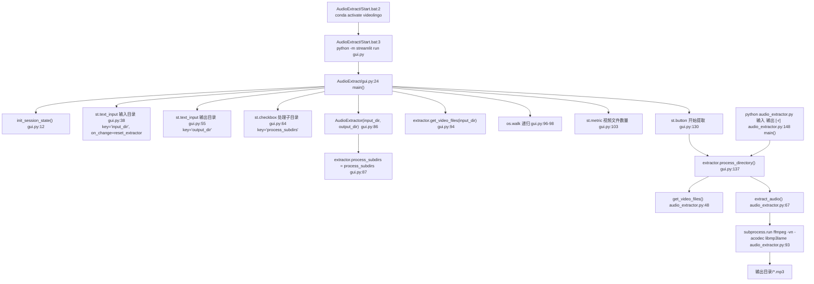

## 一、职责与边界

`AudioExtract/` 是一个**与主流水线解耦**的小工具：给定一个装满视频的目录，用 ffmpeg 把每个视频的音轨抽成 `.mp3`，输出到另一个目录，供远程部署 / 离线场景使用（根 `README.md:65` 的改进项「支持批量提取视频的音频，便于远程部署使用」）。

它**不**做：不下载视频（不 import yt-dlp）、不做转录 / 翻译 / 配音、不读写 `config.yaml`、不产出 `output/` 任何文件、不参与 step1~step12 的幂等跳过体系。

它**唯一**的耦合点是运行环境：`AudioExtract/Start.bat:2` 激活同名 conda 环境 `videolingo`，因此要求主项目的依赖（`streamlit`、`rich`）已经装好；`audio_extractor.py` 自身只依赖标准库 + `rich`，不依赖 torch/whisperx。

> ✅ **上游 3.0.4 合并（`merge/upstream-3.0.4`）未影响本工具，无需改动。** 已核实：`git diff dev...HEAD -- AudioExtract` 输出为空（该分支 18 个提交里没有任何一个碰过 `AudioExtract/`），目录内 4 个文件的内容与合并前一致。本文本次只更正了因合并而失效的**外部引用行号**（`requirements.txt` 的行号，见 5.2 与「七」第 10 条）。

## 二、文件清单

| 文件路径 | 行数 | 主要职责 |
| --- | --- | --- |
| `AudioExtract/gui.py` | 151 | Streamlit 界面：输入/输出目录、子目录开关、文件计数、文件列表、开始按钮 |
| `AudioExtract/audio_extractor.py` | 177 | 核心：`AudioExtractor` 类（扫目录、调 ffmpeg）+ CLI `main()`（argparse） |
| `AudioExtract/Start.bat` | 5 | 启动脚本：激活 conda 环境后 `python -m streamlit run gui.py` |
| `AudioExtract/__pycache__/` | — | 运行时生成（`audio_extractor.cpython-310.pyc` 等），非源码 |

目录实际内容（本次核实）：`audio_extractor.py`（6363 字节）、`gui.py`（5220 字节）、`Start.bat`（116 字节）、`__pycache__/`。**没有** requirements.txt、没有 README、没有测试。

## 三、调用链与数据流



命令行入口（`audio_extractor.py:148-174`）与 GUI 共用同一个 `process_directory()`，只是参数来源不同：

```
python AudioExtract/audio_extractor.py <input_dir> <output_dir> [-r|--recursive]
```

## 四、关键数据结构

`AudioExtractor` 实例字段（`audio_extractor.py:9-46`）：

| 字段 | 类型 | 含义 |
| --- | --- | --- |
| `input_dir` | `str` | `os.path.abspath(input_dir)`（`:18`），用于算 `relpath` |
| `output_dir` | `str` | `os.path.abspath(output_dir)`（`:19`），构造时即 `makedirs(exist_ok=True)`（`:43`） |
| `video_extensions` | `tuple[str, ...]` | 匹配后缀白名单，约 70 项且含重复（`:22-40`） |
| `process_subdirs` | `bool` | 默认 `False`（`:46`）；CLI 由 `--recursive` 置位，GUI 由 `st.checkbox` 置位 |

`get_video_files(directory)` 返回 `List[Tuple[str, str]]`（`:48-65`）：

| 元组位 | 含义 | 示例 |
| --- | --- | --- |
| `[0]` | 视频文件**完整路径**（`os.path.join(directory, file)`） | `E:\vids\a.mp4` |
| `[1]` | 相对 `self.input_dir` 的**相对路径**（`os.path.relpath`），仅用于展示与命名 | `a.mp4`，子目录时为 `sub\a.mp4` |

`process_directory()` 返回 `Tuple[int, int]` = `(success_count, failed_count)`（`:106`、`:146`）。

落盘产物：仅 `output_dir/<原相对路径去扩展名>.mp3`（命名规则见 5.3），**无中间文件、无日志文件、无清单文件**。

## 五、逐函数/逐模块实现说明

### 5.1 `gui.py` 的框架与界面

GUI 框架是 **Streamlit**（`gui.py:3 import streamlit as st`，`:25 st.set_page_config(page_title="音频提取工具", layout="wide")`）。**不是** tkinter/PyQt/Gooey——`Start.bat` 也是用 `streamlit run` 启动的。

界面字段与交互流程：

| 控件 | 位置 | key | 触发行为 |
| --- | --- | --- | --- |
| `st.title("🎵 音频提取工具")` | `gui.py:27` | — | — |
| `st.text_input("输入目录")` | `gui.py:38` | `input_dir` | `on_change=reset_extractor` |
| 示例路径提示（`os.name == 'nt'` 分支） | `gui.py:47-51` | — | 展示 `C:\Users\YourName\Videos` |
| `st.text_input("输出目录")` | `gui.py:55` | `output_dir` | `on_change=reset_extractor` |
| `st.checkbox("处理子目录")` | `gui.py:64` | `process_subdirs` | `on_change=reset_extractor` |
| `st.metric("📊 视频文件数量")` | `gui.py:103` | — | 由 `os.walk` + `get_video_files` 计算 |
| `st.button("📂 打开输入目录")` | `gui.py:106` | — | `os.startfile(input_dir)`（Windows）/ `xdg-open` |
| `st.button("📂 打开输出目录")` | `gui.py:113` | — | 先 `makedirs(output_dir, exist_ok=True)` 再打开 |
| `st.expander("🎥 待处理的视频文件")` | `gui.py:122-124` | — | 逐行 `st.text(f"{i}. {rel_path}")` |
| `st.button("▶️ 开始提取")` | `gui.py:130` | — | `disabled=st.session_state.processing`，调用 `process_directory()` |

交互流程与早退（`gui.py:72-127`）：

1. 输入目录为空 → `st.warning("⚠️ 请输入视频文件夹路径")` 并 `return`（`:72-74`）；
2. 输出目录为空 → 同上（`:76-78`）；
3. 输入目录不存在 → `st.error(f"❌ 输入目录不存在: {input_dir}")` 并 `return`（`:80-82`）（**不检查输出目录是否存在**，由 `AudioExtractor.__init__` 的 `makedirs` 兜底）；
4. 未扫到任何视频 → `st.warning("⚠️ 未找到支持的视频文件")` 并 `return`（`:126-127`）；
5. 点击开始 → `st.session_state.processing = True` 置位防重复点击，`with st.spinner("正在提取音频...")` 内**同步**执行 `process_directory()`（`:136-137`），`finally` 里复位 `processing`（`:148`）。

`reset_extractor()`（`:19-22`）把 `st.session_state.extractor` 置 `None` 并复位 `processing`，三个控件的 `on_change` 都绑它——但**重建只发生在下一轮 rerun 的 `:85-87`**，因此修改复选框后需要界面重跑一次才会作用到实例上。

结果反馈（`:139-146`）：`failed == 0` 时 `st.success("✅ 处理完成！成功提取 {success} 个文件的音频")`；否则 `st.warning` 列出成功/失败数量；异常则 `st.error(f"❌ 处理出错: {str(e)}")`。

### 5.2 `extract_audio()` —— 用什么提取：**ffmpeg，不是 moviepy**

`audio_extractor.py:67-104`，签名 `extract_audio(self, video_path: str, output_path: str) -> bool`。

**结论（已读代码确认）：用 `subprocess.run` 调外部 `ffmpeg` 可执行文件，未使用 moviepy / moviepy.editor / pydub / imageio-ffmpeg。** 全仓库对 `moviepy` 的引用只剩 `requirements.txt:33` 的一行注释（上游 3.0.4 合并时 `moviepy==1.0.3` 已从依赖清单移除，注释保留以便追溯），`AudioExtract/` 下没有任何 moviepy import。

真实命令（`audio_extractor.py:83-90`，以 `list[str]` 传入，非 shell 字符串）：

```
ffmpeg -y -i <video_path> -vn -acodec libmp3lame -q:a 2 <output_path>
```

| 参数 | 含义 | 行号 |
| --- | --- | --- |
| `-y` | 覆盖已存在的输出（**同名 mp3 会被静默覆盖，无备份**） | `:84` |
| `-i <video_path>` | 输入；对音频文件同样可用（未做类型校验） | `:85` |
| `-vn` | 不输出视频流 | `:86` |
| `-acodec libmp3lame` | 强制 MP3 编码器 | `:87` |
| `-q:a 2` | LAME VBR 质量档（代码注释写「0-9，2 是高质量」，未写死码率） | `:88` |
| 采样率 / 声道 | **命令里没有 `-ar` / `-ac`，即保持源音频的采样率与声道数** | `:83-90` |
| 输出 | `output_path` 位置参数（靠 `.mp3` 后缀决定封装） | `:89` |

异常与返回（`:78-104`）：函数体整体包在 `try` 中；先 `os.makedirs(os.path.dirname(output_path), exist_ok=True)`（`:80`）；`subprocess.run(..., capture_output=True, text=True, encoding='utf-8')`（`:93-98`）；**只按 `returncode == 0` 判定成功**（`:100`），ffmpeg 的 stderr 被 `capture_output` 吞掉，不落日志、不打印；捕获到任何 `Exception` 时 `console.print(f"[red]处理文件 {video_path} 时出错: {str(e)}[/red]")` 并返回 `False`（`:102-104`）。注意：`ffmpeg` 不存在会抛 `FileNotFoundError`，被同一 `except` 捕获，于是**每个文件各报一次错**，而不是提前终止。

### 5.3 `get_video_files()` 与输出命名规则 —— `audio_extractor.py:48`

签名 `get_video_files(self, directory: str) -> List[Tuple[str, str]]`。用 `os.listdir(directory)`（**非递归**）+ `os.path.isfile()` + `file.endswith(self.video_extensions)` 过滤（`:59-61`），再算 `os.path.relpath(full_path, self.input_dir)`（`:63`）。

输出命名（`process_directory()` 内，`:132-133`）：

```python
output_filename = os.path.splitext(rel_path)[0] + '.mp3'
output_path = os.path.join(self.output_dir, output_filename)
```

| 输入 | 输出 |
| --- | --- |
| `<in>/a.mp4` | `<out>/a.mp3` |
| `<in>/a.MP4` | `<out>/a.mp3` |
| `<in>/sub/a.mkv`（`-r`） | `<out>/sub/a.mp3`（`rel_path` 用当前平台的 `os.sep`，Windows 下写出到 `<out>\sub\`） |
| `<in>/不支持的.flv.xxx` | 跳过（后缀不在白名单） |

后缀白名单 `self.video_extensions`（`audio_extractor.py:22-40`）按代码原样列出（**含大量重复项与大小写变体**）：

| 分组（代码注释） | 后缀 |
| --- | --- |
| 常见视频容器格式 | `.mp4` `.avi` `.mov` `.mkv` `.flv` `.wmv` `.webm` |
| 其他常见视频格式 | `.m4v` `.mpg` `.mpeg` `.mp2` `.m2v` `.m4v` `.3gp` `.3g2` `.mxf` `.ts` `.mts` `.m2ts` `.vob` `.ogv` `.dv` `.qt` `.asf` `.amv` `.rm` `.rmvb` `.ogm` `.divx` `.xvid` |
| 专业视频格式 | `.mxf` `.r3d` `.braw` `.arri` `.dpx` |
| 网络视频格式 | `.f4v` `.m2t` `.m2ts` `.mts` `.yuv` |
| 苹果设备格式 | `.m4v` `.mov` |
| 安全监控格式 | `.h264` `.h265` `.264` `.265` |
| 其他格式（大小写变体） | `.MP4` `.AVI` `.MOV` `.MKV` `.FLV` `.WMV` `.WEBM` `.M4V` `.MPG` `.MPEG` `.VOB` `.TS` `.MTS` |

匹配方式为 `str.endswith(tuple)`（**大小写敏感**）：白名单显式列了 13 个全大写变体，但 `.Mp4`、`.Mkv` 这类混合大小写仍会漏掉。

### 5.4 `process_directory()` —— 批处理策略：**纯串行，无并发**

`audio_extractor.py:106-146`，签名 `process_directory(self) -> Tuple[int, int]`。

| 步骤 | 行为 | 行号 |
| --- | --- | --- |
| 1 | 收集主目录文件：`all_videos.extend(self.get_video_files(self.input_dir))` | `:120` |
| 2 | 若 `self.process_subdirs` 为真，`os.walk(self.input_dir)` 并对每个非根目录再调 `get_video_files(root)` 追加 | `:123-126` |
| 3 | `for i, (video_path, rel_path) in enumerate(all_videos, 1)` 逐个处理 | `:130` |
| 4 | 打印进度：`console.print(f"\n[cyan]处理进度: [{i}/{total_files}] {rel_path}[/cyan]")` | `:136` |
| 5 | 成功 `console.print(f"[green]✓ 成功提取: {rel_path}[/green]")` 并 `success_count += 1`；失败 `console.print(f"[red]✗ 提取失败: {rel_path}[/red]")` 并 `failed_count += 1` | `:139-144` |

并发情况：**没有** `ThreadPoolExecutor` / `multiprocessing` / `asyncio`；每个文件一次 `subprocess.run` 阻塞等待（`:93`）。对比主项目的 `core/step10_gen_audio.py` 用了 `ThreadPoolExecutor`，本工具刻意没有。

进度展示：**只有 `rich.console.Console.print` 打到 stdout**（`audio_extractor.py:7`、`:136`、`:141`、`:144`）。在 Streamlit 里 stdout 只出现在启动终端，浏览器端只能看到 `st.spinner("正在提取音频...")` 和最终汇总——**没有进度条、没有 st.progress、没有取消按钮**。

跳过逻辑：**不存在「已存在即跳过」**。`:139` 无条件调用 `extract_audio()`，而 ffmpeg 带 `-y`（`:84`）会直接覆盖同名输出。唯一的「跳过」是扩展名不匹配的文件在 `get_video_files()` 阶段就被过滤掉。

CLI 入口 `main()`（`:148-174`）：argparse 三个参数 `input_dir`（位置）、`output_dir`（位置）、`--recursive/-r`；`extractor.process_subdirs = args.recursive`（`:161`）；结束后用 `rich.panel.Panel` 打印成功/失败汇总（`:168-174`），`failed == 0` 时面板样式为 `bold green`，否则 `bold yellow`。

## 六、关键参数与配置

**本工具不读 `config.yaml`**（全仓库 grep 无 `load_key` 出现在 `AudioExtract/` 下）。所有参数只在界面 / 命令行给定：

| 参数 | 来源 | 默认值 | 说明 |
| --- | --- | --- | --- |
| 输入目录 | `gui.py:38` / CLI 位置参数 1 | 无（必填） | 仅扫描该目录本层（除非勾选子目录） |
| 输出目录 | `gui.py:55` / CLI 位置参数 2 | 无（必填） | 不存在则自动创建（`audio_extractor.py:43`、`:80`） |
| 处理子目录 | `gui.py:64` / `--recursive` `-r` | `False` | `audio_extractor.py:46` |
| 视频后缀白名单 | 代码内常量 | 见 5.3 | `audio_extractor.py:22-40`，不可配置 |
| 音频编码参数 | 代码内常量 | `libmp3lame` + `-q:a 2` | `audio_extractor.py:87-88`，不可配置 |
| 输出格式 | 硬编码 `.mp3` | — | `audio_extractor.py:132`，**无法选输出格式** |
| 采样率 / 声道 | 未指定 | 跟随源文件 | 命令里没有 `-ar` / `-ac` |

与主项目 config 的对照：主项目的 `allowed_video_formats`（`config.yaml:185-192`，7 项）与 `allowed_audio_formats`（`config.yaml:194-198`）**不影响**本工具；反过来本工具的长后缀白名单也不影响主流水线的 `find_video_files()`（`core/step1_ytdlp.py:82`）。

## 七、技术要点与坑

1. **`sys.path` 是本地目录优先**：`gui.py:4` 直接 `from audio_extractor import AudioExtractor`，依赖 `script_dir` 在 `sys.path` 上（`streamlit run gui.py` 时成立）。而 `gui.py:7-10` 又追加了项目根目录，注释写的是「添加项目根目录到系统路径」——实际 `root_dir` 只被 `append`，**全程未被使用**，属于冗余代码。⚠️ 需人工确认：项目根加入 path 是否为了将来 import `core.*`（当前无任何 `core.` import）。
2. **`Start.bat` 的目录假设**：内容是 5 行（`@echo off` / `call "%USERPROFILE%\anaconda3\Scripts\activate.bat" videolingo` / `python -m streamlit run gui.py` / 空行 / `pause`），**没有 `cd /d %~dp0`**。因此只有「双击」或「在该目录内执行」时才找得到 `gui.py`；从项目根执行 `AudioExtract\Start.bat` 会因为 cwd 是项目根而报 `Error: File 'gui.py' does not exist`。（对照：`batch/StartBatch.bat:3` 显式写了 `cd ..` 再 `run "batch\utils\gui.py"`，说明两种写法在仓库里并不统一。）
3. **`gui.py:9` 的 `root_dir = os.path.dirname(current_dir)`** 依赖 `AudioExtract/` 位于项目根下一层；把该目录单独拷走仍能运行（没有 `core.` 依赖），但这两行会指向错误位置（无害，因为没被使用）。
4. **`-acodec libmp3lame` 要求 ffmpeg 编译了 libmp3lame**。本机 PATH 上的 ffmpeg（`C:\Program Files\ffmpeg-7.0.2-full_build\bin\ffmpeg.exe`）含该编码器；主项目根目录原先手工放置的 `ffmpeg.exe` **当前不存在**（`.gitignore:176` 的 `/ffmpeg.exe` 规则仍为将来放置做准备），所以更**必须**保证 `ffmpeg` 在 PATH 上——`st.py:13-15` 只对主应用做 PATH 注入，`AudioExtract/Start.bat` 不做。如果 `ffmpeg` 不在 PATH，每个文件都会各抛一次 `FileNotFoundError` 并被吞成「✗ 提取失败」，界面只会显示「失败 N 个文件」，没有任何「找不到 ffmpeg」的提示。
5. **失败原因不可见**：`capture_output=True` 把 ffmpeg 的 stderr 丢弃（`audio_extractor.py:93-98`），失败时既不打印 stderr 也不落文件（对比主项目 `core/step11_merge_full_audio.py:51` 同样吞输出，但那里至少依赖 returncode）。
6. **重跑不幂等**：没有「输出已存在则跳过」，`-y` 静默覆盖。想续跑只能手工把已完成的 mp3 移出输出目录，或依赖扩展名过滤。
7. **`os.walk` 与 `get_video_files` 的子目录组合会重复输出路径**：`process_directory()` 的 `:130` 里，`rel_path` 是相对 `input_dir` 的，所以子目录文件会带子目录片段（`sub\a.mp3`）；两个不同子目录里的同名文件（`sub1\a.mp4`、`sub2\a.mp4`）**不会**撞名，但 `a.mp4` 与 `a.MP4` 会同时命中并都写成 `a.mp3`（后者覆盖前者）。
8. **`process_subdirs` 的会话状态与实例状态可能不一致**：`gui.py:64-69` 的复选框有 `key="process_subdirs"`，值存进 `st.session_state`；而实例属性只在 `:85-87` 首次构造时同步一次。改动复选框后，若 `extractor` 未被 `reset_extractor` 置空（例如 `on_change` 未触发），目录信息区会按新值统计、实际处理仍按旧值执行。
9. **`gui.py` 与 `audio_extractor.py` 的进度口径不同**：界面「📊 视频文件数量」是**实时重算**的（`:94-98`），而 `process_directory()` 会**再算一遍**列表（`:117-126`）；两处逻辑重复，改一处容易漏改另一处。
10. **`st.button(..., use_container_width=True)`**（`gui.py:106`、`:113`、`:130-132`）在 `streamlit==1.38.0`（`requirements.txt:14`）下仍可用；Streamlit 1.4x 起该参数被 `width` 取代并告警——升级 Streamlit 时要同步改这三处（主项目 `st.py:355-359` 的 `st.image(..., use_column_width=True)` 有同类版本绑定的注释可参照）。
11. **没有任何测试与日志**：输出只有终端 stdout（rich）。整目录失败时不会生成失败清单，重跑要人工比对。

## 八、扩展点

| 目标 | 改动位置 | 注意事项 |
| --- | --- | --- |
| 支持输出格式（wav / m4a / flac） | `audio_extractor.py:83-90` 的 `cmd`、`:132` 的 `output_filename` | 需把编码器与后缀做成参数（如 `WAV: -acodec pcm_s16le`），并同步 CLI 与 GUI |
| 支持采样率 / 单声道（主流水线用 16 kHz 单声道） | 同上，加 `-ar <sr> -ac <ch>` | 主项目 Whisper 分支读的是 `output/audio/raw.mp3`、`for_whisper.mp3`（`core/step2_whisperX.py:32`），若要把本工具产物喂给主流水线，建议对齐 `-ar 16000 -ac 1` |
| 并发加速 | `process_directory()` 的 `for` 循环（`:130`）改成 `concurrent.futures.ThreadPoolExecutor` | 参照 `core/step10_gen_audio.py:13` 的写法；要给 ffmpeg 加 `-threads` 上限，避免 N 路解码抢满磁盘 IO |
| 进度条 / 取消 | `gui.py:136-137` | 需改成逐文件循环（把 `process_directory` 拆出 `iter_files()` + `extract_one()`），或改成后台线程 + `st.session_state` 轮询 |
| 失败清单与日志 | `extract_audio()` 失败分支（`:142-144`） | 建议记录 `(video_path, returncode, stderr)`；同时把 `capture_output` 的 stderr 保留下来 |
| 幂等重跑（跳过已存在） | `process_directory()` 循环开头 | 加 `if os.path.exists(output_path): skip` 并回报 `skipped_count`（目前返回值是二元组，要一并改调用方 `gui.py:137` 与 CLI `:165`） |
| 后缀白名单去重与大小写无关 | `video_extensions`（`:22-40`） | 改成小写 `set` + `file.lower().endswith(...)`；注意 tuple 里 `.mxf`/`.m4v`/`.mov`/`.m2ts`/`.mts` 各有 2~3 份重复 |
| 复用到主流水线（例如批量预处理） | 新建调用方 import `AudioExtractor` | 需要先 `sys.path.append("AudioExtract")`（同 `gui.py:4` 的思路）；更干净的做法是把 `AudioExtractor` 提升为 `core/` 下的模块 |

> 💡 建议：把 `ffmpeg` 路径解析统一到一处（主项目现在靠 `st.py:8-9` 把项目根拼进 `PATH`，本工具完全没做）。若想让 `AudioExtract/Start.bat` 与 `OneKeyStart.bat` 行为一致，应在 bat 里补 `set "PATH=%~dp0..;%PATH%"`。

## 九、验证方式

前提：conda 环境 `videolingo` 已存在，或用任意含 `streamlit` + `rich` 的 Python。

```powershell
# 0) 让 ffmpeg.exe 可被找到（本工具不会自己注入 PATH）
$env:PATH = 'E:\VideoLingo\VideoLingoMove' + [IO.Path]::PathSeparator + $env:PATH
ffmpeg -hide_banner -encoders | Select-String 'libmp3lame'
```

```powershell
# 1) CLI 方式（不走 Streamlit，最便于排查）
python AudioExtract\audio_extractor.py "E:\some\videos" "E:\some\audios"
python AudioExtract\audio_extractor.py "E:\some\videos" "E:\some\audios" --recursive

# 2) GUI 方式（必须在 AudioExtract 目录内执行，Start.bat 无 cd）
cd E:\VideoLingo\VideoLingoMove\AudioExtract
python -m streamlit run gui.py
# 或双击 AudioExtract\Start.bat（会激活 conda 环境 videolingo）
```

```powershell
# 3) 校验产物
Get-ChildItem E:\some\audios -Recurse -Filter *.mp3 | Select-Object FullName, Length
ffprobe -v error -show_entries stream=codec_name,sample_rate,channels,bit_rate -of default=nw=1 "E:\some\audios\a.mp3"
# 期望：codec_name=mp3；sample_rate/channels 与源视频一致（工具未做重采样）
```

最小 ffmpeg 复现（确认命令本身没问题）：

```powershell
ffmpeg -y -i "E:\some\videos\a.mp4" -vn -acodec libmp3lame -q:a 2 "$env:TEMP\a.mp3"
```

## 十、相关文档

- [`02-安装脚本与依赖.md`](02-安装脚本与依赖.md) —— conda 环境 `videolingo`、`streamlit`/`rich` 的来源、ffmpeg 的获取与 PATH 注入
- [`../01-entrypoints/02-批量模式入口.md`](../01-entrypoints/02-批量模式入口.md) —— 另一套批处理入口（`batch/utils/gui.py`），与本工具的差异
- [`../04-interfaces/03-批处理任务系统.md`](../04-interfaces/03-批处理任务系统.md)
- [`../02-pipeline/01-下载与音频提取.md`](../02-pipeline/01-下载与音频提取.md) —— 主流水线的音频提取（`output/audio/raw.mp3`）
- [`../05-guides/05-常见故障排查.md`](../05-guides/05-常见故障排查.md)
- [`../00-overview/03-快速上手与调试.md`](../00-overview/03-快速上手与调试.md)
