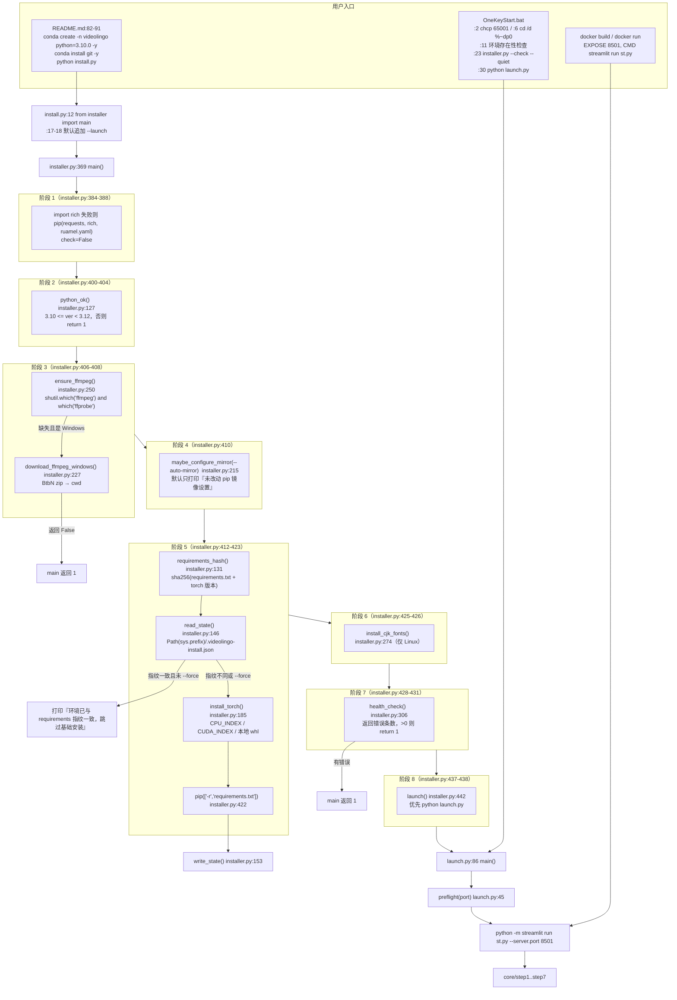

> ## ⚠️ 本文已在「上游 3.0.4 合并」后重写安装链路部分
>
> **`install.py` 不再是安装逻辑的所在地**：它现在是 19 行的兼容包装（`from installer import main`），
> 真实实现在**新增的 `installer.py`**（450 行，含 `--check` 体检、安装状态指纹、按硬件选 torch wheel）
> 与**新增的 `launch.py`**（124 行，启动预检 + 运行日志）。本文第二、三、四、五（5.1~5.2）、六、七、
> 八、九节均已按新代码更正。
>
> 仍然过期的部分：**5.3 节的 `third_party/whisperX/` 目录已在「重构 Round 1」被删除**
> （P3-21），该节内容仅作历史留存，当前磁盘上不存在该目录。

## 一、职责与边界

本主题覆盖「让项目从零跑起来」的全部机器可读事实：`installer.py` 到底执行了哪些命令、`requirements.txt` 每一行装了什么、新增的 `launch.py` 预检了什么、`install.py` 还剩下什么、`Dockerfile` 的构建路径与 Windows 流程差在哪、根目录两个大文件（`ffmpeg.exe`、本地 torch wheel）有什么用、`.gitignore` 把它们排除到什么程度、以及 `OneKeyStart.bat` 的真实启动行为。

它**不**覆盖：`config.example.yaml` 里 API Key / ASR 参数的业务含义（见 [`../04-interfaces/01-配置文件与参数.md`](../04-interfaces/01-配置文件与参数.md)），也不覆盖运行时各 step 的产物（见 [`../00-overview/02-数据流与中间产物.md`](../00-overview/02-数据流与中间产物.md)）。

**重要边界声明**：本文只描述**代码里写了什么**。本次文档工作只实际执行过 `python installer.py --check --quiet`、`python launch.py --no-log`、`python -m unittest discover -s tests -v` 三条命令，**没有**执行安装（`pip` / `conda` 的联网结果、CUDA 驱动匹配等运行时事实均以「⚠️ 需人工确认」标注）。

## 二、文件清单

| 文件路径 | 行数 | 主要职责 |
| --- | --- | --- |
| `installer.py` | 450 | **真实安装脚本**：`--check` 体检、安装状态指纹、按 CPU/CUDA 选 torch wheel、requirements、FFmpeg、Linux CJK 字体、启动 |
| `launch.py` | 124 | 启动预检（`preflight()`）+ 带日志启动 Streamlit，日志写 `logs/videolingo_<时间戳>.log` |
| `install.py` | 19 | **兼容包装**：`from installer import main`，默认追加 `--launch`，保持旧调用方式可用 |
| `requirements.txt` | 37（**26 条有效项**） | 直接依赖清单（含 2 条 git URL、3 条已移除声明的注释） |
| `tests/`（6 个文件） | 651 | 标准库 `unittest` 回归测试，**46 例**，不新增依赖 |
| `Dockerfile` | 56 | Linux/CUDA 容器构建：apt + PPA 装 Python 3.10、clone 上游仓库、装 torch 2.0.0、装 requirements |
| `core/pypi_autochoose.py` | 118 | PyPI 镜像测速与 `pip config set global.index-url`（现只在 `--auto-mirror` 下调用） |
| `OneKeyStart.bat` | 32 | 一键启动：`chcp 65001` + `cd /d "%~dp0"` + 环境存在性检查 + `installer.py --check --quiet` + `python launch.py` |
| `batch/StartBatch.bat` | 6 | 批处理界面启动：`cd ..` 后 `run "batch\utils\gui.py"` |
| `AudioExtract/Start.bat` | 5 | 音频提取工具启动：`run gui.py`（无 `cd`） |
| `.streamlit/config.toml` | 13 | `maxUploadSize = 4096`、`[client] toolbarMode = "viewer"` |
| `.gitignore` | 210 | 排除 `*.whl`、`/ffmpeg.exe`、`/.cache/`、`logs/`、`*.md` 等 |
| `README.md` | 108 | 面向用户的安装说明（conda 建环境 + `python install.py`） |
| `config.example.yaml` | 183 | `version: "2.1.2"`（`:1`）、`model_dir`（`:120`）、`spacy_model_map`（`:155`）等 |

根目录两个「大字」的现状（本次实测）：

| 文件 | 本次实测 | 说明 |
| --- | --- | --- |
| `ffmpeg.exe` | **不存在** | `.gitignore:176` 的 `/ffmpeg.exe` 规则仍在，是为"用户手工放/脚本下载"预留的。本机 `ffmpeg` / `ffprobe` 来自 PATH（`C:\Program Files\ffmpeg-7.0.2-full_build\bin`） |
| `torch-2.1.2+cu118-cp310-cp310-win_amd64.whl` | **不存在** | 历史记录里曾存在（2 722 721 858 字节 ≈ 2.54 GiB）。它是**可选**的离线加速项，缺失时 `installer.install_torch()` 会回落到 `--index-url`（`installer.py:201-206`） |

## 三、调用链与数据流



`preflight()` 的检查项（`launch.py:45-83`）：① `streamlit` / `json_repair` / `torch` 能否 import（`:50-56`）；② `ffmpeg` 与 `ffprobe`（`:59-61`）；③ 端口占用（`:64-65`）。另有 3 条**不阻止启动**的提示：CUDA 可用性与 GPU 名、是否装了 whisperx、`config.yaml` 是否存在（`:68-81`）。

## 四、关键数据结构

`installer.py` 的常量与返回值：

| 名称 | 值 / 类型 | 位置 |
| --- | --- | --- |
| `TORCH_VERSION` | `"2.1.2"` | `installer.py:52` |
| `TORCHVISION_INDEX_SUFFIX` | `"cu118"`（仅用于提示文案） | `installer.py:53` |
| `CUDA_INDEX` | `https://download.pytorch.org/whl/cu118` | `installer.py:54` |
| `CPU_INDEX` | `https://download.pytorch.org/whl/cpu` | `installer.py:55` |
| `LOCAL_TORCH_WHEEL` | `torch-2.1.2+cu118-cp310-cp310-win_amd64.whl` | `installer.py:58` |
| `PYTHON_MIN` / `PYTHON_MAX` | `(3, 10)` / `(3, 12)`（即支持 3.10–3.11；3.12 被拒是因为 torch 2.1.2 无 cp312 wheel） | `installer.py:61` |
| `STATE_FILE_NAME` | `".videolingo-install.json"` | `installer.py:63` |
| `REQUIRED_IMPORTS` | 12 个「导入名 → pip 名」：`streamlit` `torch` `torchaudio` `whisperx` `spacy` `pandas` `openpyxl` `cv2` `librosa` `pydub` `json_repair` `ruamel.yaml` | `installer.py:66-79` |
| `requirements_hash()` | `str`（sha256 十六进制） | `installer.py:131-139` |
| `state_path()` | `Path(sys.prefix) / ".videolingo-install.json"` | `installer.py:142-143` |
| `read_state()` | `dict`（文件缺失/损坏时返回 `{}`） | `installer.py:146-150` |
| `write_state()` | 无返回值；写 `{"requirements_hash", "python", "torch"}` | `installer.py:153-162` |
| `detect_cuda_version()` | `(major, minor)` 或 `None` | `installer.py:166-182` |
| `run(cmd, retries=1, check=True, env=None)` | `CompletedProcess`；失败重试后 `raise SystemExit` | `installer.py:98-115` |
| `pip(args, retries=2, check=True)` | 同上；固定加 `--disable-pip-version-check --prefer-binary --retries 5 --timeout 120` | `installer.py:118-124` |
| `health_check(quiet=False)` | `int`（错误条数） | `installer.py:306-365` |
| `ensure_ffmpeg()` | `bool` | `installer.py:250-271` |
| `download_ffmpeg_windows(target_dir)` | `True` / `False`（异常也 `return False`） | `installer.py:227-247` |
| `launch()` | `int`（子进程退出码） | `installer.py:442-446` |

`launch.py`：

| 名称 | 值 / 类型 | 位置 |
| --- | --- | --- |
| `LOG_DIR` | `Path("logs")` | `launch.py:31` |
| `log_path()` | `logs/videolingo_%Y%m%d_%H%M%S.log` | `launch.py:34-36` |
| `port_in_use(port)` | `bool`（`connect_ex(("127.0.0.1", port)) == 0`） | `launch.py:39-42` |
| `preflight(port)` | `(errors, notes)` 两个 `list[str]` | `launch.py:45-83` |

安装后仍需人工确认的配置键（`config.example.yaml`）：

| 键 | 当前值 | 位置 |
| --- | --- | --- |
| `version` | `"2.1.2"` | `config.example.yaml:1` |
| `model_dir` | `'./_model_cache'` | `config.example.yaml:120` |
| `whisper.model` | `'large-v3'` | `config.example.yaml:41` |
| `whisper.language` | `'zh'` | `config.example.yaml:43` |
| `spacy_model_map` | `en/ru/fr/ja/es/de/it/zh/ko/pt` → `*_core_web_md` / `*_core_news_md` | `config.example.yaml:155` |
| `demucs` | `false` | `config.example.yaml:38` |
| `resolution` | `'0x0'` | `config.example.yaml:94` |

> ⚠️ 仓库里**没有** `config.yaml`（它被 `.gitignore` 排除）。首次读取时会由 `core/config_utils.py:39-46`
> 从 `config.example.yaml` 自动创建，并打印一条 ASCII 提示。

## 五、逐函数/逐模块实现说明

### 5.1 `installer.py` 的八阶段流程（逐条列出真实命令）

| 阶段 | 位置 | 做什么 | 真实命令 / 调用 |
| --- | --- | --- | --- |
| 1 | `installer.py:384-388` | 引导依赖：只保证 `rich` 可用（`ruamel.yaml` / `requests` 供 `core` 用） | `import rich` 失败 → `pip(["requests","rich","ruamel.yaml"], retries=2, check=False)`；注意 `check=False`，**这一条不会中断安装** |
| 2 | `installer.py:390-404` | 打印 ASCII logo + 面板，然后做 Python 版本闸门 | `python_ok()`（`installer.py:127`）：`(3,10) <= sys.version_info[:2] < (3,13)`；不过关则 `return 1`，并在面板里提示"推荐 3.10，dev 的预编译 wheel 就是 cp310" |
| 3 | `installer.py:406-408`、`:250-271` | **先确认 FFmpeg 再装几个 GB 的依赖** | `ensure_ffmpeg()`：`shutil.which("ffmpeg") and shutil.which("ffprobe")`。Windows 缺失时 `download_ffmpeg_windows(os.getcwd())` 下载 BtbN `ffmpeg-master-latest-win64-gpl.zip` 到 cwd，**然后仍返回 `False`**（要求重启终端）；macOS/Linux 只给 `brew install ffmpeg` / `apt` / `dnf` 建议。返回 `False` → `main` 返回 1 |
| 4 | `installer.py:410`、`:215-223` | 可选：PyPI 镜像测速并写 pip 全局配置 | **默认不动用户环境**（`info("ℹ️ 未改动 pip 镜像设置…")`）；只有显式 `--auto-mirror` 才 `from core.pypi_autochoose import main as choose_mirror; choose_mirror()`，且整个调用包在 try/except 里（失败只告警） |
| 5 | `installer.py:412-423` | 安装状态指纹 → 决定是否跳过 | `requirements_hash()`（`installer.py:131`）= sha256(`requirements.txt` 字节 + `torch=2.1.2`)；`read_state()` 读到相同值且未 `--force` → 打印"✅ 环境已与 requirements 指纹一致，跳过基础安装"；否则 `install_torch()`（`:185`）→ `pip(["-r","requirements.txt"], retries=2, check=True)`（`:422`）→ `write_state()`（`:153`）。⚠️ 状态文件写在 **Python 环境目录** `Path(sys.prefix)`，不在仓库内 |
| 5a | `installer.py:185-212` | **真正按硬件选 torch wheel**（相对旧 `install.py` 最实质的修复） | ① Windows + 有 CUDA + 根目录存在本地 whl → `pip(["torch==2.1.2","torchaudio==2.1.2", "<本地 whl>"])`（`:195-199`）；② 有 CUDA（`detect_cuda_version()` 用 `nvidia-smi` 解析，`:166`）→ 追加 `--index-url https://download.pytorch.org/whl/cu118`（`:201-206`）；③ macOS / 无 N 卡 → 打印"安装 CPU 版 PyTorch"并追加 `--index-url https://download.pytorch.org/whl/cpu`（`:207-212`） |
| 6 | `installer.py:425-426`、`:274-302` | 仅 Linux：装 **CJK** 字体 | 先用 `fc-match "Noto Sans CJK SC"` 探测；再按发行版装 `apt-get install -y fonts-noto-cjk` / `dnf install -y google-noto-sans-cjk-fonts` / `pacman -S --noconfirm noto-fonts-cjk`（`:289-293`），非 root 时加 `sudo`，最后 `fc-cache -f` |
| 7 | `installer.py:428-431`、`:306-365` | 体检 | `health_check(quiet=False)` 返回错误条数；>0 时打印"❌ 安装结束但体检发现 N 个问题"并 `return 1`。检查项：Python 版本、12 个包可 import、`torch` 与 `torchaudio` **同版本**（`:328-330`）、`torch` 版本与 `TORCH_VERSION` 不一致只记 **warning**（`:331-334`，因为环境大升级未执行属正常）、`ffmpeg`/`ffprobe`、Linux Noto CJK、`config.yaml` 或 `config.example.yaml` |
| 8 | `installer.py:433-439`、`:442-446` | 打印完成信息，按需启动 | `if args.launch and not args.no_launch: return launch()`；`launch()` 优先 `subprocess.run([sys.executable, "launch.py"])`，没有该文件时回落到 `python -m streamlit run st.py` |

关键事实补充：

- `--check` 会**在最前面短路**：`if args.check: return 1 if health_check(quiet=args.quiet) else 0`（`installer.py:381-382`），此时不装任何东西、也不改任何配置。
- 全部可用参数（`installer.py:371-377`）：`--check`、`--quiet`、`--force`、`--auto-mirror`、`--launch`、`--no-launch`。**没有 `--yes`**：本脚本全程非交互（不提问、不确认），故 `:373` 留了一行注释说明这一点。
- `run()` 有重试：失败后按 3/6/9…秒（上限 20s）退避（`installer.py:104-115`）；`pip()` 默认 `retries=2`（即 1 次重试）。
- 全脚本**没有** conda 相关调用（不创建环境、不装 conda 包）；conda 环境由 `README.md:82-84` 要求用户手工创建。
- 全脚本**没有** spaCy 模型下载；spaCy 模型是**首次运行时**由 `core/spacy_utils/load_nlp_model.py` 的 `spacy.load(model)` 失败后触发 `spacy.cli.download` 懒下载的。
- 全脚本**没有** whisperX 的显式安装：whisperx 通过 `requirements.txt:23` 的 git URL 安装。
- `requirements.txt` 里**没有** torch：torch 由阶段 5a 单独安装。
- `health_check()` 的探测对象是 **PATH 上的 `ffmpeg`/`ffprobe`**，不是根目录的 `ffmpeg.exe`。

### 5.2 `requirements.txt` 逐行说明

文件共 37 行：26 条有效项 + 7 行注释（`:25`、`:32-37`）+ 4 行空行（`:21`、`:24`、`:29`、`:31`）。
版本约束风格：**15 条 `==` 锁定、8 条完全无约束、1 条 `>=`、2 条 git URL**。

「项目直接 import」一列表示仓库 `*.py`（`core/`、`st_components/`、`batch/`、`AudioExtract/`、`tests/`、根目录脚本）里是否存在该包的 import 语句：

| 行号 | 声明 | 版本约束 | 用途（依据代码/注释） | 项目直接 import |
| --- | --- | --- | --- | --- |
| 1 | `librosa==0.10.2.post1` | 锁定 | `core/step2_whisperX.py:10`；`:201` 作为 `whisperx.load_audio` 的兜底解码 | ✅ |
| 2 | `pytorch-lightning==2.3.3` | 锁定 | 无直接 import；由 `pyannote.audio`（whisperx 依赖）传递引入 | ❌ |
| 3 | `lightning==2.3.3` | 锁定 | 同上，与第 2 行成对锁定。⚠️ 本次合并**刻意保留**这两个 pin（`:36-37` 注释说明：没有环境可验证，不宜放开） | ❌ |
| 4 | `transformers==4.39.3` | 锁定 | WhisperX / pyannote 的模型加载（对齐模型、VAD） | ❌（间接） |
| 5 | `numpy==1.26.4` | 锁定 | `core/step2_whisperX.py:16,204`；`core/all_whisper_methods/volcano_asr.py:767`（测试音生成） | ✅ |
| 6 | `openai==1.55.3` | 锁定 | `core/ask_gpt.py` 的 `from openai import OpenAI`，走 OpenAI 兼容协议访问 DeepSeek/Qwen/SiliconFlow/火山方舟 | ✅ |
| 7 | `opencv-python==4.10.0.84` | 锁定 | ⚠️ **已无任何代码引用**（旧引用点 `step7` 的黑帧生成在 Round 2 的 G5 中改写、`step12` 在 Round 1 删除），但仍留在清单与 `installer.py:74` 的 `REQUIRED_IMPORTS` 里 | ❌ |
| 8 | `openpyxl==3.1.5` | 锁定 | `pandas.to_excel/read_excel` 的 xlsx 引擎；产物如 `output/log/cleaned_chunks.xlsx` | ❌（pandas 间接） |
| 9 | `pandas==2.2.3` | 锁定 | step4/5/6 的表格读写、`core/all_whisper_methods/whisperX_utils.py`、`batch/utils/*` | ✅ |
| 10 | `pydub==0.25.1` | 锁定 | `core/all_whisper_methods/whisperX_utils.py:311`（`compute_normalization_gain()` 里读音频电平） | ✅ |
| 11 | `PyYAML==6.0.2` | 锁定 | 无直接 import（配置统一走 `ruamel.yaml`）；作为生态依赖 | ❌ |
| 12 | `requests==2.32.3` | 锁定 | `core/all_whisper_methods/volcano_asr.py`、`core/ask_gpt.py`、`core/pypi_autochoose.py`、`st_components/sidebar_setting.py` | ✅ |
| 13 | `spacy==3.7.4` | 锁定 | `core/spacy_utils/load_nlp_model.py` 的 `spacy.load` 与 `spacy.cli.download`；`core/step3_1_spacy_split.py` 的断句 | ✅ |
| 14 | `streamlit==1.38.0` | 锁定 | `st.py`、`st_components/*`、`batch/utils/gui.py`、`AudioExtract/gui.py`。⚠️ 版本**刻意固定**：`st.py:355-359` 的 `st.image(..., use_column_width=True)` 依赖 1.38 的签名 | ✅ |
| 15 | `yt-dlp` | **无约束（每次安装取最新）** | `core/step1_ytdlp.py:101`；另外 `:95` 在下载前还会 `pip install --upgrade yt-dlp` | ✅ |
| 16 | `json-repair` | 无约束 | `core/ask_gpt.py`（PyPI 包名 `json-repair`，import 名 `json_repair`） | ✅ |
| 17 | `ruamel.yaml` | 无约束 | `core/config_utils.py:1`，保留引号/注释地读写 `config.yaml` | ✅ |
| 18 | `plyer` | 无约束 | `core/step6_generate_final_timeline.py:12` `from plyer import notification`，`send_notification()`（`:308`）已包 try/except，无桌面环境只告警（见 R9） | ✅ |
| 19 | `autocorrect-py` | 无约束 | `core/step6_generate_final_timeline.py:11` `import autocorrect_py as autocorrect`，`:266` 做文本纠错 | ✅ |
| 20 | `ctranslate2==4.4.0` | 锁定 | faster-whisper 的推理后端（whisperx 依赖链） | ❌（间接） |
| 22 | `demucs[dev] @ git+https://github.com/adefossez/demucs` | **git URL + extra `dev`，无版本** | `core/all_whisper_methods/demucs_vl.py`。⚠️ 本次合并**未改**这个 git 源：上游改用 PyPI 是配合 torch 升级的，而本次不做环境大升级 | ✅ |
| 23 | `whisperx @ git+https://github.com/m-bain/whisperx.git@v3.2.0` | **git tag v3.2.0** | `core/step2_whisperX.py:7` `import whisperx`；`launch.py:77` 仅做可用性探测 | ✅ |
| 26 | `syllables` | 无约束 | `core/estimate_duration.py`，按音节数估算朗读时长（被 `core/subtitle_trim.py` 使用，见 `:25` 注释） | ✅ |
| 27 | `pypinyin` | 无约束 | 同上，中文拼音 | ✅ |
| 28 | `g2p-en` | 无约束 | 同上，英文 G2P | ✅ |
| 30 | `tos>=2.8.7` | `>=2.8.7` | `core/all_whisper_methods/tos_service.py:83` `import tos`（火山引擎对象存储） | ✅ |

已移除的三条声明（保留为注释，`requirements.txt:32-35`）：

| 原声明 | 移除理由（代码里的注释原文） |
| --- | --- |
| `moviepy==1.0.3` | 旧配音链路遗留（`AudioExtract/audio_extractor.py` 用的是 ffmpeg 子进程）；上游 3.x 也已移除 |
| `replicate==0.33.0` | 早期用 Replicate 跑 Demucs 的遗留；dev 用本地 demucs |
| `resampy==0.4.3` | 由 librosa 传递引入，无需直接 pin |

补充事实：

- **torch / torchaudio / torchvision 不在本文件内**（由 `installer.py` 阶段 5a 安装）；`faster-whisper`、`pyannote.audio`、`nltk`、`av` 等**也不在本文件内**，它们由 whisperx 的元数据传递引入。
- ⚠️ 需人工确认：`demucs` / `whisperx` 走 git 意味着**每次真正执行安装段都会重新 clone**，可复现性依赖上游 tag/分支状态。
- ⚠️ 需人工确认：`demucs[dev]` 的 `dev` extra 会额外拉入 lint/test 依赖，安装体积与耗时显著增加。

### 5.3 `third_party/whisperX/` 到底是什么（历史，目录已删除）

> ⚠️ **当前磁盘上不存在 `third_party/` 目录**（`Test-Path third_party` → False）。它在「重构 Round 1」被删除（见
> [`../05-guides/04-已知问题与技术债.md`](../05-guides/04-已知问题与技术债.md) 的 P3-21）。以下内容保留自删除前的实测，
> 仅供追溯；若你看到该目录，说明工作区里有人手工放回了旧文件。

**当时的结论：它是一个被废弃/残缺的「本地 vendored whisperX」残留目录，既不被安装脚本引用，也没有可用的源码文件。**

| 项目 | 当时的实测事实 |
| --- | --- |
| 目录结构 | `third_party/whisperX/whisperx/`（**只有 `__pycache__/`**）与 `third_party/whisperX/whisperx.egg-info/` |
| 源码 | **缺失**。`whisperx/` 下没有任何 `.py`，只有 9 个 `*.cpython-310.pyc` |
| `PKG-INFO` | `Name: whisperx`、`Version: **3.1.1**` |
| 版本关系 | egg-info 是 **3.1.1**，而 `requirements.txt:23` 装的是 **v3.2.0**；两者不一致 |
| 谁引用它 | **无**。`install.py`（当时） / `requirements.txt` / 任何 python 源码都没有路径指向它 |
| 处置 | 已随 P3-21 删除。运行时 `import whisperx` 解析到的是 `requirements.txt:23` 从 GitHub 装在 site-packages 里的 **v3.2.0** |

### 5.4 `Dockerfile` 的构建流程与 Windows 流程差异

构建步骤（逐条对应 `Dockerfile` 行号）：

| 步骤 | 行号 | 内容 |
| --- | --- | --- |
| 基础镜像 | `:1-2` | `ARG CUDA_VERSION=12.4.1` + `FROM nvidia/cuda:${CUDA_VERSION}-devel-ubuntu20.04` |
| 环境变量 | `:5-6` | `ENV DEBIAN_FRONTEND=noninteractive`、`ARG PYTHON_VERSION=3.10` |
| 换源 + 装系统依赖 | `:9-20` | `sed` 把 `archive.ubuntu.com`/`security.ubuntu.com` 换成 `mirrors.aliyun.com`；`apt-get install -y --no-install-recommends software-properties-common git curl sudo ffmpeg fonts-noto wget`；`add-apt-repository ppa:deadsnakes/ppa` 后装 `python3.10 python3.10-dev python3.10-venv`；`update-alternatives` 切换 `python3`；`curl -sS https://bootstrap.pypa.io/get-pip.py \| python3.10` |
| 清理 apt 缓存 | `:23` | `apt-get clean && rm -rf /var/lib/apt/lists/*` |
| CUDA 兼容 workaround | `:26` | `ldconfig /usr/local/cuda-12.4/compat/`（由 `CUDA_VERSION` 截取主次版本） |
| 克隆源码 | `:29-30` | `WORKDIR /app` + `git clone https://github.com/Huanshere/VideoLingo.git .`（**构建时从上游 GitHub 拉，不是 COPY 本地代码**） |
| 装 torch | `:33` | `pip install torch==2.0.0 torchaudio==2.0.0 --index-url https://download.pytorch.org/whl/cu118` |
| 清理 `.git` | `:36` | `rm -rf .git` |
| 换 pip 源 | `:39` | `pip config set global.index-url https://pypi.tuna.tsinghua.edu.cn/simple` |
| 装依赖 | `:42-43` | `COPY requirements.txt .` + `pip install --no-cache-dir -r requirements.txt` |
| CUDA 环境变量 | `:46-52` | `CUDA_HOME=/usr/local/cuda`、`PATH`、`LD_LIBRARY_PATH`、`TORCH_CUDA_ARCH_LIST="7.0 7.5 8.0 8.6+PTX"` |
| 端口与入口 | `:54-56` | `EXPOSE 8501` + `CMD ["streamlit", "run", "st.py"]` |

| 对比维度 | Windows（`installer.py`） | Docker（`Dockerfile`） |
| --- | --- | --- |
| Python 来源 | 用户手工 `conda create -n videolingo python=3.10.0`（`README.md:82`），脚本只做 3.10–3.11 闸门 | 镜像内 deadsnakes PPA 装 `python3.10` + `update-alternatives` |
| torch 版本 | `torch==2.1.2` + `torchaudio==2.1.2`，按硬件选 cu118 / cpu / 本地 whl（`installer.py:185-212`） | `torch==2.0.0` + `torchaudio==2.0.0`（cu118）（`Dockerfile:33`，**未跟随本次合并更新**） |
| CUDA 运行时 | 依赖宿主机安装的 CUDA Toolkit 12.6 / cuDNN 9.3（`README.md:70-75`）；`detect_cuda_version()` 用 `nvidia-smi` 探测 | 镜像自带 `nvidia/cuda:12.4.1-devel-ubuntu20.04` |
| ffmpeg | `ensure_ffmpeg()` 探测 PATH，缺失则从 BtbN 下 zip 到 cwd（`installer.py:250-271`） | apt 直接装 `ffmpeg` |
| 字体 | Windows 用系统 `Arial`；Linux 宿主由 `install_cjk_fonts()` 装 **CJK** 包（`installer.py:274-302`） | apt 只装了 `fonts-noto`（`:12`，**不含 CJK 字形**，与 M8 修的是同一类问题） |
| 镜像测速 | `core/pypi_autochoose.py` 仅在 `--auto-mirror` 时运行 | 构建期硬编码清华源（`:39`） |
| 本地 whl | 可选：根目录有 `torch-...win_amd64.whl` 时优先（`installer.py:194-199`） | 不适用（Linux wheel 不同） |
| 启动方式 | `OneKeyStart.bat` → `python launch.py`；或 `installer.py --launch` 自动 `subprocess.run` | `CMD ["streamlit","run","st.py"]`，映射 `8501` |
| 文件来源 | 本地工作树 | **构建时 `git clone` 上游 `main`**（本地未提交改动不会进镜像） |

⚠️ 需人工确认：`EXPOSE 8501` 与 `Dockerfile:56` 的 `CMD` 都未显式指定 `--server.port`，且 `.streamlit/config.toml` 里**没有** `port` 项，因此容器内端口 = Streamlit 默认端口（见 5.6）。`Dockerfile:42-43` 的 `COPY requirements.txt .` 说明构建上下文需要包含该文件，但 `:30` 又已 clone 过整个仓库——两处叠加，行为上以 COPY 覆盖为准。

### 5.5 根目录大文件说明

| 文件 | 用途（代码依据） | `.gitignore` 状态 |
| --- | --- | --- |
| `ffmpeg.exe` | 项目自带的 Windows ffmpeg 单文件可执行（**本次实测：本机不存在**）。运行时靠 `st.py:13-15` 的 PATH 注入被找到；`core/step7_merge_sub_to_vid.py:44`、`core/step1_ytdlp.py:130`、`core/step2_whisperX.py:184`、`AudioExtract/audio_extractor.py` 都以裸命令名 `ffmpeg` 调用 | **被忽略**：`.gitignore:176` 的 `/ffmpeg.exe`；同组还有 `/ffmpeg`（`:177`）、`/ffprobe.exe`（`:178`）、`/ffprobe`（`:179`） |
| `torch-2.1.2+cu118-cp310-cp310-win_amd64.whl` | 离线安装 CUDA 版 torch + torchaudio 的本地 wheel（**本次实测：本机不存在**）：`installer.py:194-199` 判断 `os.path.exists(LOCAL_TORCH_WHEEL)` 后作为 pip 的第三个参数传入；`README.md:93` 说明「可自行下载放于项目根目录，安装脚本会优先使用本地文件」 | **被忽略**：`.gitignore:196` 的 `*.whl` |

其余与安装相关的忽略规则（`.gitignore`）：

| 规则 | 行号 | 影响 |
| --- | --- | --- |
| `__pycache__/`、`*.py[cod]` | `:2-3` | 忽略字节码 |
| `*.egg-info/` | `:22` | 忽略所有 egg-info 元数据 |
| `/output/`、`/history/`、`_model_cache/` | `:154-156` | 运行产物与 Whisper 模型缓存不入库（`_model_cache` 对应 `config.example.yaml:120` 的 `model_dir`） |
| `/.cache/` | `:159` | 内容寻址的转录缓存（`.cache/asr/`）不入库；注释说明**故意放在 `output/` 之外**，这样归档/清理 `output` 不会让它失效 |
| `logs/` | `:162` | `launch.py` 的运行日志目录不入库 |
| `runtime/`、`dev/`、`installer_files/` | `:185-187` | 与安装器无关的本地目录；⚠️ 旧文档曾提到 `install.py` 会注入 `runtime/python`，**新实现已完全不含该逻辑**（全文件 grep `runtime` 无命中） |
| `ffmpeg.zip`、`ffmpeg-master-latest-win64-gpl/` | `:202-203` | `installer.py:227-247` 下载/解压产生的中间物不入库 |
| `*.md` + `!devdocs/` + `!devdocs/**/*.md` | `:208-210` | 忽略所有 Markdown，但**显式放行 `devdocs/`** |

### 5.6 一键启动脚本与端口

`OneKeyStart.bat` 全文 32 行，本次合并重写后的关键行：

```bat
@echo off
chcp 65001 >nul
cd /d "%~dp0"
set "CONDA_ENV=%USERPROFILE%\anaconda3\envs\videolingo"
if not exist "%CONDA_ENV%\python.exe" ( ... exit /b 1 )
call "%USERPROFILE%\anaconda3\Scripts\activate.bat" videolingo
python installer.py --check --quiet
if errorlevel 1 ( echo [提示] 体检发现问题，尝试修复: python install.py )
python launch.py
pause
```

| 事实 | 说明 |
| --- | --- |
| `chcp 65001` | `OneKeyStart.bat:2`：把控制台代码页切成 UTF-8，否则中文/emoji 输出会乱码 |
| **cwd 修正** | `OneKeyStart.bat:6` 的 `cd /d "%~dp0"` 是本次新增的——旧脚本从别处调用时会因为工作目录不对而找不到 `st.py` / `config.example.yaml` |
| conda 路径仍硬编码 | `%USERPROFILE%\anaconda3\Scripts\activate.bat` 与 `%USERPROFILE%\anaconda3\envs\videolingo`（`:10`、`:19`）；Anaconda 装在非默认位置（如 `D:\anaconda3`）时仍会失败 |
| 环境缺失时的行为 | 打印 `[错误] 未找到 conda 环境: ...` + 两行修复提示，然后 `exit /b 1`（`:11-17`）。**不再静默失败**后用错误解释器跑 |
| 启动前体检 | `:23` 跑 `python installer.py --check --quiet`；`errorlevel 1` 时只打印"[提示] …尝试修复: python install.py"，**不阻止启动** |
| 启动命令 | `:30` `python launch.py`（而不是旧的 `python -m streamlit run st.py`），因此会走预检并写 `logs/videolingo_<时间戳>.log` |
| 端口 | `OneKeyStart.bat`、`batch/StartBatch.bat`、`Dockerfile:56` **都没有** `--server.port`；`launch.py` 默认 `--port 8501`（`launch.py:88`）并传给 Streamlit。因此默认端口 = **8501**（`Dockerfile:54` 的 `EXPOSE 8501` 也印证） |
| 端口冲突 | `launch.py:64-65` 会**先检查** 8501 是否被占用，占用时直接报错退出（"可能是上一次的 VideoLingo 还在运行"）——不再依赖 Streamlit 的端口自增 |
| 上传上限 | `maxUploadSize = 4096`（`.streamlit/config.toml:2`），即 4096 MB ≈ 4 GB |
| 界面工具栏 | `.streamlit/config.toml` 的 `[client] toolbarMode = "viewer"`（`:13`）隐藏 Deploy / 开发者菜单；开发时需要 ⋮ 菜单里的 Rerun 就改回 `"auto"` |
| 文件监听 | `.streamlit/config.toml:3-8` 的注释说明**刻意不动** `fileWatcherType`（保持默认 `auto`）：实测 Streamlit 的 watcher 只监听已导入的 Python 模块，本流水线写 `output/`、重写 `config.yaml` 都不会触发重跑 |

另两个 bat（本次合并**未改动**）：

| 脚本 | 内容要点 | 差异 |
| --- | --- | --- |
| `batch/StartBatch.bat` | 激活同一环境 → `cd ..` → `python -m streamlit run "batch\utils\gui.py"` | 必须放在 `batch/` 目录里执行（`cd ..` 假设当前在 `batch/`，回到项目根）。⚠️ 需人工确认：若从项目根执行 `batch\StartBatch.bat`，`cd ..` 会退到项目根的**父目录** |
| `AudioExtract/Start.bat` | 激活同一环境 → `python -m streamlit run gui.py` | **无 `cd`**，必须在该目录内执行/双击；详见 [`01-批量音频提取工具.md`](01-批量音频提取工具.md) |

**重要**：这三个 bat 都会启动一个**独立的 Streamlit 进程**，各自占用一个端口。`OneKeyStart.bat` 与 `AudioExtract/Start.bat` 同时启动时，第二个会因 8501 被占用而失败（`AudioExtract/Start.bat` 不用 `launch.py`，会落到 Streamlit 自身的端口自增行为）。⚠️ 需人工确认该自增是否在所有版本成立。

### 5.7 `core/pypi_autochoose.py` 详解（安装期副作用模块）

| 函数 | 位置 | 作用 |
| --- | --- | --- |
| `test_mirror_speed(name, url)` | `:29` | `requests.get(url, timeout=5)` 计时（毫秒），非 200 或异常返回 `inf` |
| `get_optimal_thread_count()` | `:22` | `max(os.cpu_count() - 1, 1)`，用于并发测速 |
| `set_pip_mirror(url)` | `:42` | `[sys.executable, "-m", "pip", "config", "set", "global.index-url", url]` |
| `get_current_pip_mirror()` | `:52` | `pip config get global.index-url` 回读校验 |
| `main()` | `:60` | `ThreadPoolExecutor` 并发测 2 个镜像 → `rich` 表格展示 → 选最快 → 写入并回读校验；全不可达时打印「❌ All mirrors unreachable」 |

**副作用**：会**持久修改** pip 全局配置（写入用户级 pip.ini），影响后续所有 pip 操作；校验失败时提示「Try running with admin privileges」（`:103`）。

> 📌 行为变化：本模块**不再**在安装时无条件运行。`installer.py:215-223` 只在显式传 `--auto-mirror` 时调用它，
> 默认打印「ℹ️ 未改动 pip 镜像设置（需要时用 --auto-mirror 显式开启）」。这修掉了"装一次项目就永久改掉用户全局 pip 源"的问题。

### 5.8 `tests/` 回归测试（本次合并新增）

| 文件 | 用例数 | 覆盖内容 |
| --- | --- | --- |
| `tests/test_source_language.py` | 5 | `get_source_language()` 的优先级、`update_key()` 同步 `detected_language`、`load_key_or()` 缺键默认值 |
| `tests/test_media_input.py` | 10 | `input_manifest` 读写、`find_media_file()` / `find_video_files()` 的过滤与回退 |
| `tests/test_transcription_cache.py` | 12 | `cache_key()` 身份（引擎/模型/语言/火山参数）、`valid_result()` 校验、损坏/缺文件/schema 不符时当作未命中、`clear_cache()` |
| `tests/test_prompt_contract.py` | 12 | 提示词与代码读取的 JSON 键契约（如 `topic`） |
| `tests/test_audio_extraction.py` | 7（其中 3 例 `@unittest.skipUnless` 需要 `ffmpeg`/`ffprobe`） | 时间轴对齐标志、`raw.mp3` 直接从源媒体编码、火山 16k/单声道/s16 契约、编码器回退 |
| 合计 | **46** | 标准库 `unittest`，**pytest 不在依赖清单中** |

## 六、关键参数与配置

安装相关的硬编码参数一览（无 config 键）：

| 参数 | 值 | 位置 |
| --- | --- | --- |
| torch / torchaudio | `2.1.2` | `installer.py:52`、`:197`、`:205`、`:211` |
| torch 本地 whl 名 | `torch-2.1.2+cu118-cp310-cp310-win_amd64.whl` | `installer.py:58` |
| CUDA wheel 索引 | `https://download.pytorch.org/whl/cu118` | `installer.py:54` |
| CPU wheel 索引 | `https://download.pytorch.org/whl/cpu` | `installer.py:55` |
| 支持的 Python 范围 | `>=3.10, <3.12`（torch 2.1.2 无 cp312 wheel） | `installer.py:61` |
| 安装状态文件 | `<sys.prefix>/.videolingo-install.json` | `installer.py:63`、`:142-143` |
| pip 统一参数 | `--disable-pip-version-check --prefer-binary --retries 5 --timeout 120` | `installer.py:120-122` |
| pip 环境变量 | `PIP_NO_INPUT=1`、`PYTHONIOENCODING=utf-8` | `installer.py:123` |
| ffmpeg 下载源 | BtbN `FFmpeg-Builds` latest win64-gpl | `installer.py:231-232` |
| Linux CJK 字体包 | `fonts-noto-cjk` / `google-noto-sans-cjk-fonts` / `noto-fonts-cjk` | `installer.py:289-293` |
| 镜像候选 | 清华 `mirrors.tuna.tsinghua.edu.cn/pypi/web/simple`、官方 `pypi.org/simple` | `core/pypi_autochoose.py:12-15` |
| 启动日志目录 | `logs/videolingo_<时间戳>.log` | `launch.py:31-36` |
| 预检端口 | `8501`（`--port` 可改） | `launch.py:88` |
| Streamlit 启动参数 | `--server.port <port> --logger.level error` | `launch.py:101-102` |
| Docker CUDA | `12.4.1`（ARG，可 `--build-arg` 覆盖） | `Dockerfile:1` |
| Docker Python | `3.10`（ARG） | `Dockerfile:6` |
| Docker torch | `2.0.0` + `torchaudio==2.0.0` cu118 | `Dockerfile:33` |
| Docker TORCH_CUDA_ARCH_LIST | `"7.0 7.5 8.0 8.6+PTX"` | `Dockerfile:51` |
| Docker 暴露端口 | `8501` | `Dockerfile:54` |
| 上传上限 | `4096`（MB） | `.streamlit/config.toml:2` |

安装完成后**仍需人工设置**的运行期配置（安装脚本完全不碰）：`config.example.yaml` 里的 `api.key` / `api.base_url` / `api.model`（`:3-5`）等多个 provider 块，以及 `asr_engine`、`resolution`、`volcano_asr.*` 等。⚠️ 本文不转录任何密钥值。

## 七、技术要点与坑

1. **`install.py` 与 `installer.py` 的分工**：`install.py` 只有 19 行，`from installer import main`，并在 `--check` / `--launch` / `--no-launch` 都未出现时**自动追加 `--launch`**（`install.py:15-18`）。所以 `python install.py` 会装完就起服务，而 `python installer.py` **不会**（需要显式 `--launch`）。想只体检请用 `python installer.py --check`。
2. **`--force` 的语义**：它只让阶段 5 的**指纹跳过失效**，并不是"重装一切"；且传入 `install_torch(force=...)` 的 `force` 参数在函数体内**从未被使用**（`installer.py:185`）。⚠️ 需人工确认这是有意的预留还是遗漏。
3. ~~**`--yes` 是预留参数**~~ —— **✅ 已修**：该参数已删除，`installer.py:373` 原位留注释说明"本脚本全程非交互，故不提供 `--yes`"。
4. **安装状态写在环境目录里**（`Path(sys.prefix)`，`installer.py:63`）：换个仓库目录、同一个 conda 环境，仍会被判定为"已安装"并跳过。想强制重来用 `--force`，或删掉 `<sys.prefix>/.videolingo-install.json`。
5. ~~**Python 版本闸门与本地 wheel 不匹配的风险**~~ —— **✅ 已修**：闸门收紧为 **3.10–3.11**（`installer.py:61`，依据是 `torch==2.1.2` 在 PyPI 上只有 cp38/39/310/311 wheel，没有 cp312），且本地 wheel 的解释器标签改为按运行中的 Python 生成（`_PY_TAG`，`installer.py:57-58`）。原先"3.11/3.12 下放着 cp310 wheel 会失败"的组合已不可能出现。
6. **体检会因"没人用的包"报错**：`REQUIRED_IMPORTS`（`installer.py:66-79`）里有 `cv2`，但全仓库已无 `import cv2`（见 5.2 第 7 行）。没装 `opencv-python` 就会让 `--check` 返回 1。⚠️ 这是 Round 1/Round 2 删除配音链路后的残留，本次合并未处理。
7. **`health_check()` 对 torch 版本只告警不报错**（`installer.py:331-334`）：若 torch 不是 2.1.2（例如做了环境大升级），`--check` 仍会通过，只在非 `--quiet` 时打印一条 warning。
8. **`ensure_ffmpeg()` 在 Windows 下载成功后仍返回 `False`**（`installer.py:256-259`）：它只把 `<cwd>/ffmpeg-master-latest-win64-gpl/bin` 追加进**当前进程**的 PATH，不持久化，因此会提示"请**重启终端**后重新运行安装脚本"，且本次安装以退出码 1 结束。
9. **`.gitignore:208` 的 `*.md` 会连累 `devdocs/`**：`:209-210` 的 `!devdocs/` 与 `!devdocs/**/*.md` 已把它放行（P1-7），新增文档可以正常被跟踪。
10. **`requirements.txt` 未锁定 torch**，而安装脚本先装 torch 再装 requirements：若 requirements 中某个包对 torch 版本有隐式期望，可能出现 pip 反复解析甚至降级 torch 的情况。⚠️ 需人工确认真实解析结果。
11. **`README.md` 尚未跟上新入口**：它仍写「运行安装脚本 `python install.py`」（`:87-91`）与「运行 `OneKeyStart.bat`」（`:95`），既没提 `installer.py --check` / `launch.py`，也没提 `AudioExtract/Start.bat`。功能上因为是兼容包装所以仍然有效，但用户看不到体检与日志能力。
12. **改这里会影响谁**：改 `requirements.txt` 的 `whisperx` / `demucs` git 引用 → 直接决定 `core/step2_whisperX.py` 与 `core/all_whisper_methods/demucs_vl.py` 能否 import；改 `installer.py` 的 `TORCH_VERSION` → 需同步检查 `ctranslate2==4.4.0`（`requirements.txt:20`）与本地 whl 文件名（`installer.py:58`），且会让 `requirements_hash()` 变化、触发一次重装；改 `.streamlit/config.toml` → 影响所有界面的上传上限、工具栏与热重载。

## 八、扩展点

| 目标 | 改动位置 | 注意事项 |
| --- | --- | --- |
| 让 `--force` 真的强制重装 torch | `installer.py:185-212` | 目前 `force` 形参未被使用；若要实现，需决定是否跳过"已安装且版本正确"的检测 |
| 去掉已无引用的 `opencv-python` | `requirements.txt:7`、`installer.py:74` | 必须先确认 `cv2` 在 `batch/`、`AudioExtract/` 里也真的没有用法（本次 grep 全仓库无命中） |
| ~~`--yes` 落地~~ | — | **已按"删除"处置**（`installer.py:373`）：没有提问环节就不该有这个开关 |
| 支持 3.11/3.12 的离线 wheel | `installer.py:58` | 现在文件名写死 `cp310`；可改成按 `sys.version_info` 拼 `cp3XX`，或干脆不再依赖本地 whl |
| 让 `installer.py` 装完 ffmpeg 后真正可用 | `installer.py:240-244` | 建议 `shutil.copy2` 把 `bin/ffmpeg.exe`（与 `ffprobe.exe`）拷到项目根（正好匹配 `.gitignore:176-179`），或在脚本内持久化 PATH（需管理员） |
| 预热 spaCy / Whisper 模型 | 在 `installer.py` 阶段 5 之后新增步骤 | spaCy：`python -m spacy download zh_core_web_md` 等；Whisper：让 `whisperx.load_model(..., download_root=MODEL_DIR)` 先跑一次（签名见 `core/step2_whisperX.py:170`） |
| 让安装可复现 | `requirements.txt:22-23` | 把两条 git 依赖改为带 commit hash 的 `@<sha>`；同时考虑去掉 `demucs[dev]` 的 `dev` extra |
| 给 Docker 加国内加速与可复现性 | `Dockerfile:30` | 目前 clone 的是上游 `main` 分支最新代码，建议 `--branch` + 指定 commit；另可加 `--mount=type=cache` 处理 pip 缓存 |
| Docker 的 CJK 字体 | `Dockerfile:12` | 把 `fonts-noto` 换成 `fonts-noto-cjk`（与 `installer.py:290` 一致），否则容器里烧录中文字幕是方块 |
| 统一启动脚本 | `batch/StartBatch.bat`、`AudioExtract/Start.bat` | 建议照 `OneKeyStart.bat` 补 `chcp 65001` 与 `cd /d "%~dp0"`，并显式 `--server.port` 以避免多实例端口冲突 |
| 更新 `README.md` | `README.md:87-95` | 补上 `python installer.py --check`（体检）、`python launch.py`（启动 + 日志）与三个 bat 的差异 |

> 💡 建议：把「ffmpeg 定位」收敛为单一函数（现在有三套：`installer.py:250` 探测 PATH、`st.py:13-15` 注入项目根、`AudioExtract/Start.bat` 什么都不做），并在 README 的安装章节显式写明「根目录 `ffmpeg.exe` 需要靠 `st.py` 注入 PATH，独立工具需自行配置 PATH」。

## 九、验证方式

本次**实际执行过**的三条命令（其余仅为人工核对步骤）：

```powershell
# 1) 回归测试（46 例，不需 pytest / 不需 torch）
python -m unittest discover -s tests -v
# 实测：Ran 46 tests … OK

# 2) 安装体检（本机缺依赖，退出码为 1 属预期）
python installer.py --check
python installer.py --check --quiet      # 只输出问题
# 实测：打印 8 条 ❌（torch / torchaudio / whisperx / spacy / cv2 / librosa / pydub / json_repair），退出码 1

# 3) 启动预检（不启动服务、不写日志）
python launch.py --no-log
# 实测：打印 ℹ️ 提示 + ❌ 缺包，返回 1，且不创建 logs/
```

以下命令**本次未执行**（遵守「不执行安装命令」的约束），仅作为人工核对步骤：

```powershell
# 4) 环境与前置条件（cwd 必须是项目根）
pwd                                                    # 期望输出为项目根（本机为 D:\Git\github\VideoLingoMove）
python --version                                       # 期望 Python 3.10.x（installer.py:61 允许 3.10–3.11）
conda env list                                         # 期望存在 videolingo
Get-Command git | Select-Object Source                 # requirements 的两条 git 依赖需要 git
```

```powershell
# 5) 大文件是否存在（离线安装的关键，两者都是可选项）
Test-Path .\torch-2.1.2+cu118-cp310-cp310-win_amd64.whl   # 本次实测：False
Test-Path .\ffmpeg.exe                                    # 本次实测：False（本机 ffmpeg 来自 PATH）
ffmpeg -version
ffprobe -version
```

```powershell
# 6) 安装脚本（人工择时执行，--auto-mirror 会改 pip 全局配置、--launch 会起服务）
python install.py                    # 等价 python installer.py --launch
python installer.py --no-launch      # 只装不启动
python installer.py --force          # 忽略安装状态指纹，重跑阶段 5
```

```powershell
# 7) 关键依赖自检（装完后）
python -c "import torch, torchaudio; print(torch.__version__, torch.cuda.is_available(), torch.cuda.get_device_name(0) if torch.cuda.is_available() else 'CPU')"
python -c "import whisperx, faster_whisper, ctranslate2; print(ctranslate2.__version__)"
python -c "import streamlit, spacy, librosa, pandas, openpyxl, ruamel.yaml, json_repair, tos; print('ok')"
python -m spacy validate          # 列出已安装的 spaCy 模型
```

```powershell
# 8) 启动（三个入口，注意默认端口都是 8501；每个入口各自新开一个终端）
.\OneKeyStart.bat                            # 在项目根执行（内部会跑 installer.py --check --quiet + launch.py）
python launch.py                             # 等价入口，日志写到 logs\videolingo_<时间戳>.log

cd batch
.\StartBatch.bat                             # 在 batch\ 内执行

cd AudioExtract
.\Start.bat                                  # 在 AudioExtract\ 内执行
# 浏览器：http://localhost:8501
```

```powershell
# 9) Docker（可选；注意 Dockerfile 里 torch 仍是 2.0.0、字体仍是 fonts-noto）
docker build -t videolingo .
docker run --gpus all -p 8501:8501 videolingo
```

### 9.1 「从零到能跑」核对清单

| # | 检查项 | 期望结果 | 依据 |
| --- | --- | --- | --- |
| 1 | 项目路径无中文/空格？ | 建议全英文路径 | 代码里大量相对路径与 ffmpeg `subtitles=` 滤镜参数，含空格/中文时 `-vf` 参数解析易出问题 |
| 2 | cwd = 项目根 | `pwd` 为项目根 | `st.py:13-17` 的 `output/...`、`core/config_utils.py:9` 的 `CONFIG_PATH='config.yaml'`；`OneKeyStart.bat:6` 现已自动切目录 |
| 3 | NVIDIA 驱动 + CUDA Toolkit 12.6 / cuDNN 9.3 已装并配 PATH | `nvidia-smi` 可用（`installer.detect_cuda_version()` 靠它选 wheel） | `README.md:70-75`、`installer.py:166-182` |
| 4 | Anaconda 装在默认位置 | `%USERPROFILE%\anaconda3\envs\videolingo\python.exe` 存在 | `OneKeyStart.bat:10-17` |
| 5 | `videolingo` 环境已创建且 Python 3.10 | `conda activate videolingo` 后 `python --version` → 3.10.x | `README.md:82`；`installer.py:400-404` 的闸门；本地 whl 名为 `cp310` |
| 6 | git 已装入环境 | `git --version` 可用 | `README.md:84`、`requirements.txt:22-23` |
| 7 | `torch-2.1.2+cu118-cp310-cp310-win_amd64.whl` 已在项目根（**可选**，离线加速 2.5 GiB 下载） | 文件存在时 `installer.py:195` 会优先用它 | `installer.py:58`、`README.md:93` |
| 8 | `python install.py`（或 `python installer.py --no-launch`）跑完无红色面板 | 末尾打印 `✅ 安装完成` | `installer.py:433-435` |
| 9 | ffmpeg / ffprobe 都可用 | `ffmpeg -version`、`ffprobe -version` 都有输出；缺失时 `ensure_ffmpeg()` 会让安装以 1 结束 | `installer.py:250-271`、`:342-343` |
| 10 | torch 能用 GPU（有 N 卡时） | `torch.cuda.is_available()` → `True` | `core/step2_whisperX.py:148` 依此选 device |
| 11 | `import whisperx` 成功 | 无 ImportError | `core/step2_whisperX.py:7` |
| 12 | `python installer.py --check` 退出码为 0 | 打印 `✅ 体检通过` | `installer.py:363-365`、`:381-382` |
| 13 | spaCy 目标语言模型可加载（首次会自动下载） | `python -m spacy validate` 能列出 `zh_core_web_md` 等 | `config.example.yaml:155` |
| 14 | `config.yaml` 已填 LLM API Key / base_url / model | `api.key`、`api.base_url`、`api.model` 三项有效（或改用 `VIDEOLINGO_API_KEY` 等环境变量） | `config.example.yaml:3-5`、`core/config_utils.py:86-88` |
| 15 | `resolution` 决定是否真出片 | `0x0`（当前值）时：真实视频**不生成**成片，纯音频输入则原样复制成成片 | `config.example.yaml:94`、`core/step7_merge_sub_to_vid.py:75-88` |
| 16 | `OneKeyStart.bat` 在项目根双击 | 浏览器打开 `http://localhost:8501`；终端出现 `[launch] 📝 运行日志：logs\videolingo_<时间戳>.log` | `OneKeyStart.bat:30`、`launch.py:109-110` |
| 17 | 首屏能看到「下载或上传视频」区块 | `st_components/download_video_section.py:16` 的 header 渲染成功 | `st.py:368` |

## 十、相关文档

- [`01-批量音频提取工具.md`](01-批量音频提取工具.md) —— 依赖相同 conda 环境的小工具，`ffmpeg` 可用性同样关键（本次合并未影响它）
- [`../00-overview/03-快速上手与调试.md`](../00-overview/03-快速上手与调试.md) —— 环境搭建、启动、单步调试
- [`../00-overview/01-项目总览与架构.md`](../00-overview/01-项目总览与架构.md) —— 技术栈与进程模型
- [`../01-entrypoints/01-Streamlit主应用入口.md`](../01-entrypoints/01-Streamlit主应用入口.md) —— `st.py` 与 `OneKeyStart.bat` / `launch.py` 的关系
- [`../01-entrypoints/02-批量模式入口.md`](../01-entrypoints/02-批量模式入口.md) —— `batch/StartBatch.bat`
- [`../02-pipeline/06-字幕压制与成片.md`](../02-pipeline/06-字幕压制与成片.md) —— ffmpeg 在成片阶段的用法与 `h264_nvenc` 探测
- [`../03-subsystems/03-ASR引擎适配层.md`](../03-subsystems/03-ASR引擎适配层.md) —— whisperX / faster-whisper / 模型缓存（`_model_cache`）
- [`../04-interfaces/01-配置文件与参数.md`](../04-interfaces/01-配置文件与参数.md) —— `config.example.yaml` 全部键
- [`../05-guides/05-常见故障排查.md`](../05-guides/05-常见故障排查.md) —— `installer.py --check` / `launch.py` 报错的反查入口
- [`../05-guides/04-已知问题与技术债.md`](../05-guides/04-已知问题与技术债.md) —— 安装脚本相关缺陷（P3-19/P3-20、M6/M7/M8）与本次核对的遗留项
- [`../05-guides/06-上游3.0.4合并记录.md`](../05-guides/06-上游3.0.4合并记录.md) —— `installer.py` / `launch.py` 的引入来源与验证边界
