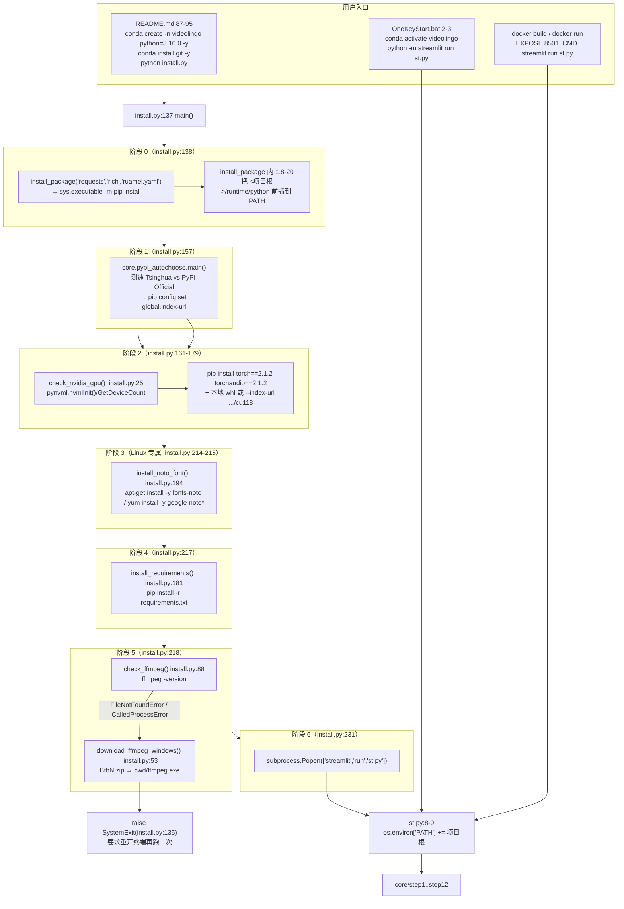

> ## ⚠️ 本文部分内容已在「重构 Round 1」后失效
>
> ⚠️ 本文中 `requirements.txt` 与 `third_party/whisperX/` 的描述已过期：`edge-tts` 已移除；`third_party/whisperX/`（只剩 .pyc 的空壳）已被删除；`install.py` 的 `extra_note` NameError 已修。


## 一、职责与边界

本主题覆盖「让项目从零跑起来」的全部机器可读事实：`install.py` 到底执行了哪些命令（第 16~234 行全读）、`requirements.txt` 每一行装了什么、`Dockerfile` 的构建路径与 Windows 流程差在哪、根目录两个大文件（`ffmpeg.exe`、本地 torch wheel）有什么用、`.gitignore` 把它们排除到什么程度、以及 `OneKeyStart.bat` 的真实启动行为。

它**不**覆盖：`config.yaml` 里 API Key / TTS 参数的业务含义（见 `../04-interfaces/01-配置文件与参数.md`），也不覆盖运行时各 step 的产物（见 `../00-overview/02-数据流与中间产物.md`）。

**重要边界声明**：本文只描述**代码里写了什么**。本次文档工作没有执行任何安装命令、没有改任何源码，`pip` / `conda` 的联网结果、CUDA 驱动匹配等运行时事实均以「⚠️ 需人工确认」标注。

## 二、文件清单

| 文件路径 | 行数 | 主要职责 |
| --- | --- | --- |
| `install.py` | 234 | Windows/macOS 主安装脚本：镜像测速 → torch → requirements → ffmpeg → 启动 Streamlit |
| `requirements.txt` | 33 | 直接依赖清单（27 条 pip 需求，含 2 条 git URL） |
| `Dockerfile` | 56 | Linux/CUDA 容器构建：apt + PPA 装 Python 3.10、clone 仓库、装 torch 2.0.0、装 requirements |
| `core/pypi_autochoose.py` | 110 | PyPI 镜像测速与 `pip config set global.index-url` |
| `OneKeyStart.bat` | 5 | 一键启动：激活 conda 环境 `videolingo` → `python -m streamlit run st.py` |
| `batch/StartBatch.bat` | 6 | 批处理界面启动：`cd ..` 后 `run "batch\utils\gui.py"` |
| `AudioExtract/Start.bat` | 5 | 音频提取工具启动：`run gui.py`（无 `cd`） |
| `.streamlit/config.toml` | 2 | 仅设 `maxUploadSize = 4096` |
| `.gitignore` | 194 | 排除 `*.whl`、`/ffmpeg.exe`、`runtime/`、`*.egg-info/`、`*.md` 等 |
| `README.md` | 108 | 面向用户的安装说明（conda 建环境 + `python install.py`） |
| `config.yaml` | 242 | `version: "2.1.2"`、`model_dir`、`spacy_model_map` 等运行期配置 |

根目录实际大字（本次实测字节数）：

| 文件 | 字节 | 换算 |
| --- | --- | --- |
| `torch-2.1.2+cu118-cp310-cp310-win_amd64.whl` | 2 722 721 858 | 2.54 GiB（2 596.59 MiB，约 2.72 GB 十进制） |
| `ffmpeg.exe` | 131 174 912 | 125.1 MiB（约 131.2 MB 十进制） |

## 三、调用链与数据流



## 四、关键数据结构

`install.py` 里的关键常量与返回值：

| 名称 | 值 / 类型 | 位置 |
| --- | --- | --- |
| `torch_file` | `"torch-2.1.2+cu118-cp310-cp310-win_amd64.whl"` | `install.py:164`、`:173` |
| `ffmpeg_url` | `https://github.com/BtbN/FFmpeg-Builds/releases/download/latest/ffmpeg-master-latest-win64-gpl.zip` | `install.py:63` |
| `ffmpeg_path` | `os.path.join(target_dir, "ffmpeg-master-latest-win64-gpl", "bin")` | `install.py:79` |
| `target_dir` | `os.getcwd()`（Windows 分支） | `install.py:103` |
| `install_package(*packages)` | 无返回值；副作用是改 `os.environ["PATH"]` + `subprocess.check_call` | `install.py:16-23` |
| `check_nvidia_gpu()` | `bool` | `install.py:25-51` |
| `download_ffmpeg_windows(target_dir)` | `True` / `False` / **异常时隐式 `None`** | `install.py:53-85` |
| `check_ffmpeg()` | `True`，或 `raise SystemExit` | `install.py:88-135` |
| `MIRRORS`（镜像表） | `{"Tsinghua Mirror": "https://mirrors.tuna.tsinghua.edu.cn/pypi/web/simple", "PyPI Official": "https://pypi.org/simple"}` | `core/pypi_autochoose.py:12-15` |

`config.yaml` 中与依赖/模型相关、安装后仍需人工确认的键：

| 键 | 当前值 | 位置 |
| --- | --- | --- |
| `version` | `"2.1.2"` | `config.yaml:2` |
| `model_dir` | `'./_model_cache'` | `config.yaml:182` |
| `whisper.model` | `'large-v3'` | `config.yaml:44` |
| `whisper.language` | `'zh'` | `config.yaml:46` |
| `spacy_model_map` | `en/ru/fr/ja/es/de/it/zh/ko/pt` → `*_core_web_md` / `*_core_news_md` | `config.yaml:216-226` |
| `demucs` | `false` | `config.yaml:40` |

## 五、逐函数/逐模块实现说明

### 5.1 `install.py` 的完整步骤顺序（逐条列出真实命令）

| 序号 | 位置 | 做什么 | 真实命令 / 调用 |
| --- | --- | --- | --- |
| 0 | `install.py:138` | 先装 3 个「脚本自己要用」的包（因为后面要 `from rich...`、`from core.pypi_autochoose import main`，后者 import `requests`） | `install_package("requests", "rich", "ruamel.yaml")` → `[sys.executable, "-m", "pip", "install", "requests", "rich", "ruamel.yaml"]` |
| 0b | `install.py:18-20` | **PATH 副作用**：把 `<项目根>/runtime/python` 前插进 `os.environ["PATH"]` | `os.environ["PATH"] = python_path + os.pathsep + os.environ["PATH"]`；⚠️ 需人工确认：仓库根当前**没有** `runtime/` 目录（`.gitignore:171-174` 排除了 `runtime/`），此路径在 pip 调用中并不生效，pip 用的是 `sys.executable`（`:23`） |
| 1 | `install.py:145-152` | 打印 ASCII logo 面板（`rich.Panel` + `DOUBLE` 边框） | 纯展示 |
| 2 | `install.py:157-158` | PyPI 镜像测速并写入 pip 全局配置 | `from core.pypi_autochoose import main as choose_mirror; choose_mirror()` → 对 2 个镜像 `requests.get(url, timeout=5)` 计时（`core/pypi_autochoose.py:29-40`），最慢阈值常量 `FAST_THRESHOLD=3000` / `SLOW_THRESHOLD=5000`（`:19-20`，实际未被使用）→ `pip config set global.index-url <url>`（`:44`） |
| 3 | `install.py:161` | GPU 探测（Darwin 直接判定无 GPU） | `has_gpu = platform.system() != 'Darwin' and check_nvidia_gpu()` |
| 3a | `install.py:25-35` | 若 `pynvml` 缺失则先装 | `install_package("pynvml")` |
| 3b | `install.py:37-51` | 枚举 NVIDIA 设备并打印名字 | `pynvml.nvmlInit()` / `nvmlDeviceGetCount()` / `nvmlDeviceGetHandleByIndex(i)` / `nvmlDeviceGetName(handle)`；`NVMLError` → `False` |
| 4a | `install.py:163-169` | **有 N 卡分支**：装 CUDA 版 torch 2.1.2 | 若根目录存在 `torch-2.1.2+cu118-cp310-cp310-win_amd64.whl` → `[sys.executable, "-m", "pip", "install", "torch==2.1.2", "torchaudio==2.1.2", torch_file]`；否则 → `[..., "torch==2.1.2", "torchaudio==2.1.2", "--index-url", "https://download.pytorch.org/whl/cu118"]` |
| 4b | `install.py:170-179` | **无 N 卡 / macOS 分支**：打印「安装 CPU 版 PyTorch」的提示 | ⚠️ 但代码走的**还是 cu118 分支**：`:173-178` 与 4a 完全相同的两条命令，`:179` 的纯 CPU 安装命令被注释掉。**提示文案与实际命令不一致** |
| 5 | `install.py:194-215` | **仅 Linux**：装 Noto CJK 字体（字幕渲染需要） | Debian 系（存在 `/etc/debian_version`）→ `sudo apt-get install -y fonts-noto`；RHEL 系（存在 `/etc/redhat-release`）→ `sudo yum install -y google-noto*`；其他发行版只打印警告并 `return` |
| 6 | `install.py:181-192`、`:217` | 装全部运行依赖 | `[sys.executable, "-m", "pip", "install", "-r", "requirements.txt"]`，`env` 追加 `PIP_NO_CACHE_DIR="0"`、`PYTHONIOENCODING="utf-8"`；`CalledProcessError` 只打印红色面板**不中断** |
| 7 | `install.py:88-135`、`:218` | 检查 ffmpeg 是否可用 | `subprocess.run(['ffmpeg', '-version'], stdout=PIPE, stderr=PIPE, check=True)` |
| 7a | `install.py:102-120` | Windows 且未找到 ffmpeg → 自动下载 | `download_ffmpeg_windows(os.getcwd())`：`urlretrieve(ffmpeg_url, <cwd>/ffmpeg.zip)` → `zipfile.extractall(target_dir)` → `os.remove(zip)` → 把 `<cwd>/ffmpeg-master-latest-win64-gpl/bin` 追加进当前进程 PATH（`:79-82`） |
| 7b | `install.py:121-126` | macOS / Linux 未找到 ffmpeg | 只给出建议命令：`brew install ffmpeg` / `sudo apt install ffmpeg`、`sudo yum install ffmpeg` |
| 7c | `install.py:128-135` | 汇总面板 + 强制退出 | `raise SystemExit("FFmpeg is required. Please install it and run the installer again.")` |
| 8 | `install.py:220-231` | 打印「Installation completed」、提示 `streamlit run st.py` 与「首次启动最多 1 分钟」，然后**自动拉起应用** | `subprocess.Popen(["streamlit", "run", "st.py"])` |

关键事实补充：

- 全脚本**没有** conda 相关调用（不创建环境、不装 conda 包）；conda 环境由 `README.md:81-85` 要求用户手工创建。
- 全脚本**没有** spaCy 模型下载（`python -m spacy download ...` 在仓库里不存在）；spaCy 模型是**首次运行时**由 `core/spacy_utils/load_nlp_model.py:24-30` 的 `spacy.load(model)` 失败后触发 `from spacy.cli import download; download(model)` 懒下载的，模型名来自 `config.yaml:216-226`。
- 全脚本**没有** whisperX 的显式安装：whisperx 通过 `requirements.txt:27` 的 git URL 安装。
- `requirements.txt` 里**没有** torch：torch 由阶段 4a/4b 单独安装，版本靠 whisperx 的 `torch>=2` 与 pyannote.audio 的约束共同满足。
- `check_ffmpeg()` 的探测对象是 **PATH 上的 `ffmpeg`**，不是根目录的 `ffmpeg.exe`。`README.md:93` 只提到「whl 可自行下载放于项目根目录」，**没有**对 `ffmpeg.exe` 做同样说明。

### 5.2 `requirements.txt` 逐行说明

文件共 33 行（含 3 行空行）。「项目直接 import」一列表示仓库 `*.py` 里是否存在该包的 import 语句（基于本次全仓库 grep）：

| 行号 | 声明 | 版本约束 | 用途（依据代码/注释） | 项目直接 import |
| --- | --- | --- | --- | --- |
| 1 | `librosa==0.10.2.post1` | 锁定 | `core/step1_ytdlp.py:59-60` 用 `librosa.get_duration(filename=...)` 测时长；`core/step2_whisperX.py:143` 作为 `whisperx.load_audio` 的兜底解码 | ✅ |
| 2 | `pytorch-lightning==2.3.3` | 锁定 | 无直接 import；`pyannote.audio`（whisperx 依赖）的运行时依赖（`VideoLingo_colab.ipynb` 里可见 `lightning>=2.0.1 (from pyannote.audio==3.1.1->whisperx==3.1.1)`） | ❌ |
| 3 | `lightning==2.3.3` | 锁定 | 同上，与第 2 行成对锁定，避免 pip 选到 2.4.0 | ❌ |
| 4 | `transformers==4.39.3` | 锁定 | WhisperX / pyannote 的模型加载（对齐模型、VAD）；whisperx 自身声明 `Requires-Dist: transformers` | ❌（间接） |
| 5 | `moviepy==1.0.3` | 锁定 | 无 import；历史/外部依赖，当前 `AudioExtract/audio_extractor.py` 用的是 **ffmpeg 子进程**而非 moviepy | ❌ |
| 6 | `numpy==1.26.4` | 锁定 | `core/step7_merge_sub_to_vid.py:7,52`（造黑帧）、`core/step2_whisperX.py:16`；1.26.x 是 torch 2.1 / opencv 4.10 的兼容区间 | ✅ |
| 7 | `openai==1.55.3` | 锁定 | `core/ask_gpt.py:6` `from openai import OpenAI`，走 OpenAI 兼容协议访问 DeepSeek/Qwen/SiliconFlow | ✅ |
| 8 | `opencv-python==4.10.0.84` | 锁定 | `core/step7_merge_sub_to_vid.py:6`、`core/step12_merge_dub_to_vid.py:7` 的 `cv2.VideoWriter` 占位黑视频 | ✅ |
| 9 | `openpyxl==3.1.5` | 锁定 | `pandas.to_excel/read_excel` 的 xlsx 引擎；产物如 `output/log/cleaned_chunks.xlsx`、`output/audio/tts_tasks.xlsx` | ❌（pandas 间接） |
| 10 | `pandas==2.2.3` | 锁定 | step6/step8/step11 的表格读写（`core/step11_merge_full_audio.py:3`） | ✅ |
| 11 | `pydub==0.25.1` | 锁定 | `core/step10_gen_audio.py:9`、`core/step11_merge_full_audio.py:5` 的 `AudioSegment` 拼接与导出 | ✅ |
| 12 | `PyYAML==6.0.2` | 锁定 | 无直接 import（配置统一走 `ruamel.yaml`，见 `core/config_utils.py:1`）；作为生态依赖 | ❌ |
| 13 | `replicate==0.33.0` | 锁定 | 无 import；历史遗留（曾用于云端 TTS/推理） | ❌ |
| 14 | `requests==2.32.3` | 锁定 | `core/all_tts_functions/azure_tts.py:1`、`fish_tts.py:1`、`openai_tts.py:2`、`core/all_whisper_methods/volcano_asr.py:11`、`core/pypi_autochoose.py:3` | ✅ |
| 15 | `resampy==0.4.3` | 锁定 | 无直接 import；librosa 重采样后端 / whisperx 生态 | ❌ |
| 16 | `spacy==3.7.4` | 锁定 | `core/spacy_utils/load_nlp_model.py:2-3` 的 `spacy.load` 与 `spacy.cli.download`；`core/step3_1_spacy_split.py` 的断句 | ✅ |
| 17 | `streamlit==1.38.0` | 锁定 | `st.py:1`、`st_components/*`、`batch/utils/gui.py`、`AudioExtract/gui.py` 的界面框架 | ✅ |
| 18 | `yt-dlp` | **无约束（每次安装取最新）** | `core/step1_ytdlp.py:41` `from yt_dlp import YoutubeDL`；另外该文件 `:35` 在下载前还会 `pip install --upgrade yt-dlp` | ✅ |
| 19 | `json-repair` | 无约束 | `core/ask_gpt.py:4`（PyPI 包名 `json-repair`，import 名 `json_repair`），修复 LLM 返回的坏 JSON | ✅ |
| 20 | `ruamel.yaml` | 无约束 | `core/config_utils.py:1`，保留引号/注释地读写 `config.yaml` | ✅ |
| 21 | `plyer` | 无约束 | `core/step6_generate_final_timeline.py:11` 的桌面通知 | ✅ |
| 22 | `autocorrect-py` | 无约束 | `core/step6_generate_final_timeline.py:10` `import autocorrect_py as autocorrect`，`:165` 做文本纠错 | ✅ |
| 23 | `ctranslate2==4.4.0` | 锁定 | faster-whisper 的推理后端（whisperx 依赖链）；与 `VideoLingo_colab.ipynb` 中 whisperx 3.1.1 的安装结果一致（`ctranslate2-4.4.0`） | ❌（间接） |
| 24 | `edge-tts` | 无约束 | `core/all_tts_functions/edge_tts.py:2`；`config.yaml:125` 的默认 `tts_method: 'edge_tts'` | ✅ |
| 25 | （空行） | — | — |
| 26 | `demucs[dev] @ git+https://github.com/adefossez/demucs` | **git URL + extra `dev`，无版本** | `core/all_whisper_methods/demucs_vl.py:6-11`（`get_model`、`save_audio`、`Separator`、`BagOfModels`）。⚠️ 需人工确认：`[dev]` extra 会额外拉入 lint/test 依赖，安装体积与耗时显著增加 | ✅ |
| 27 | `whisperx @ git+https://github.com/m-bain/whisperx.git@v3.2.0` | **git tag v3.2.0** | `core/step2_whisperX.py:7` `import whisperx`；`:112` `load_model`、`:140` `load_audio`、`:186` `load_align_model`、`:187` `align` | ✅ |
| 28 | （空行） | — | — |
| 29 | `syllables` | 无约束 | `core/all_tts_functions/estimate_duration.py:1`，按音节数估算 TTS 时长 | ✅ |
| 30 | `pypinyin` | 无约束 | `core/all_tts_functions/estimate_duration.py:2`，中文拼音 | ✅ |
| 31 | `g2p-en` | 无约束 | `core/all_tts_functions/estimate_duration.py:3`，英文 G2P | ✅ |
| 32 | （空行） | — | — |
| 33 | `tos>=2.8.7` | `>=2.8.7` | `core/all_whisper_methods/tos_service.py:69` `import tos`（火山引擎对象存储），`:89` 未安装时提示 `pip install tos` | ✅ |

补充事实：

- **torch / torchaudio / torchvision 不在本文件内**（由 `install.py` 阶段 4a/4b 安装）；`faster-whisper`、`pyannote.audio`、`nltk`、`av` 等**也不在本文件内**，它们由 whisperx 的元数据传递引入。
- 版本约束风格混杂：16 条 `==` 锁定、9 条完全无约束、1 条 `>=`、2 条 git URL。⚠️ 需人工确认：`demucs` / `whisperx` 走 git 意味着**每次 `python install.py` 都会重新 clone**，可复现性依赖上游 tag/分支状态。

### 5.3 `third_party/whisperX/` 到底是什么

**结论：它是一个被废弃/残缺的「本地 vendored whisperX」残留目录，当前既不被 `install.py` 引用，也没有可用的源码文件。**

| 项目 | 实测事实 |
| --- | --- |
| 目录结构 | `third_party/whisperX/whisperx/`（**只有 `__pycache__/`**）与 `third_party/whisperX/whisperx.egg-info/`（6 个文本文件） |
| 源码 | **缺失**。`whisperx/` 下没有任何 `.py`，只有 9 个 `*.cpython-310.pyc`（`alignment` / `asr` / `audio` / `diarize` / `transcribe` / `types` / `utils` / `vad` / `__init__`） |
| `PKG-INFO` | `Metadata-Version: 2.1`、`Name: whisperx`、`Version: **3.1.1**`、`Summary: Time-Accurate Automatic Speech Recognition using Whisper.`、`Home-page: https://github.com/m-bain/whisperx`、`Author: Max Bain`、`License: MIT`、`Requires-Python: >=3.8` |
| `PKG-INFO` 依赖 | `torch>=2`、`torchaudio>=2`、`faster-whisper==1.0.0`、`transformers`、`pandas`、`setuptools>=65`、`nltk`、`pyannote.audio==3.1.1`；extra `dev` → `pytest` |
| `requires.txt` | 与 `PKG-INFO` 的依赖列表逐行一致，末尾 `[dev]` → `pytest` |
| `SOURCES.txt` | 列了 `setup.py`、`MANIFEST.in`、`README.md`、`whisperx/*.py`（含 `SubtitlesProcessor.py`、`conjunctions.py`）、`whisperx/assets/mel_filters.npz` —— **这些文件在磁盘上都不存在** |
| `top_level.txt` | `whisperx` |
| `entry_points.txt` | `[console_scripts]` → `whisperx = whisperx.transcribe:cli` |
| 谁引用它 | **无**。全仓库 `grep -r "third_party"` 命中的只有本目录自身的文件；`install.py` / `requirements.txt` / 任何 python 源码都没有路径指向它 |
| 版本关系 | egg-info 是 **3.1.1**，而 `requirements.txt:27` 装的是 **v3.2.0**；两者不一致 |
| `.gitignore` 影响 | `.gitignore:22` 的 `*.egg-info/` 让 `whisperx.egg-info/` 处于忽略状态（`git check-ignore -v` 已确认命中第 22 行）；`__pycache__/`（第 2 行）同理。`git ls-files third_party/*` **无输出** → 该目录整体未被版本控制 |

`git ls-files` 对 `third_party/*` 与 `offline_packages/*` 均无输出，且 `third_party/whisperX` 下没有任何 `setup.py`。因此：

- 它**不是** `pip install -e third_party/whisperX` 的安装目标（没有 `setup.py`，也没有 `.pth` / `.egg-link`；全仓库搜索 `*.pth` 与 `*.egg-link` 为空）；
- 运行时 `import whisperx` 实际解析到的是 `requirements.txt:27` 从 GitHub 装在 site-packages 里的 **v3.2.0**；
- ⚠️ 需人工确认：该目录的产生原因（很可能是早期把 whisperX 源码放到本地、随后被清理/迁移到 git 安装方式后遗留）。**建议在确认无人依赖后删除**，避免误导后来者以为项目用的是 vendored 3.1.1。

### 5.4 `Dockerfile` 的构建流程与 Windows 流程差异

构建步骤（逐条对应 `Dockerfile` 行号）：

| 步骤 | 行号 | 内容 |
| --- | --- | --- |
| 基础镜像 | `:1-2` | `ARG CUDA_VERSION=12.4.1` + `FROM nvidia/cuda:${CUDA_VERSION}-devel-ubuntu20.04` |
| 环境变量 | `:5-6` | `ENV DEBIAN_FRONTEND=noninteractive`、`ARG PYTHON_VERSION=3.10` |
| 换源 + 装系统依赖 | `:9-20` | `sed` 把 `archive.ubuntu.com`/`security.ubuntu.com` 换成 `mirrors.aliyun.com`；`apt-get install -y --no-install-recommends software-properties-common git curl sudo ffmpeg fonts-noto wget`；`add-apt-repository ppa:deadsnakes/ppa` 后装 `python3.10 python3.10-dev python3.10-venv`；`update-alternatives` 切换 `python3`；`curl -sS https://bootstrap.pypa.io/get-pip.py \| python3.10` |
| 清理 apt 缓存 | `:23` | `apt-get clean && rm -rf /var/lib/apt/lists/*` |
| CUDA 兼容 workaround | `:26` | `ldconfig /usr/local/cuda-12.4/compat/`（由 `CUDA_VERSION` 截取主次版本） |
| 克隆源码 | `:29-30` | `WORKDIR /app` + `git clone https://github.com/Huanshere/VideoLingo.git .`（**构建时从 GitHub 拉，不是 COPY 本地代码**） |
| 装 torch | `:33` | `pip install torch==2.0.0 torchaudio==2.0.0 --index-url https://download.pytorch.org/whl/cu118` |
| 清理 `.git` | `:36` | `rm -rf .git` |
| 换 pip 源 | `:39` | `pip config set global.index-url https://pypi.tuna.tsinghua.edu.cn/simple` |
| 装依赖 | `:42-43` | `COPY requirements.txt .` + `pip install --no-cache-dir -r requirements.txt` |
| CUDA 环境变量 | `:46-52` | `CUDA_HOME=/usr/local/cuda`、`PATH`、`LD_LIBRARY_PATH`、`TORCH_CUDA_ARCH_LIST="7.0 7.5 8.0 8.6+PTX"` |
| 端口与入口 | `:54-56` | `EXPOSE 8501` + `CMD ["streamlit", "run", "st.py"]` |

| 对比维度 | Windows（`install.py`） | Docker（`Dockerfile`） |
| --- | --- | --- |
| Python 来源 | 用户手工 `conda create -n videolingo python=3.10.0`（`README.md:82`） | 镜像内 deadsnakes PPA 装 `python3.10` + `update-alternatives` |
| torch 版本 | `torch==2.1.2` + `torchaudio==2.1.2`（cu118），优先本地 whl | `torch==2.0.0` + `torchaudio==2.0.0`（cu118） |
| CUDA 运行时 | 依赖宿主机安装的 CUDA Toolkit 12.6 / cuDNN 9.3（`README.md:70-75`） | 镜像自带 `nvidia/cuda:12.4.1-devel-ubuntu20.04` |
| ffmpeg | `check_ffmpeg()` 探测；缺失则从 BtbN 下 zip 到 cwd | apt 直接装 `ffmpeg` |
| 字体 | Windows 用系统 `Arial`；Linux 需 Noto（`install.py:194-215` 在 Linux 宿主上装，Docker 里 apt 已装 `fonts-noto`） | apt 装 `fonts-noto` |
| 镜像测速 | `core/pypi_autochoose.py` 运行时测速（清华 vs PyPI 官方） | 构建期硬编码清华源（`:39`） |
| 本地 whl | 优先使用根目录 2.54 GiB 的 `torch-...win_amd64.whl` | 不适用（Linux wheel 不同） |
| 启动方式 | `OneKeyStart.bat` / `install.py:231` 自动 `Popen` | `CMD ["streamlit","run","st.py"]`，映射 `8501` |
| 文件来源 | 本地工作树 | **构建时 `git clone`**（本地未提交改动不会进镜像） |

⚠️ 需人工确认：`EXPOSE 8501` 与 `Dockerfile:56` 的 `CMD` 都未显式指定 `--server.port`，且 `.streamlit/config.toml` 里**没有** `port` 项，因此容器内端口 = Streamlit 默认端口（见 5.6）。`Dockerfile:42-43` 的 `COPY requirements.txt .` 说明构建上下文需要包含该文件，但 `:30` 又已 clone 过整个仓库——两处叠加，行为上以 COPY 覆盖为准。

### 5.5 根目录大文件说明

| 文件 | 用途（代码依据） | `.gitignore` 状态 |
| --- | --- | --- |
| `ffmpeg.exe`（131 174 912 字节 ≈ 125.1 MiB） | 项目自带的 Windows ffmpeg 单文件可执行。运行时靠 `st.py:8-9` 的 `os.environ['PATH'] += os.pathsep + current_dir` 被找到；`core/step7_merge_sub_to_vid.py:36`、`core/step1_ytdlp.py:66`、`core/step2_whisperX.py:126`、`AudioExtract/audio_extractor.py:84`、`st_components/download_video_section.py:71` 都以裸命令名 `ffmpeg` 调用 | **被忽略**：`.gitignore:163` 的 `/ffmpeg.exe`；同组还有 `/ffmpeg`（`:164`）、`/ffprobe.exe`（`:165`）、`/ffprobe`（`:166`）。`git check-ignore -v` 确认命中第 163 行 |
| `torch-2.1.2+cu118-cp310-cp310-win_amd64.whl`（2 722 721 858 字节 ≈ 2.54 GiB） | 离线安装 CUDA 版 torch + torchaudio 的本地 wheel：`install.py:164-167`（有 N 卡）与 `:173-176`（无 N 卡也走同一段）判断 `os.path.exists(torch_file)` 后作为 pip 的第三个参数传入；`README.md:93` 明确说明「可自行下载放于项目根目录，安装脚本会优先使用本地文件」 | **被忽略**：`.gitignore:183` 的 `*.whl`；`git check-ignore -v` 确认命中第 183 行 |

`ffmpeg.exe` 实测版本信息（执行 `ffmpeg.exe -version` 得到，仅作事实记录，未执行任何安装动作）：`ffmpeg version N-117740-g7f51cf75c6-20241110`，configure 段含 `--enable-libmp3lame`、`--enable-libass`、`--enable-libx264`、`--enable-ffnvcodec`、`--enable-cuda-llvm`。本次还实测了 `ffmpeg -hide_banner -encoders` 的输出中包含 `h264_nvenc`、`libx264`、`aac`——这正是 `core/step7_merge_sub_to_vid.py:37` 判断 `'h264_nvenc' in result.stdout` 会命中的前提。

其余与安装相关的忽略规则（`.gitignore`）：

| 规则 | 行号 | 影响 |
| --- | --- | --- |
| `__pycache__/`、`*.py[cod]` | `:2-3` | 忽略字节码（`third_party/whisperX/whisperx/__pycache__/` 即因此未被跟踪） |
| `*.egg-info/` | `:22` | 忽略所有 egg-info 元数据 |
| `/output/`、`/history/`、`_model_cache/` | `:154-156` | 运行产物与 Whisper 模型缓存不入库（`_model_cache` 对应 `config.yaml:182` 的 `model_dir`） |
| `runtime/`、`dev/`、`installer_files/` | `:171-174` | `install.py:19` 引用的 `runtime/python` 就落在此规则内 |
| `ffmpeg.zip`、`ffmpeg-master-latest-win64-gpl/` | `:189-190` | `install.py:53-85` 下载/解压产生的中间物不入库 |
| `*.md` | `:194` | **连 `devdocs/` 文档也被忽略**（`git check-ignore -v devdocs/README.md` 命中第 194 行） |

### 5.6 一键启动脚本与端口

`OneKeyStart.bat` 全文只有 5 行（`:1-5`）：

```bat
@echo off
call "%USERPROFILE%\anaconda3\Scripts\activate.bat" videolingo
python -m streamlit run st.py

pause
```

| 事实 | 说明 |
| --- | --- |
| conda 路径硬编码 | `%USERPROFILE%\anaconda3\Scripts\activate.bat`——Anaconda 装在非默认位置（如 `D:\anaconda3`）时此脚本必然失败 |
| 环境名硬编码 | `videolingo`，与 `README.md:82` 的 `conda create -n videolingo` 对应 |
| **cwd 前置条件** | 脚本里**没有** `cd /d %~dp0`，`st.py` 是相对路径。因此**必须在项目根目录下执行/双击**；`st.py` 内部大量使用相对路径（`output/...`、`config.yaml`、`sys.path.append(os.path.dirname(os.path.abspath(__file__)))`，见 `st.py:8-13`），从别处运行会立刻报找不到脚本或找不到 config |
| 启动命令 | `python -m streamlit run st.py`（用 `-m` 调模块，不依赖 `streamlit.exe` 是否在 PATH 上） |
| 端口 | `OneKeyStart.bat`、`batch/StartBatch.bat`、`Dockerfile:56` **都没有** `--server.port`；`.streamlit/config.toml` 只有两行（`[server]` + `maxUploadSize = 4096`），**没有 `port` 键**。因此端口 = Streamlit 自身默认值 **8501**（`Dockerfile:54` 的 `EXPOSE 8501` 也印证）。⚠️ 需人工确认真实默认值来源：仓库内无显式配置，若用户全局 `~/.streamlit/config.toml` 覆盖过则可能不同 |
| 上传上限 | `maxUploadSize = 4096`（`.streamlit/config.toml:2`），即 4096 MB ≈ 4 GB；这是本项目对「上传大视频」的唯一调整 |
| 浏览器 | Streamlit 会打印 `Local URL: http://localhost:8501` 并尝试自动打开 |
| `pause` | 出错时窗口不会立刻关闭，便于看报错 |

另两个 bat：

| 脚本 | 内容要点 | 差异 |
| --- | --- | --- |
| `batch/StartBatch.bat` | 激活同一环境 → `cd ..` → `python -m streamlit run "batch\utils\gui.py"` | 必须放在 `batch/` 目录里执行（`cd ..` 假设当前在 `batch/`，回到项目根）。⚠️ 需人工确认：若从项目根执行 `batch\StartBatch.bat`，`cd ..` 会退到项目根的**父目录**，导致找不到 `batch\utils\gui.py` |
| `AudioExtract/Start.bat` | 激活同一环境 → `python -m streamlit run gui.py` | **无 `cd`**，必须在该目录内执行/双击；详见 [`01-批量音频提取工具.md`](01-批量音频提取工具.md) |

**重要**：三个 bat 都会启动一个**独立的 Streamlit 进程**，各自占用一个端口。同时启动 `OneKeyStart.bat` 与 `AudioExtract/Start.bat` 时，第二个会因 8501 被占用而自动改用 8502（Streamlit 的端口自增行为）。⚠️ 需人工确认该自增是否在所有版本成立。

### 5.7 `core/pypi_autochoose.py` 详解（安装期副作用模块）

| 函数 | 位置 | 作用 |
| --- | --- | --- |
| `test_mirror_speed(name, url)` | `:29` | `requests.get(url, timeout=5)` 计时（毫秒），非 200 或异常返回 `inf` |
| `get_optimal_thread_count()` | `:22` | `max(os.cpu_count() - 1, 1)`，用于并发测速 |
| `set_pip_mirror(url)` | `:42` | `[sys.executable, "-m", "pip", "config", "set", "global.index-url", url]` |
| `get_current_pip_mirror()` | `:52` | `pip config get global.index-url` 回读校验 |
| `main()` | `:60` | `ThreadPoolExecutor` 并发测 2 个镜像 → `rich` 表格展示 → 选最快 → 写入并回读校验；全不可达时打印「❌ All mirrors unreachable」 |

**副作用**：会**持久修改** pip 全局配置（写入用户级 pip.ini），影响后续所有 pip 操作；校验失败时提示「Try running with admin privileges」（`:103`）。

## 六、关键参数与配置

安装相关的硬编码参数一览（无 config 键）：

| 参数 | 值 | 位置 |
| --- | --- | --- |
| torch / torchaudio | `2.1.2`（cu118） | `install.py:167`、`:169`、`:176`、`:178` |
| torch 本地 whl 名 | `torch-2.1.2+cu118-cp310-cp310-win_amd64.whl` | `install.py:164`、`:173` |
| torch 索引 | `https://download.pytorch.org/whl/cu118` | `install.py:169`、`:178` |
| ffmpeg 下载源 | BtbN `FFmpeg-Builds` latest win64-gpl | `install.py:63` |
| pip 环境变量 | `PIP_NO_CACHE_DIR="0"`、`PYTHONIOENCODING="utf-8"` | `install.py:190` |
| 镜像候选 | 清华 `mirrors.tuna.tsinghua.edu.cn/pypi/web/simple`、官方 `pypi.org/simple` | `core/pypi_autochoose.py:12-15` |
| Docker CUDA | `12.4.1`（ARG，可 `--build-arg` 覆盖） | `Dockerfile:1` |
| Docker Python | `3.10`（ARG） | `Dockerfile:6` |
| Docker torch | `2.0.0` + `torchaudio==2.0.0` cu118 | `Dockerfile:33` |
| Docker TORCH_CUDA_ARCH_LIST | `"7.0 7.5 8.0 8.6+PTX"` | `Dockerfile:51` |
| Docker 暴露端口 | `8501` | `Dockerfile:54` |
| 上传上限 | `4096`（MB） | `.streamlit/config.toml:2` |

安装完成后**仍需人工设置**的运行期配置（`install.py` 完全不碰）：`config.yaml` 里的 `api.key` / `api.base_url` / `api.model`（`config.yaml:5-8`）等多个 provider 块，以及 `asr_engine`、`tts_method`、`resolution` 等。⚠️ 本文不转录 `config.yaml` 中的任何密钥值。

## 七、技术要点与坑

1. **`extra_note` 未定义的潜在 `NameError`（Windows 路径）**：`install.py:121-126` 只在 `Darwin` / `Linux` 分支给 `extra_note` 赋值；Windows 分支（`:102-120`）不给。若 Windows 上 ffmpeg 缺失、下载又失败，代码会走到 `:128-134` 引用 `extra_note`，抛 `NameError` 而不是给出可读提示。⚠️ 需人工确认该分支是否可达（取决于 `download_ffmpeg_windows` 返回 `False` 与隐式 `None` 的取值路径）。
2. **`download_ffmpeg_windows` 的返回值不完整**：`install.py:67-83` 的 `try` 返回 `True`，`except`（`:84-85`）只 `console.print` **没有 return** → 返回 `None`，而调用处 `:112` 用 `if download_ffmpeg_windows(target_dir):`，`None` 会走 `else` 分支，行为上等价于失败。但 `:113-118` 的成功面板里写着 “Please restart your terminal and run the installer again”，而函数其实已经把 `<cwd>/ffmpeg-master-latest-win64-gpl/bin` 追加进**当前进程**的 PATH（`:80-81`）——这个改动不会持久化到系统环境变量，重开终端后**依然找不到 ffmpeg**，必须再跑一次 `install.py`（此时 `check_ffmpeg()` 仍读 PATH，仍会失败）。⚠️ 需人工确认：`BtbN` 的 zip 解压后并非直接把 `ffmpeg.exe` 放到 `<cwd>`，所以「`ffmpeg.exe` 在项目根」这一现状**不是** `install.py` 造成的，而是手工放置的结果（`.gitignore:163` 也为手工放置做了准备）。
3. **`README.md` 与实际行为的三处差异**：
   - `README.md:70` 写「安装 CUDA（**没有 N 卡也要装**）」，与 `install.py:170-179` 的无 N 卡分支打印「installing CPU version of PyTorch」但实际仍装 cu118 相互矛盾；
   - `README.md:87` 写「取决于网络，可能需要重试很久」，脚本本身**没有重试逻辑**（无 `--retries` / 无循环）；
   - `README.md:95` 只提 `OneKeyStart.bat` 与 `StartBatch.bat`，**没提** `AudioExtract/Start.bat`。
4. **`install.py:231` 会自动启动应用**，这与 `README.md:95`「完毕后，运行 `OneKeyStart.bat` 启动服务」重复；脚本跑完会**多开一个** Streamlit 进程（且用的是 pip 环境里的 `streamlit`，不是 conda activate 后的）。
5. **`conda install git -y`（`README.md:84`）是必需的**：`requirements.txt:26-27` 两条 git URL 需要 git 可执行文件；且 `demucs[dev]` 会触发源码构建。
6. **spaCy 模型是懒下载，安装脚本不会预热**：首次运行 step3 时 `core/spacy_utils/load_nlp_model.py:26-31` 才 `download(model)`；`config.yaml:216-226` 里的 10 个语言模型需按实际使用语言逐个下载，中文是 `zh_core_web_md`。
7. **Whisper 模型也是懒下载**：`core/step2_whisperX.py:96-112` 优先读 `model_dir`（`./_model_cache`，`config.yaml:182`）下的本地目录，缺失时从 HuggingFace 拉取；该文件还实现了 HF 镜像测速（`check_hf_mirror()`，`:36-64`，`ping huggingface.co` vs `hf-mirror.com`）并写入 `os.environ['HF_ENDPOINT']`（`:78`）。
8. **`.gitignore:194` 的 `*.md` 会连累 `devdocs/`**：新增文档不会被 git 跟踪。⚠️ 需人工确认这是有意为之（仓库根 `README.md` 因为发布前的历史提交才在库内）。
9. **`torch-*.whl` 在项目根会被 `*.whl` 忽略，但 `install.py` 仍能读到它**（读文件系统，不读 git），因此「离线安装」可行。
10. **`requirements.txt` 未锁定 torch**，而 `install.py` 先装 torch 再装 requirements：若 requirements 中某个包（如 `transformers==4.39.3`、`demoji`/`librosa` 链路）对 torch 版本有隐式期望，可能出现 pip 反复解析甚至降级 torch 的情况。⚠️ 需人工确认真实解析结果。
11. **端口冲突**：三个 bat + `install.py` 自动启动都可能并行拉起 Streamlit；默认都指向 8501。
12. **改这里会影响谁**：改 `requirements.txt` 的 `whisperx` / `demucs` git 引用 → 直接决定 `core/step2_whisperX.py` 与 `core/all_whisper_methods/demucs_vl.py` 能否 import；改 `install.py` 的 torch 版本 → 需同步检查 `ctranslate2==4.4.0` 与本地 whl 文件名；改 `.streamlit/config.toml` → 影响所有界面的上传上限与端口。

## 八、扩展点

| 目标 | 改动位置 | 注意事项 |
| --- | --- | --- |
| 修复 Windows `extra_note` 未定义 | `install.py:102-126` | 给 Windows 分支赋一个说明文案，或把 `:128-134` 的面板改成按分支拼装 |
| 让 `install.py` 装完 ffmpeg 后真正可用 | `install.py:78-82`、`:112-118` | 建议 `shutil.copy2` 把 `bin/ffmpeg.exe`（与 `ffprobe.exe`）拷到项目根（正好匹配 `.gitignore:163-166`），或在脚本内用 `setx` 持久化 PATH（需管理员） |
| 无 N 卡时真的装 CPU 版 torch | `install.py:170-179` | 恢复 `:179` 被注释的 `pip install torch==2.1.2 torchaudio==2.1.2`（默认 CPU wheel）；同时修正 `README.md:70` |
| 预热 spaCy / Whisper 模型 | 在 `install.py` 阶段 6 之后新增步骤 | spaCy：`python -m spacy download zh_core_web_md` 等；Whisper：让 `whisperx.load_model(..., download_root=MODEL_DIR)` 先跑一次（参照 `core/step2_whisperX.py:112` 的签名） |
| 让安装可复现 | `requirements.txt:26-27` | 把两条 git 依赖改为带 commit hash 的 `@<sha>`；同时考虑去掉 `demucs[dev]` 的 `dev` extra |
| 增加 `--no-launch` / 静默安装 | `install.py:231` | 把自动 `Popen` 改为可配置（环境变量或 `argparse`），CI / Docker 场景更需要 |
| 给 Docker 加国内加速与可复现性 | `Dockerfile:30` | 目前 clone 的是 `main` 分支最新代码，建议 `--branch` + 指定 commit；另可加 `--mount=type=cache` 处理 pip 缓存 |
| 新增一键启动脚本 | 参照 `OneKeyStart.bat` | 建议统一补 `cd /d "%~dp0"`，并显式 `--server.port` 以避免多实例端口漂移 |
| 清理废弃目录 | `third_party/whisperX/` | 确认无引用后可删除；若确实需要 vendored 版本，应补回源码并让 `requirements.txt` 指向它（`-e third_party/whisperX`） |

> 💡 建议：把「ffmpeg 定位」收敛为单一函数（现在有三套：`install.py:88` 探测 PATH、`st.py:8-9` 注入项目根、`AudioExtract` 什么都不做），并在 README 的安装章节显式写明「根目录 `ffmpeg.exe` 需要靠 `st.py` 注入 PATH，独立工具需自行配置 PATH」。

## 九、验证方式

以下命令**本次均未执行**（遵守「不执行安装命令」的约束），仅作为人工核对步骤列出。

```powershell
# 1) 环境与前置条件（cwd 必须是项目根）
pwd                                                    # 期望 E:\VideoLingo\VideoLingoMove
python --version                                       # 期望 Python 3.10.x
conda env list                                         # 期望存在 videolingo
Get-Command git | Select-Object Source                 # requirements 的两条 git 依赖需要 git
```

```powershell
# 2) 大文件是否存在（离线安装的关键）
Get-Item .\torch-2.1.2+cu118-cp310-cp310-win_amd64.whl | Select-Object Length  # 期望 2722721858
Get-Item .\ffmpeg.exe | Select-Object Length                                   # 期望 131174912
```

```powershell
# 3) 安装脚本（人工择时执行，会改 pip 全局配置并自动起服务）
python install.py
# 预期顺序：requests/rich/ruamel.yaml → 镜像测速 → torch 2.1.2 → (Linux 才装字体) → requirements → ffmpeg 检查 → 自动 streamlit
```

```powershell
# 4) 关键依赖自检（装完后）
python -c "import torch, torchaudio; print(torch.__version__, torch.cuda.is_available(), torch.cuda.get_device_name(0) if torch.cuda.is_available() else 'CPU')"
python -c "import whisperx, faster_whisper, ctranslate2; print(whisperx.__version__ if hasattr(whisperx,'__version__') else 'whisperx ok', ctranslate2.__version__)"
python -c "import streamlit, spacy, librosa, pandas, openpyxl, ruamel.yaml, json_repair, edge_tts, tos; print('ok')"
python -m spacy validate          # 列出已安装的 spaCy 模型
```

```powershell
# 5) ffmpeg 与 PATH 注入
ffmpeg -version                                            # 若失败：PATH 未注入，见 core/step7 的调用方式
$env:PATH = 'E:\VideoLingo\VideoLingoMove' + [IO.Path]::PathSeparator + $env:PATH
ffmpeg -hide_banner -encoders | Select-String 'h264_nvenc|libmp3lame|libx264|aac'
python -c "from core.step7_merge_sub_to_vid import check_gpu_available as g; print('nvenc:', g())"
```

```powershell
# 6) 启动（三个入口，注意端口都是 8501；每个入口各自新开一个终端）
.\OneKeyStart.bat                            # 在项目根执行

cd batch
.\StartBatch.bat                             # 在 batch\ 内执行

cd AudioExtract
.\Start.bat                                  # 在 AudioExtract\ 内执行
# 浏览器：http://localhost:8501
```

```powershell
# 7) Docker（可选）
docker build -t videolingo .
docker run --gpus all -p 8501:8501 videolingo
```

### 7.1 「从零到能跑」核对清单

| # | 检查项 | 期望结果 | 依据 |
| --- | --- | --- | --- |
| 1 | 项目路径无中文/空格？ | 建议全英文路径 | 代码里大量相对路径与 ffmpeg `subtitles=` 滤镜参数，含空格/中文时 `-vf` 参数解析易出问题 |
| 2 | cwd = 项目根 | `pwd` 为 `E:\VideoLingo\VideoLingoMove` | `st.py:12-13` 的 `output/...`、`core/config_utils.py:7` 的 `CONFIG_PATH='config.yaml'` |
| 3 | NVIDIA 驱动 + CUDA Toolkit 12.6 / cuDNN 9.3 已装并配 PATH | `nvidia-smi` 可用；`C:\Program Files\NVIDIA\CUDNN\v9.3\bin\12.6` 在系统 PATH | `README.md:70-75` |
| 4 | Anaconda 装在默认位置 | `%USERPROFILE%\anaconda3\Scripts\activate.bat` 存在 | `OneKeyStart.bat:2` |
| 5 | `videolingo` 环境已创建且 Python 3.10 | `conda activate videolingo` 后 `python --version` → 3.10.x | `README.md:82`；本地 whl 名为 `cp310` |
| 6 | git 已装入环境 | `git --version` 可用 | `README.md:84`、`requirements.txt:26-27` |
| 7 | `torch-2.1.2+cu118-cp310-cp310-win_amd64.whl` 已在项目根（可选，离线加速 2.5 GiB 下载） | 文件存在，大小 2 722 721 858 字节 | `install.py:165`、`README.md:93` |
| 8 | `python install.py` 跑完无红色面板 | 末尾打印 `Installation completed` 与 `streamlit run st.py` | `install.py:220-222` |
| 9 | ffmpeg 可用 | `ffmpeg -version` 有输出；缺失时脚本会 `SystemExit` | `install.py:95`、`:135` |
| 10 | torch 能用 GPU（有 N 卡时） | `torch.cuda.is_available()` → `True` | `core/step2_whisperX.py:80` 依此选 device |
| 11 | `import whisperx` 成功 | 无 ImportError | `core/step2_whisperX.py:7` |
| 12 | spaCy 目标语言模型可加载（首次会自动下载） | `python -m spacy validate` 能列出 `zh_core_web_md` 等 | `core/spacy_utils/load_nlp_model.py:24-31`、`config.yaml:216-226` |
| 13 | `config.yaml` 已填 LLM API Key / base_url / model | `api.key`、`api.base_url`、`api.model` 三项有效 | `config.yaml:5-8` |
| 14 | `resolution` 决定是否真出片 | `0x0`（当前值）只会生成 1 帧黑视频；要出片改成 `1920x1080` 或 `640x360` | `config.yaml:97`、`core/step7_merge_sub_to_vid.py:48` |
| 15 | `OneKeyStart.bat` 在项目根双击 | 浏览器打开 `http://localhost:8501` | `OneKeyStart.bat:3`、`Dockerfile:54` |
| 16 | 首屏能看到「下载或上传视频」区块 | `st_components/download_video_section.py:12` 的 header 渲染成功 | `st.py:175` |

## 十、相关文档

- [`01-批量音频提取工具.md`](01-批量音频提取工具.md) —— 依赖相同 conda 环境的小工具，`ffmpeg` 可用性同样关键
- [`../00-overview/03-快速上手与调试.md`](../00-overview/03-快速上手与调试.md) —— 环境搭建、启动、单步调试
- [`../00-overview/01-项目总览与架构.md`](../00-overview/01-项目总览与架构.md) —— 技术栈与进程模型
- [`../01-entrypoints/01-Streamlit主应用入口.md`](../01-entrypoints/01-Streamlit主应用入口.md) —— `st.py` 与 `OneKeyStart.bat` 的关系
- [`../01-entrypoints/02-批量模式入口.md`](../01-entrypoints/02-批量模式入口.md) —— `batch/StartBatch.bat`
- [`../02-pipeline/06-字幕压制与成片.md`](../02-pipeline/06-字幕压制与成片.md) —— ffmpeg 在成片阶段的用法与 `h264_nvenc` 探测
- [`../03-subsystems/03-ASR引擎适配层.md`](../03-subsystems/03-ASR引擎适配层.md) —— whisperX / faster-whisper / 模型缓存（`_model_cache`）
- [`../04-interfaces/01-配置文件与参数.md`](../04-interfaces/01-配置文件与参数.md) —— `config.yaml` 全部键
- [`../05-guides/05-常见故障排查.md`](../05-guides/05-常见故障排查.md)
- [`../05-guides/04-已知问题与技术债.md`](../05-guides/04-已知问题与技术债.md) —— `extra_note`、`third_party/whisperX` 等待清理项
