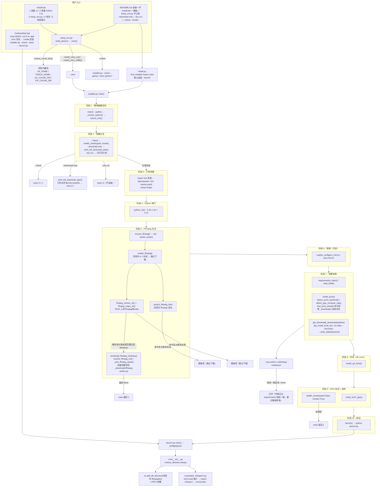

> ## ⚠️ 阅读前提（本文已按 `upgrade/env-torch28` 环境大升级后的代码重写）
>
> 1. **本文不再引用 `installer.py` 的行号。** 环境大升级把 `installer.py` 从约 450 行扩到 966 行，
>    函数大量增删，行号引用会立刻失效。因此凡涉及 `installer.py`、`setup_env.py`、
>    `runtime_libraries.py` 的位置，一律用**函数名 / 常量名**指代（如 `installer.py` 的
>    `install_torch()`）。其余文件的行号均为本次实测所得。
> 2. **安装入口变了**：新栈推荐 `python setup_env.py --python 3.11`（uv + 项目内 `.venv`，不占系统盘）；
>    `install.py` 仍是 `installer.py` 的兼容包装（19 行）；conda 流程没有删除，只是不再是唯一路径。
> 3. **验证边界（重要）**：本次只验证了「代码里写了什么」以及一批**不装依赖**的命令
>    （单元测试、`--check`、`--check --smoke`、`--dry-run`、`setup_env.py --print-env/--check`）。
>    **完整安装尚未在任何机器上执行过**：本机没有 uv、没有 `.venv`，也没有下载过 torch 2.8 轮子。
>    因此「pip 解析结果、cu126/cu128 轮子能否装成、`torchcodec.decoders` 能否真正解码」均标注为
>    ⚠️ 未验证，而不是「可用」。分级验证表见
>    [`../05-guides/08-环境大升级方案.md`](../05-guides/08-环境大升级方案.md) 第八节。
> 4. 仍然只作追溯的内容：**5.3 节的 `third_party/whisperX/` 目录在磁盘上不存在**
>    （「重构 Round 1」删除，P3-21）。

## 一、职责与边界

本主题覆盖「让项目从零跑起来」的全部机器可读事实：`Install.bat` 怎么在 Windows 上一键装好、
`setup_env.py` 如何在项目内建环境、`installer.py` 到底执行了哪些命令、torch 轮子按什么规则选源、
大文件怎么做到"下载与安装分离"（`_downloads/`）、FFmpeg 什么时候跳过下载、
`requirements.txt` 每一行装了什么、`runtime_libraries.py` 为什么必须在 import `torchcodec`
之前跑、`launch.py` 预检了什么、`install.py` 还剩下什么、`.gitignore` 把哪些产物排除掉、
以及三个启动 `.bat` 的真实行为。

它**不**覆盖：`config.example.yaml` 里 API Key / ASR 参数的业务含义（见
[`../04-interfaces/01-配置文件与参数.md`](../04-interfaces/01-配置文件与参数.md)），也不覆盖运行时
各 step 的产物（见 [`../00-overview/02-数据流与中间产物.md`](../00-overview/02-数据流与中间产物.md)）。

> **本项目只在 Windows 下运行。** 原先的 `Dockerfile`、`VideoLingo_colab.ipynb` 与
> `docs/` 里的 Docker 页面已删除，本文也不再涉及容器部署。

**重要边界声明**：本文只描述**代码里写了什么**。本次文档工作实际执行过的命令只有
`python -m unittest discover -s tests`、`python installer.py --check`、
`python installer.py --check --smoke --quiet`、`python installer.py --dry-run`、
`python installer.py --download-only`、`setup_env.py --print-env / --check`、
`cmd /c Install.bat --check` 与若干 `Test-Path`。
**没有**执行任何真正的安装动作（`uv venv`、`pip install`、FFmpeg 下载、GPU 轮子下载），
原因见开头第 3 条。

## 二、文件清单

| 文件路径 | 行数 | 主要职责 |
| --- | --- | --- |
| `setup_env.py` | 319 | **新栈推荐入口**：uv 建 `<项目>/.venv`（无 uv 时回退标准库 `venv`）、把 4 个缓存变量指向项目内、再调用 `installer.py` |
| `installer.py` | 966 | **真实安装脚本**：按显卡算力选 torch 轮子源、装 requirements、FFmpeg 大版本闸门与 7.x 下载、Linux CJK 字体、体检（含 L1 import 冒烟）、按需启动 |
| `runtime_libraries.py` | 193 | 运行期把项目内 `ffmpeg/` 接进 `os.add_dll_directory()` 与 PATH；未设置时用 torch 兜底 `CUDA_HOME`。**导入即生效** |
| `core/__init__.py` | 24 | `core` 包入口调用 `runtime_libraries.setup()`，保证早于 `core.step2_whisperX` 的 `import whisperx`（进而早于 `torchcodec`） |
| `launch.py` | 134 | 启动预检 `preflight()` + 带日志启动 Streamlit；启动前也 `import runtime_libraries` 并 `setup()` |
| `install.py` | 19 | **兼容包装**：`from installer import main`，默认追加 `--launch` |
| `requirements.txt` | 88（**30 条有效项**） | 直接依赖清单。**不含 torch / torchaudio / torchvision**；无 git URL，全部走 PyPI |
| `tests/`（8 个文件，其中 7 个 `test_*.py`） | 1090 | 标准库 `unittest` 回归测试，**89 例**（基线 46 + 环境升级新增 43），不新增依赖 |
| `Install.bat` | 220 | **Windows 一键安装入口**：准备 Python 3.11（`.venv` 复用 → py 启动器 → PATH → uv → winget → 官方安装包）、装 uv、调 `setup_env.py`、跑单元测试、打印启动方式。纯 ASCII，中文输出交给 Python 侧 |
| `core/pypi_autochoose.py` | 118 | PyPI 镜像测速与 `pip config set global.index-url`（现只在 `--auto-mirror` 下被调用） |
| `OneKeyStart.bat` | 45 | 一键启动：`chcp 65001` + `cd /d "%~dp0"` + 解释器选择（`.venv` 优先，conda 回退）+ `installer.py --check --quiet` + `launch.py` |
| `batch/StartBatch.bat` | 30 | 批处理界面：`cd /d "%~dp0.."` + 解释器选择 + `python -m streamlit run "batch\utils\gui.py"` |
| `AudioExtract/Start.bat` | 30 | 音频提取工具：`cd /d "%~dp0"` + 解释器选择 + `run gui.py` |
| `.streamlit/config.toml` | 13 | `maxUploadSize = 4096`、`[client] toolbarMode = "viewer"` |
| `.gitignore` | 217 | 排除 `.venv`、`_model_cache/`、`/.uv-cache/`、`/.pip-cache/`、`/ffmpeg/`、`*.whl`、`logs/` 等 |
| `README.md` | 143 | 面向用户的安装说明，**已按新栈重写**（uv + `setup_env.py` + `--dry-run` + FFmpeg 4–7） |
| `config.example.yaml` | 183 | `version: "2.1.2"`（`:1`）、`model_dir`（`:120`）、`spacy_model_map`（`:155`）等 |

与新栈相关的目录/大文件现状（本次实测）：

| 路径 | 本次实测 | 说明 |
| --- | --- | --- |
| `.venv/` | **不存在** | `setup_env.py` 的目标虚拟环境（也可用 `--venv` 指到别处）；`.gitignore:122` 已忽略 |
| `ffmpeg/`（项目内目录） | **不存在** | `installer.py` 的 `FFMPEG_DIR_NAME = "ffmpeg"`；`.gitignore:161` 已忽略。本次 `--dry-run` 实测走的是系统 FFmpeg 7.0.2（`C:\Program Files\ffmpeg-7.0.2-full_build\bin`），大版本合规 |
| `ffmpeg.exe`（项目根单文件） | **不存在** | 旧的「单文件放根目录」约定仍被 `.gitignore:183` 忽略，但新栈改用 `ffmpeg/` 目录 + `runtime_libraries.py` 自动接入 |
| `torch-2.8.0+<backend>-cp3XX-cp3XX-win_amd64.whl` | **不存在** | 本地离线 whl 的文件名由 `installer.py` 的 `install_torch()` 按**运行中的解释器**（`cp{sys.version_info[0]}{sys.version_info[1]}`）与所选后端拼接，不再写死 `cp310` / `cu118`；`.gitignore:203` 的 `*.whl` 忽略 |
| `_model_cache/`、`.uv-cache/`、`.pip-cache/` | **不存在** | `setup_env.py --print-env` 会输出它们的绝对路径，但**只有真正建环境时才创建** |

## 三、调用链与数据流



`launch.py` 的 `preflight(port)` 检查项：① `streamlit` / `json_repair` / `torch`
能否 import；② `ffmpeg` 与 `ffprobe` 是否在 PATH 上（注意：`preflight()` 之前 `launch.py` 已经先
`runtime_libraries.setup()`，所以项目内 `ffmpeg/` 也会被 `shutil.which()` 找到）；③ 端口占用。
另有 3 条**不阻止启动**的提示：CUDA 可用性与 GPU 名、是否装了 `whisperx`、`config.yaml` 是否存在。

## 四、关键数据结构

### 4.1 `installer.py` 的常量

| 名称 | 值 | 说明 |
| --- | --- | --- |
| `TORCH_VERSION` | `"2.8.0"` | 与 `TORCHVISION_VERSION` 必须同批同源 |
| `TORCHVISION_VERSION` | `"0.23.0"` | whisperx 3.8.6 要求 `torchvision~=0.23.0` |
| `TORCH_SPECS` | `cu126` / `cu128` / `cu129` / `cpu` → `(index_url, 中文标签)` | index 均为 `https://download.pytorch.org/whl/<backend>`；标签里写明了适用架构 |
| `COMPUTE_CAP_RULES` | `(<7.0 → cu126)`、`(<12.0 → cu128)`、`(inf → cu129)` | 依据 pytorch#157517：CUDA 12.8/12.9 构建已移除 Maxwell/Pascal/Volta |
| `PYTHON_MIN` / `PYTHON_MAX` | `(3, 10)` / `(3, 14)` | 即支持 **3.10–3.13**（whisperx 3.8.6 的 `requires_python`） |
| `PYTHON_RECOMMENDED` | `(3, 11)` | 仅用于提示文案 |
| `FFMPEG_MIN_MAJOR` / `FFMPEG_MAX_MAJOR` | `4` / `7` | torchcodec 0.7 只支持 FFmpeg 大版本 4–7 |
| `FFMPEG_WIN_BRANCH` | `"7.1"` | 资产名前缀 `ffmpeg-n7.1` |
| `FFMPEG_DIR_NAME` | `"ffmpeg"` | 项目内目录（`.gitignore:161`） |
| `FFMPEG_API_LATEST` / `FFMPEG_API_LIST` | BtbN/FFmpeg-Builds 的 GitHub Releases API | `latest` tag 与最近 30 个 release |
| `STATE_FILE_NAME` | `".videolingo-install.json"` | 写在 `Path(sys.prefix)`，不在仓库内 |
| `REQUIRED_IMPORTS` | 12 条「导入名 → pip 名」 | `streamlit`、`torch`、`torchaudio`、`whisperx`、`spacy`、`pandas`、`openpyxl`、`cv2`、`librosa`、`pydub`、`json_repair`、`ruamel.yaml`（与旧栈相同） |
| `SMOKE_IMPORTS_CORE` | `whisperx`、`ctranslate2`、`faster_whisper`、`pyannote.audio` | L1 冒烟必测组 |
| `SMOKE_IMPORTS_OPTIONAL` | `demucs.api`、`torchcodec.decoders` | 后者放最后：它依赖 FFmpeg 共享库，是 Windows 上最容易失败的一个 |
| `_GPU_NAME_CAPS` | 名称 → 算力 兜底表 | 老驱动的 `nvidia-smi` 没有 `compute_cap` 字段时按显卡名匹配 |
| `_TORCH_PROBE` | 一段 `-c` 探针源码 | 在子进程里打印 torch 版本、CUDA 可用性、设备名与编译架构 |

### 4.2 `installer.py` 的函数与返回值

| 名称 | 返回 / 行为 |
| --- | --- |
| `run(cmd, retries=1, check=True, env=None)` | 执行命令；失败按 3/6/9…秒（上限 20s）退避重试；`check=True` 时最终 `raise SystemExit` |
| `pip(args, retries=2, check=True)` | 统一加 `--disable-pip-version-check --prefer-binary --retries 5 --timeout 120`，环境含 `PIP_NO_INPUT=1`、`PYTHONIOENCODING=utf-8` |
| `python_ok(version_info=None)` | `PYTHON_MIN <= ver < PYTHON_MAX` |
| `_python_version_label()` | 由 `PYTHON_MAX[1]-1` 推导出的 `"3.10–3.13"` 文案 |
| `requirements_hash()` | sha256(`requirements.txt` 字节 + `torch=2.8.0`)，用于跳过重复安装 |
| `state_path()` / `read_state()` / `write_state(backend="unknown")` | `<sys.prefix>/.videolingo-install.json`；写入 `{requirements_hash, python, torch, torch_backend}`；读失败返回 `{}`，写失败静默 |
| `detect_gpu_compute_cap()` | 第一块 N 卡的算力 `float`（如 `6.1`），无 N 卡返回 `None`；解析 `nvidia-smi --query-gpu=compute_cap`，失败回退 `_compute_cap_from_gpu_name()` |
| `detect_torch_backend(requested="auto", gpu_cap=None)` | `(backend, 中文原因)`；`requested != "auto"` 时原样返回；macOS → `cpu`；算力 `None` → `cpu` |
| `detect_cuda_version()` | 驱动报告的 `(major, minor)`；**只用于提示**，不参与后端选择 |
| `install_torch(backend="auto", dry_run=False)` | 装 `torch==2.8.0 torchaudio==2.8.0 torchvision==0.23.0 --index-url <TORCH_SPECS[backend]>`；Windows + 非 cpu + 同名本地 whl 存在时优先用本地 whl；返回实际使用的后端 |
| `verify_torch_gpu()` | 子进程跑 `_TORCH_PROBE`，返回 `(ok, 描述)`（描述里带编译架构列表） |
| `maybe_configure_mirror(enabled)` | 未显式开启时只打印「ℹ️ 未改动 pip 镜像设置」；开启时 `from core.pypi_autochoose import main`，异常只告警 |
| `parse_ffmpeg_version(text)` / `ffmpeg_version_of(exe)` / `ffmpeg_major_ok(major)` | 版本解析（支持 `n7.1.5-12-g…`、`6.1` 等写法）与大版本 4–7 闸门 |
| `project_ffmpeg_bin()` | 先委托 `runtime_libraries.find_project_ffmpeg_bin()`；导入失败时退化为查 `./ffmpeg`、`./ffmpeg/bin` |
| `_pick_ffmpeg_asset(releases)` | 从 release 列表挑 `ffmpeg-n7.1…win64-gpl*.zip`，**排除 `-shared`**（shared 版只有 DLL、没有 `ffmpeg.exe`） |
| `resolve_ffmpeg_url()` | `(url, 说明)`；顺序：`VIDELINGO_FFMPEG_URL` 环境变量 → `latest` tag → 最近 30 个 release |
| `download_ffmpeg_windows(target_dir)` | 下 zip 并解压到项目内 `ffmpeg/`；成功返回 bin 目录，失败返回 `None` 并打印手动方案 |
| `ensure_ffmpeg(dry_run=False)` | **返回 `(ok, needs_restart)`**；优先级：项目内 `ffmpeg/` → PATH 上的 `ffmpeg`+`ffprobe` → 自动下载（仅 Windows）→ 其他系统给包管理器建议 |
| `install_cjk_fonts()` | 仅 Linux：`fc-match "Noto Sans CJK SC"` 探测 → `apt-get`/`dnf`/`pacman` 装 CJK 包（非 root 加 `sudo`）→ `fc-cache -f` |
| `smoke_imports(quiet=False)` | 逐个 import `SMOKE_IMPORTS_CORE` + `SMOKE_IMPORTS_OPTIONAL`，返回 `[(module, exc)]` |
| `health_check(quiet=False, smoke=False)` | 返回**错误条数**；`quiet=True` 时只打印问题 |
| `_resolve_python(spec)` / `reexec_into(target, argv)` | `--python` 的解析（路径 / 命令名 / `3.11` 交给 uv 或 `py -3.11`）与在目标解释器里重跑本脚本（置 `VIDEOLINGO_INSTALLER_REEXEC=1` 防递归） |
| `build_parser()` / `main(argv=None)` / `launch()` | CLI 定义 / 主流程 / 启动（优先 `python launch.py`，缺失时回落 `python -m streamlit run st.py`） |

### 4.3 `setup_env.py`

| 名称 | 值 / 类型 | 说明 |
| --- | --- | --- |
| `ROOT` | `Path(__file__).resolve().parent` | 项目根；缓存路径全部基于它 |
| `DEFAULT_PYTHON` | `"3.11"` | `--python` 默认值 |
| `SUPPORTED_PYTHONS` | `("3.10", "3.11", "3.12", "3.13")` | `version_supported()` 另接受任意 `3.10`–`3.13` 的补丁号写法 |
| `CACHE_DIRS` | `HF_HOME=_model_cache`、`TORCH_HOME=_model_cache/torch`、`UV_CACHE_DIR=.uv-cache`、`PIP_CACHE_DIR=.pip-cache` | 都是**项目内相对路径**，拼在 `ROOT` 上 |
| `HF_MIRROR` | `https://hf-mirror.com` | `--hf-mirror` 时写入 `HF_ENDPOINT` |
| `build_env(mirror=False, hf_endpoint=None, base=None)` | `dict` | 构造环境变量字典（**不修改** `os.environ`），并加 `PYTHONIOENCODING=utf-8` |
| `apply_env(env)` | 无 | 写回当前进程，供随后调用的子进程继承 |
| `ensure_cache_dirs()` | `list[str]` | 建 `CACHE_DIRS` 里的目录，返回本次新建的相对路径 |
| `find_uv()` | `str` / `None` | PATH → `~/.local/bin` → `~/.cargo/bin` |
| `create_venv_uv(venv_dir, python_version, recreate=False)` | 退出码 | `uv venv <dir> --python <ver> --seed`（`recreate` 时加 `--clear`）。**`--seed` 不可省**：uv 默认不往新环境装 pip，缺了它后面每个 `python -m pip` 都会 `No module named pip`（见第七节「uv venv 不带 pip」） |
| `create_venv_stdlib(venv_dir, recreate=False)` | 退出码 | 没有 uv 时的回退：`python -m venv`，**无法自选 Python 版本** |
| `venv_python(venv_dir)` | `Path` / `None` | 依次找 `Scripts/python.exe`、`bin/python`、`Scripts/python` |
| `version_supported(version)` | `bool` | 3.10–3.13 |
| `build_parser()` | `argparse.ArgumentParser` | 见 5.10 的参数表 |
| `main(argv=None)` | `int` | `--print-env` → 打印 `set "VAR=…"` 行并返回 0；`--check` → 用 `.venv` 的解释器跑 `installer.py --check`；否则建环境后跑 `installer.py --torch-backend <b> --python <venv python>` |
| `print_next_steps(venv_dir, python_exe)` | 无 | 打印解释器、环境目录、三个缓存目录、启动与体检命令 |

### 4.4 `runtime_libraries.py`

| 名称 | 值 / 类型 | 说明 |
| --- | --- | --- |
| `_PROJECT_FFMPEG_DIRS` | `ffmpeg/`、`ffmpeg/bin/` | 项目内候选目录 |
| `_FFMPEG_SUBDIRS` / `_FFMPEG_HEADER` | `("bin", "lib", "")` / `libavcodec/avcodec.h` 两个路径 | 用于找 exe 与头文件 |
| `_iter_project_ffmpeg_candidates()` | 生成器 | 还会展开 `ffmpeg/` 与项目根下 `ffmpeg*` 子目录（解压常见一层 `ffmpeg-n7.1…/`） |
| `find_project_ffmpeg_bin()` | `Path` / `None` | 含 `ffmpeg.exe` 或 `ffmpeg` 的目录 |
| `find_ffmpeg_lib_dir()` | `Path` / `None` | 含 FFmpeg 头文件的目录 |
| `_add_dll_directory(path)` | 无 | `os.add_dll_directory()`；非 Windows 无该属性时跳过；已注册目录去重；失败静默 |
| `_prepend_path(path)` | 无 | 把目录前置进 `PATH`，让 `subprocess` 调的 `ffmpeg` / `ffprobe` 也用同一份 |
| `_set_cuda_home_from_torch()` | 无 | 未设 `CUDA_HOME` 时用 `torch.utils.cpp_extension.CUDA_HOME` 兜底，并注册其 `bin`/`lib64`/`lib` |
| `setup(verbose=False)` | `dict` | 返回 `{platform, project_ffmpeg, project_ffmpeg_lib, system_ffmpeg, dll_dirs}`；幂等 |
| `is_configured()` | `bool` | 本进程是否已接入 |

> `runtime_libraries.py` 末尾**直接调用了一次 `setup()`**：`import runtime_libraries` 即生效；
> `core/__init__.py` 也会显式调用，两条路径都幂等。

### 4.5 `launch.py`

| 名称 | 值 / 类型 | 位置 |
| --- | --- | --- |
| `LOG_DIR` | `Path("logs")` | `launch.py:41` |
| `log_path()` | `logs/videolingo_%Y%m%d_%H%M%S.log` | `launch.py:44-46` |
| `port_in_use(port)` | `bool`（`connect_ex(("127.0.0.1", port)) == 0`） | `launch.py:49-52` |
| `preflight(port)` | `(errors, notes)` 两个 `list[str]` | `launch.py:55-93` |
| 顶部副作用 | `import runtime_libraries; runtime_libraries.setup()` | `launch.py:35-39` |

安装后仍需人工确认的配置键（`config.example.yaml`）：

| 键 | 当前值 | 位置 |
| --- | --- | --- |
| `version` | `"2.1.2"` | `config.example.yaml:1` |
| `model_dir` | `'./_model_cache'` | `config.example.yaml:120` |
| `whisper.model` | `'large-v3'` | `config.example.yaml:41` |
| `whisper.language` | `'zh'` | `config.example.yaml:43` |
| `spacy_model_map` | `en/ru/fr/ja/es/de/it/zh/ko/pt` → `*_core_web_md` / `*_core_news_md` | `config.example.yaml:155` |
| `demucs` | `false` | `config.example.yaml:38` |
| `resolution` | `'0x0'` | `config.example.yaml:94` |

> ⚠️ 仓库里**没有** `config.yaml`（被 `.gitignore:179` 排除）。首次读取时会由
> `core/config_utils.py:39-46` 从 `config.example.yaml` 自动创建，并打印一条 ASCII 提示。
> 注意 `model_dir` 与 `setup_env.py` 的 `HF_HOME` **指向同一个 `_model_cache/`**：删该目录会同时
> 丢掉 WhisperX 模型与 HuggingFace 缓存。

## 五、逐函数/逐模块实现说明

### 5.1 `installer.py` 的主流程（原「八阶段」，新栈下含下载分离与 `--download-only`）

| 阶段 | 位置（函数） | 做什么 | 真实命令 / 调用 |
| --- | --- | --- | --- |
| 1 | `main()` 开头 | **解释器重定向**：`--python` 且未设 `VIDEOLINGO_INSTALLER_REEXEC` 时，`_resolve_python()` 解析目标（完整路径 / 命令名 / `3.11`），不同则 `reexec_into()` | `subprocess.run([<target>, installer.py, <其余参数>])`，转发时**去掉 `--python`**；解析失败打印面板并 `return 1`；未加 `--python` 时这一段是空操作 |
| 2 | `main()` | **短路分支**：`--check` → `--download-only` → `--dry-run` | `--check` → `return 1 if health_check(quiet=args.quiet, smoke=args.smoke) else 0`；`--download-only` → `print_full_download_plan()` 后 `return 0`；`--dry-run` → 打印 Python / 后端 / 依据面板 + `install_torch(..., dry_run=True)` + 仅打印 `pip download` 与 `pip install --no-index --find-links` 两条命令 + `ensure_ffmpeg(dry_run=True)` → `return 0`。**三者都不装东西、不改配置** |
| 3 | `main()` | 引导依赖：只保证 `rich` 可用 | `import rich` 失败 → `pip(["requests", "rich", "ruamel.yaml"], retries=2, check=False)`；`check=False`，**不会中断安装** |
| 4 | `python_ok()` | Python 版本闸门 | `PYTHON_MIN <= sys.version_info[:2] < PYTHON_MAX`，即 3.10–3.13；不过关时面板提示 `python setup_env.py --python 3.11` 并 `return 1` |
| 5 | `ensure_ffmpeg()` | **先确认 FFmpeg 再装几个 GB 的依赖**（且要确认大版本） | `usable_ffmpeg()` 依次判：① 项目内 `ffmpeg/` 命中且大版本 4–7 合规 → **跳过下载**；② PATH 上 `ffmpeg` 命中且合规 → **同样跳过下载**；③ 都没有才 `download_ffmpeg_windows(FFMPEG_DIR_NAME, download_dir)`：压缩包先落到 `_downloads/ffmpeg-win64.zip`（已存在就直接解压，不重新下），`_pick_ffmpeg_asset()` 按 `8.1→8.0→7.1→7.0` 选资产、分支内优先 `-shared`；④ macOS/Linux 打印 `brew install ffmpeg` / `apt` / `dnf` 建议。返回 `(False, _)` 时 `main()` `return 1` |
| 6 | `maybe_configure_mirror()` | 可选：PyPI 镜像测速并写 pip 全局配置 | **默认不动用户环境**（打印「ℹ️ 未改动 pip 镜像设置」）；只有显式 `--auto-mirror` 才 `from core.pypi_autochoose import main as choose_mirror; choose_mirror()`，异常只告警 |
| 7 | `requirements_hash()` / `read_state()` / `install_torch()` / `pip_download()` / `pip_install_local_dir()` / `write_state()` | 安装状态指纹 → 决定是否跳过；不跳过则"先下载、再离线安装" | 指纹 = sha256(`requirements.txt` 字节 + `torch=2.8.0`)；`read_state()` 读到相同值且未 `--force` → 打印「✅ 环境已与 requirements 指纹一致，跳过基础安装」并沿用状态里的 `torch_backend`；否则 `install_torch(...)` → `pip_download("requirements.txt", _downloads/python)` → `pip_install_local_dir(...)`（先 `--no-index --find-links` 离线装，不全才退回在线）→ `write_state(backend)`。⚠️ 状态文件写在 **Python 环境目录** `<sys.prefix>` |
| 7a | `install_torch()` | **按硬件选 torch 轮子源 + 本地文件优先**（阶段 7 的核心） | `detect_torch_backend()` 决定 `cu126/cu128/cu129/cpu`，面板打印后端、依据、GPU 算力、驱动支持的 CUDA 版本；`report_torch_download_plan()` 先打印**每个缺失文件的文件名 / 下载地址 / sha256 / 存放位置**，再用 `local_wheels_for()` 找出 `_downloads/` 里已有的轮子：命中的以**文件路径**形式传给 pip（避免 pip 当成另一个需求再下一份），缺失的才用 `pkg==ver` 并带 `--index-url`；至少一个来自网络时加 `--index-url <TORCH_SPECS[backend]>`，全部命中本地时完全不联网 |
| 8 | `install_cjk_fonts()` | 仅 Linux：装 **CJK** 字体 | `fc-match "Noto Sans CJK SC"` 探测 → 按 `/etc/debian_version`、`/etc/redhat-release`、`/etc/arch-release` 选 `apt-get install -y fonts-noto-cjk` / `dnf install -y google-noto-sans-cjk-fonts` / `pacman -S --noconfirm noto-fonts-cjk`（非 root 加 `sudo`）→ `fc-cache -f` |
| 9 | `verify_torch_gpu()` / `health_check()` | GPU 自证 + 体检 | 子进程验证 torch 能否看到 CUDA；`backend != "cpu"` 却看不到 CUDA 只打印告警（不失败）。随后 `health_check(quiet=False, smoke=True)`：返回错误条数 >0 → 打印「❌ 安装结束但体检发现 N 个问题」并 `return 1` |
| 10 | `main()` 尾部 / `launch()` | 打印完成信息，按需启动 | `if args.launch and not args.no_launch: return launch()`；`launch()` 优先 `subprocess.run([sys.executable, "launch.py"])`，没有该文件时回落 `python -m streamlit run st.py` |

`health_check(quiet=False, smoke=False)` 的检查项（错误 → 影响退出码，告警 → 只打印）：

| 类别 | 判据 | 级别 |
| --- | --- | --- |
| Python 版本 | 不在 3.10–3.13 → 报错；不等于推荐 3.11 → 仅提示 | ❌ / ℹ️ |
| `REQUIRED_IMPORTS` 12 项 | 逐个 `__import__`，任一失败 | ❌ |
| torch / torchaudio | 两者去本地版本后缀后必须相同 | ❌ |
| torch 版本 | 必须等于 `TORCH_VERSION`（2.8.0），否则提示「请运行 python installer.py」 | ❌ |
| torchvision 版本 | 不等于 `TORCHVISION_VERSION` | ⚠️ |
| 算力与编译架构 | `sm_<算力>` 不在 `torch.cuda.get_arch_list()` 里（老卡装了 cu128/cu129） | ⚠️ |
| FFmpeg / ffprobe | 项目内 `ffmpeg/` 优先、其次 PATH；缺任一个 → 报错；版本解析不出 → 告警；大版本不在 4–7 → **报错** | ❌ / ⚠️ |
| Linux CJK 字体 | 有 `fc-match` 但拿不到 Noto | ⚠️ |
| 配置文件 | 缺 `config.yaml` 但有 `config.example.yaml` → 告警；两者都没有 → 报错 | ⚠️ / ❌ |
| `--smoke` 附加项 | `smoke_imports()` 的每一项失败都计入错误；`torchcodec*` 失败时附上「确认 FFmpeg 大版本 4–7 / 放进 `./ffmpeg/bin/`」的提示 | ❌ |

关键事实补充：

- 全部 CLI 参数由 `build_parser()` 定义：`--check`、`--quiet`、`--smoke`、`--dry-run`、
  `--torch-backend {auto,cu126,cu128,cu129,cpu}`（默认 `auto`）、`--python`、`--download-dir`、
  `--download-only`、`--force`、`--auto-mirror`、`--launch`、`--no-launch`。**没有 `--yes`**：`build_parser()` 里留了注释说明
  「本脚本全程非交互（不提问、不确认）」。
- `run()` 有重试（3/6/9…秒，上限 20s）；`pip()` 默认 `retries=2`（即 1 次重试）。
- `needs_restart` 目前**只可能由 `--dry-run` 分支产生**（`ensure_ffmpeg(dry_run=True)` 返回 `(True, True)`），
  真实安装路径下载成功后返回 `(True, False)`：项目内 `ffmpeg/` 由 `runtime_libraries.py` 在运行期自动接入，
  不再要求重启终端（这与旧实现相反，见第七节）。
- 全脚本**没有** conda 相关调用（不创建环境、不装 conda 包）；conda 环境由 `README.md:119-120` 作为
  可选旧路径保留。
- 全脚本**没有** spaCy 模型下载：spaCy 模型由首次运行时的
  `core/spacy_utils/load_nlp_model.py` 在 `spacy.load()` 失败后触发 `spacy.cli.download` 懒下载。
- 全脚本**没有** whisperX 的显式安装步骤：`whisperx==3.8.6` 就在 `requirements.txt:24`。
- `requirements.txt` 里**没有** torch 三件套：由阶段 7a 的 `install_torch()` 按后端从
  `download.pytorch.org` 的对应索引安装。

### 5.2 `requirements.txt` 逐行说明

文件共 88 行：**30 条有效项** + 50 行注释 + 8 行空行（`:19`、`:36`、`:45`、`:56`、`:62`、`:72`、`:77`、`:80`）。
版本约束风格：**4 条 `==` 锁定**（`whisperx`、`pydub`、`openai`、`requests`）、**18 条 `>=,<` 区间**、
1 条仅上限（`tokenizers`）、1 条仅下限（`tos`）、6 条无约束（`plyer`、`yt-dlp`、`autocorrect-py`、
`syllables`、`pypinyin`、`g2p-en`）。**没有任何 git URL**。

「项目直接 import」一列表示仓库 `*.py`（`core/`、`st_components/`、`batch/`、`AudioExtract/`、`tests/`、
根目录脚本）里是否存在该包的 import 语句：

| 行号 | 声明 | 版本约束 | 用途（依据代码/注释） | 项目直接 import |
| --- | --- | --- | --- | --- |
| 24 | `whisperx==3.8.6` | 锁定 | `core/step2_whisperX.py:41` 的 `import whisperx`；`launch.py:87` 只做可用性探测。3.8.6 把 torch 钉在 `~=2.8.0`、torchvision 钉在 `~=0.23.0` | ✅ |
| 27 | `torchcodec>=0.7.0,<0.8.0` | 区间 | whisperx 3.8 的新解码后端，走 **FFmpeg 共享库**。注释写明：0.6.0 没有 `win_amd64` 轮子，而 whisperx 的上限是 `<0.8.0`，0.7.x 只发布过 0.7.0 | ❌（间接） |
| 28 | `ctranslate2>=4.5.0,<5.0.0` | 区间 | faster-whisper 的推理后端（whisperx 依赖链） | ❌（间接） |
| 31 | `numpy>=2.1.0,<2.5.0` | 区间 | `core/step2_whisperX.py:50`；上限 `<2.5` 的理由写在注释里：numpy 2.5.x 起 `requires_python` 变成 `>=3.12`，不设上限会让 3.10/3.11 解析到别的版本 | ✅ |
| 32 | `pyannote-audio>=4.0.4,<5.0.0` | 区间 | whisperx 的 VAD / 说话人分离后端；4.0.7 要求 `torch>=2.8.0`、`torchcodec>=0.7.0` | ❌（间接） |
| 35 | `demucs>=4.1.0,<5.0.0` | 区间 | `core/all_whisper_methods/demucs_vl.py:6-11`（`demucs.api.Separator` 等）。**已从 git 源改为 PyPI**，且不再带 `[dev]` extra | ✅ |
| 40 | `transformers>=4.57.6,<5.0.0` | 区间 | WhisperX 对齐模型 / pyannote 的模型加载；注释说明只能停 4.x —— whisperx 3.8.6 要求 `huggingface-hub<1.0.0`，而 transformers 5.x 要求 `hub>=1.3.0`，两者互斥 | ❌（间接） |
| 41 | `huggingface-hub>=0.36.2,<1.0.0` | 区间 | 显式写下上限，用来锁住 whisperx 的解析结果 | ❌（间接） |
| 42 | `tokenizers<0.24.0` | 仅上限 | 同上，为对齐 transformers 4.x 的兼容区间 | ❌（间接） |
| 43 | `spacy>=3.8.7,<3.9.0` | 区间 | `core/spacy_utils/load_nlp_model.py:2-3` 的 `spacy.load` 与 `spacy.cli.download`；`core/step3_1_spacy_split.py` 的断句 | ✅ |
| 44 | `sentencepiece>=0.2.0,<0.3.0` | 区间 | 传递依赖，无直接 import；显式声明避免解析漂移 | ❌ |
| 47 | `librosa>=0.10.2,<0.11.0` | 区间 | `core/step2_whisperX.py:44`；`_whisperx_load_audio` 失败时用 librosa 兜底解码（`core/step2_whisperX.py:240-243`） | ✅ |
| 48 | `pydub==0.25.1` | 锁定 | `core/all_whisper_methods/whisperX_utils.py:311` 的函数内 import，做音量归一化 | ✅ |
| 51 | `soundfile>=0.13.0,<0.14.0` | 区间 | `core/all_whisper_methods/volcano_asr.py:768` 的函数内 import（测试音生成）；注释说明「缺了会等到跑火山 ASR 时才炸」 | ✅ |
| 58 | `streamlit>=1.49.1,<2.0.0` | 区间 | `st.py`、`st_components/*`、`batch/utils/gui.py`、`AudioExtract/gui.py`。`st.py:358` 用了 1.49 起才有的 `st.image(..., width="stretch")` | ✅ |
| 59 | `openai==1.55.3` | 锁定 | `core/ask_gpt.py:5` 的 `from openai import OpenAI`，走 OpenAI 兼容协议访问 DeepSeek/Qwen/SiliconFlow/火山方舟 | ✅ |
| 60 | `plyer` | 无约束 | `core/step6_generate_final_timeline.py:12` 的 `from plyer import notification`（已包 try/except，无桌面环境只告警） | ✅ |
| 61 | `requests==2.32.3` | 锁定 | `core/all_whisper_methods/volcano_asr.py:11`、`core/ask_gpt.py`、`core/pypi_autochoose.py:3`、`st_components/sidebar_setting.py:32` | ✅ |
| 64 | `pandas>=2.2.3,<3.0.0` | 区间 | step4/5/6 的表格读写、`core/all_whisper_methods/whisperX_utils.py:2`、`batch/utils/*` | ✅ |
| 65 | `openpyxl>=3.1.5,<4.0.0` | 区间 | `pandas.to_excel/read_excel` 的 xlsx 引擎（产物如 `output/log/cleaned_chunks.xlsx`），无直接 import | ❌（pandas 间接） |
| 66 | `opencv-python>=4.10.0,<5.0.0` | 区间 | ⚠️ **全仓库已无 `import cv2`**（本次 grep 无命中），但 `installer.py` 的 `REQUIRED_IMPORTS` 仍要求它 —— 不装就会让 `--check` 返回 1 | ❌ |
| 67 | `PyYAML>=6.0.2,<7.0.0` | 区间 | 无直接 import（配置统一走 `ruamel.yaml`），作为生态依赖 | ❌ |
| 68 | `ruamel.yaml>=0.18.0,<0.19.0` | 区间 | `core/config_utils.py:1`，保留引号/注释地读写 `config.yaml` | ✅ |
| 69 | `json-repair>=0.30.0,<0.50.0` | 区间 | `core/ask_gpt.py:4`（PyPI 包名 `json-repair`，import 名 `json_repair`） | ✅ |
| 70 | `yt-dlp` | **无约束（每次安装取最新）** | `core/step1_ytdlp.py:101`；另外 `:95` 在每次下载前还会 `pip install --upgrade yt-dlp` | ✅ |
| 71 | `autocorrect-py` | 无约束 | `core/step6_generate_final_timeline.py:11` 的 `import autocorrect_py as autocorrect` | ✅ |
| 74 | `syllables` | 无约束 | `core/estimate_duration.py:1`，按音节数估算朗读时长（被 `core/subtitle_trim.py` 使用） | ✅ |
| 75 | `pypinyin` | 无约束 | `core/estimate_duration.py:2`，中文拼音 | ✅ |
| 76 | `g2p-en` | 无约束 | `core/estimate_duration.py:3`，英文 G2P | ✅ |
| 79 | `tos>=2.8.7` | 仅下限 | `core/all_whisper_methods/tos_service.py:83` 的 `import tos`（火山引擎对象存储） | ✅ |

已移除的声明（保留为注释，`requirements.txt:81-88`）：

| 原声明 | 移除理由（注释原文摘要） |
| --- | --- |
| `moviepy==1.0.3` | 旧配音链路遗留（`AudioExtract/audio_extractor.py` 用的是 ffmpeg 子进程）；上游 3.x 也已移除 |
| `replicate==0.33.0` | 早期用 Replicate 跑 Demucs 的遗留；dev 用本地 demucs |
| `resampy==0.4.3` | 由 librosa 传递引入，无需直接 pin |
| `pytorch-lightning` / `lightning` | 过去为 pyannote 的传递依赖而 pin。新栈由 pyannote-audio 4.x 自己声明，**本仓库也没有任何 `import lightning` / `pytorch_lightning`**（本次 grep 无命中） |
| `edge-tts` / `InquirerPy` / `xmltodict` | 上游有、dev 代码里无人引用，不引入 |
| `whisperx @ git+…@v3.2.0`、`demucs[dev] @ git+…` | 两条 git 源整体删除，改走 PyPI（见上表 `:24`、`:35`） |

补充事实：

- **torch / torchaudio / torchvision 不在本文件内**：它们由 `installer.py` 的 `install_torch()` 从
  `TORCH_SPECS` 里对应后端的索引安装（见 4.1、5.1 阶段 7a）。这也是 `requirements.txt` 顶部注释要求
  「这里不写 `--index-url`、也不加本地版本号后缀」的原因。
- `faster-whisper`、`av`、`nltk` 等**不在本文件内**，由 whisperx 的元数据传递引入；注释专门说明了
  「`av` 不手工钉版本」的理由（Windows 上 av 17/18 的 `cp311-abi3` 是稳定 ABI 轮子，3.11+ 通用）。
- 因为不再有 git 依赖，安装全程不需要 `git`（`README.md` 也不再要求装 git）。
- ⚠️ 需人工确认：`pyannote-audio`、`ctranslate2`、`whisperx` 的 pip 解析结果没有在真机上跑过
  （本机无 uv、无 `.venv`），上下界区间是否真能解出一组互相兼容的版本**未验证**。

### 5.3 `third_party/whisperX/` 到底是什么（历史，目录已删除）

> ⚠️ **当前磁盘上不存在 `third_party/` 目录**（本次实测 `Test-Path third_party` → `False`）。它在
> 「重构 Round 1」被删除（见 [`../05-guides/04-已知问题与技术债.md`](../05-guides/04-已知问题与技术债.md) 的
> P3-21）。以下内容保留自删除前的实测，仅供追溯；若你看到该目录，说明工作区里有人手工放回了旧文件。

**当时的结论：它是一个被废弃/残缺的「本地 vendored whisperX」残留目录，既不被安装脚本引用，也没有可用的源码文件。**

| 项目 | 当时的实测事实 |
| --- | --- |
| 目录结构 | `third_party/whisperX/whisperx/`（**只有 `__pycache__/`**）与 `third_party/whisperX/whisperx.egg-info/` |
| 源码 | **缺失**。`whisperx/` 下没有任何 `.py`，只有 9 个 `*.cpython-310.pyc` |
| `PKG-INFO` | `Name: whisperx`、`Version: **3.1.1**` |
| 版本关系 | egg-info 是 **3.1.1**，而当时 `requirements.txt` 装的是 git tag **v3.2.0**；两者不一致 |
| 谁引用它 | **无**。`install.py`（当时）/ `requirements.txt` / 任何 python 源码都没有路径指向它 |
| 处置 | 已随 P3-21 删除。当时运行时 `import whisperx` 解析到的是 git 装在 site-packages 里的 v3.2.0；**新栈下则是 PyPI 的 `whisperx==3.8.6`** |

### 5.4 `Install.bat`：Windows 一键安装

> 本项目只在 Windows 下运行，原先的 `Dockerfile` 与 `VideoLingo_colab.ipynb` 已删除，
> `docs/` 里的 Docker 页面与导航项也一并移除。安装入口统一为 `Install.bat`。

`Install.bat` 共 5 步，可反复运行：

| 步骤 | 行为 | 关键实现 |
| --- | --- | --- |
| 1/5 | 准备 `uv` | `:ensure_uv` —— `where uv` → `winget install astral-sh.uv` → 官方 `install.ps1`；全失败只告警，不中断（`setup_env.py` 会退回标准库 `venv`） |
| 2/5 | 准备 Python 3.11 | `:ensure_python` —— 依次尝试：复用已有 `.venv` → `py -3.11/-3.10/-3.12/-3.13`（`:try_pyver`）→ PATH 上的 `python` → 常见安装位置 `%LocalAppData%\Programs\Python\Python311` → `uv python install` → `winget install Python.Python.3.11` → 下载官方安装包 `/quiet` 静默安装 |
| 3/5 | 建环境 + 装依赖 | 调用 `setup_env.py --python 3.11`，把本脚本收到的参数原样透传（`%*`），失败即跳 `:failed` |
| 4/5 | 单元测试 | `.venv\Scripts\python.exe -m unittest discover -s tests` |
| 5/5 | 完成提示 | 打印 `OneKeyStart.bat` / `launch.py` / `--check --smoke` / `--download-only` 四种用法 |

两个容易踩的坑，脚本里都写了注释说明：

1. **`.bat` 必须是纯 ASCII**。cmd.exe 会在执行到 `chcp 65001` **之前**就解析整个文件，
   所以文件里如果含非 ASCII 字节，在非 UTF-8 代码页上会直接解析失败（实测报
   `'-----' is not recognized as an internal or external command`）。中文输出全部交给
   `setup_env.py` / `installer.py`。
2. **`chcp 65001` 仍然要有**，而且要放在最前面（ASCII 内容之后）。Python 侧会通过
   `easy_util.ensure_utf8_console()` 把 stdout/stderr 切成 UTF-8，控制台代码页不跟着切的话，
   所有中文诊断都会变成乱码。

另外 `if errorlevel` 不能写在 `for ... ( ... )` 块里（延迟展开问题），所以 Python 探测被拆成
`:try_pyver` 子过程逐个 `call`。

### 5.5 大文件下载与安装分离（`_downloads/`）

需求背景：`torch` 的单个 wheel 有 **2.7–3.6 GB**，网络不佳时几乎必然失败。因此把
"下载"与"安装"拆开，并让"本地已有文件优先"。

```bash
python installer.py --download-only     # 只打印清单，不做任何改动
# 用浏览器/迅雷/aria2 把文件下好，放进 ./_downloads/
python installer.py                     # 安装：检测到本地文件就直接用
```

| 机制 | 代码依据 | 说明 |
| --- | --- | --- |
| 目录常量 | `DEFAULT_DOWNLOAD_DIR`、`PIP_DL_CACHE_DIR` | 默认 `_downloads/`，`--download-dir` 可改；`.gitignore` 里是 `/_downloads/` |
| 期望文件名 | `wheel_names_for(backend)`、`current_python_tag()`、`platform_wheel_tag()` | 按官方索引命名规则推出 `torch-2.8.0+cu126-cp311-cp311-win_amd64.whl` 这类名字；`cp3XX` 由**运行中的解释器**推导，不写死 |
| 本地命中 | `find_local_wheel()`、`local_wheels_for()`、`torch_download_plan()` | Windows/macOS 要求文件名精确匹配；Linux 的 manylinux 次版本号不确定，放宽为前缀匹配。**0 字节文件不算命中**（下载中断会留下空文件） |
| 真实下载地址 | `index_wheel_info()` | 自己拼的 `download.pytorch.org/whl/...` 直链实测 **403**；索引页 href 指向的 `download-r2.pytorch.org` 才能下。所以直接解析索引页，并把 `sha256` 一起打印 |
| 用本地文件安装 | `install_torch()` | 已存在的轮子以**文件路径**形式传给 pip（而不是 `torch==2.8.0`），避免 pip 把它当成"另一个需求"再下一份；同时加 `--no-cache-dir` 防止同一份几 GB 的文件在磁盘上留两份 |
| 其余依赖 | `pip_download()`、`pip_install_local_dir()` | 每次安装先 `pip download -r requirements.txt -d _downloads/python`，再 `--no-index --find-links` 离线安装；本地不全才退回在线安装 |
| FFmpeg | `download_ffmpeg_windows()` | 压缩包固定存成 `_downloads/ffmpeg-win64.zip`；已存在就直接解压，不重新下载 |

### 5.6 FFmpeg 的「已有可用版本就跳过下载」

> ⚠️ **「可用」= 大版本 4–7 **且** 带共享库（avcodec-*.dll）。**
> 实机实测：系统装的是 gyan.dev 的 `full_build` 7.0.2 —— 大版本完全合规，
> 但它是**静态**构建，bin 目录里一个 `.dll` 都没有。结果 `import torchcodec.decoders`
> 失败，报 `Could not find module '...libtorchcodec_core7.dll'
> (or one of its dependencies)`。torchcodec 自带 `libtorchcodec_core4..7.dll`，
> 但它们依赖同级的 `avcodec-*.dll`。
> 解决：换 BtbN 的 **7.1 shared** 包（实测 68 MB，解压后 `import torchcodec.decoders`
> 立即成功）。这也是下载优先序列把 **7.x 排在 8.x 前面**的原因 ——
> torchcodec 0.7 只带 `core4..7`，**没有 `core8`**，装了 8.1 shared 一样会失败
> （python 能认出 8.1，但 torchcodec 找不到 `core8.dll`）。
> 判定函数是 `has_shared_av_libs()`；`usable_ffmpeg(require_shared=)` 在 Windows 上
> 默认要求共享库，`ffmpeg_absent_reason()` 负责把原因说清楚。


`ensure_ffmpeg()` 的判断顺序（`usable_ffmpeg()` 实现前两步）：

1. 项目内 `./ffmpeg/` 里有 ffmpeg+ffprobe 且大版本在 **4–7** 内 → 跳过下载；
2. 否则系统 PATH 上有合规版本 → **同样跳过下载**；
3. 都没有才下载：`_pick_ffmpeg_asset()` 按优先序列 `8.1 → 8.0 → 7.1 → 7.0` 选资产，
   同一分支内**优先 `-shared`**（含 `torchcodec` 需要的 avcodec 等动态库），
   没有 shared 才退回非 shared。

`resolve_ffmpeg_url()` 在运行时查 GitHub Releases API（先 `latest` tag，再最近 30 个
release），可用 `VIDELINGO_FFMPEG_URL` 覆盖。**不硬编码链接**的原因（2026-09 实测）：
BtbN 的长期 tag 只有 `latest` 且会被覆盖（现在只剩 8.x/9.0），`7.1`/`7.0.2` 这类 tag
从来不存在，带 7.1 资产的 autobuild tag 会被 GitHub 定期清理。


### 本次实机安装结果（2026-09-18 实测）

`.venv`（Python 3.11.14）+ 全部依赖安装成功，`installer.py --check --smoke` 退出码 **0**：

| 项目 | 实测值 |
| --- | --- |
| 安装后端 | uv（`uv pip install`）；下载了 **179 个包**，1m35s |
| torch | `2.8.0+cu126`，`torch.cuda.is_available()` = **True**，设备 Quadro P2200 |
| 编译架构 | `['sm_61', 'sm_70', 'sm_75', 'sm_80', 'sm_86', 'sm_90']` —— 含本机 sm_61，cu126 选对了 |
| 锁定文件 | `_downloads/requirements.lock.txt`，**192 个包 / 3972 条 sha256** |
| L1 冒烟 | `whisperx` `ctranslate2` `faster_whisper` `pyannote.audio` `demucs.api` `torchcodec.decoders` **全部 ✓** |
| FFmpeg | 项目内 7.1.5 **shared**（系统那版 7.0.2 是静态的，torchcodec 用不了） |

⚠️ 期间踩到并修掉的问题（都已加测试）：
1. `uv venv` 不带 `--seed` → 环境没有 pip → 安装整体失败，且报错路径因缺 rich 又崩一次；
2. `uv pip install` 不接受重复的 `--no-deps`；
3. 带 hash 的锁定文件每一行都以 `\` 续行，早期解析器把 192 个 pin 解析成 0 个；
4. `uv pip sync` 会卸掉锁定文件之外的包（连 pip/setuptools 都删）；
5. 不带 `--torch-backend` 时 uv 解析出的是 PyPI 的 **CPU 版** torch；
6. 静态 FFmpeg 让 `torchcodec.decoders` 加载失败（见 5.6）。

### 5.7 下载产物落点与 `.gitignore` 对照

> 5.5 讲的是"下载与安装分离"的机制，这里补一张"东西到底落在哪"的对照表。

| 路径 | 用途（代码依据） | `.gitignore` 状态 |
| --- | --- | --- |
| `_downloads/`（大文件根目录） | `DEFAULT_DOWNLOAD_DIR`。`--download-only` 打印的清单、torch 轮子、`ffmpeg-win64.zip` 都放这里；`find_local_wheel()` 命中就直接用 | **被忽略**：`/_downloads/` |
| `_downloads/python/` | `pip_download()` 的 `-d` 目录，装 requirements 用的第三方轮子 | 同上（在 `_downloads/` 内） |
| `_downloads/.pip-cache/` | `PIP_DL_CACHE_DIR`，pip 下载缓存 | 同上 |
| `ffmpeg/`（项目内目录） | `FFMPEG_DIR_NAME`。`download_ffmpeg_windows()` 把压缩包解压到这里，`project_ffmpeg_bin()` 负责往里找 `bin/`。运行期 `runtime_libraries.setup()` 接入 DLL 搜索路径并前置进 PATH | **被忽略**：`/ffmpeg/` |
| `ffmpeg.exe`（项目根单文件） | 旧约定。`st.py` 仍把项目根加进 `PATH`，所以放根目录也能被 `shutil.which("ffmpeg")` 命中；但**它不会进 `os.add_dll_directory()`**，torchcodec 仍可能失败。新栈推荐放进 `ffmpeg/bin/` | **被忽略**：`/ffmpeg.exe`、`/ffmpeg`、`/ffprobe.exe`、`/ffprobe` |

其余与安装相关的忽略规则（`.gitignore`）：

| 规则 | 影响 |
| --- | --- |
| `.venv` | 项目内虚拟环境不入库（`setup_env.py --venv` 指到别处时不受此规则约束） |
| `_model_cache/` | 模型缓存（`HF_HOME` = `TORCH_HOME` 的上级）不入库，对应 `config.example.yaml` 的 `model_dir` |
| `/.uv-cache/`、`/.pip-cache/` | 项目内下载缓存不入库（注释写明「可随时删」） |
| `/_downloads/` | 大文件目录不入库：单个 torch 轮子就 2.7–3.6 GB |
| `/ffmpeg/` | installer 解压的 FFmpeg 不入库 |
| `.videolingo-install.json` | `:163` | 状态指纹的**兜底**规则（真正写在 `<sys.prefix>`） |
| `/.cache/` | `:166` | 转录内容寻址缓存（`.cache/asr/`）；注释说明故意放在 `output/` 之外 |
| `logs/` | `:169` | `launch.py` 的运行日志目录 |
| `/output/`、`/history/` | `:154-155` | 运行产物与归档时不入库 |
| `config.yaml` | `:179` | 本地配置（含真实密钥）；模板 `config.example.yaml` 需要提交 |
| `*.whl` | `:203` | 本地 torch wheel |
| `ffmpeg.zip`、`ffmpeg-master-latest-win64-gpl/` | `:209-210` | 旧下载方案的中间物。新方案解压到 `ffmpeg/` 且 zip 用完即删，这两条属历史残留 |
| `runtime/`、`dev/`、`installer_files/` | `:192-194` | 与安装器无关的本地目录；旧文档提到的 `install.py` 注入 `runtime/python` 逻辑在新实现里完全不存在 |
| `*.md` + `!devdocs/` + `!devdocs/**/*.md` | `:215-217` | 忽略所有 Markdown，但**显式放行 `devdocs/`**（顺序不能颠倒） |

### 5.8 三个 `.bat` 与端口（`.venv` 优先，conda 回退）

三个脚本现在是同一套骨架，只差最后一行启动命令：

| 事实 | 说明 |
| --- | --- |
| 代码页与切目录 | 三者都有 `chcp 65001 >nul`（`:2`）与 `cd /d`：`OneKeyStart.bat:6` 是 `"%~dp0"`、`batch/StartBatch.bat:5` 是 `"%~dp0.."`（回到项目根）、`AudioExtract/Start.bat:5` 是 `"%~dp0"` |
| **解释器选择（本次升级的核心改动）** | 先试项目内 `.venv`：`set "VENV_PY=<项目>\.venv\Scripts\python.exe"` + `if exist "%VENV_PY%"` → `set "PY=%VENV_PY%"`；不存在才走 conda 回退：`if exist "%USERPROFILE%\anaconda3\envs\videolingo\python.exe"` → `call "%USERPROFILE%\anaconda3\Scripts\activate.bat" videolingo` + `set "PY=python"` |
| 两个都没有时 | 打印「[错误] 未找到可用的 Python 环境」+「推荐: `python setup_env.py --python 3.11`」（`OneKeyStart.bat:29` 还多一行旧 conda 方式），`pause` 后 `exit /b 1` |
| conda 路径仍硬编码 | 只作为**回退分支**：`%USERPROFILE%\anaconda3\...`。Anaconda 装在非默认位置（如 `D:\anaconda3`）时回退会失败，但 `.venv` 优先路径不受影响 |
| `OneKeyStart.bat`（45 行） | `:36` 先跑 `"%PY%" installer.py --check --quiet`；`errorlevel 1` 时只打印「[提示] 体检发现问题，尝试修复: python setup_env.py」，**不阻止启动**；`:43` 用 `"%PY%" launch.py` 启动（而不是 `streamlit run st.py`），因此会走预检并写运行日志 |
| `batch/StartBatch.bat`（30 行） | `:28` `"%PY%" -m streamlit run "batch\utils\gui.py"`。因为切目录用的是 `%~dp0..`，**从项目根调用 `batch\StartBatch.bat` 也正确**（旧版用 `cd ..` 会退到项目根的父目录） |
| `AudioExtract/Start.bat`（30 行） | `:28` `"%PY%" -m streamlit run gui.py`，**不用 `launch.py`**，因此没有端口预检与日志 |
| 端口 | `launch.py` 默认 `--port 8501` 并传给 Streamlit；三个 `.bat` 都**没有**显式 `--server.port`，所以默认端口 = **8501** |
| 端口冲突 | `launch.py` 的 `port_in_use()` 会**先检查** 8501 是否被占用，占用时直接报错退出（「可能是上一次的 VideoLingo 还在运行」）——不再依赖 Streamlit 的端口自增。⚠️ 三个 bat 各起一个独立 Streamlit 进程，`AudioExtract/Start.bat` 不走 `launch.py`，两个同时启动时的实际行为（Streamlit 自身端口自增）**本次未验证** |
| 上传上限 | `maxUploadSize = 4096`（`.streamlit/config.toml:2`），即 4096 MB ≈ 4 GB |
| 界面工具栏 | `.streamlit/config.toml:13` 的 `[client] toolbarMode = "viewer"` 隐藏 Deploy / 开发者菜单；开发时需要 ⋮ 菜单里的 Rerun 就改回 `"auto"` |
| 文件监听 | `.streamlit/config.toml:3-8` 的注释说明**刻意不动** `fileWatcherType`（保持默认 `auto`）：实测 Streamlit 的 watcher 只监听已导入的 Python 模块，本流水线写 `output/`、重写 `config.yaml` 都不会触发重跑 |

### 5.9 `core/pypi_autochoose.py` 详解（安装期副作用模块）

| 函数 | 位置 | 作用 |
| --- | --- | --- |
| `test_mirror_speed(name, url)` | `:29` | `requests.get(url, timeout=5)` 计时（毫秒），非 200 或异常返回 `inf` |
| `get_optimal_thread_count()` | `:22` | `max(os.cpu_count() - 1, 1)`，用于并发测速 |
| `set_pip_mirror(url)` | `:42` | `[sys.executable, "-m", "pip", "config", "set", "global.index-url", url]` |
| `get_current_pip_mirror()` | `:52` | `pip config get global.index-url` 回读校验 |
| `main()` | `:60` | `ThreadPoolExecutor` 并发测 2 个镜像（`MIRRORS`，`:12-15`）→ `rich` 表格展示 → 选最快 → 写入并回读校验；全不可达时打印「❌ All mirrors unreachable」 |

**副作用**：会**持久修改** pip 全局配置（写入用户级 pip.ini），影响后续所有 pip 操作；校验失败时提示
「Try running with admin privileges」（`:103`）。

> 📌 行为不变：本模块**不再**在安装时无条件运行。`installer.py` 的 `maybe_configure_mirror()` 只在显式传
> `--auto-mirror` 时调用它，默认打印「ℹ️ 未改动 pip 镜像设置（需要时用 --auto-mirror 显式开启）」。
> 这修掉了「装一次项目就永久改掉用户全局 pip 源」的问题。

### 5.10 `tests/` 回归测试

| 文件 | 行数 | 用例数 | 覆盖内容 |
| --- | --- | --- | --- |
| `tests/test_source_language.py` | 84 | 5 | `get_source_language()` 的优先级、`update_key()` 同步 `detected_language`、`load_key_or()` 缺键默认值 |
| `tests/test_media_input.py` | 125 | 10 | `input_manifest` 读写、`find_media_file()` / `find_video_files()` 的过滤与回退 |
| `tests/test_transcription_cache.py` | 140 | 12 | `cache_key()` 身份（引擎/模型/语言/火山参数）、`valid_result()` 校验、损坏/缺文件/schema 不符时当作未命中、`clear_cache()` |
| `tests/test_prompt_contract.py` | 177 | 12 | 提示词与代码读取的 JSON 键契约（如 `topic`） |
| `tests/test_audio_extraction.py` | 154 | 7（含 `skipUnless`，需要 `ffmpeg`/`ffprobe`） | 时间轴对齐标志、`raw.mp3` 直接从源媒体编码、火山 16k/单声道/s16 契约、编码器回退 |
| `tests/test_env_upgrade.py` | 344 | **36（新增）** | `parse_ffmpeg_version()` 的各种写法、`ffmpeg_major_ok()` 的 4–7 闸门、`_pick_ffmpeg_asset()`（默认挑最新分支、分支内优先 `-shared`、跳过 9.x、回退更早 release）、`usable_ffmpeg()` / `ensure_ffmpeg()` **已有可用版本时跳过下载**、`wheel_names_for()`/`find_local_wheel()`/`torch_download_plan()` 的本地复用（含 0 字节文件与跨后端不算命中）、算力 → 后端映射（Pascal→cu126、Volta/Turing/Ampere/Ada→cu128、Blackwell→cu129）、`TORCH_SPECS` 覆盖率、Python 闸门与 `TORCH_VERSION`/`TORCHVISION_VERSION` pin |
| `tests/test_torch_load_shim.py` | 99 | **7（新增）** | `torch.load` 的 `weights_only` 垫片：默认注入 `False`、显式 `True`/`False` 不被覆盖、位置参数透传、重复打桩幂等、保留 `__name__` |
| `tests/__init__.py` | 12 | — | 包标记 |
| 合计 | **1090** | **89** | 标准库 `unittest`，**pytest 不在依赖清单中** |

### 5.11 `setup_env.py` 详解（新栈的推荐入口）

参数（`build_parser()`）：

| 参数 | 默认 | 作用 |
| --- | --- | --- |
| `--python` | `3.11` | 目标 Python 版本，只接受 3.10–3.13（`version_supported()`） |
| `--venv` | `<项目>/.venv` | 虚拟环境目录；指到别处时 4 个缓存仍留在项目内 |
| `--recreate` | 关 | 重建：uv 加 `--clear`，stdlib 回退路径先 `shutil.rmtree` |
| `--no-install` | 关 | 只建环境，不调 installer |
| `--check` | 关 | 不建环境、不安装，用 `.venv` 的解释器跑 `installer.py --check` |
| `--smoke` | 关 | 给上面的 `--check` 追加 `--smoke` |
| `--torch-backend` | `auto` | 原样透传给 `installer.py`（`auto`/`cu126`/`cu128`/`cu129`/`cpu`） |
| `--hf-mirror` | 关 | 设 `HF_ENDPOINT=https://hf-mirror.com` |
| `--print-env` | 关 | 只打印 `set "VAR=…"` 行（供 `.bat` 引用）后返回 0 |

执行顺序（`main()`）：`build_env()` + `apply_env()` → （`--print-env` 直接返回）→ （`--check` 直接返回）
→ 校验 Python 版本 → `ensure_cache_dirs()` → `find_uv()`：

- **有 uv** 且目录已存在且未 `--recreate`：跳过创建并打印现有解释器版本；
- **有 uv**：`create_venv_uv()`；
- **无 uv**：打印安装 uv 的建议（`UV_INSTALL_HINT`）并 `create_venv_stdlib()`，**无法自选 Python 版本**；
- 之后 `venv_python()` 定位解释器 → 设 `VIRTUAL_ENV` → 调
  `installer.py --torch-backend <b> --python <venv python>`（`cwd` 固定为项目根）→ `print_next_steps()`。

本次实测（**不建目录、不装依赖**）：

```text
$ python setup_env.py --print-env
set "HF_HOME=E:\VideoLingoMove\_model_cache"
set "TORCH_HOME=E:\VideoLingoMove\_model_cache\torch"
set "UV_CACHE_DIR=E:\VideoLingoMove\.uv-cache"
set "PIP_CACHE_DIR=E:\VideoLingoMove\.pip-cache"
set "VIDEOLINGO_PYTHON="          # 没有 .venv 时为空
# 退出码 0；执行后 .venv/_model_cache/.uv-cache/.pip-cache 均未创建

$ python setup_env.py --check
# ❌ 未找到虚拟环境：E:\VideoLingoMove\.venv → 请先运行：python setup_env.py；退出码 1
```

⚠️ 需人工确认：`create_venv_uv()`（带 `--seed`）/ `create_venv_stdlib()` / `installer.py --python` 的
「重定向 + 真正安装」链路**本次未执行**（本机没有 uv）。

### 5.12 `runtime_libraries.py` 与 `core/__init__.py`（新栈的 DLL 接入层）

为什么必须有这一层：`torchcodec` 通过 **FFmpeg 共享库**解码音频，而 **Python 3.8 起扩展模块（`.pyd`）
的依赖 DLL 不再从 PATH 解析**，只认 `os.add_dll_directory()` 注册的目录与 DLL 同目录。所以
「把 `ffmpeg.exe` 放进 PATH」对 torchcodec 无效，必须在 import `torchcodec` 之前注册目录。

| 环节 | 行为 |
| --- | --- |
| 项目内 FFmpeg 接入 | `setup()` → `find_project_ffmpeg_bin()`：命中则 `_prepend_path()`（让 `subprocess` 调的 `ffmpeg`/`ffprobe` 也用这一份）+ `_add_dll_directory()` |
| DLL/lib 目录 | `find_ffmpeg_lib_dir()` 找到含头文件的目录后注册，并 `os.environ.setdefault("FFMPEG_DIR", …)` |
| 系统 FFmpeg | 仅当项目内没有时才把系统 `ffmpeg` 所在目录加入 DLL 搜索路径（版本不受本项目控制） |
| `CUDA_HOME` | `_set_cuda_home_from_torch()`：未显式设置时用 `torch.utils.cpp_extension.CUDA_HOME` 兜底，并注册其 `bin`/`lib64`/`lib`（目标场景是「装了 CUDA 版 torch 但没装 CUDA Toolkit」） |
| 幂等 | `_REGISTERED_DLL_DIRS` 去重（重复 `add_dll_directory` 会累积句柄）；`setup()` 可重复调用 |
| 挂载点 | `runtime_libraries.py` 末尾直接 `setup()`；`core/__init__.py` 也显式调用一次。`core/__init__.py` 是**唯一能早于 `core.step2_whisperX` 的 `import whisperx`** 的挂载点（包入口先于子模块执行） |
| 失败行为 | `core/__init__.py` 里整段包 try/except：拿不到 FFmpeg 只打印一行提示到 stderr，不影响非 FFmpeg 功能；真正的失败会由 `installer.py --check --smoke` 的 `torchcodec.decoders` 项给出诊断 |
| 自查 | `python runtime_libraries.py` 会 `setup(verbose=True)` 并打印 platform / 项目内 ffmpeg / 系统 ffmpeg / 已注册 DLL 目录 |

⚠️ 需人工确认：本机没有装 torch/torchcodec，**「`torchcodec.decoders` 能在这套 DLL 注入下 import 成功」
没有被真实验证过**（`--check --smoke` 目前只会报 `No module named 'torchcodec'`）。

### 5.13 `cleanup.py` / `Cleanup.bat`（清理与释放 C 盘）

从 conda 迁到项目内 `.venv` 之后，C 盘上会残留旧环境与运行期自动下载的模型。
`cleanup.py` 负责盘点与清理，`Cleanup.bat` 是 Windows 上的薄封装（同样的
ASCII-only 约定，中文输出交给 Python）。

| 机制 | 说明 |
| --- | --- |
| **默认只扫描** | 不带 `--clean` 时只报告大小，**不删任何东西**（删除不可逆，先看清楚） |
| 两档分级 | `safe`：pip / uv 下载缓存（纯缓存，删了只是下次重下）；`confirm`：模型、`%TEMP%`、`_downloads\`、`ffmpeg\` —— 需要 `--models` / `--all` / `--temp` 显式开启 |
| **模型位置发现** | `hf_cache_hub_dirs()` / `torch_hub_checkpoint_dirs()` 枚举**所有可能位置**：`HF_HOME`、`HF_HUB_CACHE`、`HUGGINGFACE_HUB_CACHE`、`TRANSFORMERS_CACHE`、`TORCH_HOME`、`XDG_CACHE_HOME` 环境变量，加上默认的 `%USERPROFILE%\.cache\{huggingface,torch}`、`%LOCALAPPDATA%\huggingface`，以及项目内 `_model_cache/`。旧版从不设这些变量，所以模型都在默认位置；但万一用户为省 C 盘挪过盘，环境变量也能认出来 |
| **模型归属判定** | `classify_model()` 三分类：① `own` = 本项目（belle-whisper / whisper-large\|medium\|small\|base\|tiny / wav2vec2 / pyannote / speaker-diarization / silero-vad，以及 torch.hub 的 hash 文件名 `955717e8-8726e21a.th`）；② `foreign` = 别的项目（**distil-whisper 必须排在 whisper 规则之前**、sentence-transformers、all-MiniLM、DocLayout、YOLO、HY-MT、GPTQ）；③ `unknown` |
| **`--models` 的边界（最关键）** | `--models` 只选**逐模型挑出来的** `hf_own:*` / `torch_ckpt:*`，**不选**整个缓存目录 `hf` / `torch`。要删整个缓存必须写 `--only hf,torch`，此时 `warn_if_shared()` 会先列出"会一并删掉的别的项目的模型"。这条边界有端到端测试守着（`TestNoSharedDataInModelsSelection`） |
| 优先用官方清理命令 | pip 缓存走 `python -m pip cache purge`、uv 缓存走 `uv cache clean`（`Target.purge_cmd`）；命令失败或不存在才退回直接删目录 |
| **绝不碰 conda** | 不卸载 anaconda/miniconda 本体，不删任何 conda 环境。`conda_environments()` 只用来**报告**旧环境 `videolingo` 是否存在并打印 `conda env remove -n videolingo -y`；其他环境（本机有 `aisummary`、`novelmanager`）只在报告里列出来提醒 |
| 删除结果如实上报 | `Target.remove()` 返回 `(成功?, 说明)`；目录被占用导致删不干净时报告剩余大小（`%TEMP%` 常见） |
| 选项目标 | `--only pip,uv,hf,...`；未知 key 直接拒绝并列可用项 |

本次为"给别的电脑用"做的通用化（原脚本只认几个写死路径）：

1. **模型位置靠发现而不是写死**：不再假设模型在 `~/.cache/huggingface`，而是把
   5 个环境变量 + 3 个默认位置 + 项目内目录全枚举一遍（`HF_HOME` 被设到别的盘也能找到）。
2. **不再整目录删模型**：默认缓存是全机共用的，脚本改为**逐模型列出来并判定归属**，
   只删判定属于本项目的那些。
3. **conda 环境跨安装位置查找**：`anaconda3` / `miniconda3` / `miniforge3` /
   `mambaforge` / `%ProgramData%` 都查，并以 `conda env list` 为准。
4. **旧项目目录**：在桌面、文档、下载、各盘根目录找 `VideoLingo*` 目录，检查其中的
   `_model_cache/`（旧版的 Whisper 识别模型就在这里）。

实测（本机 2026-09-18）：

| 项 | 结果 |
| --- | --- |
| `videolingo` conda 环境 | **已不存在** —— 项目改用 `.venv` 后无需清理 |
| pip 缓存 | 清掉 **13.9 GB**（5368 个文件 / 13926 MB），C 盘可用 17.9 GB → **29.7 GB** |
| uv 缓存 | 3.0 GB（未清，重装时还想复用） |
| 其他 conda 环境 | `aisummary`(455 MB)、`novelmanager` —— 全部保留 |
| 模型发现结果 | HF 缓存里 4 个模型**全是别的项目的**（0 个本项目）；torch.hub 里 2 个权重判为本项目（`wav2vec2_...pth` 360 MB + hash 名 `955717e8-...th` 80 MB） |

## 六、关键参数与配置

安装相关的硬编码参数一览（无 config 键）：

| 参数 | 值 | 位置（常量 / 函数） |
| --- | --- | --- |
| torch / torchaudio | `2.8.0` | `installer.py` 的 `TORCH_VERSION` |
| torchvision | `0.23.0` | `installer.py` 的 `TORCHVISION_VERSION` |
| CUDA 轮子索引 | `cu126` / `cu128` / `cu129` → `https://download.pytorch.org/whl/<backend>` | `installer.py` 的 `TORCH_SPECS` |
| CPU 轮子索引 | `https://download.pytorch.org/whl/cpu` | 同上 |
| 本地 whl 名 | `torch-2.8.0+<backend>-cp3XX-cp3XX-win_amd64.whl`（按运行解释器推导） | `installer.py` 的 `install_torch()` |
| 算力 → 后端 | `<7.0→cu126`；`7.0–11.x→cu128`；`≥12.0→cu129` | `installer.py` 的 `COMPUTE_CAP_RULES` |
| 支持的 Python 范围 | `>=3.10, <3.14`（推荐 3.11） | `installer.py` 的 `PYTHON_MIN`/`PYTHON_MAX`/`PYTHON_RECOMMENDED` |
| 安装状态文件 | `<sys.prefix>/.videolingo-install.json`（字段：`requirements_hash`/`python`/`torch`/`torch_backend`） | `installer.py` 的 `state_path()` |
| **uv 原生路径（默认）** | `uv pip compile requirements.txt --generate-hashes --torch-backend <backend> -o _downloads/requirements.lock.txt` → `uv pip install --python <解释器> -r <lock>` | `uv_lock_requirements()` / `uv_install_locked()`。实测锁定 **192 个包 / 3972 条 sha256** |
| 为什么用 `install -r` 而不 `sync` | `uv pip sync` 会把锁定文件**之外**的包全卸掉 —— 实测它卸掉了 `packaging`，用最小 lock 试跑时连 pip 与 setuptools 都被删 | `uv_install_locked()` docstring |
| 为什么 `--torch-backend` 不能省 | 不带它 uv 解析出的是 **PyPI 上的 CPU 版** `torch==2.8.0`（无 `+cu126` 后缀）；带上才得到 `torch==2.8.0+cu126` | `uv_lock_requirements()`；两种输出实测对比 |
| torch 三件套单独装 | `uv pip install --python <解释器> torch==… torchaudio==… torchvision==… --no-deps --torch-backend <backend>` | `uv_install_torch()`。⚠️ `--no-deps` 只能出现**一次**，重复传 uv 报 `cannot be used multiple times`（实测） |
| uv **没有** `download` 子命令 | 实测 `uv pip download` 报 `unrecognized subcommand`；`uv pip install --target` 写的是**解包后的文件**（`pkg/` + `*.dist-info/`）而非 wheel | `uv_download_requirements()`：有能力时用 pip download，否则退回 `_stdlib_wheel_download()` 纯标准库下载器 |
| pip 统一参数（仅回退路径） | `--disable-pip-version-check --prefer-binary --retries 5 --timeout 120` | `installer.py` 的 `pip()`（后端为 uv 时改用 `uv pip install --python <解释器> --timeout 120`，因为 uv 不认前两个参数） |
| 安装后端选择 | `pip_command()`：① **有 uv → `uv pip`（默认）**；② 无 uv 且解释器自带 pip → `python -m pip`；③ `ensurepip --upgrade` 引导 → 仍用 pip；④ 都没有 → `explain_missing_pip()` 打印可执行修复命令 | `installer.py`。`main()` 在引导 rich **之前**就先跑一次，避免错误被层层盖住 |
| 唯一必须真 pip 的地方 | `require_real_pip()` —— `pip download` 没有 uv 等价物 | `pip_download()`；拿不到 pip 时返回 `None` 并跳过预下载 |
| `pip_download()` 的前置条件 | 需要真正的 pip：`uv pip` **没有 download 子命令**（实测 `error: unrecognized subcommand 'download'`）。拿不到 pip 时它打印一行说明并返回 `None`，跳过预下载，安装照常走网络 | `installer.py` |
| pip 环境变量 | `PIP_NO_INPUT=1`、`PYTHONIOENCODING=utf-8` | 同上 |
| FFmpeg 大版本区间 | `4–7` | `installer.py` 的 `FFMPEG_MIN_MAJOR`/`FFMPEG_MAX_MAJOR` |
| 项目内 FFmpeg 目录 | `./ffmpeg/`（`bin/` 优先） | `installer.py` 的 `FFMPEG_DIR_NAME`、`runtime_libraries.py` 的 `_PROJECT_FFMPEG_DIRS` |
| FFmpeg Windows 分支 | `7.1`（资产名 `ffmpeg-n7.1…win64-gpl*.zip`） | `installer.py` 的 `FFMPEG_WIN_BRANCH`、`_pick_ffmpeg_asset()` |
| FFmpeg 下载地址覆盖 | 环境变量 `VIDELINGO_FFMPEG_URL` | `installer.py` 的 `resolve_ffmpeg_url()` |
| Linux CJK 字体包 | `fonts-noto-cjk` / `google-noto-sans-cjk-fonts` / `noto-fonts-cjk` | `installer.py` 的 `install_cjk_fonts()` |
| 项目内缓存变量 | `HF_HOME=<项目>/_model_cache`、`TORCH_HOME=<项目>/_model_cache/torch`、`UV_CACHE_DIR=<项目>/.uv-cache`、`PIP_CACHE_DIR=<项目>/.pip-cache` | `setup_env.py` 的 `CACHE_DIRS` |
| HF 镜像 | `https://hf-mirror.com`（`--hf-mirror` 时写入 `HF_ENDPOINT`） | `setup_env.py` 的 `HF_MIRROR` |
| 默认虚拟环境 | `<项目>/.venv` | `setup_env.py` 的 `main()` |
| 镜像候选 | 清华 `mirrors.tuna.tsinghua.edu.cn/pypi/web/simple`、官方 `pypi.org/simple` | `core/pypi_autochoose.py:12-15` |
| 启动日志目录 | `logs/videolingo_<时间戳>.log` | `launch.py` 的 `LOG_DIR`/`log_path()` |
| 预检端口 | `8501`（`--port` 可改） | `launch.py` 的 `main()` |
| Streamlit 启动参数 | `--server.port <port> --logger.level error` | `launch.py:111-112` |
| 下载目录 | `DEFAULT_DOWNLOAD_DIR` = `_downloads`（可用 `--download-dir` 改） | 与大文件下载机制配套，见 5.5 |
| FFmpeg 下载优先序列 | `FFMPEG_WIN_BRANCHES` = `("8.1","8.0","7.1","7.0")` | 每个分支内优先 `-shared`，见 5.6 |
| 上传上限 | `4096`（MB） | `.streamlit/config.toml:2` |

安装完成后**仍需人工设置**的运行期配置（安装脚本完全不碰）：`config.example.yaml` 里的 `api.key` /
`api.base_url` / `api.model`（`:3-5`）等多个 provider 块，以及 `asr_engine`、`resolution`、
`volcano_asr.*` 等。⚠️ 本文不转录任何密钥值。

1. **uv 是 pip 的替代品，安装默认走 uv 原生路径**：`uv pip` 本身就是 pip 的兼容层，
   所以装上 uv 之后没有理由让每个包再经过 `python -m pip`。当前实现：
   ① `uv pip compile --generate-hashes --torch-backend <backend>` 生成锁定文件
      （实测 192 个包 / 3972 条 sha256，整个依赖图一次锁死）；
   ② `uv pip install -r <lock>` 安装（**不用 `sync`**：sync 会卸掉锁定文件之外的包，
      实测连 pip / setuptools 都会被删）；
   ③ torch 三件套由 `uv_install_torch()` 带 `--torch-backend` 单独装，本地有轮子则优先本地；
   ④ 锁文件生成失败时退回「先下载到 `_downloads/python` 再离线安装」的 pip 路径。
   **保留 pip 只为一件事**：把依赖下载成真正的 `.whl` 供离线搬运 ——
   `uv pip install --target` 写的是解包文件、`uv` 又没有 `download` 子命令（两者都实测过）。
   没有 uv 的机器上整条 pip 路径仍然可用。
2. **`install.py` 与 `installer.py` 的分工**：`install.py` 只有 19 行，`from installer import main`，   并在 `--check` / `--launch` / `--no-launch` 都未出现时**自动追加 `--launch`**（`install.py:15-18`）。
   所以 `python install.py` 会装完就起服务，而 `python installer.py` **不会**。想只体检用
   `python installer.py --check`（可加 `--smoke`）。
3. **`--force` 的语义**：它只让阶段 7 的**指纹跳过失效**，不是「重装一切」；`install_torch(backend, dry_run)`   **没有** `force` 形参（旧文档里「force 形参从未被使用」的说法随参数一起消失了）。
4. **`--yes` 仍然不存在**：`build_parser()` 中保留注释「本脚本全程非交互（不提问、不确认）」。
5. **安装状态写在环境目录里**（`Path(sys.prefix)`）：在项目内 `.venv` 布局下指纹落在 `.venv/` 内，   删掉 `.venv` 即等价于强制重装；反之，**换一个仓库目录、复用同一个 `.venv`，仍会被判为「已安装」**。
6. **Python 闸门已放宽到 3.10–3.13**（`PYTHON_MIN`/`PYTHON_MAX`）：本次实测本机 Python 3.12.7 顺利通过闸门   并打印出完整干跑计划；本地 whl 名按运行解释器推导 `cp3XX`，旧文档担心的「cp310 wheel 配 3.11/3.12
   解释器」组合已不可能出现。推荐版本仍是 3.11（仅提示，不阻止安装）。
7. **`uv venv` 建出的环境默认没有 pip（实测踩坑）**：uv 的设计是不往新环境装 pip，于是   `python -m pip install ...` 全线 `No module named pip`。更糟的是当时的**报错路径本身也崩了**：
   引导 rich 失败后，`info()`/`panel()` 内部又去 `from rich.console import Console`，抛出的
   `ModuleNotFoundError: No module named 'rich'` 把真正的错误盖掉，用户只看到一条 Traceback。
   现在三层都堵上了：① `create_venv_uv()` 固定带 **`--seed`**（源头预防）；
   ② `installer.py` 的 `pip_command()` 在 `import pip` 失败时用 `python -m ensurepip --upgrade`
   引导（实测可用），再不行退到 `uv pip` 兼容层；③ `info()`/`panel()` 在 rich 缺失时降级为
   纯文本 `print`（并剥掉 rich 标记），保证任何阶段都能把真正的错误打出来。
   还有一个连带约束：`uv pip` **没有 `download` 子命令**，所以拿不到 pip 时 `pip_download()`
   会跳过预下载（打印一行说明），安装本身不受影响，只是少了本地缓存。
8. **FFmpeg 8/9 会让 torchcodec 直接不可用**：`ensure_ffmpeg()` 因此会拒绝 PATH 上的 8.x 并去下载 7.x；   `health_check()` 把「大版本超范围」记为 **error**（不是 warning）。这是本次升级里最容易在旧机器上
   踩到的坑（很多人 PATH 里就是 8.x）。
9. **`health_check()` 对 torch 版本是 error**：torch 不是 2.8.0 时会直接让 `--check` 返回 1，   并提示「请运行 python installer.py」；torchvision 版本不符只记 ⚠️。
10. **只把 `ffmpeg.exe` 放进 PATH 对 torchcodec 无效**：必须是 `os.add_dll_directory()` 注册的目录   （`runtime_libraries.py`）。把合规 FFmpeg 放进 `./ffmpeg/bin/` 是最省事的做法 —— 运行期自动接入，
   **不需要重启终端**（旧实现要求重启并以退出码 1 结束，新实现不再如此）。
11. **`core/step2_whisperX.py` 的 `torch.load` 垫片**：torch ≥2.6 把 `weights_only` 默认值改成 `True`，   会拒掉 pyannote checkpoint 里的 omegaconf 对象；垫片必须在 `import whisperx` **之前**打上
   （`core/step2_whisperX.py:24-39` 定义、`:39` 调用），且只改默认值 —— 调用方显式传 `weights_only=True`
   仍被尊重。该垫片有单元测试锁语义（`tests/test_torch_load_shim.py`）。
12. **`cv2` 仍在 `REQUIRED_IMPORTS`**：全仓库**没有任何 `import cv2`**（本次 grep 无命中），但    `--check` 会因它报错。这是 Round 1/Round 2 删除配音链路后的残留，本次未处理。
13. **`core/step1_ytdlp.py:95` 每次下载前 `pip install --upgrade yt-dlp`**：它会改动**当前解释器**的环境    （新栈下即项目内 `.venv`），使 `requirements_hash()` 的指纹与实际环境不再严格对应；离线环境会打印    Warning 后继续。`yt-dlp` 在 `requirements.txt:70` 也是无约束项。
14. **`model_dir` 与 `HF_HOME` 指向同一个目录**（`_model_cache/`）：WhisperX 模型与 HuggingFace 缓存混放，    删目录时两者一起没（对应 `config.example.yaml:120` 与 `setup_env.py` 的 `CACHE_DIRS`）。
15. **三个 `.bat` 的解释器选择是「存在性判断」**：`if exist .venv\Scripts\python.exe` 命中就用它。    如果 `.venv` 存在但不完整/装坏，**不会**自动回退 conda —— 需要手工删掉 `.venv` 再跑。
16. **改这里会影响谁**：改 `requirements.txt` → `requirements_hash()` 变化、触发一次重装，且必须遵守    顶部注释里的强耦合（whisperx 3.8.6 ↔ torch 2.8 ↔ torchcodec 0.7 ↔ numpy<2.5 ↔ transformers<5）；    改 `TORCH_VERSION` → 必须同步 `TORCHVISION_VERSION`、`torchcodec`、`TORCH_SPECS` 的索引与本地 whl 名，
    并重装 `.venv`；改 `.streamlit/config.toml` → 影响所有界面的上传上限、工具栏与热重载。
17. **`README.md` 已跟上新栈**：`Install.bat` 一键安装 → `Install.bat --download-only` 下大文件 →    算力/后端对照表 → 手工步骤（`setup_env.py` / `installer.py --check --smoke`）→ 三个 bat 的
    `.venv` 优先说明 → FFmpeg 4–7 与 `runtime_libraries.py`。

## 八、扩展点

| 目标 | 改动位置 | 注意事项 |
| --- | --- | --- |
| 让 `install_torch()` 能只重装 torch | `installer.py` 的 `install_torch()` / `main()` | 目前只有整体 `--force` 跳过状态指纹；注意重装 torch 也必须同批重装 torchaudio/torchvision |
| 去掉已无引用的 `opencv-python` | `requirements.txt:66` + `installer.py` 的 `REQUIRED_IMPORTS` | 必须先确认 `batch/`、`AudioExtract/` 也真的没有 `cv2` 用法（本次 grep 全仓库无命中） |
| 让体检不再因 `cv2` 失败 | `installer.py` 的 `REQUIRED_IMPORTS` | 单独摘掉 `cv2` 一行即可；`health_check()` 与 `launch.py` 用的是各自独立的表 |
| 换 FFmpeg 获取方式（离线/内网） | `installer.py` 的 `resolve_ffmpeg_url()` | 已有 `VIDELINGO_FFMPEG_URL` 覆盖；也可直接把合规 FFmpeg 放进 `./ffmpeg/bin/` |
| 让「根目录单文件 ffmpeg.exe」也进 DLL 搜索路径 | `runtime_libraries.py` 的 `_PROJECT_FFMPEG_DIRS` | 目前候选里没有项目根；`st.py:12-17` 只把它加进 PATH，torchcodec 仍可能找不到 DLL |
| 预热 spaCy / Whisper 模型 | 在 `installer.py` 的 `main()` 第 9 段之后新增步骤 | spaCy：`python -m spacy download zh_core_web_md` 等；Whisper：让 `whisperx.load_model(..., download_root=MODEL_DIR)` 先跑一次（调用点见 `core/step2_whisperX.py:210`） |
| 让安装可复现 | `requirements.txt` | git 依赖已全部改 PyPI；剩余空间是区间约束（`demucs`、`transformers`、`numpy` 等未锁死到具体版本） |
| 安装可重复性 | `_downloads/` + 状态指纹 | 大文件下好后可反复重跑而不再联网；`pip_download` 也支持"把目录拷到另一台机器离线装" |
| 统一启动脚本 | 三个 `.bat` | 现已统一 `chcp 65001` + `cd /d` + venv 优先；仍缺显式 `--server.port`，多实例仍会撞 8501 |
| 拆分缓存目录 | `setup_env.py` 的 `CACHE_DIRS`、`config.example.yaml:120` | 两者都指向 `_model_cache`，想分开就改 `TORCH_HOME` 或 `model_dir` |
| 给 `--python` 的解析提速 | `installer.py` 的 `_resolve_python()` | 现在依次尝试「当成路径 → `shutil.which` → `uv python find`（超时 120s）→ `py -X.Y`（超时 60s）」，命中前都算额外等待 |

> 💡 建议：把「FFmpeg 定位」收敛为单一入口（现在有三处：`installer.py` 的 `project_ffmpeg_bin()`、
> `runtime_libraries.py` 的 `find_project_ffmpeg_bin()`、`launch.py` 的 `shutil.which()`），并在 README 的
> 安装章节显式写明「`./ffmpeg/bin/` 是唯一被自动接入的位置」。

## 九、验证方式

本次**实际执行过**的命令与实测输出：

```powershell
# 1) 回归测试（78 例，不需 pytest / 不需 torch）
python -m unittest discover -s tests
# 实测：Ran 78 tests in 2.15s … OK；退出码 0

# 2) 干跑：只打印将执行的命令，不做任何改动
python installer.py --dry-run
# 实测（本机 Quadro P2200，算力 6.1，驱动报告 CUDA 13.0）：
#   torch 后端：cu126 —— CUDA 12.6（Pascal/Volta 及更老架构的最后可用构建）
#   依据：检测到算力 6.1：算力 < 7.0（Pascal/Volta 及更老），cu128/cu129 构建已移除这些架构
#   [dry-run] pip install torch==2.8.0 torchaudio==2.8.0 torchvision==0.23.0 --index-url https://download.pytorch.org/whl/cu126
#   [dry-run] pip install -r requirements.txt
#   ✅ 使用系统 FFmpeg 7.0.2：C:\Program Files\ffmpeg-7.0.2-full_build\bin\ffmpeg.EXE
# 退出码 0

# 3) 体检（本机 base Python 3.12.7 没装任何依赖，退出码 1 属预期）
python installer.py --check
# 实测：1 条 ℹ️（当前 Python 3.12.7；推荐 3.11）、ffmpeg 7.0.2 一行、
#       1 条 ⚠️（尚无 config.yaml）、8 条 ❌
#       （torch / torchaudio / whisperx / spacy / cv2 / librosa / pydub / json_repair）
python installer.py --check --smoke --quiet
# 实测：在上面基础上多出 L1 冒烟失败：whisperx / ctranslate2 / faster_whisper /
#       pyannote.audio / demucs.api / torchcodec.decoders（末条附带 FFmpeg 共享库提示）

# 4) 项目内环境（均不建目录、不装依赖）
python setup_env.py --print-env
# 实测：4 行 set "HF_HOME/TORCH_HOME/UV_CACHE_DIR/PIP_CACHE_DIR=<项目内绝对路径>"
#       + set "VIDEOLINGO_PYTHON="（无 .venv 时为空）；退出码 0
python setup_env.py --check
# 实测：❌ 未找到虚拟环境：E:\VideoLingoMove\.venv；退出码 1
# 执行后 Test-Path .venv / _model_cache / .uv-cache / .pip-cache / ffmpeg / logs 全部为 False
```

以下命令**本次未执行**（遵守「不执行安装命令」的约束），仅作为人工核对步骤：

```powershell
# 5) 真正装一遍（本次未做：机器上没有 uv，也没有下载 torch 2.8 与 cu126 轮子）
python setup_env.py --python 3.11              # uv 建 .venv + 项目内缓存 + 调 installer.py
python setup_env.py --python 3.11 --no-install # 只建环境
python setup_env.py --check --smoke            # 用 .venv 的解释器体检（含 L1 冒烟）
python setup_env.py --recreate                 # 删掉重建
python installer.py --torch-backend cpu --no-launch   # 强制 CPU 轮子、只装不启动
python installer.py --python .venv\Scripts\python.exe --check   # 重定向到别的解释器体检
```

```powershell
# 6) 装完后自检（本次未执行）
.venv\Scripts\python.exe -c "import torch, torchvision; print(torch.__version__, torchvision.__version__, torch.cuda.is_available())"
.venv\Scripts\python.exe -c "import torch; print(torch.cuda.get_arch_list())"   # 老卡应含 sm_61（P2200）
.venv\Scripts\python.exe runtime_libraries.py                                  # 打印已接入的 DLL 目录
.venv\Scripts\python.exe -c "import runtime_libraries, torchcodec.decoders; print('torchcodec ok')"
ffmpeg -version                                                                 # 大版本必须在 4–7
python installer.py --check --smoke                                             # 期望退出码 0
```

```powershell
# 7) 启动（三个入口默认端口都是 8501；每个入口各自新开一个终端）
.\OneKeyStart.bat                            # 项目根执行；内部跑 installer.py --check --quiet + launch.py
python launch.py                             # 等价入口，日志写到 logs\videolingo_<时间戳>.log
cd batch;     .\StartBatch.bat               # 现在可以这样调用（脚本内部用 %~dp0.. 回项目根）
cd AudioExtract; .\Start.bat                 # 仍需在 AudioExtract\ 内执行；它不用 launch.py
# 浏览器：http://localhost:8501
```

```powershell
# 8) 只拿大文件下载地址（网络不佳时用外部工具下好放进 _downloads\）
python installer.py --download-only

# 9) 一键安装（Windows）
Install.bat
```

### 9.1 「从零到能跑」核对清单

| # | 检查项 | 期望结果 | 依据 |
| --- | --- | --- | --- |
| 1 | 项目路径无中文/空格？ | 建议全英文路径 | 代码里大量相对路径与 ffmpeg `subtitles=` 滤镜参数，含空格/中文时 `-vf` 参数解析易出问题 |
| 2 | cwd = 项目根 | `pwd` 为项目根 | `st.py:12-17` 把项目根加入 PATH、`core/config_utils.py:9` 的 `CONFIG_PATH='config.yaml'`；三个 `.bat` 现在自动切目录 |
| 3 | NVIDIA 驱动够新（有 N 卡时） | `nvidia-smi --query-gpu=name,driver_version,compute_cap --format=csv` 有输出 | `README.md:74-79`；`installer.py` 的 `detect_gpu_compute_cap()` 靠它选后端。**不再要求装 CUDA Toolkit / cuDNN** |
| 4 | uv 已安装（或接受 stdlib venv 回退） | `uv --version` 可用 | `setup_env.py` 的 `find_uv()`、`UV_INSTALL_HINT`；无 uv 时无法自选 Python 版本 |
| 5 | 环境已就绪 | `.venv\Scripts\python.exe --version` → 3.10–3.13（默认 3.11） | `setup_env.py` 的 `SUPPORTED_PYTHONS` 与 `installer.py` 的 `PYTHON_MIN`/`PYTHON_MAX` |
| 6 | 旧 conda 路径（可选，仍可用） | `conda create -n videolingo python=3.11` 后 `python installer.py` | `README.md:119-120`；三个 `.bat` 的第二优先分支 |
| 7 | 离线加速（可选） | 项目根存在 `torch-2.8.0+cu126-cp311-cp311-win_amd64.whl`（后端与解释器标签都要对） | `installer.py` 的 `install_torch()`；`.gitignore:203` |
| 8 | `python setup_env.py --python 3.11` 跑完无红色面板 | 末尾面板打印「✅ 项目内环境就绪」 | `setup_env.py` 的 `print_next_steps()` |
| 9 | ffmpeg / ffprobe 大版本合规 | `ffmpeg -version` 大版本在 4–7；不合规时 `./ffmpeg/bin/` 放一份 | `installer.py` 的 `ffmpeg_major_ok()`、`ensure_ffmpeg()`；`runtime_libraries.py` |
| 10 | torch 能用 GPU（有 N 卡时） | `torch.cuda.is_available()` → `True`；`get_arch_list()` 含本机算力 | `installer.py` 的 `verify_torch_gpu()`、`health_check()` 的架构告警 |
| 11 | `import whisperx` 与 `import torchcodec.decoders` 都成功 | 无 ImportError | `core/step2_whisperX.py:41-42`；`installer.py` 的 `SMOKE_IMPORTS_OPTIONAL` |
| 12 | `python installer.py --check --smoke` 退出码为 0 | 打印 `✅ 体检通过` | `installer.py` 的 `health_check()` / `main()` 的 `--check` 分支 |
| 13 | spaCy 目标语言模型可加载（首次会自动下载） | `python -m spacy validate` 能列出 `zh_core_web_md` 等 | `config.example.yaml:155` |
| 14 | `config.yaml` 已填 LLM API Key / base_url / model | `api.key`、`api.base_url`、`api.model` 三项有效（或改用 `VIDEOLINGO_API_KEY` 等环境变量） | `config.example.yaml:3-5`、`core/config_utils.py:86-88` |
| 15 | 缓存都在项目内、C 盘无新增 | `_model_cache/`、`.venv/`、`.uv-cache/`、`.pip-cache/` 都在项目根下 | `setup_env.py` 的 `CACHE_DIRS`；验证步骤见 [`../05-guides/08-环境大升级方案.md`](../05-guides/08-环境大升级方案.md) 第八节 L5 |
| 16 | `resolution` 决定是否真出片 | `0x0`（当前值）时：真实视频**不生成**成片（并会删掉上次遗留的成片），输入是音频则直接跳过压制（旧的黑底占位 `black_screen.mp4` 会原样复制为成片） | `config.example.yaml:94`、`core/step7_merge_sub_to_vid.py:65-88` |
| 17 | `OneKeyStart.bat` 在项目根双击 | 浏览器打开 `http://localhost:8501`；终端出现 `[launch] 📝 运行日志：logs\videolingo_<时间戳>.log` | `OneKeyStart.bat:36-43`、`launch.py:119-120` |

## 十、相关文档

- [`../05-guides/08-环境大升级方案.md`](../05-guides/08-环境大升级方案.md) —— 本次升级的方案、显卡架构矩阵、项目内目录布局、分级验证表与未验证项
- [`01-批量音频提取工具.md`](01-批量音频提取工具.md) —— `AudioExtract/Start.bat` 启动的小工具，依赖同一套解释器选择逻辑
- [`../00-overview/03-快速上手与调试.md`](../00-overview/03-快速上手与调试.md) —— 环境搭建、启动、单步调试
- [`../00-overview/01-项目总览与架构.md`](../00-overview/01-项目总览与架构.md) —— 技术栈与进程模型
- [`../01-entrypoints/01-Streamlit主应用入口.md`](../01-entrypoints/01-Streamlit主应用入口.md) —— `st.py` 与 `OneKeyStart.bat` / `launch.py` 的关系
- [`../01-entrypoints/02-批量模式入口.md`](../01-entrypoints/02-批量模式入口.md) —— `batch/StartBatch.bat`
- [`../02-pipeline/06-字幕压制与成片.md`](../02-pipeline/06-字幕压制与成片.md) —— ffmpeg 在成片阶段的用法与 `h264_nvenc` 探测
- [`../03-subsystems/03-ASR引擎适配层.md`](../03-subsystems/03-ASR引擎适配层.md) —— whisperX / faster-whisper / 模型缓存（`_model_cache`）
- [`../04-interfaces/01-配置文件与参数.md`](../04-interfaces/01-配置文件与参数.md) —— `config.example.yaml` 全部键
- [`../05-guides/05-常见故障排查.md`](../05-guides/05-常见故障排查.md) —— `installer.py --check` / `launch.py` 报错的反查入口
- [`../05-guides/04-已知问题与技术债.md`](../05-guides/04-已知问题与技术债.md) —— 安装脚本相关缺陷与遗留项（含 `cv2` 残留）
- [`../05-guides/06-上游3.0.4合并记录.md`](../05-guides/06-上游3.0.4合并记录.md) —— `installer.py` / `launch.py` 的引入来源
